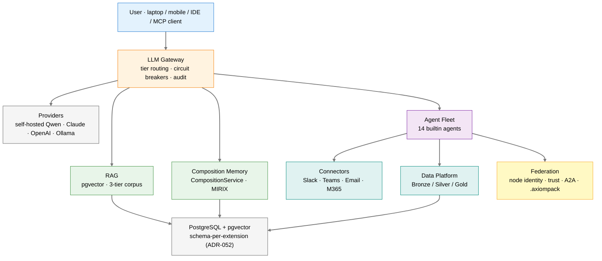

# Axiom

**A domain-agnostic platform for building federated, AI-powered operational systems.**

Axiom is the intelligence substrate — LLM routing, RAG, memory, an agent fleet, federation, and a self-discovering CLI — that domain products build on. Each product brings its own knowledge, agents, and tools; Axiom provides everything underneath. A domain consumer (e.g. a scientific-facility consumer) sits on top as the first layer.

[](https://pypi.org/project/axiom-os-lm/)
[](https://pypi.org/project/axiom-os-lm/)
[](LICENSE)

## Install

```bash
pip install axiom-os-lm
axi config      # onboarding wizard: provisions a local llamafile + model
axi status      # platform health
axi chat        # interactive agent
```

## Architecture



Nodes join the federation independently at any tier — a laptop, a private GPU server behind a VPN, or an HPC cluster for isolated workloads. A domain product (a consumer layer) sits on top, extending the platform through AEOS extensions.

## What Axiom Provides

| Capability | What it is |
|---|---|
| **LLM Gateway** | Multi-provider routing with tier classification, private-network checks, circuit breakers, and audit logging |
| **RAG** | Three-tier corpus (community / organization / personal), pgvector embeddings, hybrid vector + full-text search, grounding hooks |
| **Composition Memory** | `MemoryFragment` with immutable `(T,U,A,R)` provenance and the MIRIX 6-type taxonomy, behind a single `CompositionService` (ADR-026/027) |
| **Agent Fleet** | 14 builtin agents coordinating read → reason → act → publish (see below) |
| **Federation** | Ed25519 node identity, peer discovery, trust graph, `.axiompack` portable knowledge bundles, A2A agent cards |
| **Connectors** | Uniform inbound/outbound connectors for Slack, Teams, Email, and Microsoft 365, with a common descriptor for adding more (ADR-068) |
| **Data Platform** | Medallion ingest + storage via the `data_platform` extension: Bronze sinks, a pgvector vector store, and a source registry (Box and more); heavier lakehouse query tiers (DuckDB / Iceberg) install via the optional `[data-platform]` extra |
| **Scheduling & Secrets** | App-level scheduler with cadences (PULSE) and a pluggable secret/vault backend (KEEP / OpenBao) |
| **Extensions (AEOS)** | Every capability is an extension conforming to the Agent Extension Open Standard; the CLI, MCP catalog, and agents discover them from manifests |
| **CLI** | 40+ purpose-named nouns with availability-aware dispatch (ADR-047) — verbs whose backing service is unreachable are hidden, not broken |

## The Agent Fleet

Agents are LLM personas with deterministic guardrails; the CLI nouns are their purpose-named "arms and legs" (ADR-056 — `axi hygiene`, not `axi tidy`).

| Agent | Role | Primary CLI surface |
|---|---|---|
| **AXI** | Interactive assistant + work routing | `axi chat` |
| **SCAN** | Signal ingestion & extraction (events → structured signals) | `axi signal` |
| **CURIO** | Deep research & knowledge synthesis | `axi research`, `axi knowledge` |
| **PRESS** | Document publishing & content gating | `axi publish` |
| **HERALD** | Outbound comms / multi-channel notifications | `axi notifications` |
| **TIDY** | Workspace & repo hygiene (steward) | `axi hygiene` |
| **RIVET** | CI/CD monitoring & releases | `axi release` |
| **TRIAGE** | Diagnostics & security scanning | `axi doctor`, `axi triage` |
| **GUARD** | Authorization & policy decisions | `axi audit` |
| **KEEP** | Capability tokens & secret/vault management | `axi secrets`, `axi vault` |
| **PULSE** | Scheduling & cadences | `axi schedule` |
| **PLINTH** | Data platform (medallion tiers) | `axi data` |
| **REV-U** | Review workflows | `axi review` |
| **CHALKE** | Classroom orchestration (Keplo) | `axi classroom` |

## Quick Start

```bash
pip install axiom-os-lm

axi config                              # provision local model, write config
axi status                              # health dashboard
axi chat                                # multi-turn agent with tool calling + RAG

axi rag ingest ./docs/                  # index documents into the corpus
axi rag search "how does retry work?"   # hybrid search over the knowledge base

axi connect                             # set up an external connection (Slack/M365/Box/…)
axi federation init                     # create this node's identity and join a cohort
axi doctor                              # AI-assisted diagnostics
```

### Bundled local model

`axi config` provisions a single-binary llamafile and a local weights file in `~/.axi/llamafile/` so the platform runs without a cloud key. Run `axi config --model <name>` to choose a different bundled model; the LLM Gateway routes to self-hosted, private-network, or cloud providers per request tier.

## Extensions (AEOS)

Everything non-core is an extension conforming to the **Agent Extension Open Standard**. The CLI, MCP catalog, and agents discover commands, skills, tools, and agents from an `axiom-extension.toml` manifest:

```toml
[extension]
name = "my-extension"
version = "0.1.0"
description = "What it does"
license = "Apache-2.0"

[[extension.provides]]
kind = "cmd"        # cmd · agent · tool · service · adapter · skill · hook
noun = "myext"
entry = "my_extension.cli:main"
description = "My custom commands"
```

CLI verbs are thin wrappers over skill functions (`(params, ctx) -> SkillResult`, ADR-056), so the same capability is callable from the CLI, from a peer agent over A2A, and from an external harness over MCP. Discovery tiers: builtin (`src/axiom/extensions/builtins/`) → installed PyPI packages → user (`~/.axi/extensions/`). Scaffold one with `axi ext init <name>`; check conformance with `axi ext lint`.

## Domain Products

Axiom is domain-agnostic. Domain products add the knowledge, agents, and tools for their field:

| Product | Domain |
|---|---|
| *(a domain consumer)* | A scientific facility (experiment + processing lifecycle, digital twin) |
| *(your product)* | Any domain |

## Development

```bash
git clone https://github.com/b-tree-labs/axiom-os.git
cd axiom-os
pip install -e ".[all]"

pytest                          # tests (TDD is the house rule)
ruff check src/ tests/          # lint
python -m build                 # wheel + sdist
```

See [CLAUDE.md](CLAUDE.md) for architecture, conventions, and the load-bearing ADRs.

## Documentation

| Document | Description |
|---|---|
| [CLAUDE.md](CLAUDE.md) | Architecture, conventions, ADR index |
| [AEOS spec](docs/specs/spec-aeos-0.1.md) | Agent Extension Open Standard |
| [CLI spec](docs/specs/spec-axi-cli.md) | Full command reference |
| [Federation spec](docs/specs/spec-federation.md) | Multi-node protocol |
| [RAG architecture](docs/specs/spec-rag-architecture.md) | Knowledge retrieval design |
| [Agent architecture](docs/specs/spec-agent-architecture.md) | Agent capabilities |

## Contributing

Contributions are welcome — code, extensions, docs, and good bug reports.

- **[CONTRIBUTING.md](CONTRIBUTING.md)** — setup, the house rules (TDD, AEOS,
  domain-agnostic core), the AI-assisted-contributions policy, and the DCO.
- **[GOVERNANCE.md](GOVERNANCE.md)** — how decisions get made and what we
  optimize for.
- **[SUPPORT.md](SUPPORT.md)** — where to ask questions (best-effort, volunteer-run).
- **[SECURITY.md](SECURITY.md)** — report vulnerabilities privately; supply-chain
  posture and coordinated disclosure.
- **[Code of Conduct](CODE_OF_CONDUCT.md)** — be excellent to each other.

## License

Apache-2.0 — see [LICENSE](LICENSE).

## Acknowledgments

Developed at an academic institution and released as open source under Apache-2.0 with the institution's technology-transfer approval.

_Copyright (c) 2026 The University of Texas at Austin and B-Tree Labs. Apache-2.0 licensed._
