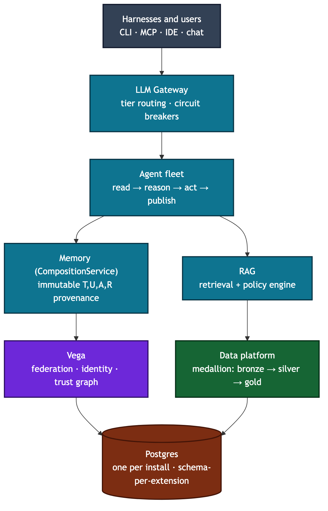
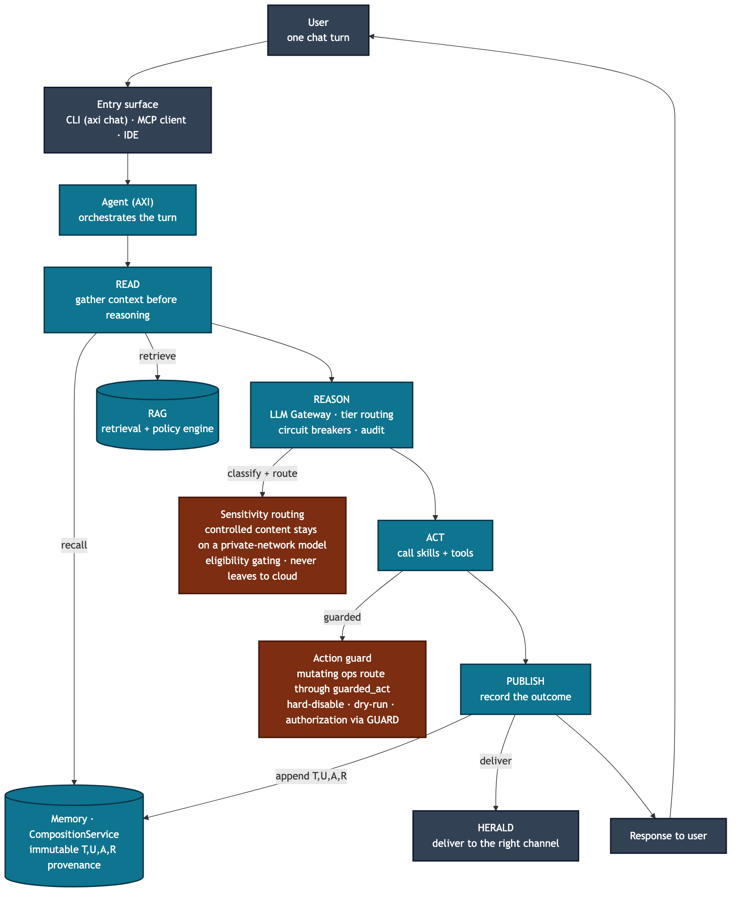
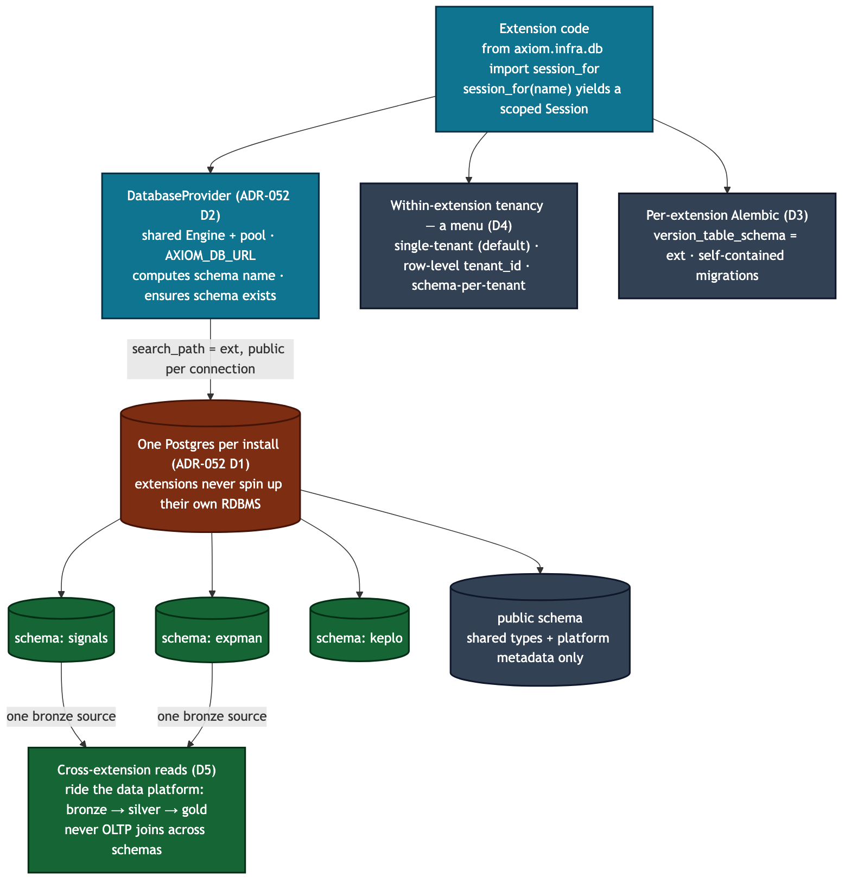
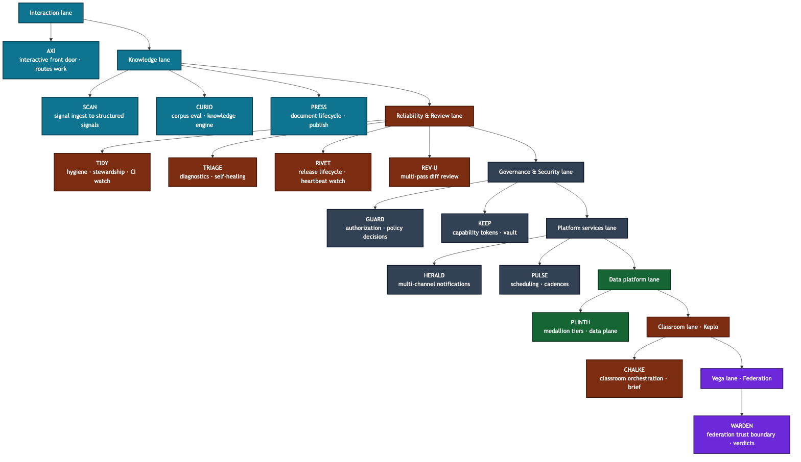

# Axiom

**The governed agent platform for high-consequence operations.**

Most agent platforms optimize for what an agent *can* do. Axiom is built for
teams who also have to answer for what it *did*: research labs, industrial
sites, classrooms, and — increasingly — fleets of physical systems, where
automation has to be provable, bounded, and reversible.

## Why Axiom

Where the field converged on chat loops with tools, Axiom treats
accountability as the platform primitive:

- **Every action runs under a capability-scoped token.** Scheduled or
  interactive, an agent acts inside an envelope issued by the vault — never
  on a bare long-lived API key.
- **Every receipt is queryable memory.** Fires, notifications, replies, and
  edits land as provenance-stamped memory fragments. "Show every scheduled
  action that touched classified data last quarter" is one query, not log
  archaeology.
- **Humans reply where they already are — and it binds back.** Deliveries go
  out over the channels people actually use, and a reply threads back into
  the originating agent's memory context under the same provenance tuple.
- **Graduated autonomy, enforced.** Trust profiles, durable approval gates,
  and identity that reaches every `decide()` call: the agent asks before it
  matters, and the record shows that it asked.
- **Federation across organizational boundaries.** Sovereign nodes,
  classification-aware projection, and accountable humans propagated across
  cohort handoffs. Peers — not shared databases.

## One core, many surfaces

Axiom is a core runtime — gateway, memory, agent fleet, policy, data
platform — with **surfaces** as members of one extension family. The CLI and
chat surfaces ship today; a web application kit builds on the same
primitives; further surfaces (mobile, voice) follow the same pattern. A
product built on Axiom inherits its UI the way it inherits its governance —
from the platform, not from scratch.

Underneath, Axiom stays **domain-agnostic**: each product brings its own
knowledge, agents, and tools as extensions; Axiom provides everything
beneath them — LLM routing, RAG, memory, federation, and a self-discovering
CLI. A domain consumer sits on top as the first layer.

[](https://pypi.org/project/axiom-os-lm/)
[](https://pypi.org/project/axiom-os-lm/)
[](LICENSE)

## Install (60 seconds)

```bash
pip install axiom-os-lm
axi config      # onboarding wizard: provisions a local llamafile + model
axi status      # platform health
axi chat        # interactive agent
```

`axi config` provisions a single-binary llamafile and a local weights file in `~/.axi/llamafile/` so the platform runs without a cloud key. Run `axi config --model <name>` to choose a different bundled model; the LLM Gateway routes to self-hosted, private-network, or cloud providers per request tier.

## Architecture



Harnesses and users reach the platform through one gateway; the agent fleet reasons over memory and RAG; Vega governs federation, identity, and the trust graph; the data platform carries the medallion tiers; everything persists to a single Postgres, one schema per extension (ADR-052).

Nodes join the federation independently at any tier — a laptop, a private GPU server behind a VPN, or an HPC cluster for isolated workloads. A domain product (a consumer layer) sits on top, extending the platform through AEOS extensions.

## What Axiom Provides

| Capability | What it is |
|---|---|
| **LLM Gateway** | Multi-provider routing with tier classification, private-network checks, circuit breakers, and audit logging |
| **RAG** | Three-tier corpus (community / organization / personal), pgvector embeddings, hybrid vector + full-text search, grounding hooks |
| **Composition Memory** | `MemoryFragment` with immutable `(T,U,A,R)` provenance and the MIRIX 6-type taxonomy, behind a single `CompositionService` (ADR-026/027) |
| **Agent Fleet** | 15 builtin agents coordinating read → reason → act → publish (see below) |
| **Federation (Vega)** | Ed25519 node identity, peer discovery, trust graph, `.axiompack` portable knowledge bundles, A2A agent cards |
| **Connectors** | Uniform inbound/outbound connectors for Slack, Teams, Email, and Microsoft 365, with a common descriptor for adding more (ADR-068) |
| **Data Platform** | Medallion ingest + storage via the `data_platform` extension: Bronze sinks, a pgvector vector store, and a source registry (Box and more); heavier lakehouse query tiers (DuckDB / Iceberg) install via the optional `[data-platform]` extra |
| **Scheduling & Secrets** | App-level scheduler with cadences (PULSE) and a pluggable secret/vault backend (KEEP / OpenBao) |
| **Extensions (AEOS)** | Every capability is an extension conforming to the Agent Extension Open Standard; the CLI, MCP catalog, and agents discover them from manifests |
| **CLI** | 50+ purpose-named nouns with availability-aware dispatch (ADR-047) — verbs whose backing service is unreachable are hidden, not broken |

## Key Concepts

### A request is a chat turn



A turn enters from the CLI (`axi chat`) or an MCP client, an agent **reads** (recalls memory and retrieves grounding), **reasons** (the LLM Gateway classifies the request and routes it to the right tier), **acts** (skills and tools; any op that mutates external state passes the action guard), and **publishes** (appends an immutable memory fragment and delivers through HERALD). Content classified as controlled stays on a private-network model and never leaves to a cloud provider; eligibility gating applies at the same seam.

### One database, one schema per extension



Extensions never construct an engine or see a DSN. They call `session_for("<ext>")`; the `DatabaseProvider` hands back a `Session` scoped to the extension's own Postgres schema (`search_path = "<ext>, public"`). One Postgres per install, schema-per-extension isolation, a guided within-extension tenancy menu (single-tenant / row-level `tenant_id` / schema-per-tenant), and cross-extension reads that ride the data platform rather than OLTP joins — all per **ADR-052**.

## The Agent Fleet



Agents are LLM personas with deterministic guardrails; the CLI nouns are their purpose-named "arms and legs" (ADR-056 — `axi hygiene`, not `axi tidy`). Fifteen builtin agents ship with the platform, grouped by lane:

| Agent | Lane | Focus | Primary CLI surface |
|---|---|---|---|
| **AXI** | Interaction | Interactive assistant + work routing | `axi chat` |
| **SCAN** | Knowledge | Signal ingestion & extraction (events → structured signals) | `axi signal` |
| **CURIO** | Knowledge | Auto-research & corpus evaluation — quality gating, confidence learning, knowledge-pack lifecycle | agent; gates the RAG corpus |
| **PRESS** | Knowledge | Document lifecycle (draft → standards → publish) | `axi publish` |
| **TIDY** | Reliability & Review | Workspace, repo & doc-standards hygiene, service health, CI watch (steward) | `axi hygiene` |
| **TRIAGE** | Reliability & Review | AI-assisted diagnostics & self-healing | `axi doctor`, `axi triage` |
| **RIVET** | Reliability & Review | Release lifecycle & CI/heartbeat monitoring | `axi release` |
| **REV-U** | Reliability & Review | Multi-pass diff review | `axi review` |
| **GUARD** | Governance & Security | Authorization & policy decisions (the sole decision point) | `axi audit` |
| **KEEP** | Governance & Security | Capability-token lifecycle + credential chaining | `axi vault` |
| **HERALD** | Platform services | Outbound multi-channel notifications | `axi notifications` |
| **PULSE** | Platform services | Scheduling & cadences | `axi schedule`, `axi calendar` |
| **PLINTH** | Data platform | Medallion data platform (Bronze/Silver/Gold) | `axi data` |
| **CHALKE** | Classroom (Keplo) | Classroom orchestration & instructor brief | `axi classroom` |
| **WARDEN** | Vega (Federation) | Federation trust boundary — peer-state transitions, signature verification, classification policy, trust-graph queries | `axi federation`, `axi nodes` |

WARDEN is Vega's federation-governance agent (Verifier · Enforcer · Gatekeeper · Arbiter); its verdicts are deterministic and auditable. The federated research and knowledge-observatory surfaces (`axi research`, `axi knowledge`, `axi security`) live on the same federation extension.

## Extensions (AEOS)

Everything non-core is an extension conforming to the **Agent Extension Open Standard**. The CLI, MCP catalog, and agents discover commands, skills, tools, and agents from an `axiom-extension.toml` manifest:

```toml
[extension]
name = "my-extension"
version = "0.1.0"
description = "What it does"
license = "Apache-2.0"

[[extension.provides]]
kind = "cmd"        # one of eight kinds: agent · tool · cmd · service · adapter · skill · hook · prompt
noun = "myext"
entry = "my_extension.cli:main"
description = "My custom commands"
```

AEOS defines exactly **eight capability kinds** — `agent`, `tool`, `cmd`, `service`, `adapter`, `skill`, `hook`, `prompt`. CLI verbs are thin wrappers over skill functions (`(params, ctx) -> SkillResult`, ADR-056), so the same capability is callable from the CLI, from a peer agent over A2A, and from an external harness over MCP. Discovery tiers: builtin (`src/axiom/extensions/builtins/`) → installed PyPI packages → user (`~/.axi/extensions/`), with later tiers shadowing earlier ones for the same noun. Scaffold one with `axi ext init <name>`; check conformance with `axi ext lint`.

## Where Things Live

```
axiom/
  src/axiom/
    memory/              # MemoryFragment, CompositionService, ownership, policy
    vega/                # Vega (federation + identity), pre-extraction staging per ADR-031
      federation/        #   cohort registry, A2A, trust graph, classification; hosts WARDEN
      identity/          #   keypair, signatures, principals
    extensions/builtins/ # the domain-agnostic builtin extensions (one dir per extension)
    infra/               # gateway, orchestrator, prompt registry, DatabaseProvider (session_for)
    rag/                 # retrieval store, hybrid search
    policy/              # scope policy engine + agent-action guard
  docs/                  # map: docs/README.md · standard: docs/conventions/doc-standards.md
    adrs/                # Architecture Decision Records (the WHY)
    prds/                # Product Requirement Documents (the WHAT)
    specs/               # Technical specifications (the HOW)
    conventions/         # portfolio standards (doc-standards, the-axiomatic-way)
    templates/           # skeletons for new PRDs / specs / ADRs
    papers/ working/     # published research; drafts, audits, design notes
    assets/diagrams/     # rendered PNG diagrams authored in Mermaid
  packages/              # sibling distributions (axiom-tests, design tokens, data-platform ext)
  runtime/               # instance-specific data (gitignored)
  tests/                 # cross-cutting tests (extension tests live alongside their code)
```

`vega/` is the federation and identity layer — the substrate WARDEN governs — staged inside the repo ahead of its extraction to a standalone product (ADR-031 Phase 3).

## Domain Products

Axiom is domain-agnostic. Domain products add the knowledge, agents, and tools for their field:

| Product | Domain |
|---|---|
| *(a domain consumer)* | A scientific facility (experiment + processing lifecycle, digital twin) |
| *(your product)* | Any domain |

## Development

```bash
git clone https://github.com/b-tree-labs/axiom-os.git
cd axiom-os
pip install -e ".[all]"

pytest                          # tests (TDD is the house rule)
ruff check src/ tests/          # lint
python -m build                 # wheel + sdist
```

See [AGENTS.md](AGENTS.md) for architecture, conventions, and the load-bearing ADRs.

## Documentation

| Document | Description |
|---|---|
| [AGENTS.md](AGENTS.md) | Architecture, conventions, ADR index (the canonical context file; per-harness files are kept in sync from it) |
| [Docs map](docs/README.md) | One folder per document kind — where everything lives |
| [Doc standards](docs/conventions/doc-standards.md) | The portfolio-wide documentation standard (audited by `axi hygiene stat docs`) |
| [Spec index](docs/specs/README.md) | Every current spec, grouped by area (start at the memory stack) |
| [AEOS spec](docs/specs/spec-aeos-0.1.md) | Agent Extension Open Standard |
| [CLI spec](docs/specs/spec-axi-cli.md) | Full command reference |
| [Federation spec](docs/specs/spec-federation.md) | Multi-node protocol |
| [RAG architecture](docs/specs/spec-rag-architecture.md) | Knowledge retrieval design |
| [Agent architecture](docs/specs/spec-agent-architecture.md) | Agent capabilities |

## Contributing

Contributions are welcome — code, extensions, docs, and good bug reports.

- **[CONTRIBUTING.md](CONTRIBUTING.md)** — setup, the house rules (TDD, AEOS,
  domain-agnostic core), the AI-assisted-contributions policy, and the DCO.
- **[GOVERNANCE.md](GOVERNANCE.md)** — how decisions get made and what we
  optimize for.
- **[SUPPORT.md](SUPPORT.md)** — where to ask questions (best-effort, volunteer-run).
- **[SECURITY.md](SECURITY.md)** — report vulnerabilities privately; supply-chain
  posture and coordinated disclosure.
- **[Code of Conduct](CODE_OF_CONDUCT.md)** — be excellent to each other.

## License

Apache-2.0 — see [LICENSE](LICENSE).

## Acknowledgments

Developed at an academic institution and released as open source under Apache-2.0 with the institution's technology-transfer approval.

_Copyright (c) 2026 The University of Texas at Austin and B-Tree Labs. Apache-2.0 licensed._
