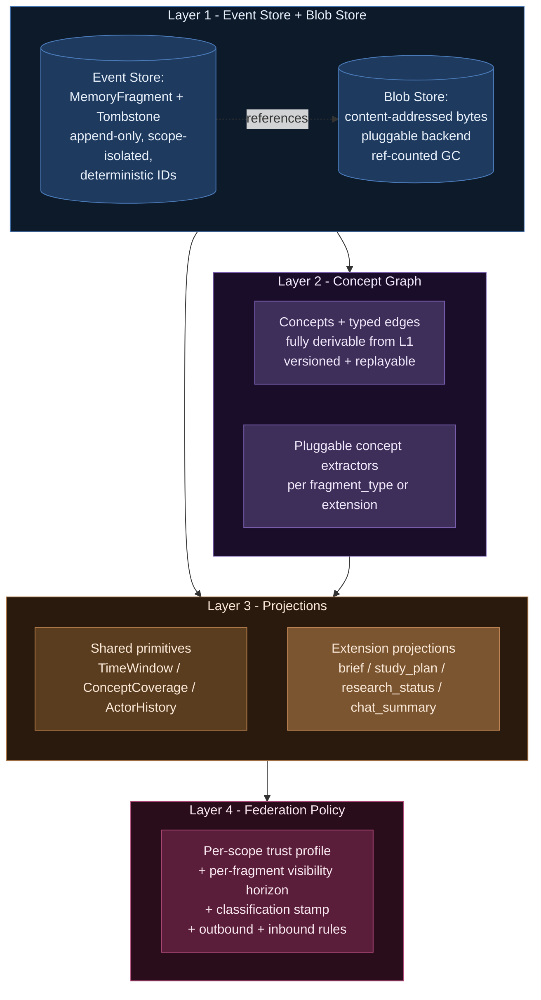

# ADR-033: Layered Memory Architecture — Event Log + Concept Graph + Projections + Federation Policy

**Status:** Proposed (2026-04-25)
**Supersedes:** none (extends ADR-026, ADR-027, ADR-028)
**Related:** ADR-026 (ownership), ADR-027 (federated memory — addressing + propagation mechanics), ADR-028 (trust graph), ADR-031 (extension self-containment), `spec-federation-policy.md` (canonical reference for `VisibilityHorizon` + `ClassificationStamp` + `TrustProfile` + `FederationGateway` — the policy primitives this ADR introduces)

## Context

Axiom today has a strong memory primitive layer (`MemoryFragment`, `CompositionService`, `ArtifactRegistry`, MIRIX 6-type taxonomy, `(T, U, A, R)` provenance, `AccessGraphs`, `AuditLog`, `TrustGraph`). Extensions, however, build their own bespoke stores on top: the classroom extension has `ClassroomInteractionStore`, `ClassroomMaterialsStore`, `BriefStore`, `ThreadStore`, etc., each re-inventing read/write paths, projections, and federation semantics.

The end-to-end review of the classroom memory experience (working notes: `docs/working/classroom-memory-end-to-end-review-2026-04-25.md` — to be filed alongside this ADR) surfaced three structural problems:

1. **Briefs and other derived views are stored, not projected.** Each derivation is materialized, signed, and aged. Re-deriving against a different time window or task means re-implementing the derivation; there's no shared projection primitive.
2. **There is no concept graph.** Retrieval is keyword-based (FTS) at best. "How is X related to Y?" cannot be answered without the relations being made first-class somewhere.
3. **Federation policy is per-extension.** Each extension implements (or fails to implement) its own outbound + inbound rules. There is no shared trust-profile primitive that says "this scope shares aggregate concept stats with peers; never raw fragments."

Worse, these problems generalize. Future extensions — the chat assistant's working memory, CURIO's research-loop history, agent self-reflection logs, downstream domain consumers — face the same three gaps and will solve them differently if we don't decide now.

The Vasundra Srinivasan **Deterministic Projection Memory (DPM)** paper formalizes the principle: append-only event log + task-conditioned projection at decision time delivers deterministic replay, auditable rationale, multi-tenant isolation, and statelessness as natural consequences of the architecture. **Cognee** (Apache-2.0, v1.0) provides production-quality NodeSet + memify primitives that fit the L2 graph slot cleanly behind a sovereign provenance + federation layer (per `project_cognee_assessment`). The classroom RAG-rebuild plan (`project_rag_rebuild_architecture`) and Prague's vector-plus-graph commitment (`project_prague_rag_both_vector_and_graph`) both presuppose primitives Axiom doesn't yet expose.

This ADR commits Axiom to a four-layer memory architecture that all extensions share, with explicit boundaries and a migration path that does not break Prague.

## Decision

Adopt a four-layer memory architecture in `axiom.memory` that every extension consumes through declared protocols. Each layer is independently swappable; each is content-addressed and append-only at its persistent surface.



### Layer 1 — Event Store + Blob Store

**Already exists, mostly:** `MemoryFragment` (fragment_id, MIRIX type, scope, principal, timestamp, payload, provenance), `ArtifactRegistry` (SQLite-backed, content-addressed, signed), `Tombstone` semantics partially in classroom — promote to core.

**Adds:**
- `BlobStore` protocol with `FilesystemBlobStore`, `SeaweedFSBlobStore` (post-Prague, per `feedback_no_minio`), `EncryptedBlobStore` wrapper (domain-consumer profile).
- `MemoryFragment.blob_refs: list[BlobHash]` — fragments reference blobs by hash; blobs are GC'd against the live fragment set with retention policy.
- Per-scope isolation enforced at the store level. `EventStore.list(scope=...)` is the only listing primitive; cross-scope reads require explicit federation gateway.

**Why split the blob from the fragment:** small frequent events (asks, conversation turns, sim parameter changes) live efficiently in SQLite; large content (uploaded materials, simulation outputs, paper PDFs, model weights) lives in the blob backend appropriate to the deployment profile. Splitting also lets the federation gateway in L4 strip blob refs while keeping fragment metadata, which is the v0 default-deny posture for raw content.

### Layer 2 — Concept Graph

**Does not exist today.** Adds `axiom.memory.graph`:

```python
@dataclass(frozen=True)
class Concept:
    concept_id: str          # deterministic hash of canonical form
    canonical_name: str
    extracted_from: list[str]   # fragment_ids — provenance back to L1
    confidence: float

@dataclass(frozen=True)
class ConceptEdge:
    from_concept: str
    to_concept: str
    edge_type: str           # extension-defined: "related_to", "depends_on", "supports", "contradicts"
    weight: float
    evidence: list[str]      # fragment_ids supporting this edge

class ConceptGraph(Protocol):
    def upsert_concept(self, c: Concept) -> None: ...
    def upsert_edge(self, e: ConceptEdge) -> None: ...
    def neighbors(self, concept_id: str, *, hops: int = 1, edge_types: set[str] | None = None) -> list[Concept]: ...
    def query(self, q: GraphQuery) -> list[Concept]: ...
    def snapshot_at(self, timestamp: str) -> "ConceptGraph": ...   # replayability

class ConceptExtractor(Protocol):
    """Each extension provides one or more, registered against fragment types."""
    def extract(self, fragment: MemoryFragment) -> list[Concept]: ...
    def link(self, fragment: MemoryFragment, existing: ConceptGraph) -> list[ConceptEdge]: ...
```

**Cognee is a candidate L2 backend, not a committed adoption.** The protocols above are Axiom-owned regardless. A separate study (`docs/working/cognee-vs-build-study.md`) evaluates which Cognee components to adopt vs. implement ourselves, with the decision deferred until that study completes. The migration plan below is structured so Stage 2 can ship with either choice — what matters is that the protocol surface is in place. Likely outcome: own the storage + protocol + provenance + federation glue; selectively adopt extraction-pipeline ideas; defer hybrid-retrieval algorithm choice to measurement on real data.

**Extractors are extension-declared:**
- text-heavy extensions register an LLM-based topic extractor;
- code-aware extensions register an AST-based extractor;
- structured-payload extensions (simulation runs, lab results) register a schema-driven extractor;
- extensions can register multiple extractors for different fragment types.

**Graph is fully derivable from L1.** `rebuild_graph(scope, since=...) -> ConceptGraph` lets an extension recompute its graph from scratch by replaying events. This is the DPM determinism property generalized to the graph layer.

### Layer 3 — Projections

**Does not exist as first-class.** Today, classroom briefs, summary_for_student, hot-topic histograms, instructor brief, etc., are bespoke functions writing or returning bespoke types. Replace with:

```python
@dataclass(frozen=True)
class TaskSpec:
    """Generic descriptor — extensions subclass for typed parameters."""
    task_type: str
    scope: ScopeId
    parameters: dict
    as_of: str | None = None     # time-travel point; None = now

class Projection(Protocol[T]):
    """Pure function: (events, graph, task) -> typed result."""
    def project(self, task: TaskSpec, *, store: EventStore, graph: ConceptGraph) -> T: ...

# Shared primitives every extension composes with:
class TimeWindowProjection(Projection[list[MemoryFragment]]): ...
class ConceptCoverageProjection(Projection[dict[str, int]]): ...
class ActorHistoryProjection(Projection[list[MemoryFragment]]): ...
class RecentActivityProjection(Projection[ActivitySummary]): ...
```

**Two contracts make projections useful:**
1. **Pure** — same `(events, graph, task)` always yields the same result. Cacheable, replayable, auditable.
2. **Composable** — extension projections (classroom brief, research-loop status, chat working-memory window) are compositions of the shared primitives, not from-scratch reimplementations.

**The brief-as-projection insight applied generally:** stop materializing derived views as their own stored artifacts. Compute them on demand against the live event log. The cache (where one is needed for performance) is keyed by `hash((scope, task, as_of, log_head))` and is disposable.

### Layer 4 — Federation Policy

**Partially exists:** `PolicyCoord`, `TrustGraph` ship; but per-fragment visibility horizon, classification stamp, and projection-aware outbound rules don't. The full primitive set is specified in the *Federation + classification primitives — protocol additions* section below; here is the gateway shape:

```python
@dataclass(frozen=True)
class TrustProfile:
    scope: ScopeId
    horizon_policies: dict[VisibilityHorizon, OutflowRule]
    inbound_policy: InboundRule

@dataclass(frozen=True)
class OutflowRule:
    when_outflow_allowed: bool
    project_as: str       # "concepts_only" | "full" | "per_request_full"

@dataclass(frozen=True)
class InboundRule:
    accept: str           # "ignore" | "concepts_only" | "full"

class FederationGateway:
    """Applies the trust profile when projecting to peers + accepting from peers."""
    def project_for_peer(
        self,
        projection: Projection,
        task: TaskSpec,
        peer_id: str,
        *,
        max_hops: int = 1,
    ) -> Projection: ...
    def accept_from_peer(
        self,
        incoming: SignedProjection,
        peer_id: str,
    ) -> AcceptDecision: ...
```

**Per-fragment visibility horizon** is set at write time (default per fragment-type, extension-overridable per call). Default-deny posture: every fragment-type defaults to `SCOPE_INTERNAL` unless the extension's manifest declares a stronger default. Promotion to higher horizons is always an explicit operator or extension action.

**Federation gateway re-projects before signing.** A peer requesting your scope's concept graph gets a freshly-computed projection that strips fragments above their trust level, signs the result, and sends. The signature carries the trust assertion; the projection function carries the policy. The interaction with `ClassificationStamp` is detailed in the protocol-additions section: classification trumps visibility, always.

## Profiles — making sure this works for any node

Three extension profiles motivate and stress-test the abstraction. Implementations vary at the protocol boundaries; the four layers do not.

### Profile A — collaborative learning extension (high-volume small text events; modest blob store; cohort federation)

| Layer | Notes |
|---|---|
| L1 events | ask, brief_approval, quiz_answer, retract — small JSON, very frequent |
| L1 blobs | uploaded materials (PDF / md), modest size, content-addressed |
| L2 graph | LLM-extracted concepts from materials + question text; "related_to" edges from co-occurrence |
| L3 projections | brief (per period), study_plan (per target), peer_signal (per concept), memory_view (per principal) |
| L4 federation | concepts shareable across peer cohorts; raw asks never leave; instructor-uploaded materials shareable, student-submitted private |

### Profile B — research-loop extension (low-volume large structured events; large blob store; cross-lab federation)

| Layer | Notes |
|---|---|
| L1 events | hypothesis_proposed, experiment_run, finding_recorded — fewer but each carries blob refs to large datasets |
| L1 blobs | simulation outputs, raw measurements, paper drafts — gigabytes per event possible |
| L2 graph | schema-driven concept extraction (variable names, dependencies, citations); plus LLM extraction over text fields |
| L3 projections | research_status (per project), blocker_timeline (per investigator), related_findings (per concept) |
| L4 federation | pre-publication tag (cohort-only) until explicit `published`; raw datasets always per-request even when concepts cross |

### Profile C — chat / agent working memory (very high volume small text; ephemeral; sometimes federated for shared agents)

| Layer | Notes |
|---|---|
| L1 events | conversation_turn, tool_call, agent_decision — very frequent, small |
| L1 blobs | rare — occasional uploaded image or document |
| L2 graph | optional; for short-lived sessions skip; for persistent agent memory enable |
| L3 projections | working_memory_window, conversation_summary, agent_state |
| L4 federation | `SCOPE_INTERNAL` by default; shared-agent personalities can opt specific working-memory facts into `PEERS_DECLARED` |

### Cross-profile invariants this design preserves

- Per-scope isolation enforced at L1; cross-scope only via the federation gateway.
- Deterministic replay from event log → graph → projection.
- Tombstone retraction at L1; downstream layers see the retracted state on next projection.
- Provenance chain runs end-to-end: every concept points back to the fragments that produced it; every projection cites the fragments and concepts it composed.

## Mappings to existing frameworks

**MIRIX 6-type taxonomy** (already in `MemoryFragment.cognitive_type`) maps directly onto fragment-type semantics: episodic = events that happened, semantic = extracted facts, procedural = how-tos, resource = blobs, vault = retracted-but-retained, core = identity-level. **Layer 2 graph nodes are predominantly `semantic`-type fragments**; the extractor pipeline is the route from episodic → semantic.

**DPM** maps onto the architecture as: L1 is the append-only log; L3 is task-conditioned projection at decision time. The four DPM enterprise properties (deterministic replay, auditable rationale, multi-tenant isolation, statelessness) are direct consequences of the layer separation. The DPM "session-less by default" stance is the L3 contract: nothing between requests except the log + graph + task.

**Cognee** plugs into L2 behind the `ConceptGraph` and `ConceptExtractor` protocols if we choose to adopt — but is no longer presumed. Cognee's NodeSet maps cleanly to `Concept`; memify maps to the extractor pipeline. The `docs/working/cognee-vs-build-study.md` follow-up evaluates which Cognee primitives to adopt vs. implement ourselves; the protocol surface is the same regardless.

**RAG (existing three-tier per `project_rag_v2_architecture`)** becomes a Layer 3 projection family. Vector retrieval over L1 blobs + graph traversal over L2 concepts + episodic context from L1 fragments — fused into a `RetrievalContext` projection that the chat agent consumes. The blue/green rebuild plan (`project_rag_rebuild_architecture`) becomes "rebuild L2 from L1 in a shadow graph; flip pointer on completion."

**Federation (ADR-027)** continues to use `axiom://` URIs and signed manifests; the FederationGateway is where the per-fragment `VisibilityHorizon` + `ClassificationStamp` and per-scope `TrustProfile` attach to the existing infrastructure.

## Federation + classification primitives — protocol additions

The first draft of this ADR underspecified how the layers handle classification (per `spec-classification-boundary.md`) and federation at scale (per `project_federation_scale_target`, target 10k–100k nodes). The stress-test working notes (`docs/working/memory-architecture-stress-tests.md`) surfaced eight specific protocol additions; the load-bearing ones are folded in here.

> **Canonical reference**: `spec-federation-policy.md` is the per-primitive specification (semantics, defaults, alias resolution, gateway runtime, test surface). This section is the in-ADR sketch — when the two diverge, the spec is authoritative.

### MemoryFragment carries a visibility horizon and a classification stamp

The first draft used "sharing tag" with classroom-flavored values like `cohort-private` and `cohort-shared`. Those names leaked the classroom domain into the core type. The actual primitive is **how far this fragment is allowed to travel from its origin scope** — independent of any extension's vocabulary. This is captured as a `VisibilityHorizon`:

```python
class VisibilityHorizon(Enum):
    SCOPE_INTERNAL    = "scope_internal"     # never leaves origin scope
    REQUEST_GATED     = "request_gated"      # peers fetch by explicit reference; not discoverable
    PEERS_DECLARED    = "peers_declared"     # flows to peers in declared trust relationship
    FEDERATION_BOUND  = "federation_bound"   # flows through trust graph, hop-bounded
    PUBLIC            = "public"             # discoverable to any reachable node

@dataclass(frozen=True)
class ClassificationStamp:
    level: str                              # "unclassified" | "cui" | "secret" | ...
    compartments: frozenset[str]            # SCI markings
    export_control: ExportControl           # ITAR / EAR / Part 810
    proprietary: ProprietaryRestriction
    original_classifier: PrincipalId
    classification_date: str                # ISO 8601

@dataclass(frozen=True)
class MemoryFragment:
    # ... existing fields ...
    visibility: VisibilityHorizon           # writer's outflow intent — abstract horizon
    classification: ClassificationStamp     # regulatory constraint — both immutable, set at write
```

Extensions specialize the abstract horizon in their own vocabulary; the underlying primitive is the same:

| Horizon | classroom use | research-loop use | chat-agent use | domain-consumer use |
|---|---|---|---|---|
| `SCOPE_INTERNAL` | student-submitted homework | pre-publication finding | conversation-only | classified-CUI simulation run |
| `REQUEST_GATED` | brief draft under review | paper draft under embargo | tool-call rationale | export-controlled dataset (per-request) |
| `PEERS_DECLARED` | instructor-uploaded curriculum | partner-lab shared methodology | shared agent personality | partner-site safety report |
| `FEDERATION_BOUND` | instructor-curated cross-cohort reading list | cross-lab benchmarks | community knowledge | unclassified industry benchmarks |
| `PUBLIC` | published OER materials | published papers | public knowledge corpus | published domain literature |

Visibility horizon is the writer's outflow intent; classification stamp is the regulatory constraint. Both are evaluated in the federation gateway:

```
effective_outflow = min(visibility.outflow_level, classification.allowed_outflow_level)
```

Classification trumps visibility — a `PEERS_DECLARED` fragment marked CUI cannot leave the originating scope regardless of writer intent. This composition rule is uniform across every extension, because both `VisibilityHorizon` and `ClassificationStamp` are core types.

### Extractors declare data-flow capability

```python
@dataclass(frozen=True)
class ExtractorCapability:
    runs_on: str                     # "local" | "in_enclave" | "external_provider"
    provider_id: str | None          # "bonsai" | "openai" | None for deterministic
    logs_to: list[str]               # ["local_audit"] | ["openai_metrics", ...]
    max_classification: str          # highest classification this extractor may see

class ConceptExtractor(Protocol):
    capability: ExtractorCapability
    def extract(self, fragment: MemoryFragment) -> list[Concept]: ...
    def link(self, fragment: MemoryFragment, existing: ConceptGraph) -> list[ConceptEdge]: ...
```

The registration layer matches extractor `capability.max_classification` against `fragment.classification.level` before invocation. CUI fragments only get extractors capable of handling CUI; unclass extractors never see CUI. This makes "LLM operations are domain-scoped and must never cross" (per `spec-classification-boundary.md` Invariant) an enforced property of the registration layer, not a hope.

### Federation gateway is hop-bounded by default

```python
class FederationGateway:
    def project_for_peer(
        self,
        projection: Projection,
        task: TaskSpec,
        peer_id: str,
        *,
        max_hops: int = 1,           # default conservative
    ) -> Projection: ...
```

No federation operation iterates the full peer set. Cross-cohort projections fan out to declared peers only. Concept-level federated queries use Bloom-filter probabilistic peer existence checks before fetching, keeping cost O(log peers) for the discovery phase.

### Validated classification is a Layer 3 projection that emits L1 events

`ClassificationValidator` runs on a cadence (daily for fresh content, weekly for older). It composes existing graph + content reads; output is a list of proposed `ClassificationDelta` records. Operator approval (deterministic RACI gate per `feedback_raci_hil`) is required to apply a delta; applying writes a new `ReclassificationApplied` event with full provenance. Original fragment stamp is never mutated (immutability invariant). Any cross-domain sharing that occurred under the previous stamp before re-classification produces an audit trail entry — not a silent fix.

### Air-gap is a structural property

L1 + L2 + L3 require no network. The federation gateway is L4 and is a separately-instantiated primitive. An air-gapped node runs L1+L2+L3 fully; the gateway either is not started or runs in `local_only` mode. There is no inline call from any other layer to the gateway. Operating air-gapped is a deployment choice, not a deployment fix.

### Stress-test reference

The working notes derive these requirements from concrete scenarios across three extension profiles, federation-scale arithmetic at 10k–100k nodes, and the 13 classification scenarios in `spec-classification-boundary.md`. Future federation work cites those notes as the design input.

## Avoiding shadow memory

The four-layer model only delivers its guarantees if memorable data flows through `CompositionService`. Extensions (and Axiom core itself) routinely create their own SQLite tables, JSON files, or in-process state for "imagined UI feature support" — drafts, sessions, presence caches, notification queues, undo stacks, kanban state. Some of those stores hold what is morally **memory**: data that should be provenanced, classified, federated, retained per policy, and retractable on tombstone. When that data lives in a bespoke table outside L1, it is **shadow memory**: invisible to the architecture, duplicative of what L1 should hold, and often unwitting on the author's part.

Classroom today carries this exact problem. Eight bespoke stores have grown alongside `axiom.memory`: `ClassroomInteractionStore`, `ClassroomMaterialsStore`, `BriefStore`, `ThreadStore`, `QuizStore`, `MembershipStore`, `ClassroomLocalIndex`, plus the broader `operational_store` for course/classroom records. ADR-033's Stage 1 dual-write adapter migrates them into L1, but the **next** extension faces the same temptation if we do not make the canonical path easier than the shadow path.

The shadow-memory question reaches Axiom core too: `ArtifactRegistry`, `AuditLog`, and `operational_store` are themselves SQLite-backed; they ARE the memory infrastructure when used through `CompositionService`. Anything else core writes to disk needs the same scrutiny.

### The test

> Can you delete this stored data and rebuild it from L1 events?

- **Yes** → it is a derived cache. Keep it ephemerally if it speeds reads. Storage choice becomes a performance concern, not an architectural one.
- **No** → it contains primary state. It is memory. It belongs in L1.

If the question can't be answered, the data is probably memory and should default to L1.

### Two sanctioned storage primitives

To make the canonical path easier than raw `sqlite3` / `sqlalchemy` / append-to-JSONL:

```python
class MemoryStore(Protocol):
    """L1 entry point — every memorable write goes here. Carries
    provenance, classification, visibility, retention. Federable.
    Retractable. Auditable."""
    def write(self, fragment: MemoryFragment) -> str: ...

class EphemeralStore(Protocol):
    """For genuine UI / session / cache state. Auto-cleared on
    retention expiration. Never federated. Never classified above
    `unclassified`. Never participates in projections.

    Survival contract: a key is guaranteed to disappear at or before
    its declared TTL. No survival across major version upgrades.
    """
    def put(self, key: str, value: bytes, *, ttl_s: int) -> None: ...
    def get(self, key: str) -> bytes | None: ...
    def delete(self, key: str) -> None: ...
```

Both are exposed through `axiom.memory`. The choice of primitive is itself a design decision the author must make — that is the point. Picking one means asserting which category the data falls into.

### AEOS extension manifest declares storage

Per ADR-031 (extension self-containment) + the AEOS spec, extensions declare their capabilities in `axiom-extension.toml`. Add a storage declaration:

```toml
[extension.storage]
memory_fragment_types = ["interaction", "brief", "quiz_submission", "thread_message"]
ephemeral_namespaces  = ["draft_autosave", "ui_session_state", "prep_status_cache"]
```

Both lists are declarative — what the extension *says* it stores. A `axi ext lint` pass cross-references against the extension's source code:

| Detected pattern | Lint outcome |
|---|---|
| Direct import of `sqlite3`, `sqlalchemy`, `psycopg2` | Warn — use `MemoryStore` or `EphemeralStore` |
| Writes to disk paths outside the sanctioned roots | Warn — surface the path, ask which primitive applies |
| Memory fragment types written but not declared | Warn — undeclared memory surface |
| Ephemeral namespaces used but not declared | Warn — undeclared ephemeral surface |
| Fragment types declared but never written | Info — possibly stale declaration |

Lint is **advisory**, not enforcement — extensions can have legitimate reasons to use raw DB access (wrapping a third-party library, embedding a domain-specific tool that brings its own storage). The warning makes the choice visible at design time and reviewable at extension-load time.

### Audit tooling for existing extensions

`axi ext shadow-audit <extension>` walks the extension's data directories at runtime and reports any storage that is not covered by the manifest declarations. Operator-facing — answers "what is this extension storing that I do not know about?" Output is a structured list of unaccounted paths + sizes + sample contents (truncated, redaction-aware).

For Axiom core itself the same audit applies. A core sub-package that writes outside `MemoryStore` / `EphemeralStore` paths surfaces in the audit and either gets justified in `axiom-core-storage.toml` or migrated.

### Migration helper for existing shadow stores

A `MigrateToMemory` helper bridges existing storage into L1 without losing data:

1. Read all entries from the shadow store.
2. Wrap each as a `MemoryFragment` with the right `cognitive_type`, `scope`, `visibility`, `classification`. Synthesize `Provenance` with `actor=migration` and a back-reference to the shadow source path.
3. Write through `CompositionService` (provenance, signing, audit picked up automatically).
4. Mark the shadow store as deprecated; reads dual-source for one release; removed in the next.

This is exactly the Stage 1 pattern in this ADR, generalized.

### Why this matters disproportionately

- **Memory hygiene becomes an extension-author concern surfaced at design time**, not an audit finding after deployment.
- **Federation, classification, retention, retraction work uniformly across all extensions** because everything memorable is in L1. The authors don't have to re-implement these concerns per extension and won't get them wrong differently each time.
- **Operators can audit any extension's storage footprint** without reading the source — a precondition for deploying third-party extensions in regulated contexts.
- **Shadow memory across extensions can't accumulate silently**. The lint catches it at write-time; the audit catches it at runtime; the migration helper exists for when it does happen.

### Follow-ups this section spawns

- A focused spec (`spec-memory-storage-discipline.md`) details the lint rules, the audit tool's output format, and the migration helper's behavior. Out of ADR scope.
- The `EphemeralStore` protocol is small but new; needs its own ADR or a paragraph in spec-aeos for the AEOS schema addition. Tracked as a follow-up.
- Existing classroom shadow stores migrate per Stage 1 of this ADR; their migration becomes the worked example for the helper.

## Migration path — does not break Prague

| Stage | Window | Outcome |
|---|---|---|
| **0** | now | Classroom ships with bespoke stores; `axiom.memory` exists alongside |
| **1** | 1 week | Adapter layer: classroom stores dual-write through `CompositionService` so every classroom event also lands as a `MemoryFragment`. Existing JSONL stays. Classroom tests stay green. |
| **2** | 1 week | `axiom.memory.graph` package lands with protocols + Cognee backend. Classroom registers a text concept extractor as a hook on `CompositionService`. Concept graph populates from existing fragments. |
| **3** | 1 week | `axiom.memory.projections` lands with shared primitives. `summary_for_student`, `briefs/generate`, hot-topic histogram refactor to be `*Projection.project(task)`. Episodic-memory-into-ask-context lands as `RecentActivityProjection` (the cheapest user-visible win identified in the review). |
| **4** | 1 week | Blob store extracted from filesystem into `BlobStore` protocol; `ClassroomMaterialsStore` becomes `MaterialAdded` events + blob refs; manifest becomes a projection. |
| **5** | post-Prague | `FederationGateway` + per-fragment `VisibilityHorizon` + `ClassificationStamp` ship; per-scope `TrustProfile` becomes a first-class extension primitive; ADR-027 federated memory consumes the new gateway. |
| **6** | later | Domain consumer extensions (e.g. a nuclear-engineering consumer's simulation runs) ship on the same primitives; their structured payload + schema-driven extractors prove the cross-profile generality. |

**Stages 1–3 deliver the visible classroom wins (episodic memory in ask context, replayable briefs, concept-aware retrieval) without touching federation.** Stage 5 is the federation expansion; stages 4 and 6 are the work that earns the "domain-agnostic memory primitive" claim.

## Consequences

### Positive
- **Single primitive, every extension.** Future Axiom extensions (research loops, chat memory, domain consumers) get the four layers for free. No more per-extension stores duplicating reads/writes/projections.
- **Brief-as-projection generalizes.** Stop materializing derived state. Time-travel and task-conditioned views fall out for free.
- **Concept graph unlocks vector + graph RAG.** Protocol-first approach (per the Cognee study) keeps backend choice swappable.
- **Federation surface is one primitive, applied per-fragment.** `VisibilityHorizon` + `ClassificationStamp` evaluated together in the gateway; per-extension policy implementations consolidate.
- **DPM properties (replay, audit, isolation, statelessness) are architectural, not bolted on.**
- **Per-fragment retraction (already in classroom) generalizes.** Tombstones at L1 propagate through every layer on next projection — students retracting a question, researchers retracting a finding, agents forgetting a turn, all share the primitive.
- **Shadow memory becomes detectable + auditable.** The `MemoryStore` / `EphemeralStore` split + manifest declarations + lint + audit tooling moves "is this extension storing what I think it's storing?" from a code-review hope to a check at design + load + runtime.

### Negative / Risks
- **Three new packages plus protocol surface** is real engineering work. Stages 1–4 are 4 weeks of focused work; we have ~6 weeks to Prague and other commitments compete.
- **Cognee is an external dependency** at L2. Mitigation: protocol boundary keeps the KG layer swappable (per assessment); Apache-2.0 license is compatible; v1.0 + active.
- **Migration cost for existing classroom stores** even with the dual-write adapter — careful test coverage required at each stage; the 758-test classroom suite is the safety net.
- **Projection cache invalidation** is non-trivial when both events AND graph change; we handle with the `(scope, task, as_of, log_head)` cache key and accept some recomputation cost.
- **Performance tail** of "every read is a projection" needs measurement; for very high-frequency reads (chat working memory) we may need a fast-path inline cache.

### Neutral
- The MIRIX 6-type taxonomy stays exactly as-is; this ADR adds layers above it, not under.
- ADRs 026/027/028 remain in force; this ADR refines their consumption surface.
- Per ADR-031, extension-specific concept extractors and projections live in the extension's tree; the protocols live in `axiom.memory`.

## Open questions for follow-up

- **Concept identity across extensions**: should "criticality" extracted by classroom and "criticality" extracted by a research loop share a `concept_id`? Default: yes if canonical names match; needs verification across NL extractors.
- **Time-travel cost**: replaying L1 to compute graph-as-of-T may be expensive for older scopes. Snapshot strategy for frozen scopes is a stage-2 follow-up.
- **Blob ref lifecycle under federation**: when a peer accepts our concepts but not our blobs, do they store concept→blob_ref edges with unresolved targets, or strip them? Default: strip; revisit when we have research-profile use cases.
- **Inline projection vs background projection for write hooks**: concept extraction on every fragment append is the simplest model but may be too slow for chat working memory. A queue/worker model behind the same protocol is the escape hatch.
- **`EphemeralStore` protocol shape**: needs its own short ADR or AEOS-spec amendment. The protocol sketched in "Avoiding shadow memory" is the strawman; survival contract + namespace conventions + per-tier backend defaults need spec-level treatment.
- **Lint vs enforcement gradient**: shadow-memory lint is advisory by default. At what point (third-party extension marketplace? regulated deployments?) does enforcement become required? Decision deferred until either context lands.

## Decision log

This ADR is the architectural commitment. The end-to-end review (working notes filed alongside) is the analysis that produced it. The migration path is the implementation contract.
