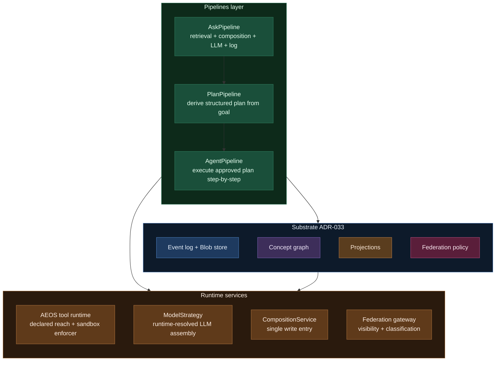

# ADR-034: Plan & Agent Pipeline Architecture — AskPipeline → PlanPipeline → AgentPipeline

**Status:** Proposed (2026-04-27)
**Supersedes:** none (extends ADR-033, ADR-026, ADR-027, ADR-028; complements ADR-035)
**Related:** ADR-033 (layered memory), ADR-035 (human-principal binding), `spec-aeos-0.1.md` (tool runtime + manifests), `spec-memory.md` (memory contract), `spec-model-routing.md` (ModelStrategy amendment), `spec-rag-knowledge-maturity.md` (memory bounding + maturity), `working/plan-agent-modes-analysis.md` (the design rationale this ADR codifies), `working/memory-persistence-plan.md` (schema versioning)

## Context

Plan mode and agent mode have become table-stakes affordances across the agentic-IDE / agent-harness market — Codex, Claude Code, Cursor, Devin, Mastra, LangGraph all ship some shape of them. Axiom today ships:

- A REPL-model agent roster (AXI, SCAN, CURIO, PRESS, TIDY, TRIAGE) per `prd-agents.md` and `spec-agent-architecture.md`.
- A generic `AskPipeline` (`axiom.memory.ask`) that captures the canonical "user/agent asks a question" flow with `Retriever`, `LLM`, `AskHooks`, and PromptComposer integration.
- A layered memory architecture per ADR-033 (event log + concept graph + projections + federation policy).
- AEOS extension runtime with declared tools + signed manifests + classification stamps.
- Federation primitives (cohort registry, A2A protocol, trust profiles) per ADR-027/028/029.

What it does *not* yet ship is a user-facing **plan** affordance (the agent proposes a structured plan; the user approves; execution is gated) or an **agent run** affordance (autonomous multi-step execution with tool calls, interrupts, replay).

The end-to-end design study `working/plan-agent-modes-analysis.md` surfaced three structural risks if we add plan + agent modes naively:

1. **Three parallel paths.** Building `PlanPipeline` and `AgentPipeline` from scratch would fork the prompt-composition + retrieval + memory-write paths that AskPipeline already factors. Within months we would have three subtly different ask/plan/run flows; extensions would specialize all three independently.
2. **Plans-as-files, not-as-memory.** Every peer harness treats plans as transient artifacts (markdown, session blobs, JSON). That makes them un-queryable, un-federable, un-replayable beyond the lifetime of a session. Axiom's substrate (ADR-033) makes "plans-as-memory" cheap; missing this opportunity would be a strategic loss.
3. **Tool-call loop without classification + accountability primitives.** Codex / Claude Code / Cursor are built single-tenant. Plan/agent modes that do not honor visibility horizons, classification stamps, and accountable-human binding (per ADR-035) are not credible for the cohorts Axiom serves.

This ADR commits Axiom to a layered pipeline architecture in which AskPipeline is the substrate, PlanPipeline composes Ask + a derivation step, and AgentPipeline composes Plan + an execution loop — with plans and agent runs as first-class memory fragments living inside ADR-033's four layers.

## Decision

Adopt three composable pipelines in `axiom.agents.pipeline`. Each pipeline reuses the layer below it; each is extended by extensions through declared `*Hooks` protocols, never by forking the path.



### D1 — AskPipeline is the substrate

Already shipped (`axiom.memory.ask`). `Retriever` + `LLM` + `AskHooks` + PromptComposer composition. Every plan derivation and every agent step that needs language-model judgment runs *through* AskPipeline, not in parallel to it. Extensions specialize via `AskHooks` (existing pattern; classroom's hooks are the worked example per #63).

### D2 — Plans are MemoryFragments of cognitive_type `procedural`

A `Plan` is a MemoryFragment with:

- An ordered (DAG-structured) list of `PlanStep` records inside `content`, each carrying: `step_id`, `intent`, optional `tool_id` (AEOS-resolved), `inputs`, `expected_outputs`, `gate` (`auto` / `approve` / `manual`), `on_error` (`abort` / `skip` / `ask`), `proof` (per ADR-035 cross-link — proof-bound steps), and `reach` (declared filesystem + network reach for sandbox enforcement).
- A `classification` stamp + `visibility_horizon` matching the maximum of any step.
- A `target_principal_id` (who or what executes — agent persona hint or peer federation address).
- An **`accountable_human_id`** (mandatory per ADR-035; never null).
- A `replay_envelope` declaring which inputs are captured for deterministic replay (`captured: [...]`) and which are not (`not_captured: [...]`).
- A `model_strategy` reference (per ModelStrategy amendment to `spec-model-routing.md`) declaring per-step LLM assembly preferences.
- A `parent_plan_id` for sub-plans (which are themselves plans).

Plans are append-only. Edits create new plan versions that supersede prior, with explicit `replaces:` provenance. The CLI surface for plan I/O is governed by `working/plan-agent-modes-analysis.md` §10.1: `axi plan new / show / edit / import / refresh`. Memory is canonical; the `.md` rendered form is a derived artifact, never a sync surface.

### D3 — Agent runs are sequences of MemoryFragments bound by `run_id`

An agent run does not produce "logs"; it produces *fragments*. Every thought, every tool call, every tool result, every interrupt, every step-status transition lands as a MemoryFragment with `cognitive_type=episodic` (or `procedural` for state-machine transitions) and `run_id` provenance. Replay = replay of memory, not of stdout.

Run terminal states: `success`, `aborted`, `handoff_to_peer`, `paused_for_approval`, `failed_proof`. Each terminal state is itself a fragment with audit-grade reasoning.

### D4 — Tools resolved through AEOS at execution time, with declared reach

Plans reference tool IDs (from AEOS extension manifests). At step-execution time, `AEOSToolRuntime` resolves the tool, verifies the signature, checks classification compatibility, and dispatches with the **declared reach** (filesystem paths, network hosts) being the contract that the sandbox enforces. A tool that escapes its declared reach hard-fails with audit. The reach + sandbox-as-enforcer vocabulary is specified in an amendment to `spec-aeos-0.1.md` (per analysis §10.2).

Read-intent tools touching only declared-public memory may run un-sandboxed; write-intent or non-trivial-reach tools always run sandboxed. The choice is policy-pluggable per `TrustProfile`, not a per-call config.

### D5 — ModelStrategy resolves LLM assembly per step

A `ModelStrategy` is not "pick a model" — it's a runtime-resolved assembly of LLM calls per step (router → planner → executor → verifier composition). Resolution at step-execution consults: classification stamp of step inputs, network reachability, declared user/cohort policy, budget remaining, available endpoints (local + federated). The resolved assembly is captured in the agent-run fragment for audit.

The existing two-tier router in `spec-model-routing.md` becomes the simplest concrete strategy. The amendment formalizes the broader contract.

### D6 — Approval gates are RACI-typed; pluggable per `TrustProfile`

A step's `gate` is one of: `auto` (no approval), `approve` (requires R/A approval before execution), `manual` (human edits the step before approval). Trust profile drives auto-approval thresholds (Edge / Workstation = stricter; Server / Platform = configured-by-cohort).

Cross-step gates (e.g., "approve every classification-elevating step regardless of plan-level gate") are a layered concern carried in `TrustProfile` rather than the plan itself.

### D7 — Plans and runs project across federation, classification-aware

Plans and runs federate per ADR-033 Layer 4. The federation gateway (Stage 5a; task #58) enforces visibility horizon at outbound projection time. A2A handoff of a sub-plan to a peer cohort is a normal projection plus accountable-human propagation per ADR-035. Phase 4 of the analysis doc constrains *which* horizons + classifications federate (per-cohort-pair contracts; deferred to design review with security in the loop).

### D8 — Pipelines compose; extensions specialize via hooks

Three `*Hooks` protocols live alongside their pipelines:

- `AskHooks` (already shipped) — system-prompt overlays, retrieval contributions, response transformation.
- `PlanHooks` (new) — plan-derivation overlays (extension-specific step templates, intent normalization, classification defaulting), plan-validation contributions, post-derivation transformations.
- `AgentHooks` (new) — pre-step / post-step contributions, action-derivation overrides, peer-handoff routing, interrupt-resolution policy.

Extensions never fork the pipeline class; they implement (or partially implement) the hook protocol. Built-in classroom + chat + research-loop extensions are the worked examples — their plan/agent specializations land as `Classroom*Hooks`, `Chat*Hooks`, `Research*Hooks` modules.

### D9 — Persistence + replay are first-class

Plans and agent runs carry `schema_version` per `working/memory-persistence-plan.md`. Decoders for prior versions never get removed. Compliance suite gates every release on a pinned plan + run fixture round-trip. Plans authored against a Prague-cohort fixture in 2026 must read + replay under every Axiom release through cohort end-of-life.

Replay determinism is a design property, not best-effort. The `replay_envelope` records what we captured; `not_captured` declares the gaps explicitly. Strict-replay (`replay: deterministic-strict`) is opt-in, with cost in storage + execution time.

## Module layout

```
src/axiom/agents/pipeline/
    __init__.py
    plan.py              # PlanRequest, Plan, PlanStep, PlanPipeline
    agent.py             # AgentRunRequest, AgentRun, AgentPipeline
    hooks.py             # PlanHooks, AgentHooks protocols
    replay.py            # ReplayEnvelope, deterministic-strict adapters
    sandbox.py           # SandboxSpec, reach-vs-sandbox vocabulary
    gates.py             # ApprovalGate, RACI integration
    proof.py             # ProofSpec types (test/typecheck/structural/retrieval/attestation/replay/null)
src/axiom/agents/runs/
    projections.py       # active_runs, run_telemetry, cost_by_principal, unverified_steps_by_principal
    streaming.py         # SSE + interrupt protocol
```

## Consequences

### Positive

- **One substrate, three pipelines.** AskPipeline is shipped; PlanPipeline + AgentPipeline compose it. No forked prompt-composition or retrieval paths.
- **Plans + runs are queryable, federable, replayable.** Free given ADR-033; impossible in peer harnesses.
- **Classification + accountability are primitives.** Step-level gates + accountable-human binding (ADR-035) make Axiom plans credible for regulated cohorts.
- **Proof-bound steps deliver evidence trails as a side-effect of execution.** Research-grade + regulatory-grade.
- **Replay determinism + persistence guarantee plans authored today survive Axiom upgrades for years.** The cohort-lifetime invariant from `memory-persistence-plan.md` extends naturally to plans + runs.
- **Tool reach + sandbox-as-enforcer hides sandboxing from users without compromising security.** UX layer says "what dirs / what net"; container is the implementation detail.
- **Extensions specialize without forks.** Hook protocols mirror the AskHooks pattern; classroom + chat + research contribute via hooks, never by reimplementing the pipeline.

### Negative / costs

- **Schema-version bumps required.** Plan + AgentRun introduce new fragment shapes; persistence-plan §4 requires a version bump + decoder registration.
- **Hook protocol surface grows.** Three protocols (AskHooks, PlanHooks, AgentHooks) means three interfaces for extension authors. Mitigated by getattr-resolved hooks (existing AskHooks pattern) so authors only implement what they need.
- **Compliance suite expands.** Pinned plan + run fixtures, replay determinism tests, classification leak tests, accountable-human propagation tests. New `pytest -m memory_compliance` + `pytest -m pipeline_compliance` markers.
- **Sandbox runtime work is real.** Container-class enforcement is non-trivial; VM-class deferred unless forced.
- **Phase 0 spec amendments touch five existing specs** (`spec-model-routing`, `spec-rag-knowledge-maturity`, `spec-aeos-0.1`, `spec-memory`, `spec-federation-policy`, `spec-hooks`). Coordination cost is real but one-time.

### Risks + mitigations

| Risk | Mitigation |
|---|---|
| Hook protocol bloat over time as extensions push novel needs upstream | Quarterly review of hook surface; promote stable patterns; deprecate unused hooks with one-release notice. |
| Plan/run write volume balloons memory store | §7.8 of the analysis doc + amended `spec-memory-maturity.md` ship the bounding story (TIDY sweep + cohort archival + tiered retention) *with* plan/agent modes, not after. |
| Sandbox UX confuses users despite reach-first framing | Default reach derivations for common tool classes; show reach in plan view by default; opt-out is explicit. |
| ModelStrategy resolution at step time hides cost from users | Resolved assembly recorded in run fragment; `axi run cost <run_id>` projection shows the breakdown; per-strategy budgets enforced. |
| Replay non-determinism leaks despite envelope | `not_captured:` is mandatory and audit-visible; strict-replay opt-in catches drift. |

## Phasing

Phase mapping per `working/plan-agent-modes-analysis.md` §9. Phase 0 is documentation (this ADR + ADR-035 + spec amendments). Phase 1 is plan-mode MVP (Prague-aligned). Phase 2 is agent-mode MVP. Phase 3 wires classroom hooks. Phase 4 lights up federation handoff. Phase 5 is visualization polish.

## Compliance gates introduced by this ADR

- `pytest -m pipeline_compliance` runs every release:
  - Plan fixture round-trip (a pinned Prague plan reads under current Axiom).
  - AgentRun fixture replay determinism (a pinned run reproduces its event sequence).
  - Classification-cross step gates (a step that crosses CUI without approval is rejected).
  - Accountable-human propagation across federation (peer-projected plans carry the originating human per ADR-035).
  - Proof-status integrity (a `verified` step has its proof artifacts; a `null_proof` step is explicitly declared).

These join the `memory_compliance` gates from `working/memory-persistence-plan.md` §6.

## Open items punted to follow-on work

- Plan-tree visualization beyond console + markdown (web UI; Phase 5).
- A2A compatibility windows per cohort-pair (Phase 4 design review).
- Per-profile memory-bounding defaults (Edge / Workstation / Server / Platform).
- Strict-replay implementation cost trade-offs (post-Phase-2 evaluation).

These do not block this ADR; the architecture admits them when their phases arrive.

## The bottom line

Axiom does not match Codex's plan/agent surface — it out-architects it on the dimensions our cohorts actually need: plans as memory, runs as memory, classification as primitive, accountability as primitive, replay as design property, federation as native, sandbox as enforcer of declared reach. The cost of this ADR is small (three pipeline modules + one hook protocol + a handful of spec amendments) because every load-bearing piece (memory layers, AEOS runtime, federation gateway, ModelStrategy) is already in flight or decided.
