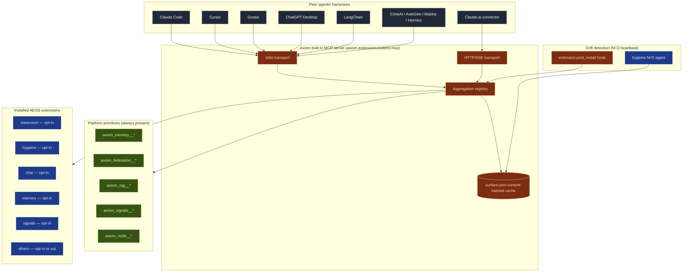

# ADR-038: Built-in Root MCP Server — Node-Level Aggregation, Per-Extension Opt-In, Auto-Adapted Surface

**Status:** Proposed (2026-05-01)
**Date:** 2026-05-01
**Decision Makers:** Benjamin Booth, Team
**Supersedes:** none (extends ADR-006 agentic access; complements ADR-031 extension self-containment, ADR-036 extension runtime surfaces, AEOS 0.1)
**Related:** ADR-006 (MCP + CLI as primary interfaces), ADR-031 (extension self-containment), ADR-036 (extension runtime surfaces), `spec-aeos-0.1.md` §4–§6 (capability kinds + manifest), `spec-hooks.md` (lifecycle taxonomy), `prd-extension-runtime-surfaces.md`, `src/axiom/extensions/mcp_generation.py` (existing client-config generator), `src/axiom/extensions/builtins/classroom/mcp_server.py` (existing per-extension server)

---

## Context

Axiom today has two MCP touchpoints, neither of which gives a peer agentic harness a single, complete view of the local node:

1. **`extensions/mcp_generation.py`** generates *client-side* configs (`.mcp.json` for Claude Code, `.cursor/mcp.json`, Claude Desktop) by collating each extension's `[mcp_servers.*]` block from its `axiom-extension.toml`. The *client* gets one entry per extension that bothers to ship its own MCP server. There is no node-level aggregation.

2. **`extensions/builtins/classroom/mcp_server.py`** is a single per-extension stdio MCP server that exposes a hand-curated list of four classroom tools. Other extensions don't ship one; nothing forces them to; nothing aggregates them.

The result is operationally awkward and architecturally incomplete:

- A peer harness (Claude Code, Cursor, Codex, LangChain, CrewAI, Goose, Mastra, ChatGPT Desktop, Claude.ai connector, etc.) that wants "the full power of this Axiom node" must enumerate every extension's MCP server, install N entries, and accept that some extensions expose nothing at all.
- Extension authors who want MCP exposure must hand-build a server, hand-curate a tool list, and re-serialise their existing tool definitions into MCP `Tool` objects. The work is high-friction enough that nobody does it — only `classroom/` ships one, and only because it was an explicit "adoption prong 2" deliverable for Prague.
- There is no place for *cross-cutting* surface (memory composition, federation, RAG retrieval, signals, hooks) to live. Each of those is a platform primitive — not owned by any one extension — and so today it is reachable only through the `axi` CLI, which non-Anthropic harnesses (Codex, LangChain, Goose, etc.) can shell out to but cannot introspect.
- There is no rebuild trigger. If an extension is installed, upgraded, or removed, the previously-generated client configs go stale silently. The only refresh is the user re-running `axi mcp generate`.

The consequence is that Axiom looks, to a peer harness, like a sparse and inconsistent collection of optional Python entry points rather than an agentic platform. That gap is what this ADR closes.

ADR-006 (2026-01-15, revised 2026-03-16) declared MCP as Axiom's primary external agentic-access surface and described an `src/axiom/mcp_server/` directory as "shipped." That directory does not currently exist in the tree — the per-extension classroom server is the only running MCP server. ADR-038 makes ADR-006's vision real by specifying *one* node-level root MCP server, *automatically* surfaced from extension manifests, and *automatically* refreshed when the extension set changes.

The work is also load-bearing for the broader competitive-parity story. Every comparator harness in the agentic-platform space (Claude Code, Cursor, Goose, Mastra, Continue, Cline, Windsurf, Open Interpreter, Aider, Cody, ChatGPT Desktop, Claude.ai, AutoGen, CrewAI, LangChain, Hermes) either *speaks* MCP natively or *consumes* MCP servers. A single root MCP server lets Axiom be a peer to all of them through one well-known standard rather than N bespoke integrations.

---

## Decision

Axiom introduces a **built-in root MCP server** that ships with every node, aggregates every installed extension's declared MCP-exposed capabilities into a single tool/resource/prompt namespace, exposes both stdio and HTTP/SSE transports, and is rebuilt automatically when the extension set drifts. The aggregation is opt-in per extension via a new `[extension.mcp]` manifest block; opt-out and per-capability customisation are explicit. The runtime drift detector lives inside the existing M-O hygiene agent, which already does capability discovery on heartbeat.

### D1 — One root MCP server per node, shipped as a built-in extension

A new built-in extension at `src/axiom/extensions/builtins/mcp/` provides:

- An AEOS-conformant manifest (`axiom-extension.toml` with `builtin = true`).
- A runnable module: `python -m axiom.extensions.builtins.mcp.server` exposes the aggregated MCP server over stdio.
- An optional HTTP/SSE transport: `axi mcp serve --http --port <n>` exposes the same server to remote/networked clients (deferred remote auth, see D6).
- A CLI noun-verb group: `axi mcp` with subcommands `serve`, `status`, `regenerate`, `list-tools`, `inspect <tool>`, `clients` (lists adapter recipes + writes client configs, subsuming today's `axi mcp generate`).

This extension is the **only** root MCP server on the node. The existing per-extension `classroom/mcp_server.py` is retained for back-compat through one minor version, then deprecated in favour of declaration through the new manifest schema (see D2).

ADR-006's `src/axiom/mcp_server/` directory is *not* recreated. The root server lives where every other built-in lives — `src/axiom/extensions/builtins/<name>/` — preserving the single-pattern principle for built-ins (per AEOS §5.1.1 flat layout).

### D2 — Manifest-driven opt-in via `[extension.mcp]`

Extension authors declare MCP exposure in `axiom-extension.toml`. The block is optional; absence means "this extension is not exposed via the root MCP server." Presence with `enabled = false` is the explicit opt-out form (declared so a reviewer can see the choice rather than infer from absence).

Schema:

```toml
[extension.mcp]
enabled = true                          # default true if block present; false to opt out explicitly
prefix = "axiom_<extension_name>"       # tool-name prefix; default = "axiom_<extension.name>"
visibility = "public"                   # "public" | "internal" — internal hidden from list_tools by default
auth = "local_stdio"                    # "local_stdio" | "token" | "principal" — see D6
description = "..."                     # human-readable; appears in MCP server-info if root description not overridden

# Per-capability fine-tuning. Every block here corresponds to one entry in
# the extension's existing [[extension.provides]] declarations (matched by
# kind + name). Omitting a capability surfaces it with defaults.

[[extension.mcp.tool]]                  # Surfaces a `kind = "tool"` capability as MCP tool
name = "syllabus_extraction"            # must match [[extension.provides]].name
mcp_name = "extract_syllabus"           # optional rename; default = "<prefix>__<name>"
description_override = "..."            # optional; default = provides.description
input_schema_module = "..."             # optional override; default = inferred from tool's input_schema
hidden = false                          # explicit hide-but-still-loaded
allowed_principals = ["@*:local"]       # who may call (Matrix-style); default = local stdio only
side_effects = "none"                   # "none" | "writes" | "external" — surfaces in tool annotation

[[extension.mcp.resource]]              # Surfaces something readable (memory, federation state, RAG corpus)
name = "compositions"
uri_template = "axiom://compositions/{principal}/{cohort}"
mime_type = "application/json"

[[extension.mcp.prompt]]                # Surfaces a reusable prompt template
name = "ne101_tutor"
description = "Tutoring prompt for NE 101"
arguments = ["topic", "depth"]

[[extension.mcp.cmd]]                   # Surfaces a CLI command as a tool (auto-shells `axi <noun> <verb>`)
noun = "signal"                         # must match a [[extension.provides]] kind = "cmd"
subcommands = ["brief", "search"]       # whitelist; absence = all subcommands
```

**Default surfacing rules** (no `[extension.mcp]` overrides needed for the common case):

| Provides kind | Default MCP exposure |
|---|---|
| `tool` | One MCP `Tool` per provides entry; name = `<prefix>__<name>`; schema lifted from the tool's declared `input_schema` |
| `cmd` | Not surfaced by default (commands are domain-specific; opting in via `[[extension.mcp.cmd]]` is explicit) |
| `agent` | Not surfaced by default (agents have their own delegation surface; future work) |
| `service` | Not surfaced |
| `adapter` | Not surfaced (adapters are connection-layer; surfaced via the connection extension if at all) |
| `skill` | Surfaced as MCP `Prompt` when SKILL.md frontmatter declares `mcp_prompt: true`; otherwise hidden |
| `hook` | Not surfaced (hooks are interceptors, not callable tools) |

The lint check (`axi ext lint`) enforces that every extension either declares a `[extension.mcp]` block (opt-in or opt-out) **or** declares the absence is intentional via a one-line manifest comment of the form `# mcp: not-applicable — <reason>`. This makes opt-in/opt-out an explicit, reviewable choice rather than a silent default. See `spec-builtin-mcp-server.md` §6.3 for the lint rule.

### D3 — Aggregation registry: deterministic, idempotent, content-addressed

The root MCP server's tool list is built by an aggregation registry that:

1. Walks every installed AEOS extension on the node (using the existing extension discovery in `axiom.extensions.discovery`).
2. Reads each extension's `[extension.mcp]` block.
3. Resolves each declared/defaulted MCP capability to a Python callable via the AEOS entry-point mechanism.
4. Builds a deterministic `MCPSurface` object: ordered list of `Tool`s, `Resource`s, `Prompt`s + a content hash.
5. Caches the surface in `~/.axiom/mcp/surface.json` with the content hash.

The content hash is the **drift signal** for the rebuild trigger (D5). Two invocations against the same extension set always produce the same `MCPSurface` (modulo timestamp metadata) — important because `axi mcp regenerate` must be safe to run repeatedly without spurious diffs.

Aggregation is *additive only* — extension-declared entries cannot remove or rename platform-provided entries (see D4). On name collision, the platform layer wins (an extension cannot shadow `axiom_memory__compose`); extension-vs-extension collisions resolve by extension load order (deterministic per `discovery.list_extensions()`) with a lint-time warning.

### D4 — Platform primitives are first-class, not extension-dependent

The root MCP server surfaces a small fixed set of **platform-level** tools and resources that are not owned by any extension:

| Surface | Source | What it does |
|---|---|---|
| Tool: `axiom_memory__compose` | `axiom.memory.composition` | Compose memory fragments via CompositionService (the canonical write path) |
| Tool: `axiom_memory__retrieve` | `axiom.memory.composition` | Read fragments by `(T, U, A, R)` filter |
| Tool: `axiom_federation__list_peers` | `axiom.federation.cohort_registry` | Enumerate known federation peers + trust state |
| Tool: `axiom_federation__send` | `axiom.federation.transport` | Send a signed federation message to a peer/cohort |
| Tool: `axiom_rag__retrieve` | `axiom.rag.retrieval` | Hybrid retrieval against the local RAG store |
| Tool: `axiom_signals__brief` | `axiom.infra.signals` | Run the signal briefing pipeline (cross-cutting; no single extension owns it) |
| Tool: `axiom_node__status` | `axiom.diagnostics` | Node-health snapshot (surface, slot, agent liveness) |
| Resource: `axiom://principals/<principal>` | `axiom.identity` | Read a principal's public identity card |
| Resource: `axiom://node/info` | platform | Node identity, surface, slot, version |

These are declared by the **mcp built-in itself** (it imports the platform primitives and registers them in its own pre-extension surface) so that even on a node with zero non-platform extensions installed, a connected harness sees a meaningful, non-trivial surface.

This is the answer to "what does an Axiom node look like to a peer harness?": memory + federation + RAG + signals + node-status + identity, plus whatever extensions opt into surfacing.

### D5 — CI/CD rebuild trigger + runtime adaptation

The aggregation surface goes stale whenever the extension set changes. Three triggers regenerate it:

1. **CI/CD trigger.** A new lifecycle hook (per `spec-hooks.md`'s observer taxonomy) `extension.post_install` and `extension.post_uninstall` invoke the mcp built-in's `regenerate()` callable. Implemented as an AEOS `kind = "hook"` declaration in the mcp built-in's own manifest. Same for `extension.post_update`.

2. **Install-time hook.** `axi ext install <name>` and `axi ext uninstall <name>` already fire the `extension.post_install` / `extension.post_uninstall` events. The mcp built-in subscribes; no new pipeline ceremony required.

3. **Runtime drift detection by M-O.** The hygiene built-in's M-O agent already runs a periodic capability-discovery sweep (`hygiene/node_health.py` already has `_check_local_drift`). M-O gains one new check: `_check_mcp_surface_drift()` — compares the cached `surface.json` content hash against a fresh re-walk of the extension manifests. If they diverge and the divergence persists past two heartbeats (a debounce so a partial install doesn't churn the surface), M-O proposes regeneration via the existing RACI-gated proposal channel (`feedback_raci_automation_escalation`). User pre-approves "auto-regen MCP surface" once and the proposal becomes silent execution thereafter.

M-O is the natural home because it already (a) runs on every heartbeat, (b) does drift detection for the local node version (`node_health.py:_check_local_drift`), and (c) has a working RACI proposal pipeline that handles "I noticed something; here's what I'd do; OK?" without bouncing a menu back at the user.

No new agent is invented. No new ceremony. M-O grows one method.

### D6 — Auth model: local stdio now, deferred remote auth

The MVP runs stdio-only by default (transport: stdio, auth: implicit-local — anything that can spawn the subprocess gets full access). This matches every other peer harness's MCP local install pattern (Claude Code, Cursor, Goose, Continue, Cline, Windsurf, Aider, Open Interpreter, Cody) and matches the existing classroom server's posture.

HTTP/SSE transport is supported behind a flag (`axi mcp serve --http --port <n>`) but defaults to **off**. When enabled, the v0 auth model is one of:

- `auth = "local_stdio"` — refuses HTTP entirely; stdio only. Default.
- `auth = "token"` — pre-shared bearer token from `~/.axiom/mcp/tokens.json`, generated by `axi mcp tokens add <client-name>`. Each token has a name + creation timestamp + optional principal binding + revocation list.
- `auth = "principal"` — full principal-binding via the existing `@name:context` Matrix-style identity (per `feedback_principal_naming` + ADR-035 human principal binding). **Deferred to Phase 4** once the principal-binding flow is solid for non-Axiom clients (ChatGPT Desktop, Claude.ai connectors).

The auth model is *per-tool* via `[[extension.mcp.tool]].allowed_principals`. The default is `["@*:local"]` (any local principal — same as today). Tools that touch federation state, write memory, or affect the node identity default to `["@<owner>:local"]` (only the node-owning principal, declared in `~/.axiom/identity/owner`). Extensions may override per-tool but cannot widen platform tool authorisation.

This staging means the v0 server is exactly as exposed as today's classroom server (stdio, local-only, no auth). Remote auth is a deliberate, additive Phase 4 deliverable — not a v0 surprise.

### D7 — Adapter recipes for every notable peer harness

The root MCP server is useless without documented adapter recipes for the harnesses we want to interoperate with. Phase 3 ships per-harness recipes at `docs/working/mcp-harness-adapters/<harness>.md` covering install + connect + verify steps for:

| Tier | Harness | Connection model |
|---|---|---|
| 1 (MCP-native, stdio) | Claude Code | `.mcp.json` entry; identical to today's `axi mcp generate` output |
| 1 | Cursor | `.cursor/mcp.json` entry |
| 1 | Goose (Block) | `~/.config/goose/extensions.yaml` |
| 1 | ChatGPT Desktop | Settings → MCP servers (stdio config) |
| 1 | Continue.dev | `~/.continue/config.json` `mcpServers` block |
| 1 | Cline | VS Code extension settings |
| 1 | Windsurf | `~/.codeium/windsurf/mcp_config.json` |
| 1 | Open Interpreter | `--mcp` flag; programmatic registration |
| 1 | Cody (Sourcegraph) | settings UI + MCP server entry |
| 1 | Aider | `--mcp-server` repeated flag |
| 2 (MCP-native, HTTP/SSE) | Claude.ai connectors | Remote URL + token in connector settings UI |
| 3 (framework adapter) | LangChain | `langchain-mcp-adapters` — `MultiServerMCPClient` config |
| 3 | CrewAI | `crewai_tools.MCPServerAdapter` |
| 3 | AutoGen (Microsoft) | `autogen-ext[mcp]` registration |
| 3 | Mastra (TypeScript) | `@mastra/mcp` client config (Node-side recipe) |
| 3 | Hermes (Nous Research) | MCP client config in agent definition |
| 3 | Codex (OpenAI CLI) | Codex MCP plugin entry; experimental as of 2026-Q2 |

Each recipe includes: (1) install the harness, (2) write the config block, (3) verify with a smoke-test call (`list_tools` against the running Axiom server), (4) troubleshoot common failure modes (PATH, venv, surface mismatch). The `axi mcp clients` command writes the relevant block automatically for the Tier 1 harnesses.

### D8 — Domain-agnostic surface

Per `feedback_axiom_domain_agnostic` and `feedback_chalke_never_ut_specific`, the root MCP server's tool names, descriptions, and platform-primitive surface MUST NOT reference any specific domain (no domain-specific or facility wording in platform tools). Domain language belongs in extension tools (where it's appropriate — `axiom_classroom__list_sessions` is fine; `axiom_node__status` returning domain-specific health, e.g. "reactor health", would not be).

The lint check from D2 is also where this is enforced: any platform-primitive tool description matching domain-specific banned terms fails CI.

---

## Architecture



---

## Alternatives Considered

| Alternative | Reason Not Selected |
|---|---|
| Keep the per-extension MCP server pattern; add a router that pipes between them | N+1 stdio subprocesses per node; harness must enumerate all of them; tool-namespace collisions; nothing surfaces platform primitives. Operational tax for no harness-side benefit. |
| Bake the root server into the Axiom platform module (`src/axiom/mcp_server/` per ADR-006's text) | Breaks the single-pattern rule that everything is an extension. Conflicts with AEOS §5 flat layout for built-ins. The mcp built-in is itself an extension; that's the consistent pattern. |
| Build a brand-new "MCPCurator" agent that sweeps for drift | Invents an agent for one method that M-O already does for everything else (capability discovery on heartbeat, drift detection for version directives). The hygiene/node_health pattern already exists; reuse it. |
| Surface every CLI command automatically | Tool surface explodes (every `axi <noun> <verb>` becomes a tool). Most CLI commands are interactive or operator-only; surfacing them as agent-callable tools without per-command opt-in is a footgun. The `[[extension.mcp.cmd]]` opt-in form keeps authoring deliberate. |
| Default-on for extensions (no opt-in needed) | Means a freshly installed extension that incidentally declares a tool capability suddenly becomes agent-callable. That's a security and surface-management failure mode. Opt-in via `[extension.mcp]` is explicit. |
| Use OASF-only manifest fields + skip `[extension.mcp]` | OASF doesn't yet have stable fields for MCP exposure controls (visibility, auth, principal-binding, prefix). Inventing in-AEOS now and contributing back to OASF later (per ADR-032 dual-track) is the right ordering. |
| Skip HTTP/SSE entirely; stdio forever | Claude.ai connectors and ChatGPT Desktop's remote-MCP path require HTTP. Cutting them off entirely is a bigger interop loss than the auth complexity is worth. Optional + flagged is the right balance. |
| Defer drift detection to user-run `axi mcp regenerate` | Same staleness problem the existing `mcp_generation.py` has today. M-O's heartbeat is already happening; adding one check is cheap and removes the user-action requirement. |

---

## Consequences

### Positive

- One stable, well-documented surface for *every* peer harness — Axiom looks like a real platform, not a mosaic of optional servers.
- Extension authors get MCP exposure for free by adding 1–6 lines of TOML, no Python boilerplate.
- Platform primitives (memory, federation, RAG, signals, node-status, identity) are surfaced consistently across nodes regardless of installed extension set — every Axiom node is a meaningful MCP target.
- Drift detection is silent + automatic for users who pre-approve auto-regen.
- The `axi mcp clients` subcommand can write Tier-1 harness configs deterministically; users move from "read the docs and edit JSON" to "run one command."
- Domain-agnostic at the platform layer — the same root server works for Keplo (classroom), Vyzier (registry), and a domain consumer (e.g. a nuclear-engineering consumer) without surfacing any of those domains in the platform-tool names.
- No new agent invented; M-O grows one method.

### Negative

- New manifest schema (`[extension.mcp]`) is more surface area for every extension author to learn.
- Aggregation registry is a new central piece; bugs there affect every node.
- Auth model is staged — remote-HTTP auth is deferred work that will need to land before Claude.ai connectors / ChatGPT Desktop integrations can cross the local-dev boundary into shared-node deployments.
- Per-harness adapter recipes are documentation work (Phase 3) that has to keep up with each harness's churn.
- The existing `extensions/mcp_generation.py` becomes legacy; we keep it through one minor version, then deprecate.

### Mitigations

- The `[extension.mcp]` block is *optional*; extensions with no MCP need write zero new TOML. Lint enforces an explicit comment if no block is present, so opt-out is a one-line decision rather than a learning curve.
- Aggregation registry has an extensive standard-tests suite (`axiom_tests.unit_tests.MCPSurfaceTests`) that every extension author inherits when their extension declares MCP capabilities — bugs surface in the extension's own CI rather than at the aggregation layer.
- Auth staging is documented in `spec-builtin-mcp-server.md` §7 with explicit phase boundaries. Stable URLs for the Phase-4 work are pre-allocated.
- Adapter recipes are content-addressed (each carries the upstream harness version it was tested against); a stale recipe surfaces a banner in `axi mcp clients` rather than silently failing.
- `mcp_generation.py` remains importable; `axi mcp generate` becomes an alias for `axi mcp clients --write`. No external user-visible breakage.

---

## Phasing

| Phase | Scope | Acceptance |
|---|---|---|
| Phase 0 — Design | This ADR + PRD + spec; manifest schema review | All three docs reviewed and approved |
| Phase 1 — Scaffolding | New `extensions/builtins/mcp/` extension; aggregation registry; stdio server; platform primitives surfaced; tests | `python -m axiom.extensions.builtins.mcp.server` serves stdio; `list_tools` returns the 9 platform-primitive entries; standard tests pass |
| Phase 2 — Manifest schema + first three extensions converted | `[extension.mcp]` schema in `spec-aeos-0.1.md`; lint rule lands; three diverse extensions (`memory`, `signals`, `hygiene`) opt in via the new block | All three extensions surface their tools through the root MCP server; lint enforces opt-in/opt-out explicitness |
| Phase 3 — Adapter recipes | 17 recipes at `docs/working/mcp-harness-adapters/<harness>.md`; index README; `axi mcp clients` writes Tier-1 configs | Smoke-test against at least 3 harnesses (Claude Code, Goose, LangChain); recipes peer-reviewed |
| Phase 4 — CI/CD + runtime adaptation | `extension.post_install` hook wired; M-O gains `_check_mcp_surface_drift()`; RACI proposal flow integrated; `axi mcp regenerate` no-op on clean state | Installing/uninstalling an extension triggers a surface refresh within one M-O heartbeat without user action (after one-time pre-approval) |
| Phase 5 — Remote auth (post-Prague) | `auth = "token"` and `auth = "principal"` HTTP modes; `axi mcp tokens add/list/revoke` | Claude.ai connector + ChatGPT Desktop can connect to a remote Axiom node behind token auth |

Phase 1–4 land in the worktree; Phase 5 is queued for after the Prague deadline per `feedback_freeze_foundation_during_delivery`.

---

## Open Questions

- **Should agents be a default-surfaced kind?** Today, an `[[extension.provides]] kind = "agent"` is not surfaced via MCP. There is a real argument that agents *should* be callable as MCP tools (the agent's `invoke()` becomes a tool with the agent's `description`). The counter-argument is that agents have richer delegation semantics (RACI gates, persona, multi-turn state) that don't fit the stateless MCP tool contract. Decision deferred to Phase 6 once we have actual consumer demand.
- **How should resource URIs interact with `axiom://`?** The existing `axiom://` URI scheme is for federation. Re-using it for MCP resources is convenient but blurs the boundary. Decision: use `axiom://` resource URIs for federation-shareable resources only; non-federation MCP resources use `mcp+axiom://` to keep the boundary visible.
- **Federation-aware MCP surface?** Should a remote MCP client connecting to node A be able to call tools that, under the hood, federate to node B? The trust-graph semantics are non-trivial. Phase 5+ work; out of scope here.
- **Versioning of the platform-primitive surface.** When `axiom_memory__compose`'s schema changes, every connected harness sees a breaking diff. We need a `mcp_surface_version` field per tool + a deprecation-window policy. Tracked as a follow-up after Phase 1 lands.

---

## Related Documents

- [ADR-006: MCP + CLI as Primary Interfaces](adr-006-mcp-agentic-access.md) — The original MCP commitment; this ADR realises its unbuilt root-server section
- [ADR-031: Extension Self-Containment](adr-031-extension-self-containment.md) — The single-pattern rule that the mcp built-in honours
- [ADR-036: Extension Runtime Surfaces](adr-036-extension-runtime-surfaces.md) — Surface and slot metadata flow into the MCP server's `axiom_node__status` tool
- [AEOS 0.1 Specification](../specs/spec-aeos-0.1.md) — §4 capability kinds, §6 manifest schema (extended by this ADR's `[extension.mcp]` block)
- [Hooks Spec](../specs/spec-hooks.md) — `extension.post_install` / `extension.post_uninstall` events used as the rebuild trigger
- [PRD: Built-in MCP Server](../prds/prd-builtin-mcp-server.md) — Companion product requirements
- [Spec: Built-in MCP Server](../specs/spec-builtin-mcp-server.md) — Companion technical specification
- [MCP Protocol](https://modelcontextprotocol.io/) — Anthropic's open standard

_Copyright (c) 2026 B-Tree Ventures, LLC. Apache-2.0 licensed._
