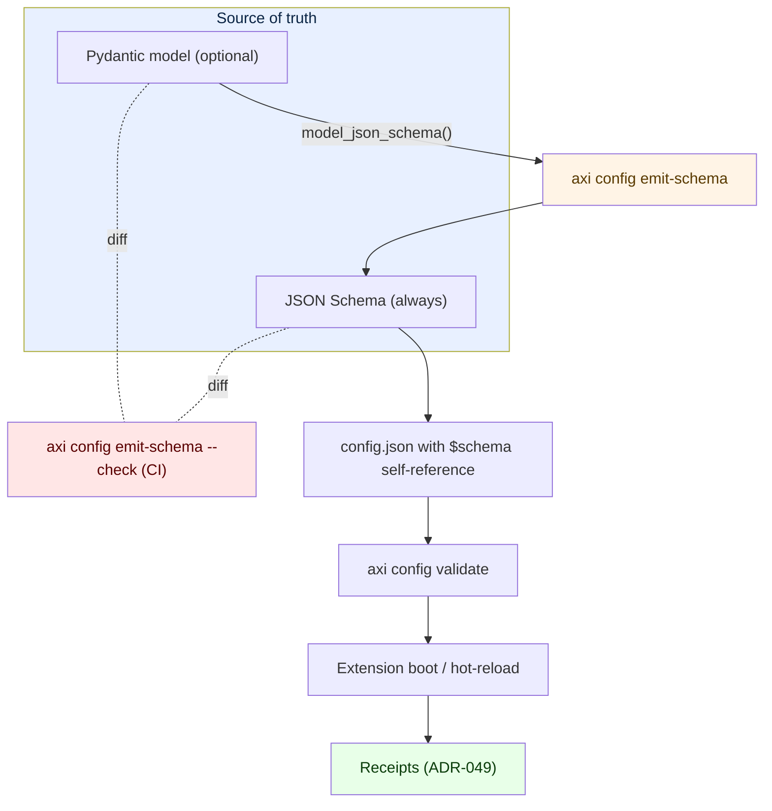

# ADR-065 — Extension configuration schema primitive (bilingual)

**Status:** Proposed — 2026-06-02
**Owner:** @ben
**Related:** ADR-049 (receipts / orchestration boundary), ADR-052 (schema-per-extension DB tenancy — the analog for config), ADR-056 (skill-as-function — manifest-section + verb pattern), ADR-063 (SKILL.md as generated artifact — the "Python is source of truth + generated artifact + lint" pattern this ADR mirrors for config)

## Context

Every Axiom extension that loads externalized configuration today rolls its own validation, or none. The first consumer extension to land primary persistence (per ADR-052) externalized site-specific values into a JSON file with a file-watcher for hot reload — the right plumbing, but with three structural gaps that will repeat in every subsequent extension if not solved at the platform layer:

1. **No schema floor.** Operators editing the JSON have no editor IntelliSense, no `$schema` self-reference, no boot-time validation. A misspelled key or out-of-range value surfaces as a runtime AttributeError, not a friendly load-time message with the JSON path that failed.
2. **No language-agnostic surface.** Adopter sites need to read Python to discover what's required, what's optional, and what's reloadable. A second site cannot self-onboard from artifacts alone.
3. **No hot-reload contract.** The watcher fires on every change. Some fields are safe to apply live (recipient lists, additions to an enum-like array); some need a restart (identity fields, schema version). Today the distinction lives in operator memory.

The fragility compounds with reach: the more configurable a surface, the more ways an edit can silently break it. Externalization without a schema is a regression in safety even when it's a win in adoptability.

This ADR establishes the platform primitive so every extension gets the floor for free and can opt into the ceiling when its config is complex enough to need it. The shape mirrors ADR-063 (Python source of truth, generated artifact, lint enforces equality) applied to config instead of skills.

## Decision

Extension configuration is **schema-bilingual**: a JSON Schema floor is always present; a Pydantic model is an optional ceiling. When both are declared, the JSON Schema is **generated from the Pydantic model** via `Model.model_json_schema()` and committed, and `axi config emit-schema --check` lints the two for equality. Drift is mechanically impossible.

### The two layers

| Capability | JSON Schema (floor) | Pydantic (ceiling) |
|---|---|---|
| Editor IntelliSense via `$schema` self-reference | Yes | (via generated JSON Schema) |
| Language-agnostic adopter surface | Yes | No |
| Boot-time validation (`jsonschema.validate`) | Yes | Yes (`Model.model_validate`) |
| Required / type / range / enum / pattern | Yes | Yes |
| Field-level `x-reloadable` annotation | Yes | Yes (carried through generator) |
| Cross-field validators (`@model_validator`) | No | Yes |
| Computed / derived fields | No | Yes |
| Type coercion (string → datetime, `Path`, enum) | No | Yes |
| Discriminated unions | Partial (`oneOf`) | Native |
| Adopter can edit config without Python toolchain | Yes | Yes (Python only required at platform layer) |

The floor covers the common case. The ceiling handles the extensions where config has interdependent fields or needs programmatic shape.

### Manifest section

A new `[config]` block in `axiom-extension.toml`:

```toml
[config]
schema   = "config.schema.json"      # always; lint-enforced if model present
model    = "config:SiteConfig"       # optional; Pydantic class path
required = true                      # whether the extension refuses to load without it
reloadable_fields = ["recipients", "operator_groups"]   # whitelist; rest needs restart
```

`schema` is mandatory when `[config]` is declared. `model` is optional. `reloadable_fields` is a denylist-by-default whitelist: anything not listed requires restart.

### Verbs

Three skills registered through `SkillRegistry` (per ADR-056), exposed as CLI verbs:

- `axi config validate <ext> [--config <path>]` — runs `jsonschema.validate`, then `Model.model_validate` if a model is declared. Exits non-zero with the failing JSON path and a human-readable diagnostic.
- `axi config show --effective <ext>` — prints the effective merged config (defaults + file + env overrides) after validation. Useful for operator debugging.
- `axi config emit-schema [--ext <name>] [--check]` — when a `model` is declared, regenerates `config.schema.json` from `Model.model_json_schema()`. `--check` mode diffs against the on-disk file and fails non-zero on mismatch. CI runs `--check`.

### Receipts hook

Every config load and every hot-reload event emits a memory fragment per ADR-049 carrying: the diff (before / after at field granularity), the validation result, the effective values, and the reload classification (live-applied vs queued-for-restart). The receipts make config changes auditable across the install lifecycle and surface "why did the system change behavior" answers without log-grepping.

### Hot-reload contract

JSON Schema's extensibility keyword `x-reloadable: true | false` is declared per leaf field. The watcher reads the schema (single source of reload-safety truth) and:

- **Reloadable change** → apply live, emit receipt with `applied=true`.
- **Non-reloadable change** → queue the new value, leave the running process on the old value, emit receipt with `applied=false, requires_restart=true` and a visible diff. Status surfaces via `axi config show --effective <ext>` so operators see both running and queued.

`reloadable_fields` in the manifest is a coarse double-check; the per-field schema annotation is the fine-grained source.

### Single enforcement surface



### Example artifacts

**`axiom-extension.toml`** (consumer extension):

```toml
[extension]
name = "consumer_ext"
version = "0.3.0"

[config]
schema = "config.schema.json"
model = "config:SiteConfig"
required = true
reloadable_fields = ["recipients", "operator_groups"]
```

**`config.schema.json`** (generated, committed):

```json
{
  "$schema": "https://json-schema.org/draft/2020-12/schema",
  "title": "SiteConfig",
  "type": "object",
  "required": ["authorized_owner_id", "schema_version"],
  "additionalProperties": false,
  "properties": {
    "schema_version": {
      "type": "integer", "minimum": 1,
      "x-reloadable": false
    },
    "authorized_owner_id": {
      "type": "string", "pattern": "^[a-z0-9_-]+$",
      "x-reloadable": false
    },
    "recipients": {
      "type": "array", "items": {"type": "string", "format": "email"},
      "x-reloadable": true
    },
    "operator_groups": {
      "type": "array", "items": {"type": "string"},
      "x-reloadable": true
    }
  }
}
```

**`config.py`** (consumer extension, optional ceiling):

```python
from pydantic import BaseModel, Field, model_validator

class SiteConfig(BaseModel):
    schema_version: int = Field(ge=1, json_schema_extra={"x-reloadable": False})
    authorized_owner_id: str = Field(pattern=r"^[a-z0-9_-]+$",
                                     json_schema_extra={"x-reloadable": False})
    recipients: list[str] = Field(default_factory=list,
                                  json_schema_extra={"x-reloadable": True})
    operator_groups: list[str] = Field(default_factory=list,
                                       json_schema_extra={"x-reloadable": True})

    @model_validator(mode="after")
    def _owner_in_groups(self) -> "SiteConfig":
        if self.operator_groups and self.authorized_owner_id not in self.operator_groups:
            raise ValueError("authorized_owner_id must be a member of operator_groups")
        return self
```

The cross-field validator is the kind of check JSON Schema can express only awkwardly; this is the canonical case for opting into the ceiling.

## Consequences

**Wins**
- Every extension gets boot-time validation, editor IntelliSense, and operator-facing diagnostics for the cost of one manifest block plus one committed JSON file.
- Adopter sites onboard from artifacts (`config.schema.json` + a template) without reading source code. Closes the second-site self-service gap.
- Hot-reload behavior is declarative and visible. No more "did that change take effect" ambiguity.
- Receipts make every config change auditable; ties into the same fragment ledger every other primitive writes through.
- Drift between Python and JSON Schema is mechanically impossible (lint-enforced); same shape as ADR-063 for skills.

**Costs**
- Each extension touches its config-load path once to call `axi.config.load(ext_name)` instead of `json.load`. Mechanical edit, smaller than the ADR-063 skill backfill.
- CI gains one more `--check` job per extension that declares a model. Mirrors the existing `ruff` / `mypy` / `emit-md --check` shape.
- The hot-reload contract is opinionated: changes to non-reloadable fields will not apply until restart. This is a feature; an extension that wants different semantics can omit the `reloadable_fields` whitelist and treat all changes as requiring restart.

**Non-goals**
- This ADR does not standardize the config *format* (JSON is the default; YAML / TOML loaders can be added without changing the validation surface).
- This ADR does not handle secret materials. Secrets stay in the secrets extension (OpenBao default); `[config]` carries non-sensitive operational values.
- This ADR does not retroactively impose a config block on extensions that don't externalize anything. `[config]` is opt-in.

## Rollout

| PR | Scope |
|---|---|
| PR-1 | JSON Schema floor: `axiom.infra.config.load`, `axi config validate` + `axi config show` verbs, `[config]` manifest field parsing, receipts emission on load, tests, and migration of the first adopter extension to the primitive. |
| PR-2 | Pydantic ceiling: `axi config emit-schema` + `--check` lint, manifest `model` field, generator that round-trips `x-reloadable` through `json_schema_extra`, CI wiring. |
| PR-3 | Hot-reload contract: schema-driven watcher, `reloadable_fields` enforcement, queued-restart visibility in `show --effective`, receipt classification (`applied` / `requires_restart`). |
| PR-4 (consumer repo) | Migrate the consumer extension's site-config to the primitive; remove the bespoke loader; flip CI lint to required. |

PR-1 stands on its own; subsequent PRs are additive. Adopters can use the floor immediately and graduate to the ceiling when they hit a cross-field validator or coercion case.

## Open questions

- **Receipt storage location.** Should the load / reload fragment live in the standard `CompositionService` memory ledger, or in a per-extension JSONL audit log? Memory-fragment routing is the default per ADR-049; JSONL is the fallback if the volume of reload events from a chatty watcher pollutes recall. Resolve in PR-1 by measuring.
- **GUARD authorization on config writes.** Should authz-wrapped writes (an operator pushing a new config via CLI) flow through the same GUARD layer that wraps state-changing skills? Leans yes for parity, but punts to PR-3 with the hot-reload work since that is where push-style writes appear.
- **Validation cadence in CI.** Run `axi config validate` on every example / template file in every PR (cheap, catches drift) versus only on extensions touched by the diff (faster, narrower). Default to all-files; revisit if wall time becomes a problem.
