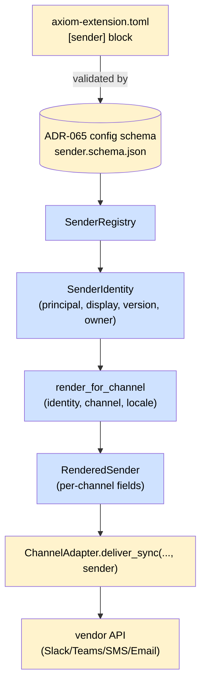

# ADR-066 — SenderRegistry + servant-naming render

**Status:** Proposed — 2026-06-02
**Owner:** @ben
**Related:** ADR-020 (principal grammar `@name:context`), ADR-056 (skill-as-function), ADR-063 (SKILL.md as generated artifact), ADR-065 (extension config schema primitive), prd-axi-cli §Agent Addressing (lines 1312–1403), spec-axiom-notifications §3, ADR-067 (HERALD Gateway + reply-bind-back, pending)

## Context

Every notification HERALD-2a sends today reaches its destination wearing the wrong nameplate. RIVET, TIDY, PRESS, and AXI all surface as the same "Axiom" sender on Slack, Teams, Mattermost, SMS, and email. Operators can't tell which agent escalated; routine PRESS publish-succeeded posts look identical to RIVET CI-broken alerts; reply threading misattributes anything a human responds to.

The cause is a structural gap, not a missing nameplate string. `send(actor="@rivet", …)` records the principal on the `DeliveryReceipt`, but `ChannelAdapter.deliver_sync()` (`channels/base.py` lines 53–62) has no `actor` or `sender` parameter. The principal dies at the registry boundary; every adapter falls back to the shared bot identity its connector was provisioned with.

Two existing decisions already constrain the fix:

1. **ADR-020 §Principal Naming** locked the canonical address as `@<entity>:<context>` (e.g., `@tidy:bens`). The principal is i18n-clean and Matrix-style. It is **not** a display string and never carries a version, possessive, or human-readable suffix.
2. **prd-axi-cli §Agent Addressing** (lines 1312–1403) specified the rendering convention: a separate render layer translates the canonical address into locale-appropriate possessive surfaces ("Ben's AXI", `AXIの`, `de Ben`). The PRD calls this out as the load-bearing reason the address grammar stays clean: English `-'s`, Japanese `の`, German dative don't round-trip through one grammar, so they don't try.

Neither decision is wired. No code reads a render template, no manifest section declares per-agent display metadata, and no adapter accepts the rendered surface. This ADR codifies the render layer, the manifest section, and the `SenderIdentity` contract that ADR-067's inbound gateway depends on for `@mention` resolution.

## Decision

Introduce **`SenderRegistry`** as a notifications-module primitive that owns the canonical → rendered translation. Three pieces:

1. A frozen `SenderIdentity` dataclass that carries the canonical principal plus rendered metadata.
2. A `[sender]` block in every agent extension's `axiom-extension.toml`, schema-validated through the ADR-065 config primitive.
3. A `render_for_channel(identity, channel, locale)` function that produces the per-channel surface adapters consume.

### `SenderIdentity` contract

```python
@dataclass(frozen=True)
class SenderIdentity:
    principal: str              # canonical "@tidy:bens" (ADR-020)
    display_name: str           # "Tidy" (from [sender].display_name)
    version: str                # "1.0" (from extension manifest version)
    owner_handle: str           # "@ben.booth" (resolved from :bens context)
    avatar_uri: str | None = None
    from_address: str | None = None  # email From override; None → adapter default
```

The principal stays exactly the ADR-020 form. Version lives in metadata and is sourced from the extension manifest's top-level `version` field, never embedded in the principal string. `owner_handle` resolves at registry-load time by looking up the `:bens` context in the federation peer registry.

### `[sender]` manifest block

```toml
[sender]
display_name = "Tidy"
avatar_uri   = "file://assets/tidy.png"   # optional
from_address = "tidy@axiom.btreelabs.ai"  # optional
```

`display_name` is required. `avatar_uri` and `from_address` are optional. Schema lives in `notifications/schemas/sender.schema.json` and is registered through `register_schema_from_jsonschema` (ADR-065) so it hot-reloads via the existing watcher and lints against `axi ext lint`.

### Render layer

`SenderRegistry.render_for_channel(identity, channel, locale="en")` returns a channel-specific surface. The possessive form is sourced from a small table:

| Locale | Template |
|---|---|
| `en` (default) | `{owner}'s {display_name} {version}` |
| `ja` | `{owner}の{display_name} {version}` |
| `de` | dative-case template; see `senders/locale.py` |

`{owner}` is the `owner_handle`'s display form (`@ben.booth` → `Ben` via the federation peer registry's human-name field). v1 ships `en` only; the table is a registry, so additional locales land as one-line additions plus tests. The render layer is the **only** place possessive forms exist; every adapter calls the same function.

### Per-channel render surface

The render output is a `RenderedSender` struct each adapter consumes per its vendor surface:

| Channel | Surface fields the adapter consumes |
|---|---|
| Slack | `username` + `icon_url` overrides on the webhook payload |
| Teams | Adaptive Card `from.name` + `from.icon` |
| Mattermost | `username` + `icon_url` (same shape as Slack) |
| Twilio SMS | message body prefix `[Ben's RIVET]: …` (SMS has no rich From) |
| Email | `From: "Ben's RIVET 1.0" <rivet@…>`; per-agent `from_address` if set, else adapter default |
| Inbox | stored on the receipt as `sender_display` + `sender_principal` |

The mapping table is owned by the registry, not by each adapter. Adapters receive a `RenderedSender` already shaped to their surface and apply it. Two adapters never disagree on what "Ben's RIVET" looks like.

### `ChannelAdapter.deliver_sync()` signature change

The `ChannelAdapter` Protocol grows a `sender: SenderIdentity` parameter. All six current adapters (Slack, Teams, Mattermost, Twilio SMS, Email, Inbox) update in a single PR per the Pattern A discipline locked in feedback_verb_migration_must_extract_skills — Protocol changes do not ship as "add now, wire later". One PR, six adapter updates, every test in `tests/notifications/` updated to pass a `SenderIdentity` fixture.

### Servant-naming precedent

The render convention is not invented here. prd-axi-cli §Agent Addressing (lines 1312–1403) already specified it:

> The address grammar is i18n-clean; the rendering layer carries the possessive feel. Human-friendly possessive forms ("Ben's AXI") don't round-trip through a single address grammar — English uses `-'s`, French uses `de`, Japanese uses `の`, Chinese uses `的`, German uses dative case. The canonical address stays Matrix-style (`@axi:bens`); the rendering layer translates that into the user's locale-appropriate possessive form for help text, error messages, chat speaker prefixes, and federation participant lists.

This ADR makes the PRD's render layer real for notification channels. Same rule, same table, same canonical address; chat speaker prefixes, help text, and channel sender surfaces share one render function.

## Flow



## Consequences

**Wins**
- Every channel surfaces the correct agent. Operators tell RIVET from PRESS at a glance; reply-bind-back (ADR-067) can correctly attribute "Ben replied to a TIDY notification".
- One render function, one possessive table. Chat speaker prefixes, help text, and notification surfaces stay consistent forever because they share code.
- The `SenderIdentity` contract is the join key ADR-067's TRIAGE inbound classifier needs. `@mention` parse + thread-context lookup both resolve into a principal that has a registered identity; downstream dispatch is unambiguous.
- i18n is a table addition, not a refactor. The day a locale ships, every adapter gets it for free.

**Costs**
- Protocol change on `ChannelAdapter` forces all six adapter implementations to update in one PR. Existing tests need a `SenderIdentity` fixture.
- Every agent extension gains a `[sender]` block. ~10 Axiom agents plus the future Expman persona in the domain-consumer repo. Mechanical edit, lint-enforced.
- Owner-handle resolution introduces a federation-peer-registry read at registry-load time. v1 caches at process start; cache invalidation is a follow-up.

**Non-goals**
- Per-agent dedicated bot accounts. The shared-bot model stays; per-agent identity is a display override, not a separate vendor app.
- Inbound classification. ADR-067 owns the gateway, verification, decode, and dispatch pipeline. This ADR provides the identity contract that ADR-067 consumes.
- Per-recipient locale negotiation. v1 ships a single locale per agent (the agent's owner's locale). Recipient-locale rendering is a follow-up gated on actual cross-locale demand.

## Rollout

| PR | Scope |
|---|---|
| PR-1 | `SenderRegistry` primitive + `SenderIdentity` dataclass + `[sender]` schema + `en` possessive table + tests (registration, render, schema lint) |
| PR-2 | `ChannelAdapter.deliver_sync()` signature extension; all six adapters updated in-place; existing-test fixture migration |
| PR-3 | `[sender]` block backfill across the 10 Axiom agent extensions; lint flipped to required; matching backfill in the domain-consumer repo for its first persona |
| PR-4 | `ja` + `de` possessive table entries + tests; locale-selection helper |

PR-1 and PR-2 are this-week work; PR-3 follows immediately. PR-4 is parked until a real second-locale need arrives.

## Open questions

1. **Locale source.** Should `render_for_channel` consult the recipient's locale (per `RecipientProfile`), the agent's owner locale (per the agent's `:context`), or a tenant default? v1 ships agent-owner locale because it's the simplest single-source-of-truth, but recipient locale is the eventual right answer for cross-locale tenants.
2. **Avatar transport.** `avatar_uri` accepts `file://` and `https://` today. Slack and Mattermost require a public HTTPS URL; Teams accepts a base64 inline. Does the registry resolve `file://` to a hosted HTTPS URL via the existing artifact-registry, or push that to the adapter? Leaning registry, so adapters stay vendor-shaped.
3. **Per-context override.** Can `@tidy:bens` and `@tidy:ut-austin` register different `[sender]` blocks (different avatar, different `from_address`)? Today the manifest is per-extension, not per-context. A context-scoped override is plausible but adds resolution complexity.
4. **Domain-consumer manifest shape.** The first cross-repo consumer is a persona whose extension today ships `cmd` + `safety_checks` only, no `[agent]` block. Does it gain a `[sender]` block at the extension root, or under a per-persona sub-block? Decision blocks first cross-repo end-to-end notification.
5. **Render-time vs install-time owner resolution.** `owner_handle` resolves from the federation peer registry. If the registry is unreachable at install time, do we fail closed (refuse to register the sender) or fall back to the raw context string ("`bens`'s Tidy 1.0")? Leaning fail-closed because silent degradation in identity rendering is the bug class this ADR exists to close.

_Copyright (c) 2026 The University of Texas at Austin and B-Tree Labs. Apache-2.0 licensed._
