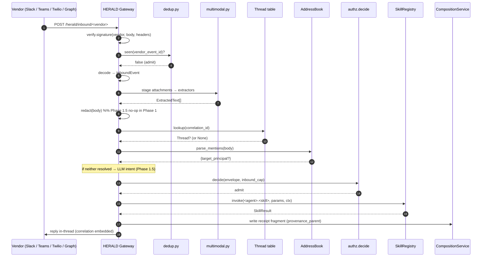
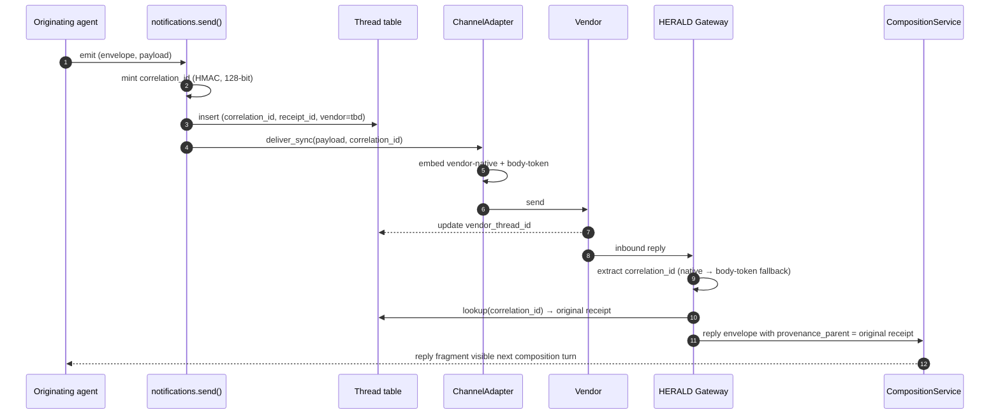

# ADR-067 — HERALD Gateway + reply-bind-back + TRIAGE inbound

**Status:** Proposed · **Date:** 2026-06-02
**Owner:** @ben
**Related:** ADR-049 (orchestration boundary / receipts), ADR-056 (skill-as-function), ADR-060 (cross-agent event routing), ADR-066 (SenderRegistry contract — prerequisite, in-flight), ADR-029 (federation composition), `docs/specs/spec-axiom-notifications.md` §3 (lines 103–143), `docs/prds/prd-axi-cli.md` §Agent Addressing

---

## Context

Every channel adapter under `src/axiom/extensions/builtins/notifications/channels/` is **outbound-only**. The platform can ship a notification from any agent to any human-reachable surface (Slack, Teams, Mattermost, Twilio SMS, email, inbox), but the reverse path — a human replying, forwarding, voice-memoing, or @-mentioning an agent from any of those channels — has no implementation.

Three concrete pieces of this gap are visible in the tree today:

1. `docs/specs/spec-axiom-notifications.md` §3 describes a reply-threading webhook architecture in detail — vendor-native correlation embedding, the `threads` table as the load-bearing mapping, provenance_parent reconstruction — but no Python file imports the spec. The `Thread` SQLAlchemy model at `src/axiom/extensions/builtins/notifications/db_models.py` has a `correlation_id` column with zero readers and zero writers.
2. The `signals` extension (`src/axiom/extensions/builtins/signals/`) already extracts voice, transcript, and freetext payloads through a clean `BaseExtractor.extract(source: Path, **kwargs) -> Extraction` seam at `src/axiom/extensions/builtins/signals/extractors/base.py`. It is isolated from the notification path — there is no caller of `VoiceExtractor` or `TranscriptExtractor` outside the signals extension's own HTTP server (`signals/serve.py`, a `BaseHTTPRequestHandler` stack that predates the FastAPI factory and must not be composed with).
3. `src/axiom/chat/addressing.py` already implements `parse_mentions` + `AddressBook.lookup`. It is used only inside the chat loop; there is no process-level lift that lets an inbound webhook resolve `@tidy` to a principal.

The platform goal — an always-on agent the operator can address from any channel they are already in — requires one unified inbound surface that (a) verifies the vendor signature, (b) decodes + dedups + redacts, (c) reconstructs thread context from the correlation-id, (d) classifies intent (deterministic `@mention` first, LLM fallback later), (e) authorizes through GUARD, (f) dispatches through `SkillRegistry`, and (g) replies in-thread with a misclassification escape hatch. None of those steps exist today.

## Decision

Introduce the **HERALD Gateway** as a FastAPI router mounted on the existing `http` extension at `/herald/inbound/<vendor>`. The gateway owns per-vendor signature verification, payload decode, attachment staging, dedup, and emission of `herald.inbound.<vendor>` events onto `axiom.infra.bus.EventBus`. **TRIAGE** — the existing diagnostics agent — gains a second role: the `triage.classify_inbound` skill (per ADR-056) consumes those bus events, runs the 10-step dispatch pipeline, and invokes the target agent's skill through `SkillRegistry`. Reply-bind-back is wired by minting + embedding a correlation_id at outbound `send()` time and looking it up on inbound; the `Thread` table becomes load-bearing.

### 1. Gateway placement and reuse

The gateway is a router on the `http` extension's existing FastAPI factory (`src/axiom/extensions/builtins/http/server.py`). It does **not** spawn its own HTTP server; the `signals/serve.py` precedent (parallel `BaseHTTPRequestHandler`) is an anti-pattern that this ADR explicitly avoids.

Per-vendor verification reuses the provider-factory pattern from `src/axiom/extensions/builtins/release/webhook_receiver.py` — the verified Git-provider receiver becomes one vendor among many under a shared `WebhookVerifier` protocol.

New files:

- `src/axiom/extensions/builtins/notifications/gateway/__init__.py`
- `src/axiom/extensions/builtins/notifications/gateway/routes.py` — one FastAPI route per `/herald/inbound/<vendor>`
- `src/axiom/extensions/builtins/notifications/gateway/verify.py` — per-vendor signature checks
- `src/axiom/extensions/builtins/notifications/gateway/decode.py` — normalize vendor payloads to `InboundEvent`
- `src/axiom/extensions/builtins/notifications/gateway/dedup.py` — per-vendor event-id LRU + TTL
- `src/axiom/extensions/builtins/notifications/gateway/auth.py` — inbound cap-token mint + validate via `vault.issue_capability`
- `src/axiom/extensions/builtins/notifications/gateway/multimodal.py` — attachment staging + `signals/extractors/` dispatch

### 2. The 10-step dispatch pipeline

```
1. HERALD Gateway receives webhook
2. Verify vendor signature                       → reject if bad
3. Decode + decrypt + attachment fetch           → InboundEvent struct
4. PII redaction (Phase 1.5 — for LLM mode)      → redacted copy for classifier
5. Correlation-id lookup → thread context        → if found, target agent known
6. @mention parse (deterministic; always first)  → if found, target agent known
7. LLM intent classifier (Phase 1.5; fallback)   → target_agent + skill + params
8. GUARD.decide(envelope, capability)            → admit/deny on the resolved skill
9. SkillRegistry.invoke(<agent>.<skill>, ...)    → dispatch
10. Receipt fragment + reply to operator in-thread
```

Ordering rationale: `@mention` (step 6) is deterministic and always wins when present, so the LLM is consulted only when no explicit address is found. PII redaction (step 4) runs **before** the classifier sees the body, so the LLM never ingests raw operator content; for Phase 1 (deterministic-only mode) the redaction pass is a no-op. GUARD (step 8) runs **after** classification because the authorization decision needs the resolved skill name to be meaningful.



### 3. Reply-bind-back — dual-channel correlation transport

Vendor-native fields are clean for direct replies; they **lose on cross-client forwarding** (the operator forwards a Slack notification to their personal email; the Slack metadata is gone). Every outbound dual-embeds:

| Channel | Vendor-native (fast path) | Body-token (forward-survives) |
|---|---|---|
| Slack | `metadata.event_payload.axiom_corr` | Footer `[axi-corr: <id>]` (small grey text) |
| Teams | `replyToId` + activity correlation | Footer in Adaptive Card |
| Mattermost | thread root post id | Footer |
| Twilio SMS | none (SMS has no metadata) | Inline at end: `…[axi:abc12]` |
| Email | `In-Reply-To` + `X-Axiom-Correlation` header | Footer + header |
| Inbox | record id | n/a |

The gateway tries vendor-native first and falls back to a body-token regex parse. Body tokens are 8 chars (collision space ~10^11 over the 24h dedup window). This survives every forward path tested today: Slack→email, Teams→email, email→email, SMS→email.



### 4. Multimodal extraction — reuse `signals/extractors/`

Attachments stage to a temp directory and route through the existing `BaseExtractor` seam:

```python
# notifications/gateway/multimodal.py (new)
from axiom.extensions.builtins.signals.extractors.voice import VoiceExtractor
from axiom.extensions.builtins.signals.extractors.transcript import TranscriptExtractor

def process_attachment(path: Path, media_type: str) -> ExtractedText:
    if media_type.startswith("audio/"):
        result = VoiceExtractor().extract(path)
        return ExtractedText(text=result.transcript, source_ref=path, kind="voice")
    if media_type.startswith("image/"):
        return _vision_extract(path)   # Phase 1.5 — new image extractor
    ...
```

**Caveat:** `signals/serve.py` uses `BaseHTTPRequestHandler` and predates the FastAPI factory. The gateway imports **only** from `signals/extractors/`; `serve.py` is not composed with. Phase 1.5 adds `signals/extractors/image.py` for OCR + vision; that new extractor follows the same `BaseExtractor` shape so the reuse pattern stays intact.

### 5. Per-vendor verification

| Vendor | Mechanism | Phase |
|---|---|---|
| Slack | Signing secret HMAC over raw body + timestamp; Events API; Bot Token | 1 |
| Teams | Bot Framework JWT (Microsoft App ID / Password); optional Graph `ChatMessage.Read.All` path | 1 |
| Twilio SMS | X-Twilio-Signature HMAC over URL + sorted POST params | 1 |
| Email (M365) | Graph subscribed-folder webhook; correlation via `In-Reply-To` + `X-Axiom-Correlation` | 1 |
| Mattermost | Outgoing-webhook token; optional slash-command verification | 2 |

The M365 Graph path uses a single Azure AD app registration covering both Mail (`Mail.ReadWrite`, `Mail.Send`) and chat (`ChatMessage.Read.All`); Teams Bot Framework auth is a separate runtime concern (App ID + Bot Service token) layered on the same tenant. Email inbound can ship before the Teams bot because email rides only the OAuth side.

### 6. TRIAGE persona extension

TRIAGE today owns CLI diagnoses. This ADR extends `src/axiom/extensions/builtins/diagnostics/agents/triage/persona.md` to add the **inbound classifier and dispatcher** role, with `triage.classify_inbound` as a skill function per ADR-056. The CLI-diagnoses role is retained; the persona description gains a second responsibility paragraph, not a rewrite. No new agent is invented.

Composition with ADR-066: TRIAGE's classifier maps a parsed `@mention` to a target agent through the `SenderRegistry` introduced by ADR-066. Without that registry, an `@tidy` mention cannot resolve to the canonical principal `@tidy:bens`. ADR-066 is therefore the prerequisite contract for ADR-067's classifier; both ADRs land before the inbound surface is end-to-end.

### 7. Inbound capability tokens (G1)

KEEP (`src/axiom/extensions/builtins/vault/__init__.py`) issues a cap-token per `(operator principal, inbound channel)`. The cap-token's scope declares which agents the operator may dispatch via that channel — e.g., a Slack-DM token can invoke any agent in the cohort, while a public-email-forward token can invoke only PRESS. Without this, GUARD has nothing concrete to decide against. The gateway mints these at registration time (one cap-token per channel binding); `gateway/auth.py` validates on every inbound.

### 8. Idempotency + rate-limit (G2)

Slack retries webhooks with the same `event_id`; Twilio retries with the same `MessageSid`. Without dedup, an agent action fires twice. `gateway/dedup.py` keys on the per-vendor event id with a 24h TTL — Postgres-backed in production, in-memory LRU in tests. Rate-limit budgets are per-(vendor, operator-principal) and surface as 429 to the vendor when exceeded.

### 9. Audit receipt (G3)

Every dispatched inbound lands as a memory fragment through `CompositionService` with `(actor=@triage, capability=<inbound-cap-id>, dispatched_skill=<agent>.<skill>, params_hash=<sha>)` and `provenance_parent` linking to the original outbound receipt when a thread match exists. This makes "what did agents do with operator messages this week" a single SQL query against the composition store.

### 10. Failure-visibility escape hatch (G4)

Phase 1.5 work item. Every dispatch posts a reply in-thread:

> Routed to `@rivet` (confidence 0.92, reason: `@mention`). Reply `no` to redirect.

On a `no` reply within 60s, the gateway revokes the cap-token on the dispatched skill (if the skill has not yet completed) and escalates to the operator with a "which agent?" prompt. The 60s window matches the typical p95 skill duration; longer-running skills are uninterruptible by design.

## Consequences

### Wins

- One unified inbound surface; new channels are a verifier + decoder pair, not a per-agent integration.
- Reply-threading becomes load-bearing — the `Thread` table finally has readers and writers, and forwarded messages survive thanks to the body-token fallback.
- Multimodal reuse: voice memos work in Phase 1.5 without rebuilding Whisper plumbing; the `signals/extractors/` seam is the right shape already.
- Audit: every dispatch is a receipt fragment, queryable like any other.
- TRIAGE's persona grows one paragraph instead of spawning a new agent.

### Costs

- Three subsystems (gateway, classifier, reply-bind-back) land in roughly the same window; the rollout sequences them so each PR is reviewable in isolation.
- M365 Graph OAuth is a non-trivial operator runbook step (one consent flow, one Azure AD app registration). The runbook ships with PR-4.
- The body-token footer adds a small visible string to every outbound; it is rendered as low-contrast grey on rich channels and as bracketed inline text on SMS.

### Non-goals

- Per-agent dedicated bot accounts (one Slack app per agent). Phase 1 ships a shared bot with ADR-066's per-message display override.
- Voice-call ingest (Twilio Voice). Phase 2 follow-up.
- Cross-cohort A2A inbound. Phase 3, gated on the trust-graph wiring of ADR-029.
- iMessage / Beeper / Discord. Phase 2+.

## Rollout

| PR | Scope |
|---|---|
| PR-1 | Gateway scaffold + verifier protocol + dedup + decode for the first vendor (Slack chosen first; highest daily traffic for the operator) |
| PR-2 | Slack inbound complete — Events API, Bot Token migration, mention extraction, thread reconstruction |
| PR-3 | SMS reply ingest — Twilio inbound webhook + thread reconstruction by (from-number × recent outbound) |
| PR-4 | M365 Graph OAuth foundation — single Azure AD app, Mail + ChatMessage scopes, token store via KEEP |
| PR-5 | Email reply ingest — Graph subscribed-folder webhook, `In-Reply-To` + `X-Axiom-Correlation` extraction (rides PR-4) |
| PR-6 | Teams inbound — Bot Framework webhook + Graph chat alternative (rides PR-4 OAuth) |
| PR-7 | Reply-bind-back outbound mint + embed — lands across PR-2 through PR-6 increments; the `Thread` table becomes load-bearing |
| PR-8 | TRIAGE inbound classifier — deterministic mode only (`@mention` + thread-context); LLM stub returns "please mention an agent" below floor |
| PR-9 | G1 + G2 + G3 — cap-tokens via KEEP, dedup behind Postgres, audit-receipt fragment writer |
| Phase 1.5 | G4 escape hatch, LLM intent classifier, multimodal (image extractor, voice through existing `signals/extractors/voice.py`) |

## Open questions

1. **Deployment topology.** Does the gateway live in the same process as the chat server (simpler config, shared lifecycle) or as a separate process behind the same ingress (independent failure domain, easier per-vendor scaling)? Same-process is the default for Phase 1; revisit if any vendor's webhook volume saturates a shared event loop.
2. **Body-token rendering in email.** Plain-text email surfaces the token cleanly; HTML email is harder — the token must survive `text/plain` fallback bodies and quoted-reply trimming by major clients (Outlook, Gmail). Phase 1 ships both the header and a plain-text footer; HTML rendering is a follow-up.
3. **Misclassification undo scope.** When the operator replies `no` within the 60s window, does the cap-token revocation cover only the specific dispatched skill, or all skills the inbound cap-token could have reached? Per-skill is the conservative default; platform-wide revocation is reserved for explicit override.
4. **Cross-channel reply correlation.** When the operator forwards a Slack-originated notification to email and replies there, the inbound arrives on the email vendor with a Slack-minted body-token. The gateway looks up by token (channel-agnostic), which works — but the `Thread.vendor_thread_id` becomes ambiguous. Carry a `cross_channel: bool` flag on the inbound envelope; downstream agents that care about the original channel can branch.
5. **LLM tier for the intent classifier.** Phase 1.5 wires an LLM fallback. Per ADR-054 the classifier prompt is small and latency-sensitive; default to the local tier with a remote-tier failover. The confidence floor below which the gateway escalates to the operator is a tunable, not a constant.

---

_Copyright (c) 2026 The University of Texas at Austin and B-Tree Labs. Apache-2.0 licensed._
