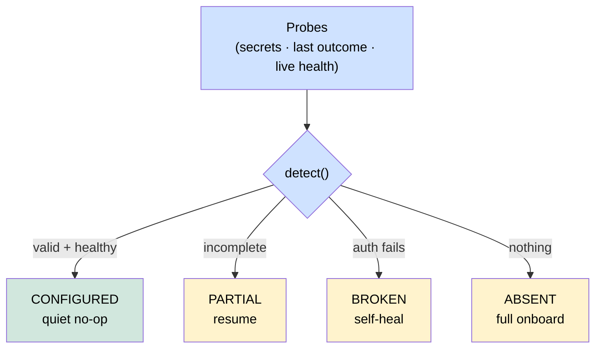

# ADR-068 — Detection as a uniform connector primitive

**Status:** Accepted · **Date:** 2026-06-05
**Owner:** @ben
**Related:** ADR-057 (connector as top-level primitive), ADR-059 (connector-first vendor unification), ADR-066/067 (HERALD sender + inbound gateway — first bidirectional connectors), connection-onboarding capstone

## Context

The connector framework can install, send, and report a last-known outcome, but onboarding still opens on a blank form regardless of what already exists. A user who is already signed into Slack, already has an app, or already configured a connector last week is asked the same questions again; a connector whose token silently expired looks identical to one that was never set up. Competitors (Mem0, Letta, LangGraph) have thin connection UX; "opens on what's already true" is the differentiator the capstone targets.

The framework already has the raw material — `connect/cli.py` detects installed CLI tools, and `connector/status_store.py` records a per-connector `ConnectorOutcome` with `reconnect_required`. What is missing is a **single, uniform answer** to "what state is this connector in?" that every connector type — chat channel, SMS, cloud/identity surface, code host, store, or an Expman data source — produces the same way, so the wizard and the status view can branch on it identically.

## Decision

Detection is a **first-class connector primitive**: every connector resolves to one of four states via `detect()`.

```python
class ConnectorState(str, Enum):
    CONFIGURED  # valid creds + (live or last-known-good) health → quiet no-op
    PARTIAL     # some setup exists (creds incomplete, or app made but URL unwired) → resume
    BROKEN      # creds present but auth fails / reconnect_required → self-heal the bad part
    ABSENT      # nothing → full onboarding
```

`detect()` returns a `DetectResult(state, summary, next_action, details)`. The wizard **opens on the detected state** (resume / self-heal / no-op), and `connect status` renders state + a one-line next action per connector.

### Detection-by-default, vendor-extensible

`default_detect()` derives the state from three cheap, universal probes so **every connector gets detection for free**:

1. stored-secret presence (any / all required),
2. the status store's last `ConnectorOutcome` (`reconnect_required` / `ok`),
3. an optional live `health()` check (e.g. Slack `auth.test`), which is **authoritative over stale status** when present.

Richer vendors override `detect()` to add account/session signals — Slack CLI auth, `gh auth status`, `az` login, an existing app via the manifest API — but the four-state model and the wizard's branching stay identical. `detect_connector(handler, **probes)` prefers a vendor override and falls back to the default, so adding detection never breaks an existing handler.



### What detection must NOT do

No scraping of a vendor's desktop/browser session (e.g. Slack's `xoxc`/`xoxd` cookies from the desktop app's local storage). Fragile, unsupported, and a credential-exfiltration smell. Legitimate "existing account" signals are the vendor's own CLI session and Axiom's prior stored credentials.

## Consequences

**Wins**
- Onboarding opens on reality: reuse / resume / self-heal instead of re-asking. This is the "idempotent + self-healing status" capstone pillar, with a detection front-door.
- One state model across every connector type — the wizard, the TUI, and `connect status` share it; new connectors inherit detection with zero extra code.
- The irreducible human step (a vendor's first consent) is isolated; everything after it is detected and automated.

**Costs**
- A live `health()` adds one network round-trip at detect time; it is optional and cached against the status store when omitted.
- Vendor overrides that read a CLI session must do so defensively (missing binary, unauth'd) — the default catches the absent case.

**Non-goals**
- The Rich TUI surface and per-vendor enhanced `detect()` (Slack CLI, manifest-API app discovery) are follow-ups that consume this primitive.

_Copyright (c) 2026 The University of Texas at Austin. Apache-2.0 licensed._
