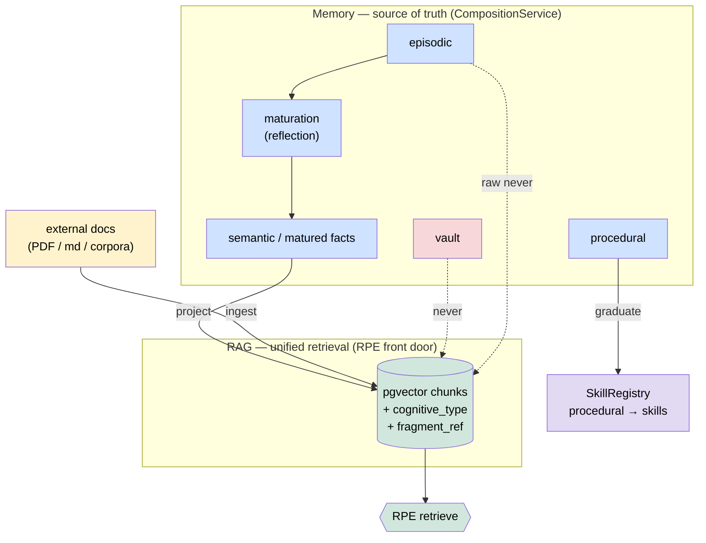

# ADR-069 — Memory ↔ RAG boundary: memory authoritative, RAG as unified retrieval

**Status:** Accepted · **Date:** 2026-06-05
**Owner:** @ben
**Related:** ADR-033 (layered memory), ADR-026/035 (ownership/accountability), spec-rag-architecture, spec-memory-maturity, spec-rag-knowledge-maturity, RPE spec, `agents/learning.py`, the conversational-agents + self-improvement epics (axiom-os #473, #475)

## Context

Two subsystems both implicitly claim to own "what the system knows," and the seam between them was never decided — so it drifted:

- **Memory** — `CompositionService` is documented as *"the single entry point for all memory ops"*; persists `MemoryFragment` with immutable `(T,U,A,R)` provenance + ownership + signature, MIRIX 6 types (core/episodic/semantic/procedural/resource/vault), to the artifact registry.
- **RAG** — `rag/store.py` is pgvector chunks of **filesystem documents** (`source_path`, `chunk_text`, `embedding`); three corpora (community/org/internal). It has **no `cognitive_type` column and never indexes a `MemoryFragment`.**

A code audit (2026-06-05) found the integration is **aspirational, not built**:

- `agents/learning.py` docstring asserts *"Agent knowledge IS RAG knowledge; the corpus is the source of truth"* — but the implementation only appends telemetry to `~/.axi/logs/*.jsonl`; **nothing reaches the RAG corpus.**
- `memory/maturation/reflection.py` turns episodes into semantic **fragments**, never RAG chunks.
- `rag/rpe.py` (Retrieval Policy Engine, 8 intents) emits plans with `cognitive_types=("semantic",)` filters **against a chunk schema that cannot honor them.**
- `chat/agent.py` uses memory and RAG on **two unconnected retrieval paths**.

Result: duplication/drift risk, an unhonored retrieval contract, and no answer to the questions the conversational-agent + self-improvement work depends on (is cross-channel recall a memory read or a RAG query? does a learned pattern become retrievable?).

## Decision

A **layered contract**, not "one store wins":

1. **Memory is authoritative for everything the system learns or experiences.** The `(T,U,A,R)` ledger via `CompositionService` is the single source of truth for learned/experienced knowledge. `learning.py`'s "corpus is the source of truth" is **inverted**: memory is. The corpus is downstream.

2. **RAG is the unified retrieval layer with two feeders:**
   - **(i) external ingested docs** — PDFs, markdown, domain corpora — indexed directly. These were never "memory"; RAG is their index of record.
   - **(ii) a derived projection of *retrievable* memory fragments** — `semantic` + maturity-promoted facts. **`vault` is never projected; raw `episodic` and `core` are never projected** (only their matured semantic distillations are).

3. **Maturation is the one bridge.** `episodic → SemanticProposal → (accepted) semantic fragment in the ledger → projected into RAG`. There is **one write path** (everything writes to memory; an indexer projects retrievable fragments into RAG). No dual-write, no drift.

4. **RPE is the single retrieval front door** over both feeders. `cognitive_type` becomes a real column on the chunk schema so RPE's existing filters mean something; a projected fragment carries its type + a back-reference to its fragment id (provenance survives retrieval).

5. **`procedural` memory does not go to RAG — it graduates into Skills** (the SkillRegistry, per the self-improvement epic #475). RAG indexes *knowledge*; the skill path owns *how-to*.

6. **Federation unit = fragments.** RAG projections derive locally on each node; knowledge-packs are curated projections, not the canonical store. Classification/ownership gating happens at the ledger; projection inherits it.

## Consequences

**Wins**
- One source of truth (the ledger) → no drift; provenance + ownership + classification survive into retrieval via `fragment_ref`.
- The downstream features fall out: cross-channel recall = a `(agent, owner)`-scoped RPE query over the projection; skill-synthesis mines the projected corpus; learning-reports read the ledger by time window.
- RPE's `cognitive_types` filters become honest (schema gains `cognitive_type`).
- `vault` and raw episodic stay out of retrieval by construction — a privacy floor, not a policy afterthought.

**Costs**
- Build a **projection indexer** (memory retrievable-fragment → chunk) + a `cognitive_type` (+ `fragment_ref`) migration on the chunk schema.
- `learning.py` must be rewritten to write patterns as fragments (then projected), replacing the telemetry-only path.
- Re-ingest/backfill: existing corpora keep working (feeder i); only the projection (feeder ii) is new.

**Non-goals**
- Not merging the two stores into one physical table (memory stays the ledger; RAG stays the index).
- Not deciding embedding model / chunker (separate; unchanged).

## Open questions
1. Projection trigger — synchronous on fragment accept, or batched by the maturation stage?
2. Do `resource` fragments (refs to external blobs) project, or just point RAG at the blob ingest?
3. Eviction — when a fragment is superseded, how is its projected chunk invalidated (fragment_ref makes this tractable)?

_Copyright (c) 2026 The University of Texas at Austin. Apache-2.0 licensed._
