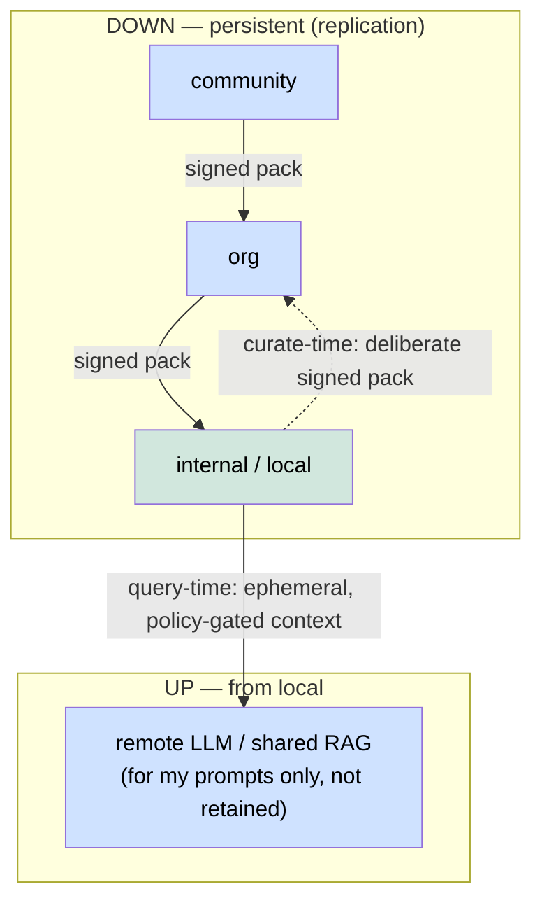

# ADR-070 — Knowledge architecture: federation flow + data-platform as optional scale provider

**Status:** Accepted · **Date:** 2026-06-05
**Owner:** @ben
**Related:** ADR-069 (memory↔RAG boundary), ADR-027/029 (federated memory / composition), ADR-030 (federated inference), ADR-052 (db tenancy), spec-rag-architecture, spec-federation-policy, RPE spec, CURIO (research ext), PLINTH (data_platform ext)

## Context

ADR-069 fixed the memory↔RAG seam (memory authoritative; RAG = unified retrieval fed by external docs + a projection of retrievable fragments). Two adjacent relationships were still undecided, and they must be recorded *before* the data-platform is built out further (so the build has a north star):

1. **Federation directionality.** Knowledge-packs already cascade **down** (community → org → internal). The reverse — how a node's *personal* knowledge participates upward, e.g. when `axi chat` switches to a powerful **federated remote LLM** that should use my personal RAG "for my prompts only" — was undefined.
2. **Data-platform coupling.** The medallion/Dagster data-platform (PLINTH) could power ingestion + projection at scale, but making `memory`/`rag` depend on it taxes every solo install with a heavyweight stack (Dagster/k8s/Iceberg). Keeping it out entirely forfeits scale.

## Decision

### 1. Federation is asymmetric: packs down, ephemeral retrieval up

- **Down = persistent packs, read-cascade.** Curated, signed, versioned knowledge-packs install downward; retrieval reads all tiers together. Replication.
- **Up #1 — query-time (ephemeral, default):** the personal (internal) tier is a *retrieval source*, never a tier the remote caches. RPE fans `[local internal, remote shared]` via `SourceSpec(remote=…, node=…, tier="internal")`. Two shapes: **(A) edge-assembled** — local RPE retrieves, policy-gates, the chunks ride the prompt up (default; no inbound reachability); **(B) cap-gated callback** — remote RPE queries down under a scoped, revocable KEEP cap-token; query travels down, results up. Either way nothing of yours is **retained** in the shared corpus — that is the "for my prompts only" guarantee.
- **Up #2 — curate-time (persistent, opt-in):** matured local knowledge → a human-curated, signed pack published upward (the deliberate inverse of the cascade). Not automatic.
- **The asymmetry enforcer:** every projected chunk carries `visibility` + `classification` + `fragment_ref` (ADR-069). Upward flow passes the federation gateway's `min(visibility, classification.allowed_outflow)`. **`vault` + raw `episodic` never project, so they flow neither way.** `fragment_ref` lets the remote **dedup** contributed context against its shared corpus and lets a remote answer's citation trace back to *your* fragment.

### 2. Data-platform = optional scale provider, behind a seam (dependency-inverted)

- **Dependency direction is one-way: `data_platform → memory/rag` contracts, NEVER the reverse.** Core never imports `data_platform`; a solo `pip install` never drags in Dagster.
- **Projection (ADR-069 feeder ii) and external ingest (feeder i) are provider seams** — a small `Projector`/`Ingestor` protocol with a *default lightweight in-process impl*. When `data_platform` is installed it registers a *scale impl* (same pattern as `SecretStoreProvider`/`TunnelProvider`/`ChannelAdapterProvider`).
- **Role split:**

  | | Core (always, light) | data-platform / PLINTH (optional, scale) |
  |---|---|---|
  | projection | per-fragment, near-real-time, in-process | batch re-embed/re-project the ledger; scheduled corpus rebuilds; lineage/watermarks |
  | external ingest | `docs/` dir walk | Box→bronze→silver→gold→RAG medallion at source scale |
  | deps | pgvector + ledger | Dagster, k8s, Iceberg |

- **Three roles stay distinct:** **memory** = provenance / source of truth; **CURIO** = quality + maturity gating; **PLINTH/DP** = the conveyor (ETL/medallion). DP moves + refines bytes; it never owns "truth." Medallion **gold ↔ shared/community corpus tier**.

### 3. Light-local / heavy-remote (the two decisions compose)

The shared/remote service node + facility installs (a domain consumer / its scientific-workload data) run the **heavyweight DP provider** (that's where scale lives); solo/local installs run the **light core** (no Dagster). Same seams, different providers. So DP is *absent* from the personal-RAG-rides-my-prompt path (it stays light) and *present* as the scale engine on the service side. Deliberate pack-promotion (Up #2) executes through DP on the shared node.

## Consequences

- Solo installs stay light; scale + federation are enabled with **no core dependency penalty**.
- Clear seams to build the data-platform *into* (Projector/Ingestor providers) without retrofitting the core.
- The "for my prompts only" privacy guarantee is structural (outflow gate + never-project vault + non-retention), not a promise.

**Status of pieces:** down-cascade + 3 tiers, RPE `remote`/`node`/`tier`, CURIO knowledge-packs, ADR-069 projection — exist or in-build. The **upward retrieval-federation glue (Pattern A/B), the pack-promotion publish path, and the DP scale-provider impls are NOT assembled** — they are the tracked build-out this ADR aims.

_Copyright (c) 2026 The University of Texas at Austin. Apache-2.0 licensed._
