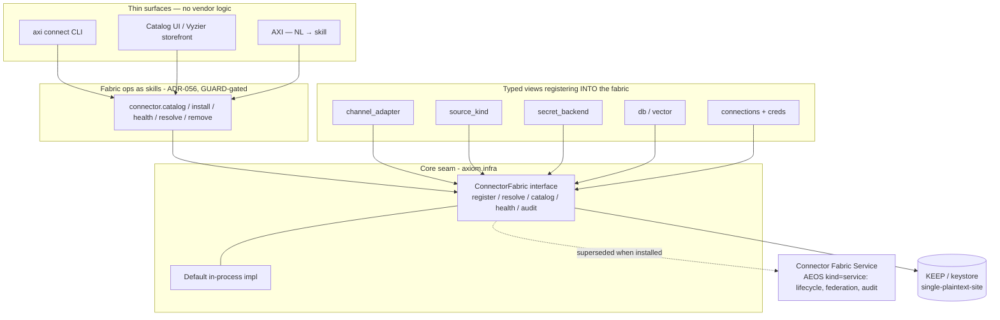

# ADR-074 — Registry Fabric: one registry for connectors, extensions, packs & inference (shared service behind a core seam)

**Status:** Proposed · **Date:** 2026-06-16
**Owner:** @ben
**Builds on:** ADR-056 (skills as invocable functions), ADR-052 (dep direction: scale providers behind a seam, never reverse), ADR-001/notifications (channel_adapter as an AEOS kind), ADR-072 / AEOS §4.9 (capability projection — surfaces are projections of one capability), ADR-027 (federated memory: cohort registry + `axiom://` + A2A), ADR-028 (trust graph), ADR-029 (federation composition)
**Related:** axiom-os#463 (Unified Credential & Secret Fabric — parked), KEEP (vault), #538 (UT-NE corpus onboarding), #540 (TRIAGE→SCAN→TIDY remediation)

## Context

Axiom integrates with external systems through two complementary concepts that today live in **separate, scattered registries**:

- **Connections** — a named endpoint + credential + health-check. Declared per-extension in `[[connections]]`, stored in a process-global `ConnectionRegistry` (`axiom.infra.connections`), creds resolved env → settings → 0600 file.
- **Providers/adapters** — typed behavior factories declared via `[[extension.provides]] kind = …`, each kind in its **own** registry owned by its domain: `ChannelAdapterRegistry` (comms), `SourceKindProvider` (ingest: Box/GDrive/S3), `SecretBackendProvider` (openbao/env/kubernetes), `DatabaseKindProvider`/`VectorStoreProvider`. A provider names its credentials via `connector_ref`.

Consequences of the scatter:
- **No single catalog / health / audit surface.** "What connectors exist, are they authenticated, when did they last succeed?" has no one answer — which is exactly the visibility a sysadmin (and TRIAGE) wants, and which the recent Box-auth and langfuse-OOM incidents made painful.
- **No agent/human parity path.** A future "browse + click-install" UI and "ask AXI to install it" must drive the *same* operations or they drift.
- **Comms must go multi-vendor.** The incident/HITL POC needs Slack now and Teams next behind one interface, plus an automated connector install (manifest + OAuth) — which has no home in the current per-kind registries.
- The **Unified Credential & Secret Fabric** (#463) + **KEEP** already envisioned a single broker, but were parked.

## Decision

Establish a **Registry Fabric**: one logical registrar + resolver + catalog + health/audit + federation surface for all **discoverable, installable capability artifacts**, structured as a **shared service behind a core seam**. **Connectors are the first artifact class implemented** (driven by the incident-comms POC); the same fabric indexes other classes rather than re-inventing a registry per class.

### Unification: one substrate, typed artifact classes
Axiom today has ~four parallel, ad-hoc registries: `ConnectionRegistry` (connections), `cli/ext/registry_backend.py` (the Vyzier extension marketplace), `packs.py` (signed federated bundles), `inference_catalog.py` (federated resources). They share one substrate — discover → catalog → trust-gated signed pull → classify → audit → federate, surfaced as skills via CLI/UI/AXI. The Registry Fabric **consolidates them**. Only two things vary per artifact, so they are the per-class plug-points:

| Artifact class | Install action | Risk tier |
|---|---|---|
| **Extension** | load code into the runtime (AEOS conformance lint, sandbox, signed wheel) | highest — it's code |
| **Connector** | configure an integration (creds + provider + health) | medium — config |
| **Pack** | land a signed knowledge/data bundle | content/classification |
| **InferenceResource** | register an endpoint | reachability/classification |

Connector *kinds* (channel_adapter/source_kind/secret_backend/…) are sub-types **within** the Connector class; the artifact classes above are the top-level typing.

**Caveat — unify the plumbing, not the rigor.** "Same registry" unifies the substrate, catalog, federation, and surface; it must NOT flatten trust/install rigor. Installing an extension (running code) stays a higher-trust, conformance-gated, sandboxable act than configuring a connector. The rigor lives in the **per-class installer/verifier**; the plumbing (catalog/trust/signing/federation/skills) is shared. Per-class handlers over one trust model are cleaner than four registries each rolling their own.

The remainder of this ADR describes the shared substrate using connectors as the worked example; substitute the per-class installer to apply it to extensions/packs/inference.

1. **Seam in core (`axiom.infra`).** A `ConnectorFabric` interface — `register`, `resolve(name|kind)`, `catalog()`, `health()`, `audit()`. Always present; ships a default in-process implementation. Nothing in core depends on an extension.
2. **Shared-service backend (AEOS `kind = "service"`).** A long-lived **Connector Fabric Service** extension implements the seam — owns lifecycle, the unified catalog/health view, audit receipts, and (later) federation. It **supersedes** the in-process default when installed; the dependency arrow never reverses (cf. ADR-052).
3. **Per-kind registries become typed views** that register *into* the fabric. Type safety stays (a `channel_adapter` ≠ a `source_kind`); enumeration, resolution, and health unify. **Connection (creds+health) + Provider (typed behavior)** remain linked by `connector_ref`.
4. **Operations are skills** (ADR-056): `connector.catalog`, `connector.install` (the manifest/OAuth automation, e.g. Slack), `connector.health`, `connector.resolve`, `connector.remove` — `(params, ctx) -> SkillResult`, GUARD-gated.
5. **Surfaces are thin clients** over those skills: CLI today, a catalog UI / Vyzier storefront later, AXI via NL anytime. Click-install and ask-AXI are the *same* skill calls → parity by construction.
6. **Credentials resolve through the keystore** (KEEP / `secret_ref`, single-plaintext-site) — the fabric holds metadata + pointers, never plaintext. This folds #463 + KEEP in as the credential layer of the fabric.

## Federation (connector discovery across registries)

A Connector Fabric instance is not only local — a **registry is a federated, cohort-scoped, signed connector catalog**, reusing the existing federation substrate rather than a new one. The precedent is `inference_catalog.py` (already federates a *catalog of resources* across peers) and `packs.py`/`pack_server.py` (federate *signed distributable bundles*).

7. **A registry declares its federation membership.** A registry-type extension advertises itself into a **cohort** (ADR-027 cohort registry, addressable via `axiom://`), and declares in that membership: the **scope** (which cohort/compartment), the **classification ceiling** (`policy.py` — e.g. an export-controlled cohort), and the **auth/trust it requires to join+pull** (required trust level, credential type, signature policy).
8. **Agents join a cohort to discover + pull connectors from its registry.** Discovery rides the existing federation discovery (`discovery.py`/`mdns.py` + agent cards); access is gated by the **trust graph** (`trust.py`, ADR-028) and enforced by **WARDEN/Vega** — a connector pull is admitted only if the agent meets the registry's declared trust + classification requirements.
9. **Multi-cohort membership = reach into multiple connector ecosystems.** An agent can belong to several cohorts, each exposing a different connector catalog (e.g. an internal facility cohort + a public community cohort); `connector.catalog` aggregates the cohorts the agent is admitted to.
10. **Pulling a connector is installing capability from a (possibly external) source — so it is trust-gated end to end:** connectors are **Sigstore-signed** (AEOS release rule), signature-verified on pull, **classification-ceiling-checked** (an EC/compartmented cohort's connectors never resolve into a lower-classification context — cf. a domain consumer's EC-aware ingest), and recorded with an audit receipt. The fabric never auto-installs an unsigned or over-classified connector; that is a loud refusal, not a silent fetch.

This makes "agents pull/configure new connectors from a registry by joining its federation, and join other federations for other connector types" a direct application of the cohort + trust + signed-pack model — not new machinery.

## Consequences

**Positive**
- One catalog + health + audit surface across every connector kind — the global visibility TRIAGE and sysadmins need (directly serves #540 and the health thread).
- Agent/human parity is structural: UI, CLI, and AXI dispatch identical GUARD-gated skills.
- Comms goes multi-vendor cleanly: Slack and Teams are each one connection + one `channel_adapter` provider registered through the fabric; the incident/HITL workflow touches only the seam.
- Un-parks #463; provides the registry/runtime that Vyzier (marketplace surface) sits on later.

**Costs / risks**
- Migration: existing `ConnectionRegistry` + per-kind registries must adapt to register through the fabric. Done **incrementally** (seam + in-process default first; new connectors register through it; old registries become views over time) — not a big-bang refactor.
- Dependency-direction discipline must hold (core → seam only; service is a backend, never a core import).
- Scope creep: the fabric must not absorb policy/authz — GUARD/policy stays where it is; the fabric calls it.

**Non-goals (now)**
- No catalog UI build (that's later / Vyzier).
- No mass migration of all registries in one PR — the seam lets us migrate per-kind.

## Adoption path
1. Land the **seam + in-process default** in `axiom.infra` (interface + `register/resolve/catalog/health`).
2. Build the **incident-comms POC against the seam**: register a `slack` connection + an interactive `channel_adapter` provider through the fabric; prove the workflow on an in-memory channel, then the real Slack provider.
3. Expose fabric ops as **skills**; wire `axi connect` to them; AXI inherits them via the skill registry.
4. Stand up the **Connector Fabric Service** extension; migrate the per-kind registries to views; fold KEEP/secrets in as the credential layer (#463).
5. **Federation last:** expose a registry as a cohort-scoped, signed connector catalog; gate pulls via the trust graph + WARDEN + signature/classification checks; support multi-cohort membership. Local fabric works without any of this — federation is additive.
