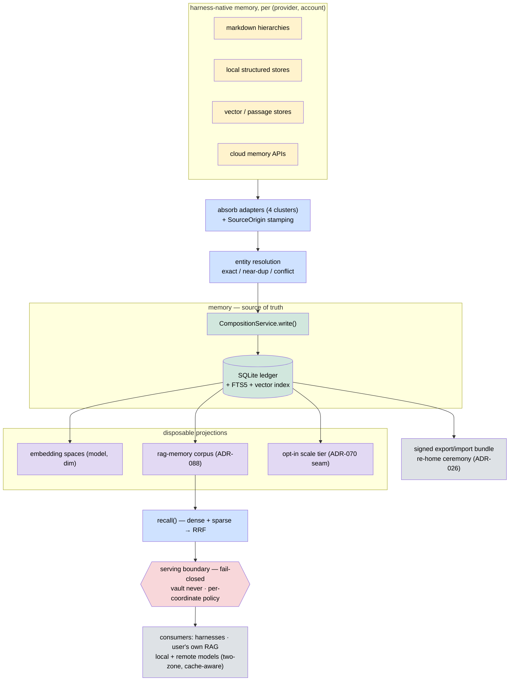

# ADR-087: cross-mem — portable cross-harness memory (absorb / migrate / sync / serve)

**Status:** Proposed · **Date:** 2026-07-10
**Owner:** @ben
**Companion:** ADR-088 (memory-recall projection corpus; amends ADR-069 projection scope)
**Related:** ADR-026 (ownership transfer), ADR-027 (federated memory), ADR-035 (accountable human), ADR-052 (schema-per-extension), ADR-056 (verbs = skill functions), ADR-069 (memory ↔ RAG boundary), ADR-070 (projector/ingestor provider seam), RPE spec, spec-rag-architecture

## Context

Users work across many agent harnesses, and every major harness now ships its
own "memory." A 20-product survey (2026-07) found the field collapses into four
memory models: **markdown-hierarchy instruction files** (CLAUDE.md / AGENTS.md /
GEMINI.md / rules files — AGENTS.md is the emerging shared convention),
**local structured stores** (per-app SQLite / delimited text), **vector or
passage stores** (archival memories, searchable threads), and **cloud
account-bound memories** (server-side, often without any API). Most products
span two layers: an authored file layer plus an auto-extracted memory layer.

The result for a user is fragmentation: memory is siloed per
`(harness provider, account)`. Moving from one licensed account to another
(same provider or different provider) loses it. Axiom today has no surface for
this, and recall has structural gaps:

- No fragment export/import, no cross-principal re-home, no portable session
  checkpoints (session metadata lives in per-node JSON outside
  `CompositionService`).
- `read()` is fetch-by-id only; there is **no semantic search over fragments**.
  Recall is structured filtering, with O(N) scan paths in places where an O(1)
  keyed lookup and existing indexes go unused.
- Only `semantic` fragments project into retrieval (ADR-069 D2.ii), so
  episodic/procedural/resource recall is unreachable by query.
- Naive context injection invalidates provider prompt caches (all major
  providers cache by exact prefix), making a memory layer a latency/cost
  regression on every turn if it is not cache-aware.

**Constraint:** everything here is additive. Memory-authoritative (ADR-069),
the single write path via `CompositionService`, immutable provenance, and the
`data_platform → core` dependency direction (ADR-070) are preserved, not
renegotiated.

## Decision

**D1. Origin coordinate.** Every memory has an origin coordinate
`(harness, account)`. `Provenance` gains a write-once `SourceOrigin` record:
`harness`, `account` (opaque, provider-scoped), `source_ref` (the source
store's own id or a stable content hash), `imported_at`. Fragments without one
decode as `origin: native` via the established versioned-decoder pattern
(schema v3). `(harness, account, source_ref)` is the **idempotency key** for
dedup and sync. The originating coordinate survives re-homing, so later
extraction can be scoped by source.

**D2. One import primitive.** Absorb (ingest a harness's native memory),
migrate (move between accounts/providers), and sync are the same operation:
`import(fragments, from_coord → to_coord)` with origin-preserving provenance.
Sync is that primitive applied continuously in both directions, hub-and-spoke
with the Axiom store as the single reconciliation point; the idempotency key
suppresses echo (a fragment we wrote out is recognized when read back, never
re-imported). Continuous sync runs as a managed service under the platform
service-reliability contract and is event-driven, not busy-polling.

**D3. Dedup is entity resolution, not a boolean.** Pipeline: blocking
(lexical + structured keys) → matching (content hash / idempotency key →
vector similarity → adjudication only for the ambiguous middle band) →
clustering → canonicalization. Three confidence tiers: **exact** (auto-collapse),
**near-duplicate** (auto-merge, reversible), **conflict/ambiguous** (keep both,
flag; never auto-merge). Merges supersede via tombstone
(`deduped:merged-into:<id>`) and preserve the alias set of every folded source
coordinate, so per-source extraction survives merging and no data is silently
lost. Two clocks: a write-time near-neighbor check and a scheduled corpus-health
re-cluster pass.

**D4. Storage posture: SQLite stays authoritative; stop using it as a blob
store.** The write path (write-once fragments + signed append-only audit) is
OLTP and remains zero-daemon, local-first SQLite. Additions: FTS5 (explicit
`bm25()`) and a vector index over fragments — no new process. Read
accelerators are optional projections behind the ADR-070 provider seam: an
embedded analytical engine over the same file for episodic range/aggregate
recall, and an opt-in server-backed scale tier (Postgres + pgvector +
time-partitioned episodic storage). A server daemon is never the default: a
mandatory always-on dependency is itself a reliability regression.

**D5. Recall entrypoint.** A new `CompositionService.recall(query, intent,
filters)` routes through the existing hybrid retriever (parallel dense + sparse
→ reciprocal rank fusion) over the memory-recall corpus defined in ADR-088,
with structured predicates (cognitive type, principal, time range) as
pre-filters and the RPE recency/salience parameters finally applied in scoring.
`read()` keeps its fetch-by-id semantics unchanged.

**D6. Projection doctrine and rendering discipline.** Authoritative text at
the center; every accelerated representation is a disposable, rebuildable
projection: search indexes, embedding spaces keyed `(model, dim)` (canonical
space always maintained; secondary spaces lazily; Matryoshka truncation where
supported; a query-time embed endpoint so consumers never match spaces), and
**KV/prompt caches** keyed `(model, tokenizer, exact prefix)` — never stored or
ported by Axiom, but respected by construction:

- **Two-zone injection layout**: an epoch-pinned, content-hashed memory
  preamble in the stable prompt prefix (cache breakpoint after it); per-turn
  recall only in the volatile tail after conversation history.
- **Epoch pinning**: the preamble renders from a snapshot, pinned per
  session/provider-TTL window; mid-session arrivals are tail deltas.
- **Byte-identical rendering**: canonical ordering, no timestamps in rendered
  content; a no-op sync writes nothing.
- **Session injection ledger + hysteresis**: never re-serve what is already in
  context; prefer previously injected fragments on ranking ties.
- **Hard cadence rule**: instruction-file write-back happens only at session
  boundaries / epoch rollover — never mid-session.

**D7. Serving boundary: one door out, fail-closed.** Symmetric with the write
invariant (one door in via `CompositionService`), all serving passes a single
gate in the serving layer, after retrieval, before text serialization —
never delegated to adapters or callers. Doubt → deny: missing/unknown label,
policy-engine error or unavailability, unresolvable consumer identity all deny.
`vault` never serves, unconditionally. The consumer coordinate includes the
**model endpoint / deployment tier**: a locally hosted model and a remote
third-party API are different exposure domains, and entitlement is evaluated
against the consumer's *entire storage domain* (harness transcripts, its
auto-memory extractor, its cloud sync), not the single prompt. Corollary
(**no-push rule**): fragments are never pushed into a foreign retrieval store —
serving stays query-time so the gate runs per request; the only sanctioned exit
is the explicit export ceremony (D9). Coexistence with a user's existing RAG is
first-class: side-by-side blocks (default), opt-in rank-level RRF fusion
(fusing, never ingesting), or cross-mem as one policy-gated retriever inside
the user's own pipeline.

**D8. Absorb adapters: one per memory model, four total** (markdown-hierarchy;
local structured store; vector/passage; cloud API). Adapters are read-only
against source stores; app-owned databases are never written (schemas churn).
Write-back for sync goes **only through the authored instruction-file layer**
(AGENTS.md as the cross-harness common denominator, per-product rules files as
fallbacks) — auto-memory stores are read-only in practice (no API, opaque, or
actively rewritten by the vendor's own extractor).

**D9. Export / import / re-home.** `axi memory export` produces a signed
portable bundle: fragments (JSONL) + manifest (schema versions, counts, content
hashes) + session checkpoints + an audit-log slice; `vault` content is opt-in
with re-encryption, never silent. `axi memory import --assume-principal`
performs the ADR-026 dual-signature re-home ceremony and re-signs under the
destination node key; the exact dedup tier makes re-import idempotent. Session
metadata is brought inside the exportable surface. Both verbs are skill
functions per ADR-056. KV-cache warmth is explicitly out of scope for
migration: text ports, the destination pays one cold prefill.

**D10. Phasing.** P0: same-provider account port (export/import + re-home;
no index, no daemon, no cloud adapters) with a recall-parity + audit-continuity
acceptance gate. P1: recall performance + the recall index (D4/D5). P2: absorb
adapters + cross-provider migration. P3: the serving face (gate, embedding-space
registry, cache-aware rendering, one-shot write-back). P4: continuous
bidirectional sync (D2). A retrieval-fusion orchestration extension
(many *retrievers*, ensemble-planned) is a named successor, strictly downstream;
nothing in cross-mem depends on it.

## Consequences

**Wins**
- One user-owned memory across every harness and account, with per-source
  provenance that survives merging and re-homing.
- Account/provider migration becomes a supported ceremony instead of data loss.
- Recall becomes hybrid semantic search reusing the existing retriever stack
  (RRF, embeddings, FTS) rather than a parallel implementation.
- Memory injection preserves provider prompt-cache economics by construction —
  a measurable differentiator over naive injection.
- The serving boundary gives security review a single auditable choke point.

**Costs**
- Index storage and an embedding pipeline over fragments; entity-resolution
  complexity (thresholds, adjudication, review queue).
- Preamble epoch pinning trades within-session freshness for cache stability
  (mitigated by tail deltas).
- Migration loses cache warmth (inherent; disclosed).
- A continuous-sync service is a new managed process (accepted only under the
  service-reliability contract, and only at P4).

**Non-goals**
- Not a new store: the ledger stays authoritative; every new structure is a
  rebuildable projection.
- Not a generation-model router: the serving layer knows the destination tier
  for policy and sizing, it never routes model calls.
- Not pushing memory into third-party stores (no-push rule).

**Documentation obligations (ship with this ADR's implementation):** a
security document specifying the serving-boundary contract (policy flattening,
doubt→deny enumeration, cross-account and deployment-tier rules, co-residency
threat model incl. prompt-injection exfiltration and transcript-indexing echo);
product documentation naming the cache-friendly serving architecture as a
feature, with measurable framing.

## Open questions
1. Near-dup threshold + adjudication policy (fixed vs learned).
2. Conflict-resolution default for continuous sync (LWW by event time vs
   keep-both vs confirm).
3. Bundle format details (leaning: single signed archive, fragments-inside;
   compatible with agent-file-style interchange).
4. Vault re-encryption ceremony specifics for opt-in export.

_Copyright (c) 2026 The University of Texas at Austin. Apache-2.0 licensed._
