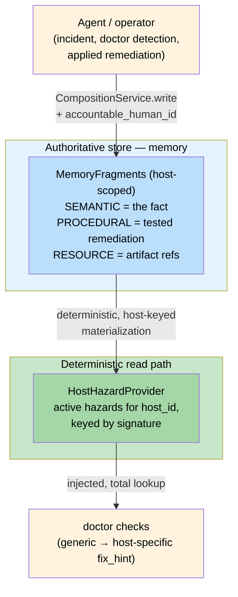

# ADR-089 — Host-hazard registry: memory-authoritative store, deterministic host-keyed projection

**Status:** Proposed · **Date:** 2026-07-07
**Owner:** @ben
**Related:** ADR-036 (bounded service env / reliability contract), ADR-069 (memory authoritative, retrieval as projection), ADR-070 (knowledge architecture / federation asymmetry), ADR-035 (accountability at write), ADR-052 (schema-per-extension persistence), ADR-050 (tenant/site vocabulary), `cli/doctor.py` reliability checks, `infra/services.py` install guards

## Context

The node-reliability checks (`check_managed_services`, `check_gpu_contention`, `check_package_coherence`) and the cross-platform install guards detect **structural** conditions generically and deterministically. That is deliberate: the whole reliability initiative exists to close *silent-failure* classes, so a gate's decision must be a pure function of observable state, never a probabilistic guess.

But a real class of hazard is **host-specific**: the same structural condition has a different *consequence* and a different *tested remediation* on each machine. The motivating example is portable and domain-agnostic:

> A host whose third-party GPU-driver repository pin (`Package: *`, priority > distro) outranks the distribution. On that host — and only that host — running the routine "fix broken packages" step (`apt -f install`) *removes the running driver* instead of repairing it. On a normally-pinned host the same command is harmless.

Today `check_package_coherence` can only emit a generic warning ("catch-all pin above the distro — fix-broken is unsafe here"). It cannot say *"on **this** host that removes the running driver; the tested fix is the scoped pin recorded on 2026-07-06."* That host-specific knowledge — discovered once, by an agent or an operator, during an incident — has nowhere durable to live, so it is re-derived (or lost) every time.

Two subsystems could plausibly own it, and conflating them would reintroduce the exact failure class we are closing:

- **Memory** (`CompositionService`, `MemoryFragment`, MIRIX types) is the right place to *capture and accumulate* hazards — it carries immutable `(T,U,A,R)` provenance, ownership, and accountability, and it is where agents already write what they learn.
- **A gate** cannot depend on *probabilistic retrieval*. If a check's decision to warn "do not run fix-broken here" hinges on whether a fragment happens to rank into a top-k semantic retrieval, the gate is non-deterministic — a hazard that *must* be honored cannot be "maybe surfaced."

## Decision

Introduce a **host-hazard registry** with a hard split between the authoritative store and the read path used by gates. This is the same shape ADR-069 established for memory↔RAG (memory authoritative; retrieval is a *projection* of matured fragments), specialized here so the projection is an **exact index**, not a ranked query.

**Store.** A hazard is written through `CompositionService.write` (the single entry point) as one or more fragments:
- a `SEMANTIC` fragment — the fact (`{host_id, signature, category, consequence, ...}`),
- a `PROCEDURAL` fragment — the tested remediation (steps + the "do NOT run X blindly" guard),
- optionally a `RESOURCE` fragment — a pointer to the artifacts that fixed it (config backups, etc.).

Provenance `(T,U,A,R)` supplies for free *who* discovered it, *when*, *which agent*, and — because `accountable_human_id` is mandatory at write (ADR-035) — the **named human who owns the assertion**, resolved via the HERALD owner chain. "The doctor told me not to run fix-broken" always traces to an accountable owner.

**Scoping key = stable host identity, not the principal.** A service account roams across machines, and a *different* account on the same box faces the same host hazard — so hazards key on a stable `host_id` (machine-id / a UUID persisted at install), carried in `content.host_id`. The current host's identity is **verified before a hazard is honored**.

**Read path = `HostHazardProvider` seam.** Gates read a projection that materializes *active* hazards for the current `host_id` into a signature-keyed dict — a deterministic, total lookup backed by the keyed `CompositionService.read()` path and/or a small local index (ADR-052 schema-per-extension). Gates **never** call the semantic retriever. Each check gains an injectable `hazards: HostHazardProvider | None` parameter (default = the real projection), matching the existing `lister` / `auditor` / `query` injection so tests stay hermetic.

**Federation.** Host-local hazards stay **down / local** (ADR-070 asymmetry). "Fix-broken removes the driver here" is *false globally*; it must never promote as universal advice. Federation-off-by-default already protects this; the promotion path must continue to exclude host-scoped hazards.

### The five wiring properties (the reliability contract for the read path)

1. **Deterministic, total read** — keyed by `(host_id, category/signature)`, returns a definite set; never top-k ranked.
2. **Fail-safe on unavailability** — store/projection unreachable ⇒ the check falls back to its generic structural behavior **plus an explicit "host enrichment unavailable" note**. A missing registry must never read as "no hazards = healthy" (that is the outage pattern at a new layer).
3. **Host-id verified at read time** — a wrong binding would apply one host's hazard to another, or miss it.
4. **Supersession, because fragments are immutable** — a remediated hazard is superseded by a *new* fragment (`status: mitigated`, dated); the projection reflects the latest, so a fixed hazard stops nagging.
5. **Single entry point** — writes via `CompositionService`, reads via the provider seam; both injectable.

### What this is *not*

- Not a replacement for the deterministic checks — memory **enriches** a gate's message and remediation; it never *is* the gate.
- Not the home for declarative service topology. Dependency-ordering and health-check fields belong on `ServiceDef` / the install manifest (config, deterministic). Boot-recovery **drill outcomes** are `EPISODIC` memory (telemetry). The axis is constant: **declared graph = config; learned hazards + drill history = memory.**

## Consequences

**Positive**
- Checks escalate from a generic warning to a host-specific consequence + a *tested* fix, without weakening determinism.
- Host hazards accumulate with full provenance and a named accountable owner; institutional knowledge stops evaporating between incidents.
- Reuses existing primitives (CompositionService, MIRIX types, ADR-069 projection shape, ADR-052 persistence) rather than inventing a parallel store.

**Negative / costs**
- New surface to build and maintain: the `HostHazardProvider` projection, stable host-id resolution, and the supersession model.
- Requires the memory store to be present for enrichment; degrades to generic checks when absent (acceptable by property 2).
- A hazard signature taxonomy must be curated so writes are idempotent (keyed by `host_id` + `signature`) and dedup/supersede correctly.

**Follow-ups**
- Define the initial `signature` set for the shipped checks (`apt-catch-all-pin`, `gpu-exclusive-contention`, `managed-service-exec-missing`).
- Auto-write path: when a check detects a structural condition it can record the generic hazard; an incident/remediation agent later enriches it with the host-specific consequence + fix and supersedes on mitigation.
- Host-id resolution utility (machine-id / persisted UUID) + a `host_id`-mismatch guard shared with recalled-memory verification.

_Copyright (c) 2026 The University of Texas at Austin. Apache-2.0 licensed._
