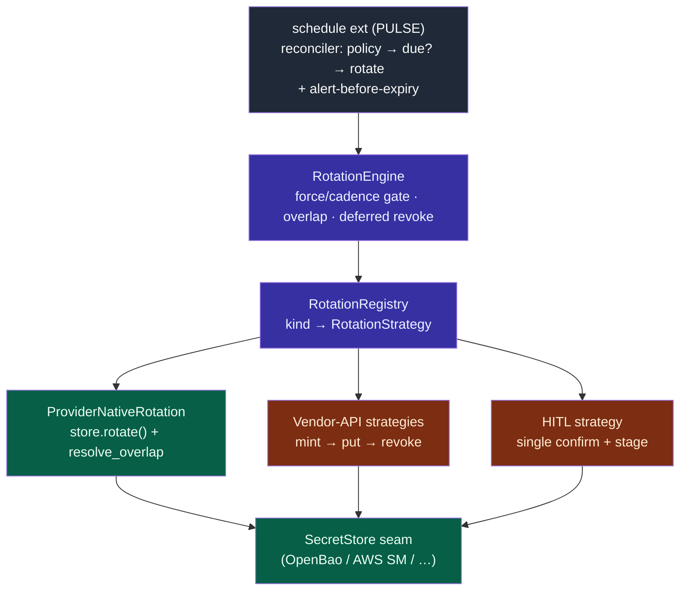

# ADR-095: Rotation-strategy layer for backend-external credentials

**Status:** Accepted (2026-07-15)
**Deciders:** Benjamin Booth
**Amends:** ADR-080 (Autonomous-First Key/Secret Rotation) — overturns its
"Alternatives considered" rejection of *a dedicated rotation subsystem above
the secrets seam*, and only that. Every load-bearing rule of ADR-080
(overlap-validity, alert-before-expiry, autonomous-first + single-confirm HITL,
the AWS staging-label mapping) is **retained**.
**Related:** ADR-003 (OpenBao-default + autorotation — this ADR is the
reconciliation ADR-003 D3 should have carried), the `secrets` builtin
(`SecretStore` seam, `resolve_overlap`), the `schedule` builtin (PULSE driver).

---

## Context

ADR-080 established the rotation model and, in its alternatives, rejected "a
dedicated rotation subsystem above the secrets seam" as premature abstraction:
rotation was framed as *a property of a backend's value set*, expressible with
`Capabilities.rotation` + an optional `resolve_overlap()` and driven by the
`schedule` (PULSE) reconciler. That framing is correct **when the backend
rotates itself** — AWS Secrets Manager (Lambda + staging labels), Vault dynamic
engines. There, "rotate" is `store.rotate()` and the overlap window is the
backend's own.

It is under-specified for the case that actually motivates our first rotation
work — the **leaked operational keys**: SendGrid, GitLab/GitHub PATs, Azure
OpenAI, OpenAI, Anthropic, LangSmith. There the backend (OpenBao) is **dumb
storage**: it cannot mint or revoke a SendGrid key. Rotation is *mint a new
credential at the vendor's API → write it as the new current version → keep the
old valid through the overlap window → revoke the old at the vendor*. That
"how to mint/revoke at this vendor" logic has no home on the `SecretStore`
seam — the OpenBao provider must not learn SendGrid's API. ADR-080 gestures at
it ("generate→stage→verify→retire sequence for self-driven backends", "paste a
vendor-issued key the API cannot mint") but does not say where the per-vendor
generate/revoke logic lives.

The `secrets/rotation/` subsystem shipped in #646 (`RotationStrategy`,
`RotationRegistry`, `RotationEngine`) is exactly that home. This ADR ratifies
it rather than reverting it.

## Decision

**Adopt the rotation-strategy layer as the seam for backend-external
credential rotation, composing with — not replacing — the `SecretStore` seam
and ADR-080's rules.**

1. **`RotationStrategy` is the per-secret-class rotation seam.** A strategy
   owns `perform` (mint/trigger the new credential, stage it as current) and
   `revoke_previous` (invalidate the aged-out one). Two shapes ride the one
   contract:
   - **Provider-native** (`ProviderNativeRotation`) — delegates `perform` to
     `store.rotate(ref)` and reads the backend's own overlap via
     `resolve_overlap`; `revoke_previous` is a no-op (the backend ages the old
     version out). This is ADR-080's model, unchanged, expressed as one
     strategy.
   - **Vendor-API** — calls the vendor's API to mint the new credential,
     `store.put`s it as the new version, and `revoke_previous` calls the vendor
     to invalidate the old one after the overlap window.
   - **HITL** — for vendors whose API cannot mint (GitHub classic PATs, OpenAI,
     Anthropic): `perform` stages a human-supplied value behind ADR-080's
     single contextual confirm; the overlap window means a delayed human step
     widens the window, never outages.

2. **The overlap-validity rule (ADR-080 §1) is preserved and enforced by the
   engine.** `RotationOutcome` carries `old_valid_until` / `revoke_at`; the
   engine defers `revoke_previous` until the window closes and never revokes
   inline unless overlap is zero. Consumers still read the accepted set
   (`resolve_overlap`), never a single value. A missed flip degrades to
   "rotate again / alert", never an outage.

3. **The driver is the `schedule` (PULSE) extension, not a new scheduler.**
   ADR-080 §3 stands: a PULSE-cadence reconciler evaluates each managed secret
   against its `RotationPolicy` (max-age / explicit cadence), calls
   `engine.rotate()` when due, runs `engine.run_due_revocations()` to close
   windows, and emits **alert-before-expiry** events. The engine's in-memory
   pending list is the reconciler's working set; durable policy/state lives in
   the schedule extension's store.

4. **`force` is the leaked-key closer.** `engine.rotate(ref, force=True)`
   rotates now regardless of cadence — the mechanism behind
   `axi secrets rotate --force` and the remediation sequence in ADR-003 D6
   (store → schedule → force-rotate → purge), without recreating keys by hand
   in a vendor console.

5. **ADR-003 D3 defers to this ADR** for the rotation-layer shape; ADR-080's
   status gains an "Amended by ADR-095" note.

## Consequences

**Positive**
- The dumb-storage-backend + external-vendor-minter case (our actual leaked
  keys) has a clean home; the OpenBao provider stays ignorant of vendor APIs.
- Provider-native rotation is *one strategy*, so ADR-080's AWS/Vault model is
  retained rather than lost — the layer generalizes the seam, it does not fork
  it.
- All of ADR-080's guarantees (overlap-no-outage, alert-before-expiry, HITL
  single-confirm) survive; only the "no subsystem" alternative is overturned.

**Negative / trade-offs**
- There are now two seams a reader must hold: the `SecretStore` (storage +
  native rotation) and the `RotationStrategy` (backend-external rotation). The
  boundary is "does the backend mint the credential itself?" — documented here
  and enforced by which strategy a ref resolves to.
- A vendor-API strategy holds vendor admin scope (to mint/revoke). That
  privilege must itself be a managed secret, resolved through the seam — never
  inlined. The strategy config carries a `SecretRef` to its own vendor
  credential, not the credential.
- Vendors without a mint API fall to HITL; the layer does not pretend
  otherwise. `Capabilities`-style advertisement on strategies (can-mint /
  hitl-only) keeps that honest.

## Alternatives considered

- **Honor ADR-080 as written (no subsystem; vendor-mint behind the seam).**
  Rejected: it forces vendor-specific minting into `SecretStore` providers,
  which then must know every vendor's API — the coupling the seam exists to
  prevent. ADR-080's framing holds only for self-rotating backends.
- **Revert #646.** Rejected: it discards a working, tested layer that fills the
  precise gap ADR-080 left, to satisfy an alternative-rejection ADR-080 itself
  scoped to "premature abstraction" before the leaked-keys case made it
  concrete.
