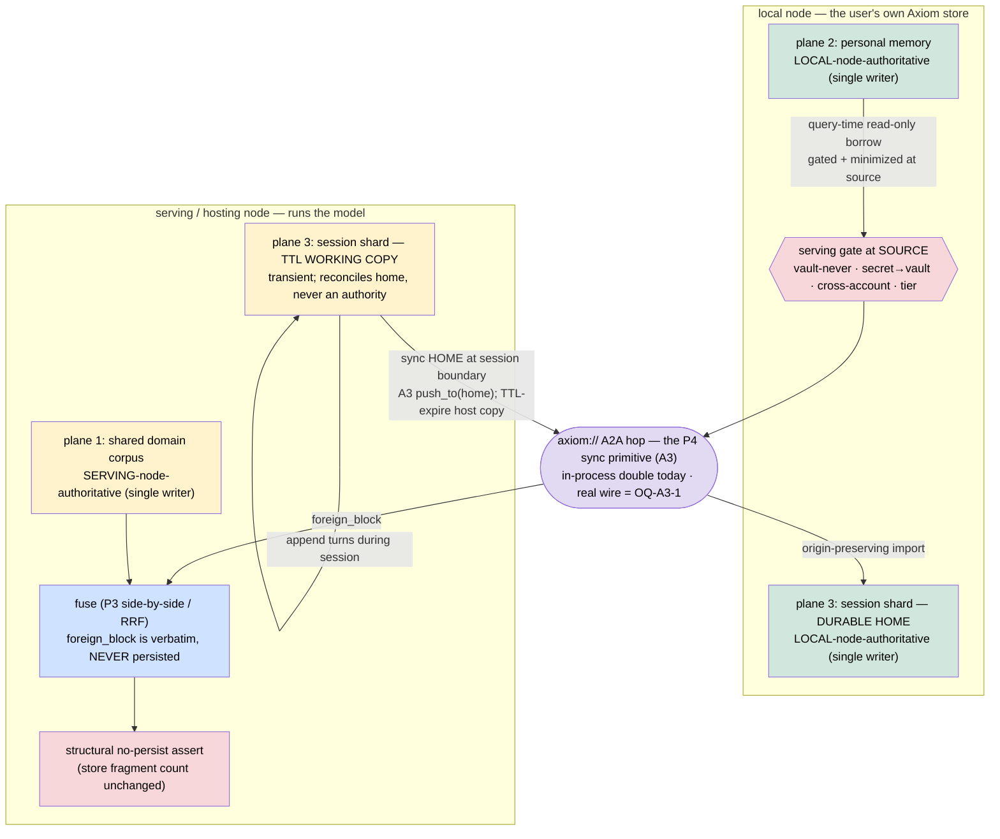

<!-- Copyright (c) 2026 The University of Texas at Austin -->
<!-- Copyright (c) 2026 B-Tree Labs — Apache-2.0 licensed -->

# ADR-096 — Hosted-endpoint memory planes & node coordination

**Status:** Proposed · **Date:** 2026-07-15
**Owner:** @ben
**Builds on:** ADR-087 (cross-mem — the portable-memory primitive: absorb /
migrate / serve / sync; D2 one import primitive, D6 rendering discipline, D7
fail-closed serving gate, D9 export ceremony, D10 phasing), ADR-088 (rag-memory
projection corpus; vault categorically excluded)
**Related:** ADR-022..ADR-029 (federation — the `axiom://` URI scheme, cohort
registry, A2A protocol, multi-authority signatures, trust graph), ADR-026
(ownership model; the owner-reads-own base case), ADR-031 (Vega pre-extraction —
federation now lives under `src/axiom/vega/federation/`), ADR-092 (P4 continuous
bidirectional sync — the reconciliation mechanisms this ADR lifts onto the node
hop)

---

## Context

cross-mem (ADR-087, phases P0–P4) made Axiom Memory the user-owned home for
memory that every harness otherwise silos per `(provider, account)`. In that
work Axiom rides **inside a third-party harness as a guest**: the only channel
back into the model is the harness's own instruction-file / MCP surface. That
channel is lossy and one-way — Axiom writes a managed block into an authored
rules file at a session boundary (D8 write-back) and hopes the harness re-reads
it; it cannot coordinate, cannot request, cannot confirm delivery, and must stay
cache-stable by construction (D6) precisely because it has no back-channel. As a
guest, Axiom controls only the **local end**.

A different topology exists when **Axiom hosts the serving endpoint itself**
rather than riding inside someone else's harness. There Axiom is on **both ends
of the conversation**: the user's **local node** (where the user's memory lives)
and the **serving node** (which runs the model and answers the query). Both ends
run Axiom, share the `axiom://` addressing scheme, and can speak the federation
A2A protocol to each other.

That symmetry is the unlock. Two Axiom nodes can **coordinate node-to-node over
the federation layer** — a real, gated, acknowledged transport — instead of
squeezing memory through the lossy instruction-file channel a guest is limited
to. But hosting raises a question the guest topology never had to answer: when
the serving node holds a shared corpus, the user brings personal memory from
their local node, and a live session accretes new turns, **whose memory is
authoritative on each of those, and what may cross the machine boundary in which
direction?** Answering that without inventing a new subsystem — and without
weakening the serving boundary that P3 made fail-closed — is this ADR's job. It
is the design-of-record for the A-series adoption program (A1 local round-trip →
A2 harness coverage → A3 node-to-node transport → A4 hosted-endpoint runtime).

## Decision

**Three memory planes, single-writer-per-plane.** Every piece of memory a hosted
query touches belongs to exactly one plane, and each plane has exactly one
authoritative writer. Single-writer-per-plane is what makes two live nodes safe
without a distributed-write conflict protocol: no plane is written on both sides,
so there is nothing to reconcile as a conflict — only content to move under the
gate.

### Plane 1 — shared domain corpus: serving-node-authoritative

The corpus the hosting endpoint serves (its own knowledge base, per ADR-088's
`rag-memory` projection contract) is owned and written **only on the serving
node**. The hosting endpoint answers from it directly through the P3
`MemoryServingService.serve` on its own store. A querying user never writes this
plane. (`HostedEndpoint.recall` serves the endpoint's own corpus at `own_k`.)

### Plane 2 — personal memory: local-node-authoritative, borrowed read-only, never persisted

A user's personal memory is written and owned **only on their local node**. It
is contributed to a hosted query as a **gated + minimized, read-only
`foreign_block` borrow**, computed at query time, that is **never persisted on
the serving node**:

- **Gated at the source.** The local node runs the borrow through its *own* P3
  `ServingGate` (via `MemoryServingService.serve`), so vault-never,
  secret→vault, unlabeled-deny, cross-account, and deployment-tier are all
  enforced *before anything leaves the local node* — the one-door-out boundary,
  reused whole. (`ForeignBlockBorrower.respond`.)
- **Minimized.** The gate-approved projection is capped to a compact block —
  top-`k` plus a character budget (`minimize_items`, `DEFAULT_BORROW_K = 3`,
  `DEFAULT_BORROW_CHAR_BUDGET = 1024`) — minimum-necessary serving, not a memory
  dump.
- **Fused, never ingested.** The serving node fuses the `foreign_block` into the
  answer via the P3 fusion (`fuse_side_by_side` by default; opt-in rank-level
  `fuse_rrf`) as a **verbatim pass-through** — never parsed, never re-indexed.
- **Structurally non-persistent.** The no-push rule (D7) already forbids pushing
  memory into a foreign store; `HostedEndpoint.recall` makes it structural by
  asserting the hosting store's fragment count is unchanged across the call
  (`HostedPersistError` otherwise). The borrow shapes one answer and evaporates.
- **Default-deny at the source.** A local node serves its personal memory only
  to a hosting endpoint it has **declared** (`PeerAuthorizer.require` on the
  requester), symmetric with the sync authorizer.

### Plane 3 — user-session shard: local durable home, serving-node TTL copy

A live session accretes new turns. Those land in a **per-user, principal-isolated
TTL working copy on the serving node** (the shard), and the **local node is the
durable home**:

- **Append** rides the one door in (`CompositionService.write`), origin-stamped
  `axiom://<serving-node>` with the user's account, so the shard is
  self-describing and lands in the user's own account domain. (`SessionShardManager.append_turn`.)
- **Sync home** at the session boundary **is A3, unchanged**: a per-user
  `NodeSyncEngine.push_to(home)` runs the shard through the same serving gate +
  LWW filter over the node transport, and the home node's import is
  origin-preserving and echo-suppressed. (`SessionShardManager.sync_home`.)
- **Expire.** Past its TTL the serving node forgets (tombstones) its transient
  copy via `CompositionService.forget`; the durable home copy — a *different
  store* — is untouched. The TTL is clock-injected (`now_fn`), never wall-clock.
  (`SessionShardManager.expire`.)

The serving node's copy is transient and always reconciles *toward* home; it is
never a competing authority, so plane 3 keeps its single-writer property (the
home) even while a working copy lives briefly on the other node.

### The composition — no new primitive

This is **federation × P4 sync × P3 gate, composed**, not a new subsystem:

- **Coordination** = the P4 D2 sync primitive lifted onto the `axiom://` A2A hop
  (A3). `NodeSyncEngine` *wraps* the unchanged P4 `SyncEngine`; outbound reuses
  its `gated_snapshot` (gate + LWW loser filter), inbound reuses
  `import_candidates` (origin-preserving, secret→vault-inbound) and
  `resolve_streaming_conflicts` (LWW + the P2 conflict queue). The genuinely new
  mechanics are only: a **node coordinate** (`axiom://<node-id>`, mapped to the
  gate's `ConsumerCoordinate`), **node-scoped echo** (`echo.py` gains an
  additive `node=` key so a fragment pushed to a peer is recognised when it
  echoes back — no ping-pong across the boundary), and a **default-deny peer
  authorizer**.
- **Runtime** = query-time `foreign_block` borrow + session-shard hosting (A4),
  both riding A3's transport seam and gating at the source through the P3
  `MemoryServingService`.
- **Membrane** = the P3 serving gate is the single fail-closed boundary across
  **every** hop — vault-never-outbound, secret→vault-inbound, cross-account,
  and the deployment-tier check that treats a remote node as a `TIER_REMOTE`
  exposure domain so controlled content never rides the wire to an exposed
  endpoint.

## Consequences

### What is REAL (proven by the two-node lock-step + hosted-chat gates)

All of the plane logic above is implemented and green over the acceptance gates
(`test_sync_node_lockstep.py`, `test_hosted_chat.py`, plus the unit seam suites):

- The three planes with single-writer-per-plane; corpus serving; the query-time
  borrow (gated + minimized at the source); the structural no-persist assert;
  the shard append / sync-home / TTL-expire with the durable home preserved.
- The P3 gate as the membrane across the node hop — vault-never-outbound and
  secret→vault-inbound proven across the machine boundary; controlled content
  tier-denied to a remote-tier peer; cross-account work-vs-personal denied in
  both directions.
- Node-scoped echo suppression (no echo storm across several rounds and a
  kill-and-restart); origin-preserving provenance (`harness ==
  axiom://<origin-node>`); default-deny authorization refusing an undeclared
  peer/endpoint in either direction; per-user isolation at both `read()` (the
  ADR-026 ownership base case) and the gate.

### What is SEAMED

**Only the inter-machine A2A byte transport.** The federation layer exposes real
identity, the `axiom://` URI, and a real authority policy (`declared_peers`
default-deny), but **no node-to-node A2A message channel for arbitrary
reconciliation payloads exists yet**. So:

- `A2AFederationTransport.send` (sync) and `A2ABorrowTransport.request` (borrow)
  are **named seams whose methods raise** — nothing can silently pretend to
  deliver.
- Everything runs over **in-process doubles** (`LoopbackTransport`,
  `LoopbackBorrowTransport`) behind factories (`node_transport`,
  `borrow_transport`) that return the double until the wire lands. The doubles
  exercise the real serialize → send → deliver → poll → import → ack path end to
  end; only the machine boundary is simulated. This mirrors P2 (credential-seamed
  cloud cluster) and P4 (skeleton cloud detectors).

The authority leg is **real, not a double** — the gap there is the *feed*, not
the check.

### Deltas needed for a live deployment

| Token | Delta | Single touch-point |
|---|---|---|
| **OQ-A3-1** | The live A2A message channel (an inbound `message/send` route into a memory handler + its outbound client). Both transport seams drop onto it. | `node_transport` / `borrow_transport` factory probe (`_federation_has_a2a_wire`) |
| **OQ-A3-2** | The default-deny authorizer fed by the live cohort registry / trust-graph walk (ADR-028), not a hand/`TrustProfile`-seeded allow-list. The check is real; the source is static. | `PeerAuthorizer` seed |
| **OQ-A3-3** | Wire signing/verification of envelopes via `FederationGateway.project_for_peer` / `accept_from_peer` (pure-policy, already present) so the boundary is authenticated, not only authorized. Content-safety (vault/secret) is already enforced independent of signing. | the real transport's `send` / `request` |
| **OQ-A4-1** | Salience-based MINIMIZE (score which fragments most inform *this* query) rather than the current top-`k` + character cap. Security is unaffected — every item already passed the source gate; this is prompt economy. | `minimize_items` |
| **OQ-A4-2** | A durable session-shard registry (persist the TTL metadata + id list as an artifact, rebuild on restart, per the P4 `SyncService` pattern). The shard *fragments* are already store-durable and the TTL is clock-injected; only the bookkeeping is in-memory. | `SessionShardManager` recovery |

### Trade-offs

- **Positive.** A loss-free, gated, acknowledged node-to-node channel replaces
  the guest topology's lossy one-way instruction-file channel; provenance is
  preserved across the hop; the serving boundary is enforced *at the source* so
  a looser downstream never widens exposure; no new primitive to maintain — the
  design is the intersection of three shipped subsystems.
- **Cost / bounded.** This topology requires Axiom on **both** ends; it does not
  help the guest case (which keeps the D8 write-back channel). The live wire
  (OQ-A3-1) remains a real delta before a production cutover — until then the
  doubles are the honest stand-in, and the single remaining human-gated step is
  the live serving/consumer-node cutover at a maintenance window.

_Copyright (c) 2026 The University of Texas at Austin and B-Tree Labs. Apache-2.0 licensed._
