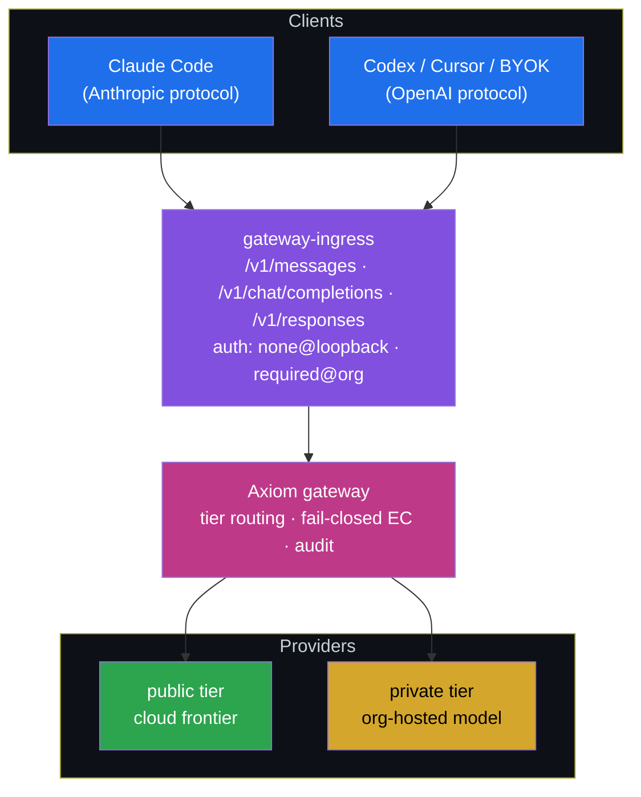

<!-- Copyright (c) 2026 The University of Texas at Austin and B-Tree Labs.
     SPDX-License-Identifier: Apache-2.0 -->

# ADR-097 — Gateway ingress as the org-hosted LLM serving face

**Status:** Proposed
**Date:** 2026-07-20
**Owner:** Ben Booth
**Relates to:** spec-model-routing (gateway + tiers), ADR-035 (LLM tier
policy is a platform primitive), ADR-096 (hosted-endpoint planes),
spec-serve

---

## Context

Axiom today has **two** LLM serving realities that grew independently:

1. **The platform ingress** — `axiom.llm.anthropic_ingress`, run as the
   managed `gateway-ingress` service (default port 8788, loopback). It is
   dual-protocol — `/v1/messages` (Anthropic), `/v1/chat/completions` +
   `/v1/models` and `/v1/responses` (OpenAI) — and every request is
   **translated through the Axiom gateway**, so all clients ride the same
   routing tiers, fail-closed export-controlled enforcement, and audit as
   `axi chat`. `axi mcp install --route-model` starts it and repoints
   local clients at it. It is local-first: no auth (loopback trust), no
   deployment packaging, no tracing.
2. **Site-productized gateway units** — consumer deployments run a
   LiteLLM proxy (plus an OpenAI-compatible RAG completion shim) as
   hand-adopted systemd units in the site repo, fronting the org-hosted
   model. LiteLLM provides provider fan-out and Langfuse tracing — but it
   is a **passthrough**: requests through it bypass the Axiom gateway
   chokepoint (tier routing, fail-closed enforcement, vault, audit).

The near-term driver: harness portability testing needs any
OpenAI-protocol client (Codex, Cursor, Continue, VS Code BYOK) and any
Anthropic-protocol client (Claude Code) to be able to target **one Axiom
endpoint** — locally today, org-hosted next — without losing the
chokepoint guarantees.

## Decision

**The Axiom ingress is the one serving face, at every tier.** The
org-hosted deployment is the same `gateway-ingress` service, promoted:

1. **One face, three bindings.** Loopback (developer node, today's
   behavior, unauthenticated), org-hosted (0.0.0.0 behind TLS,
   authenticated), and site-embedded (a consumer's serving stack fronts
   its domain endpoints with it). Same code path; binding is deployment
   configuration, not a fork.
2. **Auth is required off loopback.** The ingress refuses to bind
   non-loopback without an auth provider configured (fail-closed, same
   doctrine as the memory serving boundary). Bearer keys first;
   principal-scoped accounts when the identity layer lands (ADR-041/042).
3. **Chokepoint is non-negotiable.** Provider fan-out stays in the
   gateway's provider registry (`[[gateway.providers]]`), not in a
   passthrough proxy. LiteLLM-style passthrough serving is retired at
   sites once parity holds; a site may keep LiteLLM **behind** the
   gateway only as one more configured provider endpoint, never as the
   face.
4. **Observability parity is the migration gate — behind a provider
   abstraction.** Trace emission goes through a **TraceSink provider**
   per the platform's standard factory-provider pattern
   (`axiom.infra.provider_base`, ADR-012 four-layer identity): the
   ingress emits one structured trace per request (client, model asked,
   tier chosen, provider used, tokens, latency) to whatever sink the
   config names. Langfuse is the *first* provider, not the answer —
   sites keep their Langfuse instances through cutover, and a different
   backend later is a config change, not a migration. Sites do not cut
   over until traces are equivalent — losing observability to gain a
   chokepoint is not a trade we make silently.
5. **Ships as infrastructure.** The org-hosted binding ships with Helm +
   Terraform like every platform service; production deploys from tags.

## Consequences

- Any harness that speaks either wire protocol targets Axiom with one
  `base_url` — the cross-harness/cross-model portability tests exercise
  the same face users run.
- Site serving stacks converge onto platform code: fewer hand-adopted
  units, and the chokepoint guarantees (tiers, EC fail-closed, audit)
  hold for *every* client, not only `axi chat`.
- The ingress grows two seams it did not have: an auth provider and a
  trace emitter. Both are gated (fail-closed bind, parity-gated
  cutover), so the local developer experience is unchanged.
- Until parity + cutover, sites run both faces; the site LiteLLM face is
  frozen (no new features) to keep the target honest.

### Phasing (each phase ships value)

| Phase | Ships | Value on its own |
|---|---|---|
| G1 | Auth provider + fail-closed non-loopback bind | Org nodes can expose the existing ingress safely |
| G2 | TraceSink provider abstraction + Langfuse provider | Parity evidence; local debugging improves too; sink is swappable |
| G3 | Helm + Terraform for `gateway-ingress` | Deployable org face from tags |
| G4 | Site cutover, LiteLLM demoted/retired | One face; chokepoint everywhere |

## Open questions

- Whether the org face should also mount the MCP aggregation server
  (`spec-serve`) on the same port or stay single-purpose.
- Account-tier interaction (Entry/Pro/Enterprise) once ADR-098's account
  model lands — per-key quotas and model allowlists live in the gateway
  provider registry or in the auth layer.
