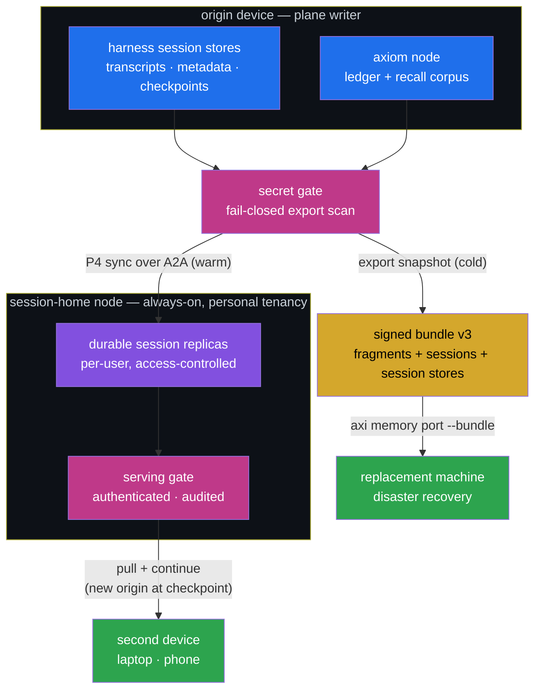

<!-- Copyright (c) 2026 The University of Texas at Austin and B-Tree Labs.
     SPDX-License-Identifier: Apache-2.0 -->

# ADR-098 — Session plane: harness session portability, session home, disaster recovery

**Status:** Proposed
**Date:** 2026-07-20
**Owner:** Ben Booth
**Amends:** ADR-096 (Plane 3), ADR-019 (node profiles)
**Relates to:** ADR-087 (cross-mem), ADR-092 (continuous sync), ADR-026
(ownership), ADR-041/042 (identity acquisition)

---

## Context

Cross-mem (ADR-087) made **memory** portable: fragments and axi session
checkpoints move in signed bundles, absorb adapters ingest harness-native
memory, and ADR-096 settled which node is authoritative for which memory
plane. But a user's working state is bigger than memory: each harness
keeps its own **session store** — full conversation transcripts, session
metadata, checkpoints/resume state — outside every surface we port. A
developer who moves machines, or wants to pick up this morning's IDE
session from a different laptop or a phone in the evening, has no
supported path. Neither does one whose laptop dies (disaster recovery).

The requirement, stated plainly: **session portability between tools,
between machines, and between account tiers**, with an architecture that
keeps itself in sync. ADR-096's Plane 3 already handles the *hosted-chat*
session shard (local durable home, serving-node TTL copy); it says
nothing about *harness-native* session stores or about reaching one's own
sessions from a second device.

Constraint carried forward unchanged: a serving node with an
export-controlled or otherwise restricted posture must never hold
personal memory or personal session content (ADR-096 Plane 2 doctrine).
Whatever hosts sessions does so as an explicitly personal-tenancy role.

## Decision

The session store becomes a **plane of its own** — Plane 3 generalized —
with one durable writer, an optional always-on replica, and the signed
bundle as its cold path.

### D1 — Harness session stores are first-class portable artifacts

Bundle format v3 adds per-harness **session-store members** (transcripts,
session metadata, checkpoints), origin-stamped like absorbed memory
(`SourceOrigin(harness, account, source_ref)`). Verification, zero-loss
counts, and the dual-signature re-home ceremony apply exactly as for
fragments. `axi memory port --bundle` restores them into the destination
harness's native layout, so the harness resumes sessions as its own.

**Secret gate, fail-closed:** raw transcripts routinely contain pasted
secrets. Session members pass a secret scan before export; findings block
the export (refuse, name the session) rather than silently redacting.
Vault content never rides, under any flag — unchanged.

### D2 — "Session home" is a node profile, not a specific node

A **session-home** profile (ADR-019 amendment): an always-on node that
holds a user's **durable, access-controlled session replicas** so a
second device can pull and continue. Per-user tenancy; every access
authenticated and audited; served only through the serving gate.

A node carries this profile only if its posture allows personal tenancy.
A restricted-posture serving node is *disqualified by deployment tier* —
this preserves the ADR-096 hard line: domain authority and personal
session custody are different roles and may not silently co-locate. A
site may still designate such a node **only by explicit, recorded
authorization** (an override with a receipt, same culture as the repo's
bypass-reason trailers) — never by default, and the designation is
surfaced by the hygiene/health surfaces for as long as it stands.

**The session home is a pointer, not a place.** Which node carries the
profile is per-user deployment configuration, expected to change over a
user's life (a lab box today, a personal workstation or a managed cloud
service tomorrow). Re-pointing is a first-class ceremony with zero data
loss: the new home pulls the user's replicas (from the old home when
reachable, from bundles when not), verifies counts/hashes exactly as
import does, and only then does the old home drain and drop its copies.
Devices follow the pointer, not the node — a re-point never invalidates
a device's ability to continue. A **managed cloud service** offering the
session-home profile is an explicitly supported deployment shape, not a
fork of the architecture.

### D3 — Sync rides P4 over federation; the origin stays the writer

Single-writer-per-plane is retained: the **origin device** of a session
is its writer; the session home holds a replica; a device that continues
a session becomes the new origin at a session boundary (checkpoint), not
mid-turn. Replication is the ADR-092 sync engine over the federation A2A
hop (node-to-node live transport is the already-scoped M4 dependency).
Conflicts — two devices continuing the same session — land in the
existing kept-both conflict queue; nothing is auto-merged.

### D4 — Access is an axiom account; tiers gate hosting, not semantics

Reaching one's sessions from elsewhere presupposes an authenticated
**axiom user account** (ADR-041/042 identity) resolvable to principals.
Account tiers (e.g. Entry / Pro / Enterprise) gate **capability**, never
memory semantics: every tier gets local sessions + bundle export/import
(DR is not a paid feature); hosted session-home replication and
org-managed homes are tier capabilities. Moving between tiers is an
export/import of the same bundle — no tier-specific formats.

### D5 — Disaster recovery is the bundle, warm or cold

Cold path: scheduled `axi memory export` snapshots (now carrying session
members) to any storage the user trusts; restore is `axi memory port
--bundle` on the replacement machine. Warm path: continuous D3 sync to a
session home, where restore is a pull. Both paths restore memory *and*
sessions in one verb.

### D6 — Continuity model: the baton, epochs, and first-class forks

Users flow between environments constantly — laptop to phone and back,
work machine to home workstation, an IDE harness to a browser-only
assistant and back. The plane must absorb that fluidity without ever
corrupting or silently diverging. Four rules:

1. **The baton.** At any instant a session has exactly one writer (D3's
   single-writer rule made temporal). Write authority transfers only at
   a **checkpoint boundary**, recorded as a signed handoff event with a
   monotonically increasing **writer epoch**. A continuation without the
   current epoch is *fenced*: a stale device waking up with unsynced
   turns cannot overwrite anything — its divergence lands as a fork.
2. **Forks are first-class, never failures.** Offline continuation is
   allowed by design (a device that can't reach the session home may
   *deliberately* continue without the baton). That creates a named fork
   — both lines are kept, the divergence point is recorded, and
   reconciliation is a visible user operation (adopt one, keep both,
   splice), never an auto-merge. "Tragically out of sync" is thereby
   redefined: the system can be *behind*, but it cannot *lose* either
   side or interleave them silently.
3. **Corruption is structurally excluded, not policed.** The ledger is
   append-only; fragments are content-hashed and signed; sync delivery
   is at-least-once with idempotency-key echo suppression, so replays
   and partial transfers are no-ops rather than half-writes; every
   read-side structure (recall corpus, projections, replicas) is
   disposable and rebuildable from the ledger. There is no state whose
   partial update corrupts the plane.
4. **Two continuation grades.** *Native* continuation (same harness on
   another device) replays the session store — full resume. *Semantic*
   continuation (different harness, including browser-only assistants
   with no filesystem) is served from the plane itself: the session
   shard + recall corpus assemble a briefing through the serving gate,
   and the new harness's turns are captured back as its own
   origin-stamped shard. Flowing IDE → web assistant → IDE is two
   semantic handoffs around a native store that never left home.

### D7 — Capacity governance: overruns archive, they never delete

Session stores make the plane big (transcripts dominate), and every sync
target — laptop, phone replica, session home — has finite space. The
overrun rule is one invariant plus pressure valves:

- **Archive-before-evict.** Nothing leaves the durable plane except
  through the existing ceremonies (`forget`, compaction). Under space
  pressure a node may demote *replicas and projections* (they are
  rebuildable/pullable), and may roll session-store content into cold
  bundles — but only after the bundle is verified written. Silent
  truncation of memory or sessions is never a degradation mode.
- **Watermarks before walls.** Per-plane quotas with a soft watermark
  (surface to the user/hygiene surface: "session plane at 80%, oldest
  archives candidates listed") and a hard limit whose behavior is
  refuse-new-with-named-reason (absorb/sync pauses, tells the user
  why), not drop-oldest.
- **The valves are the existing ones.** Maturation (episodic → semantic
  distillation) and compaction shrink the ledger semantically; cold
  bundling shrinks it physically; the session home enforces per-user
  quotas tied to D4 account-tier entitlements.
- Watermark/limit *numbers* are deployment configuration (node profile),
  not ADR constants.

## Consequences

- Portability becomes symmetric across its three axes: **tools** (absorb
  + D1 restore into native layouts), **machines** (D1 bundles, D3 sync),
  **account tiers** (D4 — same bundle, different hosting entitlements).
- The bundle grows from "memory + axi checkpoints" to "working state";
  its verification story (hashes, counts, dual signatures) already
  scales to new members, which is why D1 is v3 of the existing format
  rather than a new mechanism.
- The secret gate makes some exports fail that today would "work" —
  deliberately. A refused export names what to clean; a leaked API key
  in a replicated transcript is the unrecoverable failure.
- D3 inherits the M4 live-transport dependency; until it lands, only the
  cold path (bundles) crosses machines. That is an acceptable interim:
  DR and machine moves work before continuous sync does.
- Session-home nodes take on custody of personal content and must be
  operated accordingly (personal tenancy, gate-only access, no
  restricted-posture co-location).

### Phasing (each phase ships value)

| Phase | Ships | Value on its own |
|---|---|---|
| S1 | Bundle v3: session-store members + secret gate; `port --bundle` restores | Machine moves + cold DR, today, no server needed |
| S2 | Session-home profile: authenticated pull of replicas (bundle-over-gate) + D7 watermarks | Continue on a second device, without live sync |
| S3 | Live P4-over-A2A replication (post-M4) + D6 baton/epoch fencing | Auto-sync; warm DR; fork-safe fluidity |
| S4 | Account tiers wired to hosting entitlements + quotas | Entry/Pro/Enterprise story; org-managed homes |

### Acceptance — not done until proven

The plane is "done" only when three scenarios pass end-to-end, each run
as a rehearsal with evidence, not a unit test:

- **UC-1 — second device.** Start work on machine A; continue it on
  machine B via the session home; sessions resume natively, memory
  recalls identically, nothing duplicated on return to A.
- **UC-2 — disaster recovery.** Destroy (simulate) machine A; on a
  fresh machine, `pip install` + one port command restores memory,
  recall, and harness sessions from the latest bundle; measure the gap
  (what the last snapshot missed) and assert it matches the snapshot
  cadence, no more.
- **UC-3 — fluidity round-trip.** A → phone → A with an offline
  interval forcing a fork: both lines survive, the fork is surfaced for
  reconciliation, the ledger shows one coherent history afterward, and
  nothing was silently merged or lost.

## Open questions

- First harness store in scope is the largest one (the IDE harness with
  transcripts + checkpoints); which stores follow, and whether any
  harness's layout resists faithful restore (proprietary/locked state).
- Secret-scan policy: refuse-only (implemented in S1, with
  `--store-exclude` as the escape hatch) vs. an opt-in redact mode
  later.
- Baton acquisition UX: how a device asks for/receives the baton when
  the session home is reachable, and how deliberate offline forking is
  surfaced ("continue anyway?") without becoming a nag.
- Fork reconciliation surface: CLI-first (list forks, adopt/keep/splice)
  vs. waiting for a richer UI; where it lives (`axi memory` vs. hygiene).
- Session-home retention: replicas kept indefinitely vs. TTL with the
  bundle as the long-term record (interacts with D7 quotas).
- Mobile surface: is "continue on a phone" a first-class client or a web
  surface served by the session home?
- Whether account tiers belong in this ADR's successor spec or in the
  identity spec (ADR-041/042) — the tier *names* here are placeholders.
