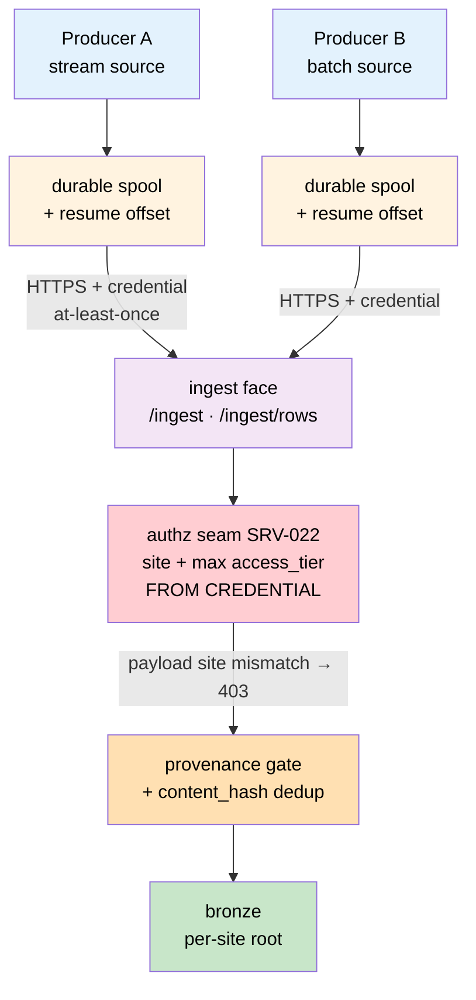

# ADR-106 — Push ingest gateway: one authenticated front door for batch and streaming producers

**Status:** Draft — 2026-08-24
**Owner:** @ben
**Related:** ADR-097 (one face, three bindings; auth required off loopback; fail-closed — the doctrine this mirrors for data), ADR-007 (streaming-first; Kafka/KRaft + Flink — *Proposed*, not built), ADR-049 (data-platform orchestration boundary), ADR-052 (tenancy menu — row-level vs schema-per-tenant), ADR-079 §8.4.1 (push-first bronze ingest), ADR-105 (`access_tier` as the redistribution attribute), [data-platform ADR-001](../../src/axiom/extensions/builtins/data_platform/docs/decisions/adr-001-tabular-source-lane.md) (tabular source lane; `credential_ref`), [spec-serve](../specs/spec-serve.md) §5–6 (shared middleware chain, authz/peer-sig seams, error envelope). Supersedes nothing.

## Context

The platform has a **document** push lane and a **row** push lane, and only one of
them has a front door.

- **Documents:** `POST /ingest` → `IngestSink` → `BronzeWriter`. Shipped. Its
  module docstring states the operating doctrine plainly: *"The per-facility
  egress agent is the canonical client: it POSTs outbound, no inbound holes."*
- **Rows:** `TabularIngestSink`, `PushRowBatch`, and
  `make_connector_tabular_sink_resolver` all exist and are test-proven. But the
  resolver's own docstring refers to a front door at `/ingest/rows` that **was
  never written** — `ingest_sink/api.py` defines only `POST /ingest`. The row
  push lane is therefore reachable in-process and from nowhere else.

Everything else in the source registry is **pull**-oriented and poll-driven: `box`,
`sql-tabular`, and `http-tabular` are fetched on a schedule by an orchestrator.
Two consequences follow.

**Pull cannot express a push source.** A producer whose data only exists as a live
stream has no supported path. Polling such a source yields whatever the last poll
happened to catch, and a source that publishes state transitions cannot be
reconstructed from samples at all.

**One pull kind cannot even authenticate.** `HttpTabularSource.__init__` accepts a
`headers` argument, but `HttpTabularProvider.construct()` never passes one and
registers no auth flag, so the generic `--credential-ref` is silently unused for
that kind. Any authenticated HTTP endpoint is currently un-ingestable by it. (Fix
tracked separately; noted here because it is why "just add a poller" is not the
answer.)

**The operating requirements have outgrown one producer.** The near-term target is
dozens of producers of differing kinds, across several sites hosted on one node,
each needing: authenticated transport; either batched or continuous delivery;
survival across network outages and process restarts on both ends; and isolation
such that one site's producer cannot write another site's data.

**Tenancy is currently implicit.** Connector configuration is operator-supplied and
unvalidated at registration: a recent audit found a connector registered against
the wrong corpus tier with `disposition = allow` and no provenance rules, carrying
an empty credential. It never ran, so nothing was harmed — but nothing in the
platform objected either. With one operator and five connectors that is
survivable. With dozens, "the operator configured it correctly" is not a control.

## Decision

### 1. One ingest face, two lanes, three bindings

`POST /ingest` (documents) and `POST /ingest/rows` (rows) are peers on one router,
in one app, behind one middleware chain. Per ADR-097, the same code path serves
three bindings — loopback (developer, unauthenticated), org-hosted (bound off
loopback, TLS, authenticated), and site-embedded — and **binding is deployment
configuration, not a fork**.

`/ingest/rows` accepts `{source, batches: [{item_id, schema_ref, rows, etag?,
source_path?, metadata?}]}`, shaping each entry into the existing `PushRowBatch`
and driving the existing `TabularIngestSink`. It introduces no new write path: a
pushed batch lands through the same `TabularBronzeWriter`, the same provenance
gate, and the same row dedup as a pulled one. No split brain.

### 2. Auth is required off loopback, and it is the existing seam

Authentication uses `MiddlewareConfig.authz` (SRV-022) and, for peer-to-peer
producers, `peer_sig` (SRV-023) — the shared chain from spec-serve §5–6, with the
standard error envelope. We do not build a bespoke perimeter for ingest.

**The face refuses to bind a non-loopback interface with no authz hook
configured.** Fail-closed, matching ADR-097's rule for the serving face. An
unauthenticated ingest port reachable off-host is a configuration error the
process declines to make.

### 3. Tenancy is credential-derived, never payload-derived

**The authenticated principal determines the producer's `site` and the maximum
`access_tier` it may claim. A payload naming a different site is rejected 403 —
not warned, not merged, not trusted.**

This is the load-bearing rule of this ADR. If `site` is read from the request body,
then possession of any valid credential is authority over every site's data, and
"dozens of producers" becomes a lateral-movement surface. Deriving it from the
credential makes cross-site writes unrepresentable rather than merely discouraged.

Per ADR-052's menu this is **row-level tenancy**: `site` is a column, not a schema.
Fleet-wide queries across sites are a primary use case, and schema-per-tenant would
fight them. Hard separation is still taken where it is cheap — a distinct bronze
root per site — but the isolation guarantee lives at the credential boundary, not
in the storage layout.

### 4. At-least-once delivery, made safe by content-hash idempotency

`TabularBronzeWriter` and `BronzeWriter` already dedup on `content_hash`. A batch
delivered twice lands once.

Therefore the gateway implements **at-least-once**, and delivery is idempotent by
construction. Producers spool durably and **replay blindly** after any outage
without reconciling what the server saw. The gateway needs no exactly-once
protocol, no dedup ledger, and no per-producer session state — which is precisely
what lets it stay stateless and scale horizontally.

One caveat for producers of derived or normalized payloads: hash over the fields
that determine the value, including any scale or unit factor carried alongside a
normalized array. A payload rescaled without its scale factor in the hash dedups
away a real change.

### 5. Streaming is a producer-side concern; HTTP is the wire

The gateway does **not** hold a long-lived inbound socket per producer. A
"streaming" producer subscribes to its own source, batches on a time or size
window, and POSTs — the same verb a batch producer uses, at a different cadence.

Rationale:

- Preserves the existing **no-inbound-holes** doctrine. Producers reach out; the
  site opens nothing.
- Keeps the face **stateless**, so dozens of producers is a throughput question,
  not a connection-count question, and instances scale horizontally behind a load
  balancer.
- Keeps **one** delivery contract to secure, bound, and reason about.
- When ADR-007's Kafka transport lands, it slots in **behind** this face as
  internal transport. The producer contract does not change, so streaming-first
  arrives without a producer rewrite. This ADR is the front door ADR-007 assumes,
  not an alternative to it.

### 6. Requests are bounded, and unknown producers fail loudly

Reuse the document lane's DoS bounds pattern — request-shape caps read from env
(`AXIOM_INGEST_MAX_ITEMS`, `AXIOM_INGEST_MAX_CONTENT_CHARS`) — with row-lane
equivalents for batch count, rows per batch, and serialized batch bytes, rejected
at validation (422) before any decode or write. An unknown connector/source
resolves to 422 rather than a silent quarantine into a rule-less tree, matching the
existing resolver.

### 7. A registration must name its policy

Registering a producer without an explicit tier and disposition is a **startup
error**, not a silent `allow`. The audit case above is the motivating example: the
dangerous configuration should have been unrepresentable, not merely unused.

## The producer contract

A conforming producer — shipped as a small SDK so each new source is configuration,
not a rewrite:

1. **Spool before send.** Append to a durable local spool, then transmit. The spool
   is the recovery record; an unreachable gateway costs disk, not data.
2. **Resume from a durable offset.** On restart, continue from the last acknowledged
   position. Restart is not a gap.
3. **Retry with backoff, replay blindly.** Idempotency (§4) means a producer never
   needs to ask what the server already has.
4. **Use explicit connect timeouts.** A filtered port accepts the SYN and answers
   nothing; a client without a connect timeout blocks indefinitely rather than
   failing over. Liveness is a completed handshake, never a successful ping.
5. **Declare, don't assert, identity.** The producer sends its source name; `site`
   and tier come from its credential.

## Consequences

**Positive**

- The row lane becomes reachable, closing a gap where the core shipped without its
  door.
- One authenticated surface for every producer kind; security review has one
  boundary, not one per connector.
- Cross-site writes are unrepresentable rather than merely discouraged.
- Stateless face → horizontal scale, and outage recovery needs no server-side
  session or reconciliation protocol.
- A future Kafka transport is an internal change, invisible to producers.

**Negative / risks**

- Batching adds latency proportional to the producer's window. Sources needing
  sub-second end-to-end delivery are not served by this design and should wait for
  ADR-007's transport.
- Producer-side spools are new operational surface: they consume disk and need
  their own retention. A wedged producer fails silently unless its spool depth is
  monitored — spool depth and last-ack age are required metrics, not optional ones.
- At-least-once means duplicate *arrival* is normal. Anything downstream that
  aggregates before dedup will double-count; aggregation must sit after the bronze
  gate.
- Deriving tenancy from credentials makes credential rotation a data-path concern:
  a mis-scoped reissue silently redirects a producer's writes. Scope belongs in the
  credential's metadata and should be asserted at issue time.

## Alternatives considered

- **WebSocket or gRPC ingest with long-lived inbound connections.** Rejected:
  breaks the no-inbound-holes doctrine, makes the face stateful, and turns producer
  count into a connection-management problem — while solving a latency requirement
  nothing currently has.
- **Producers publish directly to Kafka.** Rejected for now: ADR-007 is *Proposed*
  and unbuilt, and it would put a broker protocol and its credentials at every
  site edge. Deferred, not foreclosed — §5 keeps it a transport swap.
- **Extend the pull connectors instead** (fix `http-tabular` auth, poll faster).
  Rejected as the primary answer: polling cannot reconstruct a stream, and it
  inverts the trust direction by requiring the platform to hold credentials for,
  and reach into, every producer. The auth fix is still worth doing on its own
  merits for genuinely pollable endpoints.
- **Per-site gateway instances (schema-per-tenant, or one node per site).** Node-per-site
  is the strongest isolation and remains right for regulated deployments. Rejected as
  the default because the immediate goal is several sites hosted together with
  fleet-wide queries across them; §3 makes that safe without the operational cost of
  N deployments.

## Execution

Phased so each step ships something usable:

- **P0** — `POST /ingest/rows` on the existing router, with request caps and the
  resolver's 422 behaviour, TDD against `TestClient`. *Ships the missing door.*
- **P1** — authz seam wired, fail-closed non-loopback bind, credential-derived
  site/tier enforcement. *Ships a face that is safe to expose.*
- **P2** — producer SDK: spool, resume, backoff, timeouts, spool-depth metrics.
  *Ships a reusable client for every subsequent source.*
- **P3** — registration validation (§7) and per-site bronze roots. *Closes the
  misconfiguration class.*

P0 and P1 are additive to a shipped module and carry no migration. P3 is breaking
for existing registrations and should land with, or after, the ADR-105 work.
