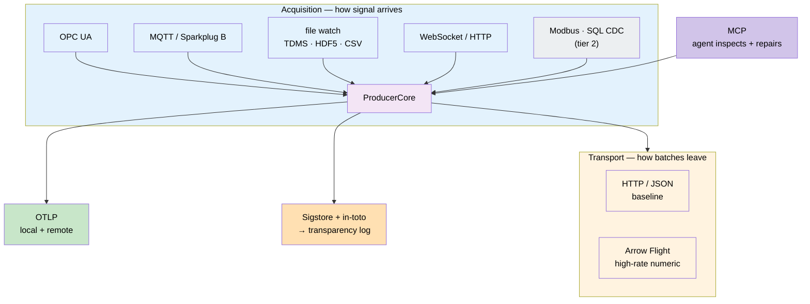

# ADR-107 — Protocol strategy for signal acquisition, transport, and attestation

**Status:** Draft — 2026-08-25
**Owner:** @ben
**Related:** [ADR-106](adr-106-push-ingest-gateway.md) (push ingest gateway), [spec-signal-ingest-and-producer](../specs/spec-signal-ingest-and-producer.md) (§5 the two pluggable axes, §9 reserved provenance), [prd-signal-ingest-and-producer](../prds/prd-signal-ingest-and-producer.md) (SIG-B2, SIG-C1/C2, SIG-F, SIG-G), ADR-007 (streaming-first — *Proposed*), ADR-038 (builtin MCP server), spec-aeos-0.1 §5 (Sigstore-signed releases). Supersedes nothing.

## Context

The signal spec deliberately names acquisition **shapes** rather than products,
and leaves the concrete list as an open question (§12). This ADR closes it.

Protocol choice is strategic rather than incidental here, for two reasons. The
target is dozens of producers of differing kinds across several sites, so each
protocol is a long-lived support obligation. And the producer is a **local signal
router**, not a shipper — so the protocol it speaks inward, the protocol it speaks
outward, and the protocol by which it is *observed and attested* are three
separate choices that are easy to conflate.

### What is already decided

A survey of the codebase before choosing anything new:

| Capability | Present today |
|---|---|
| Signing / attestation | **Sigstore — substantial existing investment** (~26 files); AEOS §5 already mandates Sigstore-signed extension releases |
| Observability | **OpenTelemetry present** (~12 files) |
| Columnar data | **Arrow / Parquet already in the lakehouse** (~14 files) |
| Industrial acquisition | OPC UA, MQTT, Modbus appear **only in domain-layer docs** — correctly, as domain adapters |
| Event envelope interop | CloudEvents — **absent** |
| Streaming contract description | AsyncAPI — **absent** |

This materially constrains the answer: attestation and observability are not
greenfield, and choosing anything other than what exists would be re-litigating a
decision rather than making one.

### Selection criterion

**Prefer a protocol that closes an open requirement over a protocol that adds
surface.** Three requirements in the PRD — liveness detection (SIG-F4),
observability transport (SIG-F1–F3), and provenance (SIG-G) — each have a mature
standard that subsumes them. Adopting those standards means we inherit a proven
contract instead of inventing one and maintaining it forever.

## Decision

### D1 — First-class acquisition adapters

**OPC UA**, **MQTT with Sparkplug B**, **file watch (TDMS, HDF5, CSV)**, and
**WebSocket / HTTP poll**.

- **OPC UA** (IEC 62541) is the industrial lingua franca and, unlike raw
  fieldbus, is *self-describing* — its information model carries types and
  engineering units, so an adapter can populate a declared schema rather than
  guess. Support both client/server and PubSub.
- **MQTT** is the standard for edge and unreliable links. See D4 for why
  Sparkplug B specifically.
- **File watch** is what most acquisition systems actually emit today. TDMS is
  the native format of PXI/LabVIEW-class hardware; HDF5 is the scientific
  default; CSV is the lowest common denominator and the current reality at
  several sources.
- **WebSocket / HTTP** covers instrument web surfaces and modern appliances.

### D2 — Second-tier adapters

**Modbus (TCP/RTU)** and **SQL/CDC**. Modbus is included on installed base, not
merit — it carries no timestamps, no types, and no self-description, so its
adapter must synthesize acquisition time and rely entirely on declared schema.
SQL/CDC overlaps the existing pull lane and is additive rather than urgent.

### D3 — Transport: HTTP/JSON baseline, Arrow Flight second

HTTP/JSON remains the universal floor every deployment supports (SIG-C1).

**Arrow Flight is adopted as the second transport**, and as the proving case for
the pluggable-transport seam (SIG-C2). The motivating problem is concrete: a
72×72 field grid at ~1 Hz is roughly **2 GB/day as JSON**. Arrow is columnar and
zero-copy, is gRPC-based so it fits the seam without disturbing the producer
contract, and lands natively in the Parquet/Iceberg/DuckDB stack already in use —
so the wire format and the storage format stop disagreeing.

Envelope, ordering, and idempotency semantics are unchanged across transports
(SIG-C3); if Arrow Flight required a different producer contract, that would be
evidence the seam is wrong.

### D4 — Liveness semantics adopt Sparkplug B

MQTT alone is a transport. **Sparkplug B** adds birth/death certificates
(`NBIRTH`/`NDEATH`), a standardized topic namespace, and an explicit session
state model.

That state model is, in substance, a standardized version of SIG-F4: it exists
precisely to distinguish "connected and silent because nothing changed" from
"gone." Adopting it means the liveness contract is an interoperable standard
other tools already understand, rather than a local invention we maintain.

Producers on non-Sparkplug adapters implement the *same* semantics through the
state surface (spec §8.1); Sparkplug is the reference model, not a special case.

### D5 — Observability is OTLP

`ProducerState` is exported as **OpenTelemetry metrics over OTLP**.

This satisfies local visualization (SIG-F2) and remote aggregation (SIG-F3) with
one mechanism and an existing ecosystem, using semantic conventions other tools
already read. It composes with the federation rule in spec §8.2 without conflict:
OTLP is the *encoding*; the federation facts path remains the boundary-crossing
mechanism, and raw signal payload still never crosses.

### D6 — Attestation is Sigstore + in-toto

**No bespoke signing scheme.** When stamping is built (spec §9, deliberately
deferred), it will use **in-toto attestations signed via Sigstore**.

Rationale: Sigstore is already substantial infrastructure here and AEOS already
requires Sigstore-signed releases, so data attestation extends existing practice
rather than introducing a second trust root. in-toto's attestation format
generalizes cleanly from software provenance to data provenance. Keyless signing
also sidesteps the key-hierarchy question the spec left open (§9.4) — the hardest
part of a homegrown scheme, removed rather than solved.

### D7 — Transparency log is the attestation end-state *(named, deferred)*

For regulated deployments, an **RFC 9162-style Merkle transparency log** over
batch attestations is the intended end state.

It composes directly with what the spec already carries: the `prev_hash` chain
(§9.1) becomes the leaf sequence. Its property is the one that matters in a
regulatory conversation — **inclusion proofs let a third party verify that a
record existed at a time and was never altered, without trusting the operator.**
That is categorically stronger than presenting a database, and it is why this is
named now even though it is not built now.

This is the one genuine bet in this ADR. It is deferred, and D6 is useful
independently of it.

### D8 — Agent-facing surfaces

**MCP over the producer state surface** is adopted as the agent-facing interface.
A producer exposing its state and diagnostics as MCP tools can be **inspected and
repaired in situ by an agent** — the self-healing posture — reusing the MCP
infrastructure of ADR-038 rather than adding a protocol.

**CloudEvents** (envelope interop) and **AsyncAPI** (machine-readable streaming
contract, so an agent can *discover* a producer's shape rather than being told)
are **candidates, not adopted**. Both are genuinely absent today; neither blocks
anything now. Revisit when the first cross-organization producer appears.

> The agentic property is not the wire protocol. It is that the producer is
> legible and actuable by an agent — which D8 provides and D5 makes measurable.

### D9 — Explicit non-adoptions

| Rejected | Why |
|---|---|
| **DDS** | Real-time robotics/defense pedigree; heavy, and its strengths address latency requirements we explicitly do not have |
| **Kafka as an acquisition protocol** | Kafka is a broker, not an acquisition protocol. Per ADR-106 §5 it belongs *behind* the ingest face as internal transport, never as a producer's source |
| **Bespoke binary protocol** | No efficiency argument survives Arrow Flight (D3), and it forfeits every ecosystem benefit |

### D10 — Layering

Axiom owns the **seams** (`SourceAdapter`, `Transport`), the generic transports
(HTTP/JSON, Arrow Flight), attestation (D6/D7), observability (D5), and the
agent surface (D8). Concrete industrial adapters — OPC UA, Modbus, TDMS — are
**domain-layer** implementations behind the Axiom seam.

This keeps Axiom free of any particular deployment's acquisition stack while
guaranteeing every adapter obeys one envelope, one ordering rule, and one
idempotency contract.

## Consequences

**Positive**

- Three standing requirements — liveness, observability, provenance — are
  satisfied by adopted standards rather than local inventions, removing three
  pieces of bespoke machinery we would otherwise own forever.
- Attestation reuses an existing trust root; no second key hierarchy.
- Arrow Flight aligns the wire format with the storage format, removing a
  translation and roughly an order of magnitude of volume on gridded data.
- Adapter obligations are bounded and explicit rather than open-ended.

**Negative / risks**

- Four first-class adapters is a real support surface; each needs conformance
  tests against the shared contract or they will drift.
- OPC UA is a large specification. Scope to the client/PubSub subset actually
  needed; do not pursue full profile conformance.
- Sparkplug B assumes MQTT semantics. Mapping its state model onto non-MQTT
  adapters is a design obligation (D4), not automatic.
- Arrow Flight adds a gRPC dependency to deployments that enable it — it is
  therefore optional, never the floor.
- The transparency log (D7) is a bet. If regulatory needs never materialize it is
  wasted effort — which is why it is deferred and D6 stands alone.

## Alternatives considered

- **Adopt only HTTP/JSON and let each source bring its own adapter.** Rejected:
  it is the status quo, and it is what produced per-source bespoke scripts with
  inconsistent durability.
- **Design a signing scheme tailored to signal data.** Rejected: duplicates
  Sigstore, introduces a second trust root, and makes key hierarchy our problem.
- **Standardize on MQTT/Sparkplug for everything, including transport.**
  Rejected: broker-centric ingest conflicts with ADR-106 §5's stateless,
  no-inbound-holes face, and would put broker credentials at every site edge.
- **Wait for ADR-007's Kafka transport before choosing.** Rejected: ADR-007 is
  *Proposed* and unbuilt. The seam (D3) makes Kafka a later swap, so nothing here
  forecloses it.

## Execution

Sequenced against the PRD phases; nothing here changes ADR-106.

| Phase | Protocol work |
|---|---|
| **2** | HTTP/JSON transport; file-watch + WebSocket/HTTP adapters; OTLP state export (D5) |
| **3** | MQTT/Sparkplug B adapter and its liveness model (D4); OPC UA adapter (D1) |
| **4** | MCP agent surface (D8); Arrow Flight transport as the seam's proving case (D3) |
| **5** | Modbus and SQL/CDC (D2) |
| **6+** | in-toto/Sigstore attestation (D6), then transparency log (D7) |

Each adapter must pass the shared conformance obligations in spec §11 before it
is considered first-class; an adapter that cannot demonstrate ordering and
restart behaviour is a prototype, not a supported protocol.
