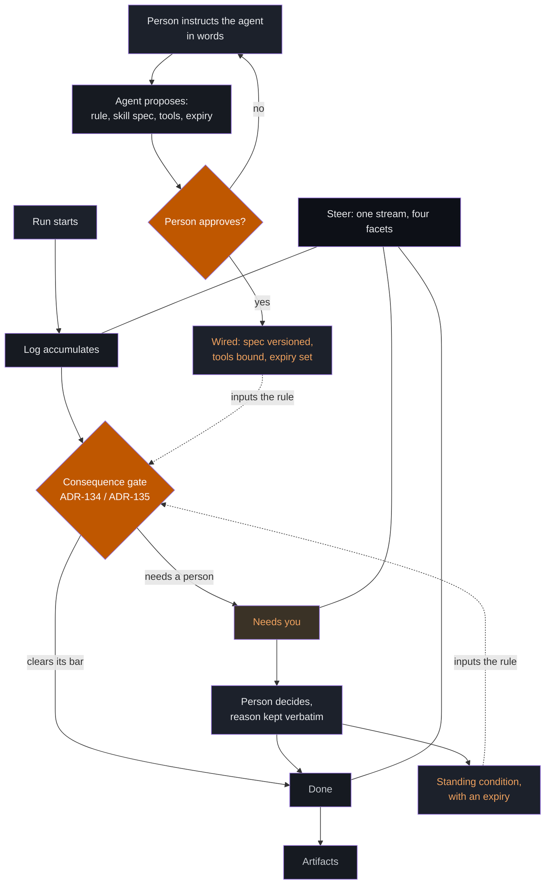

# ADR-137: Steer is the agent-activity verb, and Decide is a facet inside it

**Status:** Accepted (2026-09-29)
**Design:** [docs/assets/design/steer/](../assets/design/steer/README.md)
**Related:** [ADR-123](adr-123-receipts-surface-architecture.md) (the receipts surface),
[ADR-134](adr-134-severity-carries-consequence.md) (consequence classes),
[ADR-135](adr-135-graduated-autonomy.md) (autonomy gates),
[ADR-056](adr-056-skill-as-function.md) (verbs are skill functions),
[prd-steer.md](../prds/prd-steer.md)

## Context

The platform runs agents continuously and has nowhere to look at them. A person
can see open cases in `Decide`, published material in the library verb, and a
transcript of their own conversations under Recents. Nothing answers what is
running now, what finished overnight, what it produced, or whether an agent that
has said nothing for three hours is idle or dead.

That gap is not cosmetic. An agent whose work is invisible is, for every
practical purpose, an agent nobody can supervise, and graduated autonomy
(ADR-135) is only as good as the surface that shows what the gates let through.
We ship the gates and not the window.

The nav rail currently carries two base verbs, `decide` and `library`. `Decide`
is already described in the code as the oversight docket whose unit is the case,
and it is first in the rail. So the question is not where a new surface goes. It
is whether the docket grows to hold the whole run record, or whether a second
verb sits beside it.

Three further facts constrained the answer.

Chat is not a verb here. It is home, owned by the New-chat control and Recents,
and every capability is already reachable from it. Any proposal for an activity
surface has to say why chat does not simply cover it.

The rail labels are governed by a test asserting each is a present imperative
verb. That test cannot distinguish a noun that verbs from a noun. `Chart` and
`Model` passed it; `Reference` was rejected by hand and replaced with `Find`,
which collides with Search, already the rail's header affordance.

Fifty-nine of a hundred and seventeen capabilities declare no skill spec, so
they cannot report what they are doing. Any activity surface built today shows
roughly half the fleet.

## Decision

We add **Steer** as the agent-activity verb, formed by growing the existing
oversight docket rather than by adding a second verb beside it. Three parts.

### D1 — Steer is one run stream, and Decide is its needs-you facet

A run is the unit. It has a lifecycle: running, then either finished or waiting
on a person, and if it waited, the guidance it was eventually given. The surface
is one chronologically ordered stream of runs with facets over it — All, Needs
you, Running, Done — and `Needs you` is what `Decide` becomes. The word survives
as the facet name and as the vocabulary the consequence classes use.

History and Recents stay in the rail. That is a decision about where they
live, not a freeze on how the rail renders them: opening a named chat from
Recents, and whatever affordances that needs, belong to the chat surface. What
this decision forbids is folding them into Steer. They are the
**session** axis: a named conversation, opened from the rail, which may carry
turns from several agents at once — one thread can hold two named agents and the
orchestrator, each attributed by principal. Steer is the **agent** axis: one
agent's part in whatever it took part in, gathered across however many sessions
that was.

The two are projections of the same turns over different keys. Neither is
derived from the other, neither replaces the other, and a person reaches the
same conversation from either side. An agent-scoped history may of course be
offered inside Steer as well; that is a second projection, not a move.

Excerpting is where this gets decided rather than assumed, because the obvious
implementation is wrong. An agent's turn shown without the turn that prompted it
is not a record of anything: a reply severed from its question reads as an
assertion the agent never made on its own account. So the unit of an excerpt is
the **exchange**, not the turn; an excerpt states that it is one; and it names
the session it was taken from and links back to it whole.

Steer does not replace chat, and the seam runs both ways: any row opens a
conversation already holding that run, and anything asked of an agent in
conversation appears here as a run with the same log and the same stated limits.

### D2 — A rail is internally consistent in part of speech, and the app builder declares which

The test in place asserts that every rail label is a present imperative verb. It
cannot tell a noun that verbs from a noun, so `Chart` and `Model` passed while
`Reference` had to be admitted by name, and the exception list grows one hand
adjudication at a time.

The invariant it was reaching for is real but stated wrongly. What matters is
not that a label is a verb; it is that **a rail does not mix registers**. One
consumer's rail is mostly nouns and that is correct for it; another's is mostly
verbs and that is correct for it. A rail that is half one and half the other
reads as an accident, and that is the only thing worth failing a build over.

So an app declares its register and the check validates each label against the
declared one, rather than against a single hardcoded register the base picked.
The existing exception list is then not a patch on a rule but evidence the rule
asserted the wrong thing, and it goes away.

The base's label for the artifact verb is **Book**, ratified 2026-09-29
(*"creation item for the library, the name is going to be Book"*), and a
consumer that shares
the base's register shares the label; it is not a word each consumer re-picks.
`Artifacts` is the name the architecture and these documents use for the thing
itself, which is a different question from what the rail displays.

The verb id is unchanged. `library` is both a route and a view key, and the two
have already drifted once here — the nav shipped `library` while the shell
matched `reference`, so the item rendered, marked itself current, and landed on
"No view registered". Whether the id should later become `artifacts` to match
the concept name is left open rather than asserted; the cost is a tenant's URLs
and the benefit is cosmetic.

### D3 — The verb id moves to `steer`, and `decide` becomes a permanent alias

The concept genuinely broadened, so an id reading `decide` for a surface that is
mostly activity would mislead every future maintainer. A route alias makes the
move cheap, so the trade-off dissolves rather than having to be settled:
`#/decide` resolves to `#/steer` permanently, and `VERB_DECIDE` remains exported
as a deprecated alias of `VERB_STEER`.

### D4 — Behaviour is changed by conversation, and the translation is proposed before anything is wired

The four dials cover the coarse axes: whether an agent runs, how often it wakes,
how far it may go alone, and what reaches a person. They deliberately do not
cover the precise instruction, which is the one people actually want to give —
*whenever this happens do that*, *whenever that happens delegate to this other
agent*, *never do this*.

So an agent is tuned in words, in a composer on its own page, whose placeholder
text teaches the three shapes because nobody guesses them. What the person says
is kept verbatim as the reason, exactly as a decision's reason is.

An instruction is not applied as it is spoken. The agent translates it into a
concrete proposal and reads that back first: the rule in its own terms, the
change to its skill spec and the version that produces, any new tool binding it
would need, whether the ceiling moves, and when the instruction expires. Nothing
is wired until the person approves that proposal.

Three limits hold whatever is said. An instruction that would let the agent act
alone on a harm-class finding is refused rather than quietly narrowed to
something acceptable. Every taught instruction expires, like every dial. And
each one is a readable, revertible version of the agent, which is what later
makes cloning an agent, or minting a new one, the same door rather than a new
mechanism.

### D5 — A session from another harness is a run, and Steer adds no mechanism to make it one

Work happens in other harnesses, and it has to be visible and steerable here.
Steer does **not** build a second ingestion path for it. The portable-memory
work already absorbs foreign sessions, already stamps each absorbed record with
a write-once origin coordinate, and already writes guidance back into thirteen
harnesses' own rules files. Steer is a projection of that, and the filter is the
origin field that exists for dedup and sync.

A native run is told apart by carrying **no** origin coordinate, since crossing
a boundary is what writes one. No flag is added and no parallel registry is
introduced.

What a person may do therefore differs by source, and that difference is drawn
rather than discovered. Sources with an absorb reader can be observed, searched,
and have their memory reviewed. Sources reached only by write-back can be given
guidance and cannot be observed at all — the inverse of what anyone expects, and
so it is labelled on the row. A source that is wired but has no credential shows
as blocked rather than as quiet, because an absence of access and an absence of
activity are different facts. A control that would do nothing for a given source
is not drawn for that source.

Reviewing memory is the same object seen from the other end: a session is a run
and what it remembered is what that run produced, so memory review is opening a
row and asking memory a question is the Done facet with a different query. The
corpus, the deduplication, the origin and the gate that decides what may be
served are the ones already built.

## Options considered

**Watch as a second verb, with Decide kept beside it.** Coherent, and the
strongest case for it is that an obligation with a deadline wants its own
address and its own badge. It lost on two counts. One run's log, its outcome and
its pending judgment would sit in two places, which is the split this platform
refuses everywhere else it handles a record with a lifecycle. And the push
argument does not need a nav verb: notifications are the channel that finds a
person, and the rail is where someone goes when they are already looking. A verb
that is empty most days also trains people to ignore it, which is the reasoning
that keeps Plans and Tasks out of the base set.

**Chat alone, with no activity surface.** Everything Steer shows can be asked
for, and the capabilities are already reachable. It lost on a circularity: if
the only way to see what the agents did is to ask an agent, the audit surface
depends on the thing it audits. Measured evidence supports the worry, since a
retrieval harness here scored below the unaided model on out-of-corpus questions
through anchoring. Three smaller reasons point the same way. A transcript cannot
hold read or unread state, so "which of these have I already looked at" is
unanswerable. Oversight is comparative and prose is one-at-a-time, so noticing
the one wrong row among twelve is a spatial task. And a derivation is data that
a view can render exactly, where a conversation can only narrate it.

**Oversee rather than Steer.** More accurate about responsibility and already
the internal vocabulary for this plane. It lost for being passive at the moment
the surface has to accept an instruction, and for overlapping the meaning of the
facet inside it.

**Keeping `id: "decide"` with the label Steer.** Follows the precedent set when
the library verb's label changed while its id stayed. The precedent does not
bind here, because that was a pure rename of an unchanged concept. This one
broadens the concept, and the alias removes the cost that made the precedent
attractive.

## Consequences

**Easier.** A consumer stops being told its rail is wrong for using its own
register. An agricultural product may say Fields and Reports; another may say
Chart and Model; neither is a defect, and a rail that mixes them still fails.

An agent becomes teachable by the person who has to live with it,
without a code change, a config file or a ticket. The instruction that used to
be lost in a conversation becomes a versioned property of the agent that the
next matching case reads.

Graduated autonomy becomes observable: the ceiling an agent runs
under, what it handled alone and what it escalated are one screen rather than
three. A person can answer "what changed since Tuesday" without assembling it.
Guidance becomes durable, because a decision recorded here carries a reason and
may become a standing condition that the rule reads on the next matching case.

**Harder.** The surface can only show work that declares itself, so it will
render roughly half the fleet while looking complete. That is addressed by
disclosure rather than by waiting: the count of capabilities that cannot report
is always on the page, and it becomes a positive claim of completeness only when
it reaches zero. This makes closing the skill-spec gap a visible, ratcheting
obligation instead of a background one.

**We are committed to** four properties that are easy to erode and each get a
test. An excerpt never shows an agent's turn without what prompted it. Silence is never rendered as health: an agent that has missed its reports
looks different from an idle one and from a stopped one, and a successful last
run is not evidence of life. Absence is stated in kinds rather than collapsed
into an empty page. And no setting anywhere lets an agent act alone on a
harm-class finding, which is a property of the finding rather than a preference
about the agent.

**Reuse is the point of D5.** If a future change adds a foreign-agent registry,
a second session store, or a per-harness view, that is the defect this decision
exists to prevent. One absorb path, one origin coordinate, one gate, one stream.

**Riskiest part.** D4 lets a sentence modify an agent's skill spec and tool
bindings. The read-back is what makes that safe, so the proposal must state
every change it would make and the surface must never apply one that was not
shown. A translation that cannot be expressed as a concrete, revertible diff is
refused rather than approximated.

**Follow-up work.** Replace the imperative-verb assertion with a declared
register plus a consistency check, and remove the by-name exception list it
made necessary. Add the `#/decide` alias and the deprecated constant.

Fix the ADR numbering guard, which cannot do its job: `lint_adr_numbers.py
--next` computes against main and cannot see an unmerged branch, so two
concurrent branches are both told the same free number and neither finds out
until review. This decision and another were both drafted as ADR-137 on the same
afternoon. The fix has to be a number reserved in a committed index. Teaching `--next`
to consider open branches does not work: it can only see branches that exist
locally at the moment it is asked, and in this instance neither branch existed
on the other machine. Move History and
Recents into the Done facet, which changes the shell's `extra` section contract.
Define the dial and instruction model as a spec, since this ADR commits to both
carrying a reason and an expiry without specifying their storage, their
versioning, or how a taught instruction is compiled into a skill spec.
Decide whether a dial set on one node propagates to a peer, which this ADR does
not answer.

**Deferred deliberately.** Creating a new agent, and cloning an existing one
with what it has learned. Both ride D4's machinery and neither is needed to
ship it. Likewise a conversational query over memory, which is the Done facet
with a different query rather than a new surface.

**The gap D5 exposes and does not close.** Four widely used harnesses have a
write-back target and no absorb reader, so guidance reaches them while nothing
comes back. Writing readers for them is net-new work in the memory programme,
not in this one, and until it lands the surface states the asymmetry rather than
hiding it.

**Implemented.** appkit PR #37, on `feat/chat-surface-parity`: the surface
under `frontend/src/steer/`, both instances running side by side, and the nav
rename with its route alias. Four properties carry tests — silence is never
health, absence is reported in kinds, the harm ceiling is unspellable rather
than merely unchecked, and an excerpt is an exchange rather than a bare turn.

One thing the implementation added that this decision did not anticipate: an
alias is only real if the router consults it. `ROUTE_ALIASES` was added and not
called for one commit, which made `#/decide` resolve at the constant level and
nowhere a person could reach — a declared surface that did not exist. Both
halves belong in the same change, and the test that asserts the old route still
lands is what makes the alias a promise rather than a constant.

**Not decided here.** Whether a run stream is per-principal or per-account, and
what a second person on the same account sees of the first one's guidance. The
serving gate already refuses cross-account reads by default, so the conservative
behaviour holds until a decision is made.
