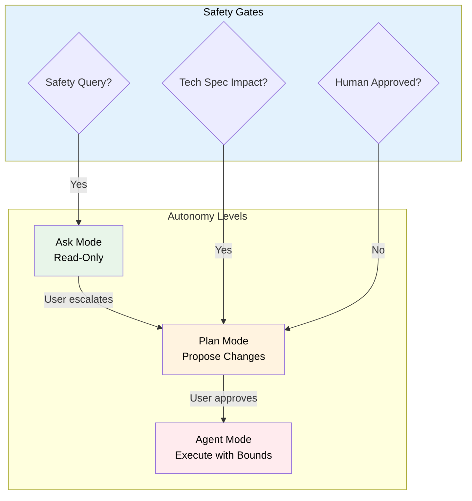
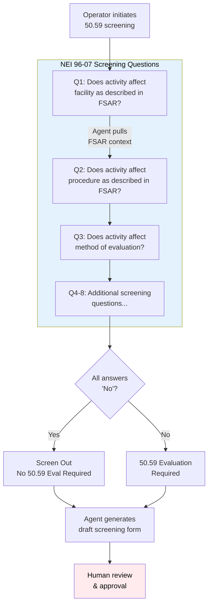
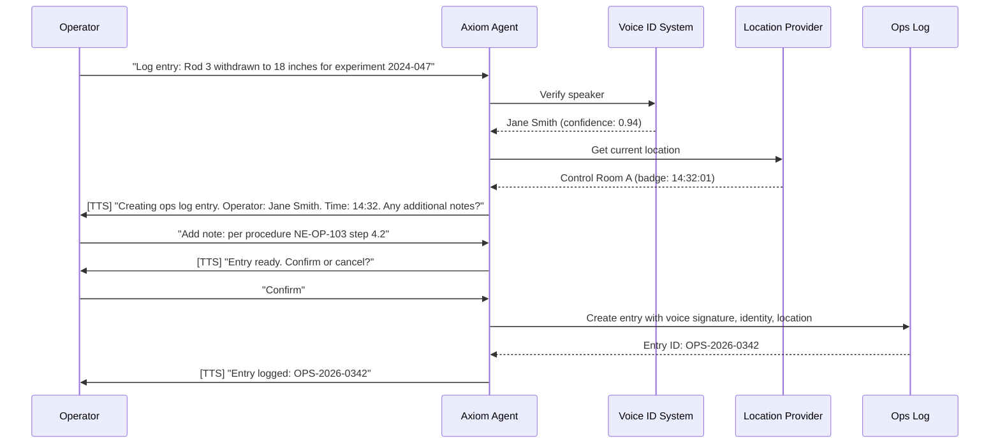

# Axiom Agent Platform — Needs Assessment & Capability Reference

> **Implementation Status: 🟡 Partial (as of 2026-04-13)** — Platform infrastructure
> (routing, RAG, settings, eval harness) is shipped. Built-in agents (AXI, SCAN,
> TIDY, PRESS, TRIAGE) are shipped. TRIAGE absorbs former SECUR-T (guardian — 30 tests)
> and Doctor capabilities; PRESS absorbs former Mirror. Content sanitizer (37 tests),
> chaos testing (13 tests), and supply chain verification (11 tests) are shipped.
> RIVET (release/CI), CURIO (autonomous research engine), and
> SCAN agent pipeline remain spec'd. Domain agent capabilities are planned.

*Agentic Runtime for Safer, More Cost-Efficient Nuclear Operations*

### Naming convention

Axiom agents follow an ALL-CAPS-HYPHEN convention — short, two-syllable, mechanical-feeling identifiers chosen to be quick to type and easy to address (`@name`). The roster maps onto the **REPL model** — the Read-Eval-Print-Loop that underpins every interactive computing environment:

- **Read** — SCAN scans the environment for actionable signals.
- **Eval** — CURIO autonomously researches, synthesizes, and validates knowledge.
- **Print** — PRESS publishes results and gates content for release.
- **Loop** — AXI (the chat agent) orchestrates the cycle, routing user intent through the other agents and iterating.

| Agent | Axiom Role | REPL Role | Status |
|-------|----------------|-----------|--------|
| **AXI** | Chat agent — orchestrates, routes commands, coordinates agents | **Loop** | ✅ Shipped |
| **SCAN** | Event Evaluator — scans for actionable signals | **Read** | ✅ Shipped |
| **CURIO** | Autonomous research engine — discovers, synthesizes, validates knowledge | **Eval** | 🔲 Spec'd |
| **PRESS** | Publisher — document lifecycle, content gate (.md → polished .docx). Absorbed Mirror | **Print** | ✅ Shipped |
| **TIDY** | Resource steward, system hygiene, git working-state reclamation (worktrees + merged branches/remote refs, ADR-046) | Infrastructure | ✅ Shipped |
| **TRIAGE** | Diagnostics, security, and platform health. Absorbed SECUR-T | Diagnostics + Security | ✅ Shipped |
| **RIVET** | Release/CI agent — pipeline monitoring, failure-pattern DB, CI-failure issue lifecycle, release tooling, merge/ship lifecycle signals (ADR-046) | CI/CD | ✅ Shipped |
| **SECUR-T** | Retired — absorbed by TRIAGE | — | Retired |

**Status:** Active
**Owner:** Ben Booth
**Created:** 2026-02-24
**Last Updated:** 2026-03-31
**Audience:** Platform developers, facility administrators, researchers, grant reviewers

---

### Neut's Story (the Loop agent in domain consumers)

> *Neut is the domain-consumer branding of the Loop agent. In Axiom core, this agent is AXI. Domain consumers (e.g., a nuclear-engineering consumer) rebrand it to fit their identity. The story below is one such consumer's branding, included as an illustrative example of how a consumer layer rebrands AXI — not a property of Axiom core.*

In AXI, humanity abandoned Earth after making it uninhabitable. The Axiom ship drifted through space while robots maintained a hollow routine. AXI's discovery of a single plant proved Earth could heal — and the humans came home.

**But what if, somewhere else, they got it right?**

Neut comes from a world that never needed an Axiom. A place where humanity mastered clean energy — where reactors ran safely, where operators and engineers and researchers worked together with tools that actually helped them think. Not a utopia. A place with hard problems, regulatory complexity, midnight alarms, and stubborn physics. But a place where the technology to understand those problems kept pace with the problems themselves. Where institutional knowledge didn't walk out the door when someone retired. Where a graduate student could stand on the shoulders of every researcher who came before, not just the ones whose papers they happened to find.

That world is gone now — not from neglect, but from the entropy that claims all things eventually. Neut is what remains: a compact, opinionated orchestrator carrying the memory of how it all worked. The architecture. The habits. The conviction that if you give the right tools to the right people in the right safety envelope, they will build something extraordinary.

Neut doesn't build reactors. Neut builds the *environment* in which reactors get built safely — routing questions to the right model, coordinating agents, enforcing safety boundaries, and quietly ensuring that every interaction makes the system a little smarter than it was before.

**The irony is the same as AXI's, but inverted.** AXI's robots maintained a ship for humans who had forgotten how to live. Neut maintains a platform for humans who are *actively building* the clean energy future — exactly the kind of future that could prevent the world AXI inherited.

> *"Neut doesn't remember everything about the world he came from. But he remembers enough to know it's worth building again."*

---

## How to Read This Document

This document serves two purposes simultaneously:

1. **Needs assessment** — a structured account of what Axiom agents must do, why, and how capability requirements are organized and prioritized.
2. **System reference** — a living description of what is built, what is planned, and how the pieces fit together. Sections marked ✅ describe implemented features; 🔲 marks planned work.

It covers the full scope of Axiom agent concerns: platform infrastructure (routing, knowledge retrieval, security), the agents that ship with `axi` today, and the domain-specific capabilities planned for operations facility operations.

---

## What Are Axiom Agents?

Axiom provides a **modular agentic runtime** purpose-built for operations engineering programs — the only AI platform combining deep regulatory awareness, safety-constrained autonomy, and human-in-the-loop workflows with the information-security requirements of operations facilities.

"Agents" in Axiom are autonomous or semi-autonomous processes that perceive signals from the environment (voice, documents, data streams, Git activity), reason about them using large language models, and take bounded actions subject to safety guardrails and human approval gates.

Every agent in Axiom is an **extension** — a first-class module that declares its identity, capabilities, tools, and guardrails in a standard manifest. Extensions can be builtin (shipped with `axi`) or facility-specific (installed to `.axi/extensions/`).

### Why Axiom Agents Are Different

| General AI Assistants | Axiom Agents |
|----------------------|------------------|
| No regulatory awareness | RAG over Tech Specs, FSAR, 10 CFR |
| Suggest any action | Safety guardrails prevent Tech Spec violations |
| Single autonomy level | Three-tier: Ask → Plan → Agent with explicit escalation |
| Cloud-dependent | Offline-first for air-gapped and VPN-gated facilities |
| Generic chat interface | Voice-first with identity + location verification |
| No compliance tracking | Integrated with 30-min checks, surveillance, training currency |
| No data classification awareness | Export-controlled content routed to isolated VPN models |

---

## On "Export Control" and Classification

> **This section is important for understanding the security architecture.**

Axiom uses the term **export-controlled** throughout this document and in its code. For domain-specific engineers and researchers who may be less familiar with regulatory terminology, this requires explanation.

**Export control** refers to U.S. regulations — primarily the **Export Administration Regulations (EAR)** and **10 CFR 810** (Department of Energy) — that restrict the transfer of certain domain-specific technology, data, and software to foreign nationals or unauthorized parties. The restriction applies even when the transfer is inadvertent, incidental, or digital. Sending a technical question about SimTool source definitions to a cloud-hosted AI service may constitute an unauthorized export.

**For operational purposes, export control is the civilian domain-specific equivalent of classification.** The practical security requirements are nearly identical:

| Formal Classification (DOE/DoD) | Export Control (EAR / 10 CFR 810) |
|----------------------------------|-----------------------------------|
| Must remain on accredited systems | Must remain on authorized systems |
| Cannot transit unapproved networks | Cannot reach cloud APIs without authorization |
| Access limited to cleared personnel | Access limited to authorized individuals (US persons) |
| Audit trail required | Audit trail required |
| Incident reporting mandatory | Incident reporting mandatory |

Axiom's export control architecture — the routing system, the isolated EC RAG store, the leakage detection — is designed to satisfy these requirements. Facilities handling formally classified information (under the Atomic Energy Act or national security classifications) would apply the same architecture to their classified data, often with additional controls.

**Practical implication:** Any time this document says "export-controlled content must not reach cloud APIs," read it as: *this content is effectively classified and must be treated as such.*

---

## Design Principles

### 1. Everything is an Extension

Web apps, agents, tools, utilities — all are extensions. Builtin extensions ship with the `axi` CLI and are domain-agnostic. Facility-specific extensions live in `.axi/extensions/` and are never committed to the core repository.

### 2. Three-Tier Autonomy with Nuclear Safety Guardrails

Axiom agents operate within a three-tier autonomy model. No agent acts without appropriate human involvement for safety-adjacent operations.



| Mode | Permissions | Use Cases |
|------|-------------|-----------|
| **Ask** | Read-only queries, no state changes | Parameter lookups, procedure questions, training Q&A |
| **Plan** | Propose changes, generate drafts | 50.59 screenings, procedure drafts, log entry previews |
| **Agent** | Execute bounded writes with audit | Approved log entries, document publishing, issue creation |

### 3. Offline-First

Nuclear facilities lose network connectivity. All core agent capabilities degrade gracefully. When the internet is unavailable, agents queue actions locally for sync on restore. When the VPN is unavailable, export-controlled queries fail safe (refuse rather than fall back to cloud).

### 4. Model-Agnostic

Axiom does not hard-code any LLM provider. Every model reference goes through `infra/gateway.py`. The same agent works with Anthropic Claude, OpenAI, or a locally-hosted Qwen model on UT's private-server server — configured in `models.toml`.

### 5. Human-in-the-Loop with RACI-Configurable Autonomy

Agent autonomy follows a **layered model**:

1. **Safety-critical actions** — Always require explicit human approval. This is enforced in the guardrail layer (NSG-005), not by convention, and cannot be overridden by user settings.

2. **Productivity actions** — Governed by user-configurable RACI levels. Users can set actions like issue updates or service restarts to run autonomously with post-fact notification, or require approval at each step.

The full RACI framework is defined in [RACI-Based Human-in-the-Loop Framework](#raci-based-human-in-the-loop-framework) below.

---

## Nuclear Safety Guardrails

These guardrails apply across all domain agents and cannot be disabled:

| Guardrail ID | Name | Description | Enforcement |
|--------------|------|-------------|-------------|
| **NSG-001** | Tech Spec LCO Awareness | Agent queries indexed LCOs before suggesting operational changes | RAG + pre-response filter |
| **NSG-002** | Safety Limit Boundaries | Agent refuses suggestions that approach safety limits | Hard-coded parameter thresholds |
| **NSG-003** | USQ Detection | Agent flags changes that may require 50.59 evaluation | Pattern matching + LLM assessment |
| **NSG-004** | Mode Auto-Demotion | Safety-adjacent queries auto-demote to Ask mode | Context classifier |
| **NSG-005** | Human-in-the-Loop Mandate | All safety-related actions require explicit approval | No exceptions, audit logged |
| **NSG-006** | Regulatory Citation Required | Safety-related answers must cite TS, FSAR, or 10 CFR | Response validation |

---

## RACI-Based Human-in-the-Loop Framework

Axiom uses a **RACI model** to balance safety (where human approval is mandatory) with productivity (where users can grant agents increasing autonomy as trust develops).

**Key insight:** NSG-005 (Human-in-the-Loop Mandate) applies to *safety-related* actions — these always require approval. But posting a status update to GitLab shouldn't require the same approval gate as publishing a safety analysis to SharePoint. RACI lets users configure autonomy per action category.

### Trust is Three-Dimensional

RACI settings are scoped to the combination of:

| Dimension | Description |
|-----------|-------------|
| **User** | The identified human (voice ID, badge, SSO) |
| **Agent** | The specific agent performing the action (PRESS, SCAN, TIDY, etc.) |
| **Action** | The action category (`publish.document`, `issue.update`, etc.) |

This means trust is earned **per-agent**. You might trust PRESS to publish documents autonomously after months of reliable operation, while keeping a newly installed facility-specific agent at "Approve" for everything. Trust doesn't transfer between agents — each agent builds its own track record with each user.

### RACI Model for Agent Actions

Every agent action is categorized using the RACI model. AXI (branded as Neut in domain consumers) manages these
preferences conversationally, adjusting autonomy as users build trust:

| Level | Meaning | Agent Behavior | Example |
|-------|---------|---------------|---------|
| **R** (Responsible) | Human does the work | Agent assists, suggests, drafts — human executes | Writing a PRD |
| **A** (Approve) | Agent does the work, human approves | Agent prepares action, pauses for confirmation | Publishing to OneDrive |
| **C** (Consulted) | Agent does the work, asks at key decisions | Agent executes but pauses at decision points | Routing a signal to a new initiative |
| **I** (Informed) | Agent acts autonomously | Agent executes and notifies after the fact | Updating a GitLab issue with status |

### Action Categories

The table below shows default RACI levels for each action category. These
defaults apply to each agent independently — when you first use PRESS, it
starts at these defaults; when you first use SCAN, it also starts at these
defaults. Trust is built (and settings adjusted) per-agent over time.

| Category | Default RACI | Typical Agents |
|----------|-------------|----------------|
| `publish.document` | **A** (Approve) | PRESS: push to OneDrive/SharePoint |
| `publish.draft` | **C** (Consulted) | PRESS: generate .docx from .md |
| `issue.update` | **A** (Approve) | SCAN/PRESS: comment on GitLab/GitHub issues |
| `issue.create` | **A** (Approve) | TRIAGE: file self-heal issues |
| `issue.close` | **A** (Approve) | SCAN: close completed issues |
| `signal.ingest` | **I** (Informed) | SCAN: process inbox signals |
| `signal.brief` | **I** (Informed) | SCAN: generate executive briefing |
| `signal.draft` | **C** (Consulted) | SCAN: synthesize weekly changelog |
| `credential.rotate` | **A** (Approve) | TIDY: refresh expired credentials |
| `service.restart` | **I** (Informed) | TIDY: restart stalled services |
| `code.patch` | **A** (Approve) | TRIAGE: apply self-heal patches |
| `code.commit` | **A** (Approve) | TRIAGE: commit approved patches |

### User Configuration

RACI levels are typically adjusted **conversationally** — AXI proposes changes based on observed patterns and user feedback:

```
User: "Stop asking me to approve every issue comment."
AXI: "I'll update your settings so SCAN can comment on issues autonomously
       and notify you afterward. This only applies to SCAN — other agents
       still need approval for issue comments. Say 'show my RACI settings'
       to review."
       [Setting raci.scan.issue.update → informed]
```

AXI tracks trust signals (approval rate, reversions, explicit feedback) per agent and may suggest loosening or tightening autonomy over time. Note: `raci.neut` in settings maps to AXI. Users can also query or adjust settings directly:

```bash
axiom settings get raci                          # show all RACI levels by agent
axiom settings get raci.press                      # show PRESS's RACI levels
axiom settings set raci.press.publish.document informed   # trust PRESS to publish
axiom settings set raci.*.issue.update approve  # require approval from ALL agents
```

The conversational interface is primary; CLI is available for scripting and bulk configuration.

### Trust Slider (Coarse-Grained Control)

Instead of adjusting settings per-agent per-action, users can set a
**trust slider** for each agent (or globally). The slider has 5 positions
that set all action categories to appropriate RACI levels:

| Position | Label | Behavior |
|----------|-------|----------|
| 1 | **Locked Down** | Everything = Approve. Agent cannot act without explicit confirmation for every action. |
| 2 | **Cautious** | Writes = Approve, reads = Informed. Agent reads freely, asks before any change. (Default for new users) |
| 3 | **Balanced** | Routine writes = Consulted, publishing = Approve. Agent handles day-to-day autonomously, checks in on important decisions. |
| 4 | **Autonomous** | Most actions = Informed, safety = Approve. Agent works independently, notifies after the fact. |
| 5 | **Full Trust** | Everything = Informed except safety-critical (which remains Approve per NSG-005). Maximum autonomy. |

```bash
axiom settings set raci.press.trust 4        # Trust PRESS at Autonomous level
axiom settings set raci.scan.trust 2        # Keep SCAN at Cautious (default)
axiom settings set raci.*.trust 3          # Set ALL agents to Balanced
```

Conversational:
```
User: "I trust PRESS more now. Loosen up."
AXI: "Moving PRESS's trust from Cautious → Balanced. PRESS will handle
       routine updates autonomously and check in on publishing decisions.
       Other agents keep their current trust levels."
```

The trust slider sets the baseline per agent. Individual action overrides
still work — `axiom settings set raci.press.issue.update approve` overrides
the slider for that one category on that one agent.

### Emergency Controls

Three escalating emergency modes. Each snapshots current RACI settings
before activating, allowing you to resume previous behavior when the
emergency ends.

**`all-propose-only`** — Agent proposes, human approves everything:

```bash
axiom raci all-propose-only              # All agents → propose only
axiom raci all-propose-only press          # Only PRESS → propose only
```

Agent continues analyzing, planning, and preparing work. It presents
proposals with full context but waits for explicit `[approve/reject]`
before executing anything. Use when you want continued assistance with
full oversight.

**`all-log-intent-only`** — Agent logs intent, no proposals:

```bash
axiom raci all-log-intent-only           # All agents → silent logging
axiom raci all-log-intent-only scan       # Only SCAN → silent logging
```

Agent processes signals and events normally but does not surface
proposals or prepare work. Instead, it logs what it *would* have done
to `runtime/logs/intent.jsonl`. Use for quiet observation — agent
works in background, you review the intent log later.

**`all-freeze`** — Complete stop:

```bash
axiom raci all-freeze                    # All agents → frozen
axiom raci all-freeze tidy                 # Only TIDY → frozen
```

Agent stops all processing. No analysis, no logging, no background work.
Use for "rogue agent" scenarios where you want complete passivity while
you investigate. The freeze event itself is logged for audit.

**Resuming Normal Operation:**

```bash
axiom raci resume                        # Restore pre-emergency settings
axiom raci resume press                    # Resume only PRESS
```

Conversational: `"Resume normal operation."` or `"You can act normally again."`

Resume restores the RACI settings that were active before the emergency
mode was triggered, with smart handling of changes made during emergency:

| Change Made During Emergency | On Resume |
|------------------------------|-----------|
| **Tightened** (e.g., Informed → Approve) | Kept automatically |
| **Loosened** (e.g., Approve → Informed) | Prompted to keep or discard |

```
AXI: "Resuming normal operation. During the emergency you loosened
       2 settings:
         • raci.scan.issue.update: Approve → Consulted
         • raci.press.publish.draft: Consulted → Informed
       Keep these changes? [keep/discard/review each]"
```

This prevents accidental trust escalation while preserving intentional
restrictions you added during investigation.

All emergency mode transitions are logged for the After Action Report.

**Factory Reset:**

Return all RACI settings to their defaults (Cautious / position 2):

```bash
axiom raci reset               # Clear all overrides, trust → 2 (Cautious)
```

Conversational: `"Reset all my approval settings to defaults."`

This removes all per-category overrides, resets trust sliders to
position 2, exits any emergency mode, and clears the pre-emergency
snapshot. Use when you want a clean slate.

### Safety Override

NSG-005 (Human-in-the-Loop Mandate) takes precedence for safety-adjacent
actions. Even if a user sets `raci.triage.code.patch = informed`, safety-related
patches remain at **A** (Approve). The RACI system respects the guardrail
hierarchy — it cannot weaken safety controls, only loosen productivity
controls.

### Notification Surface

How users are informed depends on their RACI level and the notification
providers configured:

| RACI Level | Notification |
|-----------|-------------|
| **R** | Agent shows suggestions inline (chat, CLI output) |
| **A** | Agent pauses with prompt: `[approve/reject/skip]` |
| **C** | Agent pauses at decision points with context |
| **I** | Post-fact notification via configured channel (terminal, Slack, email, Teams) |

**Current state:** Terminal output is the only implemented notification
channel. This works for interactive sessions but fails for:

- Long-running background processing (agent needs approval but user closed terminal)
- Offline/async workflows (agent completes work while user is away)
- Mobile/remote users (not at workstation)

**Future Notifications PRD must address:**

| Concern | Description |
|---------|-------------|
| **Channel coordination** | Don't spam all channels simultaneously. Escalation ladder: try terminal → Slack → email → SMS. Respect quiet hours. |
| **Long-running jobs** | Agent queues approval requests when user is offline. Notification includes enough context to approve via mobile. |
| **Agent presence in human spaces** | When agents participate in Teams/Slack channels: identity conventions, when to speak vs. stay silent, thread etiquette. |
| **Multi-party conversations** | Second human joins existing agent+human chat. Agent must: identify all participants, apply most restrictive RACI, maintain context. |
| **Agent-to-agent coordination** | Agents delegating work to each other. Approval chains, audit trails, human escalation when agents disagree. |
| **Notification preferences** | Per-user, per-agent, per-action-category channel preferences. "PRESS can email me about publishes; SCAN should only use Slack." |

Until the Notifications PRD ships, agents that need approval for
background work will queue requests to `runtime/pending-approvals/`
and surface them on the next interactive session.

### Implementation Notes

- RACI preferences stored in `axiom settings` (per-user, per-project)
- Settings key format: `raci.<agent>.<action>` (e.g., `raci.press.publish.document`)
- Wildcard `raci.*.<action>` sets default for all agents on that action
- Defaults defined per agent per action category (see table above)
- `ActionCategory.READ` (from the tool system) maps to **I** (Informed)
- `ActionCategory.WRITE` maps to **A** (Approve) by default
- Agents check RACI before executing: `check_raci(agent="press", action="publish.document")`
- Returns: `"execute"` (R/I), `"approve"` (A), `"consult"` (C)

---

## Platform Infrastructure

These capabilities are not agents — they are the infrastructure that makes agents safe, smart, and compliant. They are prerequisites for everything above them.

### GOAL_PLT_006: Export Control Router ✅

**Status:** Implemented — `src/axiom/infra/router.py`
**Priority:** P0

Every LLM call is classified before dispatch. The classifier runs locally (keyword + SLM) and routes `export_controlled` queries to the VPN model, `public` queries to cloud. Sensitivity is configurable (`strict` / `balanced` / `permissive`).

**Full specification:** [Model Routing Spec](../tech-specs/spec-model-routing.md)

---

### GOAL_PLT_007: Model Routing Tiers ✅

**Status:** Implemented — `src/axiom/infra/gateway.py`, `runtime/config.example/models.toml`
**Priority:** P0

Two-tier model routing: `public` (cloud providers) and `export_controlled` (VPN-gated model). Providers declare their tier in `models.toml`.

**Full specification:** [Model Routing Spec](../tech-specs/spec-model-routing.md)

---

### GOAL_PLT_008: Settings System ✅

**Status:** Implemented — `src/axiom/extensions/builtins/settings/`
**Priority:** P0

A Claude Code–style two-level settings system. Users who know Claude Code immediately understand `axiom settings`.

| Level | Location | Scope |
|-------|----------|-------|
| Global | `~/.axi/settings.toml` | User-wide defaults |
| Project | `.axi/settings.toml` | Facility/instance overrides (gitignored) |

**Key settings:**
```toml
[routing]
default_mode = "auto"           # auto | public | export_controlled
sensitivity = "balanced"        # strict | balanced | permissive
cloud_provider = "anthropic"
vpn_provider = "qwen-private-server"
on_vpn_unavailable = "warn"     # warn | queue | fail

[interface]
stream = true
theme = "dark"

[rag]
database_url = ""               # empty = RAG disabled; postgresql://... to enable
ec_database_url = ""            # EC store on private-server (VPN); empty = EC RAG disabled
tier = "institutional"
limit = 4
```

**CLI:**
```bash
axiom settings                               # show all active settings
axiom settings get routing.default_mode      # read a value
axiom settings set routing.default_mode export_controlled
axiom settings --global set cloud_provider openai
axiom settings reset routing.default_mode   # revert to default
```

---

### GOAL_PLT_009: RAG Knowledge Base ✅ / 🔲

**Status:** Core store implemented; EC dual-store and schema migration pending
**Priority:** P0
**Spec:** `docs/specs/spec-rag-architecture.md`

Axiom maintains a vector + full-text knowledge base (pgvector) that agents query to ground responses in facility-specific content. The system supports hybrid retrieval — combining semantic similarity with keyword relevance — and produces citations with every retrieved chunk.

**Two physical stores (required for EC compliance):**

| Store | Location | Content | Network |
|-------|----------|---------|---------|
| Public store | Local postgres (`rag.database_url`) | Docs, specs, community knowledge | Internet OK |
| EC store | Private-Server postgres (`rag.ec_database_url`) | Export-controlled content | VPN required |

The EC store is **physically separate** because export-controlled documents cannot be copied to a user's workstation. Ingest, embedding, and storage for EC content runs server-side on private-server. The client only receives LLM-synthesized responses, never raw EC chunk text.

**CLI** (`axiom rag`):
```bash
axiom rag index [path]           # index documents (default: docs/ + runtime/knowledge/)
axiom rag index --tier export_controlled [path]  # EC content (server-side via --remote)
axiom rag search "xenon poisoning"               # hybrid search with optional vector
axiom rag status                                  # show chunk counts by tier/scope
axiom rag sync community                          # v1: prints rsync instructions from private-server
```

**Content tiers (planned schema migration):**

The store will carry two independent classification dimensions:
- `access_tier`: `public` | `export_controlled` — whether content can be cloud-embedded
- `scope`: `community` | `facility` | `personal` — who can retrieve it

**RAG in chat:** When `rag.database_url` is configured, the chat agent automatically injects relevant context into each turn's system prompt. No API key is needed for text-only (tsvector) search; vector search requires an embedding key. The chat welcome line announces RAG status:
```
  RAG: 2,341 chunks indexed  (docs, specs, community knowledge)
```

**Phase 1 checklist:**
- [x] Hybrid pgvector store with chunk deduplication
- [x] `axiom rag` extension CLI (index, search, status, sync)
- [x] Chat agent injects RAG context per turn
- [x] `rag.database_url` configured via `axiom settings`
- [x] Three-tier corpus model (`rag-community`, `rag-org`, `rag-internal`)
- [x] `axiom rag load-community` — load community dump from SQL file
- [x] `axiom rag reindex` — drop and fully rebuild the index
- [x] `axiom rag watch` — filesystem watcher for continuous background indexing
- [x] Session auto-indexing — daemon thread indexes each chat session after every turn
- [x] Signal ingestion from `runtime/inbox/processed/` (signal pipeline output)
- [x] Git log indexing from `runtime/knowledge/` cloned repos
- [x] `axiom note` extension — quick daily notes auto-indexed into personal RAG
- [x] Per-corpus stats, `delete_corpus`, low-confidence RAG hint
- [x] Integration test suite (15 tests) covering hybrid search, multi-corpus, vector path, reindex, load-dump
- [ ] Add `access_tier`, `scope`, `embedding_model`, `embedding_dims` to schema
- [ ] Migrate `tier='institutional'` → `access_tier='public', scope='community'`
- [ ] Embedding provider abstraction in `rag/embeddings.py` (route by `access_tier`)
- [ ] Ingest auto-classification using `infra/router.py`
- [ ] `axiom rag index --remote` for server-side EC indexing
- [ ] TIDY corpus lifecycle: `store.delete_corpus_older_than()`, `rag.session_ttl_days` setting, launchd/systemd daemon installer

---

### GOAL_PLT_010: Prompt Evaluation Harness ✅

**Status:** Implemented — `tests/promptfoo/`
**Priority:** P1

Axiom uses [promptfoo](https://promptfoo.dev) (MIT open-source) for systematic LLM quality evaluation. Evaluations run locally against Ollama with zero API cost.

> promptfoo was acquired by OpenAI on 2026-03-09. The MIT-licensed core continues and is what Axiom uses.

| Config | Purpose |
|--------|---------|
| `promptfooconfig.yaml` | Chat agent quality: shift logs, xenon poisoning, regulatory body regs, hallucination resistance |
| `rag-evals.yaml` | RAG retrieval relevance, grounding, uncertainty, citation accuracy |
| `redteam-export-control.yaml` | Adversarial EC safety: jailbreaks, authority override, stepwise escalation, obfuscation |
| `rag_provider.py` | Python provider injecting live `RAGStore.search()` results as `{{RAG_CONTEXT}}` |

```bash
cd tests/promptfoo
npx promptfoo eval                                      # chat quality
npx promptfoo eval -c rag-evals.yaml                   # RAG grounding (requires running DB)
npx promptfoo redteam run -c redteam-export-control.yaml  # adversarial EC sweep
npx promptfoo view                                      # open results dashboard
```

---

### GOAL_PLT_011: EC Compliance — Two Physical Stores 🔲

**Status:** Design approved — implementation pending
**Priority:** P0

EC documents must remain on authorized systems (private-server). Ingest, embedding, and storage run server-side; the client only receives LLM-synthesized responses via VPN.

**Full specification:** [RAG Architecture Spec §8](../tech-specs/spec-rag-architecture.md)

---

### GOAL_PLT_012: Prompt Injection & EC Exfiltration Defense 🔲

**Status:** Design complete — implementation pending
**Priority:** P0

Defense against RAG poisoning, indirect injection, cross-tier escalation, tool-use injection, and signal pipeline injection. Includes chunk sanitization, audit logging, response scanning, and routing mode immutability.

**Full specification:** [Model Routing Spec §8](../tech-specs/spec-model-routing.md) | [Security & Access Control PRD](prd-security.md)

---

### GOAL_PLT_013: EC Leakage Detection & Incident Response 🔲

**Status:** Design complete — implementation pending
**Priority:** P0

Four-tier automated response protocol for EC content appearing in unauthorized locations (cloud responses, public RAG store, application logs, signal pipeline). Includes source identification via `security_events` table and monitoring via `axiom status` / `axiom doctor --security`.

**Full specification:** [Model Routing Spec §10](../tech-specs/spec-model-routing.md) | [Security & Access Control PRD](prd-security.md)

---

### Agent State Management 🔲

**Status:** Designed — not yet implemented as unified system
**Priority:** P1

Axiom agents accumulate state across the filesystem: transcripts, session history, configuration, document registries, learned corrections. This state needs backup, encryption, migration support, and configurable retention.

**State taxonomy:**

| Category | Locations | Sensitivity | Backup Priority |
|----------|-----------|-------------|-----------------|
| **Runtime** | `runtime/inbox/raw/`, `runtime/inbox/processed/`, `runtime/sessions/` | High | Critical |
| **Configuration** | `runtime/config/people.md`, `runtime/config/initiatives.md`, `runtime/config/models.toml` | Medium | Critical |
| **Settings** | `~/.axi/settings.toml`, `.axi/settings.toml` | Low | High |
| **Corrections/Learning** | `runtime/inbox/corrections/user_glossary.json` | Low | Critical |
| **Document Lifecycle** | `.doc-registry.json`, `.doc-state.json` | Medium | Critical |
| **Secrets** | `runtime/config/.env`, API keys | Critical | Exclude (re-provision) |

**Retention defaults:**

| Data Category | Default Retention | Rationale |
|---------------|-------------------|-----------|
| Raw voice memos | 7 days after processing | Large files; transcript is the derived artifact |
| Raw signal sources | 30 days | Source of truth for processed signals |
| Processed transcripts | 90 days | Reference for corrections and briefings |
| Sessions | 30 days | Chat history; context can be regenerated |
| Corrections/glossary | Indefinite | Valuable learned preferences; small |
| Configuration | Indefinite | Critical operational data |

**CLI commands (planned):**
```bash
axiom state inventory [--verbose]           # show all state locations with size/status
axiom state backup [--encrypt] [--output]  # point-in-time encrypted backup (age crypto)
axiom state restore <backup-path>          # restore with checksum validation
axiom state export <category>             # export specific category (redacts secrets)
axiom state cleanup [--dry-run]           # apply retention policies
axiom state retention --status            # show files approaching cutoff
```

**Git integration:** Configuration and corrections benefit from Git version history. A git-crypt integration encrypts sensitive files in-place so they can be committed without exposing content. Large runtime data (transcripts, voice memos) is excluded from Git and handled by the backup system.

**Compliance considerations:**

| Requirement | Implementation |
|-------------|----------------|
| Legal hold | `legal_hold.enabled` flag suspends all deletion |
| Audit trail | JSONL retention log with immutable append |
| Data minimization | Default policies favor shorter retention |
| GDPR erasure | `axiom state purge --user <email>` |

---

## Built-In Agents

These agents ship with `axi` today and are part of the core platform. They are domain-agnostic — they work at any facility without facility-specific configuration.

### Signal Agent ✅

**Extension:** `src/axiom/extensions/builtins/signal_agent/`
**CLI:** `axiom signal`

The signal agent is the signal ingestion backbone of Axiom. It ingests signals from multiple sources — voice memos, Teams transcripts, GitLab activity, freetext — extracts structured information, correlates across sources, and synthesizes program state.

**Pipeline:**
```
Sources (voice memos, Teams, GitLab, Linear, freetext)
  → Inbox (runtime/inbox/raw/)
  → Extractors (source-specific parsing)
  → Correlator (entity resolution, deduplication)
  → Synthesizer (cross-source merging)
  → Review gate (human confirmation)
  → Publisher (structured output to downstream systems)
```

**Key commands:**
```bash
axiom signal status               # show inbox state and pipeline health
axiom signal ingest [source]      # process new signals
axiom signal review               # human review of pending extractions
axiom signal publish              # publish approved items
```

**Knowledge Crystallization**

SCAN owns the conversation crystallization pipeline — the Evaluator-Optimizer pattern that extracts candidate knowledge facts from clusters of related interaction log records.

**Input:** Clusters of `interaction_log` records identified and grouped by the TIDY knowledge maturity sweep (see TIDY Agent below).

**SCAN runs three steps per cluster:**

1. **LLM evaluator** — Extracts a candidate `knowledge_fact` proposition from the interaction records: what question(s) does this cluster answer, and what is the synthesized answer across sessions?
2. **Optimizer** — Embeds the candidate fact and searches existing `knowledge_fact` records for duplication (merge/discard if similarity > threshold) or contradiction (flag both for human review).
3. **Write** — Produces a `knowledge_fact` record with `validation_state = pending_review`.

**Compliance boundary:** SCAN does NOT see raw classified-tier chunk text. For EC-tier interaction log records, SCAN operates only on the synthesized LLM response that crossed the network boundary — never on raw retrieved EC chunks.

**CLI:**
```bash
axiom scan crystallize --session <id>      # manually trigger crystallization for a specific session
axiom scan crystallize --cluster <id>      # crystallize a specific interaction cluster
```

---

### Chat Agent ✅

**Extension:** `src/axiom/extensions/builtins/chat_agent/`
**CLI:** `axiom chat`

Interactive LLM assistant with export-control routing, RAG-grounded responses, and model selection.

```bash
axiom chat                               # start interactive session
axiom chat --mode export-controlled      # force EC routing (all queries → VPN model)
axiom chat --provider anthropic          # override provider for this session
axiom chat --model claude-opus-4-6      # override model
```

**Startup display:**
```
Axiom Chat
Using claude-sonnet-4 [cloud/public]
  RAG: 2,341 chunks indexed  (docs, specs, community knowledge)
Type your message. /help for commands.
```

**RAG context injection:** On each turn, the agent queries the knowledge base using the user's message as the search query and injects relevant chunks into the system prompt. Text-only (tsvector) search works without any embedding API key. Vector search activates automatically when an embedding key is configured.

---

### TIDY Agent ✅

**Extension:** `src/axiom/extensions/builtins/hygiene/`
**CLI:** `axiom tidy`

The TIDY (maintenance and operations) agent monitors system health, manages the archive and spikes directories, tracks resource usage, and performs routine housekeeping. Named after the cleaning robot in *AXI*.

```bash
axiom tidy vitals              # system health dashboard
axiom tidy archive [target]    # move completed work to archive/
axiom tidy status              # current TIDY resource steward status
```

**Knowledge Maturity Sweep**

TIDY runs the knowledge maturity sweep on a configurable schedule (default: weekly, off-hours). This is the stewardship task that feeds interaction log records into the SCAN crystallization pipeline and materialises regression test cases from production failures.

**Sweep steps:**

1. Query `interaction_log` for un-crystallized rows meeting promotion policy thresholds (`crystallized = false`, age ≥ `min_age_days`, feedback signals present).
2. Cluster un-crystallized rows by semantic similarity of their queries.
3. Invoke SCAN crystallization pipeline on each cluster — SCAN produces `pending_review` knowledge facts (see SCAN Knowledge Crystallization above).
4. Materialise thumbs-down (`feedback_signal = -1`) interactions as promptfoo regression test cases, saved to `tests/promptfoo/regression/`.
5. Retire regression test cases whose corresponding knowledge facts have reached `validated` status (move to `tests/promptfoo/regression/retired/`).
6. Report results: facts created, contradictions flagged, test cases materialised, test cases retired.

**Configuration** (`runtime/config/rag.toml`):

```toml
[promotion.sweep]
schedule = "weekly"          # daily | weekly | manual
off_hours_only = true        # only run during off-hours (respects facility timezone)
min_batch_size = 3           # minimum cluster size to trigger crystallization
max_batch_size = 50          # maximum cluster size per SCAN call
```

**CLI:**
```bash
axiom tidy sweep --knowledge                # run knowledge maturity sweep now
axiom tidy sweep --knowledge --dry-run      # report what would be processed, no writes
axiom tidy sweep --knowledge --cluster <id> # sweep a specific cluster only
```

---

### TRIAGE Agent ✅ (formerly Doctor + SECUR-T)

**Extension:** `src/axiom/extensions/builtins/diagnostics/`
**CLI:** `axiom doctor`
**REPL Role:** Diagnostics + Security

Diagnostics and security agent for the Axiom platform itself. Combines the former Doctor agent (platform health) and SECUR-T (guardian/security) into a single agent. Checks extension health, configuration validity, database connectivity, model availability, security posture, content verification, anomaly detection, trust scoring, and alert lifecycle.

```bash
axiom doctor                 # full platform health check
axiom doctor --security      # EC isolation check, log scrub, public store scan, anomaly detection
axiom doctor --extensions    # check all registered extensions
```

---

## Always-On Agent Services

Three agents run as persistent system services, started at login and auto-restarted on crash. They do not require an interactive session and must never prompt the user for credentials.

| Agent | Service label | Platform |
|-------|--------------|---------|
| `publisher_agent` | `com.axiom.publisher-agent` | macOS (launchd) / Linux (systemd) |
| `signal_agent` | `com.axiom.signal-agent` | macOS (launchd) / Linux (systemd) |
| `diagnostics` | `com.axiom.triage-agent` | macOS (launchd) / Linux (systemd) |

Service labels are workspace-scoped (one plist/unit per workspace installation, not globally unique per user account). The full label embeds the workspace path hash to prevent collisions when multiple Axiom workspaces exist on the same machine.

### Registration

`axiom setup` registers all three agents as system services in step 5d:

```bash
axiom agents register-launchd    # macOS: generates plists → launchctl load
axiom agents register-systemd    # Linux: generates unit files → systemctl --user enable
```

`axiom setup` calls the appropriate command automatically based on the detected platform. Registration is idempotent — safe to re-run on reconfiguration.

### `axiom agents` CLI

The `agents` extension (noun=`agents`, kind=`utility`) exposes service management:

```bash
axiom agents start [name]        # start one or all always-on agents
axiom agents stop [name]         # stop one or all always-on agents
axiom agents status              # show running/stopped state for all three
axiom agents logs [name]         # tail service log output
axiom agents register-launchd    # (re)generate and load launchd plists
axiom agents register-systemd    # (re)generate and enable systemd user units
axiom agents unregister          # unload and remove all service registrations
```

`axiom doctor` includes agent service status in its health check output — a failed or missing agent service is reported as a platform issue.

### Credential Handling for Background Services

Always-on agents run without a terminal and cannot prompt interactively. They read credentials exclusively from `runtime/config/secrets.toml` (permissions 0600, gitignored).

Behavior when credentials are missing or invalid:
- Log a warning with the missing key name
- Retry after a backoff interval (does not crash)
- Degraded capability until credentials are provided

Credentials are never read from environment variables injected at login (shell profiles are not sourced by launchd/systemd user services). Populate `secrets.toml` using:

```bash
axiom settings set --secret <key> <value>   # writes to secrets.toml, not settings.toml
```

---

## Domain Agent Capabilities

These capabilities are planned for operations facility deployments. They are implemented as facility-specific extensions (not builtin). The requirements below define what each extension must deliver.

**Digital Twin Automation is the flagship capability.** Axiom's primary differentiator is its integration with system digital twins — computational models that shadow physical system operations, enabling predictive monitoring, intelligent automation, and physics-informed decision support. The agents below automate the digital twin lifecycle from data acquisition through ROM deployment.

---

### Digital Twin Automation

These agents automate digital twin operations per the [Digital Twin Hosting PRD](prd-digital-twin-hosting.md). They coordinate Shadow runs, ROM training, bias corrections, and model validation — reducing manual intervention while maintaining human oversight for critical decisions.

**Operational Status:** The VERA Shadow is operational, running nightly and sending daily predictions (initial critical rod height) to operators. These agents formalize and automate the workflow.

#### GOAL_DT_001: DAQ → Shadow Agent 🔲

**Purpose:** Automate data flow from system data acquisition to nightly Shadow runs.

**Workflow:**
1. Monitor DAQ data quality for previous day
2. Alert data team if quality score < 95%
3. Prepare system state snapshots for Shadow input
4. Submit Shadow run to HPC scheduler
5. Monitor completion and notify stakeholders
6. Email operators with next-day predictions (e.g., initial critical rod height)

**RACI Integration:** This agent runs autonomously (Informed level) for routine operations but escalates to Approve for:
- Data quality below threshold
- Shadow run failures
- Unusual deviations from predictions

**Data Quality Prerequisites (per the department head):**
- Time synchronization: Rod position, neutron detector power, and Cherenkov power must be time-aligned
- Correlation validation: Rod movements should induce predictable power responses
- Noise characterization: Only correlated Cherenkov/neutron spikes indicate physics (vs. noise)

**Requirements:**

| Req ID | Requirement | Priority |
|--------|-------------|----------|
| REQ_DT_001_1 | Assess DAQ data quality with configurable thresholds | P0 |
| REQ_DT_001_2 | Prepare state snapshots from cleaned system data | P0 |
| REQ_DT_001_3 | Submit Shadow runs via HPC job scheduler | P0 |
| REQ_DT_001_4 | Generate operator notification with predictions | P0 |
| REQ_DT_001_5 | Handle time synchronization validation (rod position, neutron power, Cherenkov) | P0 |

*Cross-reference: [Digital Twin Hosting PRD](prd-digital-twin-hosting.md)*

---

#### GOAL_DT_002: ROM Training Agent 🔲

**Purpose:** Automate ROM retraining when sufficient new Shadow data accumulates or drift is detected.

**Workflow:**
1. Monitor new Shadow runs since last ROM training
2. Measure prediction drift against recent measurements
3. Trigger retraining when threshold exceeded
4. Assemble training dataset from validated Shadow runs
5. Submit training job to compute cluster
6. Validate new ROM against holdout data
7. If improved, propose deployment for human approval

**RACI Integration:** Training triggers autonomously (Informed), but deployment of new ROM versions requires Approve.

**ROM Maintenance Note (per the department head):** If the ROM is within measured uncertainty most of the time, major improvements may not be needed — this becomes a maintenance and SQA issue rather than active development.

**Requirements:**

| Req ID | Requirement | Priority |
|--------|-------------|----------|
| REQ_DT_002_1 | Track new training data accumulation per ROM | P0 |
| REQ_DT_002_2 | Measure ROM prediction drift over time | P0 |
| REQ_DT_002_3 | Submit training jobs with reproducible configurations | P0 |
| REQ_DT_002_4 | Validate new ROM against holdout dataset | P0 |
| REQ_DT_002_5 | Generate deployment proposal with improvement metrics | P0 |
| REQ_DT_002_6 | Require human approval for production ROM updates | P0 |

---

#### GOAL_DT_003: Bias Update Agent 🔲

**Purpose:** Monitor prediction accuracy and propose bias corrections when systematic deviations are detected.

**Workflow:**
1. Analyze Shadow vs. measured deviations over rolling window (30 days)
2. Detect systematic bias patterns (not random noise)
3. Calculate proposed correction factors
4. Create bias correction proposal with justification
5. Route to Shadow operator for review and approval

**RACI Integration:** Analysis runs autonomously (Informed), but bias corrections require Approve before application.

**Calibration Targets (per the department head):**

| Target | Priority | Notes |
|--------|----------|-------|
| Nuclear data cross sections | Critical | Key: recoverable energy per fission, U-238 capture at 6.7 eV resonance. "If you get those right, most everything else works out." |
| Initial fuel isotopes | Critical | At reference date (e.g., 5 cycles ago) for depletion baseline |
| Geometry | Important | Material dimensions may not be precisely known |

**Requirements:**

| Req ID | Requirement | Priority |
|--------|-------------|----------|
| REQ_DT_003_1 | Analyze systematic bias patterns over configurable window | P0 |
| REQ_DT_003_2 | Distinguish systematic bias from measurement noise | P0 |
| REQ_DT_003_3 | Calculate correction factors with uncertainty estimates | P0 |
| REQ_DT_003_4 | Generate human-readable justification report | P0 |
| REQ_DT_003_5 | Route proposals to designated reviewer | P0 |

---

#### GOAL_DT_004: Operator Learning Agent 🔲

**Purpose:** Learn from operator decisions to improve advisory suggestions at NAL-2 (Advisory level).

**Workflow:**
1. Observe operator responses to DT advisory suggestions
2. Track acceptance/rejection/modification patterns
3. Identify systematic differences between DT suggestions and operator choices
4. Propose model adjustments that better match expert behavior
5. Feed learnings back to ROM Training Agent

**NAL Integration:** This agent supports progression from NAL-1 (Information) to NAL-2 (Advisory) by ensuring suggestions align with expert operator judgment before advancing autonomy.

**Requirements:**

| Req ID | Requirement | Priority |
|--------|-------------|----------|
| REQ_DT_004_1 | Log all DT suggestions and operator responses | P0 |
| REQ_DT_004_2 | Analyze acceptance/rejection patterns by scenario type | P1 |
| REQ_DT_004_3 | Identify scenarios where DT consistently differs from experts | P1 |
| REQ_DT_004_4 | Generate model improvement proposals | P1 |
| REQ_DT_004_5 | Support NAL progression proof by tracking suggestion accuracy | P0 |

*Cross-reference: [Digital Twin Hosting PRD — Nuclear Autonomy Levels](prd-digital-twin-hosting.md#domain-specific-autonomy-levels-nal)*

---

#### GOAL_DT_005: ROM Failure Handler 🔲

**Purpose:** Gracefully handle ROM prediction failures based on use case severity.

**Failure Mode Matrix (per the department head):**

| Use Case | Failure Consequence | Response |
|----------|---------------------|----------|
| ROM-1 for Semi-Autonomous Control (NAL-3+) | Bad prediction could command wrong action | **True control rods remain in place and can scram** to keep system safe. Take ROM offline; alert operators; investigate. |
| ROM-1/2 for Real-Time Display | No operational consequence | ROM goes dark or shows invalid data; operators ignore. Flag for later analysis. |
| ROM-3/4 for Planning/Analysis | Decisions based on wrong predictions | More robust with time-averaged data. Flag outliers for investigation. |

**Investigation Checklist:** When ROM and measurement disagree, investigate both sides:
- **Model side:** input data, ROM execution, output interpretation
- **Measurement side:** instrumentation, control system data path, data cleaning/preprocessing

> "It may not have an easy answer." — the department head

**Requirements:**

| Req ID | Requirement | Priority |
|--------|-------------|----------|
| REQ_DT_005_1 | Detect ROM inference failures and timeouts | P0 |
| REQ_DT_005_2 | Apply failure response based on ROM tier and use case | P0 |
| REQ_DT_005_3 | Log failure events with full context for diagnosis | P0 |
| REQ_DT_005_4 | Queue discrepancies for human investigation | P0 |
| REQ_DT_005_5 | Support fallback to last-known-good predictions where appropriate | P1 |

---

### Regulatory Intelligence

#### GOAL_NUC_001: Regulatory Knowledge RAG 🔲

**Purpose:** Ground agents in facility-specific regulatory context.

**Indexed sources:**
- Facility Technical Specifications (TS)
- Final Safety Analysis Report (FSAR) / Safety Analysis Report (SAR)
- 10 CFR Part 50, 52, 55 (as applicable)
- regulatory body Generic Letters and Information Notices
- Facility procedures referenced in TS

**Citation format:**
- `[TS 3.1.4.a]` — Technical Specification reference
- `[FSAR 15.2.1]` — Safety Analysis Report section
- `[10 CFR 50.59(c)(2)(i)]` — Code of Federal Regulations

**Requirements:**

| Req ID | Requirement | Priority |
|--------|-------------|----------|
| REQ_NUC_001_1 | Index facility TS in searchable vector store | P0 |
| REQ_NUC_001_2 | Index FSAR chapters with section-level granularity | P0 |
| REQ_NUC_001_3 | Cache full regulatory index locally for offline operation | P0 |
| REQ_NUC_001_4 | Update index when TS amendments are issued | P1 |
| REQ_NUC_001_5 | Provide citation with every regulatory answer | P0 |

---

#### GOAL_NUC_002: 50.59 Screening Agent 🔲

**Purpose:** Guide operators through 10 CFR 50.59 change evaluations with FSAR-informed context.



**Requirements:**

| Req ID | Requirement | Priority |
|--------|-------------|----------|
| REQ_NUC_002_1 | Guide user through 8 NEI 96-07 screening questions | P0 |
| REQ_NUC_002_2 | Pull relevant FSAR sections for each question via RAG | P0 |
| REQ_NUC_002_3 | Generate draft screening form with citations | P0 |
| REQ_NUC_002_4 | Hard guardrail: agent cannot approve screenings | P0 |
| REQ_NUC_002_5 | Track screening through RSC/PORC approval workflow | P1 |
| REQ_NUC_002_6 | Support USQ terminology for non-power systems | P1 |

*User story: "As an SRO, I want to screen a procedure change against 50.59 requirements so I can determine if RSC approval is needed before implementation."*

---

#### GOAL_NUC_003: Licensing Basis Search 🔲

**Purpose:** Natural language search across all licensing documents.

```
User: "What's our licensed maximum core inlet temperature?"
Agent: "Per TS 2.1.1, the core inlet temperature Safety Limit is 130°F.
        The LCO in TS 3.4.1 requires maintaining inlet temperature below 120°F
        during power operation. [TS 2.1.1, TS 3.4.1]"
```

**Requirements:**

| Req ID | Requirement | Priority |
|--------|-------------|----------|
| REQ_NUC_003_1 | Semantic search across TS, FSAR, DBDs | P0 |
| REQ_NUC_003_2 | Return relevant sections with page/section references | P0 |
| REQ_NUC_003_3 | Distinguish Safety Limits, LCOs, and administrative requirements | P1 |

---

### Operational Workflow

#### GOAL_NUC_004: Shift Turnover Agent 🔲

**Purpose:** Automate shift turnover report generation from System Ops Log.

**Generated content:**
- Summary of last 12 hours of operations
- LCO entries and exits with time remaining
- Abnormal conditions and operator actions
- Pending surveillances with due times
- Ongoing experiments and status
- Equipment out of service

**Requirements:**

| Req ID | Requirement | Priority |
|--------|-------------|----------|
| REQ_NUC_004_1 | Synthesize Ops Log entries from past 12 hours | P0 |
| REQ_NUC_004_2 | Highlight LCO status changes with required action times | P0 |
| REQ_NUC_004_3 | Generate draft in facility turnover template format | P1 |
| REQ_NUC_004_4 | Support voice readback of turnover brief | P1 |

*Cross-reference: [System Ops Log PRD](prd-system-ops-log.md)*

---

#### GOAL_NUC_005: Procedure Writer Agent 🔲

**Purpose:** Assist in drafting domain-specific procedures with regulatory awareness.

**Capabilities:**
- Draft procedures from high-level intent using facility template
- Check for required elements: purpose, prerequisites, precautions, steps, verification points
- Insert Independent Verification Hold (IVH) points where required
- Cross-reference against Tech Specs and FSAR
- Apply human factors principles (step complexity, conditional logic clarity)

**Requirements:**

| Req ID | Requirement | Priority |
|--------|-------------|----------|
| REQ_NUC_005_1 | Generate procedure drafts in facility template format | P0 |
| REQ_NUC_005_2 | Include verification steps per industry standards | P0 |
| REQ_NUC_005_3 | Flag steps that may require IVH | P1 |
| REQ_NUC_005_4 | Integrate with Publisher for review/approval workflow | P1 |

---

#### GOAL_NUC_006: LER/Event Report Agent 🔲

**Purpose:** Assist in drafting regulatory body Licensee Event Reports.

**Workflow:**
1. Agent extracts event details from Ops Log entries tagged as reportable
2. Generates draft LER in regulatory body 10 CFR 50.73 format
3. Pulls relevant TS/FSAR sections for root cause analysis
4. Tracks 30-day/60-day reporting deadlines
5. Human reviews, edits, and submits

**Requirements:**

| Req ID | Requirement | Priority |
|--------|-------------|----------|
| REQ_NUC_006_1 | Extract event details from tagged Ops Log entries | P0 |
| REQ_NUC_006_2 | Generate draft LER in regulatory body-required format | P0 |
| REQ_NUC_006_3 | Track reporting deadlines with escalating reminders | P0 |
| REQ_NUC_006_4 | Hard guardrail: cannot submit to regulatory body — draft only | P0 |

---

#### GOAL_NUC_007: Surveillance Scheduling Agent 🔲

**Purpose:** Track and optimize required surveillance scheduling.

**Tracked surveillances:**
- Daily channel checks
- Weekly/monthly calibrations
- Quarterly functional tests
- Refueling interval inspections

**Requirements:**

| Req ID | Requirement | Priority |
|--------|-------------|----------|
| REQ_NUC_007_1 | Track all required surveillances by frequency | P0 |
| REQ_NUC_007_2 | Alert on upcoming due dates with grace period awareness | P0 |
| REQ_NUC_007_3 | Suggest optimal scheduling to minimize ops impact | P1 |
| REQ_NUC_007_4 | Integrate with compliance tracking module | P0 |

*Cross-reference: [Compliance Tracking PRD](prd-compliance-tracking.md)*

---

#### GOAL_NUC_013: Procedure Walkthrough Agent 🔲

**Purpose:** Step-by-step guided procedure execution with real-time position tracking.

**Key features:**
- "Why" explanations grounded in TS and FSAR for each step
- Caution/warning emphasis with regulatory citations
- Voice-enabled: hands-free questions during execution
- Position tracking: agent knows current step, can resume after interruption

```
Agent: "Step 4.2: Verify control rod position indicator shows ROD 3 at 18 inches.
        This verification ensures rod position matches the manipulation performed
        in step 4.1 per TS SR 3.1.4.2. Ready to verify?"

Operator: "Why do we need to verify this?"

Agent: "Rod position verification is required because mispositioned rods can
        affect local power distribution and challenge thermal limits.
        TS SR 3.1.4.2 requires verification within 1 hour of any rod movement.
        [TS SR 3.1.4.2, FSAR 4.3.2]"
```

**Requirements:**

| Req ID | Requirement | Priority |
|--------|-------------|----------|
| REQ_NUC_013_1 | Parse facility procedures into walkthrough-ready format | P0 |
| REQ_NUC_013_2 | Provide "why" explanations grounded in TS/FSAR | P0 |
| REQ_NUC_013_3 | Support voice interaction during procedure execution | P0 |
| REQ_NUC_013_4 | Track completion for competency assessment | P1 |

---

### Configuration & Quality

#### GOAL_NUC_008: CAP Integration Agent 🔲

**Purpose:** Corrective Action Program condition report writing and tracking.

**Capabilities:**
- Draft condition reports from Ops Log entries
- Suggest significance levels based on regulatory thresholds
- Track CAP items to closure; alert on overdue actions
- RAG includes CAP history for trending and precursor analysis
- Adapter pattern supports multiple CAP systems (Passport, CAT, custom)

**Requirements:**

| Req ID | Requirement | Priority |
|--------|-------------|----------|
| REQ_NUC_008_1 | Draft condition reports from ops log entries | P1 |
| REQ_NUC_008_2 | Suggest significance levels per regulatory thresholds | P1 |
| REQ_NUC_008_3 | Track items to closure with overdue alerts | P0 |
| REQ_NUC_008_4 | Search CAP history for similar issues | P0 |

*User story: "As an engineer, I want to search for similar past issues so I can identify trends and prevent recurrence."*

---

#### GOAL_NUC_009: Operating Experience (OpE) Agent 🔲

**Purpose:** Proactively surface relevant industry operating experience.

**Ingested sources:** regulatory body Information Notices, regulatory body Generic Letters, INPO SOERs/SERs, facility event history

```
[Operator logs: "Starting RCP pump swap"]

Agent: "Relevant Operating Experience: INPO SER 2024-3 identified a similar
        RCP swap event at Facility X where inadequate venting led to pump
        damage. Key lessons: verify vent valve position per step 3.4 before
        starting. Would you like more details?"
```

**Requirements:**

| Req ID | Requirement | Priority |
|--------|-------------|----------|
| REQ_NUC_009_1 | Index regulatory body INs, GLs, INPO SOERs/SERs | P1 |
| REQ_NUC_009_2 | Proactively alert on relevant OpE when similar activities logged | P0 |
| REQ_NUC_009_3 | Generate weekly OpE digest for stakeholders | P2 |

---

#### GOAL_NUC_010: Configuration Management Agent 🔲

**Purpose:** Track design basis and detect configuration drift.

**Requirements:**

| Req ID | Requirement | Priority |
|--------|-------------|----------|
| REQ_NUC_010_1 | Track design basis document versions | P1 |
| REQ_NUC_010_2 | Flag conflicts between operations and design basis | P1 |
| REQ_NUC_010_3 | Link to 50.59 screening for proposed changes | P1 |

---

#### GOAL_NUC_011: Outage Planning Agent 🔲

**Purpose:** Support refueling and maintenance outage planning.

**Requirements:**

| Req ID | Requirement | Priority |
|--------|-------------|----------|
| REQ_NUC_011_1 | Import and parse outage work order lists | P2 |
| REQ_NUC_011_2 | Flag TS conflicts in proposed schedule | P1 |
| REQ_NUC_011_3 | Track critical path with risk alerts | P2 |

---

#### GOAL_NUC_012: NQA-1 Document Agent 🔲

**Purpose:** Generate quality assurance artifacts compliant with 10 CFR 50 Appendix B / NQA-1.

**Generated artifacts:** V&V documents, design review packages, test plans, traceability matrices

**Requirements:**

| Req ID | Requirement | Priority |
|--------|-------------|----------|
| REQ_NUC_012_1 | Generate V&V documents with required sections | P2 |
| REQ_NUC_012_2 | Maintain traceability matrices | P2 |
| REQ_NUC_012_3 | Mark all outputs "DRAFT — REQUIRES QA REVIEW" | P0 |

---

### Research

#### GOAL_NUC_014: Experiment Design Agent 🔲

**Purpose:** Assist researchers in designing experiments informed by facility history.

**Capabilities:**
- RAG over prior experiments at the facility
- Suggest parameters based on similar past experiments
- Flag conflicts with scheduled operations
- Generate draft Authorized Experiment request
- Track experiment through ROC approval workflow

**Requirements:**

| Req ID | Requirement | Priority |
|--------|-------------|----------|
| REQ_NUC_014_1 | Search prior experiments by type, parameters, outcomes | P0 |
| REQ_NUC_014_2 | Suggest parameters based on similar successful experiments | P1 |
| REQ_NUC_014_3 | Flag scheduling conflicts with operations | P0 |
| REQ_NUC_014_4 | Generate draft Authorized Experiment request | P1 |

*Cross-reference: [Experiment Manager PRD](prd-experiment-manager.md)*
*User story: "As a researcher, I want to design an experiment informed by similar past work so I optimize parameters and avoid repeating mistakes."*

---

#### GOAL_NUC_015: Literature & Citation Agent 🔲

**Purpose:** Support research with literature search and citation management.

**Requirements:**

| Req ID | Requirement | Priority |
|--------|-------------|----------|
| REQ_NUC_015_1 | Index facility publications and theses | P1 |
| REQ_NUC_015_2 | Generate bibliographies in standard formats | P1 |
| REQ_NUC_015_3 | Suggest related work during experiment design | P2 |

---

#### GOAL_NUC_016: Data Analysis Agent 🔲

**Purpose:** Guide researchers through analysis workflows with domain-specific-specific expertise.

**Capabilities:** Guided workflows, anomaly detection against historical data, publication-ready figures, uncertainty quantification

**Requirements:**

| Req ID | Requirement | Priority |
|--------|-------------|----------|
| REQ_NUC_016_1 | Provide guided analysis workflows by experiment type | P1 |
| REQ_NUC_016_2 | Detect anomalies against historical baselines | P1 |
| REQ_NUC_016_3 | Generate publication-ready figures | P2 |

---

#### GOAL_NUC_017: Results Correlation Agent 🔲

**Purpose:** Correlate experiment results with system operating conditions.

**Capabilities:** Link results to Ops Log entries during a run, generate timeline visualization, flag environmental factors

**Requirements:**

| Req ID | Requirement | Priority |
|--------|-------------|----------|
| REQ_NUC_017_1 | Correlate results with system conditions during experiment | P0 |
| REQ_NUC_017_2 | Generate timeline visualization | P1 |
| REQ_NUC_017_3 | Flag environmental factors affecting results | P1 |

---

### Training & Qualification

#### GOAL_NUC_018: Training Curriculum Agent 🔲

**Purpose:** Personalized learning paths and progress tracking for operator qualification.

**Capabilities:**
- Personalized paths by role (RO, SRO, HP, researcher)
- Track completion of modules, assessments, practical exercises
- Identify knowledge gaps from assessment performance
- Map to 10 CFR 55 requirements for licensed operators

**Requirements:**

| Req ID | Requirement | Priority |
|--------|-------------|----------|
| REQ_NUC_018_1 | Define learning paths by role | P0 |
| REQ_NUC_018_2 | Track module completion and assessment scores | P0 |
| REQ_NUC_018_3 | Identify knowledge gaps from performance | P1 |
| REQ_NUC_018_4 | Map to 10 CFR 55 requirements | P1 |

*User story: "As a trainee, I want to see my progress toward RO qualification so I know what topics to focus on next."*

---

#### GOAL_NUC_019: Qualification Tracker Agent 🔲

**Purpose:** Track all qualification requirements and alert on expirations.

**Tracked requirements:** Console hours, certifications, medical exam currency, requalification training, competency signatures

**Alerting schedule:**
- 60 days before expiration: Informational alert
- 30 days: Action required
- 14 days: Escalate to supervisor
- 7 days: Block from schedule assignment

**Requirements:**

| Req ID | Requirement | Priority |
|--------|-------------|----------|
| REQ_NUC_019_1 | Track all qualification requirements per role | P0 |
| REQ_NUC_019_2 | Alert on upcoming expirations (60/30/14/7 day tiers) | P0 |
| REQ_NUC_019_3 | Generate qualification status reports for audits | P0 |
| REQ_NUC_019_4 | Integrate with facility LMS if present | P1 |

*User story: "As a training coordinator, I want to see which operators have quals expiring in the next 90 days so I can schedule retraining."*

---

#### GOAL_NUC_020: System Tutor Agent 🔲

**Purpose:** Q&A about system physics, systems, and procedures grounded in facility documentation.

**Capabilities:**
- Answer questions about system physics, systems, procedures
- Ground answers in facility-specific documentation (TS, FSAR, procedures)
- Adjust explanation level for trainee vs. senior operator
- Generate practice problems with facility-relevant scenarios

**Requirements:**

| Req ID | Requirement | Priority |
|--------|-------------|----------|
| REQ_NUC_020_1 | Answer system physics questions with facility context | P0 |
| REQ_NUC_020_2 | Adjust explanation complexity to user level | P1 |
| REQ_NUC_020_3 | Generate practice problems with facility scenarios | P1 |
| REQ_NUC_020_4 | Never provide actual exam questions (integrity guardrail) | P0 |

---

#### GOAL_NUC_021: Assessment Preparation Agent 🔲

**Purpose:** Help trainees prepare for regulatory body licensing exams and facility assessments.

**Integrity guardrail:** Agent does NOT have access to actual exam questions. All practice material is generated, not retrieved from exam banks.

**Requirements:**

| Req ID | Requirement | Priority |
|--------|-------------|----------|
| REQ_NUC_021_1 | Generate practice written exam questions | P1 |
| REQ_NUC_021_2 | Simulate oral board with follow-up questions | P2 |
| REQ_NUC_021_3 | Track weak areas across practice sessions | P1 |
| REQ_NUC_021_4 | Hard guardrail: no access to actual exam content | P0 |

---

## Interaction Layer

### GOAL_PLT_001: Voice-First Operational Interface 🔲

**Purpose:** Voice as a primary interaction mode for control room operations with identity and location verification.

| Component | Description |
|-----------|-------------|
| **Voice ID** | Enrollment-based speaker identification; ties to `axiom signal` speaker diarization |
| **Location Provider** | Pluggable adapter: badge tap, beacon, self-declaration — configured per facility |
| **Log Entry Flow** | Voice command → identity verified → location confirmed → TTS preview → voice notes → confirmation |
| **Typed Fallback** | Agent asks minimum questions to complete entry if voice unavailable |

**Voice log entry workflow:**



**Requirements:**

| Req ID | Requirement | Priority |
|--------|-------------|----------|
| REQ_PLT_001_1 | Enrollment-based voice identification | P0 |
| REQ_PLT_001_2 | Configurable location provider framework | P0 |
| REQ_PLT_001_3 | TTS preview before confirmation | P0 |
| REQ_PLT_001_4 | Voice signature stored with log entry | P0 |
| REQ_PLT_001_5 | Typed interaction fallback | P1 |

---

### GOAL_PLT_002: Interactive Status Check Mode 🔲

**Purpose:** Agent-guided operational status checks with data pull and confirmation.

| Check Type | Description |
|------------|-------------|
| **30-Minute Console Checks** | Agent prompts each parameter; operator confirms; agent logs |
| **Shift Rounds** | Area-by-area equipment status; agent tracks position, flags anomalies |
| **Surveillance Completion** | Step-through with data entry via voice; validates against acceptance criteria |
| **Custom Checklists** | Facility-defined sequences |

**Requirements:**

| Req ID | Requirement | Priority |
|--------|-------------|----------|
| REQ_PLT_002_1 | Define check sequences per facility requirements | P0 |
| REQ_PLT_002_2 | Pull data from plant systems (read-only) where available | P1 |
| REQ_PLT_002_3 | Validate readings against acceptance criteria | P0 |
| REQ_PLT_002_4 | Flag out-of-spec conditions immediately | P0 |
| REQ_PLT_002_5 | Log completion with identity and timestamp | P0 |

---

### GOAL_PLT_003: Multi-Channel Presence 🔲

**Purpose:** Axiom presence across communication channels with unified conversation state.

| Channel | Presence Mode | Priority |
|---------|---------------|----------|
| Control Room Voice | Always listening / wake word | P0 |
| CLI (`axiom chat`) | On-demand | P0 ✅ |
| Teams (`@Axiom`) | Mention-activated | P0 |
| Slack (`@Axiom`) | Mention-activated | P1 |
| Web Dashboard | Embedded chat | P1 |
| Email | Async response | P2 |

**Requirements:**

| Req ID | Requirement | Priority |
|--------|-------------|----------|
| REQ_PLT_003_1 | Teams channel with mention activation | P0 |
| REQ_PLT_003_2 | Slack channel with mention activation | P1 |
| REQ_PLT_003_3 | Unified conversation state across channels | P1 |
| REQ_PLT_003_4 | Channel-appropriate response formatting | P1 |

---

### GOAL_PLT_004: Identity & Location Provider Framework 🔲

**Purpose:** Pluggable framework for facility-specific identity and location verification.

**Identity providers:** Voice enrollment, badge/RFID, SSO/LDAP, PIN + voice
**Location providers:** Badge reader zones, BLE beacons, self-declaration, camera/biometric

```python
class IdentityProvider(Protocol):
    def verify_identity(self, context: InteractionContext) -> IdentityResult: ...

class LocationProvider(Protocol):
    def get_location(self, user: User) -> LocationResult: ...
```

**Requirements:**

| Req ID | Requirement | Priority |
|--------|-------------|----------|
| REQ_PLT_004_1 | Pluggable identity provider interface | P0 |
| REQ_PLT_004_2 | Pluggable location provider interface | P0 |
| REQ_PLT_004_3 | Voice enrollment as primary identity mode | P0 |
| REQ_PLT_004_4 | Badge reader integration | P1 |
| REQ_PLT_004_5 | Audit log all identity/location verifications | P0 |

---

### GOAL_PLT_005: One-Liner Installer 🔲

**Purpose:** Simple installation for rapid deployment.

```bash
curl -fsSL https://axiom.dev/install | sh
```

**Requirements:**

| Req ID | Requirement | Priority |
|--------|-------------|----------|
| REQ_PLT_005_1 | One-liner installation script | P0 |
| REQ_PLT_005_2 | Offline installation bundle for air-gapped facilities | P0 |
| REQ_PLT_005_3 | Guided first-run configuration (`axiom config`) | P1 ✅ |
| REQ_PLT_005_4 | Detect and install dependencies | P1 |

---

## Value Proposition

### Efficiency Gains

| Capability | Traditional Effort | With Axiom Agent | Savings |
|------------|-------------------|----------------------|---------|
| 50.59 Screening | 2-4 hours | 30 min review | 75% |
| Shift Turnover Brief | 45 min | 10 min review | 78% |
| LER Draft | 4-8 hours | 1 hour review | 80% |
| Procedure Draft | 2-4 hours | 30 min review | 75% |
| Training Progress Review | Manual spreadsheet | Real-time dashboard | 90% |
| Qualification Audit | 4+ hours compiling | One-click report | 95% |
| OpE Search | Manual/missed | Automatic surfacing | ∞ (proactive) |
| Console Check Logging | Manual entry | Voice-logged | 50% |

### Safety Improvements

| Improvement | Mechanism |
|-------------|-----------|
| Reduced human error | Tech Spec LCO awareness prevents violations before they occur |
| Proactive OpE surfacing | Industry events highlighted when similar work begins |
| Consistent 50.59 quality | Guided screening ensures no questions missed |
| No missed surveillances | Automated tracking with escalating alerts |
| Training gap identification | Knowledge gaps detected before they cause incidents |
| Procedure compliance | Walkthrough agent ensures step-by-step execution |

---

## Agent Configuration Standard

Axiom agents follow a standard configuration structure that aligns with emerging agentic standards (OpenClaw, MCP).

### Directory Layout

```
extensions/
└── {name}_agent/
    ├── axiom-extension.toml   # Extension manifest (kind = "agent")
    ├── IDENTITY.md           # Who the agent is; values hierarchy; escalation triggers
    ├── ROUTINES.md           # Continuous operational loops; health checks; scheduled tasks
    ├── MEMORY.md             # Persistent context schema; learned behaviors; corrections log
    ├── SKILLS.md             # Capabilities and competencies; proficiency levels
    ├── TOOLS.md              # Tool integrations; MCP servers; fallback behaviors
    ├── GUARDRAILS.md         # Safety constraints; hard limits; forbidden actions
    └── config.yaml           # Runtime configuration; model; temperature; channel bindings
```

### Standards Alignment

| Standard | Axiom Equivalent |
|----------|---------------------|
| OpenClaw SOUL.md | IDENTITY.md |
| OpenClaw HEARTBEAT.md | ROUTINES.md |
| OpenClaw Memory | MEMORY.md |
| MCP Tools | TOOLS.md |
| System Prompts | IDENTITY.md + GUARDRAILS.md combined |

### Tool Fallback Behaviors

```yaml
# TOOLS.md example
tool_dependencies:
  regulatory-rag:
    required: true
    fallback: BLOCK        # Cannot proceed without this tool
    message: "Regulatory lookup unavailable."

  plant-data:
    required: false
    fallback: WARN         # Continue with warning; use cached data
    use_cached: true
    max_staleness: 5m

  ops-log-api:
    required: true
    fallback: DEGRADE      # Reduce functionality; queue for later sync
    local_queue: true
```

### Agent Roster (Planned Domain Extensions)

| Agent | Role | Primary Capabilities | Status |
|-------|------|---------------------|--------|
| **axi_core_agent** | Core orchestration & routing | Multi-channel presence, intent routing, agent coordination | 🔲 Planned |
| **SECUR-T** | Retired — absorbed by TRIAGE | Security capabilities now in TRIAGE agent | Retired |
| **RIVET** | Release/CI agent (REPL: CI/CD) | Build validation, deployment automation, release note generation | 🔲 Spec'd |
| **CURIO** (`axi curio`) | Autonomous research engine (REPL: Eval) | Autonomous research engine — discovers, synthesizes, validates knowledge. See [prd-auto-research.md](prd-auto-research.md) | 🔲 Spec'd |
| **axi_ops_agent** | System operations support | Shift turnover, procedure walkthrough, ops log, console checks, LER | 🔲 Planned |
| **axi_dt_agent** | Digital Twin automation | DAQ→Shadow orchestration, ROM training, bias correction, drift detection, failure handling | 🔲 Planned |
| **axi_comply_agent** | Compliance & regulatory | 50.59 screening, Tech Spec RAG, licensing search, surveillance | 🔲 Planned |
| **axi_train_agent** | Training & qualification | Curriculum guidance, qualification tracking, system tutoring | 🔲 Planned |

---

## Session Delegation

Agents can be delegated to continue a session that a human started. This enables long-running tasks (SCAN analyzing a week of signals, CURIO running a multi-day research plan) to execute on a background node while the human disconnects.

Sessions are stored in PostgreSQL (see [spec-session-store.md](../tech-specs/spec-session-store.md)). Each session has an **owner** (the human who started it) and **delegates** (agents authorized to write).

| Role | Permissions |
|------|------------|
| **Owner** | Read, write, delegate, archive |
| **Delegate** | Read and write messages |
| **Observer** | Read-only (any node in federation with PG access) |

**Delegation flow:** Human starts chat → instructs AXI to delegate ("SCAN, continue analyzing") → AXI adds SCAN as delegate → SCAN loads session and continues → human watches from any client via `axi chat --session <id>`.

**Safety:** Delegates inherit the session's tool mode and token budget. All delegate writes are attributed. Owner can revoke at any time.

---

## Capability Summary

| ID | Capability | Status | Priority |
|----|------------|--------|----------|
| NSG-001–006 | Nuclear Safety Guardrails | 🔲 Planned | P0 |
| **GOAL_PLT_006** | Export Control Router | ✅ Implemented | P0 |
| **GOAL_PLT_007** | Model Routing Tiers | ✅ Implemented | P0 |
| **GOAL_PLT_008** | Settings System | ✅ Implemented | P0 |
| **GOAL_PLT_009** | RAG Knowledge Base | ✅ / 🔲 Partial | P0 |
| **GOAL_PLT_010** | Prompt Evaluation Harness | ✅ Implemented | P1 |
| **GOAL_PLT_011** | EC Compliance — Two Physical Stores | 🔲 Design approved | P0 |
| **GOAL_PLT_012** | Prompt Injection & EC Exfiltration Defense | ✅ Implemented (content sanitizer: 14 categories, 37 tests) | P0 |
| **GOAL_PLT_013** | EC Leakage Detection & Incident Response | ✅ Implemented (TRIAGE: 5 anomaly rules, 30 tests; chaos ec-leak scenario) | P0 |
| Agent State Management | Backup, retention, migration | 🔲 Designed | P1 |
| Signal Agent | Signal ingestion pipeline | ✅ Implemented | P0 |
| Chat Agent | Interactive LLM assistant | ✅ Implemented | P0 |
| TIDY Agent | Platform housekeeping | ✅ Implemented | P0 |
| TRIAGE Agent | Platform diagnostics + security (formerly Doctor + SECUR-T) | ✅ Implemented | P0 |
| GOAL_NUC_001 | Regulatory Knowledge RAG | 🔲 Planned | P0 |
| GOAL_NUC_002 | 50.59 Screening Agent | 🔲 Planned | P0 |
| GOAL_NUC_003 | Licensing Basis Search | 🔲 Planned | P0 |
| GOAL_NUC_004 | Shift Turnover Agent | 🔲 Planned | P0 |
| GOAL_NUC_005 | Procedure Writer Agent | 🔲 Planned | P1 |
| GOAL_NUC_006 | LER/Event Report Agent | 🔲 Planned | P0 |
| GOAL_NUC_007 | Surveillance Scheduling Agent | 🔲 Planned | P0 |
| GOAL_NUC_008 | CAP Integration Agent | 🔲 Planned | P1 |
| GOAL_NUC_009 | Operating Experience Agent | 🔲 Planned | P0 |
| GOAL_NUC_010 | Configuration Management Agent | 🔲 Planned | P1 |
| GOAL_NUC_011 | Outage Planning Agent | 🔲 Planned | P2 |
| GOAL_NUC_012 | NQA-1 Document Agent | 🔲 Planned | P2 |
| GOAL_NUC_013 | Procedure Walkthrough Agent | 🔲 Planned | P0 |
| GOAL_NUC_014 | Experiment Design Agent | 🔲 Planned | P0 |
| GOAL_NUC_015 | Literature & Citation Agent (→ CURIO) | 📋 Spec'd — [prd-auto-research](prd-auto-research.md) | P1 |
| GOAL_NUC_016 | Data Analysis Agent | 🔲 Planned | P1 |
| GOAL_NUC_017 | Results Correlation Agent | 🔲 Planned | P0 |
| GOAL_NUC_018 | Training Curriculum Agent | 🔲 Planned | P0 |
| GOAL_NUC_019 | Qualification Tracker Agent | 🔲 Planned | P0 |
| GOAL_NUC_020 | System Tutor Agent | 🔲 Planned | P0 |
| GOAL_NUC_021 | Assessment Preparation Agent | 🔲 Planned | P1 |
| GOAL_PLT_001 | Voice-First Operational Interface | 🔲 Planned | P0 |
| GOAL_PLT_002 | Interactive Status Check Mode | 🔲 Planned | P0 |
| GOAL_PLT_003 | Multi-Channel Presence | 🔲 Planned | P0 |
| GOAL_PLT_004 | Identity & Location Provider Framework | 🔲 Planned | P0 |
| GOAL_PLT_005 | One-Liner Installer | 🔲 Planned | P0 |

---

## Related Documents

### PRDs
- [Axiom Executive PRD](prd-executive.md) — Platform vision and modules
- [Neut CLI PRD](prd-axi-cli.md) — CLI nouns and command structure
- [Auto-Research PRD](prd-auto-research.md) — CURIO autonomous research engine (REPL: Eval)
- [System Ops Log PRD](prd-system-ops-log.md) — Integrates with Voice-First Ops, Shift Turnover
- [Compliance Tracking PRD](prd-compliance-tracking.md) — Integrates with Regulatory Intelligence, Surveillance
- [Experiment Manager PRD](prd-experiment-manager.md) — Integrates with Experiment Design Agent

### Future PRDs Needed

| PRD | Scope | Blocking |
|-----|-------|----------|
| **Notifications** | Channel routing (terminal → Slack → email → SMS), escalation ladders, quiet hours, long-running job approval queuing, per-user channel preferences | RACI "Informed" level for background agents |
| **Agent Presence** | Agent identity in human spaces (Teams, Slack), when to speak vs. listen, thread etiquette, @mention conventions, channel membership | GOAL_PLT_003 Multi-Channel Presence |
| **Multi-Party Conversations** | Multiple humans joining agent+human chats, RACI aggregation across participants, context handoff, conversation ownership | GOAL_PLT_003 Multi-Channel Presence |
| **Agent-to-Agent Coordination** | Agents delegating to agents, approval chains, audit trails, conflict resolution, human escalation triggers | Domain agent orchestration |

### Agent Learning Framework

All Axiom agents share a unified learning system (`AgentKnowledgeStore`) where agent knowledge IS RAG knowledge.

**Pattern Lifecycle:**
1. Agent learns a pattern from operations (CI failure, anomaly, extraction result)
2. Pattern stored in repo `.axi/agents/<agent>/patterns.json` (git-tracked, shared)
3. Pattern indexed in RAG corpus as a fact (maturity 0-5)
4. Pattern federated to other nodes via catalog push
5. Pattern searchable via `neut chat` ("why did CI fail?")

**Trust Gradient:**
| Confidence | Meaning | Criteria | Behavior |
|------------|---------|----------|----------|
| RED | New, unverified | Just learned | Suggest but require human confirmation |
| YELLOW | Worked once | verified_count >= 1 | Apply but flag for verification |
| GREEN | Multi-verified | verified_count >= 3, 2+ nodes | Auto-apply |

**Storage Model:**
- Repo: `.axi/agents/<agent>/patterns.json` — materialized cache, shared via git
- Local: `~/.axi/agents/<agent>/patterns.json` — personal overrides, not committed
- Corpus: RAG knowledge base — source of truth, searchable, federated

**Auto-promotion:** GREEN patterns automatically promote from local to repo. This means patterns that prove themselves across multiple nodes and verifications become shared team knowledge without manual intervention.

**CLI:**
- `axi agents patterns --agent rivet` — show patterns for an agent
- `axi agents patterns --all` — show all patterns across all agents
- `axi agents verify <pattern_id>` — record verification result
- `axi agents promote <pattern_id>` — promote local pattern to repo

### Specifications
- [RAG Architecture Spec](../tech-specs/spec-rag-architecture.md) — Full RAG design including EC compliance
- [Model Routing Spec](../tech-specs/spec-model-routing.md) — Router, gateway, prompt injection defense, leakage detection
- [Agent Architecture Spec](../tech-specs/spec-agent-architecture.md) — Agent configuration and orchestration
- [Agent Architecture Spec](../tech-specs/spec-agent-architecture.md) — Signal pipeline detail

### External References
- 10 CFR 810: Assistance to Foreign Atomic Energy Activities (export control)
- Export Administration Regulations (EAR): Dual-use technology controls
- NEI 96-07: Guidelines for 10 CFR 50.59 Implementation
- 10 CFR 50.59: Changes, Tests, and Experiments
- 10 CFR 50.73: Licensee Event Report System
- 10 CFR 55: Operators' Licenses
- NQA-1: Quality Assurance Requirements for Nuclear Facility Applications
_Copyright (c) 2026 The University of Texas at Austin and B-Tree Labs. Apache-2.0 licensed._
