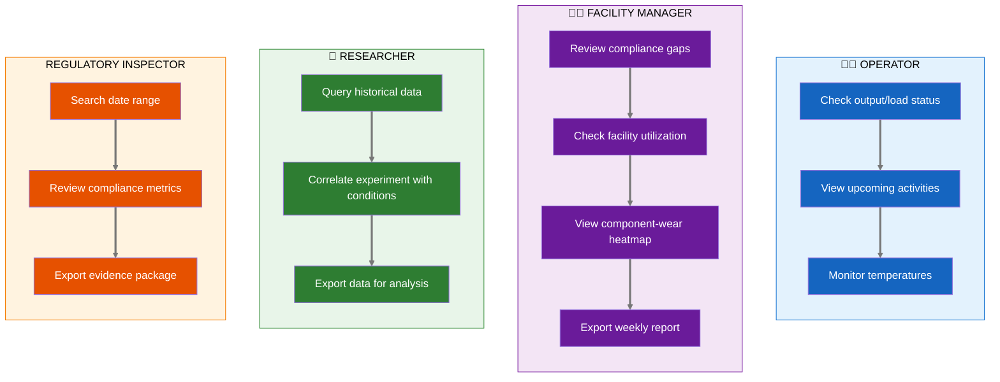
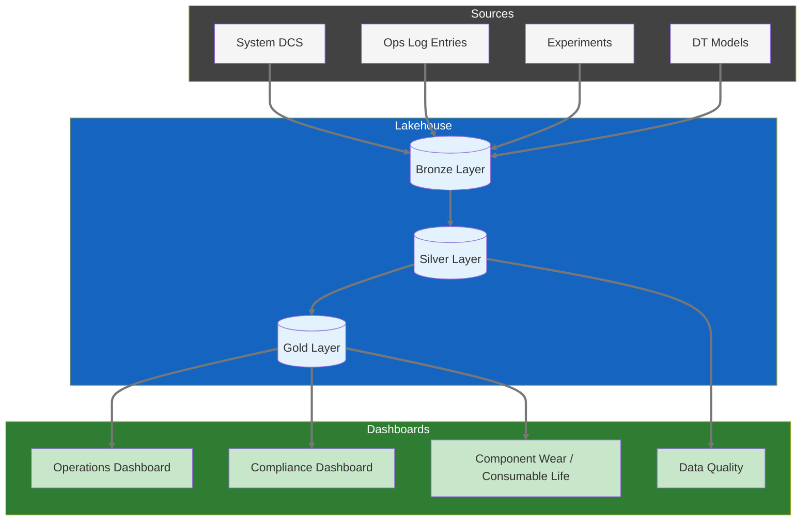
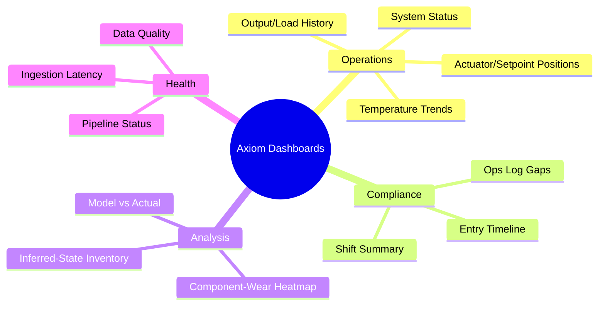

# Product Requirements Document: Analytics Dashboards

> **Implementation Status: 🔲 Not Started** — This PRD describes planned functionality. Implementation has not started.

**Module:** Superset Analytics Dashboards
**Status:** Draft
**Last Updated:** January 21, 2026
**Stakeholder Input:** Facility Manager, Facility Engineer (Jan 2026)  
**Parent:** [Executive PRD](prd-executive.md)

> **Domain note.** Analytics Dashboards are a domain-agnostic Axiom
> capability. The examples and mockups below are drawn from a single
> illustrative facility domain — a nuclear reactor — but the same dashboard
> patterns apply to any monitored system: a wind-turbine fleet, a jet/gas-
> turbine engine test stand, a chemical-process plant, a power-grid
> substation, a building-HVAC plant, a manufacturing line, or a hydro dam.
> Each domain ships its own metrics, panels, and vocabulary as an extension;
> the dashboard substrate is shared.

---

## Executive Summary

Analytics Dashboards provide visual insights into system operations, experiment/activity tracking, component-life/consumable performance, and system health. Built on Apache Superset, dashboards enable both real-time monitoring (for operations staff) and historical analysis (for researchers and management). The goal is to transform raw system data into actionable information.

---

## User Journey Map

### Dashboard User Journeys by Role



### Data Flow to Dashboards



### Dashboard Hierarchy



---

## Stakeholder Insights

> Stakeholder quotes below come from an illustrative facility-domain pilot
> (a nuclear reactor) and are attributed to operational roles, not
> individuals. The same insights generalize to any monitored facility.

### Key Feedback from the Facility Engineer

#### On Live Streaming
> "We'd ideally get live streaming, but currently we just upload the data after-hours due to cost."

**Design Implication:** Dashboard architecture is streaming-first with batch fallbacks. Real-time is the default; batch processing handles historical aggregations and disaster recovery. See [ADR 007](adr-007-streaming-first-architecture.md).

#### On Security Concerns
> "The public should generally not know when the system is operating at full output. More specifically, we don't want live updates on the system status available online. A Superset login that is well protected is sufficient."

**Design Implication:** Dashboards require authentication. No public-facing real-time operating status. Day-after data is acceptable for broader access.

#### On Calendar vs. Reality
> "The calendar is used to schedule time. It is not a reflection of what actually happened."

**Design Implication:** Dashboard should show actual system data, not scheduled data. Calendar integration is low priority.

#### On Inferred-State Tracking
> "This quantity cannot be measured directly, but can be correlated with another observed signal." (In the reactor example, xenon inventory is inferred from critical rod heights; an HVAC plant might infer fouling from pressure-drop trends.)

**Design Implication:** Inferred-state dashboards should use calculated values, not direct measurement. Show correlation methodology.

#### On Component-Wear / Consumable Life
> "This [component-wear heatmap] would be great. Ultimately, a product of the model would be wear/consumption values for individual components. I could see a time series being displayed." (In the reactor example, this is per-element fuel burnup.)

**Design Implication:** Component-wear heatmap is high-value. Requires model integration for per-component calculations.

### Key Feedback from the Facility Manager

#### On Operational Insights
> "We can ascertain a baseline consumption/wear amount when starting up from a long period of shutdown. During operation, those amounts can be tracked as well."

**Design Implication:** Wear/consumption tracking should show both baseline (post-shutdown) and operational (during run) values.

#### On Log Entry Counts
> "I am not sure what insight could be achieved by counting the number of log entries. We could however add a 'watch type' to all entries and then gather what operations we normally perform at what hour."

**Design Implication:** Simple entry counts are not useful. But tagging entries by type (watch type, category) enables meaningful analysis—e.g., "What operations happen at 2 AM vs 2 PM?"

#### On Compliance Gaps
> "A gap would mean that this :30 minute check was not performed when operating."

**Design Implication:** Gaps in mandatory checks should be visually prominent—this is a compliance indicator.

#### On Export Requirements
> "Export to PDF would work, but a simple text file for archive and future proof would also work."

**Design Implication:** Support multiple export formats. Plain text for archival longevity.

---

## Dashboard Inventory

Based on stakeholder feedback, prioritized:

### Priority 1: Operations Dashboards

| Dashboard | Primary Users | Key Insight | Stakeholder Quote |
|-----------|---------------|-------------|-------------------|
| **System Operations Overview** | Operators, FM | Real-time (or near-real-time) system status | Engineer: "We'd ideally get live streaming" |
| **Operations Log Compliance** | FM, Regulator | Gaps in mandatory checks | Manager: "A gap would mean... check was not performed" |
| **Shift Summary** | Lead Operator, FM | Entries by watch/shift, handover report | Manager: "add a 'watch type' to all entries" |

### Priority 2: Analysis Dashboards

| Dashboard | Primary Users | Key Insight | Stakeholder Quote |
|-----------|---------------|-------------|-------------------|
| **Component-Wear Heatmap** | FM, Analysts | Per-component wear/consumption visualization (e.g., per-element fuel burnup in a reactor) | Engineer: "This would be great" |
| **Inferred-State Inventory** | Operators, Analysts | Tracking an unmeasurable quantity via a correlated signal (e.g., Xe-135 via rod-height correlation) | Engineer: "cannot be measured directly, but can be correlated" |
| **Output/Load History** | Researchers | Historical output/load levels, trends | Standard operational need |

### Priority 3: Activity / Experiment Dashboards

| Dashboard | Primary Users | Key Insight | Stakeholder Quote |
|-----------|---------------|-------------|-------------------|
| **Activity Tracking** | Researchers, PIs | Item/sample status, resource-time usage | Research Lead: correlate with system conditions |
| **Facility Usage** | FM, PIs | Which facilities are most used | Operational planning |

### Priority 4: Digital Twin Dashboards

| Dashboard | Primary Users | Key Insight | Stakeholder Quote |
|-----------|---------------|-------------|-------------------|
| **Model vs. Measurement** | Analysts | Validation of DT predictions | Foundational DT metric |
| **Model Performance** | Developers | Execution times, convergence | Technical health |

---

## Dashboard Specifications

### 1. System Operations Overview

**Purpose:** Real-time (or near-real-time) view of system status for console monitoring.

**Security Note:** Requires authentication. Not public-facing per the Facility Engineer's security concern.

**Panels:** (panel names below use reactor terms as the illustrative domain; an extension maps them to its own signals)
- **Current Output/Load Level** (big number with trend sparkline) — e.g., reactor power, turbine MW, plant throughput
- **Actuator/Setpoint Positions** (bar chart or schematic) — e.g., control-rod positions, valve positions, damper positions
- **Primary Temperature** (gauge with alarm thresholds) — e.g., reactor pool temperature, bearing temperature, supply-air temperature
- **Primary Flow Rate** (if measured) — e.g., coolant flow, feedwater flow, airflow
- **Status Indicator** (Shutdown / Startup / Operating / Trip) — e.g., a reactor "scram" is one kind of trip
- **Time Since Last Ops Log Entry** (compliance indicator)

**Data Refresh & Freshness:**

> **Design Decision:** Streaming-first with batch fallbacks. See [ADR 007](adr-007-streaming-first-architecture.md)

| Data Type | Target Latency | Implementation |
|-----------|---------------|----------------|
| Ops Log entries | <500ms | WebSocket push |
| 30-min rule timer | <100ms | Real-time sync |
| System status | <2s | Event-driven update |
| Historical aggregations | Minutes | Batch job (Dagster) |

**Freshness Indicator:** Live is the default — users assume data is current. Warnings appear only when streaming is degraded:
- 🟢 **Live** — default state, no indicator needed
- ⚠️ **Degraded** — streaming delayed, showing last known values
- 🔴 **Stale** — connection lost or >5 min behind

**Mockup:**
```
┌────────────────────────────────────────────────────────────────┐
│  SYSTEM OPERATIONS OVERVIEW   (reactor shown as example domain) │
│  🟡 Last Updated: 5 min ago              [⟳ Refresh] [Settings]│
├────────────────────────────────────────────────────────────────┤
│                                                                │
│  ┌──────────────┐  ┌──────────────┐  ┌──────────────┐         │
│  │   OUTPUT     │  │   STATUS     │  │  TEMP        │         │
│  │   950 kW     │  │  OPERATING   │  │   85°F       │         │
│  │   ▲ +50kW    │  │   ● ● ● ●    │  │   ───────    │         │
│  └──────────────┘  └──────────────┘  └──────────────┘         │
│                                                                │
│  ┌────────────────────────────────────────────────────────┐   │
│  │  ACTUATOR/SETPOINT POSITIONS                           │   │
│  │  ████████░░ A: 72%  ████████░░ B: 68%  ████░░░░░ C: 41%│   │
│  └────────────────────────────────────────────────────────┘   │
│                                                                │
│  ┌────────────────────────────────────────────────────────┐   │
│  │  OUTPUT/LOAD HISTORY (Last 24h)                         │   │
│  │  1000 ─┬─────────────────────────────────────────────  │   │
│  │        │                     ████████████████████████  │   │
│  │   500 ─┼───────────█████████                           │   │
│  │        │    ███████                                     │   │
│  │     0 ─┴─────────────────────────────────────────────  │   │
│  │        00:00        06:00        12:00        18:00     │   │
│  └────────────────────────────────────────────────────────┘   │
│                                                                │
└────────────────────────────────────────────────────────────────┘
```

---

### 2. Operations Log Compliance

**Purpose:** Ensure mandatory 30-minute checks are being performed; surface gaps for RM review.

**Panels:**
- **Gap Indicator** (big red/green: "X gaps this shift")
- **Timeline of Entries** (dots on timeline, gaps highlighted)
- **Entries by Type** (pie chart)
- **Entries by Operator** (bar chart)
- **Entries by Watch Type** (per the Facility Manager's suggestion)

**Key Metric:** 
- Gap = Operating period > 30 min without CONSOLE_CHECK entry

**Mockup:**
```
┌────────────────────────────────────────────────────────────────┐
│  OPS LOG COMPLIANCE DASHBOARD                [Shift: Day]      │
├────────────────────────────────────────────────────────────────┤
│                                                                │
│  ┌──────────────┐  ┌──────────────────────────────────────┐   │
│  │   GAPS       │  │  ENTRY TIMELINE (Today)              │   │
│  │              │  │                                      │   │
│  │    0  ✓      │  │  ●───●───●───●───●───●───●───●───●  │   │
│  │              │  │  08  09  10  11  12  13  14  15  16  │   │
│  │  This Shift  │  │                                      │   │
│  └──────────────┘  └──────────────────────────────────────┘   │
│                                                                │
│  ┌──────────────────────┐  ┌─────────────────────────────┐    │
│  │  ENTRIES BY TYPE     │  │  ENTRIES BY OPERATOR        │    │
│  │                      │  │                             │    │
│  │  Console Check: 12   │  │  Operator A: 8              │    │
│  │  Activity: 3         │  │  Operator B: 4              │    │
│  │  General Note: 2     │  │  Operator C: 5              │    │
│  │  Maintenance: 1      │  │                             │    │
│  └──────────────────────┘  └─────────────────────────────┘    │
│                                                                │
│  ┌────────────────────────────────────────────────────────┐   │
│  │  ⚠️ GAPS IN LAST 30 DAYS                               │   │
│  │                                                        │   │
│  │  2026-01-15 14:30-15:15 (45 min gap) - Shift: Night   │   │
│  │  2026-01-08 02:00-02:45 (45 min gap) - Shift: Night   │   │
│  └────────────────────────────────────────────────────────┘   │
│                                                                │
└────────────────────────────────────────────────────────────────┘
```

---

### 3. Component-Wear Heatmap

**Purpose:** Visualize per-component wear/consumption for operational planning and regulatory reporting. (In the reactor example domain, this is per-element fuel burnup; in a wind-turbine fleet it might be per-blade fatigue, in an HVAC plant per-filter loading.)

**Data Source:** Model output (not direct measurement). Per the Facility Engineer: "a product of the model would be wear/consumption values for individual components."

**Panels:**
- **Layout Heatmap** (top-down view, colored by wear/consumption — e.g., a reactor core map)
- **Wear by Component** (sortable table)
- **Wear Trend** (time series for selected component)
- **Baseline vs Current** (per the Facility Manager: "baseline amount when starting up from a long period of shutdown")

**Mockup:**
```
┌────────────────────────────────────────────────────────────────┐
│  COMPONENT-WEAR VISUALIZATION  (reactor burnup as example domain) │
├────────────────────────────────────────────────────────────────┤
│                                                                │
│  ┌──────────────────────────────┐  ┌────────────────────────┐ │
│  │  LAYOUT MAP (Top-Down)       │  │  WEAR LEGEND           │ │
│  │                              │  │                        │ │
│  │      ░░░███░░░               │  │  ████ High (>50 units) │ │
│  │    ░░████████░░              │  │  ▓▓▓▓ Med  (25-50)     │ │
│  │   ░███▓▓▓▓▓▓███░             │  │  ░░░░ Low  (<25 units) │ │
│  │   ░██▓▓▓▓▓▓▓▓██░             │  │                        │ │
│  │   ░███▓▓▓▓▓▓███░             │  │  Click component for   │ │
│  │    ░░████████░░              │  │  detail view           │ │
│  │      ░░░███░░░               │  │                        │ │
│  │                              │  │                        │ │
│  └──────────────────────────────┘  └────────────────────────┘ │
│                                                                │
│  ┌────────────────────────────────────────────────────────┐   │
│  │  WEAR HISTORY (Selected: Component B-4)                │   │
│  │                                                        │   │
│  │  60 ─────┬─────────────────────────────────────█████  │   │
│  │          │                              ███████       │   │
│  │  30 ─────┼────────────────███████████████            │   │
│  │          │   ██████████████                           │   │
│  │   0 ─────┴─────────────────────────────────────────   │   │
│  │          2022        2023        2024        2025     │   │
│  └────────────────────────────────────────────────────────┘   │
│                                                                │
└────────────────────────────────────────────────────────────────┘
```

---

### 4. Inferred-State Inventory

**Purpose:** Track an unmeasurable state variable for operational planning. (In the reactor example domain, this is Xe-135 buildup/decay used to time startups and power maneuvers; an HVAC plant might track inferred coil fouling.)

**Data Source:** Inferred from a correlated observed signal, per the Facility Engineer: "cannot be measured directly, but can be correlated." (In the reactor example, Xe-135 is correlated with critical rod heights.)

**Panels:**
- **Estimated Inferred-State Inventory** (time series) — e.g., Xe-135 inventory
- **Correlation Plot** (scatter plot showing relationship to the observed signal) — e.g., vs. critical rod height
- **Methodology Note** (explain inference approach)

**Important Caveat:** Display prominently that this is *inferred* data, not direct measurement.

---

### 5. Shift Summary / Handover Report

**Purpose:** Generate end-of-shift summary for handover to incoming crew.

**Content:**
- Output/load level changes during shift
- All Ops Log entries (with supplements)
- Activities/experiments conducted
- Equipment issues noted
- Pending items for next shift

**Export:** PDF and plain text per the Facility Manager's requirement.

---

## Security Requirements

From the Facility Engineer:
> "The public should generally not know when the system is operating at full output."

### Access Tiers

| Tier | Access Level | Example Users |
|------|--------------|---------------|
| **Public** | None (no public dashboards) | N/A |
| **Delayed** | Data from >24 hours ago | External researchers (future) |
| **Real-time** | Current data | Operators, FM, Safety staff |
| **Admin** | Full access + configuration | System administrators |

### Implementation

- All dashboards behind Superset authentication
- No embedding of live dashboards in public websites
- Day-after exports acceptable for external sharing

---

## Data Refresh Patterns

| Pattern | Latency | Use Case |
|---------|---------|----------|
| **Nightly Batch** | ~12 hours | Current implementation; sufficient for historical analysis |
| **Near-Real-Time** | ~5 min | Future; needed for operations dashboard |
| **Real-Time** | <1 min | Future; needed for console monitoring |

**Facility Engineer's note:** "We'd ideally get live streaming, but currently we just upload the data after-hours due to cost."

**Design Decision:** Streaming-first architecture. Real-time is the default; batch for historical aggregations and fallback. See [ADR 007](adr-007-streaming-first-architecture.md).

---

## Export Requirements

Per the Facility Manager: "Export to PDF would work, but a simple text file for archive and future proof would also work."

### Supported Formats

| Format | Notes |
|--------|-------|
| **PDF** | Charts rendered as images; professional formatting |
| **PNG/SVG** | Individual chart export |
| **CSV** | Underlying data for any chart |
| **Plain Text** | For compliance reports and archival |

---

## Integration Points

### From System Ops Log
- Entry counts by type/time
- Gap detection alerts
- Watch-type tagging

### From Experiment Manager
- Sample status aggregations
- Facility utilization

### From Time-Series (Iceberg)
- Output/load levels, temperatures, actuator/setpoint positions
- Historical queries for trends

### From Models
- Component-wear / consumption calculations (e.g., fuel burnup)
- Inferred-state values (e.g., xenon inventory)
- Model vs measurement comparisons

---

## MVP Scope (Phase 1)

### In Scope
- System Operations Overview (with nightly batch data)
- Operations Log Compliance (gap detection)
- Output/Load History (simple time-series charts)
- Basic authentication

### Out of Scope (Future)
- Real-time streaming
- Component-Wear Heatmap (requires model integration)
- Inferred-State Inventory (requires model)
- External/delayed access tier

---

## Open Questions

1. **Real-time priority:** How important is real-time vs cost savings of nightly batch?

2. **Historical depth:** How far back should dashboards query? (2 years per the regulator, or full history?)

3. **Alert routing:** Should compliance gaps trigger email/SMS to the Facility Manager?

4. **Model integration:** What's the timeline for wear/consumption model output integration (e.g., fuel-burnup output)?

5. **Watch types:** What are the standard watch types to tag entries with?

---

## Success Metrics

| Metric | Target | Measurement |
|--------|--------|-------------|
| Dashboard adoption | 80% of operators check daily | Login analytics |
| Gap detection accuracy | 100% of gaps surfaced | Audit comparison to paper logs |
| Export usage | Regulatory inspection prep uses exports | Staff survey |
| Insight generation | Facility Manager identifies 1+ operational improvement per quarter | Qualitative feedback |

---

## Appendix: Stakeholder Quotes Reference

> Quotes are from an illustrative facility-domain pilot (a nuclear reactor),
> attributed to operational roles rather than individuals.

**Facility Engineer:**
- "We'd ideally get live streaming, but currently we just upload the data after-hours due to cost."
- "The public should generally not know when the system is operating at full output."
- "The calendar is used to schedule time. It is not a reflection of what actually happened."
- "[The inferred quantity] cannot be measured directly, but can be correlated with another observed signal." (Reactor example: xenon vs. critical rod heights.)
- "[Component-wear heatmap] would be great." (Reactor example: per-element fuel burnup.)

**Facility Manager:**
- "We can ascertain a baseline consumption/wear amount when starting up from a long period of shutdown."
- "I am not sure what insight could be achieved by counting the number of log entries."
- "Add a 'watch type' to all entries and then gather what operations we normally perform at what hour."
- "A gap would mean that this :30 minute check was not performed when operating."
- "Export to PDF would work, but a simple text file for archive and future proof would also work."

---

*Document Status: Ready for technical review and Superset implementation planning*
_Copyright (c) 2026 The University of Texas at Austin and B-Tree Labs. Apache-2.0 licensed._
