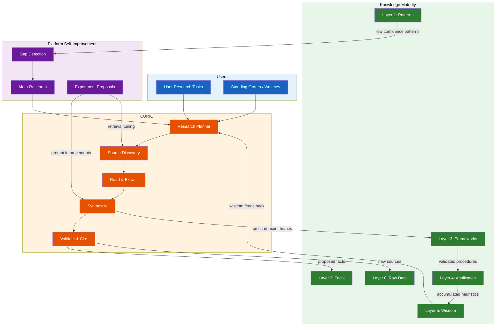

# CURIO: Autonomous Research Agent

**Product / Feature:** CURIO — Continuous, Unsupervised Research & Intelligence Orchestration

**Owner:** Ben Booth  •  **Status:** Draft  •  **Last updated:** 2026-04-13

**Related:** [Agent Platform PRD](prd-agents.md), [RAG PRD](prd-rag.md), [Knowledge Maturity Spec](../tech-specs/spec-rag-knowledge-maturity.md), [Design Loop Spec](../tech-specs/spec-design-loop-architecture.md), [OKRs 2026](prd-okrs-2026.md)

---

## 1) Elevator Pitch

CURIO is an always-on research agent that autonomously discovers, reads, synthesizes, and validates knowledge — for users who need answers and for the platform that needs to keep getting smarter. It is Axiom's compound knowledge engine: every research cycle improves the corpus, every improved corpus makes the next cycle better.

### CURIO's REPL Role

**CURIO is the Eval agent in Axiom's REPL cycle** — the intelligence that judges truth, researches the unknown, and keeps the knowledge corpus growing. While AXI (the Loop agent) drives the conversation and PRESS (the Print agent) publishes results, CURIO is the engine that evaluates whether the platform actually *knows* enough to answer well, and goes hunting when it doesn't.

### Why "CURIO"?

In AXI, the robots aboard the Axiom have forgotten curiosity. Named for the spirit of curiosity that drives AXI in the film — but in Axiom's agent roster, AXI is the Loop/chat protagonist while CURIO is the Eval/research engine. **CURIO** (Curiosity-driven Research & Intelligence Orchestrator) embodies that trait: an agent whose job is to never stop being curious, to keep collecting, examining, and connecting knowledge so that the humans it serves don't have to start every inquiry from scratch.

The name also evokes *curio* — a rare, interesting, carefully collected object. CURIO collects knowledge curios and arranges them into something useful.

---

## 2) Problem / Opportunity

### The Research Problem in Regulated Domains

- **Knowledge is scattered.** A graduate researcher answering "what's the latest on this materials-degradation question?" must search a regulator's document archive, journal databases, conference proceedings, internal reports, and faculty notes — across different access tiers — before they can even start synthesizing.
- **Literature review is the bottleneck.** Researchers spend 30-50% of project time on literature review that is largely mechanical: find sources, assess relevance, extract claims, cross-reference, organize. This is exactly what LLMs with tools can do well.
- **Institutional knowledge decays.** When a senior researcher retires, their mental model of "which regulatory guides matter for this type of analysis" walks out the door. There's no mechanism to continuously capture and validate that knowledge.
- **Regulatory landscapes shift.** A typical sector regulator issues hundreds of guidance documents per year; standards bodies and international agencies publish continuously and update codes. No human can track all of it. Facilities learn about relevant changes reactively, often during audits.
- **The platform itself doesn't learn.** Today, Axiom's RAG corpus is static — manually curated domain packs. The knowledge maturity pipeline (Layers 0-2) captures *usage* patterns, but nothing actively goes out and *finds* new knowledge. Layers 3-5 (Frameworks, Application, Wisdom) are planned but have no supply mechanism.

### The Opportunity

A well-built auto-research agent transforms Axiom from a **knowledge retrieval** platform into a **knowledge generation** platform. This is the differentiator: other agentic platforms help you *use* what you already know. Axiom helps you *discover* what you don't yet know, validates it against what you do, and makes it available to everyone who needs it — within the appropriate access tier.

**For the platform:** CURIO is the supply-side engine for Layers 3-5 of the knowledge maturity pipeline. It generates the cross-domain frameworks, validated procedures, and accumulated heuristics that make the RAG corpus genuinely wise over time.

**For users:** CURIO is a tireless research assistant that works overnight, follows up on tangents the user didn't have time for, and presents findings in a structured, citation-rich format that's ready to drop into a thesis, report, or regulatory submission.

**For extension builders:** CURIO provides a research *framework* — the orchestration loop, tool protocol, synthesis pipeline, and quality gates — that domain-specific extensions can customize with their own source connectors, validation rules, and output formats.

---

## 3) Goals & Success Metrics

### Primary Goal
Deliver an autonomous, extensible research agent that continuously improves both user knowledge and platform knowledge, operating within Axiom's tier/scope security model.

### Success Metrics

| Metric | Target (6mo) | Target (12mo) |
|--------|--------------|---------------|
| Research tasks completed without human intervention | ≥60% | ≥80% |
| User-rated research quality (1-5) | ≥3.5 | ≥4.0 |
| New knowledge facts generated per week (auto-proposed) | ≥10 | ≥50 |
| Knowledge facts approved by humans (of proposed) | ≥40% | ≥60% |
| Corpus gap coverage (known gaps with CURIO findings) | ≥30% | ≥70% |
| Research cycle time (task → synthesis delivered) | <4hr | <1hr |
| Extension builder adoption (domains using CURIO) | 2 | 5+ |

---

## 4) Key Users / Personas

### Graduate Student / Early-Career Researcher
**Tasks:** Literature review for thesis, staying current on methods in their field, finding relevant experimental data for validation studies.
**Technical level:** Comfortable with CLI, reads academic papers daily, needs help with breadth not depth.
**CURIO value:** "Start a research task before bed, wake up to a synthesized literature review with full citations."

### Faculty Researcher / PI
**Tasks:** Grant proposal literature review, identifying research gaps, tracking regulatory positions that affect funded work, reviewing student research for completeness.
**Technical level:** Expert domain knowledge, limited time for exhaustive searches.
**CURIO value:** "Ask CURIO if anyone has published on the coupled-physics approach I care about since my last grant, get a structured gap analysis."

### Facility Engineer / Operator
**Tasks:** Finding applicable regulatory guidance for a specific scenario, checking if a proposed procedure change has precedent, staying current on operating-experience reports.
**Technical level:** Deep operational knowledge, needs precise regulatory references, zero tolerance for hallucination.
**CURIO value:** "Track all regulator communications relevant to our fleet — whether that's a wind-farm operator, a chemical-process plant, or a nuclear reactor — and flag anything that changes our procedure interpretation."

### Platform Developer / Extension Builder
**Tasks:** Building domain-specific research capabilities on Axiom, adding new source connectors, customizing synthesis formats.
**Technical level:** Software engineer comfortable with Python, TOML manifests, and Axiom's extension system.
**CURIO value:** "I need CURIO to search our pharma regulatory database with domain-specific relevance scoring — I just write a source connector and a scorer, and CURIO handles the rest."

### Advanced Researcher (Cross-Domain)
**Tasks:** Surveying how techniques from one field (e.g., ML for materials science) might apply to another (e.g., component-degradation prediction), identifying collaboration opportunities.
**Technical level:** Expert in one domain, exploring adjacencies.
**CURIO value:** "Research how federated learning is being applied to sensor-data sharing in my industry — check both ML conferences and domain journals."

---

## 5) Scope — Key Capabilities

### Phase 1: Research Agent Core (MVP)

1. **Research Task Definition** — User describes a research question in natural language; CURIO decomposes it into a research plan (sub-questions, source strategy, validation criteria). User reviews plan before execution begins.
   - *Acceptance:* `axi curio research "question"` produces a structured plan; user can approve/modify/reject.

2. **Source Discovery & Retrieval** — CURIO searches internal RAG corpus, configured external sources (web, arXiv, PubMed, and domain-specific regulator or standards archives), and extension-provided sources. Respects tier/scope boundaries.
   - *Acceptance:* Retrieves from ≥3 source types per research task; never sends restricted/EC content to cloud APIs.

3. **Reading & Extraction** — CURIO reads full documents (not just snippets), extracts claims with page-level citations, identifies methodology, key findings, and limitations.
   - *Acceptance:* Extracted claims include source document, page/section, and a confidence qualifier.

4. **Synthesis & Report Generation** — Produces a structured research report: executive summary, detailed findings by sub-question, citation list, identified gaps, and suggested follow-up questions.
   - *Acceptance:* Report output as Markdown; publishable via PRESS to .docx/OneDrive.

5. **Knowledge Feedback Loop** — Findings that meet promotion policy thresholds are proposed as Layer 2 knowledge facts. CURIO identifies corpus gaps and proposes new domain pack content.
   - *Acceptance:* At least one knowledge fact proposed per completed research task; gap proposals visible in `axi rag review`.

6. **RACI / Human-in-the-Loop** — Research plan approval, fact promotion, and publication all respect RACI settings. User can configure CURIO autonomy per research category.
   - *Acceptance:* Default is "plan requires approval, facts require approval, publication requires approval." Power users can relax to "inform only" for approved categories.

### Phase 2: Continuous & Meta-Research

7. **Standing Research Orders** — Users define persistent research interests (watchlists). CURIO continuously monitors sources and delivers periodic briefings.
   - *Acceptance:* `axi curio watch "topic"` creates a standing order; `axi curio briefing` generates latest update.

8. **Platform Self-Research** — CURIO autonomously identifies knowledge gaps in the RAG corpus (frequently asked questions with low retrieval confidence), researches answers, and proposes corpus additions.
   - *Acceptance:* Weekly self-research cycle produces ≥3 gap-filling proposals.

9. **Cross-Domain Synthesis** — Given findings from multiple research tasks, CURIO identifies patterns, contradictions, and emerging themes across domains.
   - *Acceptance:* Monthly cross-domain synthesis report; themes surfaced as Layer 3 Framework candidates.

10. **Extension-Defined Research Strategies** — Domain extensions can register custom source connectors, relevance scorers, validation rules, and output templates.
    - *Acceptance:* Extension manifest declares `[[research_sources]]` and `[[research_validators]]`; CURIO discovers and uses them.

### Phase 3: Wisdom Engine

11. **Meta-Research for Platform Improvement** — CURIO researches how to improve Axiom itself: better prompts, better retrieval strategies, better extraction methods. Proposes experiments.
    - *Acceptance:* Quarterly "platform improvement research" cycle with proposed A/B experiments.

12. **Federated Research** — CURIO instances at different facilities share anonymized research patterns (not content) via the federation protocol, enabling community-wide gap detection.
    - *Acceptance:* Federation sync includes research pattern metadata; community gaps surfaced.

---

## 6) Non-Functional / Constraints

### Security
- **Tier/scope enforcement is non-negotiable.** CURIO must never send restricted or export-controlled content to cloud APIs, even during research synthesis. Research across tier boundaries produces separate sub-reports per tier.
- **Source provenance is immutable.** Every claim traces back to a source document with full citation. No "CURIO said" without "because [source] said."
- **Research tasks are audit-logged.** Every query to every source, every synthesis step, every proposed fact — logged in the interaction log with full provenance.

### Performance
- Simple research tasks (single-source, narrow question): <15 minutes
- Complex research tasks (multi-source, broad question): <4 hours
- Standing order checks: <5 minutes per source per check cycle
- Research should not block other agent operations (runs as background task)

### Reliability
- Graceful degradation when sources are unavailable (skip, note, retry later)
- Idempotent research tasks (re-running produces consistent findings)
- Research state persisted so tasks survive process restarts

### Extensibility
- Source connectors: pluggable via extension manifest
- Relevance scorers: domain-specific scoring functions registered as extensions
- Output templates: customizable report formats per domain/persona
- Validation rules: domain-specific claim validation (e.g., "any material-property claim must cite an authoritative evaluated database for that field")

---

## 7) Timeline (High Level)

| Phase | Scope | Target |
|-------|-------|--------|
| 0.1 — Research Core | Task definition, internal RAG search, basic synthesis, knowledge feedback | Q3 2026 |
| 0.2 — External Sources | Web search, arXiv, domain-specific connectors, standing orders | Q4 2026 |
| 0.3 — Continuous & Meta | Platform self-research, cross-domain synthesis, extension research strategies | Q1 2027 |
| 1.0 — GA | Wisdom engine, federated research patterns, full extension API | Q2 2027 |

---

## 8) Risks & Open Questions

### Risks

| Risk | Impact | Mitigation |
|------|--------|------------|
| Hallucinated citations | Users trust false sources | Mandatory source verification step: CURIO must re-retrieve and confirm every citation before including it in a report |
| EC content leakage during research | Regulatory violation | Research planner tags each sub-task with required tier; gateway enforces routing; TRIAGE scans research outputs |
| Research quality too low for expert users | Low adoption | Phase 1 requires human plan approval; quality metrics drive prompt/strategy iteration |
| LLM cost for long research tasks | Budget overruns | Token budgets per research task (configurable); prefer local models for extraction, cloud for synthesis |
| Source connector maintenance burden | Broken integrations | Source health monitored by TIDY; degraded sources flagged, not silently dropped |

### Open Questions

1. **What's the right default autonomy level?** Plan-approve-report, or fully hands-off for low-stakes research? (Decide by spec review)
2. **Should standing orders be per-user or per-facility?** Facility-level watches could reduce duplicate work but need RACI for who reviews findings. (Decide by Phase 0.2)
3. **How do we handle paywalled sources?** Institutional subscriptions via connections framework? Or limit to open-access? (Decide by Phase 0.2)
4. **What's the right cadence for platform self-research?** Weekly? On-demand? Triggered by retrieval confidence drops? (Decide by Phase 0.3)
5. **How does CURIO interact with the planned Coach agent?** Coach delivers training; CURIO provides the research that informs training content. Clear boundary needed. (Decide by Phase 0.3)

---

## 9) Acceptance & Rollout

- **Phase 0.1 sign-off:** Ben Booth (product), first 2 graduate student testers
- **Rollout plan:**
  - Phase 0.1: Internal dogfooding (UT NE group)
  - Phase 0.2: Beta with 2-3 external research groups
  - Phase 0.3: Available to all Axiom deployments
  - GA: Extension API stable, documented, with reference implementations
- **Rollback criteria:** Research quality score <3.0 average over 1 week, or any EC content leakage incident

---

## 10) Contacts & Links

- **Product lead:** Ben Booth (no-reply@axiom-os.ai)
- **Spec:** [spec-auto-research.md](../tech-specs/spec-auto-research.md)
- **Agent PRD:** [prd-agents.md](prd-agents.md)
- **Knowledge Maturity Spec:** [spec-rag-knowledge-maturity.md](../tech-specs/spec-rag-knowledge-maturity.md)

---

## Appendix A: How Extension Builders Customize CURIO

CURIO's research framework is domain-agnostic; each domain ships its own
source connectors and validators as an extension. The three examples below
are illustrative — a regulated engineering domain, a life-sciences domain,
and an energy-grid domain — and show the same manifest shape applied to
different fields. (Other domains follow identically: a wind-turbine fleet
operator, a chemical-process plant, a building-HVAC vendor, a manufacturing
line, a hydro-dam operator, and so on.)

### Example: Regulated Engineering Domain (e.g., a nuclear reactor)

```toml
# axiom-extension.toml for a regulated-engineering research extension
# (this example uses nuclear, but the same shape fits any regulated field)
[extension]
name = "nuclear-research"
kind = "tool"
description = "Nuclear-domain research sources and validators for CURIO — one illustrative domain pack"

[[research_sources]]
id = "nrc_adams"
name = "NRC ADAMS"
type = "http"
base_url = "https://adams.nrc.gov/wba/"
tier = "public"
extractors = ["pdf", "html"]
description = "NRC's document management system — regulatory guides, NUREGs, generic communications"

[[research_sources]]
id = "iaea_inis"
name = "IAEA INIS"
type = "http"
base_url = "https://inis.iaea.org/"
tier = "public"
extractors = ["pdf"]
description = "International Nuclear Information System — global nuclear literature"

[[research_validators]]
id = "nuclear_cross_section"
description = "Cross-section claims must cite evaluated nuclear data libraries"
pattern = "cross.?section|sigma|barn"
required_sources = ["ENDF/B", "JEFF", "JENDL", "TENDL", "CENDL"]

[[research_validators]]
id = "regulatory_currency"
description = "Regulatory guidance citations must reference the current revision"
type = "revision_check"
registry = "nrc_reg_guide_versions"  # maintained in domain pack
```

### Example: Life-Sciences Domain (Pharmaceutical)

```toml
[[research_sources]]
id = "pubmed"
name = "PubMed / MEDLINE"
type = "http"
tier = "public"
extractors = ["xml_pubmed"]

[[research_sources]]
id = "fda_guidance"
name = "FDA Guidance Documents"
type = "web_scraper"
tier = "public"
extractors = ["pdf"]

[[research_validators]]
id = "clinical_trial_registration"
description = "Clinical efficacy claims must reference a registered trial"
pattern = "efficacy|clinical.?trial|phase.?[I-IV]"
required_sources = ["NCT\\d+", "ISRCTN\\d+"]
```

### Example: Energy-Grid Domain (Grid Operations)

```toml
[[research_sources]]
id = "ferc_orders"
name = "FERC Orders & Rulemakings"
type = "http"
tier = "public"

[[research_sources]]
id = "nerc_standards"
name = "NERC Reliability Standards"
type = "web_scraper"
tier = "public"

[[research_validators]]
id = "standard_applicability"
description = "Reliability standard citations must include applicability region"
type = "metadata_check"
required_fields = ["region", "effective_date"]
```

---

## Appendix B: CURIO as the Meta-Learning Engine

### The Flywheel



### How the Flywheel Compounds

1. **Day 1:** CURIO can only search the existing RAG corpus and configured external sources. Research quality depends on corpus quality.
2. **Month 1:** Research tasks have generated dozens of proposed knowledge facts. Human-approved facts enter Layer 2. CURIO's own research finds corpus gaps; proposed additions fill them.
3. **Month 6:** Standing orders have tracked regulatory changes across 3 domains. Cross-domain synthesis has identified 5 Layer 3 frameworks. The corpus is meaningfully richer than Day 1.
4. **Year 1:** Platform self-research has proposed and validated retrieval improvements. Federated research patterns from 3 facilities reveal community-wide knowledge gaps. The corpus is becoming genuinely *wise* — not just storing documents, but understanding relationships between them.
5. **Year 2+:** CURIO instances across facilities contribute to a shared understanding of what questions matter, what knowledge is trustworthy, and what gaps remain. The community corpus is no longer manually curated — it's organically grown, rigorously validated, and continuously refreshed.

### Why This Separates Axiom from Other Platforms

| Other Agentic Platforms | Axiom with CURIO |
|------------------------|-------------------|
| Static knowledge base | Self-improving knowledge flywheel |
| User asks → system answers | System anticipates → user confirms |
| Research is a user task | Research is a platform capability |
| Knowledge quality degrades over time | Knowledge quality compounds over time |
| Each user starts from scratch | Each user benefits from all prior research |
| No domain customization | Extension-defined sources, validators, output formats |
| No security model for research | Tier/scope enforcement at every step |
| No institutional memory | Federated research patterns across facilities |
_Copyright (c) 2026 The University of Texas at Austin and B-Tree Labs. Apache-2.0 licensed._
