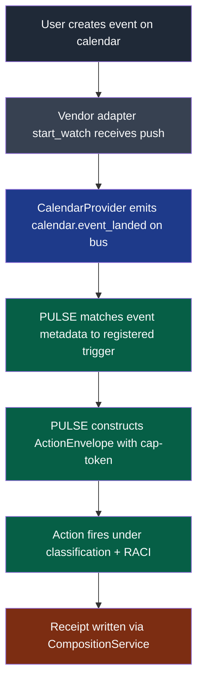
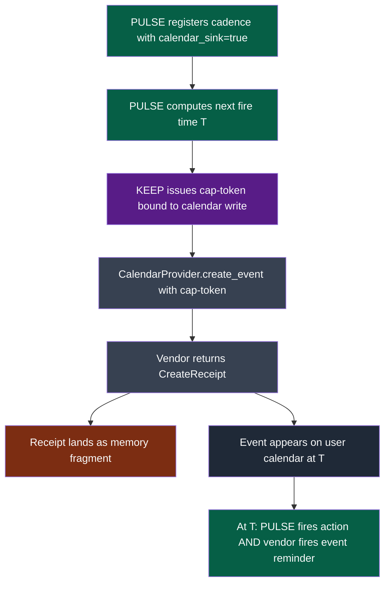
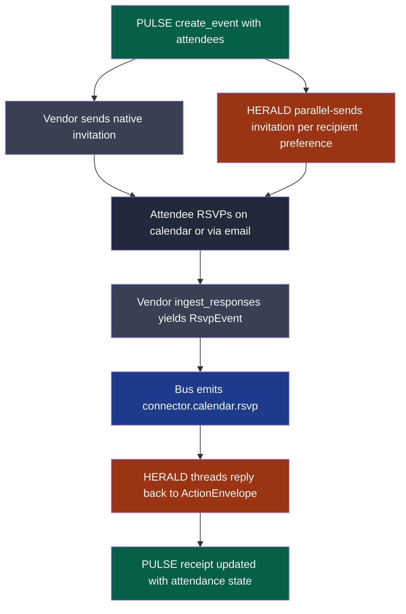

# PRD: Calendar Protocol — PULSE-Owned Bidirectional Calendar Surface

**Status:** Draft (2026-06-01)
**Owner:** Benjamin Booth
**Last updated:** 2026-06-01
**Primitive class:** AEOS built-in extension capability (`axiom.extensions.builtins.schedule`)
**Agent:** PULSE (Orchestrator)
**Related ADRs:** [ADR-059](../adrs/adr-059-connector-first-vendor-unification.md) (connector-first vendor unification), [ADR-062](../adrs/adr-062-box-first-class-storage-connector.md) (Protocol-shaped vendor surface precedent), ADR-057 (connector primitive), ADR-055 (governance fabric)
**Companion PRD:** [prd-axiom-schedule.md](prd-axiom-schedule.md) (PULSE app-level scheduler)
**Tracking:** axiom-os#51 (retitled by this PRD)

---

## 1. Context

The 2026-06-01 competitive-parity refresh promoted Calendars from a connector-family bullet ("Google Calendar, Outlook" under §Connectors) to a P1 new gap. Peer harnesses treat calendars as one-way notification sinks at best; none thread calendar events back into a scheduled-action substrate with provenance and cap-token-bound firing.

PULSE already owns time-anchored composition. PULSE fires action envelopes on cadences, retries with idempotency, graduates novel actions through RACI, and writes every firing as a receipt fragment. A calendar event is the same shape: a future action with a time anchor, an invited set of principals, and a desired side-effect (a meeting, a reminder, an SLA deadline). The two domains are not adjacent. They are the same domain wearing two interfaces.

This PRD proposes a `CalendarProvider` Protocol that lives inside the Scheduler/PULSE extension and treats calendar surfaces as a bidirectional channel into PULSE's existing cadence machinery. One Protocol, three vendor adapters (CalDAV, Google Workspace, Microsoft 365 Graph), and a published differentiator: every PULSE-scheduled action can land back on the user's calendar; every calendar event the user creates can fire a PULSE action.

## 2. Problem

Today Axiom has no calendar surface. Practically, this means:

- Cadences declared in PULSE are invisible to the human's day. A daily compliance window or a 24h SLA timer fires inside the platform and emits a notification through HERALD, but the operator cannot see the upcoming firing on the same surface where they see every other scheduled commitment in their life.
- Calendar events the user creates by hand cannot trigger PULSE actions. There is no way to say "when this meeting starts, run the brief-prep skill" without writing custom glue per vendor.
- No bidirectional provenance. Even if an extension bolted a Google Calendar client into its own tree, the event would not carry the cap-token KEEP issued or land as a memory fragment with the rest of the schedule's receipts.

The naive fix is to add a Google Calendar adapter to whichever consumer extension wants it first, then add Outlook to the next one, then bolt CalDAV on for the self-hosted case. That path produces three parallel implementations of the same vendor surface, none of them shaped like PULSE's existing cadence primitive, and three separate auth flows that the operator has to manage. ADR-059 rules this pattern out at the platform level; ADR-062 demonstrates the alternative shape for storage. Calendars are the next surface that needs the same treatment.

Scattered vendor adapters also miss the differentiator. If each consumer extension owns its own calendar client, none of them carry receipts, none of them bind cap-tokens at event-creation time, and none of them compose with HERALD's invitation routing or KEEP's capability model. The product collapses to the same one-way notification sink peer harnesses already ship.

## 3. Goals

- One `CalendarProvider` Protocol, owned by the Scheduler/PULSE extension, with capability declaration mirroring the ADR-062 storage shape (vendors declare which calendar capabilities they support; unsupported calls are visible in `axi connector status` rather than raised at call time).
- Three reference vendor adapters: CalDAV (PR-2 reference), Google Workspace (PR-3), Microsoft 365 Graph (PR-4 once the OAuth foundation lands).
- Bidirectional composition with PULSE: calendar-as-trigger (an event fires a scheduled action) and calendar-as-sink (PULSE writes its scheduled actions back onto the calendar as events). Both flows ride one provenance model.
- Composition with HERALD: event creation fans out invitation emails through the recipient-preference routing already shipped; RSVP replies land on the bus as `connector.calendar.rsvp` events HERALD can thread back to the originating action envelope.
- Composition with KEEP: every calendar write is bound to a cap-token issued at registration; revoking the cap revokes future event creation under that schedule.
- Every calendar action lands as a memory fragment through `CompositionService`, same as every other PULSE receipt. No side channel.

## 4. Non-Goals

- The Microsoft 365 Graph OAuth foundation itself. M365 Graph is a Tier-A blocker tracked separately; this PRD commits only to the M365 calendar adapter that rides on top of it once the foundation lands.
- A scheduling-assistant UX (suggest-time, find-free-window across attendees). Useful, but a product layer above this Protocol.
- Calendar UI rendering inside `axi`. Calendar reads surface through `axi schedule list` and the existing schedule CLI; building a TUI calendar grid is out of scope.
- Replacing the existing `prd-axiom-schedule.md` Cadence surface. This PRD adds a vendor-backed channel onto that surface; it does not redesign it.

## 5. Decision Summary

The Calendar Protocol lives in `src/axiom/extensions/builtins/schedule/calendar/` (inside the Scheduler/PULSE extension), not under `connector/`. PULSE owns time-anchored composition and cap-token-bound firing; calendars are a vendor-backed view onto exactly that surface. Putting the Protocol next to PULSE keeps the bidirectional binding (event → cadence, cadence → event) inside one ownership boundary.

Vendor adapters are one-per-vendor per ADR-059. Each lives at `schedule/calendar/vendors/<vendor>.py` and conforms to the `CalendarProvider` Protocol.

The `connector/` extension contributes a wizard handler and secret capture for credentials, in the same shape as `_BoxHandler` in ADR-062. Operators run `axi connector add calendar:google` (or `caldav`, or `m365`) and the wizard collects credentials, hands them to PULSE's calendar registry, and PULSE owns everything thereafter. The connector wizard does not own the runtime adapter.

This split keeps ADR-059's invariant ("one adapter per vendor, central wizard, central secrets") while honoring the fact that calendars are PULSE's domain, not connector's.

## 6. Protocol Surface

Shape only. Field-level types pin in the spec, not the PRD.

```python
# axiom.extensions.builtins.schedule.calendar.protocol

class CalendarCapability(Enum):
    LIST_EVENTS    = "list_events"
    CREATE_EVENT   = "create_event"
    UPDATE_EVENT   = "update_event"
    DELETE_EVENT   = "delete_event"
    WATCH          = "watch"
    INGEST_RSVPS   = "ingest_rsvps"

class CalendarProvider(Protocol):
    vendor: str                                            # "caldav" | "google" | "m365"
    capabilities: frozenset[CalendarCapability]            # honest support matrix

    def list_events(self, params: ListParams) -> Iterator[EventRef]: ...
    def create_event(self, spec: EventSpec) -> CreateReceipt: ...
    def update_event(self, ref: EventRef, patch: EventPatch) -> UpdateReceipt: ...
    def delete_event(self, ref: EventRef) -> DeleteReceipt: ...
    def start_watch(self, params: WatchParams) -> WatchHandle: ...
    def ingest_responses(self, params: RsvpParams) -> Iterator[RsvpEvent]: ...
```

Capability semantics match ADR-062: vendors that cannot honor a capability declare its absence in the frozenset. The connector wizard reads the set to render an honest support matrix at `axi connector status`. Callers that need a capability the active vendor lacks get a typed `CapabilityUnsupported` at registration time, not mid-fire.

Every method returns or yields receipt-shaped values that flow into `CompositionService` as memory fragments under PULSE's existing receipt model.

## 7. Vendor Coverage Matrix

| Capability | CalDAV | Google Workspace | Microsoft 365 Graph |
|---|---|---|---|
| `list_events` | yes | yes | yes |
| `create_event` | yes | yes | yes |
| `update_event` | yes | yes | yes |
| `delete_event` | yes | yes | yes |
| `start_watch` | partial (polling fallback) | yes (push channels) | yes (subscriptions) |
| `ingest_responses` | partial (iTIP parsing) | yes (Gmail-side RSVP API) | yes (Graph response endpoint) |

CalDAV ships first as the reference adapter because it has no OAuth surface to negotiate; the Protocol's shape gets pinned against the simplest vendor before the cloud adapters land. Google Workspace follows under its existing OAuth path. M365 Graph waits for the M365 OAuth foundation that ADR-059 calls out as a Tier-A item.

## 8. Composition with PULSE

### 8.1 Calendar-as-Trigger

A user-created calendar event fires a PULSE action.



### 8.2 Calendar-as-Sink

A PULSE cadence writes its next firing as a calendar event so the human sees it on the same surface as their other commitments.



The cadence and the calendar event are two views onto one schedule. Updating the cadence updates the event; deleting the event cancels the cadence (when the user does so deliberately through a confirmed-intent flow rather than an accidental drag).

## 9. Composition with HERALD

Calendar events with invitees become invitation emails through HERALD's existing recipient-preference routing. RSVP replies land on the bus as `connector.calendar.rsvp` events that HERALD threads back to the originating action envelope using the same bind-back pattern ADR-062 specifies for Box reply ingest.



This is the differentiator. No peer harness threads RSVP state back into a scheduled-action receipt.

## 10. Composition with KEEP

Every calendar write is bound to a cap-token. At cadence registration with `calendar_sink=true`, PULSE asks KEEP for a token scoped to the vendor + calendar + capability subset the cadence needs. The vendor adapter presents the token at each call. Revoking the cap revokes future writes without touching the underlying vendor credentials.

This means a consumer extension can hand a cadence the right to write to one specific shared calendar, and only events under that schedule's authority can appear there. Revocation is immediate and audit-visible.

## 11. Receipts Model

Every Protocol method writes a receipt fragment through `CompositionService`. Receipt shape mirrors existing PULSE receipts:

- `T` (time) — the wall-clock time of the call
- `U` (user/principal) — the principal under whose authority the call ran
- `A` (action) — `calendar.create_event` | `calendar.update_event` | etc.
- `R` (resource) — vendor + calendar id + event id

The vendor-returned receipt object (Google `etag`, M365 `iCalUId`, CalDAV `ETag`) lands in the fragment payload so a later "what did we send to this calendar last Tuesday" query is a normal memory read, not a vendor-API round-trip.

## 12. Phasing Plan

| PR | Scope | Depends on |
|---|---|---|
| **PR-1** | Calendar Protocol + capability enum + connector wizard handler shell + TDD contract tests against a fake provider | none |
| **PR-2** | CalDAV adapter as the reference implementation; pins Protocol shape against a no-OAuth vendor first | PR-1 |
| **PR-3** | Google Workspace adapter on the existing Google OAuth path | PR-1; existing Google OAuth |
| **PR-4** | Microsoft 365 Graph adapter | PR-1; M365 Graph OAuth foundation (Tier-A, separate) |

PR-1 lands the Protocol, the capability enum, the wizard registration shell, and contract tests against a fake provider that PR-2 / PR-3 / PR-4 each satisfy. The three vendor PRs are independent after PR-1 and can land in any order driven by consumer-extension pull.

## 13. Out of Scope

- The M365 Graph OAuth foundation itself (Tier-A, tracked separately).
- Suggest-time / find-free-window UX.
- A TUI calendar grid inside `axi`.
- Calendar-side ACL editing (shared-calendar permission changes); managed by the operator in the vendor surface.

## 14. Open Questions

- Cadence-event divergence: when a user drags an event on the calendar, do we treat that as an authoritative cadence update, propose a cadence update through RACI, or refuse silently? Default proposed: propose-through-RACI for novel patterns, autonomous after N approvals, mirroring the existing PULSE graduation model.
- CalDAV watch fidelity: polling cadence vs push fidelity acceptable for v1? Likely 5-minute poll default with operator override.
- Cross-tenant attendees on M365 Graph: invitation delivery to external tenants follows Graph's existing rules, but RSVP ingest from external tenants may need explicit consent prompts.

---

_Copyright (c) 2026 The University of Texas at Austin and B-Tree Labs. Apache-2.0 licensed._
