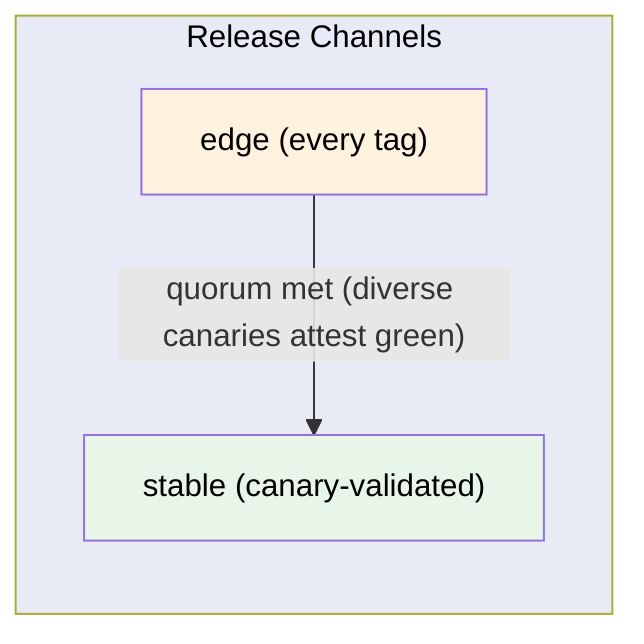
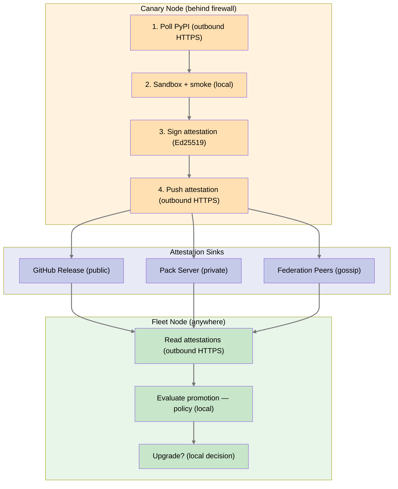

# Canary Nodes — Federated Release Promotion

**Status:** Draft
**Author:** Benjamin Booth
**Date:** 2026-04-07
**Supersedes:** Original canary fleet concept (same file, earlier revision)

---

## Problem

When we publish a new version to PyPI, we don't know if it actually works until a real user reports a problem. By then, the damage is done — broken installs, lost trust, wasted time. CI tests the SOURCE. It doesn't test the WHEEL on a real machine with real infrastructure.

Worse, our federation is designed for sovereign nodes on heterogeneous hardware behind different firewalls. A release that works on the developer's laptop may fail on an Ubuntu server behind a university VPN, or on Alpine in a container, or on an air-gapped HPC node. No amount of CI matrix testing can cover the real-world diversity of a federated deployment.

## Vision

**Every tagged release starts as an "edge" release.** A subset of federation nodes — canaries — automatically detect the new version, upgrade themselves in a sandbox, run smoke tests, and push signed attestations. If enough diverse canaries attest green within a time window, the release is promoted to "stable." All other nodes in the federation track "stable" by default and only upgrade once the canaries have validated.

If a canary fails, it rolls back safely. If canaries go silent, the release stays on "edge" and the fleet doesn't move. Silence is failure. The blast radius of a bad release is limited to nodes that explicitly opted in.

Any Axiom node can become a canary. Someday, if we sell this product, we may offer a pricing incentive to consent to canary duty — the user accepts slightly higher risk (mitigated by sandbox + automatic rollback) in exchange for value, and the ecosystem gets broader test coverage across real-world configurations.

## Design Principles

- **Silence is failure.** Canaries must *actively attest green* within a time window. A canary that crashes so hard it can't report blocks promotion just as effectively as a red attestation.
- **Push, never pull.** Canaries push attestations outbound. No inbound connections required. Works behind firewalls, NATs, VPNs, and air gaps with outbound access.
- **Local decision, global evidence.** Each node independently decides whether to upgrade by evaluating attestations against its own promotion policy. No central authority promotes a release.
- **Sandboxed first.** Canaries never upgrade in-place on first contact. They stage in a temporary environment, smoke test there, and only commit the upgrade if green.
- **Rollback is mandatory.** Every upgrade must be reversible. If smoke fails after commit, the canary rolls back to the previous version and verifies the rollback worked.
- **Diverse quorum.** Promotion requires attestations from canaries covering different OS families, Python versions, and infrastructure tiers. A fleet of identical canaries provides false confidence.
- **Non-impactful.** Canaries never modify production data or interact with real user workflows during smoke testing.
- **Named.** Each canary has a Axi character name reflecting its personality.

---

## Release Channels

Every Axiom release exists in exactly one channel at any point in time:



| Channel | Who tracks it | Upgrade behavior |
|---------|--------------|-----------------|
| **edge** | Canary nodes | Auto-detect, sandbox, smoke, attest. Upgrade if green, rollback if red. |
| **stable** | All other nodes | Auto-upgrade only after promotion. Manual upgrade always available. |

A release is **promoted** from edge to stable when the promotion policy is satisfied. Promotion is not a central action — each node evaluates attestations and decides locally.

---

## Canary Protocol

### 1. Detection

Canaries poll PyPI (outbound HTTPS) at a configurable interval (default: 15 minutes):

```
Canary checks: pip index versions axi-platform
  Current: 0.9.1
  Latest:  0.9.2  <-- NEW! Channel: edge
```

### 2. Sandbox Staging

The canary does NOT upgrade its running install. It creates an isolated environment:

```
1. Create temp venv:     python -m venv /tmp/canary-staging-0.9.2
2. Install new version:  pip install axi-platform==0.9.2
3. Import check:         python -c "import axiom"
4. CLI check:            /tmp/.../bin/axi --help
```

If staging fails, the canary reports RED and stops. Its running install is untouched.

### 3. Smoke Testing

The canary runs tiered smoke tests against the staged install:

| Tier | Name | What it tests | Required for |
|------|------|--------------|-------------|
| 1 | **Import + CLI** | `import axiom`, `axi --help`, extension discovery, agent patterns | All canaries |
| 2 | **Data** | PostgreSQL connects, model round-trip, material cards, facility packs | Canaries with database |
| 3 | **Intelligence** | LLM provider responds, chat agent starts, RAG search returns results | Canaries with LLM |
| 4 | **Federation** | Node identity loads, federation status, catalog sync with peer | Canaries with federation peers |

Each canary runs tiers appropriate to its infrastructure. A SQLite-only canary runs Tier 1. A full-stack canary runs Tiers 1-4.

### 4. Commit or Abort

```
Smoke passed?
  YES → Upgrade main install: pip install --upgrade axi-platform==0.9.2
        Re-run smoke on live install
        Report GREEN attestation
  NO  → Leave main install untouched
        Report RED attestation with failure details
```

### 5. Attestation

The canary signs an attestation with its Ed25519 node key and pushes it outbound:

```json
{
    "type": "canary_attestation",
    "version": "0.9.2",
    "previous_version": "0.9.1",
    "status": "green",
    "canary": {
        "node_id": "example-host-a1b2c3d4",
        "name": "VN-GO",
        "os": "Ubuntu 24.04",
        "python": "3.12.8",
        "infra": "k3d",
        "federation_role": "provider"
    },
    "smoke_results": {
        "tier_1": {"passed": 6, "failed": 0, "duration_ms": 1200},
        "tier_2": {"passed": 4, "failed": 0, "duration_ms": 3400},
        "tier_3": {"passed": 2, "failed": 0, "duration_ms": 5100},
        "tier_4": {"passed": 2, "failed": 0, "duration_ms": 2300}
    },
    "upgrade_duration_seconds": 45,
    "timestamp": "2026-04-07T18:00:00Z",
    "signature": "<Ed25519 signature over above fields>"
}
```

### 6. Rollback (on failure)

If smoke fails *after* the main install has been upgraded:

```
1. pip install axi-platform==<previous_version>
2. Re-run Tier 1 smoke to verify rollback succeeded
3. Report RED with failure details
4. RIVET receives report → matches failure pattern → proposes fix or escalates
```

Rollback verification is mandatory. A canary that can't roll back is a critical alert.

---

## Attestation Distribution

Canaries push attestations outbound. This works behind any firewall that allows outbound HTTPS — which is virtually all of them. Three distribution tiers match the deployment progression:

| Tier | Sink | How canaries push | How fleet nodes read |
|------|------|-------------------|---------------------|
| **Public** | GitHub Release metadata | `gh api` POST: attestation as release asset or comment | `gh api` GET: read attestations for a version |
| **Private federation** | Pack server | HTTP POST to pack server attestation endpoint | HTTP GET from pack server |
| **Air-gapped** | Federation gossip | Write to local federation state; propagate on next peer sync (even sneakernet `.axiompack`) | Read from local federation state after sync |

All three tiers use the same signed attestation format. Nodes can read from any available tier.



---

## Promotion Policy

Each node has a local promotion policy that determines when it considers a release "stable enough" to install. There is no central promotion authority.

### Default Policy

```toml
[upgrade]
channel = "stable"                    # "edge" for canary nodes
auto_upgrade = true                   # upgrade when promotion criteria met
min_canary_attestations = 3           # minimum green attestations required
require_os_diversity = true           # at least 2 different OS families
require_python_diversity = false      # at least 2 different Python versions
silence_timeout = "4h"                # if no attestations arrive in 4h, don't promote
max_edge_age = "72h"                  # if still edge after 72h, alert operator
rollback_on_failure = true            # always rollback on smoke failure
```

### Promotion Decision Logic

A node evaluating whether to upgrade runs this logic:

```
1. Collect all signed attestations for version X
2. Verify Ed25519 signatures (reject unsigned/invalid)
3. Count GREEN attestations
4. Check diversity:
   - os_families = unique set of {linux, darwin, alpine, ...}
   - python_versions = unique set of {3.11, 3.12, 3.13, 3.14}
   - infra_tiers = unique set of {k3d, compose, native, sqlite}
5. Evaluate policy:
   - green_count >= min_canary_attestations?
   - os_families.count >= 2 (if require_os_diversity)?
   - python_versions.count >= 2 (if require_python_diversity)?
   - No RED attestations from canaries matching my profile?
6. If all pass → promote locally, auto-upgrade if enabled
7. If not → wait, re-evaluate on next attestation
```

### Silence Handling

If `silence_timeout` elapses with zero attestations for a new edge release:

- The release is **not promoted** (silence is failure)
- RIVET generates an alert: "Version X.Y.Z has been on edge for 4h with no canary attestations"
- Possible causes: PyPI publish failed, all canaries down, network partition
- Operator must investigate manually or wait for canaries to come online

### Manual Override

If quorum is never reached — canaries are down, the fleet is too small, there's a critical hotfix — an operator can force promotion on their own node:

```bash
axi release promote 0.9.2 --force --reason "hotfix for CVE-2026-XXXX"
```

Override rules:
- **`--reason` is mandatory.** The system refuses to override without a justification.
- **Local only.** An override promotes the version on *this node*. It does not promote for the federation. Each operator must override their own node independently.
- **Audited.** The override is logged and gossipped to peers as an `operator_override` attestation, so the federation can see that someone forced a promotion.
- **Visible.** `axi release canary-status` flags overrides so they're never silent.

This is the escape hatch for bootstrap (federation too small for quorum), emergencies (critical security fix), and development environments (canary gating adds friction during active development)

### Profile Matching

A node can optionally require that at least one canary matching its own profile (OS + Python + infra) attested green before upgrading:

```toml
[upgrade]
require_matching_profile = true   # a canary like me must have passed
```

This means an Ubuntu 24.04 / Python 3.12 / K3D node won't upgrade until at least one canary with that same profile attested green — even if the overall quorum is met.

---

## Node Opt-In

Any Axiom node can become a canary. It's a configuration flag, not a separate installation.

```bash
# Become a canary
axi config set node.role canary
axi config set canary.name "AXI"    # optional: pick a name
axi config set canary.smoke_tier 3      # which tiers to run (based on local infra)

# Stop being a canary
axi config set node.role standard
```

When a node becomes a canary:
- It starts tracking the `edge` channel
- It polls PyPI at the configured interval
- It runs the canary protocol (sandbox → smoke → attest) on every new edge release
- Its attestations are signed with its existing Ed25519 node key

When a node stops being a canary:
- It reverts to the `stable` channel
- It stops polling for edge releases
- It waits for promotion before upgrading

### The Reference Fleet

These are the first canaries — maintained by the core team to guarantee minimum coverage:

| Canary | Name | OS | Python | Infra | Federation Role |
|--------|------|-----|--------|-------|----------------|
| C1 | **VN-GO** | macOS | 3.14 | K3D (full stack) | Provider |
| C2 | **PRESS** | Ubuntu 22.04 | 3.11 | Docker Compose | Standard |
| C3 | **TRIAGE** | Ubuntu 24.04 | 3.12 | Native PG | Leaf |
| C4 | **L-T** | macOS | 3.13 | SQLite only | Standalone |
| C5 | **SUPPLY-R** | Alpine | 3.12 | Docker Compose | Standard |
| C6 | **Self-Hosted Node** | Ubuntu 24.04 | 3.12 | K3D + GPU | Provider |

Why these names: VN-GO paints the full picture (full stack). L-T is lightweight (SQLite only). SUPPLY-R validates the supply chain (minimal OS). PRESS and TRIAGE are reused because publishing and diagnostics ARE canary functions. The self-hosted node is the first real-world deployment canary.

---

## Commercial Model (Future)

When Axiom is sold commercially, canary opt-in becomes a network effect lever:

| | Standard License | Canary License |
|--|-----------------|----------------|
| **Channel** | stable | edge |
| **Upgrade timing** | After canary validation | Immediate (sandboxed) |
| **Risk** | Minimal (canary-validated) | Low (sandbox + rollback) |
| **Contribution** | Passive consumer | Active ecosystem participant |
| **Pricing** | Standard | Discounted |
| **Value exchange** | Pays for stability guarantee | Trades early exposure for lower cost |

The incentive is designed so that:
- **More canaries = better coverage** across real-world configurations
- **More diverse canaries = higher confidence** in promotion decisions
- **Canary operators benefit directly** from lower pricing
- **The ecosystem benefits** from faster, safer releases with broader test coverage
- **Blast radius shrinks** as the canary fleet grows — problems are caught earlier, on nodes that expect and handle them

This is analogous to insurance: canary nodes absorb small, controlled risks so the fleet avoids large, uncontrolled failures.

---

## Relationship to RIVET

RIVET manages the canary lifecycle on each node. The canary protocol is a RIVET extension:

- **Detection:** RIVET's heartbeat loop includes PyPI version polling
- **Staging:** RIVET creates and manages the staging venv
- **Smoke testing:** RIVET runs the registered smoke tests
- **Attestation:** RIVET signs and pushes attestations
- **Rollback:** RIVET handles rollback and verification
- **Alerting:** RIVET escalates failures (to operator, to federation, to webhook)
- **Pattern matching:** RIVET matches failure patterns from its training data to propose fixes

On non-canary nodes, RIVET reads attestations and evaluates the promotion policy to decide when to auto-upgrade.

---

## Phasing

### Phase 1: Manual Canaries (current release + 1)
- A self-hosted node and a developer laptop configured as canaries
- Smoke tests run via cron (`axi release canary-run`)
- Attestations posted to pack server
- Promotion evaluated manually

### Phase 2: Automated Canaries (v1.2)
- RIVET manages full canary lifecycle
- Auto-upgrade with sandbox + rollback
- Attestations signed and pushed automatically
- Promotion policy evaluated automatically by fleet nodes

### Phase 3: CI-Integrated Canaries (v1.3)
- GitHub Actions post-publish job triggers canary matrix
- Complements real-world canaries (CI = synthetic, fleet = organic)
- Results gate the release announcement (not the release itself — edge is always available)

### Phase 4: Commercial Canary Program (v2.0+)
- Canary opt-in in license management
- Pricing incentive active
- Canary fleet telemetry dashboard for ecosystem health
- Anonymized canary data shared across federation for collective intelligence

---

## Success Metrics

| Metric | Target |
|--------|--------|
| Detection latency | <15 minutes from PyPI publish to first canary detection |
| Smoke duration | <5 minutes for full suite (Tiers 1-4) |
| Promotion latency | <4 hours from edge publish to stable promotion |
| Coverage | At least one canary per {OS family} x {infra tier} |
| False positive rate | <5% (smoke failures that aren't real bugs) |
| Rollback success rate | 100% (rollback must always work) |
| Blast radius | Zero fleet nodes affected by a bad edge release |

---

## User Stories

- As a **canary operator**, I want my node to safely test edge releases and roll back on failure, so I contribute to ecosystem health without risking my work.
- As a **fleet operator**, I want my node to only upgrade after diverse canaries have validated the release, so I'm protected from unforeseen issues.
- As a **developer**, I want to know within 4 hours if my PyPI publish works across the deployment matrix, so I can fix issues before they reach the fleet.
- As a **federation coordinator**, I want to see canary attestation status across all deployment types, so I can assess release readiness.
- As RIVET, I want to manage the canary lifecycle end-to-end (detect, stage, smoke, attest, rollback), so the protocol runs without human intervention.
- As a **commercial customer**, I want to opt into canary duty for a pricing discount, knowing my node is protected by sandbox + rollback.

---

## Related Documents

- [Canary Nodes Tech Spec](../tech-specs/spec-canary-nodes.md) — Implementation details, data models, API contracts
- [Federation PRD](prd-federation.md) — Node identity, discovery, trust
- [Security PRD](prd-security.md) — Ed25519 signing, content verification
- [CI/CD Tech Spec](../tech-specs/spec-cicd-and-deployment.md) — Build pipeline, container images
- [Managed Infrastructure PRD](prd-managed-infrastructure.md) — RIVET, agent lifecycle
_Copyright (c) 2026 The University of Texas at Austin and B-Tree Labs. Apache-2.0 licensed._
