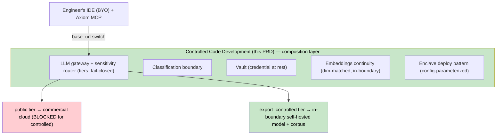

# Axiom Controlled Code Development PRD

**Status:** Draft
**Owner:** Ben Booth
**Created:** 2026-06-23
**Last Updated:** 2026-06-23

**Related:** [spec-classification-boundary](../specs/spec-classification-boundary.md) · [spec-llm-tier-policy](../specs/spec-llm-tier-policy.md) · [spec-model-routing](../specs/spec-model-routing.md) · [prd-axiom-vault](prd-axiom-vault.md) · [prd-security](prd-security.md) · ADR-030 (federated inference) · ADR-078 (public/private mirror)

---

## Executive Summary

Organizations that develop **export-controlled or otherwise classified codebases** — defense contractors, nuclear and energy labs, regulated industrial firms, government programs — cannot use commercial cloud AI on their sensitive work. Controlled technical data may not leave a controlled environment, may not be sent to a model an organization cannot self-host, and may not be exposed to uncleared or foreign persons ("deemed export" and its equivalents). The result is a large, high-value population of engineers locked out of AI-assisted development on exactly the work where it would matter most.

Axiom already has the load-bearing primitives: a classification boundary, an LLM gateway with sensitivity-based routing tiers, a vault for credentials, federated inference, and a public/private mirror model. **Controlled Code Development** names and completes the capability that composes them into a single product promise:

> An engineer develops a controlled codebase in their own IDE, with all controlled bytes confined to an authorized compute boundary, grounded on their organization's controlled corpus — and the platform *demonstrates* that containment to a compliance authority.

This is deliberately **domain-agnostic**. The same capability serves a nuclear lab, a defense supplier, a pharmaceutical firm under trade-secret control, or a government classified program. Domain specialization (nuclear codes, avionics, biotech) lives in a consumer layer or extension, never in this capability. Per ADR-050 and the platform's domain-agnostic rule, Axiom names no facility, regulation, or domain here.

## Problem Statement

### No cloud safe harbor

Controlled-code development typically has no compliant cloud path. Closed frontier models cannot be self-hosted, so they are categorically unavailable for the controlled tier. Any AI assistance must run on a model the organization controls, inside a boundary it controls.

### Containment must be enforced and provable, not advisory

A policy that *says* "don't send controlled content to the cloud" is worthless to a compliance officer. Containment must be (a) **enforced** at a single chokepoint, (b) **fail-closed** (no controlled traffic ever silently relaxes to a cloud provider), and (c) **demonstrable** — an audit artifact that shows, per request, the tier and the resolved provider.

### The corpus is portable only if the embedder is

Organizations have existing retrieval corpora embedded at a fixed vector dimension. Reusing that corpus inside a controlled boundary requires a matching-dimension embedder in-boundary. A served embedder at the wrong dimension forces a full, expensive re-index. The embedder — not the chat model — is the load-bearing portability decision.

### Engineers won't switch IDEs

Adoption fails if the platform mandates a new editor. The capability must meet engineers in Claude Code, Cursor, VS Code, Codex, or PyCharm and make the *endpoint* — not the tool — the thing that changes.

## Goals & Non-Goals

**Goals**
- G1 — Compose the existing primitives into one named capability with a runbook from zero to a grounded, contained agent turn.
- G2 — **Bring-your-own-IDE**: a documented switch-to-controlled-endpoint recipe for the major agentic IDEs, via Axiom's MCP server + an OpenAI-compatible endpoint base-URL switch.
- G3 — **Fail-closed controlled tier**: an `export_controlled` request provably never selects a `public`/`restricted` provider, and raises rather than relaxing when no controlled provider is healthy.
- G4 — **Embeddings continuity**: a matching-dimension embedder reachable in-boundary, or a documented re-index path; no silent dimension mismatch.
- G5 — **Containment artifact**: a per-request routing audit (tier + provider config hash) plus a deployment evidence pattern suitable to show a compliance authority.
- G6 — **Enclave deploy pattern**: a reusable deploy shape (self-hosted open-weight model on a prefix-caching serving engine + in-boundary embedder + in-boundary vector store) parameterized by config.

**Non-Goals**
- Granting or certifying regulatory authorization — that is the compliance authority's ruling; Axiom makes containment demonstrable, it does not adjudicate it.
- Naming or specializing for any domain, regulation, or facility (consumer-layer concern).
- Re-implementing IDEs (a platform-deployed open-source IDE is an offered option, not a requirement).

## The capability, in layers

The capability is a **composition**, not new low-level machinery. It binds:
- **Classification boundary** ([spec-classification-boundary]) — what is controlled.
- **Sensitivity routing tiers** ([spec-model-routing], [spec-llm-tier-policy]) — `public` / `restricted` / `export_controlled`, with the **new requirement** that `export_controlled` is fail-closed (no last-resort relaxation to cloud).
- **Vault** ([prd-axiom-vault]) — provider credentials resolved by the gateway *from the vault*, not only from environment variables (closes the env-leak gap; the gateway's `api_key` resolution must fall back to `get_credential(provider)`).
- **Embeddings continuity** — `NEUT_EMBED_URL`/embedder config pointing at a dim-matched in-boundary service.
- **Enclave deploy pattern** — a config-parameterized deployment (serving engine with prefix caching + embedder + vector store inside the boundary).

## Personas

| Persona | Need | Constraint |
|---|---|---|
| Controlled-code engineer | AI assistance on controlled code in their own IDE | Controlled bytes cannot leave the boundary |
| Platform/compliance owner | Define + prove containment | Must demonstrate it to an authority |
| Infrastructure operator | Host models + corpus in the boundary | Owns hardware, weights, allocation |

## Requirements

- **R1 (fail-closed tier) — ✅ shipped (PR #570).** Enforcement already lived in `_select_provider` (the "relax as last resort" branch is hard-gated off for `export_controlled`, and the prefer-chain refuses EC→non-EC); a controlled request with no healthy controlled provider selects nothing rather than relaxing to a `public`/`any` provider. Locked in by an automated compliance test (`TestExportControlledFailClosed`).
- **R2 (vault-resolved keys) — ✅ shipped (PR #570).** `LLMProvider.api_key` resolves from the vault by provider name when `api_key_env` is unset/empty (a controlled provider never returns a cloud key). Shipped with a `get_credential` fix so a bare `store_credential()` token is resolvable with or without a registered connection (previously the stored layout was write-only).
- **R3 (BYO-IDE recipe).** Documented per-IDE: register the Axiom MCP server + switch model base-URL to the controlled endpoint. Smoke-tested across ≥4 IDEs.
- **R4 (embeddings continuity).** Embedder config supports an in-boundary dim-matched endpoint; mismatch is detected, not silent.
- **R5 (containment artifact).** Every gateway call emits a routing audit record (tier + provider config hash); a deploy-evidence pattern is documented.
- **R6 (deploy pattern).** A reusable, config-parameterized enclave deploy (serving engine + prefix caching + embedder + vector store), with the public/private mirror (ADR-078) keeping operator-specific values out of any public repo.

## Success Metrics

| # | Metric | Target |
|---|---|---|
| M1 | Zero-to-contained-grounded-turn following the runbook | ≤ 10 min |
| M2 | IDEs with a working switch-to-controlled recipe | ≥ 2 |
| M3 | Controlled-tier cloud egress | 0% (enforced + tested) |
| M4 | Corpus reuse without re-index when a dim-matched embedder exists | Yes |
| M5 | Per-request containment audit coverage | 100% |

## Rollout

1. **Compose + enforce** — R1, R2 ✅ shipped (fail-closed tier, vault-resolved keys; PR #570); R5 (per-call audit record) remaining.
2. **BYO-IDE + grounding** — R3, R4 with runbooks.
3. **Enclave deploy pattern** — R6, parameterized; consumer layers supply domain grounding + facility config.

## Consumer & extension boundary

Domain harnesses (e.g. a scientific/lab consumer) and facility specifics consume this capability via config + extensions; they do not fork it. A nuclear lab's codes, a defense program's data classes, a facility's endpoint URL — all are **configuration or custom extensions** over this generic capability. This keeps Axiom serving any controlled/classified domain, commercial or government, from one capability surface.

_Copyright (c) 2026 The University of Texas at Austin and B-Tree Labs. Apache-2.0 licensed._
