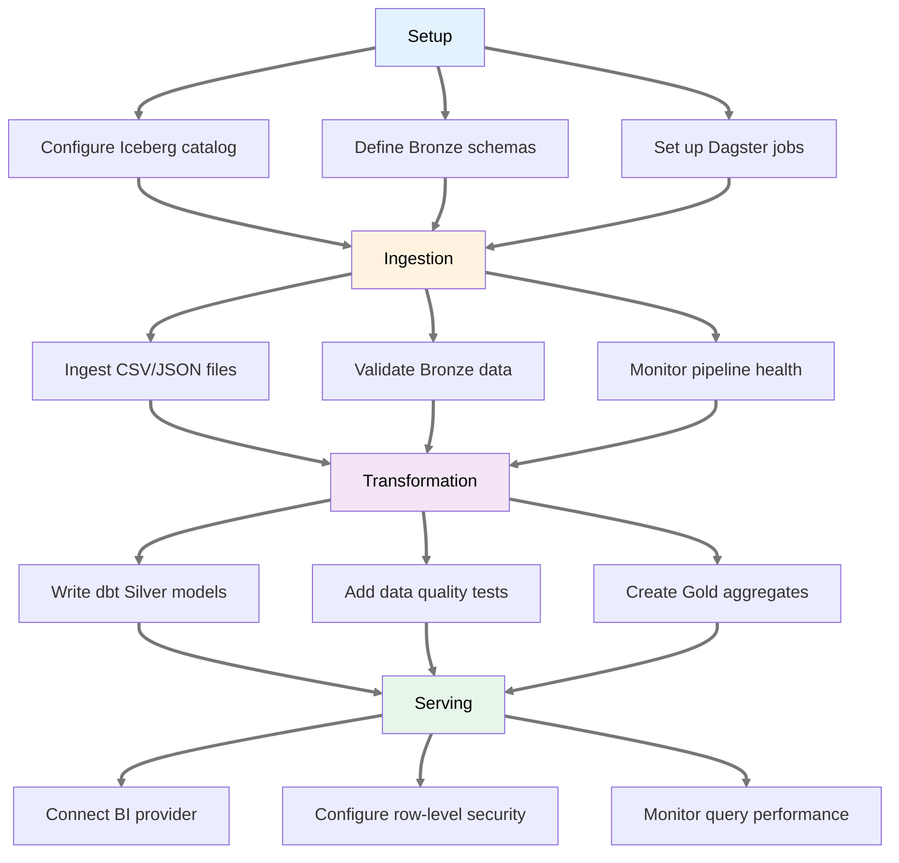
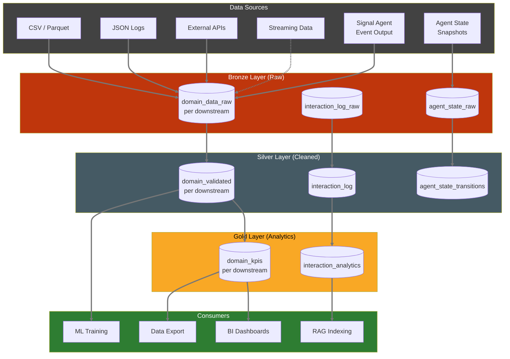
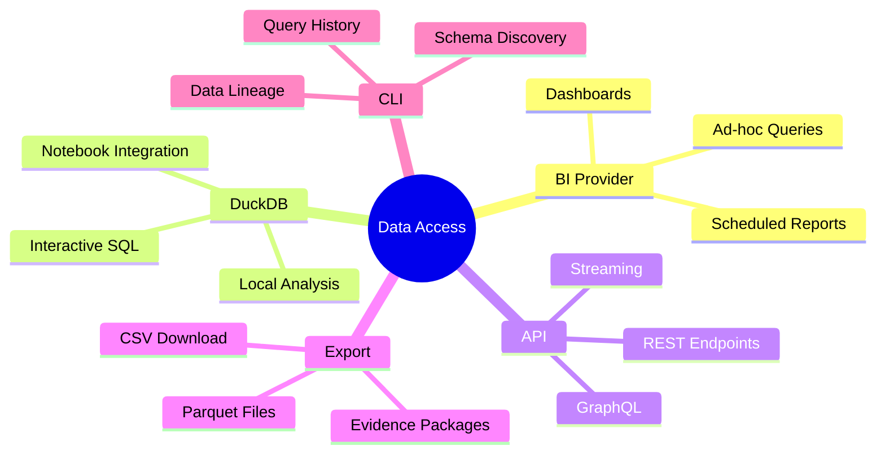

# Data Platform PRD

> **Implementation Status (2026-05-27):** The structured-data **lakehouse**
> (Iceberg/DuckDB/Dagster/dbt/Superset medallion, Bronze/Silver/Gold transforms)
> is **🔲 not started**. The **ingestion-governance slice is 🟡 partially built**,
> in the RAG subsystem (v0.22.0): a provenance/artifact **scrubber + router**
> (`axiom.rag.ingest_router` — exclude/quarantine/allow-by-source via a `--rules`
> set), a **safe-by-default** shared-tier guard, an **`axi rag audit`** find/purge
> tool, and honest ingest drop reporting. That is the first concrete piece of this
> PRD's ingestion-governance surface; the medallion lakehouse and its transforms
> remain planned. See [Data Architecture Spec](../specs/spec-data-architecture.md)
> and CHANGELOG v0.22.0.

**Product:** Axiom Data Platform
**Status:** Draft
**Last Updated:** 2026-03-26
**Parent:** [Executive PRD](prd-executive.md)
**Related:** [Federal Data Management](prd-doe-data-management.md)

---

## Packaging & extension model (2026-05-28)

The data platform is an **Axiom builtin extension** (`extensions/builtins/data_platform/`) with a **data-platform agent orchestrator** — **not core**. The heavy toolchain (Iceberg/Dagster/dbt/DuckDB) sits behind a `pip install axiom-os-lm[data-platform]` optional extra so base installs stay lean, and the extension **extracts to its own package on a trigger** (dependency/cadence divergence or product-ization), per the portfolio pattern. Consumer layers extend it by **registering** sources / schemas / transforms / governance-rule packs into its registry — not by forking. The **ingestion-governance slice is built** (provenance gate + `axi rag audit`, v0.22.0); the medallion lakehouse and the **pack-distribution-at-scale** model (federation-for-big-corpus + delta/scoped/quantized packs) are specified in [Data Architecture Spec → "Architecture update"](../specs/spec-data-architecture.md) — read that block for the current shape, status, and the seam-free query contract.

**Layering (2026-05-28 decision):** the **data platform (full medallion lakehouse) is the substrate of record** — data + metadata live in Iceberg bronze/silver/gold. The **`signals`/Sense subsystem is a thin async-orchestration layer on top** (sources, scheduling, queue, dispatch) that *moves* data into the substrate; it is not the store. **RAG (pgvector) is a served view** fed from silver/gold. Orchestration is **one-per-pipeline, chosen by destination** (ADR-049): lakehouse-bound data → **Dagster** (sensors/assets/dbt — the only thing that writes Iceberg); ephemeral agent signals → **Sense** (the agent-fleet subsystem, *not* a data-pipeline orchestrator). They never overlap for the same data. `data_platform.IngestSource` is a **portable connector contract** — written once, run by a Dagster sensor (heavy tier) or a minimal runner (lean/offline node), never both — not a competing source/queue stack. **Phase 1** stands up the **full** medallion (not RAG-only) as a **Dagster** pipeline (Box sensor → bronze → dbt silver/gold → RAG-embed served view), deployed as **Terraform-defined, multi-site-reproducible** infrastructure. See ADR-049 + the spec's "Layering" / "Deployment topology" blocks.

---

## Overview

The Axiom Data Platform provides a unified, domain-agnostic data foundation for operations-intensive organizations. It replaces ad-hoc data formats, siloed databases, and manual data preparation workflows with a modern lakehouse architecture. Domain-specific schemas, transforms, and dashboards are layered on top by downstream products (e.g., a consumer extension for a specific domain).

### Federal Data Management Alignment

This PRD's Iceberg time-travel capabilities, Bronze/Silver/Gold medallion architecture, and row-level security enforcement collectively satisfy DOE DMSP requirements for validation and replication (time-travel provides reproducible query states), data quality (dbt tests and Silver-tier cleaning), and access control (OpenFGA + access classification tags). Remaining gaps that the DOE data management PRD addresses: PID assignment at the Gold tier, dataset-level metadata schema conforming to DataCite, embargo lifecycle management for datasets transitioning from restricted to public, and license metadata columns on published tables. See [Federal Data Management PRD](prd-doe-data-management.md) for the full requirements.

---

## User Journey Map

### Data Engineer: Pipeline Development



### Data Flow Architecture



### Query Access Patterns



---

## User Personas

| Persona | Description | Primary Needs |
|---------|-------------|---------------|
| **System Operator** | Monitors operational state | Real-time dashboards, historical lookback |
| **Researcher** | Analyzes experimental data | Self-service queries, data export |
| **Data Engineer** | Builds pipelines | Reliable ingestion, transformation tools |
| **Auditor / Inspector** | Reviews records | Immutable history, time-travel queries |
| **Operations Manager** | Oversees operations | KPI dashboards, anomaly alerts |

---

## Problem Statement

### Current State (typical deployment)
- Operational data scattered across ad-hoc formats (spreadsheets, flat files, proprietary exports)
- Logs and metadata in inconsistent schemas
- Isolated databases with no cross-system query capability
- No data versioning or point-in-time recovery
- Manual data preparation for every analysis or report

### Future State
- Bronze/Silver/Gold data tiers (Iceberg) with schema evolution
- Time-travel queries for any historical state
- Self-service analytics via pluggable BI providers
- Automated pipelines (Dagster + dbt)
- Immutable audit trail for all data changes
- Multi-tenant isolation with row-level security

---

## Data Architecture & Operational Requirements

The Data Platform implements the system-wide data architecture and operational requirements defined in technical specifications. Key policies are centralized to ensure consistency:

**See also:**
- [Data Architecture Spec § 9: Backup, Retention & Archive Policy](../tech-specs/spec-data-architecture.md#9-backup-retention--archive-policy)

**Key Operational Policies:**
- **2-year live retention**: Data actively queried and in use via lakehouse (default for all deployments)
- **7-year archive retention**: Data retained in Glacier-tier storage for regulated deployments (opt-in; configured via `[retention] policy = "regulatory"` in `data-platform.toml`). Non-regulated deployments default to 2-year retention.
- **Log archival**: System logs, audit logs, and routing logs follow the same retention tiers as operational data. Glacier-tier archive applies to all persistent log tables when `policy = "regulatory"` is set.
- **Multi-tier backup strategy**: Cloud replication (continuous), local daily, monthly Glacier archive, encrypted portable backup
- **Disaster recovery**: RPO <1 minute (regional), <24 hours (data corruption)
- **Immutability enforcement**: Iceberg table snapshots are immutable; all modifications tracked in transaction log

---

## Requirements

### Epic: Data Lake Foundation

| ID | Requirement | Priority |
|----|-------------|----------|
| DL-001 | Ingest system time-series to Bronze tier | P0 |
| DL-002 | S3-compatible object storage (Ceph/Rook recommended) | P0 |
| DL-003 | Configurable retention policy (default 2-year; 7-year for regulated deployments) | P1 |
| DL-004 | Automated daily ingestion from configurable sources (Box, S3, SFTP) | P0 |
| DL-005 | Manual upload capability for legacy data | P1 |
| DL-006 | Binary/blob ingestion to Bronze tier (images, video frames, HDF5) with metadata tagging | P2 |

### Epic: Lakehouse (Iceberg + DuckDB)

| ID | Requirement | Priority |
|----|-------------|----------|
| LH-001 | Iceberg tables for Silver/Gold tiers | P0 |
| LH-002 | Time-travel queries | P0 |
| LH-003 | Schema evolution without downtime | P1 |
| LH-004 | DuckDB for embedded analytics | P0 |
| LH-005 | Trino for distributed queries | P2 |

### Epic: Transformations (dbt)

| ID | Requirement | Priority |
|----|-------------|----------|
| TR-001 | Bronze → Silver cleaning transforms | P0 |
| TR-002 | Silver → Gold aggregation transforms | P0 |
| TR-003 | dbt tests for data quality | P0 |
| TR-004 | Incremental model updates | P1 |
| TR-005 | Data lineage documentation | P1 |
| TR-006 | Sensor conflict detection when redundant sensors disagree beyond threshold | P1 |
| TR-007 | Configurable reconciliation algorithms (weighted average, voting, Kalman filter) | P1 |
| TR-008 | Reconciliation metadata preserved in Silver layer | P1 |

### Epic: Orchestration (Dagster)

| ID | Requirement | Priority |
|----|-------------|----------|
| OR-001 | Scheduled daily ingestion | P0 |
| OR-002 | Sensor-triggered pipelines | P1 |
| OR-003 | Pipeline monitoring and alerting | P1 |
| OR-004 | Backfill capability | P1 |
| OR-005 | Dagster UI for pipeline visibility | P0 |

### Epic: Analytics & Visualization

The Data Platform is BI-provider-agnostic. Dashboards connect to the Gold layer via standard SQL (DuckDB/Trino). Apache Superset is the default provider; alternatives (Grafana, Metabase, Evidence, custom) integrate via the same SQL interface.

| ID | Requirement | Priority |
|----|-------------|----------|
| AN-001 | Operations dashboard via configurable BI provider | P0 |
| AN-002 | Self-service SQL queries | P0 |
| AN-003 | Dashboard export (PDF, PNG) | P1 |
| AN-004 | Dashboard-as-code (version-controlled definitions in Git) | P0 |
| AN-005 | Role-based dashboard access (delegated to BI provider + OpenFGA) | P1 |

### Epic: Audit & Compliance

| ID | Requirement | Priority |
|----|-------------|----------|
| AU-001 | All data mutations logged to audit trail | P0 |
| AU-002 | Merkle proof verification API | P0 |
| AU-003 | Evidence package generation | P1 |
| AU-004 | Data access logging | P1 |
| AU-005 | Row-level security enforcement via authorization backend (OpenFGA) | P1 |
| AU-006 | Column/table-level access classification tags (e.g., `public`, `restricted`, `export_controlled`) | P1 |

### Epic: Interaction Log

| ID | Requirement | Priority |
|----|-------------|----------|
| IL-001 | Capture every RAG completion as a Bronze `interaction_log_raw` record | P0 |
| IL-002 | Silver `interaction_log` with schema enforcement, deduplication, and session linking | P1 |
| IL-003 | Gold `interaction_analytics` for usage metrics (queries/day, topic distribution, latency) | P1 |
| IL-004 | Retention: interaction logs follow platform retention policy (2-year default) | P1 |
| IL-005 | Integration with knowledge maturity pipeline — interactions feed crystallized-fact extraction | P2 |

### Epic: Agent State Ingestion

| ID | Requirement | Priority |
|----|-------------|----------|
| AS-001 | Agent state snapshots written to Bronze `agent_state_raw` on every state transition | P1 |
| AS-002 | Silver `agent_state_transitions` with schema enforcement and FK to session_id | P1 |
| AS-003 | Ingestion strategy: event-driven via internal event bus (not polling) | P1 |
| AS-004 | State retention follows platform retention policy; regulatory deployments archive full agent history | P2 |

### Epic: Semantic Search & Knowledge Graph

| ID | Requirement | Priority |
|----|-------------|----------|
| RAG-001 | Unified semantic search across all Axiom data | P1 |
| RAG-002 | Knowledge graph linking Silver/Gold tables, signals, and external context | P1 |
| RAG-003 | Vector search API for cross-domain queries | P2 |
| RAG-004 | Integration with Signal agent event outputs | P1 |
| RAG-005 | Query support: "What decisions were made about X?" → surfaces related signals | P2 |
| RAG-006 | Automatic re-indexing when Gold tables change | P2 |

### Epic: CLI Data Access (`axiom data`)

| ID | Requirement | Priority |
|----|-------------|----------|
| CD-001 | `axiom data query <SQL>` — execute ad-hoc queries against lakehouse | P1 |
| CD-002 | `axiom data tables` — list available Bronze/Silver/Gold tables with row counts | P1 |
| CD-003 | `axiom data describe <table>` — show schema, partitioning, last update timestamp | P1 |
| CD-004 | `axiom data pipeline status` — Dagster pipeline health summary | P1 |
| CD-005 | `axiom data backfill <table> --start <date>` — trigger backfill job | P2 |
| CD-006 | `axiom data lineage <table>` — show upstream/downstream dbt DAG | P2 |

---

## Multi-Tenant Data Isolation

Axiom supports multiple tenants within a single deployment. Data isolation ensures each tenant's data is private by default.

### Isolation Model

| Boundary | Mechanism | Enforcement |
|----------|-----------|-------------|
| **Tenant** | All Bronze/Silver/Gold tables partitioned by `tenant_id` | Iceberg partition spec |
| **User role** | Row-level security filters applied at query time | OpenFGA relationship tuples → DuckDB/Trino row filters |
| **Access classification** | Column/table tags (`public`, `restricted`, `export_controlled`) | Query rewriter strips unauthorized columns |

### Tenant Context Propagation

Every query must carry an authenticated user context (from Kratos identity). The query engine resolves the user's tenant memberships and role grants via OpenFGA before executing. Queries without valid context are rejected.

### Cross-Tenant Queries

Permitted only for users with explicit cross-tenant grants (e.g., fleet managers, auditors). Cross-tenant Gold tables aggregate anonymized/approved metrics only.

---

## Streaming vs. Batch Architecture

The Data Platform supports both streaming and batch ingestion. The boundary is defined by latency requirements:

### Decision Framework

| Latency Requirement | Pattern | Infrastructure |
|---------------------|---------|----------------|
| **< 1 second** (real-time dashboards, control room) | Streaming | Kafka → Flink → WebSocket |
| **< 1 minute** (near-real-time alerts, anomaly detection) | Streaming | Kafka → Flink → Bronze append |
| **< 1 hour** (standard analytics, reporting) | Micro-batch | Dagster sensor-triggered jobs |
| **Daily** (aggregations, model training) | Batch | Dagster scheduled jobs + dbt |

### Integration with ADR-007

Real-time data flows through the streaming pipeline before landing in Bronze:

```
Source → Kafka (topic) → Flink (validation, alignment)
                               → Bronze (Iceberg append)
                               → Real-time consumers (WebSocket, alerting)
```

Batch sources bypass streaming and are ingested directly by Dagster jobs.

**Key principle:** Streaming and batch pipelines write to the **same Bronze tables** (Iceberg). Consumers always query Iceberg — they are unaware of ingestion mode.

See: [ADR-007: Streaming-First Architecture](adr-007-streaming-first-architecture.md)

---

## Domain Extension Points

The Axiom Data Platform defines the generic lakehouse infrastructure. Domain-specific data schemas, transforms, and dashboards are defined by downstream products via these extension points:

| Extension Point | What Downstream Products Define | Example (axiom) |
|----------------|--------------------------------|---------------------|
| **Bronze tables** | Raw ingestion schemas for domain data sources | Reactor time-series, ops log entries, experiment records |
| **Silver transforms** | Domain-specific cleaning, validation, and enrichment rules | Xenon dynamics derivation, sensor reconciliation thresholds |
| **Gold aggregations** | Domain KPIs and reporting tables | Fuel burnup tracking, compliance summaries |
| **Dashboard definitions** | BI provider dashboard configs (version-controlled) | Reactor operations overview, shift summary |
| **Retention policy extensions** | Regulatory retention tiers beyond the base 2-year default | NRC 7-year mandatory for audit trails |
| **Entry type registry** | Domain-specific log entry types beyond builtins | `console_check`, `radiation_survey`, `experiment_log` |
| **Reconciliation configs** | Sensor-specific disagreement thresholds and strategies | Ion chamber weighted average at 2%, RTD voting at 1°C |

Downstream products register their schemas, transforms, and configs via the extension system. The Data Platform discovers and applies them at deployment time.

See the domain consumer's Data Platform PRD for a complete example of a domain extension.

---

## Test-Driven Approach

Dashboard scenarios drive data model design:
1. Define dashboard requirements (BI-provider-agnostic)
2. Derive Gold table schemas
3. Write dbt tests (must pass)
4. Implement Bronze → Silver → Gold pipeline
5. Build dashboard, export definition to Git
6. Stakeholder review and approval

See: [Dashboard Scenarios](../tech-specs/superset-scenarios/)

---

## Success Metrics

| Metric | Target |
|--------|--------|
| Dashboard load time (7-day view) | < 3 seconds |
| Dashboard load time (30-day view) | < 10 seconds |
| Ingestion latency (new data available) | < 1 hour (batch), < 1 second (streaming) |
| dbt test pass rate | 100% |
| Time-travel query support | Any point in retention window |
| Row-level security coverage | 100% of tables with `tenant_id` |

---

## Data Sources

| Source | Location | Format | Refresh |
|--------|----------|--------|---------|
| System time-series | Configurable (CSV, API, streaming) | CSV / JSON / Parquet | Daily or real-time |
| System configurations | Static config files | CSV / TOML | Event-driven |
| Simulation outputs | HPC job outputs | HDF5 / Parquet | On completion |
| Log entries | Log service | JSON / API | Real-time |
| **Agent Signal Output** | Signal agent (event detection, structured extraction) | JSON / API | Real-time |
| **Agent State** | Agent State Management system | JSON / API | Event-driven |
| **Interaction Log** | RAG completions | JSON | Per-completion |

---

## Technical Dependencies

- Apache Iceberg (table format)
- DuckDB (embedded query engine)
- BI provider (Apache Superset default; Grafana, Metabase, Evidence also supported via SQL)
- dbt-core (transforms)
- Dagster (orchestration)
- S3-compatible object storage (Ceph/Rook recommended)
- Apache Kafka (KRaft mode, streaming) + Apache Flink (stream processing) — see [ADR-007](adr-007-streaming-first-architecture.md)
- pgvector (semantic search / embeddings)
- OpenFGA (authorization / row-level security)
- Ory Kratos (identity / user context)

---

## Open Questions

1. ~~Where will the data lake be hosted?~~ **Resolved:** S3-compatible object storage (Ceph/Rook) on-premise for default deployments; cloud S3 for managed deployments.
2. What time resolution for Gold tables? (hourly, daily) — domain-specific; deferred to downstream PRDs.
3. How much historical data to backfill? — a deployment-time decision.
4. ~~Should Agent State snapshots be persisted as Bronze/Silver tables?~~ **Resolved:** Yes — see Epic: Agent State Ingestion (AS-001 through AS-004).
5. ~~What is the boundary between real-time and batch?~~ **Resolved:** See § Streaming vs. Batch Architecture above.
_Copyright (c) 2026 The University of Texas at Austin and B-Tree Labs. Apache-2.0 licensed._
