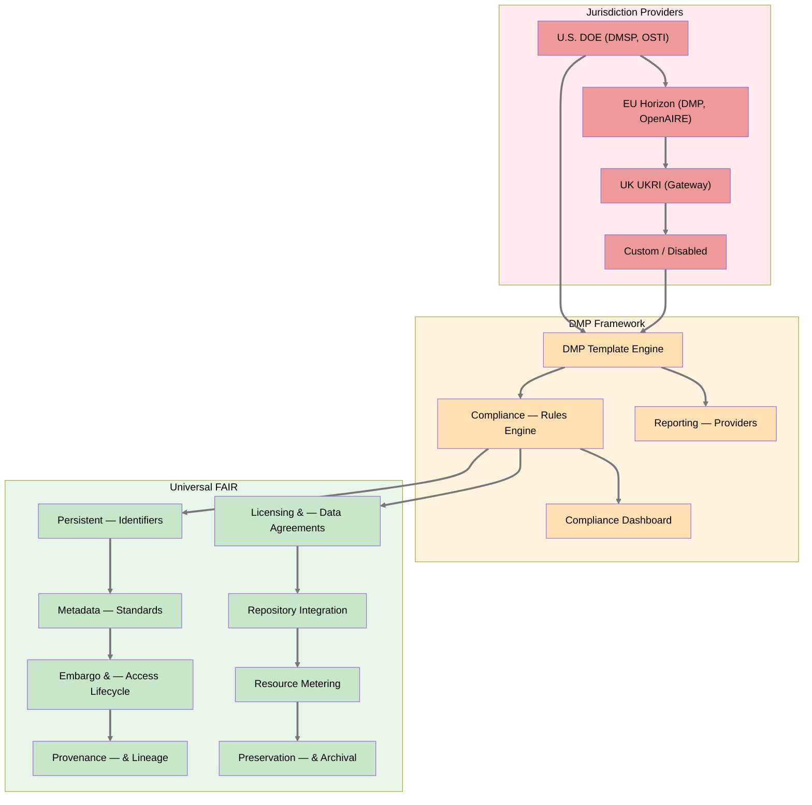

# Product Requirements Document: Research Data Management

> **Implementation Status: 🔲 Not Started** — This PRD describes planned functionality for FAIR research data management. The requirements are jurisdiction-agnostic; compliance with specific national frameworks (U.S. DOE, EU Horizon Europe, UKRI, etc.) is achieved through configurable Jurisdiction Providers.

**Product:** Axiom Research Data Management
**Status:** Draft
**Last Updated:** 2026-04-01
**Parent:** [Executive PRD](prd-executive.md)
**Related:** [Data Platform](prd-data-platform.md), [Compliance Tracking](prd-compliance-tracking.md), [RAG](prd-rag.md), [Security](prd-security.md), [Media Library](prd-media-library.md), [Federation](prd-federation.md)
**Influencing Standards:**
- FAIR Data Principles (Wilkinson et al., 2016)
- OECD Principles and Guidelines for Access to Research Data from Public Funding (2007)
- U.S. [DOE Requirements for Digital Research Data Management](https://www.energy.gov/datamanagement/doe-requirements-and-guidance-digital-research-data-management) (effective Oct 1, 2025)
- U.S. [OSTP Desirable Characteristics of Data Repositories](https://repository.si.edu/items/0fe77b19-f2d9-400c-8886-757d4487d907) (April 2022)
- EU [Horizon Europe Data Management Plan Template](https://ec.europa.eu/info/funding-tenders/opportunities/docs/2021-2027/horizon/temp-form/report/data-management-plan_he_en.docx)
- UK [UKRI Open Access Policy](https://www.ukri.org/publications/ukri-open-access-policy/) (2022)

---

## Executive Summary

Publicly funded research worldwide is converging on a common requirement: research data must be managed, shared, and preserved according to FAIR principles (Findable, Accessible, Interoperable, Reusable). National frameworks differ in structure and reporting requirements — the U.S. DOE requires a Data Management and Sharing Plan (DMSP), the EU requires a Horizon Europe Data Management Plan (DMP), the UK requires UKRI-compliant open access — but the underlying data infrastructure needs are the same.

Axiom provides **jurisdiction-agnostic FAIR data infrastructure** that any deployment can configure for its regulatory context. Jurisdiction-specific requirements (reporting endpoints, DMP templates, export control regimes, repository targets) are implemented as **Jurisdiction Providers** — pluggable modules that adapt the universal platform to local obligations.

This PRD defines three layers:
1. **Universal FAIR infrastructure** — PIDs, metadata, embargo, provenance, licensing, preservation (works everywhere)
2. **Data Management Plan (DMP) framework** — jurisdiction-agnostic template engine with configurable compliance rules
3. **Jurisdiction Providers** (Factory/Provider pattern) — concrete implementations for specific national frameworks

**Key Principle:** Axiom does not itself produce research data — it provides the infrastructure that makes research data FAIR while respecting security, privacy, and intellectual property constraints across any regulatory context.

---

## Architecture: Three Layers

---

## Requirements

### 1. FAIR Data Services

Axiom must implement infrastructure supporting all four FAIR principles at the platform level.

#### 1.1 Findable

| ID | Requirement | Priority |
|----|-------------|----------|
| FAIR-F-001 | Every dataset, document, and media artifact MUST be assigned a globally unique persistent identifier (PID) at creation time | P0 |
| FAIR-F-002 | PIDs MUST resolve to a machine-readable metadata record even if the underlying data is access-restricted | P0 |
| FAIR-F-003 | All data objects MUST be described with rich metadata conforming to a registered schema (see §2 Metadata Standards) | P0 |
| FAIR-F-004 | Metadata MUST be registered or indexed in a searchable catalog accessible to authorized users | P1 |
| FAIR-F-005 | The platform MUST support metadata export in standard discovery formats (DataCite XML, Dublin Core, JSON-LD, schema.org) | P1 |

#### 1.2 Accessible

| ID | Requirement | Priority |
|----|-------------|----------|
| FAIR-A-001 | Data objects MUST be retrievable by their PID using a standardized, open protocol (HTTPS, OAI-PMH) | P0 |
| FAIR-A-002 | The protocol MUST support authentication and authorization where required | P0 |
| FAIR-A-003 | Metadata MUST remain accessible even when the data itself is no longer available (tombstone records) | P1 |
| FAIR-A-004 | Access conditions (open, embargoed, restricted, export-controlled) MUST be machine-readable in the metadata | P0 |

#### 1.3 Interoperable

| ID | Requirement | Priority |
|----|-------------|----------|
| FAIR-I-001 | Data MUST use open, well-documented formats (Parquet, CSV, JSON, HDF5, NetCDF) — no proprietary-only formats for archived data | P0 |
| FAIR-I-002 | Metadata MUST use controlled vocabularies and ontologies where domain standards exist | P1 |
| FAIR-I-003 | Data and metadata MUST include qualified references to related objects (linked datasets, publications, code, models) | P1 |

#### 1.4 Reusable

| ID | Requirement | Priority |
|----|-------------|----------|
| FAIR-R-001 | Every data object MUST carry a clear, machine-readable license declaration (CC-BY, CC-0, proprietary, restricted, etc.) | P0 |
| FAIR-R-002 | Data MUST include detailed provenance metadata (creator, creation method, processing history, funding source) | P0 |
| FAIR-R-003 | Data MUST meet domain-relevant community standards for quality and documentation | P1 |
| FAIR-R-004 | Reuse conditions (attribution requirements, derivative work restrictions) MUST be encoded in metadata | P1 |

---

### 2. Metadata Standards

| ID | Requirement | Priority |
|----|-------------|----------|
| META-001 | The platform MUST define a **core metadata schema** that includes at minimum: title, creator(s), description, date_created, date_modified, access_tier, license, persistent_identifier, funding_source, keywords, related_identifiers | P0 |
| META-002 | The core schema MUST be mappable to DataCite Metadata Schema 4.x and Dublin Core | P0 |
| META-003 | Domain extensions MUST be able to register additional metadata fields without modifying the core schema | P0 |
| META-004 | All metadata MUST be exportable as JSON-LD with schema.org vocabulary | P1 |
| META-005 | The platform MUST maintain a **data dictionary** for each dataset (field name, type, units, precision, description, controlled vocabulary reference) | P1 |
| META-006 | Metadata MUST include provenance fields: `funding_agency`, `award_number`, `principal_investigator`, `institution`, `orcid` | P0 |

---

### 3. Persistent Identifiers (PIDs)

| ID | Requirement | Priority |
|----|-------------|----------|
| PID-001 | The platform MUST implement a **PID Provider** abstraction (Factory/Provider pattern) with concrete providers for DataCite DOI, ARK, and Handle. Deployments select their provider(s) via configuration; the platform is not limited to a single service. | P0 |
| PID-002 | PIDs MUST be minted automatically when a dataset transitions to `published` status | P0 |
| PID-003 | PIDs MUST be immutable — reassignment or deletion is prohibited | P0 |
| PID-004 | The platform MUST support linking PIDs to related objects (publications, code repositories, other datasets) via `relatedIdentifier` metadata | P1 |
| PID-005 | Creator identities MUST be resolved via a **Creator Identity Provider** abstraction (Factory/Provider pattern) with concrete providers for ORCID, institutional LDAP/directory, and local identity. Deployments configure which provider(s) to activate. | P1 |
| PID-006 | If the deployment's designated external repository assigns DOIs, the platform MUST record and cross-reference those external PIDs | P1 |

---

### 4. Reporting Integration (Jurisdiction Providers)

The platform uses a **Reporting Provider** abstraction (Factory/Provider pattern). Each jurisdiction supplies a concrete provider that knows the target API, required fields, and submission format. Deployments configure which provider(s) to activate.

| ID | Requirement | Priority |
|----|-------------|----------|
| RPT-001 | The platform MUST implement a **ReportingProvider** ABC with methods for `submit(dataset_metadata)`, `check_status(submission_id)`, and `get_requirements()` | P0 |
| RPT-002 | Concrete providers MUST be shipped for: **U.S. DOE** (OSTI E-Link 2.0 API), **U.S. NSF** (PAR), **EU** (OpenAIRE), and **disabled** (no-op for unfunded or private deployments) | P0 |
| RPT-003 | Reports MUST include at minimum: title, authors, abstract, DOI, publication date, sponsoring organization, contract/grant number, access limitations, repository URL. Jurisdiction providers MAY require additional fields. | P0 |
| RPT-004 | The platform MUST track reporting status per dataset per provider (unreported, submitted, accepted, error) and retry failed submissions | P1 |
| RPT-005 | The platform MUST generate a **DMP compliance report** summarizing: datasets produced, sharing status, embargo dates, repository deposits, PID assignments, and reporting status — scoped to the active jurisdiction's rules | P0 |
| RPT-006 | Deployments MUST be able to activate multiple jurisdiction providers simultaneously (e.g., a joint U.S.–EU project reports to both OSTI and OpenAIRE) | P1 |

---

### 5. Timely and Fair Access

| ID | Requirement | Priority |
|----|-------------|----------|
| TFA-001 | Every dataset MUST have a defined `access_status` lifecycle: `draft` → `embargoed` → `published` → `archived` → `tombstone` | P0 |
| TFA-002 | Embargoed datasets MUST have an `embargo_end_date`; the platform MUST automatically transition to `published` on that date | P0 |
| TFA-003 | Data displayed in peer-reviewed publications MUST be accessible at the time of publication — the platform MUST support linking datasets to publication DOIs and enforcing synchronous release | P0 |
| TFA-004 | The platform MUST provide a configurable **maximum embargo duration** (default: 12 months; extendable with justification) | P1 |
| TFA-005 | All access transitions MUST be logged in the immutable audit trail | P0 |
| TFA-006 | Datasets with sharing limitations MUST document the specific limitation category (IP, security, privacy, confidential business info) and the authority under which the limitation is claimed | P0 |

---

### 6. Repository Selection and Qualification

| ID | Requirement | Priority |
|----|-------------|----------|
| REPO-001 | The platform MUST maintain a **repository registry** — a catalog of approved external repositories with their qualification status | P1 |
| REPO-002 | Repository qualification MUST evaluate against NSTC desirable characteristics: persistent identifiers, metadata standards, curation, access controls, long-term sustainability, security | P1 |
| REPO-003 | The platform MUST support **automated deposit** to at least one qualified repository (via SWORD, S3, or repository-specific API) | P2 |
| REPO-004 | Each dataset's metadata MUST record the target repository and deposit status | P1 |
| REPO-005 | For federated deployments, the federation coordinator SHOULD maintain a shared repository registry across nodes | P2 |

---

### 7. Resource Allocation and Metering

| ID | Requirement | Priority |
|----|-------------|----------|
| RES-001 | The platform MUST track storage consumption per facility, project, and user | P1 |
| RES-002 | The platform MUST track computational resource usage (embedding generation, LLM inference, data transformation) per facility and project | P1 |
| RES-003 | Usage metrics MUST be exportable for budget reporting and DMSP resource justification | P1 |
| RES-004 | The platform SHOULD support configurable storage quotas per facility/project with alerts at 80%/90%/100% thresholds | P2 |

---

### 8. Data Sharing Agreements and Licensing

| ID | Requirement | Priority |
|----|-------------|----------|
| DSA-001 | Every dataset MUST have an assigned license from a controlled vocabulary (CC-0, CC-BY-4.0, CC-BY-NC-4.0, proprietary, government-use-only, restricted) | P0 |
| DSA-002 | The platform MUST support **Data Sharing Agreement (DSA) templates** that define: parties, purpose, permitted uses, restrictions, duration, IP terms, attribution requirements | P1 |
| DSA-003 | Access to restricted datasets MUST require acceptance of the applicable DSA before data retrieval | P1 |
| DSA-004 | The platform MUST enforce sharing limitations at retrieval time — restricted data cannot be exported without DSA acceptance and audit logging | P0 |
| DSA-005 | For classified or export-controlled deployments, DSA enforcement MUST integrate with the existing multi-layer defense architecture (security PRD §EC) | P0 |

---

### 9. Provenance and Lineage

| ID | Requirement | Priority |
|----|-------------|----------|
| PROV-001 | Every dataset MUST record creation provenance: who created it, when, how (manual entry, instrument, computation, derivation), and from what source(s) | P0 |
| PROV-002 | Derived datasets MUST link to their parent datasets with transformation description | P0 |
| PROV-003 | The platform MUST generate a machine-readable provenance graph (W3C PROV-O compatible) for any dataset on demand | P1 |
| PROV-004 | Code and model artifacts used in data generation MUST be recorded with version identifiers (Git SHA, container digest, semantic version) | P1 |
| PROV-005 | Provenance records MUST be immutable and included in the audit trail | P0 |

---

### 10. Data Preservation and Archival

| ID | Requirement | Priority |
|----|-------------|----------|
| PRES-001 | The platform MUST implement a configurable retention policy engine with at minimum three tiers: operational (default 2 years), regulatory (configurable, default 7 years), permanent | P0 |
| PRES-002 | Archived data MUST remain retrievable (cold retrieval acceptable) for the full retention period | P0 |
| PRES-003 | The platform MUST support **format migration** — when an archived format becomes obsolete, the platform MUST provide tooling to convert to a current open format | P2 |
| PRES-004 | Integrity verification (checksum validation) MUST run on a configurable schedule for all archived data | P1 |
| PRES-005 | The platform SHOULD reference OAIS (Open Archival Information System, ISO 14721) concepts for Submission, Archival, and Dissemination Information Packages | P2 |

---

### 11. Data Management Plan (DMP) Lifecycle

The DMP is the jurisdiction-facing document. Axiom provides a **DMP Template Engine** that generates jurisdiction-compliant plans from platform metadata. Each Jurisdiction Provider supplies its template structure, required sections, and export format.

| ID | Requirement | Priority |
|----|-------------|----------|
| DMP-001 | The platform MUST implement a **DMP Template Provider** abstraction (Factory/Provider pattern). Concrete providers supply jurisdiction-specific template structures: U.S. DOE DMSP (5 mandatory components), EU Horizon Europe DMP (6 sections per template v2.0), UKRI DMP, and a generic/custom template | P0 |
| DMP-002 | The DMP MUST be a living document — the platform MUST support versioning and audit trail for DMP updates | P1 |
| DMP-003 | The platform MUST generate **DMP compliance dashboards** showing: datasets produced vs. shared, embargo status, PID coverage, reporting status, repository deposit status — evaluated against the active jurisdiction's rules | P0 |
| DMP-004 | The platform MUST support DMP export in formats required by the active jurisdiction provider (e.g., DOE Word/PDF, EU Horizon Europe template, machine-actionable maDMP JSON) | P1 |
| DMP-005 | Deployments with no jurisdiction configured MUST still be able to generate a FAIR-aligned DMP using the generic template | P1 |

---

## Integration with Existing Axiom Modules

### Data Platform (prd-data-platform)
- Iceberg time-travel satisfies validation/replication for derived data
- Medallion architecture provides data quality progression (Bronze → Silver → Gold)
- **Gap filled:** Add PID assignment at Gold tier publication, metadata schema enforcement, embargo lifecycle, license metadata columns

### Compliance Tracking (prd-compliance-tracking)
- Existing compliance rules engine can host DMSP compliance rules
- Evidence package generation extends to DMSP compliance reports
- **Gap filled:** Add DMSP compliance domain alongside existing regulatory domains

### RAG (prd-rag)
- Access tiers (public/restricted/export_controlled) align with sharing limitations
- Knowledge maturity layers map to data publication readiness
- **Gap filled:** Add PID assignment to community corpus publications, metadata export for corpus discovery

### Security (prd-security)
- OpenFGA authorization enforces access restrictions at retrieval time
- Export control defense satisfies classified/export-controlled sharing limitations
- **Gap filled:** Add DSA acceptance gate, ORCID identity linking

### Publisher (prd-publisher)
- PRESS agent already implements document lifecycle (draft → published) with pluggable StorageProvider pattern
- Access_tier gating on documents (public/internal/restricted/regulatory) already designed
- Multi-destination push, state tracking (`.publisher-state.json`), and version management are production-ready
- **Extension point:** Dataset publication lifecycle (TFA-001) SHOULD extend PRESS's StorageProvider ABC with repository deposit providers (NNDC, ESS-DIVE, OSTI, DataCite) rather than building a parallel system. PID minting hooks into the `published` transition. Embargo engine parallels PRESS's existing draft/published state tracking.

### Media Library (prd-media-library)
- Content-addressed storage provides integrity verification
- **Gap filled:** Add PID assignment, license metadata, provenance fields

### Federation (prd-federation)
- Multi-node architecture enables multi-site data sharing with trust controls
- **Gap filled:** Add federated repository registry, cross-node PID resolution, shared metadata catalog

---

## Non-Functional Requirements

| ID | Requirement | Priority |
|----|-------------|----------|
| NFR-001 | All FAIR metadata operations MUST complete in <500ms for single-object queries | P1 |
| NFR-002 | PID minting MUST complete in <5s (including external API call) | P1 |
| NFR-003 | DMP compliance dashboard MUST refresh in <30s for deployments with up to 100,000 datasets | P1 |
| NFR-004 | Reporting provider submissions MUST retry with exponential backoff (max 3 retries over 24 hours) | P1 |
| NFR-005 | All FAIR/DMP features MUST be fully functional in offline-first deployments (PID minting queued for sync) | P0 |

---

## Phasing

### Phase 1 — Universal FAIR Foundation (aligns with Axiom v0.3.x)
- Core metadata schema (META-001, META-002, META-006)
- PID Provider infrastructure with DataCite, ARK, Handle providers (PID-001, PID-002, PID-003)
- Creator Identity Provider infrastructure with ORCID, LDAP, local providers (PID-005)
- Dataset access lifecycle and embargo engine (TFA-001, TFA-002, TFA-005)
- License metadata on all data objects (DSA-001)
- DMP Template Engine with generic template (DMP-001, DMP-005)

### Phase 2 — Reporting & Jurisdiction Providers (aligns with Axiom v0.4.x)
- ReportingProvider ABC + U.S. DOE (OSTI) and disabled providers (RPT-001, RPT-002)
- EU (OpenAIRE) and U.S. NSF (PAR) reporting providers (RPT-002)
- DMP compliance dashboard (DMP-003)
- U.S. DOE DMSP and EU Horizon Europe DMP template providers (DMP-001)
- Provenance graph generation (PROV-001 through PROV-005)
- Data dictionary tooling (META-005)
- Resource metering (RES-001, RES-002)

### Phase 3 — Federation & Repository (aligns with Axiom v0.5.x)
- Repository registry and qualification (REPO-001 through REPO-005)
- DSA templates and enforcement (DSA-002 through DSA-005)
- Metadata export in discovery formats (FAIR-F-005, META-004)
- Federated metadata catalog
- OAIS reference architecture (PRES-005)
- UKRI and additional jurisdiction providers as needed

---

## Assumptions Requiring Validation

1. **PID Service Selection:** The PID subsystem uses the Factory/Provider pattern with concrete providers for DataCite DOI, ARK, and Handle. Deployments configure which provider(s) to activate. No single service is assumed — all three are first-class.
2. **Reporting API Stability:** Each Reporting Provider targets an external API (e.g., OSTI E-Link 2.0 for U.S. DOE, OpenAIRE API for EU). Changes to external APIs may require provider updates; the ABC insulates the platform from API churn.
3. **Offline PID Minting:** Facilities operating in air-gapped or intermittent-connectivity environments will need a PID reservation/synchronization protocol.
4. **Metadata Schema Extensibility:** Domain extensions are assumed to only *add* fields, never remove or redefine core fields.
5. **Embargo Duration Norms:** Default embargo duration is configurable per jurisdiction provider (e.g., U.S. DOE default: 12 months; EU Horizon Europe: immediate open access preferred). Deployments override as needed.
6. **Jurisdiction Provider Scope:** Each jurisdiction provider is responsible for: DMP template structure, required metadata fields, reporting endpoint, and compliance rules. The platform provides the common infrastructure; providers supply the jurisdiction-specific policy.
_Copyright (c) 2026 The University of Texas at Austin and B-Tree Labs. Apache-2.0 licensed._
