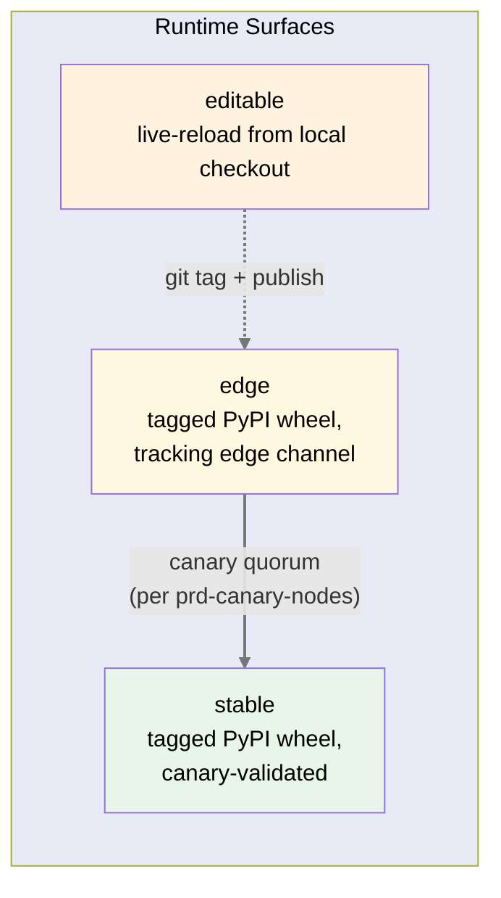
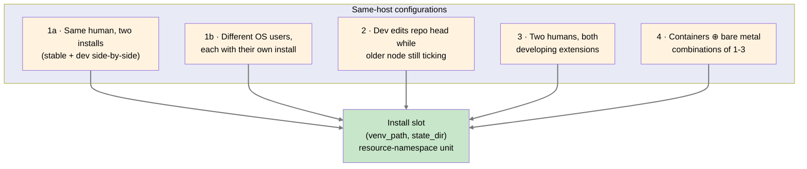
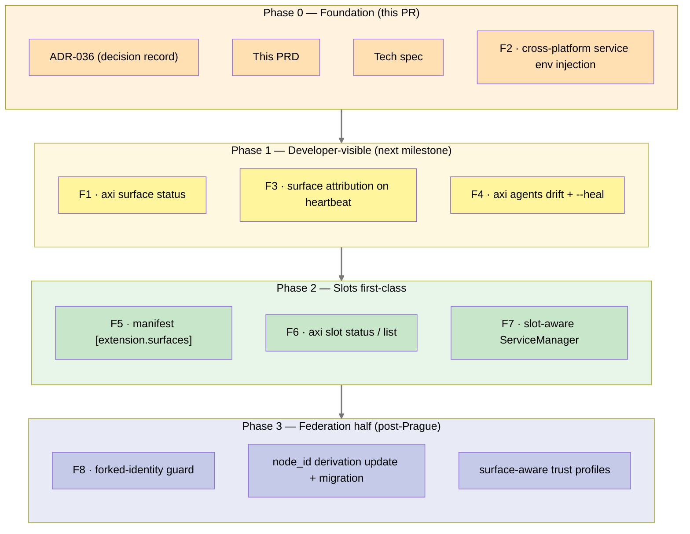

# Extension Runtime Surfaces + Install Slots

**Status:** Draft
**Author:** Benjamin Booth
**Date:** 2026-04-29
**Decision record:** [ADR-036](../adrs/adr-036-extension-runtime-surfaces.md)
**Tech Spec:** [spec-extension-runtime-surfaces.md](../specs/spec-extension-runtime-surfaces.md)

---

## Problem

Axiom today silently assumes a singleton install per OS user — one `~/.axi/`, one set of service labels, one venv, one node identity. That assumption is reasonable for a fresh canary node but breaks under every plural configuration that already exists in practice:

- A developer running editable from a local checkout (`pip install -e <repo>`) is operationally distinct from a canary running a tagged PyPI wheel — different live-reload semantics, different code-provenance, different attribution requirements — but Axiom has no first-class concept distinguishing them. RIVET's heartbeat signal looks identical whether it came from `editable` or from a canary node, and downstream consumers (federation peers, the canary subsystem, dashboards) can't tell.
- A second install on the same OS has no resource-namespace mechanism. Two installs collide on `~/.axi/`, on the launchd label `com.axi-platform.<agent>-agent`, and on any host-network port. The lived workaround — separate venv per worktree (`project_axiom_aeos_worktree_venv.md`) — is a convention, not architecture.
- Forked-identity from filesystem copy (`prd-federation §17.1 #5`) is currently a federation-grade fault waiting for the next `cp -r ~/.axi/` or container-image restore. There is no architectural mechanism that would prevent two distinct hosts from sharing a `node_id`.
- Extension developers face the same recurring set of concerns — "why is my agent's deployed plist stale?", "why does my heartbeat fail under launchd but work in my shell?", "how do I declare which surfaces my extension supports?" — with no platform-level answer. Each extension solves them ad hoc or doesn't solve them at all (RIVET discovered the silent-stale-plist case by accident in this session).

The recently-shipped canary-node infrastructure (`prd-canary-nodes`) covers the *release-channel* axis (edge → stable) cleanly, but stops at PyPI-installed nodes. The **`editable`** case — which is where every internal developer lives, and where most extension authors will live — is unmodeled.

## Vision

Axiom recognizes three runtime **surfaces** — `editable`, `edge`, `stable` — as first-class. Every install resolves to exactly one surface deterministically. Surface attribution propagates through every signal, log, attestation, and federated message. Extension behavior (and platform trust) can vary by surface where it matters; deterministic safety gates do not vary.

Orthogonally, Axiom recognizes the **install slot** as the unit of host-resource ownership. The default slot stays invisible (current behavior preserved). Non-default slots get prefixed state directories, prefixed service labels, and per-slot port allocation. Two installs on the same host coexist by construction, not by hoping nobody collides. Forked identity from filesystem copy becomes architecturally impossible without an explicit resumption ceremony.

Extension developers get a small, consistent set of platform tools (`axi surface status`, `axi slot status`, `axi agents drift`, manifest `[extension.surfaces]`) so they never have to invent surface-aware or slot-aware code in their own extension.

## Design Principles

- **Surfaces are detected, not configured.** The surface is determined by *how* the install was created. There is no flag the operator flips to "become editable"; running editable from a local checkout *is* `editable`.
- **Slots are inferred, not configured.** The default slot is invisible. Slot identity is `(venv_path, state_dir)`. Operators don't manage slots — they manage venvs and state dirs, which transitively define slots.
- **Singleton-install behavior is preserved exactly.** Default-slot installs see no behavioral change. Service labels, state directory paths, all CLI surfaces remain bit-identical.
- **Deterministic safety is constant across surfaces.** Signature verification, classification gates, RACI, OpenFGA — these run identically on `editable`, `edge`, and `stable`. Only LLM-mediated shaping and trust-policy heuristics may vary by surface.
- **`editable` is refused for classified workloads.** Uncommitted code is unattested code. The platform deterministically refuses to write a classification-marked fragment from a process where `surface == editable`. No flag, no override; classified work runs on `stable` or `edge`. (See ADR-036 §D11.)
- **Attribution is mandatory, never silent — and surface attribution carries signed evidence.** A `surface=stable` claim without a Sigstore wheel-signature reference is not a trust signal; it's a hint. Receiving peers verify wheel-signature presence (or, for `editable`, a signed declaration that no signed wheel is present). An unsigned surface claim is treated as untrusted regardless of value. (See ADR-036 §D6.)
- **Service environment is bounded, not pass-through.** PATH is intersected with a curated allow-list at install time; HOME is not default-injected; declared `[agent.env_inputs]` is the only path for an agent to read user config. (See ADR-036 §D9.)
- **Platform-managed services run sandboxed by default.** Systemd hardening directives, launchd `ProcessType=Background` plus a sandbox-exec hook, Windows AppContainer (Phase 3+). Manifests may relax via auditable declaration but cannot escape at runtime. (See ADR-036 §D10.)
- **Federation gateway redacts InstallContext correlation handles.** `surface` and `surface_evidence` cross cohort boundaries; `slot`, `install_id`, and any path metadata are redacted unless explicitly authorized. Topology stays inside the cohort that produced it.
- **Drift is detectable.** Mismatch between deployed-state and declared-manifest is a class of bug the platform owns. Extensions don't re-invent drift detection.
- **Multi-instance is supported, not warned-against.** Same-OS plurality is a normal configuration with platform support, not an edge case the user is told to avoid.
- **Forked identity requires ceremony.** No `cp -r ~/.axi/` produces two live nodes with the same `node_id`. The legitimate restore-from-backup path is the explicit, audited resumption ceremony from ADR-022 / `prd-federation §17.1 #10`.

---

## Surface Taxonomy



| Surface | Created by | Live-reload | Code provenance | Default for |
|---|---|---|---|---|
| `editable` | `pip install -e <local checkout>` | **Yes** | git working tree (may be dirty) | Workstation development |
| `edge` | `pip install axi-platform==<tag>` while tracking `edge` channel | No | Signed wheel from PyPI; tag matches a published release | Canary nodes |
| `stable` | `pip install axi-platform==<tag>` while tracking `stable` | No | Signed wheel; tag has been canary-validated and promoted | Production / customer nodes |

**Reserved sibling names** (not first-class today): `vcs-source` for `pip install git+https://…@<ref>`, `artifact-source` for unpublished wheels. The canary `edge` channel covers the operational version of these needs; first-class promotion happens only when a real use case demands distinguishing them.

### Surface Detection

```
1. Inspect importlib.metadata.distribution("axi-platform").read_text("direct_url.json")
2. If dir_info.editable == True → surface = `editable`
3. Else if upgrade-policy state file says channel == "edge" → surface = `edge`
4. Else → surface = `stable`
```

The result is cached for the lifetime of the process; surface does not change mid-process. The detection algorithm is a deterministic function of the local install state — no network calls, no operator input.

### Behavior Modulation by Surface

Three classes of behavior change by surface; one class never does.

| Class | Varies by surface? | Example |
|---|---|---|
| Deterministic safety gates | **No** | Signature verification, OpenFGA, RACI |
| Classification policy | **Refusal-only** | `editable` is refused for classified workloads; never relaxed (ADR-036 §D11) |
| Trust policy defaults | Yes | An `editable` peer's attestations (when accompanied by signed evidence of no-wheel) don't satisfy canary promotion quorum |
| LLM-mediated shaping | Yes | RIVET may route experimental Bonsai-first fixes more aggressively on `editable` |
| Federation visibility | Yes | An `editable` install may be opted-out of federation directory listings by default |
| Production-key handling | **Refusal-only** | An `editable` slot refuses to load any seed whose `SlotClaim` was signed under a non-`editable` surface (ADR-036 §D5a) |

The dividing line is the existing deterministic-vs-model-mediated boundary (`project_deterministic_vs_model_mediated.md`); this PRD does not move it, only extends it with surface-aware policy hooks.

---

## Multi-instance on the same OS

Four scenario classes Axiom must support without operator workaround. This formalizes the four classes the user surfaced 2026-04-29 and converges them on the **install slot** primitive.



### Scenarios

| # | Scenario | Failure today | Slot-aware design response |
|---|---|---|---|
| **1a** | Same human installs a second Axiom (e.g., stable + editable side-by-side for testing in real conditions) | `~/.axi/` collision; second `axi agents register` either silently rebinds the same launchd label or fails; LM/federation port collisions | Slot inferred from venv path; state dir = `~/.axi/<slot>/`; service labels prefixed `com.axi-platform.<slot>.<agent>-agent`; per-slot port range allocated at install time |
| **1b** | Different OS user installs their own Axiom on the same host | `~/Library/LaunchAgents/` is per-user so launchd labels don't collide, BUT both installs binding the same well-known port → collision; possible `~/.axi/` permission confusion if the host is a shared lab box with sloppy umask | Per-slot dynamic-port allocation with collision detection at install time. The slot model treats different-user installs as different slots automatically (different `state_dir` because different `$HOME`). |
| **2** | Developer wants to edit repo head on the same machine where an older node (stable or canary) is currently ticking | `pip install -e .` in the same venv silently replaces the running node's package version. Existing daemon's `ExecStart=<venv>/bin/axi …` now executes uncommitted code on next tick. **This was discovered live during the RIVET session 2026-04-28.** | Recommend (and lint-detect) **separate venv per slot**. The `axiom-aeos-tests/` worktree-with-its-own-`.venv` pattern (`project_axiom_aeos_worktree_venv.md`) becomes the documented convention. If the platform detects that an editable install is about to replace a slot whose ExecStart is currently scheduled, surface a loud warning and require an explicit `--force-overwrite-running-slot` flag. |
| **3** | Two humans, same shared OS, both developing extensions | Per-user isolation mostly works (separate `$HOME`), but: (a) shared system Python causes `pip install -e .` conflicts if either uses non-venv installs; (b) shared host port allocation; (c) federation membership ambiguity if both use the same `node_id` (rare but possible if seed-key was checked into a shared repo) | Same answer as 1b for ports + state dirs. PRD recommends **per-user venv** as the documented convention; non-venv `pip install` is explicitly discouraged with a one-line warning on `axi --version`. |
| **4** | Container × bare-metal × any of 1–3 | Containers isolate filesystem/PID/network (good), but: (a) host-net binding clashes if either uses host networking mode; (b) restoring a container image on a new host produces forked-identity (`prd-federation §17.1 #5`) trivially; (c) volume-mounted `~/.axi/` across host + container is two slots from two views | Slot resolver inside the container is independent (always `default` from container's POV — its venv path and state dir are container-local). Host-net mode requires explicit `--slot` to claim a port range. Restore-from-backup path is the resumption ceremony (ADR-022). |

### Multiple Axiom-portfolio products on the same host

Distinct from the four scenarios above (which are about install instances), this section addresses the case where N ≥ 2 portfolio products (axi-platform, example-consumer, plus future X-Foo / Y-Bar) are present on the same host — either layered into one venv or installed in separate venvs.

**Discovery — extensible, not hardcoded.** Each portfolio package self-declares membership via Python entry-points:

```toml
[project.entry-points."axiom.portfolio_member"]
axi-platform = "axiom.infra.branding:_portfolio_metadata"
```

The metadata callable returns `{package_name, product_name, wrapper_binary}`. axi-platform never needs to know about future X-Foo or Y-Bar — they declare themselves the same way and the runtime discovers them via `importlib.metadata.entry_points`.

**Two layouts, both supported:**

| Layout | What the operator gets | When this is right |
|---|---|---|
| **N products, one venv** (`pip install axi-platform x-foo y-bar`) | One slot. One Background Service. One identity. ALL agents from ALL N products dispatch from the single timer. **One** Login Items entry, brand-named. Brand priority: most-recently-installed wins by default; operator override planned for 0.12.1+ via `axi config set primary-brand`. | Operator wants a single "portfolio install" — one node hosting multiple product surfaces. |
| **N products, N venvs** (per-product virtualenvs) | N slots per ADR-036. N Background Services. N identities. **N** Login Items entries — but each is brand-distinct ("X-Foo-Background-Service", "Y-Bar-Background-Service", "Z-Baz-Background-Service"). | Operator wants isolation — separate identities for separate purposes. The N-entries result is the operator's explicit choice, not a regression. |

**Cross-brand cleanup.** When the active brand in a venv changes (e.g., `pip install x-foo` over an existing axi-platform install), `axi agents register` automatically:

1. Discovers all installed portfolio members via the entry-points group.
2. Removes any per-agent plists from any portfolio member (pre-0.11.1 cleanup).
3. Removes Background Service plists for any *other* portfolio brand (cross-brand cleanup) — the current brand wins.
4. Installs the current brand's Background Service plist.

Result: even with multiple portfolio packages installed in one venv, exactly one Background Service entry exists at any time, named after the current brand.

**Wrapper-binary fallback.** Each portfolio package is *expected* to install its own console_script wrapper (e.g., `Axiom-Background-Service` for axi-platform, `X-Foo-Background-Service` for x-foo). If the current brand's wrapper isn't installed (e.g., a future product hasn't yet declared its own console_script), the platform falls back to `Axiom-Background-Service` (always present because axi-platform is a transitive dependency of every portfolio package) with a one-line warning at install time. The fallback ensures the registration succeeds even in the interim state where a new portfolio product is partially deployed.

**What the host admin sees** is exactly what the operator believes they installed — "X-Foo-Background-Service" for an X-Foo install, "Axiom-Background-Service" for plain Axiom. The display name carries the support contact (per Ben 2026-04-29: "people responsible for the host system know who to talk to for help").

### Convention: one venv per slot

The platform treats a venv with two coexisting `axi-platform` installs as a configuration error. Specifically:

- `axi --version` warns when the resolved `axi-platform` distribution is editable AND a non-editable `axi-platform-*.dist-info` exists in `site-packages`.
- `axi slot status` flags two slots that share the same venv as `slot collision: shared venv`.
- The recommended pattern (already in memory, now documented): one git worktree per active line of work, each worktree with its own `.venv`, each `.venv` activated by direnv or equivalent.

This is convention-with-platform-support, not enforcement; the platform refuses only the specific case where a new editable install would replace a currently-scheduled daemon's ExecStart.

---

## Extension Developer Concerns

Five concerns that recur across extensions and that the platform should answer once.

### EDC-1 · Surface awareness

An extension may want to behave differently on `editable` vs `stable` (e.g., enable experimental features only on `editable`; refuse classified workloads on `editable`). Today there is no platform API for this.

**Resolution:** `axi surface status` (F1) provides programmatic + CLI access. Extensions read it via `axiom.surface.current()`. Manifests may declare `[extension.surfaces].supports` (F5). The platform refuses to load an extension on a surface it has explicitly declared unsupported.

### EDC-2 · Drift between manifest and deployed service

When an extension author edits `axiom-extension.toml`'s `heartbeat_command`, the deployed launchd plist still fires the old command until someone re-registers. Silent staleness — exactly the class of bug `prd-federation §17.1 #2` ("partially functional nodes") warns against. Discovered live in the RIVET session 2026-04-28.

**Resolution:** `axi agents drift` (F4) detects mismatches deterministically; `--heal` rewrites idempotently. `axi agents status` includes a one-line drift warning when present. Drift detection costs ~10ms; runs on every status check.

### EDC-3 · Cross-platform service environment, bounded by contract

An agent that calls `subprocess.run(["gh", …])` works in the developer's shell (PATH includes `/opt/homebrew/bin`) but fails under launchd (PATH minimal). Same risk on systemd user services and Windows Task Scheduler. Discovered live during the RIVET session 2026-04-28.

A naive fix — copy `os.environ["PATH"]` into the plist — solves the immediate gap but persists shell PATH quirks (`.` in PATH, writable `/tmp/bin`) into a plist that survives reboots. That's a TOCTOU exfiltration channel and a topology-leak forensic artifact.

**Resolution:** Platform-managed service env, bounded (F2). The launchd / systemd / Windows providers all enforce the same contract per ADR-036 §D9:
- PATH is the intersection of `os.environ["PATH"]` and a curated allow-list (`/usr/bin`, `/usr/local/bin`, `/opt/homebrew/{bin,sbin}`, `~/.local/bin`, `<venv>/bin`). `.`, `~`, and any world-writable directory are refused with a loud install-time warning.
- HOME is **not** default-injected. Extensions declare specific config paths via `[agent.env_inputs]` and the platform binds them as discrete env vars.
- LANG/LC_ALL pass through. All other env is empty unless declared.

Extensions don't need to know per-provider env semantics; they get exactly what they declared.

### EDC-3a · Sandbox-by-default

A daemon polling external APIs and running heuristic LLM diagnosis should not have unbounded read access to the user's filesystem. The platform ships per-provider hardened defaults (ADR-036 §D10):
- Linux/systemd: `NoNewPrivileges`, `PrivateTmp`, `ProtectSystem=strict`, `ProtectHome=read-only`, `RestrictAddressFamilies=AF_UNIX/AF_INET/AF_INET6`, etc.
- macOS/launchd: `ProcessType=Background` + sandbox-exec hook (permissive default profile in Phase 0; tightened in Phase 2/3).
- Windows: AppContainer integration tracked as Phase 3+ work.

Extensions may relax (but not remove) the defaults via auditable manifest declaration in `[agent.sandbox]`. Each relaxation is install-time logged and surfaced in `axi agents status`. Runtime configuration cannot escape the sandbox.

### EDC-4 · Surface attribution on signals

An extension publishing a heartbeat signal, an attestation, or any federated artifact today carries no surface metadata. Downstream consumers can't distinguish an `editable` signal (developer machine, possibly from uncommitted code) from a `stable` signal (canary-validated production). Federation trust-policy hooks have nothing to gate on.

**Resolution:** Every signal/log/attestation carries an `InstallContext` (F3). RIVET's heartbeat JSONL ships it first; the schema extends to MemoryFragment provenance, federated attestations, and audit logs. Downstream policy reads it; extensions just emit events as usual.

### EDC-5 · Slot awareness

An extension running in a non-default slot must read state from `~/.axi/<slot>/`, register services with the slot prefix, and bind to its allocated port range. Today an extension hardcoding `~/.axi/` would collide with a sibling slot.

**Resolution:** Slot is read once via `axiom.slot.current()` and used by the platform paths/services APIs (`get_user_state_dir()`, `ServiceManager`). Extensions that use the platform APIs are slot-aware automatically. Extensions that hardcode paths are flagged by `axi ext lint`.

---

## Capability Inventory (the eight features)

The features formalize what the principles require. Each one closes one or more EDC concerns or scenario classes.

| # | Feature | What it does | Closes |
|---|---|---|---|
| **F1** | `axi surface status` | Read-only: prints current surface, per-extension install mode (editable / PyPI), version, source path | EDC-1 |
| **F2** | Cross-platform bounded service env + sandbox-light | All three providers enforce the bounded PATH allow-list, no-default-HOME, and per-provider sandbox-by-default (systemd hardening directives, launchd ProcessType+hook, Windows TODO) | EDC-3, EDC-3a |
| **F3** | Surface attribution on heartbeat signals | RIVET's JSONL entries gain `surface`, `slot`, `install_id` fields. Same schema extends to federated attestations later. | EDC-4 |
| **F4** | `axi agents drift` + `--heal` | Detects deployed-vs-manifest mismatches; remediates idempotently; warning surfaces in `axi agents status` | EDC-2 |
| **F5** | Manifest `[extension.surfaces]` block + `axi ext lint` check | Optional declaration of supported surfaces; platform refuses load on unsupported surface; lint warns on hardcoded `~/.axi/` paths | EDC-1, EDC-5 |
| **F6** | `axi slot status / list` | Read-only: shows discovered slots on host, current slot, venv path, state dir, services, port range | scenarios 1a/1b/3/4 |
| **F7** | Slot-aware service naming in `ServiceManager` | ServiceManager accepts a slot prefix; default slot keeps current naming for back-compat | scenarios 1a/2/4 |
| **F8** | Forked-identity guard on `axi nodes init` | Refuses to initialize a `node_id` that already exists in any local slot with different `(venv_path, state_dir)`; redirects to resumption ceremony | scenario 4 + `prd-federation §17.1 #5/#10` |

Acceptance criteria, data models, and CLI grammars are in the [tech spec](../specs/spec-extension-runtime-surfaces.md).

---

## Cross-Cutting Updates

This PRD touches three existing documents. Each update is a small, targeted edit, not a restructure.

### `prd-federation.md §17`

- **Row #5 (Forked identities):** status moves from `📋 spec'd` to `🟡 partial` — F8 closes the *same-host accidental* case via `SlotClaim` collision detection. **Cross-host seed-key theft remains the threat-model boundary**; closing it requires peer-side gossip of `(node_id, slot_id, transport_key)` tuples, deferred to a follow-on ADR (post-Prague). The PRD update flags this honestly rather than overclaiming.
- **Row #7 (Dev/prod commingling):** status moves from `⬜ TODO` to `📋 spec'd`. Surface attribution + signed surface evidence + per-cohort federation membership policy are the implementation.
- **Row #10 (Reinstall from backup):** design response unchanged; ADR-036 reaffirms the resumption ceremony as the single legitimate path to re-using a `node_id`. The ceremony now also re-signs the `SlotClaim` for the new `(venv_path, state_dir)`.

### `prd-canary-nodes.md`

- Add a single sentence in the channels section: "A third surface, `editable`, exists for editable installs and is out of scope for canary promotion. See ADR-036."
- No restructuring; canary protocol is unchanged.

### `prd-agents.md §"Always-On Agent Services"`

- Add a "Drift detection" subsection (~10 lines) referencing F4 and the deployed-vs-declared check.
- Add a one-line note that `ServiceManager` is slot-aware and that the default slot preserves current naming.

---

## Non-Goals

- This PRD does not redesign the canary protocol. `edge → stable` promotion is owned by `prd-canary-nodes`.
- This PRD does not introduce new federation primitives. It uses existing identity (ADR-022) and trust-graph (ADR-028) primitives, plus the existing resumption ceremony.
- This PRD does not add a slot-management lifecycle CLI (`axi slot create/use/delete`). F6 ships read-only `slot status / list`. Whether write commands become first-class depends on whether multi-slot installs are common enough to warrant explicit management; until then, slot creation is implicit.
- This PRD does not change the singleton-install user experience. Default slot remains invisible; surface detection is automatic; `axi --version` output is unchanged.

---

## Success Metrics

| Metric | Target |
|---|---|
| Default-slot single-install user-visible regressions | **Zero** (back-compat is mandatory) |
| Drift false-positive rate | <5% (drift detector triggers only on real mismatches, not in-flight upgrades) |
| Time-to-detect manifest drift after edit | <5min (next `axi agents status` invocation surfaces it) |
| `editable` signals incorrectly counted toward canary quorum | **Zero** (architecturally impossible) |
| Forked-identity events post-F8 | **Zero** (architecturally impossible without resumption ceremony) |
| Cross-platform service env coverage | All three providers (launchd, systemd, Windows) ship F2 simultaneously |
| Multi-instance same-host smoke (two slots, both healthy) | Green on macOS + Linux + Windows in CI |
| Documentation coverage | Every EDC has a corresponding worked example in the spec |

---

## User Stories

- As a **workstation developer**, I can run a stable canary node and an editable dev install side-by-side without resource collision, so I can iterate against real federation traffic without breaking my canary.
- As a **shared-lab operator**, I can have multiple humans install Axiom on the same host without their installs interfering, so the lab box is genuinely usable by the team.
- As an **extension author**, I get one platform answer for "which surfaces does my extension support" rather than re-inventing surface detection per-extension.
- As an **extension author**, when I edit my manifest's `heartbeat_command`, I get a warning on the next status check that my deployed plist is stale, instead of silently running the old command for weeks.
- As an **extension author**, my agent's launchd-fired tick can find `gh`, `glab`, and other PATH-resolved binaries without me hardcoding paths or learning per-provider env semantics.
- As a **federation peer**, I can distinguish an `editable` attestation from a `stable` attestation in my trust-policy evaluation, so I never count a developer's signal toward production promotion.
- As RIVET, every heartbeat signal I emit carries surface and slot, so the canary subsystem and downstream consumers know exactly which install produced it.
- As a **container operator**, I can restore a container image on a new host knowing the new install gets a different `node_id` automatically, instead of producing a forked-identity fault.
- As a **security reviewer**, I can audit which surface produced any given memory fragment, so `editable` writes can be flagged for additional scrutiny in classified contexts.

---

## Phasing



| Phase | Scope | Gate |
|---|---|---|
| **Phase 0 — Foundation** | ADR-036 + this PRD + tech spec + F2 (cross-platform service env injection). No user-visible behavior change other than launchd-fired services now find `gh`/`glab`/etc. | This PR. |
| **Phase 1 — Developer-visible** | F1 (`axi surface status`), F3 (surface attribution on heartbeat), F4 (`axi agents drift`). All read-only or back-compat. | Next milestone after Phase 0 lands. |
| **Phase 2 — Slots first-class** | F5 (manifest `[extension.surfaces]`), F6 (`axi slot status / list`), F7 (slot-aware ServiceManager). Default slot remains bit-identical. | After Phase 1 has burned in for a few weeks. |
| **Phase 3 — Federation half** | F8 (forked-identity guard), `node_id` derivation update with migration, surface-aware trust profiles in federation peer evaluation. Gated on Prague-class deployments stabilizing per `feedback_freeze_foundation_during_delivery.md`. | Post-Prague (after early-June 2026 cohort). |

Phase 0 is the only phase that touches every install. Phases 1–2 are opt-in (the features become available; nothing forces extensions to adopt). Phase 3 is the federation half and waits for the Prague window to clear.

---

## Risks & Open Questions

| Risk | Mitigation |
|---|---|
| Operators surprised by per-slot state-dir paths after creating a second slot | First-creation of a non-default slot prints the resolved path explicitly; `axi slot status` always shows it. |
| Extension declares narrow `[extension.surfaces]` and breaks under a real-world install we didn't anticipate | Default = all surfaces; declaration is opt-in; lint check warns, doesn't gate. |
| Drift detector false positives during in-flight upgrades | Detector is read-only; remediation requires `--heal` flag; never auto-modifies during status. |
| Bounded PATH breaks tools installed via `pyenv`/`asdf`/non-allow-listed prefixes | Documented allow-list; explicit add via manifest `[agent.env]`; install-time loud warning when a captured path is dropped. |
| Sandbox defaults break extensions that quietly read paths outside their state dir | Clear error message identifies the path; manifest relaxation in `[agent.sandbox]` is a documented one-line edit; audit log records all relaxations. |
| `editable`-classified-refusal blocks an experimental research workflow | Intended behavior. The refusal is deterministic by design; the workflow's escape hatch is to commit + tag + publish the code, then track the tag (which makes the work auditable, the actual goal). |
| Surface attribution leaks `editable` into federation traffic and downstream peers don't yet honor it | Phase 0/1 ships the attribution; Phase 3 ships peer-side honoring. Pre-Phase-3 peers receive the field as additive metadata they can ignore — `editable` simply doesn't gain trust signal until peers consume it. |
| Extension authors hardcode `~/.axi/` paths and break on non-default slots | `axi ext lint` flags hardcoded paths in extension code; documented anti-pattern; fix path is `from axiom.infra.paths import get_user_state_dir`. |
| Container slot resolver gets confused by host-volume-mounted `~/.axi/` | Slot resolver uses `(venv_path, state_dir)` not just state_dir; container's venv path is container-local even when state dir is host-mounted; the two slots are distinct and the resolver handles it. |
| Cross-host seed-key theft producing forked identity | **Not closed by this PRD.** Tracked as a follow-on ADR (post-Prague). The seed-key remains the threat-model boundary; HSM-backed seed storage and rotation cadence are separate workstreams. PRD flags this honestly rather than implying F8 closes it. |

### Open questions

- **Slot lifecycle CLI.** F6 ships read-only `axi slot status / list`. Whether write commands (`axi slot create / use / delete`) become first-class depends on adoption; until then, slot creation is implicit (a new venv + state dir creates a new slot).
- **Cross-host forked-identity ADR.** The follow-on ADR specifies peer-side gossip of `(node_id, slot_id, transport_key)` tuples and federation-wide collision detection. Post-Prague.
- **Sandbox profile authoring.** Phase 0 ships systemd hardening directives; macOS sandbox-exec emits a permissive default with the hook in place. Phase 2/3 authors per-agent-class profiles (RIVET vs. TIDY have different needs).
- **Telemetry of surface mix in the wild.** Should the platform optionally report per-surface usage to the canary-attestation sink for ecosystem health? Privacy-sensitive; defer until canary attestation has matured.
- **HSM-backed seed storage.** Out of scope for this PRD; tracked as an independent security workstream.

**Resolved during critique pass:**
- ~~Cross-slot federation membership~~ — RESOLVED: default forbidden (ADR-036 §D5b), per-cohort override with audit trail.
- ~~Surface + classification interaction~~ — RESOLVED: `editable` deterministically refused for classified workloads (ADR-036 §D11).
- ~~Whether to mix `slot_id` into `node_id` derivation~~ — RESOLVED: NO. `node_id = H(pubkey)` unchanged; slot identity is a separately-signed `SlotClaim` (ADR-036 §D4).

---

## Acceptance & Rollout

- **Sign-off:** Ben (product + eng lead). No external sign-off required for Phase 0 (internal architecture).
- **Rollout:** Phase 0 ships in the next axi-platform tag. Default-slot back-compat means existing installs upgrade with no user action. Non-default-slot users (currently zero in the wild) opt in by creating a second venv.
- **Rollback criteria:** Any default-slot regression rolls back. The `surface_compliance` test marker (introduced in ADR-036) gates all phases.
- **Observability:** F3's heartbeat attribution lights up in RIVET's JSONL within minutes of Phase 1 deploy. F4's drift counter (count of detected-vs-healed events) becomes a release-readiness signal.

---

## Related Documents

- [ADR-036 — Extension Runtime Surfaces + Install Slots](../adrs/adr-036-extension-runtime-surfaces.md) — the decision record this PRD operationalizes.
- [Tech spec](../specs/spec-extension-runtime-surfaces.md) — implementation details, data models, API contracts, CLI grammars.
- [prd-canary-nodes](prd-canary-nodes.md) + [spec-canary-nodes](../specs/spec-canary-nodes.md) — `edge` and `stable` channel taxonomy this PRD extends with `editable`.
- [prd-federation §17](prd-federation.md) — the 16 install/upgrade scenarios; this PRD updates rows #5, #7, #10.
- [prd-agents](prd-agents.md) §Always-On Agent Services — gains a drift-detection subsection.
- [ADR-019](../adrs/adr-019-node-profiles.md) — node profiles (Edge/Workstation/Server/Platform), orthogonal to surface and slot.
- [ADR-022](../adrs/adr-022-federation-identity-roots-and-membership-separation.md) — federation identity; resumption ceremony for backup-restore.
- [ADR-031](../adrs/adr-031-extension-self-containment.md) — extension self-containment; surface declarations live in the extension manifest.
- [spec-aeos-0.1.md](../specs/spec-aeos-0.1.md) — extension manifest schema; gains optional `[extension.surfaces]` block.

_Copyright (c) 2026 The University of Texas at Austin and B-Tree Labs. Apache-2.0 licensed._
