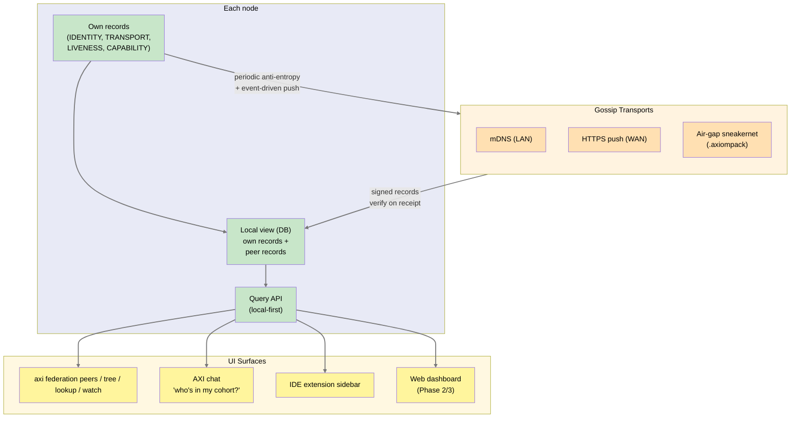

# Federation State Propagation, Discovery, and Visualization

**Status:** Draft
**Author:** Benjamin Booth
**Date:** 2026-04-29
**Decision record:** [ADR-037](../adrs/adr-037-federation-state-propagation.md)
**Tech Spec:** [spec-federation-state-propagation.md](../specs/spec-federation-state-propagation.md) *(planned)*
**Companion:** [ADR-038 — Leader-Directed Onboarding](../adrs/adr-038-leader-directed-onboarding.md) *(planned)* depends on Phase 1 of this PRD

---

## Problem

Three apparently-separate problems converge on a single missing primitive:

1. **Operational observability is fragile.** A self-hosted node's TIDY daemon failed to start on every tick for **14 days** (2026-04-15 → 2026-04-29) and nothing detected it. Self-monitoring catches *unhealthy* agents but not *missing* ones. The lived-through cost was real — Tidy's reports were silently absent, and "Tidy silent" was indistinguishable from "Tidy healthy" until someone (me) went looking. A friend would have noticed.

2. **Federation discovery is fragmented.** Today we have: mDNS for LAN-local discovery (`prd-federation §17.1 #16`); a cohort registry per ADR-022; a trust graph per ADR-028; canary attestation sinks per `spec-canary-nodes` §4; per-node state in `~/.axi/`. Each answers a slice of "who is out there?" None compose. Asking "is `student@example-org` already a node, and what spec are they running?" requires knowing which mechanism to consult.

3. **There is no place for the operator to *see* their federation.** Every UI surface — CLI, chat/AXI, IDE extension, post-pilot web dashboard — would have to compose those fragmented sources independently. Surfaces would disagree. The operator has no canonical view of "where am I, who am I peered with, what does the org tree look like from my position?"

The leader-directed onboarding work (ADR-038, in flight) needs all three answered. So does the buddy-detection requirement from `feedback_agent_liveness_peer_observable.md`. So does the pilot classroom deployment that needs an instructor dashboard. Three force vectors all push toward the same primitive.

## Vision

Axiom federation state is a **single, signed, gossip-replicated directory of typed records** — DNS-shaped, not blockchain-shaped. Every node publishes its state into the directory; every peer maintains a local view of what it's been told; every UI surface renders the same underlying queries.

Discovery and state propagation collapse onto this primitive. mDNS becomes a *transport*. The cohort registry becomes a *record type*. Liveness becomes a *queryable property*, so buddy detection ("show me agents whose last successful tick is older than 2× their declared interval") is a one-line query against existing data. Leader-directed onboarding's "is this human already a node?" is the same query.

The operator gets a queryable, visualizable federation. Every surface — `axi federation peers`, `axi chat`'s natural language, the post-pilot dashboard — answers from the same directory. Surfaces never disagree. The operator's view defaults to **immediate cohort + one hop**, with each ring **auto-labeled** by its most distinguishing characteristic, so a glance reveals "you, your classroom, your institution, your federation" without having to know how to phrase a query.

## Design Principles

- **Signed records, gossip-replicated, eventually consistent.** Per ADR-037 §D1. Not blockchain. Not central registry. The shape that fits a federation that is operationally cooperative within cohorts and asymmetrically trusted to cohort roots.
- **Discovery and state are one primitive.** A peer's TRANSPORT record *is* its discovery entry. mDNS *is* a gossip transport. The cohort registry *is* a record type. No separate mechanisms for the same question.
- **Authority is per-record-type.** A node is authority for its own IDENTITY/TRANSPORT/LIVENESS; a cohort root is authority for COHORT_MEMBERSHIP. Authority is *not* "whoever is holding the record"; signature verification is mandatory on every read.
- **Local-first.** Every peer's local view is durable on disk and answers queries without network availability. The directory degrades to "what I last knew" rather than "I can't answer anything." This is the property that matters during partition, intermittent connectivity, and air-gap.
- **Visibility is policy-bounded.** Cohort membership × classification policy gates what each peer sees. The directory is *not* a single global namespace. The federation gateway redacts InstallContext correlation handles per ADR-036 §D6 when records cross cohort boundaries.
- **Buddy detection is a query, not a service.** Every agent publishes `LIVENESS`; sibling agents publish observed-liveness; stale-by-more-than-2×-interval is the failure signal. No new "monitor service" is needed; existing data answers.
- **One directory, many surfaces.** Every UI surface renders the same queries. CLI, chat, dashboard, IDE — they always agree, by construction.
- **Default views are auto-labeled and self-explanatory.** Operators don't need to learn query syntax to see their federation. `immediate + 1 hop` with each ring labeled by its most distinguishing characteristic is the default; advanced filters are opt-in.
- **Custom store, no library lock-in.** Per ADR-037 §Open items, Phase 1 ships a custom signed-record store with last-writer-wins-per-(type, key, authority) merge semantics. Avoids CRDT-library / libp2p ecosystem dependency for a Tier-0 primitive.

---

## The Directory at a Glance



---

## Record Types (Phase 1 set)

| Type | Authority | Carries | TTL | Why this is needed in Phase 1 |
|---|---|---|---|---|
| `IDENTITY` | self (Ed25519-signed) | `node_id`, `pubkey`, `slot_id`, surface, surface_evidence (per ADR-036 §D6) | days | The base record; everything else references a node by `node_id`. |
| `TRANSPORT` | self | reachable address(es), protocol, port, mDNS hint | minutes | Discovery (replacing mDNS as a separate concern). |
| `LIVENESS` | self + observed | per-agent `(agent_name, last_successful_ts, expected_interval_secs)`; observed records carry observer signature | minutes | Buddy detection; the headline 2026-04-29 lesson. |
| `COHORT_MEMBERSHIP` | cohort root | `(cohort_id, node_id)` pair, root-signed | days | Lets the directory subsume the legacy cohort registry. |
| `CAPABILITY` | self | extension manifest summaries (name, version, kind, declared `[extension.surfaces].supports`) | hours | Lets leader-onboarding (ADR-038) query "is this node running the spec the leader requires?" |
| `RELATIONSHIP` | self | declared peer relationships (this node's peers, leader, followers) | hours | Lets the visualization render org trees and the chat surface answer "who's my leader?" |

Reserved for Phase 2:
- `CLASSIFICATION` — what classification level(s) this node operates at (touches `spec-classification-boundary.md`; bigger interaction).
- `REVOCATION` — quarantine / revocation events; supersedes other records from the revoked subject. Wired to ADR-024's revocation channel.
- Extension-defined types — opens the type registry to extension manifests.

Record format (sketch — full schema in tech spec):

```json
{
  "type": "LIVENESS",
  "schema_version": 1,
  "subject_node_id": "n_a1b2c3...",
  "authority_node_id": "n_a1b2c3...",   // self or cohort root depending on type
  "payload": {
    "agent_name": "tidy",
    "last_successful_ts": "2026-04-29T19:01:22Z",
    "expected_interval_secs": 300
  },
  "signed_at": "2026-04-29T19:01:22.142Z",
  "signature": "<Ed25519(payload || signed_at)>",
  "ttl_secs": 600
}
```

---

## Discovery as a Query

Today's discovery mechanisms are absorbed into the directory:

| Today | Tomorrow (post-Phase-1) |
|---|---|
| `axi nodes ls` reads cohort registry | Queries `COHORT_MEMBERSHIP` + `IDENTITY` from the directory |
| mDNS advertises on LAN | mDNS gossips `TRANSPORT` records into the directory; LAN discovery = query `TRANSPORT WHERE transport=mdns AND first_seen > now - 1h` |
| Manual peer add via invite token | Invite token carries a starter `IDENTITY` + `TRANSPORT` + `COHORT_MEMBERSHIP` set; consuming the token writes to the local view |
| Canary attestation sinks (pack server / GitHub / gossip) | Attestations become a record type (`ATTESTATION`, deferred to Phase 2 with the canary work) consumed by the same gossip layer |

The operator workflow doesn't change for the common case (`axi nodes ls`, `axi connect <preset>`); the underlying answer just comes from a unified source.

---

## Visualization across UI Surfaces

Every UI surface renders the same query. The contract is: *if the data is wrong, it's wrong everywhere*. We never want surfaces to disagree because they consult different sources.

### CLI surface

```
$ axi federation status
You are: ben@example-org on dev-node-1 (slot=default, surface=editable)
  Identity: n_a1b2c3...d4e5
  Transport: example-host:41883 (HTTPS)

Ring 0 (self):
  ben@example-org — 1 node (dev-node-1)

Ring 1 (immediate cohort: "stem101-2026" — 15 nodes):
  instructor@example-org (instructor) — healthy
  ben@example-org (TA) — healthy
  12 students — 11 healthy, 1 silent (student-7@example-org, tidy silent 3h)

Ring 2 (peer cohorts within "example-org" federation — 4 cohorts, 47 nodes):
  stem101-2026 (current)
  research-cohort-a (12 nodes)
  classroom-cohort-b (8 nodes)
  org-internal (12 nodes)

(Use --depth N to expand further; --filter to scope.)
```

```
$ axi federation peers
Cohort: stem101-2026 (15 nodes)
  ✓ researcher@example-org    Workstation     tidy:14s ago    scan:9s ago    press:11s ago    classroom:0.4.1
  ✓ ben@example-org        Workstation     tidy:42s ago    scan:38s ago   rivet:51s ago classroom:0.4.1
  ✓ student-1@example-org Edge            tidy:1m ago     scan:55s ago                  classroom:0.4.1
  ⚠ student-7@example-org Edge            tidy:3h ago     scan:3h ago                   classroom:0.4.1
  ... (12 more)
```

```
$ axi federation tree --depth 3
ben@example-org (you, dev-node-1)
└── stem101-2026 (immediate cohort, 15 nodes, all educational)
    └── example-org (federation, 4 cohorts, 47 nodes)
        ├── research-cohort-a (12 nodes)
        ├── classroom-cohort-b (8 nodes)
        └── org-internal (12 nodes)
```

```
$ axi federation lookup student-7@example-org
node_id: n_e5f6g7...h8i9
transport: lab-7.example.org:443 (HTTPS, last seen 3h ago)
surface: stable (Sigstore-verified for axi-platform 0.10.11)
slot: default
cohort_membership: [stem101-2026]
liveness:
  tidy:     2026-04-29T16:01:22Z (3h 12min ago, expected every 5m) — ⚠ STALE
  scan:    2026-04-29T16:01:25Z (3h 12min ago, expected every 30s) — ⚠ STALE
  press:    2026-04-29T16:01:22Z (3h 12min ago, expected every 5m) — ⚠ STALE
capabilities:
  classroom v0.4.1, chat v0.4.0, signals v0.4.0
relationships: peer-of [researcher@example-org, ben@example-org, ...11 students]
```

```
$ axi federation watch
[19:14:22] LIVENESS: tidy on researcher@example-org ticked successfully
[19:14:23] LIVENESS: press on researcher@example-org ticked successfully
[19:14:30] CAPABILITY: student-3@example-org updated chat v0.4.0 → v0.4.1
[19:14:42] LIVENESS: tidy on ben@example-org ticked successfully
...
```

### Chat / AXI surface

Natural language access through the existing chat agent:

> **You:** Who's in my cohort?
>
> **AXI:** You're in `stem101-2026` with **15 members**: the instructor (at the partner institution), you (TA), and 12 students. Everyone's healthy except `student-7@example-org` whose Tidy agent has been silent for 3 hours — Scan's quiet too. Want me to look at recent journal entries on student-7 to see what's wrong?

> **You:** What does the org tree look like from where I am?
>
> **AXI:** Three rings outward from you:
> - **Ring 0:** you on dev-node-1 (your workstation, editable surface).
> - **Ring 1:** `stem101-2026` cohort (15 educational nodes, all running classroom v0.4.1).
> - **Ring 2:** `example-org` federation (4 cohorts, 47 nodes — this is the institutional parent).

> **You:** Is `student@example-org` already a node? My spec is classroom v0.4.1.
>
> **AXI:** Yes — `student@example-org` resolves to **3 nodes** in the directory: `student-1`, `student-2`, `student-7` at the partner institution. All three are running classroom v0.4.1. `student-7` has been silent for 3h — you may want to check before sending an invite.

### IDE extension sidebar (Phase 1 stub; full Phase 2)

Sidebar widget showing immediate peers + their liveness. Click-to-jump to lookup. Stub in Phase 1 (just the peer list), full rendering in Phase 2.

### Web dashboard (Phase 2/3, post-pilot)

Force-directed graph of the visible federation. Org-tree view. Per-node detail card. Live update on gossip. Out of scope for Phase 1.

### Auto-labeled rings (the new Phase 1 feature)

When the operator says `axi federation status` or `axi federation tree`, each ring (depth tier) is auto-labeled by its **most distinguishing characteristic**. Algorithm sketch:

1. For each ring, compute the distribution of attributes across members:
   - cohort_id (most common cohort_id is the natural label if uniform)
   - capability set commonality (do they all have classroom? all have research?)
   - surface distribution (are they all stable? all editable?)
   - identity affiliation (do they share an institutional suffix in `accountable_human_id`?)
   - geographic / network locality (where reachable from common transport?)
2. Pick the attribute with **highest information gain** for distinguishing this ring from siblings — i.e., the attribute that best answers "what makes this ring this ring?"
3. Render the label compactly: `(immediate cohort: "stem101-2026" — 15 nodes)`, `(peer cohorts within "example-org" federation — 4 cohorts, 47 nodes)`, `(institutional ring — 47 nodes from example.org)`.

The label is *derived*, not configured. Operators don't have to name their rings; the directory infers a useful name from observable structure. Three labels-per-ring max in display (most distinguishing, sub-distinguishing, count). Full attribute map available via `--explain`.

This is what makes the default view self-explanatory rather than requiring operators to learn query syntax.

---

## Buddy Detection Use Case (worked end-to-end)

The 2026-04-29 self-hosted-node incident, recast under the directory:

**Today (without directory):**
1. TIDY on the node fails to start every 5min for 14 days.
2. Tidy's report dir doesn't get new entries; nothing notices.
3. Operator (eventually) checks Tidy's reports manually, finds them stale, investigates via `journalctl`.

**Post-Phase-1 (with directory):**
1. Each tick, TIDY publishes `LIVENESS(agent=tidy, last_successful_ts=now, expected_interval=300)`.
2. TIDY fails to start → no new LIVENESS record published. The latest record stays at the previous successful-ts.
3. Sibling agents on the node observe Tidy's silence: TRIAGE (or any sibling) publishes `LIVENESS(observer=triage, observed=tidy, last_observed_ts=now-Δ, gap=increasing)`.
4. Federation peers gossip both records. Within 30s of the first missed tick, the directory shows tidy's last_successful_ts is older than 2× expected interval.
5. Any peer running `axi federation status` sees `⚠ node: tidy silent 11m`. AXI surfaces the same on the chat surface. The IDE sidebar lights up the node entry yellow.
6. After a configurable threshold (e.g., 5 missed ticks = ~25min for tidy), the directory escalates from yellow to red and publishes a `BUDDY_ALERT` derived record (Phase 2) that surfaces in alert sinks.

The operator never has to write a query. The default surface tells them.

---

## Cohort Registry Migration

The cohort registry per ADR-022 is the legacy authority for "who's in cohort X." Phase 1 migrates this to the directory:

**Phase 1.0 (this PR ships):**
- Cohort registry remains authority-of-record.
- Directory ingests cohort registry contents at startup as `COHORT_MEMBERSHIP` records.
- Cohort root signs the records on ingestion.
- Directory updates on registry change.
- Drift detection runs on every `axi federation status`: compares directory-derived membership against cohort registry; warns on divergence.

**Phase 1.5 (within Phase 1 milestone):**
- Cohort registry exposes a read API that consults the directory first.
- Writes still go to the legacy registry; directory reflects writes.

**Phase 2:**
- Directory becomes authority-of-record. Cohort registry becomes a thin compatibility shim that proxies queries to the directory and writes to the directory's COHORT_MEMBERSHIP authority interface.
- Drift detection turns into a noop (single source of truth).

**Phase 3:**
- Cohort registry shim removed. Direct directory consumption.

Drift detection during Phase 1 is the safety net: if the directory and registry disagree, the operator sees it and the registry remains authoritative pending resolution.

---

## Phase 1 — Aggressive Scope (per user redirection 2026-04-29)

Phase 1 ships the directory as the canonical surface for federation state, with the following functional cuts:

### Phase 1 capabilities

| # | Capability | What it does |
|---|---|---|
| **F1** | Local view DB | Custom signed-record store, last-writer-wins-per-(type, key, authority), durable on disk under slot state dir |
| **F2** | Record-type registry | All Phase-1 record types defined; schema versioning; unknown-type pass-through (cache + gossip without interpret) |
| **F3** | IDENTITY + TRANSPORT + LIVENESS | The base set; nodes self-publish on heartbeat |
| **F4** | COHORT_MEMBERSHIP + CAPABILITY + RELATIONSHIP | Phase-1 expansion (per Ben's "pull in more"); directory ingests cohort registry at startup with drift detection |
| **F5** | mDNS as TRANSPORT gossip | mDNS records map to `TRANSPORT` records in the directory; LAN discovery = directory query |
| **F6** | CLI surface | `axi federation status / peers / tree / lookup / watch` with `--depth N`, `--filter`, `--explain` |
| **F7** | Chat / AXI surface | Natural-language access; tool calls into the directory query API |
| **F8** | Auto-labeled rings | Derive most-distinguishing characteristic per ring; display in `tree` / `status` defaults |
| **F9** | Buddy-detection query | `axi federation buddies` shows agents whose LIVENESS is stale-by-2× expected; included in `axi federation status` summary line |
| **F10** | Cohort registry drift detector | Runs on every `axi federation status`; warns on divergence; one-line in standard output |
| **F11** | Compliance tests | `pytest -m federation_directory_compliance` per ADR-037 §Compliance gates |

### Deferred to Phase 2

- `CLASSIFICATION` record type + classification policy enforcement
- `REVOCATION` record type wired to ADR-024 revocation channel
- Browser / web dashboard
- Eclipse-resistance gossip topology
- Cross-host forked-identity detection (separate ADR builds on directory)
- IDE extension sidebar full rendering (Phase 1 ships read-only stub)
- Cohort registry → directory authority handover (Phase 1 ingests; Phase 2 hands over)

### Deferred to Phase 3+

- Extension-defined record types
- Full eclipse-resistance + structured gossip
- Federation-wide telemetry dashboards

---

## Cross-Cutting Updates

This PRD touches several existing documents. Updates are targeted, not restructuring.

### `prd-federation.md §17` (install/upgrade scenarios)

- **Row #2 (Partially functional nodes):** updated mitigation: "Health attestation framework via TIDY exists; subsystem-status fail-the-fitness-gate now wired via the federation directory's LIVENESS record type — buddy detection makes silent partial-failure observable to peers."
- **Row #16 (Bootstrap without invite):** updated to note that mDNS becomes a `TRANSPORT` gossip mechanism via the directory rather than a parallel discovery system.

### `prd-canary-nodes.md`

- §"Attestation Distribution" gains a forward reference: "Attestation sinks become a `ATTESTATION` record type in the federation directory in Phase 2 (per [prd-federation-state-propagation](prd-federation-state-propagation.md))."

### `prd-agents.md` §"Always-On Agent Services"

- New subsection "Liveness publishing" — every always-on agent publishes `LIVENESS` records on every successful heartbeat. The platform handles this; extensions don't write the publication code.

### ADR-022 (federation identity)

- Forward note: cohort registry migration sequencing is in this PRD. ADR-022's identity primitives are unchanged; the registry's role as authority-of-record migrates per Phase 1.0 → 1.5 → 2.

### ADR-028 (trust graph)

- Forward note: trust scores remain in the trust graph; the directory carries `RELATIONSHIP` (declared structure) but trust *value* (computed score) stays in the trust graph. The two reference each other.

### `spec-canary-nodes.md`

- §4 Attestation Sinks: forward note that all three sink types (pack server / GitHub / gossip) become a `ATTESTATION` record type carried by the same gossip layer in Phase 2.

---

## Non-Goals

- This PRD does not introduce a global consensus protocol. Eventual consistency + signed records + cohort-root authority is the model. Anyone who needs Byzantine consensus has the wrong tool.
- This PRD does not specify the on-the-wire gossip protocol. Wire format and anti-entropy details belong to the tech spec.
- This PRD does not replace MemoryFragment provenance, the trust graph, or the ownership store. Those are content primitives; the directory is a position-and-relationship primitive. They reference each other.
- This PRD does not solve eclipse-resistance at scale. Phase 0/1 trusts cohort topology because cohorts are small. Phase 3 hardens.
- This PRD does not solve cross-host forked-identity. The directory provides the building blocks (gossip of `(node_id, slot_id, transport_key)` tuples); the detection algorithm belongs to a follow-on ADR per ADR-036 §D4.

---

## Success Metrics

| Metric | Target |
|---|---|
| Time-to-detect a missed agent heartbeat across federation | <5 minutes (within 1 anti-entropy cycle for fast types) |
| Buddy-detection false positive rate | <2% (network jitter / GC pause shouldn't trigger) |
| Default `axi federation status` answer time | <100ms (local view query, no network round-trip) |
| Cohort registry / directory divergence (Phase 1) | <5 records out of sync at steady state |
| UI surface agreement | Zero observable disagreement (CLI, chat, IDE sidebar all answer from same query) |
| Auto-label "useful" rate | >80% of operators in informal review say the auto-label correctly identified what they care about |
| Local view durability | 100% — view persists across restart, partition, agent crash |
| Coverage | Every record type has at least one Phase 1 producer + one Phase 1 consumer |
| Compliance | `pytest -m federation_directory_compliance` green on every release |

---

## User Stories

- As an **operator**, when I run `axi federation status`, I see my position in the federation in three rings (self, immediate cohort, parent) without having to know how to phrase a query.
- As an **operator**, when TIDY on a peer node goes silent, I see a yellow alert on every UI surface within 5 minutes — without anyone having to write a monitor for that specific case.
- As an **instructor (leader)**, when I'm preparing to invite students, I can ask AXI "is `student@example-org` already a node, and what spec are they running?" and get an answer derived from the directory.
- As a **federation peer**, I see only what my cohort policy permits. Cross-cohort information leaks are gateway-redacted, not relying on the directory's discretion.
- As a **classroom student**, my IDE extension sidebar shows my cohort peers + their liveness, so I see when the instructor is online without polling.
- As a **security reviewer**, every record carries a signature and authority; I can verify any displayed record cryptographically without trusting the displaying surface.
- As a **post-pilot developer**, I open the web dashboard and see the federation as a force-directed graph that updates live as gossip arrives.
- As a **SRE / on-call**, when a cohort root goes down, the directory degrades to "what each peer last knew" rather than going blind. Local-first means I can still answer queries from the operator surface during the outage.
- As an **air-gapped lab operator**, my federation directory updates via sneakernet `.axiompack` files when I sync; the same query API works offline.

---

## Phasing

```mermaid
flowchart TD
    subgraph P1["Phase 1 (this PR + ~3 milestones)"]
        direction TB
        F1["F1·Local view DB"]
        F2["F2·Record-type registry"]
        F3["F3·IDENTITY+TRANSPORT+LIVENESS"]
        F4["F4·COHORT_MEMBERSHIP+CAPABILITY+RELATIONSHIP"]
        F5["F5·mDNS as TRANSPORT gossip"]
        F6["F6·CLI surface (status/peers/tree/lookup/watch)"]
        F7["F7·Chat/AXI surface"]
        F8["F8·Auto-labeled rings"]
        F9["F9·Buddy-detection query"]
        F10["F10·Cohort registry drift detector"]
        F11["F11·Compliance tests"]
    end

    subgraph P2["Phase 2 (post-pilot, before scale)"]
        direction TB
        P2a["CLASSIFICATION + REVOCATION record types"]
        P2b["Cohort registry → directory authority handover"]
        P2c["Web dashboard scaffold"]
        P2d["Cross-host forked-identity detection ADR"]
        P2e["IDE extension sidebar full rendering"]
    end

    subgraph P3["Phase 3 (scale)"]
        direction TB
        P3a["Eclipse-resistance + structured gossip"]
        P3b["Web dashboard production"]
        P3c["Extension-defined record types"]
    end

    P1 --> P2 --> P3

    style P1 fill:#fff3e0,color:#000000
    style P2 fill:#fff8e1,color:#000000
    style P3 fill:#e8f5e9,color:#000000
    style F1 fill:#ffe0b2,color:#000000
    style F2 fill:#ffe0b2,color:#000000
    style F3 fill:#ffe0b2,color:#000000
    style F4 fill:#ffe0b2,color:#000000
    style F5 fill:#ffe0b2,color:#000000
    style F6 fill:#ffe0b2,color:#000000
    style F7 fill:#ffe0b2,color:#000000
    style F8 fill:#ffe0b2,color:#000000
    style F9 fill:#ffe0b2,color:#000000
    style F10 fill:#ffe0b2,color:#000000
    style F11 fill:#ffe0b2,color:#000000
    style P2a fill:#fff59d,color:#000000
    style P2b fill:#fff59d,color:#000000
    style P2c fill:#fff59d,color:#000000
    style P2d fill:#fff59d,color:#000000
    style P2e fill:#fff59d,color:#000000
    style P3a fill:#c8e6c9,color:#000000
    style P3b fill:#c8e6c9,color:#000000
    style P3c fill:#c8e6c9,color:#000000
    linkStyle default stroke:#777777,stroke-width:2px
```



| Phase | Scope | Duration | Gate |
|---|---|---|---|
| **Phase 1** | F1–F11 above. Federation directory shipped as canonical surface. Cohort registry remains authority-of-record with drift detection. Buddy detection lights up. | 3 milestones (~6 weeks) | All compliance tests green; drift detector reports zero divergence on dogfood deployment |
| **Phase 2** | CLASSIFICATION + REVOCATION; cohort registry migrates to directory-consumer; web dashboard scaffold; IDE extension full; cross-host forked-identity detection ADR | Post-pilot | Cohort registry handover complete; classification policy enforced |
| **Phase 3** | Eclipse-resistance; web dashboard production; extension-defined record types | At scale | 10k+ node deployment; structured gossip operational |

---

## Risks & Open Questions

| Risk | Mitigation |
|---|---|
| Eventual consistency confuses operators ("but my CLI says different than my chat") | Defaults always show last-update timestamp on records; surfaces print "data as of <ts>"; operators learn that disagreement = staleness, not contradiction. |
| Drift between cohort registry and directory becomes a steady-state warning everyone learns to ignore | Drift detector rate-limits the warning to once per session; resolution surfaces a one-line action ("run `axi federation reconcile`"). |
| Auto-label picks the wrong characteristic and confuses operators | `--explain` shows the full attribute map; operators can override with `--label-by <attribute>`; auto-label algorithm is conservative (falls back to "N nodes" when no attribute meaningfully distinguishes). |
| Custom signed-record store is more code than necessary; should have used a CRDT lib | Decision recorded in ADR-037 §Open items; the merge semantics we need (LWW per (type, key, authority)) is small; CRDT libs bring transitive deps and ecosystem coupling for a Tier-0 primitive. Re-evaluate at Phase 3. |
| Gossip bandwidth grows with cohort size | Phase 1 small-cohort assumption; Phase 3 fanout-limit + structured topology required. Track gossip bandwidth as an SLI from Phase 1 so we know when it bites. |
| Records leak across cohort boundaries despite gateway redaction | Compliance test enforces redaction on cohort boundary traversal; pen-test before Phase 2 deployment. |
| LIVENESS records flood the directory at high heartbeat frequencies (publishing's 10s interval) | TTL-based expiry; per-(node, agent) record is one-per-tick LWW so storage is bounded; high-frequency types may use a distinct fast-path table. |
| Operators can't tell which UI surface is "right" when they disagree (during partition) | Each surface displays the local view's `last_anti_entropy_ts`; operator sees that the laggy surface is just behind in gossip. |

### Open questions

- **Wire format library.** Custom signed-record-store + gossip layer (per Ben 2026-04-29). Tech spec details the format; protobuf vs CBOR vs JSON-canonical-form is a Phase 1 detail. My instinct: CBOR (compact, widely supported, no schema-evolution drama).
- **Storage backend.** SQLite (Tier-0 default per `project_tier0_infra`) is the natural choice; the spec evaluates alternatives but the case for SQLite is strong.
- **Visualization library for the web dashboard.** Phase 2/3 question; likely D3 + a simple force-directed layout. Out of Phase 1 scope.
- **Auto-label algorithm sophistication.** Phase 1 ships a conservative heuristic (distribution + information-gain over a fixed attribute set). Phase 2/3 may add ML-derived labels.
- **Cohort registry handover timing.** Currently set as Phase 2 (after a Phase 1 dogfood window). May accelerate if drift detector reports zero divergence consistently.

**Resolved during scoping:**
- ~~Phase 1 vs Phase 2 split for COHORT_MEMBERSHIP / CAPABILITY / RELATIONSHIP~~ — RESOLVED 2026-04-29: pulled into Phase 1 per user redirection ("notoriously conservative on Phase scoping").
- ~~Wire format choice~~ — RESOLVED 2026-04-29: custom signed-record-store + gossip, not Automerge/Yjs/libp2p.
- ~~Default visualization depth~~ — RESOLVED 2026-04-29: immediate + 1 with `--depth N` and auto-labeled rings.

---

## Acceptance & Rollout

- **Sign-off:** Ben (product + eng lead). No external sign-off for Phase 1 (internal architecture).
- **Rollout sequence:** Phase 1 ships in a future axi-platform tag. Default-slot back-compat is mandatory; existing installs get the directory as an additive overlay; cohort registry remains authority during the dogfood window.
- **Rollback criteria:** Any default-slot regression rolls back. Drift detector reporting >5 records divergent at steady-state blocks Phase 2 handover.
- **Observability:** Drift detector counter; gossip bandwidth SLI; query latency histogram. Surfaced in `axi federation status` and in RIVET's heartbeat metadata for canary attestation correlation.

---

## Related Documents

- [ADR-037 — Federation State Propagation](../adrs/adr-037-federation-state-propagation.md) — the decision record this PRD operationalizes.
- [Tech spec — Federation State Propagation](../specs/spec-federation-state-propagation.md) *(planned)* — wire format, gossip protocol, query API, on-disk schema.
- [ADR-038 — Leader-Directed Onboarding](../adrs/adr-038-leader-directed-onboarding.md) *(planned)* — depends on Phase 1 of this PRD; consumes the CAPABILITY record type.
- [ADR-022 — Federation identity & membership](../adrs/adr-022-federation-identity-roots-and-membership-separation.md) — cohort registry migration sequenced here.
- [ADR-024 — Root availability + delegation](../adrs/adr-024-federation-root-availability-delegation.md) — REVOCATION record type wires to this revocation channel.
- [ADR-027 — Federated memory](../adrs/adr-027-federated-memory.md) — the directory references but doesn't replace MemoryFragment.
- [ADR-028 — Trust graph](../adrs/adr-028-trust-graph.md) — RELATIONSHIP records carry declared structure; trust scores remain in the trust graph.
- [ADR-036 — Runtime surfaces + install slots](../adrs/adr-036-extension-runtime-surfaces.md) — surface attribution and InstallContext fields propagate as record fields; gateway redaction defined in §D6.
- [`prd-federation.md §17`](prd-federation.md) — the 16 install/upgrade scenarios; rows #2 and #16 updated.
- [`prd-canary-nodes.md`](prd-canary-nodes.md) — attestation sinks become record types in Phase 2.
- [`prd-agents.md`](prd-agents.md) §Always-On Agent Services — Liveness publishing subsection added.
- [`feedback_agent_liveness_peer_observable.md`](../../../../../.claude/projects/-Users-ben-Projects-UT-Computational-NE/memory/feedback_agent_liveness_peer_observable.md) — the 2026-04-29 self-hosted-node lesson that motivated the buddy-detection requirement as load-bearing rather than nice-to-have.

_Copyright (c) 2026 The University of Texas at Austin and B-Tree Labs. Apache-2.0 licensed._
