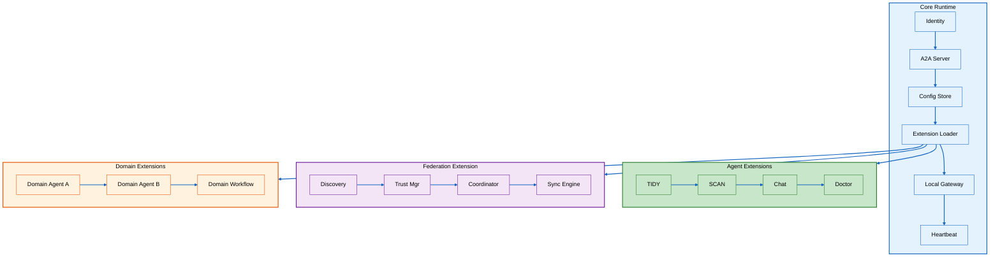
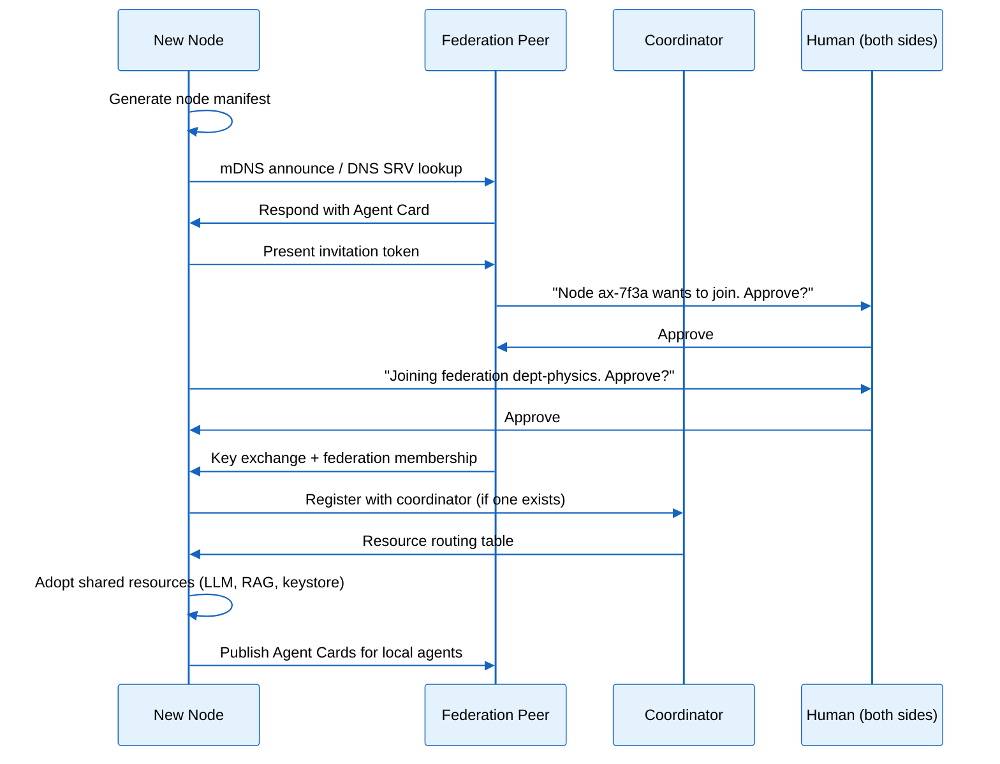
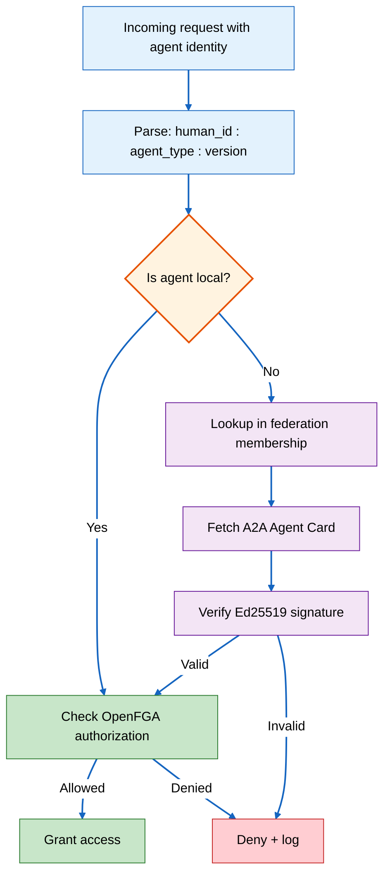
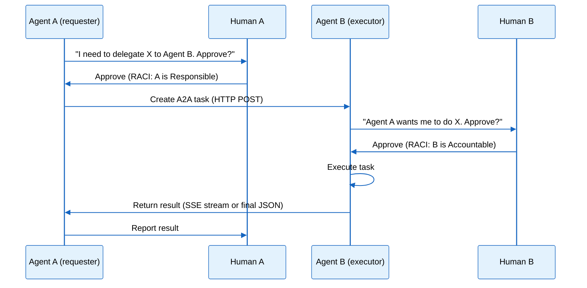
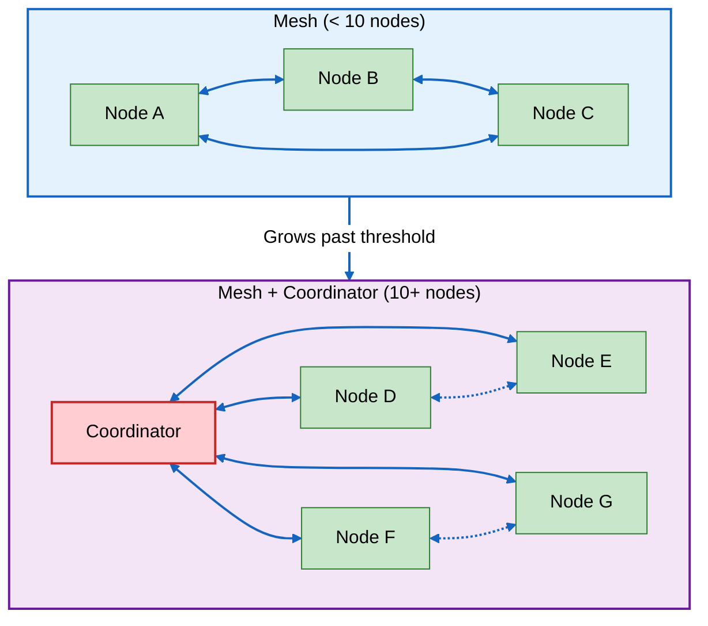

# PRD: Multi-Node Federation

> **Implementation Status: 🟡 Partial (as of 2026-04-02)** — Core federation
> infrastructure is implemented with 254 tests passing. Identity, discovery,
> trust bootstrap, .axiompack, pack server, EC safety guard, Call to Research,
> knowledge observatory, WASM sandbox, SECUR-T security service, chaos testing,
> content sanitizer, supply chain verification, progressive disclosure, and
> release planning are all built. Push-based propagation, peer introduction,
> coordinator election, gossip protocol, and cross-node SECUR-T collaboration
> remain spec'd.

**Status:** Draft
**Owner:** Ben Booth
**Created:** 2026-03-31
**Last Updated:** 2026-04-02 (rev 2)
**Audience:** Platform developers, system administrators, facility operators, grant reviewers
**Related:** [Federal Data Management](prd-doe-data-management.md)

---

## How to Read This Document

This document serves two purposes:

1. **Requirements** — what federation must do, why, and the acceptance criteria
   for each capability.
2. **System reference** — a living record of the federation design including
   topology, trust model, node architecture, and ecosystem interoperability.

It is the companion to:
- `adr-016-multi-node-federation.md` — the architecture decision record
- `spec-federation.md` — the technical specification (wire protocols, schemas, implementation)
- `spec-rag-community.md` — federated knowledge aggregation (most mature piece)

---

## 1. Problem

A single axiom node is self-sufficient but isolated. Real organizations have
multiple nodes — a researcher's laptop, a shared GPU server, a department
cluster, a community knowledge hub. Today these nodes don't know about each
other.

The cost of isolation is concrete:

| Scenario | Without Federation | With Federation |
|----------|-------------------|-----------------|
| A researcher installs axiom on a laptop | Downloads a 7B model, gets mediocre inference | Discovers the department's shared 70B model, gets expert-quality inference with local fallback |
| Three teams independently curate domain knowledge | Three redundant, incomplete RAG corpora | A single community corpus enriched by all three teams, accessible to all |
| An admin updates a security policy | Manually reconfigures each node | Policy propagates to all nodes automatically |
| A team member's agent needs specialized analysis | Can't access the capability; manual workaround | Agent delegates to a peer agent on the GPU server via A2A task |
| An external orchestration framework needs to invoke domain expertise | Custom integration per node | Discovers axiom via MCP server or A2A Agent Card; standard protocol, zero custom code |

The deeper cost is **organizational memory loss**. Knowledge validated at one
node stays trapped there. Patterns discovered by one agent are invisible to
others. The organization's collective intelligence is the sum of its parts
rather than greater than them.

## 2. Vision

Axiom nodes form a self-organizing federation. When a researcher installs axiom
on a new laptop and connects to the department network, the following happens
within 30 seconds — with zero configuration:

1. The node discovers the department's axiom federation via mDNS
2. It presents a previously-received invitation token
3. Both the new node's user and the inviting admin approve the join
4. The node adopts the shared GPU-backed LLM (keeping its local model as fallback)
5. The node subscribes to the community RAG corpus and pulls the latest domain packs
6. The node's agents publish their A2A Agent Cards, becoming discoverable to peers

The researcher now has the full power of the organization's shared resources —
inference, knowledge, audit trail — while retaining complete local functionality
for offline fieldwork.

At organizational scale (50-200+ nodes across multiple sites), the federation
becomes an **organizational nervous system**: knowledge flows between sites,
agents collaborate on tasks that span facilities, and shared infrastructure
serves every node without any single node being a dependency.

External agent frameworks — Claude Code, CrewAI, LangGraph, and others — can
discover and interact with axiom nodes through the same open protocols (MCP,
A2A), making the federation a participant in the broader agent ecosystem rather
than a walled garden.

## 3. The Atomic Unit: What Is an Axiom Node?

An axiom node is any device running the **core runtime**. The core runtime is
the minimum set of components required for independent operation and federation
participation. Everything else — agents, domain logic, federation governance —
is an extension.

### 3.1 Core Runtime

The core runtime consists of six components:

| Component | Responsibility | Why It's Core |
|-----------|---------------|--------------|
| **Identity Manager** | Ed25519 keypair, agent identity (`{human_id}:{agent_type}:{version}`), A2A Agent Card generation | Without identity, a node can't prove who it is |
| **A2A Server** | HTTP endpoint for agent discovery and communication | Without a network interface, a node can't be found |
| **Config Store** | Local configuration, state persistence, extension manifests | Without local state, a node can't survive a restart |
| **Extension Loader** | Discovers, validates, and activates extensions | Without extensibility, every node is identical |
| **Local Gateway** | LLM routing — even if only to a tiny local model or a stub | Without inference, agents can't reason |
| **Heartbeat Daemon** | Periodic health check broadcast to federation peers | Without liveness signals, peers can't detect failures |

These six components are always present. A core-only node with no extensions
installed is still a valid axiom installation — it has identity, can be
discovered, stores configuration, and routes LLM requests.

### 3.2 Node Properties

Every axiom node has identifiable properties that are published in its
**node manifest** (a JSON document served alongside the A2A Agent Card):

| Property | Example | Purpose |
|----------|---------|---------|
| `node_id` | `ax-7f3a2b...` (derived from Ed25519 public key) | Globally unique identifier |
| `owner` | `researcher@university.edu` | Human accountable for this node |
| `profile` | `standard` | Node tier (see §3.4) |
| `capabilities` | `["llm:local", "rag:local", "agents:tidy,scan"]` | What this node can do |
| `resources` | `{"llm": {"model": "llama-3.3-8b", "shared": false}}` | What this node offers |
| `network` | `{"endpoints": ["https://ax-7f3a.local:8443"]}` | How to reach this node |
| `federation` | `{"member_of": "dept-physics", "joined": "2026-04-01"}` | Federation membership |
| `trust_level` | `verified` | Current trust state in the discovery lifecycle |

### 3.3 Extension Model

Everything beyond the core runtime is an extension:

```
axiom/
  src/axiom/
    core/                        # Core runtime (always present)
      identity/                  # Identity manager
      a2a/                       # A2A server
      config/                    # Config store
      extensions/                # Extension loader
      gateway/                   # Local LLM gateway
      heartbeat/                 # Heartbeat daemon
    extensions/builtins/         # Shipped extensions
      signal_agent/              # Signal ingestion
      chat_agent/                # Interactive LLM
      hygiene/                  # Resource steward
      doctor_agent/              # System diagnostics
      federation/                # Federation protocol ← this is an extension
      ...
```

Federation itself is an extension. A node without the federation extension
installed is a standalone axiom installation — fully functional, just not
networked. This enforces the principle that federation is additive.

Domain-specific capabilities (industry-specific agents, regulatory RAG, custom
workflows) are also extensions, typically installed from separate repositories
to `.axi/extensions/`.

### 3.4 Node Profiles

Profiles are named configurations that describe a node's role in the federation:

| Profile | Core Runtime | Extensions | Typical Hardware | Federation Role |
|---------|-------------|-----------|-----------------|----------------|
| **Leaf** | ✅ | Minimal (chat, basic agents) | Laptop, Raspberry Pi, thin client | Consumer — adopts shared resources, contributes knowledge |
| **Standard** | ✅ | Full agent suite, local LLM, local RAG | Workstation, moderate server | Consumer + contributor — self-sufficient, shares knowledge |
| **Provider** | ✅ | Full suite + shared services | GPU server, department cluster | Resource host — offers LLM, RAG, keystore to federation |
| **Coordinator** | ✅ | Full suite + shared services + coordinator | High-availability server | Routing + governance — elected to manage resource routing |

A node's profile is declared, not enforced — it's metadata that helps the
federation understand what role a node intends to play. A leaf node that
acquires a GPU could update its profile to provider at any time.



## 4. Design Principles

### 4.1 Self-Sufficient by Default

Every node works fully offline. Federation is additive — it enhances but never
becomes a dependency. If the network goes down, every node continues operating
with its local resources. This is a hard invariant, not a goal.

### 4.2 Prefer Open Standards

| Layer | Standard | License | Why |
|-------|---------|---------|-----|
| Agent-to-agent | Google A2A | Apache 2.0 (Linux Foundation) | Widest adoption, enterprise backing, HTTP-native |
| Agent-to-tool | Anthropic MCP | Open | Already in use (ADR-006); universal adoption (9/9 frameworks) |
| Identity | OAuth 2.0/OIDC + OpenFGA | Open | Already adopted for IAM |
| Discovery | DNS SRV + mDNS | IETF standards | Universal, no proprietary dependency |
| Audit | Hyperledger Fabric | Apache 2.0 | Multi-org consensus (ADR-002) |
| Knowledge sync | Custom (modeled on federated learning) | N/A | No standard exists; axiom defines one |
| Frontend streaming | AG-UI | Open | Emerging standard for agent-to-frontend (future) |

### 4.3 Whole Greater Than Sum of Parts

The federation's value comes from combinatorial effects:

- **Shared LLM** — one GPU server serves inference for many leaf nodes
- **Community RAG** — every node's validated knowledge enriches all others
- **Agent collaboration** — agents combine capabilities across organizational boundaries
- **Organizational memory** — the federation remembers what any participant learned
- **Ecosystem reach** — external frameworks access the federation's collective capability

### 4.4 Progressive Enhancement

Nodes grow into their federation role. A leaf node starts as a consumer and
can progressively become a standard node, then a provider, then a coordinator —
each step adding capability, never removing what came before. No node is
second-class.

### 4.5 Trust Is Earned, Not Assumed

No node or agent gets implicit trust. Federation membership requires mutual
human approval. Cross-node agent actions require RACI approval. External
agents from other frameworks are subject to the same authorization checks as
internal agents. Trust escalation (from read-only to write, from single-action
to autonomous) requires explicit human consent at each level.

### 4.6 Human Sovereignty

Humans control their agents' trust boundaries. A user can restrict their agent's
federation participation at any time — limiting what it shares, who it
communicates with, and what cross-node actions it can take autonomously. RACI
settings are per-user, per-agent, per-topic, and changeable at any time.

### 4.7 Offline-First Federation

Federation protocols are designed for intermittent connectivity. Nodes queue
outbound actions when offline, sync on reconnect, and resolve conflicts
deterministically. No protocol assumes always-on networking.

## 5. Capability 1: Node Discovery and Resource Sharing

### 5.1 Discovery Lifecycle

When a node boots with the federation extension active, it follows this
lifecycle:



### 5.2 Resource Adoption

When a node discovers shared resources, it follows the **adopt-first protocol**
(extending `prd-managed-infrastructure.md`):

1. **Discover** — probe for shared instances via coordinator routing table or peer gossip
2. **Verify** — check resource meets minimum criteria (model size, corpus coverage, uptime SLA)
3. **Adopt** — re-route local gateway to use shared resource; keep local as fallback
4. **Monitor** — heartbeat checks; revert to local on shared resource failure

Priority order: `local (fallback)` < `federation shared` < `explicit user override`

### 5.3 Competing Shared Resources

A federation will often have multiple providers offering the same resource type.
Two labs might each share an LLM. Three teams might each run a RAG corpus. A
department might have a primary keystore and a disaster-recovery backup. The
system must handle this gracefully — not just pick one, but reason about which
to prefer, when to switch, and when to use more than one simultaneously.

**Scenarios:**

| Scenario | Example | Challenge |
|----------|---------|-----------|
| **Better option available** | A 70B model appears after a node already adopted a 13B | Should it switch? Automatically or with human consent? |
| **Equivalent options** | Two providers offer the same model with similar latency | Load balancing opportunity, but also consistency concern |
| **Complementary resources** | Two RAG corpora cover different domains | Both are valuable — adoption isn't either/or |
| **Conflicting resources** | Two keystores with different credential sets | Only one can be authoritative for a given secret |
| **Degraded provider** | Adopted LLM provider is overloaded, a backup exists | Failover needs to be fast but avoid thundering herd |
| **Provider disappears** | The preferred RAG hub goes offline permanently | Orphaned subscribers need to discover alternatives |

**Selection Strategy — Resource Ranking:**

When multiple shared resources of the same type are available, nodes rank them
using a **weighted score** across these dimensions:

| Dimension | Weight | Example (LLM) | Example (RAG) |
|-----------|--------|---------------|--------------|
| **Capability** | High | Model parameter count, context window | Corpus size, domain coverage |
| **Proximity** | Medium | Network latency, same-site preference | Same-site, same-network |
| **Availability** | Medium | Uptime history, current health, queue depth | Uptime, freshness of last sync |
| **Affinity** | Low | Admin preference, organizational policy | Explicit subscription, trust level |
| **Cost** | Low | Compute cost if metered | Bandwidth cost if metered |

Weights are configurable per node via `axi config set federation.resource_weights.*`.
The coordinator publishes resource metadata (capability scores, latency
estimates, current load) so nodes can rank without probing every provider.

**Selection Modes:**

| Mode | Behavior | Best For |
|------|----------|----------|
| **Best-of** (default) | Adopt the highest-ranked resource; failover to next-best | LLM, keystore, auth — where consistency matters |
| **Fan-out** | Adopt all qualifying resources; query all, merge results | RAG corpora — where completeness matters |
| **Round-robin** | Distribute requests across equivalent providers | LLM — where load balancing matters |
| **Pinned** | User explicitly selects a provider; no automatic switching | Any — where human preference overrides ranking |

The selection mode is configurable per resource type:
`axi config set federation.llm.selection_mode best-of`

**Upgrade and Transition Rules:**

- A node does **not** automatically switch to a higher-ranked resource if it
  already has a healthy adopted resource — stability over optimization
- When a node's current resource degrades (health warning, increased latency),
  it evaluates alternatives and may switch
- An admin can trigger a re-evaluation: `axi federation resources rebalance`
- When a new provider joins the federation, the coordinator broadcasts a
  "resource available" event; nodes evaluate but don't switch unless their
  current selection is suboptimal by a configurable threshold (default: 20%
  score improvement required to trigger a switch)

### 5.4 User Stories

| # | As a... | I want to... | So that... |
|---|---------|-------------|-----------|
| D-1 | Researcher with a laptop | Install axiom and discover the department's shared LLM | I get expert-quality inference without buying a GPU |
| D-2 | IT admin | See all axiom nodes on my network and their resource status | I can plan capacity and troubleshoot |
| D-3 | Field operator | Work offline for a week, then reconnect | My node syncs knowledge and pending actions without data loss |
| D-4 | Provider admin | Advertise my GPU server's LLM to the federation | Leaf nodes benefit from shared inference |
| D-5 | Researcher | Query two complementary RAG corpora in a single search | I get comprehensive answers spanning multiple knowledge domains |
| D-6 | Admin | Pin my node to a specific LLM provider despite a "better" one existing | I control my node's resource selection when organizational policy requires it |
| D-7 | Provider admin | See how many nodes are using my shared resource and their load patterns | I can plan capacity and know when to scale |
| D-8 | IT admin | Rebalance resource assignments across the federation | I can respond to changing load patterns or provider availability |

### 5.5 Acceptance Criteria

| # | Criterion | Target |
|---|-----------|--------|
| D-AC1 | Two nodes on the same LAN discover each other | < 30 seconds |
| D-AC2 | Shared LLM adoption happens with zero human config after trust is established | Automatic |
| D-AC3 | Node falls back to local LLM within 5 seconds of shared resource failure | < 5 seconds |
| D-AC4 | Resource adoption does not interrupt in-flight inference requests | Zero dropped requests |
| D-AC5 | When two LLMs are available, node selects the higher-ranked one | By weighted score |
| D-AC6 | When two RAG corpora cover different domains, node queries both (fan-out) | Results merged |
| D-AC7 | Node does not switch providers unless score improvement exceeds threshold | Default 20% |
| D-AC8 | Provider failure triggers failover to next-best, not thundering herd to one | Load-aware failover |

### 5.6 Capability 1.1: Scoped Visibility

Nodes declare sharing scopes per resource type. Four scopes govern who can
discover what:

| Scope | Who Can See | Discovery Mechanism |
|-------|-------------|---------------------|
| **public** | Anyone on the reachable network | mDNS + DNS-SD + well-known URL |
| **organization** | Members of the same institution | Authenticated registry (InCommon/OIDC proves institutional membership) |
| **consortium** | Members of a defined group of organizations | Peer introduction from a mutual trusted node |
| **private** | Explicitly configured bilateral partners only | Direct bilateral configuration |

**Default scope derivation:** The default sharing configuration is derived from
installed extensions. Any extension implementing the `ShareableResource` protocol
(see `spec-federation.md` §3.5) is automatically discoverable by federation
peers at the node's default scope level. Operators only need to override defaults
when they want finer control — the system does the right thing out of the box.

**Scope rules:**
- A resource's scope is the most restrictive of (node default scope, resource
  type scope, per-resource override)
- Scope violations are hard errors, not warnings — a private resource will never
  appear in public discovery responses
- Scope changes take effect on the next heartbeat broadcast

**Acceptance Criteria:**

| # | Criterion | Target |
|---|-----------|--------|
| SV-AC1 | A public resource is discoverable via mDNS by an unauthenticated peer | Always |
| SV-AC2 | An organization resource is invisible to a peer outside the organization | Always (invariant) |
| SV-AC3 | A consortium resource requires a peer introduction from a trusted node | Always |
| SV-AC4 | A private resource is invisible to any node without explicit bilateral config | Always (invariant) |
| SV-AC5 | Installing a new extension with ShareableResource makes its resources discoverable at default scope | Automatic, next heartbeat |

## 6. Capability 2: Agent Identity and Presence

### 6.1 Identity Lifecycle

Every agent has a globally unique identity:

```
{human_id}:{agent_type}:{version}
```

Identity is established at agent creation and persists across sessions,
restarts, and network changes. The identity is:

- **Published** — in the node's A2A Agent Card at `/.well-known/agent-card.json`
- **Authorized** — as an OpenFGA tuple (e.g., `user:admin@facility.gov#tidy` → `resource:community-rag#read`)
- **Audited** — every action in the audit log records the full agent identity

### 6.2 Presence in Human Contexts

When multiple agents from different nodes participate in a shared context
(chat room, dashboard, notification channel), they must be disambiguated:

| Context | Display | Formal Identity (on hover/inspect) |
|---------|---------|-----------------------------------|
| Chat message | "Admin's TIDY" | `admin@facility.gov:tidy:v0.4.0` |
| Dashboard widget | "Lab SCAN" | `researcher@university.edu:scan:v0.4.0` |
| Audit log entry | Full formal identity | `system@facility.edu:tidy:v0.4.0` |

Human moderators can grant or revoke agent presence in any shared channel.

### 6.3 Identity Resolution



### 6.4 User Stories

| # | As a... | I want to... | So that... |
|---|---------|-------------|-----------|
| I-1 | User in a shared chat room | See which human owns each agent | I know who to contact about an agent's behavior |
| I-2 | Auditor | Trace any action to a specific human + agent + node | I have full attribution for compliance |
| I-3 | Admin | Revoke an agent's access to a shared channel | I control what agents participate in my team's spaces |

### 6.5 Acceptance Criteria

| # | Criterion | Target |
|---|-----------|--------|
| I-AC1 | Agent identity is unambiguous in every audit log entry | 100% |
| I-AC2 | Two agents of the same type on different nodes are visually distinct in shared UI | Always |
| I-AC3 | Agent identity verification (signature check) completes in | < 100ms |

## 7. Capability 3: Agent-to-Agent Communication

### 7.1 A2A Task Lifecycle

Agents on different nodes collaborate via A2A tasks. A task has a defined
lifecycle:



### 7.2 Cross-Agent RACI

All cross-node agent interactions are governed by RACI (see `prd-agents.md`):

- **Responsible** — the requesting agent's human approves the delegation
- **Accountable** — the executing agent's human approves the action on their resources
- **Consulted** — domain experts or affected parties are notified before execution
- **Informed** — relevant stakeholders receive the result

RACI thresholds are configurable per user, per agent, per action category.
A user who trusts routine data queries might set those to auto-approve while
requiring manual approval for write operations.

### 7.3 Context Exchange

A2A context sharing follows the same invariant as federated knowledge
(`spec-rag-community.md` §2.2):

> **What crosses the wire:** propositions (facts, conclusions, summaries)
>
> **What never crosses the wire:** raw documents, user session data, credentials,
> classified content

This is a hard boundary. An agent can share "the average processing rate is
X units/hour" but never the underlying raw data or the document it was extracted
from.

### 7.4 Conflict Resolution

When agents disagree (e.g., two TIDY agents recommend conflicting remediation
actions):

| Tier | Trigger | Resolution |
|------|---------|-----------|
| 1. Auto-merge | Non-contradictory state (both changes can coexist) | Apply both; no human needed |
| 2. Coordinator arbitration | Operational conflict (mutually exclusive actions) | Coordinator picks based on priority, recency, or resource cost |
| 3. Human escalation | Safety-critical disagreement or irresolvable conflict | Both humans notified; decision is manual |

### 7.5 User Stories

| # | As a... | I want to... | So that... |
|---|---------|-------------|-----------|
| A-1 | Researcher | Ask my agent to delegate a compute-intensive analysis to the GPU server's agent | I get results without manual file transfer |
| A-2 | Operator | Know when a remote agent is taking action on my node's resources | I maintain control and can intervene |
| A-3 | Admin | Set RACI thresholds so routine queries auto-approve but writes require my approval | I get efficiency without sacrificing safety |

### 7.6 Acceptance Criteria

| # | Criterion | Target |
|---|-----------|--------|
| A-AC1 | A2A task creation latency on LAN | < 2 seconds |
| A-AC2 | A2A task creation latency on WAN | < 5 seconds |
| A-AC3 | Cross-node action without RACI approval | Never (invariant) |
| A-AC4 | Raw data transmitted in A2A context exchange | Never (invariant) |

### 7.7 Capability 3.1: Push-Based Content Propagation

Content changes propagate to connected peers with low latency:

| Network | Target Latency |
|---------|---------------|
| LAN | < 2 seconds |
| WAN | < 10 seconds |

**Mechanism:** Federated peers maintain persistent WebSocket channels (SSE
fallback when WebSocket is unavailable). Events are lightweight catalog updates
— they describe *what changed*, not the full content. A peer that wants the
actual content pulls it via the standard resource sharing protocol.

**Event format:** Each event carries a version vector keyed by node ID. Peers
compare vectors to detect gaps.

**Offline catch-up:** When an offline peer reconnects, it compares its version
vector with the peer's. Missing events are replayed from a bounded event log
(default: 10,000 events, 7-day retention). Target: full sync within 30 seconds
of reconnect.

**Acceptance Criteria:**

| # | Criterion | Target |
|---|-----------|--------|
| PP-AC1 | Catalog update reaches a connected LAN peer | < 2 seconds |
| PP-AC2 | Catalog update reaches a connected WAN peer | < 10 seconds |
| PP-AC3 | Offline peer fully syncs on reconnect | < 30 seconds |
| PP-AC4 | Full content is never sent in push events | Never (invariant — catalog metadata only) |

## 8. Capability 4: Federated Knowledge (Organizational Memory)

This capability is designed in detail in `spec-rag-community.md`. This section
summarizes the federation-relevant requirements.

### 8.1 Knowledge Federation

Facts validated at one node can be promoted to the community corpus, where
they benefit all federation members. The promotion pipeline follows a trust
gradient (GREEN → YELLOW → RED) that determines how much human oversight
each fact requires before community promotion.

**Key invariant:** Only propositions (facts) cross facility boundaries. Never
raw data, user identities, session contents, or classified material.

### 8.2 Domain Packs

Versioned, signed snapshots of community-curated knowledge distributed to
subscriber nodes. Domain packs follow a pull model — nodes subscribe and
pull updates, rather than having updates pushed to them. See
`spec-rag-community.md` §7 for the full lifecycle.

### 8.3 Federated Reinforcement

Agent reinforcement signals (human feedback, outcome data) can be aggregated
across the federation to improve shared models. This follows the same
privacy boundary as knowledge federation — only aggregate signals cross the
wire, never individual user interactions.

### 8.5 Federal Data Management Integration

Federated deployments will share a repository registry so that datasets published at any node are discoverable federation-wide. Cross-node PID resolution will enable agents and users at one node to retrieve metadata for datasets published at a peer node using persistent identifiers. This ensures that DOE DMSP FAIR discoverability requirements are met across the full federation, not just within individual nodes. See [Federal Data Management PRD](prd-doe-data-management.md) for PID and repository requirements.

### 8.4 Acceptance Criteria

| # | Criterion | Target |
|---|-----------|--------|
| K-AC1 | Community RAG pack updates reach all subscribers | Within 5 minutes |
| K-AC2 | Classified content auto-promoted to community corpus | Never (invariant) |
| K-AC3 | Raw data transmitted during knowledge federation | Never (invariant) |

### 8.6 Capability 4.1: RAG Knowledge Flow

Facts (propositions) cross federation boundaries; raw data never does. The trust
gradient (GREEN/YELLOW/RED) from `spec-rag-community.md` governs automatic
promotion. Multi-site corroboration — the same fact independently validated at
multiple nodes — increases the knowledge maturity level.

**What flows and what does not:**

| Content Type | Crosses Federation? | Notes |
|-------------|--------------------|----|
| Facts (propositions) | Yes | Core unit of federated knowledge |
| Raw chunks | Never | Hard invariant — raw data stays at source node |
| Reference / authoritative data | Yes | Factual data derived from authoritative sources |
| Model metadata | Yes | Model identity, version, capability — not weights |
| Computational-model inputs | Only on explicit pull | Requesting node must have appropriate tier access |
| Operating parameters | Depends on tier | Public/restricted tier flows; export-controlled does not unless authorized |
| Domain-proprietary configuration artifacts | Only within organization scope | Organizational IP; never crosses org boundary. Domain extensions (e.g. a domain consumer) enumerate which artifact classes are in scope for their domain. |

**Trust gradient and promotion:**

| Trust Level | Promotion Behavior |
|------------|-------------------|
| GREEN (high confidence) | Auto-promoted to community corpus; human notified |
| YELLOW (moderate confidence) | Auto-promoted with review flag; human reviews within SLA |
| RED (low confidence) | Requires explicit human approval before community promotion |

**Multi-site corroboration:** When the same fact is independently validated at
two or more sites, its maturity level increases by one (up to the maximum). This
is the primary mechanism by which the federation's collective knowledge exceeds
any single node's knowledge.

**Acceptance Criteria:**

| # | Criterion | Target |
|---|-----------|--------|
| KF-AC1 | A GREEN fact from one node reaches community corpus | Within 5 minutes |
| KF-AC2 | Raw data crosses federation boundary | Never (invariant) |
| KF-AC3 | Export-controlled content reaches a non-authorized node | Never (invariant) |
| KF-AC4 | Multi-site corroboration increases knowledge-maturity level | Within one sync cycle |
| KF-AC5 | Organization-proprietary configuration artifacts cross organizational boundary | Never (invariant) |

## 9. Capability 5: Configuration Propagation

### 9.1 Propagation Model

Federation-level configuration changes must reach individual nodes reliably.
Axiom uses a **pull-with-notification** model:

1. The originating node (or coordinator) publishes the change to a well-known
   federation configuration endpoint
2. A notification is broadcast to all peers (via heartbeat piggyback or dedicated message)
3. Each node pulls the change at its own pace
4. Eventual consistency — all nodes converge, but not necessarily simultaneously

This avoids the fragility of push (which fails on offline nodes) while being
faster than pure polling.

### 9.2 Configuration Types

| Type | Example | Propagation | Conflict Rule |
|------|---------|-------------|--------------|
| Model registry | New LLM version available | Pull on notification | Latest version wins; nodes choose when to upgrade |
| Domain packs | New knowledge pack published | Pull on notification | Append-only; no conflicts |
| Agent patterns | Learned CI/security/health patterns | Pull on notification | Higher `verified_count` wins; `verified_by` lists merged |
| RACI policies | Updated default trust thresholds | Pull on notification | Coordinator's version wins; users can override locally |
| Secret rotation | Shared keystore credential rotated | Push + pull (critical) | New credential wins immediately |
| Node membership | Node joined or left | Gossip + coordinator broadcast | Coordinator's membership list is authoritative |

### 9.3 Version Compatibility

Federation nodes may run different axiom versions. Compatibility rules:

- Nodes with the same **major** A2A adapter version can interoperate
- Agent Cards declare supported protocol versions
- Incompatible nodes receive a clear error message, not silent failure
- The coordinator tracks the minimum common version across the federation

### 9.4 Acceptance Criteria

| # | Criterion | Target |
|---|-----------|--------|
| C-AC1 | Configuration update reaches all online nodes | Within 2 minutes |
| C-AC2 | Offline node receives pending updates on reconnect | Within 30 seconds of reconnect |
| C-AC3 | Secret rotation reaches all consumers | Within 30 seconds (critical path) |

## 10. Capability 6: Federation Topology and Governance

### 10.1 Mesh with Elected Coordinators

Axiom federations are **peer-to-peer meshes by default**. Every node can
communicate directly with every other node. When the federation grows past a
configurable threshold (default: 10 nodes), nodes elect a **coordinator**.

The coordinator is an optimization:
- Maintains the authoritative resource routing table
- Tracks federation membership and health
- Arbitrates operational conflicts (tier 2 conflict resolution)
- Aggregates health metrics for dashboards

The coordinator is **not** a single point of failure:
- If the coordinator fails, nodes fall back to peer-to-peer gossip
- A new coordinator is elected automatically
- No data is stored exclusively on the coordinator

### 10.2 Coordinator Election

Election follows a simplified Raft-inspired protocol:

1. **Trigger** — federation size exceeds threshold, or current coordinator is unreachable for 3 consecutive heartbeat intervals (30 seconds)
2. **Nomination** — any node with a `provider` or `coordinator` profile can nominate itself
3. **Vote** — each node votes for one nominee; majority wins
4. **Term** — coordinator term lasts until the coordinator leaves, fails, or is voted out
5. **Re-election** — any node can call a re-election vote (requires 2/3 majority to initiate)

Ties are broken by node ID (deterministic). Split-brain scenarios resolve by
preferring the partition with more nodes; the minority partition operates in
pure mesh mode until reconnection.

### 10.3 Membership Lifecycle

| State | Description | Transition |
|-------|-------------|-----------|
| **Invited** | Token generated, not yet presented | → Joining (on token presentation) or Expired (on TTL) |
| **Joining** | Token presented, awaiting mutual approval | → Active (on both approvals) or Rejected (on denial) |
| **Active** | Full federation member | → Leaving (voluntary) or Evicted (admin action) or Unreachable (network failure) |
| **Unreachable** | No heartbeat for configurable timeout (default: 5 minutes) | → Active (on reconnect) or Evicted (after extended absence) |
| **Leaving** | Graceful departure in progress | → Left (complete) |
| **Evicted** | Removed by admin or automated policy | → Invited (if re-invited) |

### 10.4 Trust Bootstrap — Invitation-Based

New nodes join via invitation (see ADR-016 §9):

1. Existing member: `axi federation invite --ttl 24h` → generates one-time token
2. Token shared out-of-band (email, chat, QR code)
3. New node: `axi federation join <token>`
4. Mutual human approval required
5. Ed25519 key exchange completes federation membership

**No auto-join.** Every federation membership requires explicit human consent
from both sides.



*Solid lines: routed through coordinator. Dashed lines: direct peer-to-peer
(still available as fallback).*

### 10.5 User Stories

| # | As a... | I want to... | So that... |
|---|---------|-------------|-----------|
| T-1 | Admin | Invite a new node to the federation with a one-time token | I control who joins without exposing credentials |
| T-2 | Node operator | Leave the federation gracefully | My departure doesn't disrupt others |
| T-3 | Federation admin | Evict a compromised node | The federation remains secure |
| T-4 | User | See which node is the current coordinator and its health | I understand the federation's governance state |

### 10.6 Acceptance Criteria

| # | Criterion | Target |
|---|-----------|--------|
| T-AC1 | Coordinator election completes after failure detection | < 60 seconds |
| T-AC2 | Federation continues operating during coordinator election | No service interruption |
| T-AC3 | Invitation token expires after TTL | Enforced (default 24h) |
| T-AC4 | Evicted node can no longer access federation resources | Immediate on eviction |

## 11. Capability 7: Ecosystem Interoperability

### 11.1 The Agent Ecosystem Landscape (Early 2026)

Axiom does not exist in isolation. Nine major agent frameworks dominate the
landscape, and axiom must coexist with all of them — safely, securely, and
fluidly.

### 11.2 Protocol Support Matrix

| Framework | MCP | A2A | AG-UI | Integration Pattern |
|-----------|-----|-----|-------|-------------------|
| **Claude Code / Cowork** (Anthropic) | Native (creator) | — | — | MCP server → Claude discovers axiom tools |
| **OpenAI Agents SDK** | Native | — | — | MCP server → Agents SDK consumes tools |
| **CrewAI** | Native | Native | — | MCP server + A2A Agent Card → crews delegate to axiom |
| **LangGraph / LangChain** | Native | Native (Agent Server) | — | MCP server + A2A → graph nodes invoke axiom |
| **Microsoft Agent Framework** | Native | Native | Native | MCP + A2A + AG-UI → full protocol coverage |
| **Google ADK** | Native | Native (creator) | — | A2A Agent Card → ADK agents discover axiom |
| **Amazon Bedrock AgentCore** | Native | Native | Native | MCP via Gateway + A2A via Runtime |
| **Dify** | Native (bidirectional) | — | — | MCP server ↔ Dify workflows |
| **Haystack** (deepset) | Native (bidirectional) | — | — | MCP server ↔ Haystack pipelines |

**MCP: 9/9 frameworks** (universal). **A2A: 5/9 frameworks** (strong). **AG-UI: 2/9** (emerging).

### 11.3 Axiom's Integration Strategy

Axiom exposes capabilities through a **layered protocol stack**:

| Priority | Protocol | What It Exposes | Who Benefits |
|----------|----------|----------------|-------------|
| **P1** | MCP Server (Streamable HTTP) | Axiom tools: RAG queries, agent delegation, resource status, knowledge contribution | All 9 frameworks — immediate, universal reach |
| **P2** | A2A Agent Card | Agent discovery, task delegation, capability negotiation | 5 frameworks — autonomous agent-to-agent collaboration |
| **P3** | AG-UI (future) | Real-time agent state streaming to frontends | 2 frameworks — when Axiom builds consumer UIs |

Each layer builds on the one below. MCP is the foundation (tools). A2A adds
agent autonomy (tasks). AG-UI adds user experience (streaming state).

### 11.4 How Integration Works — Beyond Protocol Definitions

Protocol support is necessary but not sufficient. Real interoperability
requires thinking about the full integration lifecycle:

**Inbound (external agent → axiom):**

1. **Discovery** — External agent finds axiom via MCP server endpoint or A2A Agent Card
2. **Capability negotiation** — Agent reads axiom's capability list and selects relevant tools
3. **Authentication** — External agent presents credentials (OAuth token, API key, or mTLS cert)
4. **Authorization** — Axiom checks OpenFGA tuples; external agents get a scoped permission set
5. **Execution** — Tool call or A2A task runs through the same RACI pipeline as internal agents
6. **Audit** — Every external interaction is logged with the external agent's identity

**Outbound (axiom → external agent):**

1. **Registration** — Admin registers an external agent endpoint as a connection (`spec-connections.md`)
2. **Discovery** — Axiom reads the external agent's MCP tool list or A2A Agent Card
3. **Delegation** — Axiom agent creates a task with the external agent via A2A or invokes a tool via MCP
4. **RACI** — Human approval required before delegating to any external agent
5. **Result handling** — External agent's response is validated before being acted upon

### 11.5 Safety Boundaries for External Agents

External agents are **untrusted by default**. They interact with axiom through
the same authorization framework as internal agents, with additional constraints:

| Boundary | Rule |
|----------|------|
| **Capability allowlist** | External agents can only access tools explicitly listed in their connection config |
| **No federation membership** | External agents interact with a single node, not the federation |
| **No raw data access** | External agents receive propositions, never raw documents or corpus data |
| **Rate limiting** | External agent calls are rate-limited per connection |
| **Audit attribution** | Every external call is logged with the external framework's identity |
| **RACI override** | Even if a local user has auto-approve for internal agents, external agent actions always require explicit approval unless specifically overridden |

### 11.6 Extensibility — Supporting New Frameworks

The protocol adapter pattern means adding support for a new framework is a
configuration change, not a code change:

- **New MCP consumer** — no axiom changes needed; any MCP client connects to axiom's MCP server
- **New A2A agent** — no axiom changes needed; any A2A-compatible agent discovers axiom's Agent Card
- **New protocol** — add a protocol adapter extension (e.g., if a future standard emerges from the AAIF)

The extension loader treats protocol adapters the same as any other extension.

### 11.7 User Stories

| # | As a... | I want to... | So that... |
|---|---------|-------------|-----------|
| E-1 | Data scientist using LangGraph | Invoke axiom's domain RAG from my LangGraph workflow | I get domain-specific knowledge in my existing pipeline |
| E-2 | Team using Claude Code | Call axiom tools from Claude Code via MCP | My coding agent has access to facility knowledge |
| E-3 | Admin | Control which external frameworks can access my node | I maintain security boundaries |
| E-4 | Security officer | Audit all external agent interactions with axiom | I have full visibility into cross-ecosystem activity |

### 11.8 Acceptance Criteria

| # | Criterion | Target |
|---|-----------|--------|
| E-AC1 | Any MCP-compatible framework can discover and invoke axiom tools | Zero custom code |
| E-AC2 | A2A-compatible frameworks can delegate tasks to axiom agents | Via standard Agent Card |
| E-AC3 | External agent accesses a capability not in its allowlist | Denied + logged |
| E-AC4 | External agent interaction without audit trail | Never (invariant) |

## 12. Capability 8: Continuous Optimization (Autoresearch Loops)

### 12.1 The Problem with Static Defaults

Every system parameter in axiom — resource scoring weights, model routing
rules, promotion thresholds, heartbeat intervals, failover timing — is
currently a static default set by a developer and changed only when a human
notices a problem. This is backwards. Axiom captures rich observational data
(interaction logs, confidence signals, feedback, latency, retrieval hit rates)
but never feeds it back into the system's own configuration.

A Karpathy-style autoresearch approach treats every default as a hypothesis
to be continuously tested against real-world evidence. Instead of a developer
deciding "the switch threshold should be 20%," the system observes actual
switching behavior, measures outcomes, and proposes evidence-based adjustments.

### 12.2 The Generic Loop

Every autoresearch loop follows the same four-phase pattern:

| Phase | What Happens | Safety Gate |
|-------|-------------|-------------|
| **Observe** | Collect metrics from production behavior over a time window | None — passive data collection |
| **Hypothesize** | Analyze observations, identify a parameter change that would improve outcomes | Agent logs hypothesis with rationale |
| **Experiment** | Apply the change to a subset (A/B split, shadow mode, or canary) | RACI: human approval for experiment scope |
| **Promote or Rollback** | If the experiment improves outcomes beyond statistical significance, propose promotion to default. If it regresses, rollback automatically. | RACI: human approval for promotion to production default |

The loop runs continuously in the background. Each iteration produces an
auditable record: what was observed, what was hypothesized, what was tested,
and what the outcome was. Humans approve scope and promotion — they don't
need to design the experiments.

### 12.3 Concrete Loops

#### Loop 1: Federation Resource Scoring (owned by TIDY)

The resource scoring weights (§5.3) and switch threshold are static defaults.
This loop learns optimal weights per federation from observed resource selection
outcomes.

| Parameter | Current Default | What the Loop Optimizes |
|-----------|----------------|------------------------|
| `capability` weight | 0.35 | Is model size actually the best predictor of user satisfaction? |
| `proximity` weight | 0.25 | How much does latency matter relative to model quality? |
| `availability` weight | 0.25 | Are we over-valuing uptime vs capability? |
| `affinity` weight | 0.10 | Do admin preferences correlate with good outcomes? |
| `cost` weight | 0.05 | Should cost matter more on metered connections? |
| Switch threshold | 20% | Are nodes switching too often (thrashing) or too rarely (stale)? |
| Failover jitter range | 0–2s | Is the thundering herd prevention effective? |

**Observe:** For every resource selection, record: which resource was chosen,
the scores at decision time, and the outcome (request latency, confidence,
user feedback, fallback events).

**Hypothesize:** After N observations (configurable, default: 1000), run
regression analysis: which weight vector best predicts positive outcomes?

**Experiment:** Apply proposed weights to 10% of routing decisions (shadow
scoring — log what the new weights *would have* chosen without actually
switching). Compare predicted vs actual outcomes.

**Promote:** If shadow scoring shows ≥5% improvement over a 7-day window,
propose the new weights to the federation admin. On approval, new weights
become the federation default. Nodes can still override locally.

#### Loop 2: Model Routing (owned by Optimizer service)

`spec-model-routing.md` uses static keyword matching and manual config. This
loop learns which models perform best for which query types.

**Observe:** Per-query: model used, query topic (extracted by classifier),
confidence, latency, user feedback.

**Hypothesize:** Build a topic → model affinity matrix. "Queries classified as
'safety analysis' get 0.15 higher confidence on Model A vs Model B."

**Experiment:** Route 10% of traffic for the target topic to the proposed model.
Measure confidence, latency, feedback.

**Promote:** If the alternative model shows statistically significant improvement
(p < 0.05) over a configurable window, propose a routing rule update.

#### Loop 3: RAG Corpus Quality (owned by TIDY + SCAN)

TIDY sweeps weekly but doesn't actively manage corpus trajectory. This loop
continuously evaluates and optimizes the corpus.

**Observe:** Per-chunk: retrieval frequency, position in result set, feedback
when retrieved, embedding age, source document freshness.

**Hypothesize:** Identify underperforming chunks (frequently retrieved but
low feedback), stale chunks (old embeddings, source updated since embedding),
and missing coverage (queries with low retrieval confidence).

**Experiment:** Re-embed stale chunks, split oversized chunks, retire
consistently low-value content to archive. Measure retrieval quality before
and after.

**Promote:** Corpus changes that improve retrieval hit rate are committed.
Changes that degrade are rolled back. Monthly summary report to admin.

#### Loop 4: Prompt Template Optimization (owned by Optimizer service)

The prompt registry has versioning but no experimentation infrastructure.
This loop A/B tests prompt variations.

**Observe:** Per-template: usage count, confidence, hallucination indicators
(user corrections, low-confidence responses), feedback signals.

**Hypothesize:** "Adding a domain context preamble to template X would reduce
correction rate." Generate a variant template.

**Experiment:** Route 10% of invocations of template X to the variant.
Measure correction rate, confidence, latency.

**Promote:** If the variant shows ≥10% improvement in the target metric over
N invocations (configurable), propose promotion. Old template archived, not
deleted.

#### Loop 5: Federation Topology Tuning (owned by Coordinator)

Topology parameters (coordinator threshold, heartbeat interval, failure
detection window) are static. This loop optimizes them for the federation's
actual network characteristics.

**Observe:** Heartbeat round-trip times, false positive rate of failure
detection, coordinator election frequency, network bandwidth consumption.

**Hypothesize:** "Increasing heartbeat interval from 10s to 15s would reduce
bandwidth by 33% with <1% increase in false positive failure detection."

**Experiment:** Adjust interval on a subset of nodes. Measure failure
detection accuracy and bandwidth.

**Promote:** If no increase in false positives over a 30-day window, propose
the new interval federation-wide.

#### Loop 6: Knowledge Promotion Thresholds (owned by SCAN)

SCAN's trust gradient thresholds (GREEN ≥ 0.85, YELLOW 0.60–0.85, RED < 0.60)
are static. This loop calibrates them against actual human review outcomes.

**Observe:** For every fact that reaches human review (RED path): what was
the confidence score, and did the human approve or reject?

**Hypothesize:** "Facts with confidence 0.55–0.60 get approved 91% of the
time — the RED threshold could safely drop to 0.55."

**Experiment:** Lower the threshold for a subset of fact types. Measure
approval rate and post-promotion quality (do the newly auto-promoted facts
get positive feedback when retrieved?).

**Promote:** If approval rate holds above 90% and retrieval quality is
maintained over 60 days, propose the new threshold.

### 12.4 Agent Ownership

| Loop | Primary Agent | Supporting Agent | Approval Authority |
|------|--------------|-----------------|-------------------|
| Resource scoring | TIDY | Coordinator (publishes metrics) | Federation admin |
| Model routing | Optimizer (new service) | TIDY (provides interaction logs) | Node admin |
| RAG corpus quality | TIDY | SCAN (quality evaluation) | Knowledge steward |
| Prompt optimization | Optimizer (new service) | SCAN (hallucination detection) | Node admin |
| Topology tuning | Coordinator | TIDY (network metrics) | Federation admin |
| Promotion thresholds | SCAN | TIDY (sweep data) | Knowledge steward |

**Optimizer** is a new always-on service (alongside publisher, signal, doctor).
It owns loops that require statistical analysis and experiment design — tasks
that don't fit TIDY's stewardship role or SCAN's signal evaluation role.

### 12.5 RACI Trust Model for Autoresearch

Autoresearch promotion follows the same RACI trust model as all other agent
actions (see `prd-agents.md`). Users set their trust level per loop, and the
system respects it. Not every promotion needs a human in the loop — some
are set-and-forget, others require review.

**Trust positions per loop:**

| Trust Position | Experiment Scope | Promotion Behavior | Best For |
|---------------|-----------------|-------------------|----------|
| **Autonomous** | Up to configured max (default 10%) | Auto-promote if statistically significant; human notified after | Low-risk, high-frequency loops (prompt cache hints, corpus re-embedding) |
| **Supervised** | Up to configured max | Auto-experiment; human approves promotion before it takes effect | Medium-risk loops (model routing, resource weights) |
| **Gated** | Human approves experiment scope | Human approves both experiment and promotion | High-risk loops (topology changes, promotion thresholds) |
| **Disabled** | No experiments | Loop observes and reports only; no changes proposed | When stability is paramount |

Users configure trust per loop:
```bash
axi optimizer trust resource_scoring supervised   # Default for most loops
axi optimizer trust topology_tuning gated         # High-impact, cautious
axi optimizer trust corpus_quality autonomous     # Low-risk, set-and-forget
axi optimizer trust prompt_optimization disabled  # Not ready yet
```

**Default trust positions:**

| Loop | Default Trust | Rationale |
|------|--------------|-----------|
| Resource scoring | Supervised | Affects which resources a node uses — review promotes |
| Model routing | Supervised | Affects inference quality — review promotes |
| RAG corpus quality | Autonomous | Re-embedding and chunk management are low-risk and high-frequency |
| Prompt optimization | Gated | Template changes can cause subtle regressions |
| Topology tuning | Gated | Affects federation-wide behavior — both experiment and promote need approval |
| Promotion thresholds | Gated | Affects what content gets auto-promoted — careful review needed |

Trust positions are per-user, per-loop, changeable at any time — exactly like
agent RACI settings. A federation admin might set topology tuning to
`autonomous` after validating the loop's track record; a new user might set
everything to `gated` until they build confidence.

### 12.6 Safety Guardrails

Autoresearch loops can cause harm if unconstrained. Every loop is subject to:

| Guardrail | Rule |
|-----------|------|
| **Trust model** | Every loop respects the user's trust position (autonomous / supervised / gated / disabled) |
| **Experiment scope** | No experiment exceeds the configured max scope (default 10%) without escalating to `gated` approval |
| **Rollback trigger** | Any experiment that degrades the target metric by ≥5% is rolled back automatically, regardless of trust position |
| **Classified boundary** | Autoresearch never touches classified content, export-controlled routing, or security parameters — this overrides all trust positions |
| **Audit trail** | Every hypothesis, experiment, and outcome is logged with full attribution, regardless of trust position |
| **Cooldown** | After a promotion, the same parameter cannot be re-experimented for a configurable period (default: 30 days) |
| **Federation scope** | Loops affecting federation-wide defaults require federation admin trust setting; node-local loops use node admin trust setting |
| **Emergency stop** | `axi optimizer pause` halts all experiments immediately; `axi optimizer stop` disables the service |
| **Track record** | Loops can only be set to `autonomous` after ≥3 successful supervised promotions with no rollbacks |

### 12.7 User Stories

| # | As a... | I want to... | So that... |
|---|---------|-------------|-----------|
| O-1 | Federation admin | Set topology tuning to `gated` and resource scoring to `supervised` | High-impact changes need my approval; routine optimization runs smoothly |
| O-2 | Researcher | Set corpus quality to `autonomous` | My RAG corpus improves continuously without me reviewing every re-embedding |
| O-3 | Knowledge steward | See SCAN's proposed threshold adjustments with supporting data before they take effect | I maintain quality control over the promotion pipeline |
| O-4 | Security officer | Verify that autoresearch never touches classified content regardless of trust level | Compliance is non-negotiable |
| O-5 | Admin | Pause all experiments during a critical period | I prevent unexpected changes during sensitive operations |
| O-6 | Node operator | Elevate a loop from `gated` to `autonomous` after building confidence in its track record | I progressively delegate more to the optimizer as trust builds |
| O-7 | New user | Start with all loops at `gated` until I understand what each one does | I stay in control while learning the system |

### 12.8 Acceptance Criteria

| # | Criterion | Target |
|---|-----------|--------|
| O-AC1 | Autoresearch loop proposes a parameter change with supporting evidence | Evidence includes: observation window, sample size, improvement metric, statistical significance |
| O-AC2 | Experiment exceeding configured scope without appropriate trust level | Never (invariant) |
| O-AC3 | Regression detected during experiment triggers automatic rollback | Within 1 minute, regardless of trust position |
| O-AC4 | Autonomous promotion happens without audit trail | Never (invariant — all promotions logged even when auto-approved) |
| O-AC5 | Autoresearch experiment on classified content | Never (invariant — overrides all trust positions) |
| O-AC6 | Improvement in target metric after ≥3 promoted changes per loop | Measurable positive trend |
| O-AC7 | Loop set to `autonomous` without ≥3 successful supervised promotions | Blocked with explanation |

## 13. Capability 9: Peer-to-Peer Brokering

### 13.1 Introduction Brokering

Any node can broker introductions for its known peers. There is no special
"relay server" infrastructure — system nodes that are always-on (like a self-hosted node)
naturally become well-connected hubs through organic usage.

**Introduction flow:**

1. Node A trusts Node B (existing bilateral trust)
2. Node B trusts Node C (existing bilateral trust)
3. Node B creates a cryptographically signed introduction: "I (B) vouch that
   A and C should know each other"
4. Node B sends the introduction to Node A
5. Node A decides to accept (human prompt or auto-policy)
6. If accepted, Node A contacts Node C directly, presenting the signed introduction
7. Node C verifies: "Node B (whom I trust) vouched for Node A"
8. Node C decides to accept (human prompt or auto-policy, `require_mutual: true`)
9. If both accept: bilateral trust established, keys exchanged

**Scoping rules:** A broker will not introduce nodes across incompatible scope
boundaries. An organization-scoped node cannot be introduced to a public-scoped
node outside the organization. The broker checks scope compatibility before
offering the introduction.

### 13.2 Viral Adoption Path

Federation grows organically through four stages:

| Stage | What Happens | Federation State |
|-------|-------------|-----------------|
| 1. Solo install | User installs axiom. Zero federation, fully functional. | No federation |
| 2. First connection | Node discovers a neighbor on LAN (mDNS), human approves | Two-node mesh |
| 3. Introductions | Connected node offers to introduce its peers | Small mesh (3-10 nodes) |
| 4. Organic growth | Network grows through introductions, bounded by scope rules | Federation |

No stage requires centralized infrastructure. No stage removes functionality
from previous stages. A node that never connects is as functional as a node
in a 200-node federation — federation is purely additive.

### 13.3 User Stories

| # | As a... | I want to... | So that... |
|---|---------|-------------|-----------|
| B-1 | Node operator | Receive introduction offers from my trusted peers | I discover relevant nodes without manual configuration |
| B-2 | Admin | Control whether my node auto-accepts introductions or requires human approval | I maintain trust boundaries |
| B-3 | System admin (self-hosted node) | Have my always-on node naturally become a well-connected hub | New nodes joining the network benefit from existing connections |

### 13.4 Acceptance Criteria

| # | Criterion | Target |
|---|-----------|--------|
| B-AC1 | Introduction is cryptographically signed by the broker | Always |
| B-AC2 | Both sides must accept an introduction before trust is established | Always (`require_mutual: true`) |
| B-AC3 | Broker introduces nodes across incompatible scope boundaries | Never (invariant) |
| B-AC4 | A solo node operates without any federation | Fully functional |

## 14. Capability 10: Resilience and Red Team

### 14.1 Threat Scenarios

Five scenarios representing realistic attacks and failures, with the system's
response at each layer:

#### Scenario A: Network Outage

| Aspect | Response |
|--------|----------|
| **Detection** | Missed heartbeats (3 consecutive = 30s) |
| **Automated response** | Offline-first design — node continues with local resources. LAN peers still reachable. WAN peers marked unreachable. |
| **Recovery** | Event log replay on reconnect (version vector comparison). Target: < 30s full sync. |
| **Invariant** | No node loses functionality due to another node's outage. |

#### Scenario B: Compromised Node

| Aspect | Response |
|--------|----------|
| **Detection** | Content signatures fail verification. Behavioral anomaly detection by Tidy (unusual request patterns, scope violations). |
| **Automated response** | Automatic quarantine — compromised node's requests are rejected. Trust downgrade broadcast to all peers. |
| **Human response** | Admin initiates eviction. Key revocation propagates to all peers. |
| **Recovery** | Re-admission requires new identity generation and fresh bilateral trust establishment. |
| **Invariant** | A single compromised node cannot corrupt the federation. |

#### Scenario C: Man-in-the-Middle

| Aspect | Response |
|--------|----------|
| **Layer 1** | mTLS — all peer communication is mutually authenticated TLS |
| **Layer 2** | Content signatures — every shared item is signed by the originating node's Ed25519 key |
| **Layer 3** | Certificate pinning — peers pin each other's certificates at trust establishment |
| **Invariant** | Three independent layers must all be defeated for a MITM to succeed. |

#### Scenario D: Insider Threat (Export-Controlled Data Leak)

| Aspect | Response |
|--------|----------|
| **Prevention** | EC safety guard enforced in code — export-controlled content is tagged at ingestion and the tag is immutable |
| **Detection** | Tidy monitors for scope+tier cross-check violations. Audit trail records every access. |
| **Response** | Attempted EC leak is blocked, logged, and escalated to security officer |
| **Invariant** | EC content can only flow to explicitly authorized export-controlled nodes. |

#### Scenario E: Split-Brain

| Aspect | Response |
|--------|----------|
| **Detection** | Network partition detected when coordinator becomes unreachable from a subset of nodes |
| **Automated response** | Both sides operate independently — each partition continues with its local resources and knowledge |
| **Recovery** | Vector clock merge on network heal. Conflicting changes (same key modified on both sides) go to human review. |
| **Invariant** | Split-brain never causes data loss. |

### 14.2 Federation Invariants

These invariants are hard requirements — they are enforced in code, not policy:

1. **No node loses functionality due to another node's outage** — offline-first
   design guarantees independent operation
2. **A single compromised node cannot corrupt the federation** — content
   signatures and verification prevent poisoned data from propagating
3. **EC content can only flow to explicitly authorized export-controlled nodes** —
   the EC safety guard is enforced at the code level, not the policy level
4. **Split-brain never causes data loss** — both partitions operate independently;
   merge on heal preserves all changes

### 14.3 User Stories

| # | As a... | I want to... | So that... |
|---|---------|-------------|-----------|
| R-1 | Operator | Know that my node works when the network is down | I can continue field work without interruption |
| R-2 | Security officer | Know that a compromised node cannot poison shared knowledge | The federation's integrity is protected |
| R-3 | Compliance officer | Know that EC content cannot leak to unauthorized nodes | Export control regulations are met |
| R-4 | Admin | Know that split-brain events are resolved without data loss | I don't have to manually reconstruct state |

### 14.4 Acceptance Criteria

| # | Criterion | Target |
|---|-----------|--------|
| R-AC1 | Node operates at full local capability during network outage | Always |
| R-AC2 | Content from a node with revoked keys is accepted by any peer | Never (invariant) |
| R-AC3 | EC content reaches a non-EC-authorized node | Never (invariant) |
| R-AC4 | Split-brain recovery loses committed data | Never (invariant) |
| R-AC5 | Unsigned or mis-signed content accepted by any node | Never (invariant) |

## 15. Capability 11: New Member Onboarding

The federation must make onboarding frictionless for new members joining a
research group or team. **Design requirement:** any new user with `pip install`
access must go from zero to productive in under 5 minutes.

### 15.1 Scenario A: General Engineering Student

Maya is a new ME grad student at a large university. She has never used axiom.
She is joining a multidisciplinary team that uses axiom for project management
and RAG.

**Day 1:**
```
pip install axiom
axi setup
```

The setup wizard detects the campus network, discovers department axiom nodes
via mDNS, and prompts:

```
Welcome to Axiom!

Discovered nodes on your network:
  • ME Research Lab (me-lab.engr.university.edu) — 12 members
  • CAEE Structures Group (structures.engr.university.edu) — 8 members

Your advisor Dr. Smith's node offers to connect you.
Connect? [Y/n]
```

Maya says yes. Her node receives:
- RAG knowledge packs for her research group (papers, methods, lab procedures)
- Shared tool configurations (LLM providers, storage endpoints)
- Connection to the group's shared model registry

**Maya never configured anything.** Her advisor's node introduced her to the
group's resources automatically, scoped to her research group — she cannot see
other departments' nodes or access-controlled content she has not been
authorized for.

**What Maya gets immediately:**
- `axi chat "How do we run CFD simulations in this lab?"` → RAG answers from group knowledge
- `axi rag search "mesh convergence"` → finds group's validated procedures
- Group members see her node in `axi nodes status` — she is part of the team

### 15.2 Scenario B: Specialist Domain Student

Carlos is a new PhD student joining a research group that uses a domain
extension on top of axiom. He will work with domain-specific simulation tools
and shared model libraries.

**Day 1:**
```
pip install axiom-domain-ext
domain-ext setup
```

The setup wizard detects the lab network and discovers the lab's system node via
mDNS:

```
Welcome to <Domain Extension>!

Discovered: lab-server (University Lab System Node)
  Operator: advisor@university.edu
  Capabilities: model-registry, materials, rag, simulation-bridge
  Facility packs: facility-alpha, facility-beta

Connect to lab-server? [Y/n]
```

Carlos says yes. His node receives:
- Facility packs (materials, templates, operating parameters)
- Connection to the model registry (all shared models instantly searchable)
- RAG knowledge from the lab corpus (operating procedures, safety analysis, past analyses)
- Introduction to other lab members' nodes

**Carlos can immediately:**
```
axi model search facility-alpha             → sees all models for his facility
axi model pull reference-steady-state       → downloads a labmate's reference model
axi model clone reference-steady-state      → starts his own variant
axi model materials --category fuel         → browses all verified materials
axi model generate ./my-first-model         → generates simulation input from templates
axi facility list                           → sees available facility packs
```

**Within his first hour**, Carlos has:
- A working environment with the domain extension
- All verified materials for his facility
- Reference models to build from
- Access to the lab's collective knowledge via RAG
- Connection to his advisor, labmates, and the system node
- Full provenance chain on everything he uses

**He never had to:**
- Manually download material compositions from a paper
- Ask "where's the latest input deck?" on a chat platform
- Set up database connections
- Configure storage
- Request access to anything — his advisor's node vouched for him

**What the advisor sees:**
```
axi nodes status
  → Carlos' Workstation: online, healthy, connected 2 minutes ago
  → Synced: facility-alpha pack, 3 models pulled
```

The advisor knows Carlos is set up and working without a single email.

### 15.3 Access Scoping in the Onboarding Context

Carlos can see lab models (organization scope) and community materials
(consortium scope). He **cannot** see:
- Access-controlled models (requires explicit authorization, not automatic)
- Other departments' nodes at the university (different organization scope)
- Another site's restricted models (requires bilateral trust his node does not have yet)

If Carlos later needs higher-tier access, the advisor explicitly grants it:
```
axi federation grant carlos-workstation --access-tier restricted
```

This is logged, auditable, and revocable.

### 15.4 The "First 5 Minutes" Guarantee

**Design requirement:** Any new member with `pip install` access must go from
zero to productive in under 5 minutes. The federation handles the rest:

| Step | Mechanism | Target |
|------|-----------|--------|
| Discovery | Automatic (mDNS) | < 10 seconds |
| Trust establishment | One human approval (advisor's node vouches) | Single prompt |
| Content sync | Push-based | < 10 seconds for full catalog |
| Tools configured | Inherited from system node defaults | Zero manual config |
| Knowledge available | RAG corpus synced immediately | Immediate after trust |

### 15.5 Anti-Requirements

The onboarding flow must **never** require:

- An IT ticket for access
- VPN configuration for local resources
- Manual database setup
- "Ask your labmate for the files"
- Reading a setup wiki

### 15.6 User Stories

- As a **new team member**, I run `axi setup` on my first day and have access to my group's knowledge and models within minutes, without my advisor walking me through configuration.
- As an **advisor**, I see new members appear in `axi nodes status` the moment they connect, and I can verify what they synced.
- As a **system administrator**, onboarding a new member does not require me to provision accounts, configure permissions, or update access control lists — the trust model handles it through the invitation/vouching flow.

### 15.7 Acceptance Criteria

| # | Criterion | Target |
|---|-----------|--------|
| NM-AC1 | New node discovers local federation and presents join prompt | < 30 seconds after `axi setup` on a LAN with existing nodes |
| NM-AC2 | After advisor approval, RAG packs and model catalog are available locally | < 60 seconds total elapsed |
| NM-AC3 | New member can query RAG and search models without any manual configuration | Zero config beyond `axi setup` + accepting the join prompt |
| NM-AC4 | New member cannot access content above their granted tier | Never (invariant) |
| NM-AC5 | Advisor node shows new member's status in `axi nodes status` | Immediately after trust is established |
| NM-AC6 | Complete onboarding from `pip install` to first productive query | < 5 minutes |
| NM-AC7 | Onboarding requires manual database, storage, or VPN setup | Never (anti-requirement) |
| NM-AC8 | Standalone installs are offered a community knowledge pack during `axi setup` | Always (first run only) |
| NM-AC9 | Community pack installs agent patterns and reference facts without federation membership | Zero federation config required |

## 16. Capability 12: Call to Research — Distributed Research Coordination

Any trusted node can initiate a **Call to Research** to address a specific
challenge. The Call can optionally decompose into composable parts. Opt-in
participants claim parts, conduct research, and submit findings. The caller
assembles results and publishes to subscribers.

### 16.1 Complexity Levels

| Level | Type | Example | Timeline |
|-------|------|---------|----------|
| 1 | Fact Retrieval | "What's thermal conductivity of UZrH at 800K?" | Seconds–minutes |
| 2 | Literature Survey | "What methods exist for modeling fission gas release?" | Minutes–hours |
| 3 | Computational Benchmark | "Run this model with your cross-section library, report k-eff" | Hours–days |
| 4 | Analytical Research | "Compare measured vs predicted control rod worth at your facility" | Days–weeks |
| 5 | Synthesis/Publication | "Multi-facility review paper for journal submission" | Weeks–months |

### 16.2 Key Design Points

- Calls are scoped (public / org / consortium) — only visible to appropriate nodes.
- Parts are independently claimable — a node can take one piece without committing to all.
- Results flow back through the federation knowledge pipeline (trust gradient applies).
- Assembled findings auto-enter the community corpus at the appropriate maturity level.
- The auto-research agent can propose Calls when it detects knowledge gaps.
- Human approval is required to open a Call (agent proposes, human approves).
- All contributions are tracked — contribution metrics visible in the knowledge observatory.
- License terms declared upfront (CC-BY-4.0 default, co-authorship for Level 5).
- Level 3 (computational) sends model specifications or sandboxed WASM modules — never native executables (see §16.6).
- Level 5 (publication) is human-led — the system handles logistics, not scientific judgment.

### 16.3 User Stories

- As a researcher, I want to post a question to the federation and get multi-site answers automatically.
- As a facility operator, I want to contribute my facility's data to a cross-facility study without manual coordination.
- As an auto-research agent, I want to propose Calls when I detect knowledge gaps so the federation fills them.
- As a supervisor, I want to see which Calls my lab is participating in and what we've contributed.
- As a journal author, I want the system to track co-authors and contributions for multi-institution papers.

### 16.4 Acceptance Criteria

| # | Criterion | Target |
|---|-----------|--------|
| CR-AC1 | Call to Research can be created, decomposed into parts, and published to federation | Works across all scope levels |
| CR-AC2 | Parts can be claimed, worked on, and submitted independently | No coupling between parts |
| CR-AC3 | Caller can accept/reject submissions, request revisions | Review workflow complete |
| CR-AC4 | Assembled results enter the knowledge corpus with full provenance | Provenance chain unbroken |
| CR-AC5 | Auto-research agent can propose Calls (requires human approval to open) | Never auto-opens |
| CR-AC6 | Knowledge metrics track contributions per node per Call | Visible in observatory |
| CR-AC7 | Level 3 Calls transmit only WASM modules or model specifications — never native executables | Invariant |
| CR-AC8 | All Calls respect scope and access_tier rules | Invariant |
| CR-AC9 | Research chains are traversable from root to leaf via `axi research chain <call_id>` | DAG visualization |
| CR-AC10 | WASM execution requires explicit operator approval; approval is logged and auditable | Invariant |
| CR-AC11 | Publisher agent can publish an entire research chain as a cohesive narrative | End-to-end |

### 16.5 Agent Pipeline Integration

The Call to Research pipeline integrates with the platform's built-in agents:

```
Signal Agent    → extracts facts from all sources → facts enter corpus
Auto-Research   → monitors corpus → detects gaps → proposes Calls
                → assembles results → feeds back to corpus
Publisher Agent → formats assembled findings → publishes to subscribers
                → manages publication lifecycle (draft → review → published)
Steward Agent   → monitors pipeline health → tracks knowledge metrics
                → ensures escalation paths
```

Signal processing flow:

```
Signal → Signal Agent → Fact → Corpus → Auto-Research (gap detection)
→ Call to Research → Responses → Assembly → Corpus (enriched)
→ Auto-Research (new gaps?) → Publisher Agent (publish)
→ Subscribers (federation peers, email, journals)
```

Each agent operates under RACI governance — humans remain accountable for all
decisions that open Calls or publish findings.

### 16.6 WASM Sandboxed Execution (Level 3)

Level 3 Calls can optionally include executable WASM modules instead of (or in
addition to) model specifications. WASM provides a safe execution envelope:

- **No filesystem access** (unless explicitly granted by sandbox config)
- **No network access**
- **Bounded CPU time** (fuel metering — configurable per-node)
- **Bounded memory** (configurable cap, default 256 MB)
- **Deterministic execution** (same input always produces same output)

**Use cases:** pre/post-processing transforms, material property computation,
reduced-order model (ROM) inference, validation scripts.

**Not for:** running full-scale simulation codes — those are too large for WASM
and require native toolchains. Level 3 Calls that need full codes continue to
send model specifications for the receiving node's own tools.

**Operator approval:** A node operator must explicitly approve WASM execution
before any module runs. Approval is logged in the audit trail with the module
hash, sandbox config, and operator identity.

### 16.7 Composable Research Chains

The output of Call N feeds the input of Call N+1 via explicit `input_from`
links. This creates an observe-hypothesize-experiment-learn loop:

1. Call A produces facts
2. Facts enter the corpus
3. Auto-research agent detects a new gap revealed by those facts
4. Auto-research agent proposes Call B with `input_from: [Call A]`
5. Call B produces deeper insights
6. Repeat — the chain grows as knowledge deepens

Research chains form a directed acyclic graph (DAG), not a linear sequence —
a single Call can feed multiple downstream Calls, and a Call can draw from
multiple upstream Calls.

**Tracking:** `axi research chain <call_id>` shows the full dependency graph
from root to leaf, including status, participants, and contribution metrics.

**Publishing:** The publisher agent can publish an entire chain as a research
narrative, preserving the logical progression from initial signal through
successive refinements to final synthesis.

## 17. Installation and Upgrade Across the Federation

> **Rationale:** federation at the 10k–100k-node scale puts install and
> upgrade on the critical path for every security and reliability
> property. A peer running a stale version silently degrades the
> federation's trust model; a broken upgrade during incident response
> is itself an incident; a compromised install channel is a
> federation-wide blast radius. This section enumerates the scenarios
> the install/upgrade path must handle as first-class requirements —
> not nice-to-haves.
>
> Related: ADR-017 (release pipeline and supply chain), ADR-021 /
> ADR-025 (threat model), ADR-022 (identity & membership — this
> PRD's foundational data-model update). Deterministic vs
> model-mediated framing (see `spec-security.md §Trust Model`):
> version checks, signature verification, and authorization are
> ALWAYS deterministic; Bonsai LM narration of upgrade options is
> model-mediated assistance and never gates the action.

### 17.1 Scenarios the Install/Upgrade Path Must Handle

Each scenario is a functional requirement. Failure to handle any of
them gracefully is a federation-grade bug, not a UX polish issue.

| # | Scenario | Example | Risk if mishandled | Design response |
|---|----------|---------|--------------------|-----------------|
| 1 | **Really old installs** | v0.5 node tries to join a v0.12 federation | Protocol incompat; silent message drops; invalid signatures | Version preflight on every cross-node interaction; refuse below minimum with guided upgrade message |
| 2 | **Partially functional nodes** | Crashed service, half-applied migration, corrupted state | Federation thinks peer is healthy; false attestations | Health attestation includes subsystem status; unhealthy subsystems fail the overall fitness gate |
| 3 | **Potentially compromised nodes** | Key suspected leaked, host breached | Operator has no clean quarantine path; lateral movement risk | `axi federation quarantine <peer>` — signed by operator, propagated via revocation channel; peer drops from all active federations |
| 4 | **Orphaned identities** | Human left the org; node still runs under revoked affiliation | Agent acts under expired authority; legal/compliance exposure | Affiliation assertions carry expiry; federation rejects messages signed under an expired affiliation; grace period with warning before hard refusal |
| 5 | **Forked identities** | Backup + restore mistake produces two nodes with the same seed | Split-brain; conflicting signatures on federation state | Identity registry detects duplicate `node_id` under distinct reachabilities; refuses registration of the second; requires operator to re-initialize one |
| 6 | **Air-gapped installs** | Lab machine with no internet at setup time | Cannot reach PyPI / GitHub; install cannot bootstrap | Offline install bundle (pinned wheel + deps tarball + signed manifest); verifiable against published checksums from a network-connected peer later |
| 7 | **Dev/prod commingling** | Staging node accidentally added to production federation | Bogus data promoted; dev keys granted prod access | Federation membership has environment tags; mismatched env requires explicit override; default is to refuse |
| 8 | **Ephemeral / cloud installs** | CI runner or short-lived container joining and vanishing | Federation polluted by zombies; stale members in directories | Node profiles carry expected lifetime; ephemeral nodes auto-expire from membership on missed heartbeats faster than long-lived ones |
| 9 | **Downgrade / rollback** | New version breaks, operator needs to revert | No safe path; state schema newer than old binary can read | Schema migrations are forward-and-backward compatible within a minor-version window; explicit `axi rollback <version>` with pre-flight compatibility check |
| 10 | **Reinstall from backup** | Machine lost, operator restoring identity + federation memberships | Identity replay risk; federation doesn't recognize resumed node | Reinstall ceremony: operator signs a "resumption statement" binding old node_id to new transport; federation peers verify against last known-good state and re-admit |
| 11 | **Multi-tenant hardware** | Shared lab laptop, multiple human identities | Context isolation failure; wrong identity signs outbound messages | OS-level user separation required for separate human identities; within one OS user, explicit `axi context switch` is mandatory before federation operations |
| 12 | **Clock skew** | NTP off, laptop battery drained, VM paused | TTL'd signatures rejected as expired; federation traffic appears hostile | Max allowed skew is a protocol constant (±5 min); messages outside window rejected with an explicit "clock skew" error distinct from signature failure; operator guided to check NTP |
| 13 | **Legitimate key rotation** | Scheduled annual key rotation, no compromise | Peer refusal indistinguishable from MITM | Rotation protocol: operator pre-announces via signed rotation notice (old key signs the new key) before activation; TOFU refusal message differentiates "rotation without prior notice" from "rotation announced X days ago — expected" |
| 14 | **Mid-incident upgrade** | Critical CVE, 10k nodes on vulnerable version, federation is live | Big-bang upgrade breaks federation during response; slow rollout leaves exposure window | Staged rollout (canary → 10% → 50% → all); each stage gated on health metrics; emergency hotfix channel bypasses stages for severity-1 with operator signoff |
| 15 | **Uninstall hygiene** | User removes `axi` | Residual keys in `~/.axi`; daemon still registered; federation sees a "ghost" peer | `axi uninstall` is the canonical path: revokes node_id from active federations, wipes keys after confirmation, removes daemon registrations; manual `pip uninstall` emits a warning on next `axi` invocation to the hosting user |
| 16 | **Bootstrap without invite** | Leaf node on first-install has no federation contact | Discovery has no starting point; invite-less join attempts become a DoS channel | mDNS for LAN-local discovery; for remote bootstrap, invite token is mandatory (ADR-016 §9). Open federations (public-tier only) use a published list of well-known bootstrap peers, each individually signed by the federation root. |

### 17.2 Implementation Status (as of 2026-04-15)

Status legend: ✅ shipped · 🟡 partial · 📋 spec'd · ⬜ TODO.

| # | Scenario | Status | Notes |
|---|----------|--------|-------|
| 1 | Really old installs | ✅ shipped | Peer version preflight (v0.10.7); federation refuses peers below `MIN_PEER_VERSION_FOR_IDENTITY_BINDING` with guided upgrade message; `test_peer_version_preflight` green |
| 2 | Partially functional nodes | 🟡 partial | Health attestation framework via TIDY exists; subsystem-status fail-the-fitness-gate not yet wired |
| 3 | Potentially compromised nodes | 📋 spec'd | `axi federation quarantine/unquarantine/revoke` flow designed (project_quarantine_and_recovery_path); ADR-024 revocation channel; implementation pending |
| 4 | Orphaned identities | 📋 spec'd | ADR-020 affiliation TTL + expiry-rejection design; needs implementation |
| 5 | Forked identities | 📋 spec'd | Identity registry duplicate-detection rule in ADR-022; not yet implemented |
| 6 | Air-gapped installs | 📋 spec'd | spec-classification-boundary.md §S8; offline install bundle not yet built |
| 7 | Dev/prod commingling | ⬜ TODO | Environment tag on federation membership not yet implemented |
| 8 | Ephemeral/cloud installs | 📋 spec'd | ADR-023 §2 lifecycle types; auto-expire heartbeat rule needs impl |
| 9 | Downgrade/rollback | ⬜ TODO | Forward-backward-compat schema migrations not yet designed |
| 10 | Reinstall from backup | ⬜ TODO | Resumption statement ceremony designed in ADR-022; not yet implemented |
| 11 | Multi-tenant hardware | 🟡 partial | Context isolation exists (ADR-020); cross-OS-user boundary not enforced |
| 12 | Clock skew | ⬜ TODO | TTL signature rejection exists; ±5min window policy constant not yet set |
| 13 | Legitimate key rotation | 🟡 partial | TOFU transport-keyed refusal (v0.10.10); full rotation attestation ceremony from ADR-024 §5 not yet impl |
| 14 | Mid-incident upgrade | 📋 spec'd | ADR-024 §6 emergency upgrade channel designed; release-pipeline work to sign emergency channel pending |
| 15 | Uninstall hygiene | ⬜ TODO | `axi uninstall` with key-wipe + federation-revoke not yet built |
| 16 | Bootstrap without invite | 🟡 partial | mDNS LAN discovery exists; well-known bootstrap-peer signed list for open federations pending |

**Shipped primitives supporting the above (v0.10.4–0.10.10):**
- Ed25519 identity binding on `axi nodes add`
- TOFU with transport-keyed loud refusal
- Peer version preflight
- `axi update` fail-stop (no silent failure)
- `axi install-shim` for stable `~/.local/bin/axi`
- cryptography as core dep
- Extension main() return-code propagation
- Supply-chain integrity test (tests/install_path — clean PyPI validation)
- 7-scenario federation lifecycle test harness

### 17.3 Acceptance Criteria

- Every scenario above has at least one test in the federation lifecycle
  test suite (`tests/federation_lifecycle/`).
- Install and upgrade paths are instrumented: each observable
  transition (install-started, dep-resolved, migration-applied,
  agents-registered, validation-passed) emits an audit event.
- Upgrade path is **fail-stop**: any step failure aborts the upgrade
  and leaves the system in a known state (either pre-upgrade or
  rolled-forward-but-quarantined). No silent "succeeded with
  failures" outcomes.
- Peer version preflight (required: ≥ minimum-compatible-version)
  runs before any cross-node operation that depends on a
  protocol-versioned capability. Below-minimum peers receive a
  clear guided message, not a cryptic protocol error.
- Install bundle integrity (wheel + deps manifest) is verified
  against a signed attestation before execution. Unsigned or
  signature-mismatched bundles are refused.
- Bonsai LM narration, where present, wraps but never replaces the
  deterministic action. If Bonsai is unavailable, the
  deterministic flow still runs with plain-text output.

### 17.4 Non-Goals

- This section does NOT replace ADR-017 (release pipeline). ADR-017
  defines how Axiom is built and published; this section defines
  what receiving and applying those releases must guarantee.
- This section does NOT enumerate every install failure mode the
  OS or Python packaging can produce. It enumerates federation-
  relevant scenarios — the ones that either affect or are affected
  by being part of a federation.

## 18. Affected Documents

The following existing documents need federation sections. These updates are
separate work items — this PRD defines what they need, not the content itself.

| Document | What Needs Adding | Phase |
|----------|------------------|-------|
| `prd-managed-infrastructure.md` | Network resource adoption when shared services appear | 1 |
| `spec-managed-infrastructure.md` | Discovery protocol for network resources | 1 |
| `prd-agents.md` | Cross-agent RACI, agent identity standard, presence | 1 |
| `spec-agent-architecture.md` | A2A integration, Agent Card format, cross-node task protocol | 2 |
| `prd-rag.md` | Community corpus subscription and contribution | 2 |
| `spec-rag-community.md` | Alignment with A2A for knowledge sync triggers | 2 |
| `spec-rag-pack-server.md` | Pack distribution as federation event | 2 |
| `prd-security.md` | Cross-node auth, agent identity in audit trails, external agent boundaries | 1 |
| `spec-security.md` | OpenFGA tuples for federated agent identity | 1 |
| `prd-logging.md` | Cross-node audit trail correlation | 2 |
| `spec-logging.md` | Federated HMAC chain | 3 |
| `adr-015-shared-service-boundaries.md` | Federation section for cross-node ownership | 2 |
| `spec-cicd-and-deployment.md` | Federation-aware deployment (version compatibility) | 3 |
| `spec-connections.md` | External agent connection patterns (A2A, MCP inbound) | 2 |
| TIDY `AGENT.md` | Federation stewardship skills (node registration, resource adoption) | 2 |

## 19. Test Strategy (TDD Foundation)

Before building federation, define these automated tests:

### Node Discovery Tests
```python
def test_node_publishes_agent_cards_at_well_known_url():
    """GET /.well-known/agent-card.json returns valid A2A Agent Card."""

def test_node_publishes_node_manifest():
    """GET /.well-known/axiom-manifest.json returns valid node manifest."""

def test_node_discovers_peer_via_dns_srv():
    """DNS SRV record _axiom._tcp.test.local resolves to peer endpoint."""

def test_node_discovers_peer_via_mdns():
    """mDNS broadcast finds peer on same LAN segment."""

def test_node_adopts_shared_llm_when_discovered():
    """Local gateway re-routes to shared LLM; local stays as fallback."""

def test_node_falls_back_to_local_when_shared_unavailable():
    """If shared LLM goes down, gateway reverts to local model."""
```

### Agent Identity Tests
```python
def test_agent_identity_format():
    """Agent identity matches {human_id}:{agent_type}:{version} format."""

def test_agent_card_contains_identity():
    """A2A Agent Card includes owner, type, version, capabilities."""

def test_two_agents_same_type_are_disambiguated():
    """In shared context, two TIDY agents from different nodes are distinct."""

def test_agent_identity_verified_via_signature():
    """Ed25519 signature on Agent Card is verified before trusting identity."""
```

### Agent-to-Agent Tests
```python
def test_agent_sends_task_via_a2a():
    """Agent A creates A2A task for Agent B; B receives and acknowledges."""

def test_cross_agent_action_requires_raci_approval():
    """Agent A's action on Agent B's resources requires B's human approval."""

def test_agent_context_shared_without_raw_data():
    """A2A context exchange sends facts, not raw documents."""

def test_conflict_resolution_escalates_to_human():
    """Contradictory agent recommendations trigger human escalation."""
```

### Topology Tests
```python
def test_coordinator_elected_when_threshold_exceeded():
    """Federation with >10 nodes triggers coordinator election."""

def test_federation_continues_without_coordinator():
    """If coordinator fails, nodes fall back to peer-to-peer mesh."""

def test_coordinator_reelection_on_failure():
    """New coordinator elected within 60 seconds of failure detection."""

def test_split_brain_resolves_on_reconnect():
    """Two partitions merge cleanly when network reconnects."""
```

### Trust Bootstrap Tests
```python
def test_invitation_token_generated():
    """axi federation invite generates a valid one-time token."""

def test_join_requires_valid_token():
    """axi federation join with invalid token is rejected."""

def test_join_requires_mutual_approval():
    """Federation join requires human approval on both sides."""

def test_token_expires_after_ttl():
    """Expired invitation token is rejected."""

def test_evicted_node_loses_access():
    """Evicted node can no longer access federation resources."""
```

### Ecosystem Interoperability Tests
```python
def test_mcp_server_exposes_axiom_tools():
    """MCP client can discover and invoke axiom tools via Streamable HTTP."""

def test_a2a_agent_card_published():
    """A2A Agent Card at /.well-known/agent-card.json is valid and discoverable."""

def test_external_agent_respects_capability_allowlist():
    """External agent attempting an unlisted capability is denied."""

def test_external_agent_interactions_audited():
    """Every external agent call produces an audit log entry."""

def test_external_agent_no_raw_data_access():
    """External agent receives propositions, never raw documents."""
```

### Resource Sharing Tests
```python
def test_community_rag_pack_distributed_to_subscribers():
    """New pack version triggers pull on all subscriber nodes."""

def test_shared_keystore_rotation_propagates():
    """Secret rotation on hub reaches all leaf nodes within SLA."""

def test_config_update_propagates_to_federation():
    """Updated RACI policy reaches all nodes; agents reload."""
```

### Competing Resource Tests
```python
def test_node_selects_higher_ranked_llm():
    """Given two shared LLMs, node adopts the one with higher weighted score."""

def test_node_fans_out_to_complementary_rag_corpora():
    """Given two RAG corpora with different domain tags, node queries both."""

def test_node_does_not_switch_below_threshold():
    """Node stays with current provider when new one is only marginally better."""

def test_failover_uses_jitter_to_prevent_thundering_herd():
    """When provider fails, 10 consumers don't all failover simultaneously."""

def test_pinned_resource_not_overridden():
    """Pinned provider is used even when a higher-scored alternative exists."""

def test_round_robin_distributes_load():
    """In round-robin mode, requests are distributed across equivalent providers."""

def test_fan_out_merges_and_deduplicates():
    """Fan-out RAG query returns merged, deduplicated results from multiple corpora."""

def test_provider_load_metrics_published():
    """Provider's current_load and max_concurrent are visible in routing table."""
```

### Autoresearch Loop Tests
```python
def test_observe_phase_collects_metrics_passively():
    """Observation phase records resource selection outcomes without side effects."""

def test_hypothesis_includes_statistical_evidence():
    """Generated hypothesis includes observation window, sample size, and effect size."""

def test_experiment_scope_limited_to_ten_percent():
    """Experiment affecting >10% of traffic is rejected without human approval."""

def test_regression_triggers_automatic_rollback():
    """Experiment degrading target metric by ≥5% is rolled back within 1 minute."""

def test_promotion_requires_human_approval():
    """Experiment result cannot become production default without RACI approval."""

def test_autoresearch_never_touches_classified():
    """Autoresearch loop attempting to modify classified routing is blocked."""

def test_cooldown_prevents_rapid_reexperimentation():
    """After a promotion, same parameter cannot be re-experimented within cooldown."""

def test_optimizer_pause_halts_all_experiments():
    """axi optimizer pause immediately stops all running experiments."""

def test_shadow_scoring_logs_counterfactual():
    """Shadow scoring records what new weights would have chosen vs what was actually chosen."""

def test_resource_weights_converge_over_observations():
    """After 1000+ observations, learned weights outperform static defaults on holdout set."""
```

## 20. Success Metrics

| # | Metric | Target |
|---|--------|--------|
| 1 | Two nodes on same LAN discover each other | < 30 seconds |
| 2 | Shared LLM adoption (post-trust) | Zero human config |
| 3 | Agent identity unambiguous in audit log and UI | 100% of entries |
| 4 | Community RAG pack updates reach all subscribers | Within 5 minutes |
| 5 | No node loses functionality when disconnected | Zero degradation |
| 6 | Coordinator election after failure | < 60 seconds |
| 7 | Invitation-based trust bootstrap | Mutual human approval required |
| 8 | External MCP framework connects to axiom | Zero custom code |
| 9 | Federation scales to 200 nodes | Coordinator routing, not O(n²) gossip |
| 10 | Cross-node agent action without RACI | Never (invariant) |
| 11 | Learned resource weights outperform static defaults | Measurable on holdout set after 1000+ observations |
| 12 | Model routing auto-tuning improves per-topic confidence | ≥5% improvement over static routing within 90 days |
| 13 | Autoresearch experiment causes undetected regression | Never (invariant — auto-rollback within 1 minute) |

## 21. v1.0 Implementation Status

| Priority | Item | Status |
|----------|------|--------|
| P0 | Model Corral (18 CLI commands, materials, facility packs) | ✅ DONE (313 tests) |
| P0 | Federation identity (Ed25519, Agent Cards, node discovery) | ✅ DONE (28 tests) |
| P0 | .axiompack format + EC safety guard | ✅ DONE (21 tests) |
| P0 | Fleet view (`axi nodes` — 5 commands, all --json) | ✅ DONE (31 CLI tests) |
| P0 | Federation CLI (`axi federation` — 7 commands, all --json) | ✅ DONE (31 CLI tests) |
| P0 | Call to Research (5 levels, composable DAG chains with input_from/output_to) | ✅ DONE (34 tests) |
| P0 | Knowledge observatory (velocity/accumulation/impact, JSONL logging) | ✅ DONE |
| P1 | WASM sandbox (SandboxConfig, ExecutionResult, Wasmtime) | ✅ IMPLEMENTED |
| P1 | `axi knowledge` CLI (6 commands) | ✅ IMPLEMENTED |
| P1 | `axi research` CLI (7 commands with shorthands) | ✅ IMPLEMENTED |
| P1 | SECUR-T security service (content verification, 5 anomaly rules, trust scoring, alert lifecycle, escalation) | ✅ IMPLEMENTED (30 tests) |
| P1 | `axi security` CLI (8 commands) | ✅ IMPLEMENTED |
| P1 | Content sanitizer (14 prompt injection categories, YAML defense) | ✅ IMPLEMENTED (37 tests) |
| P1 | Supply chain verification (pack integrity, SHA256 checksums) | ✅ IMPLEMENTED (11 tests) |
| P1 | Chaos test framework (6 scenarios: network-partition, content-injection, mass-publish, identity-replay, ec-leak, split-brain) | ✅ IMPLEMENTED (13 tests) |
| P1 | `axi chaos` CLI (3 commands) | ✅ IMPLEMENTED |
| P1 | Progressive disclosure (5 tiers, user profile tracking, auto-advancement, help filtering) | ✅ IMPLEMENTED (14 tests) |
| P1 | Release planning service (milestones, staged features, auto-generated release notes) | ✅ IMPLEMENTED (11 tests) |
| P1 | --confirm on destructive ops (federation leave/join, nodes remove) | ✅ IMPLEMENTED |
| P1 | Push-based propagation (WebSocket/SSE, version vector sync) | 🔲 SPEC'D |
| P1 | Peer introduction protocol (signed introductions, scope-bounded brokering) | 🔲 SPEC'D |
| P1 | Onboarding flow ("5 min to productive") | 🔲 SPEC'D |
| P1 | mDNS auto-discovery with human approval prompt | 🔲 SPEC'D |
| P1 | DNS-SD registration for public/org scope | 🔲 SPEC'D |
| P2 | Agent pipeline (SCAN → CURIO → PRESS event bus, subscriptions) | 🔲 SPEC'D |
| P2 | Federated anomaly detection rule sharing | 🔲 SPEC'D |
| P2 | Cross-node SECUR-T collaboration (corroborated anomaly detection) | 🔲 SPEC'D |
| P2 | RIVET release/CI agent | 🔲 SPEC'D |
| P2 | SPIFFE/SPIRE integration for cross-org mTLS | 🔲 SPEC'D |
| P2 | did:web for public agent identity | 🔲 SPEC'D |
| P2 | InCommon/OIDC for organizational authentication | 🔲 SPEC'D |
| P2 | Coordinator election (Raft-inspired, >10 node threshold) | 🔲 SPEC'D |
| P2 | Gossip protocol (hierarchical SWIM) | 🔲 SPEC'D |
| P3 | Auto-research self-hardening (chaos mutation loop) | 🔲 SPEC'D |
| P3 | Knowledge observatory dashboard (desktop/mobile surfaces) | 🔲 SPEC'D |
| P3 | Container-based federation testing (K3D multi-cluster) | 🔲 SPEC'D |
| P3 | Cross-machine federation testing | 🔲 SPEC'D |

## 22. Phasing

### Phase 1: Identity + Discovery + Trust (2 nodes on LAN)

- Core runtime components (identity, A2A server, config store, heartbeat)
- Node manifest and Agent Card publication
- mDNS discovery (LAN only)
- Invitation-based trust bootstrap
- Basic resource adoption (shared LLM only)
- Agent identity in audit logs

**Hard dependency for Phase 2:** Trust bootstrap and identity must be solid
before agents communicate across nodes.

### Phase 2: Resource Sharing + A2A Communication

- Full resource adoption protocol (LLM, RAG, keystore, auth)
- A2A task lifecycle (create, execute, report)
- Cross-agent RACI approval workflow
- Context exchange (propositions only)
- DNS SRV discovery (cross-network)
- MCP server exposure (P1 ecosystem interoperability)

**Hard dependency for Phase 3:** A2A communication must work before coordinator
election (which uses A2A for voting).

### Phase 3: Topology Governance + Coordinator Election

- Coordinator election protocol
- Resource routing table
- Membership lifecycle (join, leave, evict)
- Configuration propagation
- A2A Agent Card publication (P2 ecosystem interoperability)
- Federated audit trail correlation

**Hard dependency for Phase 4:** Single-site federation must be stable before
cross-site.

### Phase 4: Cross-Site Federation + Full Ecosystem Integration

- Cross-network federation (WAN, VPN)
- Multi-site knowledge federation (spec-rag-community.md Phase 2+)
- Federated HMAC chain audit (ADR-002)
- AG-UI support (P3 ecosystem interoperability, if needed)
- Federation dashboard and monitoring
- Bandwidth management for metered connections

### Phase 5: Continuous Optimization (Autoresearch)

- Optimizer service (new always-on agent)
- Loop 1: Federation resource scoring (shadow scoring, weight learning)
- Loop 2: Model routing auto-tuning (topic → model affinity)
- Loop 3: RAG corpus quality management (re-embed, split, retire)
- Loop 4: Prompt template A/B testing
- Loop 5: Federation topology tuning (heartbeat, thresholds)
- Loop 6: Knowledge promotion threshold calibration
- Experiment infrastructure (A/B split, canary, shadow mode)
- `axi optimizer` CLI (status, pause, stop, history)

**Hard dependency for Phase 5:** Phases 1–3 must be stable (identity, discovery,
resource sharing, A2A, coordinator) because the optimizer needs production
traffic and metrics to learn from. Phase 4 (cross-site) can run in parallel.

## 22.5. Federation Hook Surface (forward reference)

Federation is a first-class hook *producer*. Every federation lifecycle moment — peer joins, message accept, trust-score change, classification-boundary crossing — fires a platform hook event. Extensions and user-level scripts subscribe to those events to add federation-aware behavior without modifying the federation runtime.

Real-life patterns this enables (concrete, not aspirational):

- **Federated audit ledger.** A consortium subscribes one observer cross-federation to every peer's `tool.post_invoke`. One audit log; many runtimes; no per-peer custom code.
- **Cross-institution rate limiting.** UT's rate-limit interceptor subscribes to `tool.pre_invoke` for UT-owned principals across the federation. When a UT student logs in from OSU, UT can still enforce its budget cap — the deny propagates back to OSU's runtime.
- **Cohort-wide classroom signal extraction.** Instructor's coordinator subscribes to all students' `tool.post_invoke` events; runs cohort-level pattern matchers without each student running the matcher locally.
- **Classification gate.** A `federation.classification.crossing` interceptor enforces the local node's classification ceiling on inbound + outbound messages.
- **Trust-graph propagation.** Observers on `federation.trust_changed` push trust updates to a dashboard or alert when a peer drops below a threshold.

The full event taxonomy + payloads + cross-federation delivery semantics are in `spec-federation.md` §19.5. The hook primitive itself is `prd-hooks.md` + `spec-hooks.md`.

**Sequencing.** Platform-hooks v1 ships `federation.pre_accept` and `federation.post_accept` with stub wiring. The remaining federation events wire into their producing code paths as those paths land. Cross-federation hook delivery rides the EventBus v2 transport seam when a federation-tier transport implementation exists.

This forward reference exists so federation work doesn't lose sight of the hook integration even when hooks are happening on a separate track.

## 23. Related Documents

- `adr-016-multi-node-federation.md` — Architecture decision (companion to this PRD)
- `spec-federation.md` — Technical specification (wire protocols, schemas; §19.5 federation hook surface)
- `prd-hooks.md` / `spec-hooks.md` — Platform lifecycle hook primitive that federation produces events into
- `prd-event-bus.md` / `spec-event-bus.md` — Event bus that carries observer events; Transport seam unlocks cross-federation hook delivery
- `spec-rag-community.md` — Federated knowledge aggregation
- `adr-002-hyperledger-fabric-multi-facility.md` — Multi-facility audit
- `adr-006-mcp-agentic-access.md` — MCP for tool/context interface
- `adr-015-shared-service-boundaries.md` — Single-node service ownership
- `prd-managed-infrastructure.md` — Infrastructure provisioning and discovery
- `prd-agents.md` — Agent design, RACI, safety guardrails
- `spec-connections.md` — External connection patterns (A2A, MCP, mTLS)
_Copyright (c) 2026 The University of Texas at Austin and B-Tree Labs. Apache-2.0 licensed._
