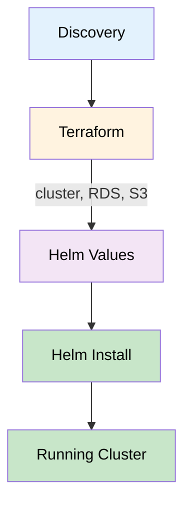
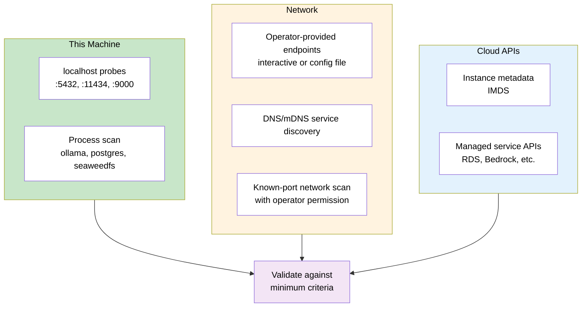
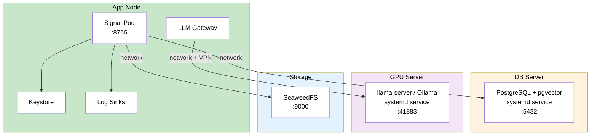
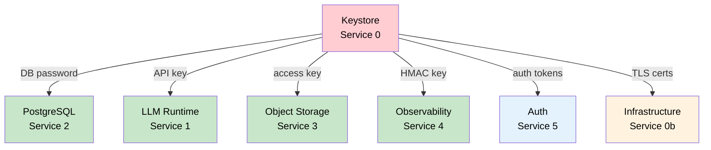
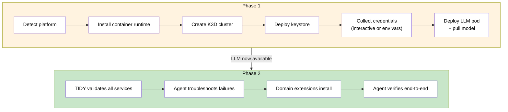
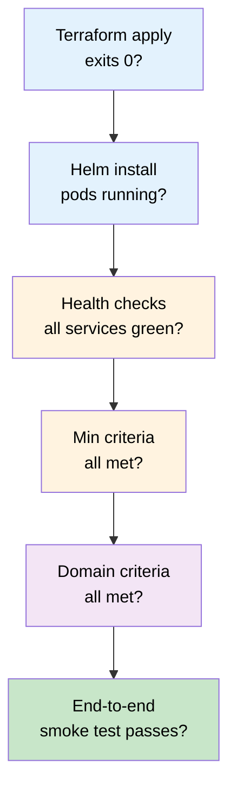
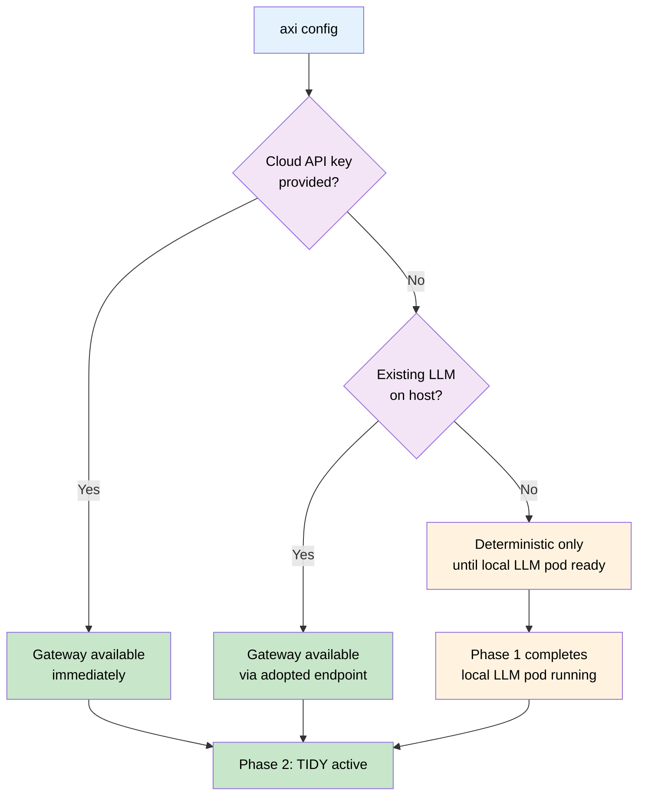

# PRD: Managed Infrastructure

**Status:** Draft
**Date:** 2026-03-31
**Author:** Benjamin Booth

## What This Is

Terraform brought declarative state to infrastructure: *"I want this resource
to exist."* Helm brought parameterized packaging to Kubernetes: *"I want this
app deployed with these values."* Both require the operator to know what they
want and how to express it in the tool's language.

Axiom introduces a third layer: **capability-driven, agent-validated
infrastructure.** The operator (or the application itself) declares what
capabilities it needs — not what resources to provision:

```toml
# What an extension declares (capability intent)
[extension.requires]
llm = { context_window = 8192, latency_ms = 5000 }
database = { engine = "postgresql", extensions = ["vector", "pg_trgm"] }
storage = { protocol = "s3", min_size_gb = 50 }
```

The framework discovers what exists, validates it against the declared
requirements, provisions what's missing, and hands off to an agent for
ongoing health validation. The operator never writes Terraform HCL or
Helm values for the default path — those are generated from the capability
manifest and the discovered environment.

### Three Eras of Infrastructure Automation

| Era | Tool | Operator Says | Tool Knows |
|-----|------|--------------|-----------|
| **IaC** | Terraform | "Create this specific AWS resource with these parameters" | How to converge state |
| **App Packaging** | Helm | "Deploy this chart with these value overrides" | How to render manifests |
| **Agentic Infra** | Axiom | "I need LLM inference and a vector database" | What to provision, where, how, and whether it's healthy |

The shift is from **resource-level** ("give me an RDS instance") to
**capability-level** ("give me a database that supports vector search")
to **intent-level** ("I need to store and retrieve embeddings"). Each
layer subsumes the previous — axiom still uses Terraform and Helm under
the hood, but the operator doesn't interact with them directly.

### What's New (Beyond the State of the Art)

**1. Capability Manifest as the single source of truth.**
Extensions declare what they need, not how to get it. The manifest is
portable across environments — the same capability declaration resolves to
an Ollama pod on a laptop, a Bedrock API call on AWS, or a llama-server on
a GPU node in a private network. No Terraform rewrites, no Helm value
overrides. This is analogous to how a `Dockerfile` declares "I need Python
3.12" without specifying which apt mirror to use.

**2. Adopt-or-provision with managed/unmanaged boundary.**
No existing tool has a first-class concept of "discover a pre-existing
resource, validate it against requirements, and consume it — but don't touch
it." Terraform either manages a resource or ignores it. Axiom's `managed =
false` boundary is a contract: validate but never modify. This maps directly
to how institutional IT works — the DBA manages PostgreSQL, the app team
consumes it, and both parties need to agree on the interface contract.

**3. Two-phase bootstrap with agent handoff.**
The deterministic Phase 1 → agent-assisted Phase 2 transition is new. No
existing infrastructure tool bootstraps the AI that then validates the
infrastructure. This is a self-referential capability: the system installs
itself well enough to bring up an intelligent agent, then the agent takes
over for validation, troubleshooting, and ongoing health monitoring.

**4. Domain-extensible minimum criteria.**
The two-level criteria system (framework base + domain extension overlay)
doesn't exist in Terraform or Helm. Helm values are overrides with no
validation contract. Axiom's criteria are validated contracts — the framework
guarantees a floor, domain layers raise it, and both are enforced at install
time and continuously at runtime.

**5. Remediation-as-documentation.**
Every validation check carries a human-readable remediation string that tells
the operator (or the external administrator) exactly what to do. This is the
infrastructure equivalent of a compiler error message with a fix suggestion.
When the operator can't fix it themselves (`managed = false`), the message
is written for the person who can (the DBA, the network admin, the GPU admin).

### Conventions and Interfaces We Propose

These are patterns axiom introduces that could become standards:

#### 1. Capability Manifest Format

A TOML-based declaration of infrastructure capabilities required by an
application or extension. Portable, composable, validatable.

```toml
[requires.llm]
protocol = "openai_compatible"     # Wire protocol
context_window = 4096              # Minimum
latency_ms = 30000                 # Maximum acceptable
model_params = "7b"                # Minimum model size (optional)

[requires.database]
engine = "postgresql"
version = ">=15"
extensions = ["vector >=0.5", "pg_trgm"]
permissions = ["CREATE TABLE", "CREATE EXTENSION"]

[requires.storage]
protocol = "s3"
operations = ["ListBuckets", "PutObject", "GetObject"]
min_size_gb = 10

[requires.keystore]
backend = "kubernetes_secrets"     # or "aws_sm", "gcp_sm", "azure_kv"
```

Any orchestrator could read this format and provision accordingly — not just
axiom. This could be an open standard.

#### 2. Service Readiness Endpoint Convention

A standard HTTP endpoint that any shared service can expose to declare its
capabilities and health:

```
GET /.well-known/axiom-readiness
```

Response:
```json
{
  "service": "postgresql",
  "version": "16.2",
  "capabilities": {
    "extensions": ["vector 0.7.4", "pg_trgm 1.6"],
    "max_connections": 100,
    "storage_gb": 50
  },
  "health": "ready",
  "managed": false
}
```

Today, axiom probes services using protocol-specific checks (`SELECT version()`,
`GET /v1/models`). A readiness endpoint would let any service self-declare its
capabilities, making discovery faster and more reliable. Infrastructure teams
could deploy a lightweight sidecar or agent that exposes this endpoint for
services that don't natively support it.

#### 3. Remediation Protocol

A structured format for validation failures that includes enough context for
both human operators and AI agents to act on:

```json
{
  "check": "pgvector_installed",
  "status": "fail",
  "current_value": null,
  "required_value": ">=0.5.0",
  "service": "postgresql",
  "service_host": "db-prod.internal.example.edu",
  "managed": false,
  "remediation": {
    "human": "Ask your DBA to run: CREATE EXTENSION vector;",
    "agent": {
      "tool": "sql_execute",
      "args": {"statement": "CREATE EXTENSION IF NOT EXISTS vector;"},
      "requires_permission": "SUPERUSER on target database"
    }
  },
  "required_by": ["axiom.core", "facility-ops.rag"]
}
```

The dual `human` / `agent` remediation means the same validation result can
be consumed by an operator reading terminal output or by TIDY attempting
automated repair (with RACI approval for the `agent` path).

#### 4. Infrastructure Discovery Protocol

A standard for how agents discover services on a network. Today axiom
probes well-known ports and reads `infra.toml`. A standard discovery
protocol could use:

- DNS SRV records (`_postgresql._tcp.infra.example.edu`)
- mDNS/Bonjour for local network discovery
- A registry endpoint (`GET /infrastructure/services`) that IT teams
  maintain for their network

This is the infrastructure equivalent of service mesh discovery, but for
heterogeneous environments where not everything runs in Kubernetes.

## Problem

Axiom extensions depend on shared services: LLM inference, PostgreSQL with
pgvector, S3-compatible object storage, and observability sinks. Today these
are treated as external infrastructure the operator must provision independently.
This creates several problems:

1. **High barrier to entry.** A new user running `axi install` must separately
   install Docker, Kubernetes, PostgreSQL, Ollama, pull a model, configure
   endpoints, and troubleshoot GPU passthrough. Each service has its own install
   ritual, config format, and failure modes.

2. **No lifecycle management.** Once services are manually configured, axiom has
   no visibility into their health, version, or capacity. If PostgreSQL runs out
   of disk or the LLM runtime crashes, axiom degrades silently.

3. **Environment-dependent sprawl.** Laptop, on-prem GPU server, AWS, GCP, Azure
   — each requires different provisioning strategies. Today this knowledge lives
   in tribal docs and one-off scripts, not in axiom itself.

4. **Extension developers can't assume service availability.** Without managed
   infrastructure, every extension must handle "service unavailable" as a
   first-class case, adding defensive code throughout the stack.

## Vision

Running `axi install` on any supported platform should result in a fully
operational axiom instance — all services running, healthy, and registered.
No manual infrastructure steps. Axiom agentically discovers the operating
environment, selects the best provisioning strategy per service, provisions
what's missing, adopts what already exists, and presents a unified health view.

## Design Principles

### Kubernetes Everywhere (K3D)

**K3D is the standard runtime for all environments, including a single laptop.**
Every axiom deployment runs inside a Kubernetes cluster — K3D locally, managed
K8s (EKS/GKE/AKS) in the cloud. This means:

- **One artifact format.** Helm charts + container images. No systemd units,
  launchd plists, or shell wrappers to maintain in parallel.
- **Portable by default.** A K3D cluster on a laptop is topologically identical
  to a cloud cluster. Developers run the same manifests they'll ship.
- **Resource isolation.** Containers get cgroups-enforced limits. A runaway LLM
  can't starve PostgreSQL.
- **GPU passthrough.** K3D supports `--gpus` for NVIDIA GPU access via the
  NVIDIA Container Toolkit. Same mechanism used by cloud GPU node pools.

**Prerequisites:**

| Platform | Container Runtime | Install |
|----------|------------------|---------|
| macOS | Docker Desktop | `brew install --cask docker` |
| Linux | containerd | `apt install containerd` or distro equivalent |
| Windows | Docker Desktop (WSL2) | Docker Desktop installer |

### Terraform for Infrastructure, Helm for Workloads

Infrastructure provisioning follows a two-layer model:

1. **Terraform** provisions the platform itself: Kubernetes cluster (K3D / EKS /
   GKE / AKS), managed databases (RDS / Cloud SQL / Azure PG), object storage
   buckets, networking (VPC, subnets, security groups), IAM roles, and DNS.

2. **Helm** deploys application workloads into the Kubernetes cluster that
   Terraform created: pods, services, configmaps, secrets, persistent volumes.

`axi infra` orchestrates both layers in sequence: Terraform first (if cloud
resources need provisioning), then Helm. On a laptop, Terraform's role is
minimal (K3D cluster creation) and most work is Helm. On a cloud deployment,
Terraform does the heavy lifting (VPC, RDS, EKS) and Helm deploys into the
resulting cluster.

**Reusable Terraform modules** live in `axiom/infra/terraform/modules/` and
are consumed by environment-specific compositions. Domain extension layers
provide their own environment compositions that import axiom's modules.



| Environment | Terraform Scope | Helm Scope |
|-------------|----------------|------------|
| **Laptop** | K3D cluster creation (thin wrapper) | All pods: PostgreSQL, Ollama, Signal, SeaweedFS |
| **Single Linux server** | K3D + optional firewall rules | All pods in K3D |
| **AWS** | VPC, subnets, SGs, EKS cluster, RDS, S3 bucket, IAM roles | Signal pod, Ollama pod (GPU node), config |
| **GCP** | VPC, GKE cluster, Cloud SQL, GCS bucket, IAM | Signal pod, Ollama pod, config |
| **Azure** | VNet, AKS cluster, Azure PG, Blob Storage, RBAC | Signal pod, Ollama pod, config |
| **Private cloud** | K3D + network config (optional) | All pods in K3D |

### Adopt First, Provision Second

The installer MUST prefer discovering and reusing existing shared resources over
provisioning new ones. A fresh install is the last resort.

When an existing resource is found (e.g., Ollama already running, PostgreSQL
already accessible), the installer verifies it meets **minimum operating criteria**
defined by axiom. If it falls short but can be upgraded non-destructively (e.g.,
`CREATE EXTENSION vector`, pull an additional model), the installer requests
permission and performs the upgrade. If it lacks permission, it reports the gap
and provides remediation steps.

This principle applies uniformly to every managed service. Domain extension
layers may raise minimum criteria but never lower axiom's floors.

### Network-Aware Discovery (Private Cloud / Institutional Networks)

Not all shared services run on the machine being installed to, and not all
shared services run in Kubernetes. In institutional environments (university
HPC clusters, national lab networks, air-gapped facilities), shared services
are often:

- Managed by a separate IT team on dedicated hardware
- Running as bare systemd/init services, not in containers
- Accessible only over the internal network (not localhost)
- Pre-existing and non-replaceable (the operator cannot provision alternatives)

**The installer MUST discover services across the network, not just localhost.**

#### Discovery Scope



Discovery runs in three tiers:

1. **Localhost** (automatic) — probe well-known ports, scan running processes
2. **Network** (interactive or config-driven) — the installer asks the operator:
   *"Is there an existing PostgreSQL server on this network?"* If yes, prompt
   for hostname:port. If the operator provides an infrastructure manifest
   (`infra.toml`), skip the prompts entirely.
3. **Cloud APIs** (automatic if on cloud) — query IMDS + managed service APIs

#### Infrastructure Manifest (`infra.toml`)

For environments where services are pre-provisioned by IT, the operator (or IT
team) provides a manifest that tells axiom where everything lives:

```toml
# runtime/config/infra.toml — provided by IT or operator
# Axiom will validate each endpoint against minimum criteria
# but will NOT attempt to provision or modify these services.

[postgresql]
host = "db-prod.internal.example.edu"
port = 5432
database = "axiom_db"
username = "axiom"
# Password in keystore, not here
managed = false  # Axiom must not attempt to upgrade or restart

[llm]
endpoint = "https://gpu-server.internal.example.edu:41883/v1"
kind = "openai_compatible"
model = "qwen2.5-72b"
requires_vpn = true
managed = false

[storage]
endpoint = "https://seaweedfs.internal.example.edu"
bucket = "axiom-rag"
managed = false

[keystore]
backend = "kubernetes"  # Still K8s secrets on the local cluster
managed = true
```

**`managed = false`** means axiom will validate but NEVER attempt to:
- Restart, upgrade, or reconfigure the service
- Install extensions or pull models
- Create databases or buckets

It will only: connect, validate minimum criteria, report gaps to the operator
as actionable instructions for the external service's administrator.

**`managed = true`** means axiom owns the lifecycle and may provision, upgrade,
restart, and configure the service.

#### Hybrid Topology

The typical private-cloud deployment is **hybrid**: the axiom application runs
in K3D on the operator's machine (or a dedicated app server), but shared
services live elsewhere on the network as bare-metal or VM-hosted processes.



K3D runs only the axiom application and its local platform services (keystore,
log sinks). The heavy shared services (database, LLM, storage) are consumed
over the network. Terraform's role in this topology is minimal — it creates the
local K3D cluster and generates Helm values that point to the external
endpoints from `infra.toml`.

#### Functional Requirements (Network Discovery)

| ID | Requirement | Priority |
|----|-------------|----------|
| NET-1 | `axi infra` prompts for network endpoints when localhost probes find no services | P0 |
| NET-2 | `infra.toml` manifest skips interactive prompts — IT provides pre-configured endpoints | P0 |
| NET-3 | `managed = false` prevents axiom from modifying external services | P0 |
| NET-4 | Validate external services against minimum criteria (connection, version, permissions) | P0 |
| NET-5 | Report validation gaps as actionable instructions for the external service's administrator | P0 |
| NET-6 | Helm values auto-generated from `infra.toml` (e.g., `externalDatabase.host`) | P1 |
| NET-7 | VPN/network connectivity check before registering `requires_vpn` endpoints | P0 |
| NET-8 | DNS/mDNS service discovery for common service names (optional, operator opt-in) | P2 |

### Single Machine to Multi-Cloud

The same `axi infra` command works on a laptop, a bare Linux server, a private
cloud network, AWS, GCP, and Azure. Platform detection is automatic. The
topology adapts to what's available:

| What's available | Topology | Terraform scope | Helm scope |
|-----------------|----------|----------------|------------|
| Just this laptop | All-in-K3D | K3D cluster | All pods |
| This machine + network services | Hybrid (K3D app + external services) | K3D cluster; Helm values from `infra.toml` | App pods only |
| Cloud instance | K3D + managed cloud services | K3D + RDS/Bedrock/S3 | App pods only |
| Managed K8s cluster | Full cloud | EKS/GKE/AKS + managed services | App pods |
| Existing cluster + existing services | Adopt all | Minimal (validate only) | App pods |

## Managed Services

### Service 0: Keystore

**What:** Unified secrets management for all credentials: database passwords,
LLM API keys, S3 access keys, auth tokens, TLS certificates, HMAC signing keys.
**Why:** Every other managed service depends on credentials. Without a keystore,
secrets are scattered across `.env` files, raw K8s Secrets, shell environment
variables, and operator memory. This is the single highest-risk gap in the stack.
**Owner:** axiom (`axiom.infra.keystore`)

#### Problem Today

| Where secrets live | Risk |
|-------------------|------|
| `.env` files (gitignored but on disk) | Readable by any process, no access audit |
| Kubernetes `Secret` objects (base64, not encrypted) | Visible to anyone with `kubectl get secret` |
| Shell environment variables | Inherited by child processes, visible in `/proc` |
| Operator memory ("I set it up once") | Unrecoverable if operator unavailable |

#### User Stories

- **US-KEY-1:** During `axi install`, secrets are collected once (interactively
  or from env vars) and stored in the keystore — never in plain files again
- **US-KEY-2:** All services (PostgreSQL, LLM, S3, auth) retrieve credentials
  from the keystore at startup, not from environment variables or files
- **US-KEY-3:** `axi secrets list` shows what's stored (names only, never values)
- **US-KEY-4:** `axi secrets set <key>` rotates a credential and propagates to
  dependent services without redeployment
- **US-KEY-5:** On cloud, axiom uses the native secrets manager (AWS Secrets
  Manager, GCP Secret Manager, Azure Key Vault) as the backend
- **US-KEY-6:** On laptop/bare metal, axiom uses Kubernetes Secrets with optional
  Sealed Secrets or SOPS encryption at rest

#### Functional Requirements

| ID | Requirement | Priority |
|----|-------------|----------|
| KEY-1 | Discover existing secrets backend (K8s Secrets, AWS SM, GCP SM, Azure KV) | P0 |
| KEY-2 | Store all service credentials in keystore during `axi install` | P0 |
| KEY-3 | Services read credentials from keystore (K8s Secret mount or CSI driver), never `.env` | P0 |
| KEY-4 | `axi secrets list/set/delete` CLI commands | P1 |
| KEY-5 | On AWS: use Secrets Manager + CSI Secrets Store driver | P1 |
| KEY-6 | On GCP: use Secret Manager + CSI driver | P2 |
| KEY-7 | On Azure: use Key Vault + CSI driver | P2 |
| KEY-8 | On laptop/bare metal: K8s Secrets + optional SOPS encryption | P0 |
| KEY-9 | Secret rotation: update credential, restart dependent pods automatically | P2 |
| KEY-10 | Audit log: record who/when accessed or modified each secret | P2 |

#### Minimum Operating Criteria

| Criterion | Minimum | Verification |
|-----------|---------|-------------|
| K8s Secrets API accessible | Required | `kubectl create secret` probe |
| DB password stored (not default) | Required | Secret exists and != factory default |
| LLM API key or local endpoint | Required | Secret exists or local Ollama running |
| No plain-text `.env` in production | Required | Warn if `.env` contains secrets in deployed env |

#### Keystore Backend by Environment

| Environment | Backend | Encryption at Rest | Rotation |
|-------------|---------|-------------------|----------|
| Laptop (K3D) | K8s Secrets + optional SOPS | SOPS + age key | Manual via `axi secrets set` |
| Bare metal / Private cloud | K8s Secrets + Sealed Secrets | Sealed Secrets controller | Manual or cron |
| AWS | Secrets Manager + CSI driver | AWS KMS | Automatic (SM rotation lambda) |
| GCP | Secret Manager + CSI driver | Google KMS | Automatic (SM rotation) |
| Azure | Key Vault + CSI driver | Azure KMS | Automatic (KV rotation) |

#### Relationship to Other Services



---

### Service 0b: Infrastructure Layer (Terraform + Helm)

**What:** The platform itself — Kubernetes cluster, networking, IAM, and the
orchestration that ties Terraform and Helm into a single `axi infra` command.
**Why:** Every other service depends on a running cluster and correctly
configured cloud resources. This is the foundation layer.
**Owner:** axiom (`axiom.setup.infra`)

#### User Stories

- **US-INFRA-1:** On a laptop, `axi infra` creates a K3D cluster with port
  mappings and GPU passthrough (if available) in < 2 minutes
- **US-INFRA-2:** On AWS, `axi infra` runs Terraform to provision VPC, EKS,
  RDS, S3, and IAM roles, then Helm-installs workloads into the cluster
- **US-INFRA-3:** Operator with existing EKS/GKE/AKS cluster points axiom at it;
  axiom validates the cluster meets minimum criteria, skips Terraform, runs Helm
- **US-INFRA-4:** `axi infra --plan` shows what Terraform and Helm would do
  without executing (dry run)
- **US-INFRA-5:** `axi infra --destroy` tears down all axiom-managed resources
  cleanly (Helm uninstall, then Terraform destroy)

#### Functional Requirements

| ID | Requirement | Priority |
|----|-------------|----------|
| INFRA-1 | Detect platform (bare metal, AWS, GCP, Azure) via instance metadata | P0 |
| INFRA-2 | On laptop/bare metal: provision K3D cluster via Terraform (thin `k3d_cluster` resource or local-exec) | P0 |
| INFRA-3 | On AWS: provision VPC, EKS, RDS, S3, IAM via reusable Terraform modules | P1 |
| INFRA-4 | On GCP: provision VPC, GKE, Cloud SQL, GCS, IAM via Terraform modules | P2 |
| INFRA-5 | On Azure: provision VNet, AKS, Azure PG, Blob Storage, RBAC via Terraform modules | P2 |
| INFRA-6 | Adopt existing K8s cluster: validate API server, RBAC, storage class, GPU scheduling | P0 |
| INFRA-7 | `axi infra --plan` runs `terraform plan` + `helm template` (dry run) | P1 |
| INFRA-8 | `axi infra --destroy` runs `helm uninstall` then `terraform destroy` | P1 |
| INFRA-9 | Terraform state stored locally by default; S3/GCS/Azure backend configurable | P1 |
| INFRA-10 | Terraform modules are reusable: domain extensions import axiom's modules | P0 |
| INFRA-11 | Helm values auto-generated from Terraform outputs (RDS endpoint → `externalDatabase.host`) | P1 |

#### Minimum Operating Criteria

| Criterion | Minimum | Verification |
|-----------|---------|-------------|
| Kubernetes API server | Responds to `kubectl cluster-info` | API server health |
| kubectl context | Valid kubeconfig with current-context set | `kubectl config current-context` |
| Helm | >= 3.12 installed | `helm version` |
| Terraform | >= 1.5 installed | `terraform version` |
| Container runtime | Docker or containerd running | `docker info` or `ctr version` |
| Storage class | At least one default StorageClass | `kubectl get sc` |
| RBAC | Permission to create namespaces, deployments, services, PVCs | RBAC probe |

#### Terraform Module Inventory

| Module | Path | What it provisions |
|--------|------|-------------------|
| `secrets-backend` | `infra/terraform/modules/secrets-backend/` | Cloud secrets manager + CSI driver (or SOPS for local) |
| `k3d-cluster` | `infra/terraform/modules/k3d-cluster/` | K3D cluster with port mappings, GPU flag, registry |
| `rds-pgvector` | `infra/terraform/modules/rds-pgvector/` | AWS RDS PostgreSQL + pgvector (exists today) |
| `eks-cluster` | `infra/terraform/modules/eks-cluster/` | EKS cluster + managed node groups + GPU pool |
| `gke-cluster` | `infra/terraform/modules/gke-cluster/` | GKE Autopilot or Standard + GPU pool |
| `aks-cluster` | `infra/terraform/modules/aks-cluster/` | AKS cluster + GPU node pool |
| `s3-storage` | `infra/terraform/modules/s3-storage/` | S3 bucket with versioning + lifecycle |
| `vpc-network` | `infra/terraform/modules/vpc-network/` | VPC, subnets, NAT, security groups |

Domain extension layers compose these modules in their own
`infra/terraform/environments/` directory, adding domain-specific resources
(e.g., compliance audit buckets, export-controlled storage partitions).

---

### Service 1: LLM Runtime

**What:** Local SLM/LLM inference (Ollama, llama-server) or cloud LLM API.
**Why:** Required for signal extraction, RAG synthesis, document generation, chat.
**Owner:** `axiom.infra.gateway` + `axiom.infra.llm_runtime`

#### User Stories

- **US-LLM-1:** First-time setup detects GPU, installs Ollama pod, pulls default model
- **US-LLM-2:** GPU server auto-sizes model to available VRAM
- **US-LLM-3:** Cloud-only operator provides API key, skips local runtime
- **US-LLM-4:** `axi llm pull/list/default` manages models through axiom CLI
- **US-LLM-5:** `axi status` shows LLM health, loaded models, VRAM headroom
- **US-LLM-6:** BYOI operator registers existing endpoint via `axi llm add`

#### Functional Requirements

| ID | Requirement | Priority |
|----|-------------|----------|
| LLM-1 | Discover GPU vendor, driver, VRAM, CUDA/ROCm | P0 |
| LLM-2 | Discover existing LLM endpoints (localhost, network, cloud APIs) | P0 |
| LLM-3 | Verify existing endpoints against minimum criteria before adopting | P0 |
| LLM-4 | Upgrade existing below-minimum endpoints non-destructively (with permission) | P0 |
| LLM-5 | Provision Ollama in K3D pod with GPU passthrough if no endpoint found | P0 |
| LLM-6 | Auto-select model based on VRAM tier | P0 |
| LLM-7 | Register endpoint in `llm-providers.toml` automatically | P0 |
| LLM-8 | `axi llm status/list/pull/default/add/remove/restart` CLI commands | P1 |
| LLM-9 | Health monitoring in `axi status` and pod readiness probes | P1 |
| LLM-10 | Multi-model routing (different models for different extension needs) | P2 |
| LLM-11 | Hot-swap model without restarting axiom | P2 |

#### Minimum Operating Criteria

| Criterion | Minimum | Verification |
|-----------|---------|-------------|
| OpenAI-compatible `/v1/chat/completions` | Required | POST test prompt, expect 200 |
| At least one model loaded or pullable | Required | GET `/v1/models` non-empty |
| Response latency | < 30s for short completion | Timed test |
| Context window | >= 4096 tokens | Model metadata |

---

### Service 2: PostgreSQL + pgvector

**What:** Relational database with vector similarity search.
**Why:** Required for signal storage, RAG embeddings, media indexing, audit trails.
**Owner:** axiom (Alembic migrations for `axiom_db`)

#### User Stories

- **US-PG-1:** First-time setup provisions PostgreSQL pod in K3D with pgvector
- **US-PG-2:** Operator with existing PostgreSQL points axiom at it; axiom verifies
  pgvector is installed and creates its database
- **US-PG-3:** Cloud operator uses RDS/Cloud SQL; axiom verifies extensions and schema
- **US-PG-4:** `axi status` shows database health, table count, storage usage

#### Functional Requirements

| ID | Requirement | Priority |
|----|-------------|----------|
| PG-1 | Discover existing PostgreSQL (localhost, network, cloud managed) | P0 |
| PG-2 | Verify pgvector extension installed; create if permission allows | P0 |
| PG-3 | Verify `CREATE TABLE` permission in target database | P0 |
| PG-4 | Run Alembic migrations automatically on first connect | P0 |
| PG-5 | Provision pgvector/pgvector:pg16 pod in K3D if no instance found | P0 |
| PG-6 | Register connection in `AXIOM_DB_URL` config | P0 |
| PG-7 | Health monitoring in `axi status` (connectivity, migration status, disk) | P1 |
| PG-8 | Backup/restore commands via `axi db backup` / `axi db restore` | P2 |

#### Minimum Operating Criteria

| Criterion | Minimum | Verification |
|-----------|---------|-------------|
| PostgreSQL version | >= 15 | `SELECT version()` |
| pgvector extension | >= 0.5.0 installed or installable | `pg_extension` catalog |
| `CREATE EXTENSION` permission | Required | Test `CREATE EXTENSION IF NOT EXISTS vector` |
| `CREATE TABLE` permission | Required | Probe table create/drop |
| pg_trgm extension | Recommended | `CREATE EXTENSION IF NOT EXISTS pg_trgm` |

---

### Service 3: Object Storage (S3-Compatible)

**What:** S3-compatible object store for RAG packs, media files, document exports.
**Why:** Required for RAG pack server, media library, document lifecycle.
**Owner:** Infrastructure (SeaweedFS pod or cloud S3)

#### User Stories

- **US-S3-1:** First-time setup provisions SeaweedFS pod in K3D
- **US-S3-2:** Cloud operator configures AWS S3 / GCS / Azure Blob
- **US-S3-3:** `axi status` shows storage health and bucket inventory

#### Functional Requirements

| ID | Requirement | Priority |
|----|-------------|----------|
| S3-1 | Discover existing S3-compatible endpoints | P1 |
| S3-2 | Verify read/write permission to target bucket | P1 |
| S3-3 | Provision SeaweedFS pod in K3D if no endpoint found | P1 |
| S3-4 | Register endpoint in axiom config | P1 |
| S3-5 | Health monitoring in `axi status` | P2 |

#### Minimum Operating Criteria

| Criterion | Minimum | Verification |
|-----------|---------|-------------|
| S3-compatible API | ListBuckets, PutObject, GetObject | Test operations on probe bucket |
| Write permission | Required | PUT probe object, then DELETE |
| Bucket exists or createable | Required | CreateBucket or HEAD existing |

---

### Service 4: Observability

**What:** Log aggregation, metrics collection, health dashboards.
**Why:** Required for operational visibility, incident response, audit compliance.
**Owner:** axiom (`axiom.infra.log_sinks`, `axiom.infra.metrics`)

#### User Stories

- **US-OBS-1:** Default install writes structured logs to persistent volume
- **US-OBS-2:** Cloud operator routes logs to CloudWatch / Stackdriver / Azure Monitor
- **US-OBS-3:** `axi status` shows all sink health and recent error rate

#### Functional Requirements

| ID | Requirement | Priority |
|----|-------------|----------|
| OBS-1 | Default file-based log sink provisioned automatically | P0 |
| OBS-2 | Discover existing log aggregators (Loki, CloudWatch, etc.) | P2 |
| OBS-3 | Prometheus metrics endpoint on all pods (`/metrics`) | P2 |
| OBS-4 | Health monitoring of all sinks in `axi status` | P1 |

#### Minimum Operating Criteria

| Criterion | Minimum | Verification |
|-----------|---------|-------------|
| At least one writable log sink | Required | Test write to default file sink |
| Log sink path on persistent storage | Required | Verify volume mount |

---

### Service 5: Identity and Access Management (IAM)

**What:** OAuth 2.0 + SSO for authentication, OpenFGA for fine-grained
authorization (ReBAC/RBAC/ABAC). Not a future concern — IAM is a foundational
service required for any multi-user or networked deployment.
**Why:** Without IAM, all API endpoints are unauthenticated, all data is
accessible to all users, and there is no audit trail for who did what.
Multi-tenant data isolation (required by the data platform) depends on IAM
for row-level security enforcement.
**Owner:** axiom (`axiom.infra.iam`)

#### User Stories

- **US-IAM-1:** Single-user laptop deployment works with no IAM (implicit
  local-admin identity, no auth required)
- **US-IAM-2:** Multi-user deployment authenticates via OAuth 2.0 / OIDC
  (institutional SSO, Google, GitHub, or local identity provider)
- **US-IAM-3:** Authorization uses OpenFGA for relationship-based access
  control — users see only data from their facility/project
- **US-IAM-4:** Every API call carries an identity token; every write
  operation is attributed in the audit log
- **US-IAM-5:** Domain extensions declare authorization tuples in their
  manifest (e.g., "user X can read facility Y's data")

#### Functional Requirements

| ID | Requirement | Priority |
|----|-------------|----------|
| IAM-1 | Single-user mode: implicit local-admin, no auth overhead | P0 |
| IAM-2 | OAuth 2.0 / OIDC provider integration (Ory Kratos or compatible) | P1 |
| IAM-3 | OpenFGA for ReBAC (relationship-based access control) | P1 |
| IAM-4 | Row-level security on data platform queries (facility/project scoping) | P1 |
| IAM-5 | Every API endpoint requires valid token in multi-user mode | P1 |
| IAM-6 | Audit log records identity on every write operation | P1 |
| IAM-7 | Domain extensions declare authorization model in manifest | P2 |
| IAM-8 | RBAC roles: admin, operator, viewer, extension-developer | P1 |
| IAM-9 | SSO integration with institutional identity providers (SAML, LDAP) | P2 |
| IAM-10 | Service-to-service auth (pod identity, mTLS or service account tokens) | P2 |

#### Minimum Operating Criteria

| Criterion | Minimum | Verification |
|-----------|---------|-------------|
| Single-user mode functional without IAM | Required | `axi chat` works with no auth config |
| Token validation endpoint reachable (multi-user) | Required | `GET /auth/userinfo` returns 200 |
| OpenFGA store accessible | Required (multi-user) | FGA `check` API responds |
| Identity attributed in audit log | Required | Test write → verify `user_id` in log |

#### IAM by Deployment Size

| Size | Auth | AuthZ | Identity Provider |
|------|------|-------|------------------|
| Single-user | None (implicit) | None (full access) | Local admin |
| Small team | OAuth 2.0 (Kratos) | RBAC (admin/operator/viewer) | Local or GitHub SSO |
| Department | OAuth 2.0 + SSO | OpenFGA ReBAC (project-scoped) | Institutional SAML/LDAP |
| Multi-facility | OAuth 2.0 + SSO | OpenFGA ReBAC (facility × role) | Federated identity |

---

### Service 6: Data Platform (First Consumer)

**What:** Medallion lakehouse (Bronze/Silver/Gold) with Apache Iceberg tables,
dbt transforms, Dagster orchestration, and Kafka streaming — the primary
application built on top of the managed infrastructure.
**Why:** The data platform is the reason the infrastructure exists. Every other
service (LLM, PostgreSQL, S3, keystore, IAM) is consumed by the data platform.
If the managed infrastructure doesn't account for data platform requirements,
it's solving the wrong problem.
**Owner:** axiom (`axiom.data`) — see `prd-data-platform.md` and
`spec-data-architecture.md` for the full design.

#### How the Data Platform Consumes Managed Services

```mermaid
graph TB
    subgraph dp["Data Platform"]
        B["Bronze<br/>raw ingestion"]
        S["Silver<br/>cleaning + validation"]
        G["Gold<br/>aggregation + KPIs"]
        DAG["Dagster<br/>orchestration"]
        K["Kafka<br/>streaming"]
    end
    subgraph infra["Managed Infra"]
        PG["PostgreSQL<br/>Iceberg catalog + metadata"]
        S3["S3 / SeaweedFS<br/>Iceberg data files + Parquet"]
        LLM["LLM Runtime<br/>extraction, synthesis"]
        KS["Keystore<br/>credentials for all connectors"]
        IAM["IAM<br/>row-level security on queries"]
        OBS["Observability<br/>pipeline health metrics"]
    end
    B --> PG
    B --> S3
    B --> K
    S --> PG
    G --> PG
    DAG --> PG
    DAG --> S3
    DAG --> LLM
    DAG --> KS
    G --> IAM
    DAG --> OBS

    style dp fill:#c8e6c9,color:#000000
    style infra fill:#e3f2fd,color:#000000
    style B fill:#ffffff,color:#000000
    style S fill:#ffffff,color:#000000
    style G fill:#ffffff,color:#000000
    style DAG fill:#ffffff,color:#000000
    style K fill:#ffffff,color:#000000
    style PG fill:#ffffff,color:#000000
    style S3 fill:#ffffff,color:#000000
    style LLM fill:#ffffff,color:#000000
    style KS fill:#ffffff,color:#000000
    style IAM fill:#ffffff,color:#000000
    style OBS fill:#ffffff,color:#000000
```



#### Infrastructure Requirements from the Data Platform

| Data Platform Need | Infrastructure Service | Specific Requirement |
|-------------------|----------------------|---------------------|
| Iceberg catalog | PostgreSQL | REST catalog tables, schema evolution DDL |
| Iceberg data files | S3 / SeaweedFS | Parquet read/write, snapshot management |
| Bronze ingestion | Kafka | Topic creation, producer/consumer access |
| Silver transforms | dbt + PostgreSQL | dbt model execution, test framework |
| Gold aggregations | dbt + PostgreSQL | Incremental materialization |
| Orchestration | Dagster | Scheduler pod, sensor triggers, backfill |
| Signal extraction | LLM Runtime | Structured extraction from unstructured text |
| Multi-tenant queries | IAM + OpenFGA | Row-level security on all Gold views |
| Pipeline credentials | Keystore | DB passwords, S3 keys, API tokens for connectors |
| Pipeline health | Observability | Dagster job status, data freshness, quality scores |

#### Capability Manifest (Data Platform Extension)

```toml
[extension]
name = "data-platform"
kind = "service"

[extension.requires.database]
engine = "postgresql"
version = ">=15"
extensions = ["vector >=0.5", "pg_trgm"]
# Iceberg REST catalog needs these tables
permissions = ["CREATE TABLE", "CREATE SCHEMA", "CREATE EXTENSION"]

[extension.requires.storage]
protocol = "s3"
operations = ["ListBuckets", "PutObject", "GetObject", "DeleteObject"]
min_size_gb = 50  # Parquet data files grow

[extension.requires.streaming]
protocol = "kafka"
version = ">=3.3"
topics_createable = true

[extension.requires.orchestration]
engine = "dagster"
scheduler = true
sensors = true
```

This is the first real test of the Capability Manifest pattern — if the managed
infrastructure can provision and validate everything the data platform needs
from a single manifest declaration, the design works.

---

## Deployment Sizing

Infrastructure requirements vary dramatically by deployment scale. Rather than
static T-shirt sizes, axiom uses **capability-driven sizing** — the provisioner
examines the declared requirements, the available hardware, and the expected
workload to select resource allocations. However, the following reference
profiles provide useful defaults.

### Reference Profiles

| Profile | Users | Data Volume | Hardware | K8s | Use Case |
|---------|-------|------------|----------|-----|----------|
| **Minimal** | 1 | < 1 GB | 4 GB RAM, 2 CPU, no GPU | K3D (1 node) | Development, CI, demo |
| **Small** | 1–5 | 1–50 GB | 16 GB RAM, 4 CPU, optional GPU | K3D (1 node) | Research group, single facility |
| **Medium** | 5–25 | 50–500 GB | 64 GB RAM, 16 CPU, 1 GPU (24 GB) | K3D or managed K8s | Department, multi-project |
| **Large** | 25–100 | 500 GB–5 TB | 256 GB RAM, 64 CPU, 2+ GPU | Managed K8s (EKS/GKE/AKS) | Multi-facility, fleet operations |
| **Enterprise** | 100+ | 5+ TB | Multi-node cluster, dedicated GPU pool | Managed K8s + managed services | Multi-site federation |

### Per-Service Resource Allocation

| Service | Minimal | Small | Medium | Large |
|---------|---------|-------|--------|-------|
| **LLM** | CPU-only, phi3:mini (2.3 GB) | CPU or 6 GB GPU, qwen2.5:7b | 24 GB GPU, qwen2.5:32b | Multi-GPU, qwen2.5:72b |
| **PostgreSQL** | 256 MB, 1 GB disk | 1 GB, 10 GB disk | 4 GB, 100 GB disk | 16 GB, 1 TB disk, replicas |
| **S3 / SeaweedFS** | 1 GB | 10 GB | 100 GB | 1 TB+ |
| **Kafka** | Disabled (batch only) | Disabled (batch only) | Single broker, 10 GB | Multi-broker, 100 GB+ |
| **Dagster** | In-process | Single pod | Dedicated pod + workers | Multi-worker, K8s executor |
| **IAM** | Disabled (single-user) | Kratos + basic RBAC | Kratos + OpenFGA | Federated SSO + OpenFGA |

### Dynamic Sizing

The provisioner does not blindly apply a profile. It adapts:

- **GPU detected but only 6 GB VRAM?** → Use "Small" LLM model but "Medium"
  database if disk is plentiful.
- **128 GB RAM but no GPU?** → Cloud LLM API + large in-memory PostgreSQL.
- **Air-gapped with pre-loaded models?** → Skip Kafka (no external connectors),
  maximize local storage.

The agentic installer treats sizing as a constraint satisfaction problem:
given the hardware capabilities and the merged capability manifest from all
extensions, find the allocation that satisfies all requirements with the
available resources.

---

## Agent-Managed Installation

### The Bootstrap Problem

Installation is a phased process where each phase unlocks capabilities for
the next. The critical constraint: **the LLM is not available until the
infrastructure it runs on is provisioned.** This creates two distinct modes.



**Phase 1 (Deterministic):** No LLM needed. Pure scripted logic — platform
detection, container runtime install, K3D cluster creation, keystore setup,
credential collection, Terraform apply, Helm install. Every decision is
deterministic with hardcoded remediation messages on failure. This is `axi infra`.

**Phase 2 (Agent-Assisted):** LLM is now running. TIDY validates the
entire stack, remediates failures, installs domain extensions, and verifies
end-to-end operation. This is `axi hygiene validate`.

### Which Agent Manages Installation?

**TIDY (Steward)** is the infrastructure lifecycle agent. His role is building,
provisioning, validating, and maintaining — the proactive work of keeping the
ship running. **TRIAGE (Diagnostics)** is the specialist called when something
is broken and TIDY can't resolve it on his own.

| Phase | Actor | Mode | LLM Required |
|-------|-------|------|:---:|
| Platform detection | TIDY via `axi infra` (deterministic) | Script | No |
| Terraform apply | TIDY via `axi infra` (deterministic) | Script | No |
| Helm install | TIDY via `axi infra` (deterministic) | Script | No |
| Credential collection | TIDY via `axi config` (interactive) | Wizard | No |
| Post-install validation | TIDY agent | Agent | Yes |
| Extension install | TIDY agent | Agent | Yes |
| Ongoing health monitoring | TIDY agent (daemon) | Daemon | Yes |
| Root-cause troubleshooting | TRIAGE (escalated by TIDY) | Conversational | Yes |

TIDY's install-time skills:

| Skill | What it does | Example |
|-------|-------------|---------|
| `validate_service(name)` | Run minimum criteria checks for a service | Verify pgvector >= 0.5.0 |
| `remediate(check)` | Propose and execute fix for a failed check (with RACI approval) | Pull missing model, create extension |
| `install_extension(name)` | Install a domain extension: Terraform hooks, Helm overlays, criteria validation | Install facility-ops, verify pgcrypto |
| `verify_end_to_end()` | Run a full-stack smoke test | Ingest test signal → extract → store → query |
| `rotate_secret(key)` | Update credential in keystore, propagate to pods, verify health | Rotate DB password after compliance review |
| `escalate_to_dfib(check)` | Hand off to TRIAGE when automated remediation fails | "PostgreSQL pod in CrashLoopBackOff — need root cause analysis" |

### How Domain Extensions Specialize Installation

Domain extension layers (e.g., a facility operations platform built on axiom)
hook into installation via their extension manifest:

```toml
# example-extension.toml (domain extension)
[extension]
name = "facility-ops"
kind = "agent"

[extension.install]
# Phase 1 hooks (deterministic, no LLM)
terraform_module = "infra/terraform/modules/facility-audit-bucket"
helm_values_overlay = "infra/helm/values-facility.yaml"

# Phase 2 hooks (agent-assisted, LLM available)
post_install_validation = "facility_ops.setup:validate"
elevated_criteria_module = "facility_ops.setup:get_min_criteria"

[extension.min_criteria.llm]
context_window = 8192
min_model_params = "7b"

[extension.min_criteria.postgresql]
extensions = ["vector", "pg_trgm", "pgcrypto"]
```

During `axi infra`, the installer discovers domain extensions and:
1. Includes their Terraform modules in the apply
2. Merges their Helm values overlay
3. After Phase 2 begins, runs their `post_install_validation` hook
4. TIDY validates their elevated `min_criteria`

### Safety and Validation

#### The Two Guarantees

1. **Phase 1 never requires human judgment.** Every decision is deterministic.
   If something fails, the installer prints the exact error and remediation
   steps — no LLM hallucination risk during critical infrastructure setup.

2. **Phase 2 never acts without approval.** TIDY operates under the RACI
   framework. Infrastructure write operations (restart pod, pull model, create
   extension) require explicit approval unless the operator has pre-authorized
   them via trust settings.

#### Validation Chain



Each step must pass before the next begins. If any step fails:
- Phase 1: deterministic error message + remediation steps
- Phase 2: TIDY proposes fix, requests RACI approval, executes; escalates to TRIAGE if root cause unclear

### CLI Commands for Installation

#### Existing (audit confirmed working)

| Command | What it does | Phase |
|---------|-------------|-------|
| `axi config` | 7-phase setup wizard (probe → infra → credentials → test) | 1 |
| `axi infra` | Infrastructure detection and provisioning | 1 |
| `axi infra --check` | Status-only, no changes | 1 |
| `axi infra --json` | Machine-readable output | 1 |
| `axi doctor` / `axi dr` | Diagnostics with LLM-powered troubleshooting | 2 |

#### Needed (gaps identified in audit)

| Command | What it does | Phase | Priority |
|---------|-------------|-------|----------|
| `axi infra --plan` | Dry run: show what Terraform + Helm would do | 1 | P1 |
| `axi infra --destroy` | Tear down all managed resources | 1 | P1 |
| `axi hygiene validate` | Full agent-managed post-install validation | 2 | P0 |
| `axi doctor --smoke` | End-to-end smoke test (ingest → store → query) | 2 | P1 |
| `axi secrets list` | Show stored credentials (names only) | 1 | P1 |
| `axi secrets set <key>` | Rotate a credential, propagate to pods | 1 | P1 |
| `axi llm status` | LLM runtime health, loaded models, VRAM | 2 | P1 |
| `axi llm pull <model>` | Download model to managed runtime | 2 | P1 |
| `axi ext install <name>` | Install domain extension + run its install hooks | 2 | P1 |

#### Bootstrap LLM: Solving the Chicken-and-Egg

The LLM is not available during Phase 1. Three strategies, in priority order:

1. **Cloud API key collected early.** If the operator provides an API key
   (OpenAI, Anthropic) during credential collection, the gateway becomes
   available immediately — even before the local LLM pod is running. This
   enables TIDY to validate and remediate local LLM provisioning failures.

2. **Deterministic fallback.** If no API key is provided, Phase 1 completes
   entirely without LLM. Hardcoded remediation messages cover all known
   failure modes. Phase 2 begins only after the local LLM pod is healthy.

3. **Pre-existing LLM endpoint.** If an Ollama or llama-server is already
   running on the host (adopt-first principle), the gateway registers it
   before K3D provisioning begins, making TIDY's agent mode available throughout.



### Known Issues (From Audit)

| Issue | Status | Fix Required |
|-------|--------|-------------|
| `axiom.ask` module referenced in `setup/infra.py` but does not exist | Broken | Implement as thin wrapper around `Gateway.complete()` |
| `troubleshoot_with_llm()` silently fails (ImportError caught) | Degraded | Wire to gateway; fallback to hardcoded messages |
| Credential collection happens AFTER infra setup | Design gap | Move cloud API key prompt to beginning of Phase 1 |
| Domain install commands and `axi config` are disconnected | Design gap | Domain extensions register install hooks in manifest |
| Agent daemon startup modes declared but not orchestrated | Incomplete | TIDY agent should manage daemon lifecycle post-install |
| TIDY has no install-time role yet | Missing feature | Add `axi hygiene validate` for Phase 2 validation |

## Release Pipeline and Node Updates

Software does not stop at installation. Axiom publishes releases; domain
consumers (like domain application repos) depend on Axiom; deployed nodes run
a consumer's build. Updates must flow through this chain safely, with
verification at every stage and operator consent before anything changes on a
running node.

See **ADR-017** for the full architectural rationale and supply chain threat
model. This section defines the functional requirements.

### Stage 1: Axiom Release Artifacts

When a version tag is pushed to the Axiom repo:

| Artifact | Registry | Verification |
|----------|----------|-------------|
| Python wheel | GitHub Releases (optionally PyPI) | SHA-256 checksum |
| Container images (`axiom-signal`, `axiom-api`) | ghcr.io | Digest + provenance attestation |
| SBOM (CycloneDX) | Attached to GitHub Release | Lists all direct + transitive deps |
| Lock file (`requirements.lock`) | Committed in repo | `--generate-hashes` for install-time verification |

#### Functional Requirements

| ID | Requirement | Priority |
|----|-------------|----------|
| RP-1 | CI generates SBOM on every release build and attaches it to the GitHub Release | P1 |
| RP-2 | CI generates `requirements.lock` with hashes; install jobs use `--require-hashes` | P0 |
| RP-3 | CI runs `pip-audit` on every PR and release build; fails on critical/high CVEs | P1 |
| RP-4 | Container images include provenance attestation (SLSA Level 2) | P2 |
| RP-5 | Build and publish CI jobs use separate credential scopes | P1 |

### Stage 2: Consumer Dependency Propagation

When Axiom publishes a release, each consumer repo receives an automated PR:

```
Axiom v0.2.1 tag pushed
  → Axiom CI publishes wheel + images
  → repository_dispatch (or scheduled check) fires in consumer repo
  → Consumer CI creates a branch, bumps axiom pin in pyproject.toml
  → Consumer CI runs full regression suite against new Axiom
  → PR opened, labeled "dependency-update", assigned to maintainer
  → Human reviews and merges (never auto-merge)
```

#### Functional Requirements

| ID | Requirement | Priority |
|----|-------------|----------|
| RP-6 | Consumer repos pin Axiom to exact tags, not version ranges | P0 |
| RP-7 | Automated dependency PR includes Axiom changelog diff in body | P1 |
| RP-8 | Consumer CI validates `requirements.lock` hashes match on dependency update | P0 |
| RP-9 | Dependency PRs are never auto-merged; a human must approve | P0 |

### Stage 3: Node Update with Consent

TIDY on each deployed node checks for available updates and follows the
operator's RACI configuration for the `platform.upgrade` action:

| RACI Level | TIDY Behavior |
|-----------|--------------|
| **Inform** | Log "version X.Y.Z available", emit signal event |
| **Consult** (default) | Notify operator with changelog diff, await explicit approval |
| **Act** | Apply update within maintenance window, validate, auto-rollback on failure |

#### Update Execution

- **K3D nodes:** `helm upgrade` with new image tag (rolling, zero-downtime)
- **Bare-metal nodes:** `pip install` new version + systemd service restart
- Post-update: TIDY runs `validate` + end-to-end smoke test
- On validation failure: automatic rollback + escalation to operator

#### Functional Requirements

| ID | Requirement | Priority |
|----|-------------|----------|
| RP-10 | TIDY checks for available updates on a configurable interval (default: daily) | P1 |
| RP-11 | Default RACI level for `platform.upgrade` is Consult (notify and wait) | P0 |
| RP-12 | TIDY verifies container image digest and provenance attestation before applying update | P1 |
| RP-13 | TIDY validates post-update and rolls back automatically on failure | P0 |
| RP-14 | TIDY never updates during active user sessions unless operator overrides | P1 |
| RP-15 | Every update action (attempt, success, rollback) is logged to audit trail | P0 |

### Supply Chain Integrity

The 2025 axios npm supply chain attack demonstrated that trusted registries
are attack surfaces. Axiom's pipeline must assume that any published artifact
could be compromised and verify integrity at every consumption point.

| Control | Where Enforced | What It Catches |
|---------|---------------|-----------------|
| Hash-pinned lock file (`--require-hashes`) | CI install + node install | Compromised or substituted transitive dependency |
| SBOM diff on dependency update | Consumer PR review | Unexpected new dependencies smuggled in |
| Provenance attestation | TIDY image pull | Tampered image not built by CI |
| `pip-audit` / `osv-scanner` | CI on every build | Known CVEs in dependencies |
| Exact version pins (no ranges) | `pyproject.toml` | Silent upgrade to compromised latest |
| Separate build/publish credentials | CI workflow | Compromised build job cannot publish |

## Cross-Cutting Non-Functional Requirements

| ID | Requirement | Priority |
|----|-------------|----------|
| NF-1 | Full stack discovery + provisioning completes in < 5 minutes on a clean machine | P0 |
| NF-2 | Graceful degradation: each service fails independently without crashing others | P0 |
| NF-3 | No vendor lock-in: every service uses an open-standard wire protocol (OpenAI API, S3 API, PostgreSQL wire protocol, OAuth 2.0/OIDC); all infra defined as Terraform + Helm | P0 |
| NF-4 | Idempotent: `axi infra` is safe to run repeatedly | P0 |
| NF-5 | Offline-capable: use whatever is already provisioned locally if no network | P1 |
| NF-6 | K3D on single machine: full stack runs in K3D via Docker Desktop (macOS/Windows) or containerd (Linux) | P0 |
| NF-7 | Multi-cloud: same `axi infra` on bare Linux, AWS, GCP, Azure — auto-detects platform | P0 |
| NF-8 | Deployment sizing adapts dynamically to available hardware (see Deployment Sizing) | P0 |
| NF-9 | Phase 1 (deterministic) must work with zero LLM availability | P0 |
| NF-10 | Phase 2 (agent-assisted) respects RACI approval gates for all write operations | P0 |
| NF-11 | Domain extensions can hook into both install phases via manifest declarations | P0 |
| NF-12 | Single-user mode requires zero IAM configuration; multi-user mode enforces auth on all endpoints | P0 |
| NF-13 | Data platform services (Dagster, Kafka, dbt) follow the same capability manifest pattern as core services | P1 |

## Success Metrics

1. `axi config` → `axi chat` works in < 5 minutes on a machine with Docker
2. Zero manual infrastructure steps for the default path
3. `axi status` shows health of all service categories
4. Same Helm chart deploys to K3D, EKS, GKE, and AKS without modification
5. `axi hygiene validate` validates full stack and reports all gaps
6. Domain extension install hooks execute automatically during `axi config`

## Related Documents

- `spec-managed-infrastructure.md` — Technical spec (companion to this PRD)
- `spec-model-routing.md` — Gateway routing architecture
- `spec-agent-architecture.md` — Agent patterns, tool execution, approval gates
- `adr-015-shared-service-boundaries.md` — Ownership model for shared services
- `prd-agents.md` — Agent design principles, RACI framework, safety guardrails
- `prd-connections.md` — Connection management framework
- `prd-logging.md` — Logging and observability requirements
- `prd-rag-pack-server.md` — RAG pack server requirements
- `adr-017-release-pipeline-supply-chain.md` — Release pipeline, dependency propagation, supply chain integrity
_Copyright (c) 2026 The University of Texas at Austin and B-Tree Labs. Apache-2.0 licensed._
