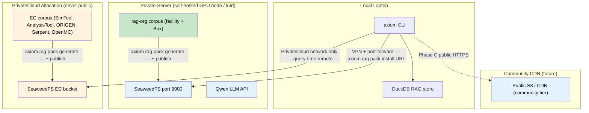

# Axiom RAG — Pack Registry and Distribution Service PRD

**Status:** Draft
**Owner:** Ben Booth
**Created:** 2026-03-20
**Last Updated:** 2026-03-20
**Related Specs:** spec-rag-pack-server.md *(to be written)* · spec-rag-architecture.md §3c · spec-rag-community.md §7 · adr-014-rag-tiered-local-cache.md

---

## Executive Summary

Axiom Phase 0 defines a local DuckDB RAG store and a `.axiompack` file format
for distributing domain knowledge packs. The `axiom rag pack install <file>` command
works. The missing layer is **where packs come from**: the server infrastructure that
generates packs from facility corpora, hosts them at a stable endpoint, and lets
authorized clients discover and download them.

Without a distribution service, packs move as manual file transfers — an email
attachment, a shared drive link, a USB drive in a server room. That model does not
scale beyond a single pilot user. This PRD defines the Pack Registry and Distribution
Service: a thin SeaweedFS-backed server that unblocks three environments —
local laptop, Private-Server GPU server, and PrivateCloud export-controlled allocation — with the
minimum infrastructure needed for each trust boundary.

---

## Problem Statement

### Manual file transfer does not scale

The current state for every deployment environment is identical: a person with
filesystem access to the corpus manually runs a generation step, manually compresses
the result, and manually sends the file to users who need it. This creates three
compounding problems:

**Discovery failure.** A new PhD student joining the deploying-site project does not
know which packs exist, which version is current, or where to request them.
There is no authoritative index.

**Version drift.** When the facility knowledge corpus is updated (new procedures, corrected
safety analysis, added equipment manuals), there is no mechanism to notify installed
clients. Users run on stale packs indefinitely.

**Trust boundary violations.** Export-controlled content managed as file attachments
is a compliance liability. The PrivateCloud allocation exists precisely to keep EC content
inside a controlled perimeter. Manual transfers outside that perimeter defeat the
purpose.

### Three environments with incompatible trust models

Each deployment environment has a distinct trust model that a single distribution
strategy cannot satisfy:

| Environment | Trust model | Pack content | Network |
|---|---|---|---|
| Local laptop + Private-Server | private-network VPN; facility-restricted | `rag-org` corpus (facility docs, Box dump) | VPN-gated port-forward |
| PrivateCloud allocation | PrivateCloud credentials + network reachability | EC simulation codes | Never public internet |
| Community CDN | Public | Open-access domain-specific literature | Public S3/CDN |

A well-designed distribution service must satisfy all three without collapsing the
boundaries between them.

---

## Users and Stakeholders

**Facility admin (pack publisher)**
Generates packs from the facility's ingested `rag-org` corpus and publishes them to
the pack server. For Phase A this is a single site operator; for Phase B, a PrivateCloud
allocation admin. Needs: `axiom rag pack generate`, `axiom rag pack publish`, a
SeaweedFS endpoint to publish to.

**Developer-researcher (pack consumer)**
Installs packs to get facility-aware AI on their laptop or within their PrivateCloud session.
Needs: `axiom rag pack install <url>`, `axiom rag pack list --remote`, transparent
update notification. Should not need to know where the pack physically lives.

**An external researcher (partner facility, external stakeholder)**
Represents the external facility perspective. Needs: the facility domain pack
(`facility-pack-v1.axiompack`) to be discoverable and installable without requiring
direct access to the deploying org's infrastructure. The VPN-gated SeaweedFS endpoint on Private-Server satisfies
this for the pilot.

**Ben Booth (system owner)**
Needs the three deployment profiles cleanly separated so that PrivateCloud EC content can
never leak to local via distribution infrastructure.

---

## Non-Goals

The following are explicitly out of scope for this PRD and deferred to Phase 2+:

- **IAM / entitlement enforcement.** Pack access in Phase A and B is controlled by
  network reachability and a single API key — not by per-user entitlement records or
  RBAC. Fine-grained entitlement is a Phase 2 problem.

- **Pack signing and PKI.** SHA256SUMS in the `.axiompack` manifest provides integrity
  verification. Full cryptographic signing (signing keys, certificate chain, revocation)
  is deferred.

- **Community CDN implementation.** Profile 3 (public S3/CDN for community-tier packs)
  is referenced in this PRD for architectural completeness. Its implementation is
  governed by spec-rag-community.md §7 and is out of scope here.

- **Automatic pack promotion.** Facility packs are never automatically promoted to the
  community tier. Promotion requires an explicit operator action outside this service.

- **Pack dependency resolution.** Packs are currently independent units. A dependency
  graph (pack A requires pack B) is deferred.

---

## Requirements

### Functional Requirements

**FR-1: Pack registry API**
The pack server exposes a registry endpoint that returns a machine-readable list of
available packs: name, version, access tier, content hash, download URL, and
description. Clients can query this without downloading any pack content.

**FR-2: Pack generation**
`axiom rag pack generate` produces a `.axiompack` file from the currently ingested
`rag-org` corpus. The output includes `manifest.json`, `chunks.parquet`, and
`SHA256SUMS` compressed as gzip-tar. Generation is a local operation — it does not
require a running pack server.

**FR-3: Pack publish**
`axiom rag pack publish <file> --server <alias>` uploads a `.axiompack` to a registered
pack server. The server stores the file in SeaweedFS and updates the registry index.
The server alias is resolved from the connection registered via `axiom connect pack-server`.

**FR-4: Pack install from URL**
`axiom rag pack install <url-or-file>` accepts either a local file path or an HTTPS
URL pointing to a `.axiompack` on a registered server. After download, the SHA256SUMS
manifest is verified before the pack is indexed into the local DuckDB store.

**FR-5: Remote pack listing**
`axiom rag pack list --remote [--server <alias>]` queries the registry API and displays
available packs. Default server is the first registered connection; `--server` selects
by alias.

**FR-6: Pack update check**
`axiom rag pack update` checks each installed pack against its origin server (if
reachable) and notifies when a newer version is available. Update is not automatic —
it requires an explicit `axiom rag pack install` invocation.

**FR-7: Pack server connection registration**
`axiom connect pack-server --alias <alias> --url <url> --api-key <key>` registers a
pack server endpoint in the local Axiom config. Multiple servers can be registered
(Private-Server, PrivateCloud, future CDN). The alias is used in subsequent `--server` flags.

### Non-Functional Requirements

**NFR-1: Offline degradation.**
If a registered pack server is unreachable, all CLI commands that do not require
the server (`list` of installed packs, `install <local-file>`) continue to work.
Commands that require the server (`list --remote`, `install <url>`, `publish`, `update`)
fail with a clear error message indicating which server is unreachable, not a generic
network error.

**NFR-2: VPN-gated access for Private-Server.**
The Private-Server pack server is accessible only when the client is on the private-network VPN or
connected via `kubectl port-forward`. The service does not expose a public IP. This
is enforced by network topology, not by application-layer auth alone.

**NFR-3: EC content never leaves PrivateCloud.**
The PrivateCloud pack server serves `export_controlled` tier content. No EC pack file is
ever transmitted to a client outside the PrivateCloud allocation perimeter. The PrivateCloud server
is not reachable from the public internet. This is enforced by PrivateCloud network policy
and must never be worked around at the application layer (e.g., no pack proxying,
no caching relay outside PrivateCloud).

**NFR-4: Integrity verification.**
Every downloaded pack is verified against its SHA256SUMS manifest before installation.
A hash mismatch aborts installation and deletes the partial download.

**NFR-5: Idempotent installation.**
Installing a pack that is already installed at the same version is a no-op with an
informational message, not an error.

---

## First Edition Scope

The minimum that unblocks all three deployment environments:

1. SeaweedFS Helm chart deployed in Private-Server's k3d cluster with a single bucket (`axiompacks`).
2. A lightweight registry API (can be a static JSON file served from SeaweedFS initially)
   that lists available packs by name, version, and download URL.
3. `axiom connect pack-server` storing endpoint config in `runtime/config/pack-servers.toml`.
4. `axiom rag pack generate` producing a valid `.axiompack` from the ingested corpus.
5. `axiom rag pack publish` uploading to SeaweedFS via the S3 API.
6. `axiom rag pack install <url>` downloading, verifying, and indexing.
7. `axiom rag pack list --remote` querying the registry JSON.
8. The first pack: `facility-pack-v1.axiompack` generated from the Box knowledge dump.
9. The PrivateCloud SeaweedFS instance (same setup, isolated allocation) serving `simulation-codes-v1.axiompack`.
10. `install.toml` environment profiles for Private-Server and PrivateCloud that include the
    `connect pack-server` and `pack install` steps.

Everything else — entitlement enforcement, signing, dependency resolution, CDN — is
Phase 2+.

---

## Deployment Profiles



### Profile 1 — Private-Server Facility Pack Server

**Purpose:** Serve `rag-org` content (facility procedures, Box knowledge dump)
as a versioned domain pack accessible to private-network VPN users.

**Infrastructure:** SeaweedFS deployed via Helm chart in Private-Server's existing k3d cluster.
Single bucket `axiompacks`. Exposed via `kubectl port-forward` on port 9000 — same
pattern as Private-Server's Qwen API key access. No public IP, no load balancer.

**Auth:** Single SeaweedFS API key stored in `runtime/config/pack-servers.toml` (gitignored).
No IAM, no per-user keys in Phase A.

**First pack:** `facility-pack-v1.axiompack`
Generated from the Box knowledge dump already ingested into the Private-Server `rag-org`
corpus. Access tier: `restricted`. Scope: `facility`. This pack lets a local laptop
user install facility-aware context and run queries against Qwen on Private-Server — even
when the laptop is subsequently offline.

**What this unblocks:**
A PhD student configures Private-Server as their LLM provider (`axiom connect llm ...`)
and installs the facility pack (`axiom rag pack install <private-server-url>`). Their
local `axiom agent` session has facility context. When they disconnect from VPN,
the installed pack continues to serve retrieval results from the local DuckDB store.
The Qwen queries fail gracefully when offline; the RAG retrieval does not.

### Profile 2 — PrivateCloud EC Pack Server

**Purpose:** Serve export-controlled simulation code documentation within the PrivateCloud
allocation perimeter. EC content never leaves PrivateCloud.

**Infrastructure:** SeaweedFS deployed in the PrivateCloud allocation. Same Helm chart as
Profile 1. Network-level isolation enforced by PrivateCloud: the SeaweedFS endpoint is not
reachable from outside the allocation. No port-forward workaround is permissible
for EC content.

**Auth:** PrivateCloud API key + network reachability. A client outside the PrivateCloud allocation
cannot reach the endpoint regardless of whether they have the API key.

**First pack:** `simulation-codes-v1.axiompack`
EC tier content: SimTool I/O file examples, AnalysisTool and ORIGEN documentation, Serpent
and OpenMC reference material, Fortran/C++ code examples from simulation workflows.
Access tier: `export_controlled`. Scope: `facility`.

**Query-time remote only:** Unlike Profile 1 packs, the EC pack is never downloaded
to a local laptop. Retrieval queries are proxied to the PrivateCloud SeaweedFS endpoint at
query time and results are returned inline — no chunks are written to the local
DuckDB store. This behavior is governed by adr-014-rag-tiered-local-cache.md.

**What this unblocks:**
A Fortran/C++ developer-researcher running a SimTool deck on PrivateCloud submits a `axiom agent`
query about a specific material card syntax. The agent retrieves relevant SimTool I/O
examples from the EC pack, constructs a grounded response, and returns it within the
PrivateCloud session. No EC content is transmitted outside the allocation.

### Profile 3 — Community CDN (Future Reference)

Public S3-compatible CDN serving community-tier packs (access tier: `public`).
Governed by spec-rag-community.md §7. Not implemented in this PRD's phases.
Referenced here so the `axiom connect pack-server` connection model and `install.toml`
profile structure are designed to accommodate it without modification.

---

## CLI Surface

### `axiom rag pack generate`

```
axiom rag pack generate [--name <name>] [--version <version>] [--out <path>]
```

Reads the currently configured `rag-org` corpus from the local DuckDB store,
exports chunks to Parquet, writes `manifest.json` with name/version/access tier/
content hash, computes `SHA256SUMS`, and compresses to `<name>-<version>.axiompack`.

Flags:
- `--name` — override pack name (default: inferred from `config/rag.toml`)
- `--version` — override version (default: ISO date stamp `YYYY-MM-DD`)
- `--out` — output directory (default: `runtime/packs/`)

### `axiom rag pack publish`

```
axiom rag pack publish <file.axiompack> [--server <alias>]
```

Uploads the pack to a registered pack server via S3 API. Updates the registry
index JSON in the SeaweedFS bucket. Requires the server to be reachable and the API
key to be valid.

### `axiom rag pack install`

```
axiom rag pack install <url-or-file> [--server <alias>]
```

Accepts a local file path or HTTPS URL. Downloads (if URL), verifies SHA256SUMS,
and indexes chunks into the local DuckDB RAG store. Idempotent at the same version.

For EC-tier packs: registers the remote endpoint as a query-time retrieval target;
does not write chunks to local DuckDB.

### `axiom rag pack list`

```
axiom rag pack list [--remote] [--server <alias>]
```

Without `--remote`: lists locally installed packs (name, version, access tier,
installed date, origin server if known).

With `--remote`: queries the registry API of the specified server (or all registered
servers) and displays available packs. Gracefully notes unreachable servers rather
than failing the entire command.

### `axiom rag pack update`

```
axiom rag pack update [<pack-name>] [--server <alias>]
```

Checks installed packs against their origin server. Reports available updates.
Does not install automatically — prints `axiom rag pack install <url>` commands
for the user to confirm.

### `axiom connect pack-server`

```
axiom connect pack-server --alias <alias> --url <url> --api-key <key>
```

Registers a pack server endpoint in `runtime/config/pack-servers.toml`. The alias
is used in all subsequent `--server <alias>` flags. Multiple servers can be registered.

Example:

```
axiom connect pack-server \
  --alias private-server \
  --url http://localhost:9000 \
  --api-key <seaweedfs-key>

axiom connect pack-server \
  --alias hpc-ec \
  --url https://seaweedfs.hpc.example.org \
  --api-key <hpc-key>
```

---

## install.toml Integration

`install.toml` defines the ordered setup steps for a deployment environment.
The pack server adds two step types: `connect.pack-server` and `rag.pack.install`.

### Private-Server profile

```toml
[[steps]]
type = "connect.pack-server"
alias = "private-server"
url = "http://localhost:9000"
api_key_env = "NEUT_HOST_SEAWEEDFS_KEY"
note = "Requires private-network VPN + kubectl port-forward svc/seaweedfs 9000:9000"

[[steps]]
type = "rag.pack.install"
server = "private-server"
pack = "facility-pack-v1"
note = "Deploying-site facility knowledge pack (restricted)"
```

### PrivateCloud EC profile

```toml
[[steps]]
type = "connect.pack-server"
alias = "hpc-ec"
url = "https://seaweedfs.hpc.example.org"
api_key_env = "NEUT_PrivateCloud_SEAWEEDFS_KEY"
note = "Accessible only from within PrivateCloud allocation"

[[steps]]
type = "rag.pack.install"
server = "hpc-ec"
pack = "simulation-codes-v1"
note = "EC simulation codes pack — query-time remote only, never cached locally"
```

---

## Implementation Phases

### Phase A — Private-Server SeaweedFS + Facility Pack

**Goal:** Unblock local laptop and Private-Server users with facility-aware RAG.

Deliverables:
- SeaweedFS Helm chart deployed in Private-Server k3d, bucket `axiompacks` created
- `axiom connect pack-server` command implemented, stores config in
  `runtime/config/pack-servers.toml`
- `axiom rag pack generate` command implemented
- `axiom rag pack publish` command implemented
- `axiom rag pack install <url>` accepting SeaweedFS presigned URLs
- `axiom rag pack list --remote` querying registry JSON from SeaweedFS
- `facility-pack-v1.axiompack` generated from the Box knowledge dump and published
- `install.toml` Private-Server profile updated with pack server steps
- Offline degradation verified: install a pack, disconnect VPN, confirm RAG
  retrieval still functions

Dependencies: Phase 0 DuckDB RAG store (already specced), Private-Server k3d cluster
(already exists), Box knowledge dump ingestion (already completed).

### Phase B — PrivateCloud SeaweedFS + EC Simulation Codes Pack

**Goal:** Unblock Fortran/C++ developer-researchers with code-aware AI inside PrivateCloud.

Deliverables:
- SeaweedFS deployed in PrivateCloud allocation, EC bucket created with appropriate ACLs
- `axiom rag pack install` EC-tier path: registers remote retrieval target, no
  local chunk write
- Query-time EC retrieval proxy implemented per adr-014-rag-tiered-local-cache.md
- `simulation-codes-v1.axiompack` generated from EC corpus and published to PrivateCloud SeaweedFS
- `install.toml` PrivateCloud EC profile updated with pack server steps
- Verified: no EC content written to local DuckDB in any code path

Dependencies: Phase A CLI surface, PrivateCloud allocation provisioned, EC corpus ingested,
adr-014 tiered cache implemented.

### Phase C — Community CDN

**Goal:** Serve community-tier packs at public scale.

Deliverables: governed by spec-rag-community.md §7. Out of scope here.

The `axiom connect pack-server` and `install.toml` profile design from Phases A and B
must accommodate a third server alias pointing to a public CDN URL without code changes.

---

## Success Criteria

### Phase A

- A user who clones the repository fresh, runs `axiom install --profile private-server` on the org
  VPN, and disconnects VPN can run `axiom agent` with facility context served from
  local DuckDB — confirmed by a retrieval query returning a document that exists only
  in the facility pack.
- `axiom rag pack list --remote --server private-server` returns at least `facility-pack-v1` while
  on VPN, and returns a clear "server unreachable" message when off VPN rather than
  a Python traceback.
- `axiom rag pack update` reports no update available immediately after a fresh install,
  and reports an update available after the admin publishes a `facility-pack-v1.1` pack.

### Phase B

- A developer running `axiom agent` inside a PrivateCloud session can query SimTool card syntax
  and receive a response grounded in the `simulation-codes-v1` pack.
- Confirmed by audit log: zero EC chunk records written to any local DuckDB store
  outside the PrivateCloud allocation during any Phase B test run.
- `axiom rag pack install simulation-codes-v1 --server hpc-ec` outside the PrivateCloud
  network fails with a clear error ("server unreachable or access denied"), not a
  partial install.

### Phase C

- A user outside the org with no VPN can run `axiom rag pack install <community-cdn-url>`
  and receive a community-tier pack without credentials.
- The `axiom connect pack-server` and `install.toml` mechanisms require zero code
  changes to support the CDN alias — configuration only.

---

*This document covers the Pack Registry and Distribution Service PRD. The
corresponding implementation spec is spec-rag-pack-server.md (to be written).*
_Copyright (c) 2026 The University of Texas at Austin and B-Tree Labs. Apache-2.0 licensed._
