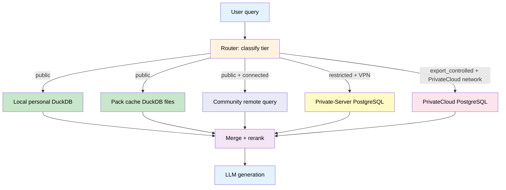

# Axiom RAG — Knowledge Infrastructure PRD

**Status:** Draft
**Owner:** Ben Booth
**Created:** 2026-03-19
**Last Updated:** 2026-03-20 *(updated: tiered local cache, PrivateCloud EC deployment, IAM dependency)*
**Tech Specs:** [spec-rag-core.md](../tech-specs/spec-rag-core.md) · [spec-rag-community.md](../tech-specs/spec-rag-community.md) · [spec-rag-knowledge-maturity.md](../tech-specs/spec-rag-knowledge-maturity.md)
**Related:** [Federal Data Management](prd-doe-data-management.md)

---

## Executive Summary

Nuclear knowledge is fragmented, perishable, and hard to transfer. An operator
retires and takes thirty years of contextual knowledge with them. A facility
runs SimTool for decades but every new researcher re-learns the same lessons from
scratch. Published literature exists but is disconnected from the specific
procedures, judgments, and failure modes that make a facility's knowledge
uniquely valuable.

Axiom RAG is the **knowledge infrastructure layer** of the Axiom
platform. It gives every user — from a new PhD student to a senior system
operator — access to the right knowledge at the right moment, routed through
the appropriate security boundary, and continuously improving as the facility
uses it.

It does five things the current RAG system does not:

1. **Separates sensitivity from visibility.** Not all restricted knowledge is
   export-controlled. Not all community knowledge is public. The system models
   both dimensions independently.

2. **Distributes community knowledge as a living extension.** The domain-specific
   community corpus — regulatory body regulations, IAEA guides, published simulation code
   manuals, research literature — ships as a separately installable, versioned
   data extension that updates continuously, like a navigational chart service
   for aviation.

3. **Crystallizes knowledge over time.** Every interaction is a signal.
   Patterns that prove durable across sessions become Facts. Facts synthesized
   by agents become Frameworks. Frameworks that reach sufficient maturity become
   fine-tuning datasets for privately operated language models. Knowledge
   compounds rather than evaporating.

4. **Provides a promotion pipeline.** Personal knowledge that proves useful can
   be elevated — conservatively, with attribution, reversibly — to facility
   scope, and eventually to community scope, governed by autonomous agents and
   subject to EC classification gating.

5. **Works powerfully offline.** A disconnected operator is never crippled. The
   local cache serves the last-known-good knowledge slice — personal corpus
   always, installed domain pack content always, community queries when
   reachable. This is not a degraded mode; it is a first-class operating
   condition. A field engineer running a system startup procedure in a
   network-isolated control room has the same knowledge fidelity as when
   connected. The ForeFlight model applies here directly: a pilot does not
   lose their charts when they lose cell signal. Neither does a Axiom
   operator.

---

## Background and Motivation

### Why the current RAG system is insufficient

The initial RAG system treats all documents the same:
ingest, chunk, embed, retrieve. This produces three classes of failure:

**Security failures.** There is no meaningful distinction between a facility's
licensed SimTool source deck (export-controlled) and its public safety analysis
report (public). Both sit in the same corpus with the same embedding pipeline.
A query on a public session can retrieve export-controlled content.

**Knowledge decay.** Useful interactions produce no durable artifact. A
researcher discovers a subtle AnalysisTool modeling gotcha via conversation with the
LLM; that insight lives in a session JSON file and is never surfaced again.
When the researcher leaves, it vanishes entirely.

**Distribution ceiling.** The community corpus is bundled as a compressed
PostgreSQL dump in the pip package. This does not scale: a comprehensive
domain-specific knowledge base will be tens of gigabytes; the dump is stale the moment
it ships; and there is no mechanism for facilities to contribute back.

### The ForeFlight Analogy

ForeFlight, the leading aviation flight planning app, continuously distributes
navigational data packs to pilots — charts, plates, airport diagrams — for the
regions they fly in. Pilots configure which regions they want; data downloads
in the background; updates are pushed when new versions are published. A
pilot always has current charts without thinking about it.

Axiom RAG adopts this model for domain-specific knowledge. Facilities subscribe
to the domain packs relevant to their work. Updates are pushed from the
Axiom data infrastructure. The knowledge available to every user is always
current.

### The Knowledge Maturity Model

Knowledge has a lifecycle: raw data becomes patterns; patterns crystallize into
facts; facts synthesized by agents become frameworks; frameworks applied to
facility context become operational wisdom.

```
Data → Patterns → Facts → Frameworks → Application → Wisdom
  ↑         ↑         ↑          ↑            ↑           ↑
chunks   retrieval  validated  agent-      facility-   fine-tuned
+embeds   logs     Q&A pairs  synthesis   procedures    SLM/LLM
```

Implements the first three layers and provides the data contracts that
allow the upper layers to be built incrementally, including eventual LoRA
fine-tuning of privately operated language models on PrivateCloud HPC infrastructure.

---

## Stakeholders

| Role | Stakeholder | Primary concern |
|------|-------------|-----------------|
| Product Owner | Ben Booth (UT PartnerLab) | Vision, prioritization |
| Facility Operator | PartnerLab Operations Staff | Practical knowledge retrieval, no complexity |
| Researcher | PartnerLab Graduate Students / Faculty | Deep technical retrieval, EC access |
| PrivateCloud Developer-Researcher | Computational domain-specific engineers (SimTool / AnalysisTool / ORIGEN / Serpent / OpenMC users) | Code-aware EC retrieval, entirely server-side on PrivateCloud |
| Facility Administrator | PartnerLab IT / Safety Officer | Access control, export compliance |
| Community Contributor | Any Axiom user | Attribution, promotion, takedown |
| Enterprise Customer | UT PartnerLab (anchor) | Multi-facility corpus, curation agents |

---

## Non-Goals

- **Full text search UI.** RAG is a backend capability; display is the
  responsibility of `axi_agent` and other extensions.
- **OpenFGA authorization.** Per-document RBAC is a Phase 3 capability
  (spec-security.md). The system enforces access via tier + scope + owner checks at
  the database layer.
- **LLM fine-tuning orchestration.** PrivateCloud training workflows are a data
  platform concern. The system provides the training data contracts; it does not
  schedule or monitor training jobs.
- **Real-time streaming ingestion.** Documents are indexed asynchronously
  (daemon threads, background jobs). No streaming ingestion pipeline.

---

## User Stories

### US-1: Field operator, network-isolated control room

An operations staff member runs a system startup procedure. The facility
network is down for maintenance. `axiom chat` routes to the local store: personal
corpus (DuckDB, always present) plus the cached domain pack content installed
for this facility. The operator gets grounded answers from the last-synced
knowledge state. When the network restores, the interaction log syncs
automatically. There is no "offline mode" toggle — the system simply uses what
is local when remote stores are unreachable.

### US-2: Graduate researcher, restricted corpus

A PhD student queries AnalysisTool resonance self-shielding methodology. The query is
classified `restricted` by the router. `axiom chat` connects to the Private-Server store
over VPN. If VPN is down, the query falls through to the local public-tier store
with a notice that restricted content is temporarily unreachable.

### US-3: PrivateCloud developer-researcher, export-controlled simulation codes

A computational domain-specific engineer is writing a Fortran/C++ driver that interfaces
with SimTool to automate criticality sweeps. They open `axiom chat` on the PrivateCloud
login node (or on a workstation with PrivateCloud network access). The export control
router detects EC indicators in the query — code references, cross-section
library parameters, sensitive geometry values. The RAG client automatically
routes to the PrivateCloud-resident EC store. Retrieval, embedding, and LLM inference
all occur within PrivateCloud's authorized enclave. No EC content is transferred to the
researcher's local machine.

The PrivateCloud RAG is the researcher's primary working environment, not a special
mode: their `axiom chat` session is aware of AnalysisTool user manual sections,
ORIGEN decay chain data, SimTool geometry syntax, Serpent lattice definitions,
and OpenMC Python API usage — all indexed EC content resident on PrivateCloud.

If the researcher steps off the PrivateCloud network (e.g., reviews public-tier
background at home), queries route to the local public-tier store. The EC
corpus remains inaccessible outside the authorized environment by design.

### US-4: Facility administrator, pack update cycle

A facility IT officer runs `axiom rag pack update`. Installed packs that have
new versions available are downloaded incrementally (content-addressed; only
new chunks transferred). The administrator pins a specific regulatory pack
version pending an internal review cycle. Pinned packs do not auto-upgrade.

---

## Part 2b: Local Cache Model

### 2b.1 Four-Tier Storage Strategy

Each RAG tier has a distinct local-vs-remote storage posture. This determines
what is available offline, what requires a live connection, and what never
leaves its authorized environment:

| Tier | Local storage | Remote sync | Offline behavior |
|------|---------------|-------------|-----------------|
| `rag-internal` (personal) | DuckDB, always local | Syncs to facility server when connected (requires IAM) | Always available; full fidelity |
| `rag-org` (facility / domain packs) | Versioned pack cache on local disk | Download at install; incremental updates on sync | Available from cache; no live query needed |
| `rag-community` | No local copy (query-time remote fetch) | N/A | Unavailable offline; degrades gracefully |
| `rag-export-controlled` | Never local | PrivateCloud-resident only | Unavailable outside authorized environment; by design |

The local storage model follows the ForeFlight chart cycle model: a pilot
downloads the chart packages they need before a flight and flies with local
data. Axiom installs the domain pack content a facility needs and runs with
local data when disconnected. Community queries augment local knowledge when
the network is available; they are never the only source of truth.

### 2b.2 DuckDB as the Local Personal Store

The personal corpus (`rag-internal`) is stored in **DuckDB**, not PostgreSQL.
This choice reflects the operating reality: personal RAG must work on a
developer laptop, a field tablet, or a workstation that is never in a
Kubernetes cluster. DuckDB is:

- Embedded — no daemon, no separate process, no port to manage
- Portable — the database is a single file in `runtime/rag/personal.duckdb`
- Fast enough for personal-scale corpora (tens of thousands of chunks)
- Compatible with the same SQL query surface as the PostgreSQL stores

The public-tier PostgreSQL store (local k3d) handles domain pack content and
facility corpus for users who run the full local cluster. DuckDB handles
personal corpus on any machine.

### 2b.3 Domain Pack Cache Layout

Installed domain packs are stored as versioned directories under
`runtime/rag/packs/`:

```
runtime/rag/packs/
  regulatory/
    v2.3.0/          ← current pinned version
      manifest.json
      chunks.duckdb  ← pack content as queryable DuckDB file
    v2.2.1/          ← retained for rollback
  simulation_codes/
    v1.8.0/
      ...
```

Pack version directories are immutable once written. Upgrading a pack writes
a new version directory; the previous version is retained for `rag.pack.retain_versions`
cycles (default: 2) before garbage collection. Pinned packs never garbage-collect
the pinned version.

### 2b.4 Query Fan-Out

When a user submits a query, the RAG client fans out across available stores
in priority order:



Stores that are unreachable (no VPN, no PrivateCloud network) are silently skipped.
The query completes against available stores. A `[partial: restricted
unavailable]` notice is appended to the response when a relevant tier was
skipped.

---

## Part 2c: IAM Dependency

### 2c.1 What IAM Enables

Personal RAG sync and domain pack entitlement checking require a lightweight
identity service that does not yet exist in Axiom. Specifically:

| Capability | IAM requirement |
|------------|----------------|
| Personal RAG sync (local → facility server) | Authenticated user identity to associate personal corpus with a facility account |
| Pack entitlement checking | User or facility token proving subscription to a domain pack |
| Cross-facility fact attribution | Stable pseudonymous contributor identity across federation peers |
| EC session routing on PrivateCloud | Token proving PrivateCloud authorization level for EC-tier access |

### 2c.2 Pre-IAM Behavior

Until IAM ships, the system operates in an unentitled mode:

- **Personal RAG sync:** Manual export/import via `axiom rag export` /
  `axiom rag import`. No automatic sync. The personal DuckDB file is portable
  and can be manually transferred between machines.
- **Domain pack entitlement:** Packs are unentitled — any user can download
  any pack they can reach the distribution server for. Access control is
  network-level (restricted and EC packs are not reachable outside their
  authorized environments) rather than identity-level.
- **Community queries:** Anonymous. No attribution, no rate limiting by
  identity.

Pre-IAM behavior is functional for all Phase 0 and Phase 1 capabilities. It
is the intended production behavior until IAM is available, not a gap.

### 2c.3 IAM as the Next Critical Path Item

IAM is the next critical path dependency after the PrivateCloud EC deployment. The
sequence:

```
PrivateCloud EC deployment  →  IAM service  →  Personal sync  →  Pack entitlement  →  Federation identity
```

The IAM service is out of scope for this PRD but is a first-class dependency.
Its design requirements are captured in a separate PRD (pending).

---

## Part 1: Content Model

### 1.1 Two-Dimensional Classification

Every document and chunk in the RAG system is described by two independent
axes:

**Access Tier** (sensitivity — who is authorized to process this content):

| Tier | Description | Processing boundary |
|------|-------------|-------------------|
| `public` | Safe for cloud processing and general distribution | Local store; cloud embedding API permitted |
| `restricted` | Facility-private; VPN-gated | Private-Server store; Ollama embedding on Private-Server only |
| `export_controlled` | EAR / 10 CFR 810 regulated | PrivateCloud store; Ollama on PrivateCloud; no cloud processing |

**Scope** (visibility — who can see this content):

| Scope | Description |
|-------|-------------|
| `community` | Available to all Axiom users (industry-wide) |
| `facility` | Available to members of the installing facility |
| `personal` | Available only to the document owner |

These axes are orthogonal. A restricted document can be community-scoped
within a facility network (e.g., a licensed manual shared with all PartnerLab staff
but not publicly distributed). A public document can be personal-scoped (e.g.,
draft notes not yet shared).

### 1.2 Access Tier Assignment

Access tier is determined at ingest time by the export control router
(`infra/router.py`). The router classifies document content using the
keyword + semantic pipeline and assigns `access_tier` accordingly. Documents
that cannot be classified default to `restricted` under strict sensitivity
settings.

Tier assignment is stored with the document and propagated to every chunk
derived from it. It cannot be downgraded after assignment without explicit
administrator action and an audit log entry.

### 1.3 Scope Assignment

Scope is set by the ingesting user or administrator:

- Personal ingestion (`axiom rag index .`) → `personal`
- Facility admin ingestion (`axiom rag sync org`) → `facility`
- Community promotion (via promotion pipeline) → `community`

---

## Part 1b: Agentic Retrieval (Query Planning & Context Evaluation)

### 1b.1 Problem: Single-Pass Retrieval Is Blind

The standard RAG loop — embed query → retrieve top-K → inject into prompt — does not know whether retrieval was necessary, whether the right tiers and scopes were queried, or whether the retrieved context is sufficient before the LLM generates. This produces two failure modes:

- **Over-retrieval:** Irrelevant chunks injected into the context window inflate cost and degrade response quality.
- **Under-retrieval:** A query that touches multiple knowledge domains retrieves from only one; the LLM generates with partial grounding.

### 1b.2 Solution: Two-Step Deliberation

Agentic RAG adds a deliberation layer around the retrieval loop:

```
User query
  ↓
Query Planner
  ├── Is retrieval needed? (or is this answerable from LLM knowledge alone?)
  ├── Which tiers/scopes to query?
  └── Query reformulation (decompose compound queries; add domain vocabulary)
  ↓
Retrieval (up to 2 passes)
  ↓
Context Evaluator
  ├── Is retrieved context sufficient for a grounded answer?
  ├── If not: reformulate query → second retrieval pass
  └── If yes: proceed to generation
  ↓
LLM generation with grounded context
```

**Maximum retrieval passes: 2.** The system never loops more than twice to prevent runaway costs and latency. If context is still evaluated as insufficient after two passes, the LLM generates with a low-confidence signal attached.

### 1b.3 Implementation Roadmap

**v1 — Heuristic planner and evaluator:**
- Query planner: rule-based (query length, detected domain keywords, tier indicators in query text)
- Context evaluator: similarity score distribution heuristic (if max score < threshold or all scores < floor, trigger second pass)
- No additional LLM calls; negligible latency overhead

**v2 — LLM-backed deliberation:**
- Query planner: lightweight LLM call (local Ollama) classifies query intent and emits a structured retrieval plan
- Context evaluator: lightweight LLM call scores sufficiency of retrieved context
- Adds one or two fast LLM round-trips per query; justified for high-stakes EC-tier queries

### 1b.4 Export Control Compliance

The planner and evaluator operate on public context only. The compliance boundary is preserved:

| Component | Sees | Does not see |
|-----------|------|--------------|
| Query Planner | User query (classified by router) | Raw restricted/EC chunks |
| Context Evaluator (public pass) | Public-tier chunks | Restricted / EC chunks |
| Context Evaluator (EC pass) | EC-tier retrieved chunk summaries | Raw EC chunk text |
| LLM (public session) | Public context only | Restricted / EC content |

Classified retrieval is a separate pass, governed by the same store-isolation rules as single-pass retrieval. The planner may decide to run both passes; it never merges their contexts for a public-session LLM.

---

## Part 2: Physical Store Architecture

### 2.1 Three Stores

The two-dimensional model requires physical separation, not just logical
labeling. Content at different access tiers must never share a database
instance or embedding pipeline:

```
┌──────────────────────────────────────────────────────┐
│  Local workstation                                    │
│  PostgreSQL + pgvector (public tier only)            │
│  Embedding: OpenAI API or local Ollama               │
└──────────────────────────────────────────────────────┘
         ↕ VPN
┌──────────────────────────────────────────────────────┐
│  Private-Server (facility server, VPN-gated)                 │
│  PostgreSQL + pgvector (restricted tier)             │
│  Embedding: Ollama on Private-Server (nomic-embed-text)      │
└──────────────────────────────────────────────────────┘
         ↕ PrivateCloud network / VPN
┌──────────────────────────────────────────────────────┐
│  PrivateCloud (authorized EC environment, pending approval)  │
│  PostgreSQL + pgvector (export_controlled tier)      │
│  Embedding: Ollama on PrivateCloud                           │
│  LLM: TBD (pending facility approval)               │
└──────────────────────────────────────────────────────┘
```

The PrivateCloud store is a stub in this release. Its schema, client interface, and connection
management are designed and tested locally; the live connection is activated
when the PrivateCloud deployment is ready.

### 2.2 Query Routing

When a user submits a query:

1. The export control router classifies the query (public / restricted /
   export_controlled).
2. The RAG client connects to the appropriate store(s) based on the
   classification and the user's authorized tiers.
3. Embedding is performed on the store's designated embedding service.
4. Retrieved chunks are sanitized before LLM context injection.
5. The response is scanned before returning to the client.

A user on a public session can never retrieve restricted or export_controlled
chunks — the store connection is never made.

---

## Part 3: Community Corpus — Domain Pack Model

### 3.1 The Community Corpus as a Distributed Extension

The domain-specific community corpus is not bundled in the Axiom pip package.
It is a separately installable extension (`axiom-rag-community`) that:

- Has its own version lifecycle, independent of Axiom releases
- Is distributed from the deploying org's infrastructure (migrating to AWS)
- Supports incremental updates without full reinstalls
- Is organized into subscribable **domain packs**

### 3.2 Domain Packs and Bundles

Domain packs are the atomic subscription unit. **Bundles** are curated
groupings of domain packs organized around primary facility personas —
the coherent set a facility of that type needs to stand alone. Facilities
subscribe to a bundle at install time; individual packs can be added or
removed afterward.

#### Domain Packs

| Domain Pack | Contents | Default tier |
|-------------|----------|--------------|
| `regulatory` | regulatory body regulations, IAEA guides, 10 CFR, DOE orders | public |
| `radiation_protection` | Dosimetry, shielding design, ALARA principles | public |
| `education` | Curriculum materials, textbooks, training guides | public |
| `system_physics` | Neutron transport, thermal hydraulics, core design fundamentals | public |
| `research` | Published literature, conference papers, preprints, publishing norms for operations engineering | public |
| `experimentation` | Experimental design, measurement uncertainty, data collection protocols, chain of custody | public |
| `simulation_codes` | Public manuals: SimTool, AnalysisTool, RELAP, ORIGEN, OpenMC | public |
| `operations` | Plant operations procedures; facility-provided content | restricted |
| `medical_isotopes` | Isotope production, QA/QC, regulatory filings | public |
| `fuel_cycle` | Enrichment, reprocessing, waste management, decommissioning | public / restricted |
| `compliance` | regulatory body inspection evidence, 10 CFR 50 / 10 CFR 20 procedures, audit documentation | public / restricted |
| `reduced_order_models` | ROM theory, surrogate modeling, training datasets | restricted / export_controlled |
| `ai` | AI/ML in domain-specific applications, model evaluation, documentation | public |

`reduced_order_models` access tier is content-dependent: a ROM of a public
system design benchmark is `restricted`; training data derived from
EC-sensitive design values is `export_controlled`. The router assigns tier
at ingest; administrators review flagged content.

`fuel_cycle` similarly spans tiers: publicly available material (waste
management regulations, general reprocessing chemistry) is `public`;
enrichment parameters and criticality calculations are `restricted` or
`export_controlled`.

#### Bundles

The **Foundation** bundle is installed automatically for every Axiom
instance. All other bundles are selected at `axiom setup` time.

| Bundle | Primary Persona | Included Packs |
|--------|----------------|----------------|
| **Foundation** *(always installed)* | Everyone | `regulatory` · `radiation_protection` · `education` |
| **Research** | Graduate students, faculty, national lab scientists | `system_physics` · `research` · `experimentation` · `simulation_codes` |
| **Training System** | Student operators, instructor staff | `system_physics` · `operations` |
| **Commercial System** | Power plant operators, domain-specific utilities | `system_physics` · `operations` · `fuel_cycle` |
| **Computational** | SimTool/AnalysisTool users, ROM/digital twin engineers, AI in domain-specific | `simulation_codes` · `reduced_order_models` · `system_physics` · `ai` |
| **Medical Isotope** | Isotope production staff, hospital physics | `medical_isotopes` |
| **Fuel Cycle** | Enrichment, reprocessing, waste management, decommissioning | `fuel_cycle` |
| **Regulation & Compliance** | RP officers, compliance staff, regulatory body auditors | `compliance` |

Foundation packs (`regulatory`, `radiation_protection`, `education`) are
shared across all bundles and never duplicated.

**Training System vs. Research:** Both bundles exist at university
facilities and often serve the same physical system. The distinction is
persona-driven: the Training System persona is an *operator* learning
procedures and safety; the Research persona is an *investigator* generating
new knowledge. A facility may install both bundles simultaneously.

**Cross-cutting packs** (`ai`, `reduced_order_models`) are included in the
Computational bundle but available à la carte to any bundle. They are not
standalone bundles because there is no facility whose primary identity is
"AI in domain-specific" — these capabilities augment every other persona.

### 3.3 Bootstrap Strategy

On first install, each domain pack provides a **bootstrap index**: a curated
subset of the full pack designed to be useful immediately. Bootstrap content
is selected by citation frequency within the pack — the chunks most frequently
retrieved across all Axiom installations inform the bootstrap selection.
This selection is continuously refined as aggregate (anonymized) retrieval
telemetry accumulates.

Full pack content downloads in the background after bootstrap installation.

### 3.4 Sync Protocol

**Preferred:** Push notifications from Axiom data infrastructure. When a
new pack version is published, connected installations are notified. The user
or TIDY agent schedules the download.

**Fallback:** Configurable pull schedule (default: nightly check). Used when
push notifications are blocked by facility network policy.

**Incremental sync:** Only new or changed chunks are transferred. Pack versions
use content-addressed storage; unchanged chunks are never re-downloaded.

Facilities may pin to a specific pack version. The sync client will not
auto-upgrade pinned packs. Facility administrators receive notifications of
available upgrades.

### 3.5 Version Lifecycle

```
Draft → Staged → Released → Superseded → Archived
```

A released pack version is immutable. New content produces new versions.
Facilities pinned to a superseded version continue to function; the pack
server retains superseded versions for a configurable retention window
(default: 2 major versions).

### 3.6 Community Corpus Federation

The community corpus grows through a **federated knowledge architecture**
analogous to federated learning (FL). Each facility crystallizes facts locally
from its own interactions; validated public facts are shared across facilities
without sharing raw data.

#### Trust Gradient

Federated facts enter the community corpus through a three-color trust
gradient:

| Color | Condition | Action |
|-------|-----------|--------|
| **GREEN** | ≥2 independent facilities validated the fact, OR single-facility confidence above threshold | Auto-promote to community corpus |
| **YELLOW** | Single-facility origin, moderate confidence, or minor inter-facility conflict | SCAN agentic resolution — SCAN compares propositions, resolves contradictions, routes to GREEN or RED |
| **RED** | Significant conflict, ambiguous attribution, or policy-flagged content | Human review — rare by design, target <5% of facts |

Agentic consensus replaces human committee: independent validation at N≥2
facilities IS the quorum. A RED-path fact can be approved by a single person;
no committee required. The review queue auto-resolves if backlogged beyond 20
items (oldest items archived, not blocked), and facts unclaimed after 30 days
are archived rather than indefinitely blocked.

#### What Crosses Facility Boundaries

Federation sync transmits only the minimum necessary for knowledge sharing:

| Crosses | Does NOT cross |
|---------|---------------|
| Proposition text (the validated fact) | Source `interaction_id`s |
| `domain_tags` | Raw chunk text |
| `access_tier` | User data or session contents |
| Confidence score | Facility-internal metadata |
| `originating_facility_ids` | Any export-controlled content |

**Classified-tier (`export_controlled`) facts never enter the community
corpus under any condition.**

#### Founding Federation

The inaugural federation consists of the three sites from the INL federated
learning LDRD:

- **UT-Austin PartnerLab** — UT facility Mark II research system
- **OSU facility** — Oregon State University facility system
- **INL NRAD** — Idaho National Laboratory Neutron Radiography System

These three facilities constitute the minimum viable federation quorum and
will generate the first cross-facility validated facts in the community corpus.

#### Flower AI Integration (v2)

Federation sync uses **Flower AI's secure aggregation protocol** as its
transport layer. This makes knowledge federation cryptographically aligned
with the ML model federation running on the same partnership infrastructure:
both knowledge facts and model parameters traverse the same Flower FL
framework, sharing authentication, privacy accounting, and audit logs. See
[Section 3.7](#37-relationship-to-federated-learning) for the ML model
federation context.

### 3.7 Relationship to Federated Learning

The INL LDRD proposal trains ML models (LSTM time-series predictors, Gaussian
Process regressors, Isolation Forest anomaly detectors) across UT-Austin,
OSU, and INL without sharing raw system data — the classical federated
learning setup. Axiom community corpus federation is the **knowledge-layer
complement** to that ML federation:

| Layer | What is shared | Framework | Home system |
|-------|----------------|-----------|-------------|
| ML model federation | Model parameters (gradients/weights) | Flower AI | DeepLynx Nexus (catalog/ontology) |
| Knowledge federation | Validated knowledge facts | Flower AI secure aggregation | Axiom (intelligence/operations) |

DeepLynx Nexus and Axiom are **peer platforms, not a hierarchy**. DeepLynx
handles model catalog and ontology. Axiom handles operational knowledge,
retrieval, and the promotion pipeline. Neither is subordinate to the other.

Federated models produced by the LDRD become entries in Model Corral (the
Axiom model registry). Validated facts derived from those models'
predictions — anomaly detections, calibration insights, operational patterns —
flow through the standard knowledge maturity pipeline into the community corpus.
The LDRD creates a closed loop: federated models improve operational
intelligence; operational interactions crystallize facts that further validate
the models.

---

## Part 4: Personal RAG — Compounding Knowledge

### 4.1 Auto-Indexed Sources

The personal corpus is built automatically from the user's workspace.
No manual indexing is required for standard sources:

| Source | Path | Trigger | Access tier |
|--------|------|---------|-------------|
| Chat sessions | `runtime/sessions/*.json` | After each completed session | Inherits from session routing tier |
| Processed signals | `runtime/inbox/processed/*.json` | On signal processing completion | public (signals are pre-scrubbed) |
| Git commit logs | Repos under `runtime/knowledge/` | `axiom rag index` / watch daemon | public |
| Daily notes | `runtime/knowledge/notes/YYYY-MM-DD.md` | On note save (`axiom note`) | public |
| User documents | `runtime/knowledge/docs/` | `axiom rag index` / watch daemon | Classified at ingest |

### 4.2 Session Tier Propagation

Sessions conducted on the `export_controlled` tier produce chunks that are
indexed on the PrivateCloud store, not the local store. The user never holds EC session
content on their workstation — only the LLM-synthesized response crosses the
network boundary.

### 4.3 Corpus Stewardship (TIDY)

The TIDY agent manages personal corpus health:

- **Session TTL pruning:** Sessions older than `rag.session_ttl_days`
  (default: 90) are removed from the index. The source session file is
  retained; only the index entry is pruned.
- **Nightly incremental index:** Checksum-based deduplication ensures only
  changed content is re-embedded.
- **Watch daemon:** Installed by `axiom setup` (launchd on macOS, systemd on
  Linux). Monitors watched directories for changes; debounces rapid file
  saves.

---

## Part 5: Knowledge Maturity Pipeline

### 5.1 The Model

```
Layer 0  Data          Raw chunks, embeddings, source metadata
Layer 1  Patterns      Retrieval telemetry: what gets retrieved, when, together with what
Layer 2  Facts         Validated Q&A pairs: proven across sessions, not corrected
Layer 3  Frameworks    Agent-synthesized structured knowledge from clustered Facts
Layer 4  Application   Frameworks applied to facility context (procedures, checklists)
Layer 5  Wisdom        Fine-tuned SLM/LLM absorbing Layers 0-4
```

Ships Layers 0-2. Layers 3-5 are Enterprise and/or data platform
capabilities that consume the data contracts defined here.

### 5.2 Layer 1 — Patterns (Retrieval Logging)

Every retrieval event is logged:

```
retrieval_log(
  id, query_hash, session_id, chunk_id, source_path,
  corpus, access_tier, scope, similarity_score,
  session_continued bool,   -- did the user continue the session (not rephrase)?
  ts
)
```

This log is the foundation for everything above Layer 1. Derived metrics:

- **Chunk citation frequency** — how often a chunk is retrieved
- **Query cluster centroids** — recurring query patterns by topic
- **Co-retrieval graphs** — which chunks appear together across sessions
- **Bootstrap calibration signal** — aggregate (anonymized) data informs
  community pack bootstrap selection

Retrieval logs are personal-scoped and never leave the local store.
Anonymized aggregate signals may be contributed to the community
infrastructure subject to facility opt-in.

### 5.3 Layer 2 — Facts (Conservative Extraction)

A `knowledge_fact` is a (query pattern, response summary, supporting chunks)
triple that has demonstrated durable usefulness without explicit user approval:

```
knowledge_fact(
  id, query_pattern, response_summary,
  supporting_chunk_ids[],
  confidence_score float,    -- derived from promotion policy evaluation
  retrieval_count int,
  first_retrieved_at, last_retrieved_at,
  access_tier, scope,
  contributor_id nullable,   -- set at promotion time (opt-in attribution)
  status: candidate | validated | promoted | withdrawn,
  promoted_to_scope nullable,
  withdrawn_at nullable, withdrawal_reason nullable
)
```

Facts are extracted by the `FactExtractor` component, which evaluates
candidates against the configured `PromotionPolicy`.

### 5.4 Promotion Policy

The promotion thresholds are not hardcoded — they are a configurable,
testable policy:

```python
class PromotionPolicy(Protocol):
    def score(self, fact: KnowledgeFact, log: RetrievalLog) -> float: ...
    def is_eligible(self, fact: KnowledgeFact) -> tuple[bool, str]: ...
    def explain(self, fact: KnowledgeFact) -> str: ...
```

The default implementation (`DefaultPromotionPolicy`) is parameterized via
`runtime/config/rag.toml`:

```toml
[rag.promotion]
policy = "default"
min_retrievals = 5          # minimum independent retrieval events
min_age_days = 30           # minimum age before eligibility (the "proven" requirement)
min_continuation_rate = 0.7 # fraction of sessions that continued (not corrected)
max_confidence_gap = 0.2    # max variance in similarity scores across retrievals
```

These parameters are expected to be tuned continuously based on observed
promotion quality. Alternative policy implementations (conservative, aggressive,
facility-specific) can be deployed without modifying core code.

### 5.5 Promotion Pipeline: Personal → Facility → Community

**Personal → Facility**

A validated `knowledge_fact` (status = `validated`) becomes eligible for
facility promotion when:
- Promotion policy deems it eligible
- Access tier is `public` or `restricted` (EC facts are never promoted
  above facility scope)
- A facility administrator reviews and approves (or delegates to an
  autonomous agent configured with appropriate authority)

Attribution is offered at promotion time:
> "This contribution will be attributed to [user.name from git config] unless
> you opt out. Your name will appear in the contribution log."

**Facility → Community**

Community corpus publications — facts promoted to community scope — will require persistent identifier (PID) assignment and metadata export conforming to DataCite schema to satisfy FAIR discoverability requirements. Knowledge maturity Layer 3+ content (Frameworks and above) promoted to community scope should trigger DMSP reporting workflows, ensuring that federally funded knowledge artifacts are registered in the appropriate institutional repository. See [Federal Data Management PRD](prd-doe-data-management.md) for PID, metadata, and reporting requirements.

Facility-scoped facts are eligible for community promotion when:
- Access tier is `public` (restricted facts never become community)
- An autonomous SCAN curation agent passes the fact through:
  1. PII detection (no personally identifying information)
  2. EC classification check (no export-controlled content)
  3. Facility-identifying specifics scrubbing (no internal project names,
     codenames, or sensitive operational details)
  4. Deduplication against existing community corpus
- The originating facility administrator has granted community promotion
  authority (opt-in per facility)

**Takedown**

Contributors may request withdrawal of any promoted fact at any time. On
withdrawal:
- The fact is marked `withdrawn` in the knowledge_fact table
- The fact is excluded from all future sync and version releases
- Previously distributed versions containing the fact are not recalled
  (impractical), but are marked superseded in the pack version lifecycle
- The withdrawal is logged in the audit trail

### 5.6 Conversation Crystallization (Evaluator-Optimizer Pattern)

While the FactExtractor (§5.3) promotes facts by observing retrieval frequency over time, **Conversation Crystallization** extracts candidate knowledge facts directly from clusters of related interaction log records (see §5b below). This is the Evaluator-Optimizer pattern applied to knowledge maturity.

**SCAN as Evaluator:**
SCAN receives a cluster of interaction log records (grouped by semantic similarity of their queries). It runs:
1. **LLM evaluator step** — extracts a candidate `knowledge_fact` proposition from the interaction records: what question(s) does this cluster answer, and what is the synthesized answer?
2. **Optimizer step** — embeds the candidate fact and searches existing `knowledge_fact` records for:
   - **Duplication:** if a substantially identical fact already exists (cosine similarity > threshold), the candidate is merged or discarded
   - **Contradiction:** if the candidate conflicts with an existing validated fact, both are flagged for human review
3. **Write** — the result is written as a `knowledge_fact` record with `validation_state = pending_review`

**Human review gate:** All crystallization-derived facts require human review before promotion to `validated`. The review gate is surfaced via `axiom rag facts review`.

**Classified-tier constraint:** SCAN does NOT process raw classified-tier chunk text. For EC-tier interaction log records, SCAN operates only on the synthesized LLM response (which crosses the network boundary) — never on the raw retrieved chunks. All EC-tier crystallization results require human review before fact promotion, regardless of promotion policy settings.

---

## Part 5b: Interaction Log

### 5b.1 Purpose

The interaction log is the raw material for all knowledge maturity activity above Layer 0. Every RAG-assisted LLM completion writes one interaction log record. Without this record, conversation crystallization, regression evaluation, and promotion policy scoring have no signal to work from.

### 5b.2 Schema

```
interaction_log(
  id                 uuid,
  session_id         uuid,
  query              text,
  retrieved_chunk_ids  uuid[],
  prompt_template_id uuid nullable,   -- FK to prompt_template registry
  response_hash      text,            -- SHA-256 of LLM response
  confidence_signal  float nullable,  -- from context evaluator (agentic RAG)
  feedback_signal    smallint nullable,  -- +1 (thumbs up) | -1 (thumbs down) | NULL
  correction_text    text nullable,   -- explicit user correction
  access_tier        text,
  scope              text,
  crystallized       bool default false,  -- true after TIDY sweep processes this record
  ts                 timestamptz
)
```

Full schema in `spec-rag-knowledge-maturity.md`.

### 5b.3 Feedback Signals

| Signal | Mechanism | Value |
|--------|-----------|-------|
| Thumbs up | In-session command or UI | `feedback_signal = +1` |
| Thumbs down | In-session command or UI | `feedback_signal = -1` |
| Explicit correction | User provides corrected text | `correction_text` populated |

Thumbs-down interactions are the primary input to regression evaluation (see §5c). Thumbs-up interactions contribute to promotion policy scoring.

### 5b.4 Privacy and Tier Isolation

Interaction log records inherit the `access_tier` and `scope` of the session. EC-tier interaction records are stored in the PrivateCloud store and never leave that environment. Anonymized aggregate signals (not raw queries or responses) may be contributed to community infrastructure subject to facility opt-in.

---

## Part 5c: Regression Evaluation from Production Failures

### 5c.1 Motivation

A thumbs-down interaction is a production failure. The knowledge state at the time of the interaction was insufficient or incorrect. Rather than discarding this signal, the system materialises it as a regression test case — ensuring the failure cannot silently recur after RAG state changes.

### 5c.2 Test Case Materialisation (TIDY Sweep)

The TIDY sweep (see prd-agents.md §TIDY Knowledge Maturity Sweep) automatically converts thumbs-down interaction log records into promptfoo regression test cases:

```
tests/promptfoo/regression/
  {interaction_id}.yaml    -- one file per thumbs-down interaction
```

Each test case contains:
- The original query (from `interaction_log.query`)
- The expected corrected response (from `interaction_log.correction_text`, or a human-provided expected answer)
- Grading criteria (assert the corrected fact appears; assert the incorrect response does not)
- The access tier (test runs against the appropriate store)

### 5c.3 Running Regression Evals

```bash
axiom eval regression                  # run all regression test cases against current RAG state
axiom eval regression --tier public    # restrict to public-tier cases
axiom eval regression --id <uuid>      # run a single regression case
```

### 5c.4 Test Case Lifecycle

A regression test case is **retired** when its corresponding `knowledge_fact` reaches `validated` status in the knowledge maturity pipeline. Retirement means the underlying knowledge gap has been closed; the test case is archived (not deleted) in `tests/promptfoo/regression/retired/`.

The TIDY sweep checks for retirement candidates on every run and moves qualifying test cases automatically.

---

## Part 6: Reduced Order Models

ROMs occupy a special position in the knowledge hierarchy. Unlike documents
and Q&A pairs, a ROM is executable: it takes inputs and produces outputs. The
RAG system indexes:

- ROM **metadata**: inputs, outputs, training regime, validation dataset,
  uncertainty bounds, code version, facility of origin
- ROM **documentation**: usage notes, known limitations, recommended
  parameter ranges
- ROM **training data summaries**: statistical characterizations of training
  inputs (never raw training data, which may be EC-sensitive)

ROM index entries carry the access tier of the most sensitive component of the
ROM. A ROM trained on public benchmark data is `restricted` (facility-managed).
A ROM whose training data includes EC-sensitive design parameters is
`export_controlled`.

ROM training is orchestrated by the data platform (Dagster) on PrivateCloud HPC
infrastructure. The Axiom RAG system is a consumer of ROM metadata, not a
producer.

---

## Part 7: Model Compatibility and Embedding Portability

### 7.1 The Embedding Lock-In Problem

Embedding models produce vectors in incompatible semantic spaces. Switching
from one model to another normally requires re-embedding the entire corpus —
impractical at community corpus scale, and operationally unacceptable for
a platform expected to track the frontier of model capability over years.

Axiom RAG is designed to avoid this trap. The goals are:

- **Adopt new models with minimal re-embedding.** Upgrading the embedding
  model for new content should not require re-indexing existing content.
- **Support simultaneous use of multiple models.** Different models excel
  at different retrieval tasks; the system routes to the best available
  model per query without corpus duplication.
- **Degrade gracefully when embeddings are absent or stale.** Full-text
  search is always available; vector search augments it.

### 7.2 Embedding Provenance Tracking

Every chunk records the embedding model that produced its vector:

```
chunks.embedding_model_id   TEXT    -- e.g. "openai/text-embedding-3-small"
chunks.embedding_dims        INT     -- e.g. 1536, 768, 256
chunks.embedding_version     TEXT    -- model version or hash
chunks.needs_reembed         BOOL    -- flagged during model transitions
```

At query time, the embedding client records the model used to embed the
query and restricts vector search to chunks with a matching
`embedding_model_id`. Chunks embedded by a different model fall through to
full-text search rather than producing semantically meaningless similarity
scores. This means a model transition is gradual: new content is indexed
with the new model; existing content continues to be retrieved via full-text
until lazily re-embedded.

### 7.3 Hybrid Search as the Invariant Baseline

Full-text search (PostgreSQL `tsvector` / BM25 ranking) does not depend on
any embedding model. It is always available regardless of model transitions,
offline environments, or embedding provider failures.

The retrieval architecture treats full-text search as the **guaranteed
baseline** and vector search as an **additive signal**:

```
Query
  ├── Vector search    (model-dependent; skipped on model mismatch)
  └── Full-text search (always runs; model-independent)
       ↓
  Combined + deduplicated candidate set
       ↓
  Cross-encoder reranker  (model-independent; scores any (query, chunk) pair)
       ↓
  Top-K results
```

### 7.4 Cross-Encoder Reranking

A **cross-encoder reranker** scores (query, chunk) pairs directly rather
than comparing embedding vectors. This layer is completely independent of
the embedding model used for initial retrieval — it can be swapped or
upgraded without touching the corpus.

The reranker is the primary quality lever. Upgrading the reranker improves
retrieval quality for all existing content with zero re-indexing.

Reranker models are configured in `runtime/config/rag.toml`:

```toml
[rag.reranker]
enabled  = true
model    = "cross-encoder/ms-marco-MiniLM-L-6-v2"
provider = "local"   # "local" | "ollama" | "api"
```

EC-tier queries use a reranker running on Private-Server or PrivateCloud — never a cloud API.

### 7.5 Lazy Re-Embedding on Model Transition

When a new embedding model is adopted:

1. New content is indexed with the new model immediately.
2. Existing chunks are marked `needs_reembed = true`.
3. A background TIDY job re-embeds stale chunks incrementally, prioritized
   by citation frequency (most-retrieved chunks first).
4. Until re-embedded, stale chunks participate via full-text search only.

The corpus remains fully functional during a transition. Retrieval quality
improves gradually as re-embedding progresses — no big-bang migration.

### 7.6 Matryoshka Dimension Reduction

Some models (including OpenAI `text-embedding-3-*`) support **Matryoshka
representation learning**: the full embedding can be truncated to a shorter
dimension while preserving most semantic information.

- **Storage efficiency:** Store at max dimension; query at reduced dimension
  for lower-latency retrieval.
- **Cross-dimension compatibility:** A 256-dim query against 1536-dim chunks
  from the same Matryoshka-aware model is semantically valid without
  re-indexing.

The `embedding_dims` field records the stored dimension. Query clients may
request a reduced dimension for Matryoshka-compatible models.

### 7.7 Model Evaluation Pipeline

New embedding and reranker models are evaluated against a retrieval quality
benchmark suite before adoption. The benchmark measures:

- Recall@K across curated query sets per domain pack
- False positive rate on EC classification boundary queries
- Latency (P50, P95) per retrieval across store tiers

When a new model scores materially better, the platform flags it for
adoption. Upgrade path: adopt for new content → lazy re-embed → benchmark
full-corpus retrieval → promote to default.

Pipeline lives in `tests/promptfoo/rag-evals.yaml`.

---

## Part 8: Export Control Compliance

### 8.1 Hard Constraints (Enforced by Architecture)

These constraints are enforced by the physical store separation. They cannot
be misconfigured away:

| Constraint | Mechanism |
|------------|-----------|
| EC text never touches cloud API | EC store is on PrivateCloud; cloud embedding never called for EC tier |
| EC text never leaves authorized env | Only synthesized LLM response crosses network boundary |
| EC embedding runs on PrivateCloud only | Embedding client checks `access_tier` before selecting provider |
| Restricted text never on cloud | Private-Server store is VPN-gated; local Ollama used for embedding |
| EC facts never promoted to community | Promotion pipeline checks `access_tier` before elevation |

### 8.2 Defense in Depth (Layered, Configurable)

| Layer | Component | Status |
|-------|-----------|--------|
| Export control classification | `infra/router.py` | ✅ Shipped |
| Chunk sanitization | `rag/sanitizer.py` | ✅ Shipped |
| System prompt hardening | `infra/gateway.py` | ✅ Shipped |
| Response scanning | `infra/gateway.py` | ✅ Shipped |
| Security event log | `infra/security_log.py` | ✅ Shipped |
| Retrieval tier enforcement | `rag/store.py` | this release |
| EC fact promotion blocking | Promotion pipeline | this release |
| Response classification | TBD | Future |
| OpenFGA per-document RBAC | `infra/authz.py` | Phase 3 |

---

## Part 9: Infrastructure

### 9.1 Deployment Targets

| Environment | Purpose | Status |
|-------------|---------|--------|
| Local workstation | Personal corpus, public retrieval, developer testing | ✅ Running (k3d) |
| Private-Server (VPN) | Restricted corpus, facility-private retrieval | Terraform + Helm needed |
| PrivateCloud | Export-controlled corpus and LLM | Pending a domain researcher / facility approval |
| Deploying org (Axiom infra) | Community corpus hosting, pack distribution | AWS setup in progress |

### 9.2 Infrastructure as Code

Each deployment target requires:
- **Terraform** — infrastructure provisioning (PostgreSQL, networking, storage)
- **Helm chart** — Kubernetes application deployment (pgvector, Ollama, Axiom services)
- **K3d config** — local development cluster mirroring Private-Server topology

Infrastructure specs:
- [spec-infra-private-server.md](../tech-specs/spec-infra-private-server.md) — Private-Server deployment
- [spec-infra-privatecloud.md](../tech-specs/spec-infra-privatecloud.md) — PrivateCloud deployment (stub)

---

## Part 10: Enterprise Axiom

The capabilities described in Parts 3-5 (community corpus hosting, autonomous
curation agents, knowledge crystallization, LoRA pipeline) are not all shipped
in the open-source Axiom package. They are organized into two tiers:

**Open-source Axiom:**
- Personal corpus (Layers 0-2)
- Domain pack client (install, sync, pin)
- Facility corpus tools (ingest, admin)
- Promotion workflow (submit a fact for review)
- Local inference (Ollama)
- All security layers

**Enterprise Axiom:**
- Community corpus hosting and distribution infrastructure
- Autonomous curation agents (SCAN-based community review)
- Multi-facility corpus sharing and cross-facility retrieval
- Knowledge maturity Layers 3-5 (Frameworks, Application, Wisdom)
- LoRA fine-tuning pipeline (PrivateCloud integration)
- Aggregate retrieval telemetry (anonymized, opt-in)

UT PartnerLab is the anchor Enterprise customer. The Enterprise tier is
commercialized under a separate agreement; the open-source tier remains
MIT-licensed.

---

## Implementation Phases

### Phase 0 — Pre-IAM Local Infrastructure (v0.4 / v0.5)
*Establishes the local-first foundation before any server dependencies.*

This phase builds the offline-capable local storage layer independently of the
PostgreSQL, Private-Server, and PrivateCloud deployments. It can be completed and shipped on
any developer laptop with no infrastructure dependencies.

- [ ] DuckDB personal corpus store (`runtime/rag/personal.duckdb`) — schema, read/write path, basic vector search via DuckDB VSS extension
- [ ] Pack cache layout (`runtime/rag/packs/{pack}/{version}/chunks.duckdb`) — install, pin, list, remove
- [ ] `axiom rag pack install <pack>` — download a domain pack version into the local cache
- [ ] `axiom rag pack update` — incremental sync of installed packs to latest available version
- [ ] `axiom rag pack pin <pack> <version>` / `unpin` — version lock management
- [ ] Query fan-out client — routes public-tier queries across DuckDB personal store + installed pack files; degrades gracefully when remote stores unreachable
- [ ] `axiom rag export` / `axiom rag import` — manual personal corpus portability (pre-IAM sync substitute)
- [ ] `[partial: <tier> unavailable]` notice in responses when a relevant store was skipped

### Phase 1 — Schema Foundation (v0.5)
*Unblocks all other work.*

- [ ] Add `access_tier` + `scope` columns to `documents` and `chunks` schema
- [ ] Alembic migration for existing `axiom_db` data
- [ ] `embed_texts()` accepts `access_tier`; routes to correct provider
- [ ] `search()` filters by `access_tier` + `scope` + `owner`
- [ ] Ingest-time export control classification via `router.classify()`
- [ ] EC store stub (connection config, tests passing against local mock)
- [ ] Retrieval log table (`retrieval_log`) and write path

### Phase 2 — Community Extension (v0.5 / v0.6)
*Makes onboarding valuable.*

- [ ] `axiom-rag-community` extension scaffold
- [ ] Domain pack manifest format and client
- [ ] Bootstrap index for 3 initial domain packs (regulatory, system_physics, simulation_codes)
- [ ] Sync protocol implementation (pull-based; push notification stub)
- [ ] `axiom rag load-community` updated for extension model
- [ ] Integration into `axiom setup` onboarding wizard

### Phase 3 — Knowledge Maturity Layer 1-2 (v0.6)
*Starts the compounding flywheel.*

- [ ] `FactExtractor` component and `knowledge_fact` table
- [ ] `PromotionPolicy` protocol + `DefaultPromotionPolicy` with configurable params
- [ ] `axiom rag facts` CLI (list, inspect, promote, withdraw)
- [ ] Session TTL pruning in TIDY stewardship
- [ ] Personal → facility promotion workflow (submit + admin review)

### Phase 4 — Interaction Log + Agentic RAG (v0.6)
*Activates the knowledge compounding flywheel.*

- [ ] `interaction_log` schema + write path on every RAG-assisted completion
- [ ] Feedback signal capture: thumbs up/down in `axiom chat`, correction text
- [ ] Heuristic query planner (v1 agentic RAG): need-retrieval check, tier/scope selection, query reformulation
- [ ] Heuristic context evaluator (v1): similarity score distribution threshold, max-2-pass enforcement
- [ ] Prompt template ID propagation to interaction log (requires Prompt Registry, Phase 5)

### Phase 5 — Prompt Registry + Agentic RAG v2 (v0.6 / v0.7)
*Versioned prompt management and LLM-backed deliberation.*

- [ ] Prompt Registry implementation (see `spec-prompt-registry.md`)
- [ ] LLM-backed query planner (v2 agentic RAG): local Ollama call, structured retrieval plan
- [ ] LLM-backed context evaluator (v2): sufficiency scoring via lightweight LLM call
- [ ] Prompt template audit trail in interaction log

### Phase 6 — Private-Server Deployment (v0.6 / v0.7)
*Activates the restricted tier.*

- [ ] Terraform + Helm for Private-Server PostgreSQL + Ollama
- [ ] K3d dev cluster config mirroring Private-Server topology
- [ ] VPN-gated store connection in `rag/store.py`
- [ ] Restricted tier end-to-end tests (ingest → retrieve → sanitize → respond)

### Phase 7 — PrivateCloud + EC Store (v0.7+)
*Activates the export-controlled tier for PrivateCloud developer-researchers. Prerequisite for IAM.*

- [ ] PrivateCloud PostgreSQL deployment (pending facility approval; see `spec-infra-privatecloud.md`)
- [ ] EC store connection + routing (automatic PrivateCloud endpoint selection when on PrivateCloud network)
- [ ] EC embedding provider (Ollama on PrivateCloud)
- [ ] `axiom chat` automatic PrivateCloud endpoint routing — no user configuration required when PrivateCloud network is detected
- [ ] EC domain pack content indexed on PrivateCloud: SimTool, AnalysisTool, ORIGEN, Serpent, OpenMC EC materials
- [ ] EC end-to-end tests (ingest → retrieve → sanitize → respond, all within PrivateCloud boundary)
- [ ] `spec-infra-privatecloud.md` filled in from stub
- [ ] IAM dependency note: personal sync and pack entitlement checking remain manual until IAM ships (Phase 7b)

### Phase 7b — IAM Service (v0.7+ / post-PrivateCloud)
*Critical path item after PrivateCloud deployment. Unlocks personal sync and pack entitlement.*

- [ ] IAM service design PRD (separate document, pending)
- [ ] Authenticated personal RAG sync: local DuckDB → facility server on identity assertion
- [ ] Pack entitlement tokens: issued by IAM, checked by pack distribution server
- [ ] PrivateCloud authorization token propagation for EC-tier session routing
- [ ] Replace manual `axiom rag export/import` with automatic sync on connection restore

### Phase 8 — Conversation Crystallization + Regression Eval (v0.7 / v0.8)
*Closes the knowledge quality loop.*

- [ ] TIDY knowledge maturity sweep: query interaction_log for un-crystallized rows → cluster by semantic similarity → invoke SCAN crystallization pipeline
- [ ] SCAN crystallization pipeline: LLM evaluator → optimizer (dedup + contradiction check) → write `pending_review` fact
- [ ] `axiom rag facts review` CLI surface for human review gate
- [ ] Thumbs-down → promptfoo regression test case materialisation (`tests/promptfoo/regression/`)
- [ ] `axiom eval regression` command
- [ ] TIDY regression test case retirement on fact validation
- [ ] `rag.toml [promotion.sweep]` config section (schedule, batch size, off_hours_only)

### Phase 9 — Community Corpus Federation (v0.8 / v0.9)
*Extends local crystallization across the founding federation.*

- [ ] Federation sync protocol: proposition export format + facility identity headers
- [ ] Trust gradient classifier: GREEN/YELLOW/RED routing logic
- [ ] SCAN YELLOW-path resolution pipeline (inter-facility conflict detection + resolution)
- [ ] RED-path human review queue with anti-bureaucracy invariants (single-approver, 20-item auto-resolve, 30-day archive)
- [ ] Classified-tier (`export_controlled`) fact gating — hard block on federation export
- [ ] Founding federation onboarding: UT-Austin PartnerLab, OSU facility, INL NRAD
- [ ] `axiom rag federation status` CLI — sync state, fact counts by facility and trust color

### Phase 10 — Flower AI Integration (v0.9)
*Aligns knowledge federation with ML model federation under a shared secure transport.*

- [ ] Flower AI client integration for federation sync transport
- [ ] Shared authentication and audit log with ML model federation
- [ ] Differential privacy accounting for fact-level federation sync
- [ ] End-to-end federation test across simulated multi-facility topology
- [ ] `axiom rag federation sync` command with Flower AI backend

### Phase 11 — Domain Pack Generation Pipeline (v0.9 / v1.0)
*Closes the loop from community facts to distributable knowledge packs.*

- [ ] Automated domain pack generation from community corpus (maturity ≥ 3 facts)
- [ ] Pack versioning and content-addressed storage aligned with Section 3.5 lifecycle
- [ ] Domain pack server (ingest, process, version, distribute)
- [ ] Community corpus hosting infrastructure (AWS migration from the deploying org)
- [ ] Autonomous curation agents (SCAN-driven pack maintenance and deduplication)

### Phase 12 — Enterprise (Post v1.0)
*Separate commercialization track.*

- [ ] Layers 3-5 knowledge maturity
- [ ] LoRA fine-tuning pipeline (PrivateCloud HPC)

---

## Open Questions

| # | Question | Owner | Status |
|---|----------|-------|--------|
| 1 | PrivateCloud LLM: which model, what approval process, timeline? | a domain researcher / Booth | Pending conversation |
| 2 | AWS setup for community corpus hosting: timeline, account structure? | Booth | In progress |
| 3 | Private-Server PostgreSQL: provision from existing k3d cluster or separate VM? | Booth | Open |
| 4 | Community promotion authority: which facilities opt in at launch? | PartnerLab Admin | Open |
| 5 | Retrieval telemetry contribution: opt-in default on or off? | Booth | Open |
| 6 | LoRA training data contract: what format does PrivateCloud training pipeline expect? | TBD | Deferred to Phase 6 |
| 7 | "export_controlled" → "classified" rename: when and how to migrate? | Booth | Deferred |
| 8 | IAM service: build vs. integrate (Keycloak / lightweight custom)? | Booth | Open |
| 9 | DuckDB VSS extension: sufficient for personal-scale vector search, or wrap with FAISS for larger corpora? | Booth | Open |
| 10 | Pack cache garbage collection policy: retain 2 versions by default — is that sufficient for rollback in regulated facility contexts? | PartnerLab Admin | Open |
| 11 | PrivateCloud network detection: how to reliably auto-detect PrivateCloud network presence for endpoint routing without user configuration? | Booth | Open |
_Copyright (c) 2026 The University of Texas at Austin and B-Tree Labs. Apache-2.0 licensed._
