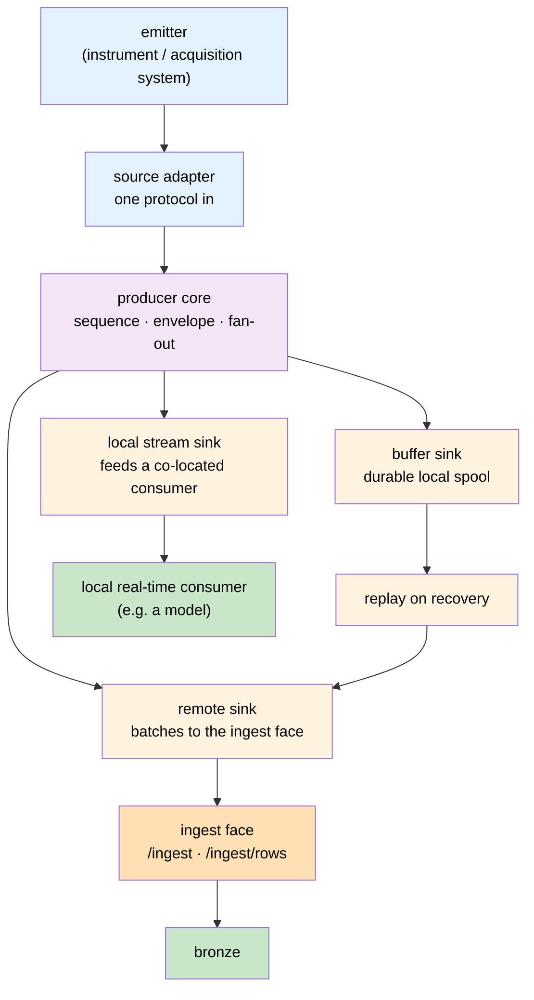

# Axiom Signal Ingest & Producer PRD

**Status:** Draft
**Owner:** Ben Booth
**Created:** 2026-08-25
**Last Updated:** 2026-08-25

---

## Executive Summary

Axiom can store signal data and it can serve it, but it has no supported way to
**get it in from an emitter**. The two halves of that path are both incomplete:

- **The serving face is unmounted.** `ingest_sink` exposes `/ingest` (documents)
  and `/ingest/rows` (rows), and `spec-serve` §4 uses the ingest sink as its
  worked example of manifest discovery — but the extension declares no `service`
  block and implements no `mount_spec`, so `axi serve` never mounts either lane.
  The door exists and is not hung.
- **There is no producer library at all.** Every emitter integrated so far is a
  bespoke script with its own retry logic, its own credential handling, and its
  own idea of what to do when the far end is unreachable.

This PRD treats those as **one product**, because they are one contract seen from
two ends. It also takes a position on three things a naive "POST some JSON"
design would get wrong:

1. **An emitter usually has more than one destination.** The same signal often
   must go to a remote ingester, to a local durable buffer, *and* to a local
   streaming consumer — frequently all three at once. A producer is therefore a
   **local signal router**, not a shipper.
2. **Federation already solves the cross-boundary problems** — peer identity,
   graduated trust, and the gate that governs what may cross a node boundary.
   Ingest should ride that machinery rather than grow a parallel control plane.
3. **Provenance must be designed for now and built later.** Audit, failure
   forensics, and regulatory attestation all require proving a signal set is
   complete and unaltered. Building that later is cheap *if* the envelope
   reserves the fields now, and expensive if it does not.

## Problem statement

| # | Problem | Consequence today |
|---|---|---|
| P1 | No producer library | Each source is bespoke; durability and retry are re-invented per integration, inconsistently |
| P2 | Serving face unmounted | No reachable ingest endpoint; the row lane is in-process only |
| P3 | Emitters need local fan-out | A source feeding a local real-time consumer must be integrated twice, once per destination |
| P4 | A stalled remote sink stalls everything | An unreachable ingester can starve a local consumer that has nothing to do with it |
| P5 | Producers are unobservable | A wedged producer is silent; the first symptom is missing data noticed days later |
| P6 | No provenance chain | No way to demonstrate a signal set is complete, ordered, and unaltered |
| P7 | Cross-boundary controls duplicated | Ingest would re-implement identity and transfer gating that federation already enforces |

P4 and P5 are the ones that cause silent data loss, and both are architectural —
they cannot be patched in per-integration.

## Goals

- One documented contract that every emitter implements, so a new source is
  **configuration plus an adapter**, not a new program.
- Ingest survives outages and restarts on **both** ends without operator action
  and without data loss.
- A producer can deliver to several destinations independently, with **failure
  isolation between them**.
- Producer health is observable locally and, in aggregate, remotely — without
  raw signal data leaving the node to achieve it.
- The envelope is provenance-ready on day one, so stamping is an added capability
  rather than a migration.

## Non-goals

- **Stamping/signing is not built in this phase.** This PRD reserves its fields
  and fixes the semantics it depends on (ordering, chaining, identity); the
  signing and verification mechanism is deliberately deferred.
- Sub-second end-to-end delivery. Producers batch; sources needing hard real-time
  remote delivery are served by the local streaming sink (§R-A3), not the remote one.
- Replacing the pull connectors. Genuinely pollable sources stay pull-based.
- A general-purpose message broker. The producer's local fan-out is a bounded
  tee with a fixed sink taxonomy, not a broker.

## Users

| Persona | Needs |
|---|---|
| **Source owner** — owns an instrument or acquisition system | Integrate once; never lose data to a network blip; know when it is broken |
| **Platform operator** | One surface to authenticate, bound, and monitor; per-source isolation |
| **Analyst / consumer** | Complete, ordered, typed series with declared schema and provenance |
| **Auditor** *(future)* | Prove a signal set over a window is complete, ordered, and unaltered |

## The producer as a local signal router

The central design decision. One acquisition of the source, fanned out to
independently-configured sinks:

**Sinks are isolated by contract.** A sink that is slow, full, or failing must not
apply backpressure to any other sink. The motivating case: a co-located consumer
being fed live signal must keep receiving it while the remote ingester is
unreachable — the remote path's outage is not the local consumer's problem. This
is the difference between a router and a shipper, and it cannot be retrofitted
onto a design that assumes one destination.

## Requirements

### A — Producer core

| ID | Requirement |
|---|---|
| SIG-A1 | A producer acquires from **one** source adapter and fans out to **one or more** configured sinks. |
| SIG-A2 | Sinks are independently configured and **independently failing**. No sink may block, stall, or drop another. |
| SIG-A3 | The **local stream sink** delivers to a co-located consumer with the lowest latency the adapter allows, and is never gated on remote sink health. |
| SIG-A4 | The **buffer sink** persists durably to local storage, survives process and host restart, and has an explicit retention policy. |
| SIG-A5 | The **remote sink** batches on a time or size window and delivers to the ingest face. |
| SIG-A6 | Every emitted batch carries a **monotonically increasing per-producer sequence number**. |
| SIG-A7 | On restart, a producer resumes from its last durable position. Restart is not a data gap. |
| SIG-A8 | Delivery is at-least-once. Producers replay without reconciling with the server; de-duplication is the sink's responsibility. |
| SIG-A9 | Every outbound network operation has an explicit **connect** timeout. A silently-dropped connection must fail fast, not block. |

> SIG-A9 exists because a filtered port accepts nothing and answers nothing. A
> client without a connect timeout waits indefinitely rather than failing over —
> observed in practice, not hypothetical.

### B — Source adapters (protocols in)

| ID | Requirement |
|---|---|
| SIG-B1 | Adapters are pluggable behind one interface; adding a protocol adds no core code. |
| SIG-B2 | Ship with adapters for the common acquisition shapes: subscribe-style streaming, publish/subscribe messaging, industrial process protocols, HTTP poll, and file/directory watch. |
| SIG-B3 | An adapter declares whether its source is **replayable** (can be re-read from a position) or **ephemeral** (must be captured live or lost). |
| SIG-B4 | For ephemeral sources the buffer sink is **mandatory**, not optional — there is no upstream to re-read. |

### C — Transport (protocols out)

| ID | Requirement |
|---|---|
| SIG-C1 | HTTP/JSON is the baseline transport every deployment supports. |
| SIG-C2 | Transport is pluggable, so a future streaming transport is a swap, not a producer rewrite. |
| SIG-C3 | The producer contract is transport-independent: sequence, envelope, and idempotency semantics do not change with transport. |

### D — Serving face

| ID | Requirement |
|---|---|
| SIG-D1 | Both lanes mount into the composed app through the manifest `service` discovery path (`mount_spec`), under one namespace claim. |
| SIG-D2 | Authentication is required off loopback; the face refuses to bind a non-loopback interface without an authz provider (fail-closed). |
| SIG-D3 | The authenticated principal determines the producer's **tenant/site** and its maximum access tier. A payload claiming a different site is rejected, never merged. |
| SIG-D4 | Request shape is bounded (batch count, rows per batch, payload size) and rejected at validation before any write. |
| SIG-D5 | An unknown source fails loudly rather than landing in an ungoverned default. |

### E — Federation

| ID | Requirement |
|---|---|
| SIG-E1 | A producer may authenticate as a **federation principal**, using the existing peer-signature seam, rather than requiring a separately-issued bearer key per producer. |
| SIG-E2 | Producer trust is **graduated** via the trust graph rather than binary. |
| SIG-E3 | Ingest that crosses a node boundary is governed by the **existing federation transfer gate** — the same access-tier and safety checks that govern any cross-node content. No parallel control plane. |
| SIG-E4 | **Observability crosses federation boundaries as facts; signal payload never does.** Remote aggregation consumes producer health and metrics, not raw data. |
| SIG-E5 | *(Candidate, not committed)* A producer unable to reach its ingester may hand off to a trusted peer that can. Evaluate against the trust model before adopting. |

> SIG-E4 is what makes remote aggregation compatible with the federation
> invariant that raw content stays at its originating node. Producer state is
> derived metadata — it is exactly the kind of proposition federation already
> propagates.

### F — Observability

| ID | Requirement |
|---|---|
| SIG-F1 | A producer exposes structured state: per-sink last-success time, queue/spool depth, sequence position, error counts, and current connection state. |
| SIG-F2 | State is readable **locally** by a visualizer without contacting a remote service, so a producer can be diagnosed on a disconnected node. |
| SIG-F3 | State is exportable to a **remote aggregator** for fleet-wide monitoring, as facts (SIG-E4). |
| SIG-F4 | **Silence is a failure signal.** Absence of progress — spool depth rising, last-success ageing past a threshold — raises an alert. A healthy-looking process that has stopped delivering must not read as healthy. |
| SIG-F5 | Producer state is surfaced through the platform's existing alerting path rather than a bespoke notifier. |

> SIG-F4 is the direct answer to P5. The characteristic failure is not a crash;
> it is a process that is up, reachable, and quietly delivering nothing.

### G — Provenance and stamping *(design now, build later)*

| ID | Requirement |
|---|---|
| SIG-G1 | The batch envelope **reserves** provenance fields from the first release: producer identity, sequence number, previous-batch hash, and a nullable manifest signature. |
| SIG-G2 | Sequence numbers plus the previous-batch hash form a **chain**, giving gap detection and tamper evidence **before** any signing exists. |
| SIG-G3 | Adding signing later must require **no bronze migration** and no change to the producer contract — only population of already-reserved fields. |
| SIG-G4 | The intended end state is a verifiable chain of custody from emitter to bronze, supporting audit, failure forensics, and regulatory attestation in regulated deployments. |
| SIG-G5 | Provenance claims must degrade honestly: an unstamped batch is reported as unstamped, never as verified. |

> G is the anticipatory section. The expensive part of stamping is not the
> cryptography — it is retrofitting **ordering and identity** into an envelope
> that was designed without them. G1–G3 buy that cheaply now. Nothing here
> commits us to a signing scheme, a key hierarchy, or a verification workflow;
> those are deliberately open.

## Success metrics

- A new source is integrated by writing an adapter and a config file — no changes
  to producer core or the serving face.
- Zero data loss across an induced outage of each kind: network partition,
  ingester down, producer process restart, host reboot.
- A stalled producer is alerted on before a human notices missing data.
- A stalled remote sink demonstrably does not perturb a local stream consumer.
- Enabling stamping later touches no bronze schema and no producer code path
  other than field population.

## Risks

| Risk | Mitigation |
|---|---|
| Producer spools become an unmonitored disk-consumption source | Spool depth and retention are first-class config with required metrics (SIG-F1) |
| At-least-once means duplicate arrival is normal | De-duplication happens at the bronze gate; aggregation must sit downstream of it |
| Fan-out complexity invites a broker rewrite | Fixed sink taxonomy (remote / buffer / local stream); explicitly not general-purpose (Non-goals) |
| Federation coupling could block ingest if federation is unavailable | Federation identity is one authentication option, not the only one (SIG-E1 "may") |
| Deferring stamping becomes never building it | G1–G3 make the deferral reversible at low cost; the envelope carries the fields regardless |

## Phasing

Each phase ships something usable on its own.

| Phase | Delivers |
|---|---|
| **1** | Serving face mounted (SIG-D1), authenticated and fail-closed (D2–D5) |
| **2** | Producer core: envelope with reserved provenance fields, sequencing, buffer sink, remote sink, connect timeouts (A1–A9, C1, G1–G2) |
| **3** | Local stream sink and sink isolation (A2–A3) — the fan-out that makes the producer a router |
| **4** | Observability: local state surface, remote aggregation as facts, silence alerting (F1–F5, E4) |
| **5** | Federation identity and graduated trust (E1–E3) |
| **6** | *(Future)* Stamping and verification (G4) |

Phase 3 is sequenced after 2 deliberately: the fan-out is only meaningful once
the envelope and durability semantics are fixed, and the local stream sink is the
piece most likely to acquire accidental coupling if built early.

## Open questions

- Which acquisition protocols warrant first-class adapters in phase 2 versus
  community contribution? (SIG-B2 names shapes, not products, pending that call.)
- Does the buffer sink retain raw source payloads or normalized envelopes? Raw
  aids forensics; normalized halves the storage.
- Is peer relay (SIG-E5) worth its trust-model complexity, or does the buffer
  sink already cover the outage case adequately?
- What is the authoritative clock for sequencing when a source supplies its own
  timestamps that disagree with the producer host?
