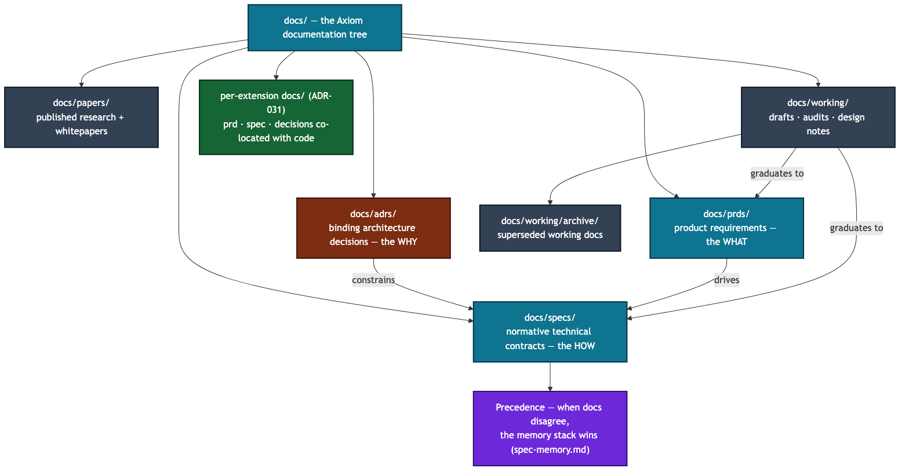

# Technical Specifications

This folder contains the technical specifications for Axiom — the normative
"how" behind each capability.

**PRDs define *what* to build. Specs define *how* to build it.** PRDs live in
[`../prds/`](../prds/); the spec of the same name is its implementation contract.

Start with [`spec-executive.md`](spec-executive.md) for the whole system in one
document, then the memory stack below, then the area index.

## Memory subsystem — read this stack first

Axiom Memory has a single normative contract every extension consumes. Read in this order:

| Order | Document | What it gives you |
|---|---|---|
| 1 | [`prd-memory.md`](../prds/prd-memory.md) | The product surface — outcomes, personas, distinctive bets, success metrics |
| 2 | [`spec-memory.md`](spec-memory.md) | **Authoritative normative contract** — every memorable read/write, every layer, the compliance checklist |
| 3 | [`spec-federation-policy.md`](spec-federation-policy.md) | VisibilityHorizon + ClassificationStamp + TrustProfile + FederationGateway primitives |
| 4 | [`spec-classification-boundary.md`](spec-classification-boundary.md) | Regulatory regimes (CUI / EAR / ITAR / Part 810) consumed by the federation gateway |
| 5 | [ADR-033](../adrs/adr-033-layered-memory-architecture.md) | The four-layer architecture commitment + migration plan |
| 6 | [`working/memory-benchmarks.md`](../working/memory-benchmarks.md) | Compliance suite + performance baseline + public benchmark plan |

**Subordinate to spec-memory** (one source of truth for graph + sessions + state):

- [`spec-knowledge-graph.md`](spec-knowledge-graph.md) — one backend impl behind the L2 ConceptGraph protocol; AGE-on-Postgres for Server tier
- [`spec-session-store.md`](spec-session-store.md) — read-cache for L1 conversation_turn fragments; not the source of truth
- [`spec-agent-state-management.md`](spec-agent-state-management.md) — operational state only (cursors, presence, locks); cognitive state goes through MemoryStore

When this stack and any other doc disagree, **the memory stack wins**. Future agents and extension authors: skim the order above, write against `spec-memory.md`, you get rich, fully-featured memory by default.

## Precedence

When two documents disagree, resolve in this order: **the memory stack (above)
wins**, then the load-bearing ADRs in [`../adrs/`](../adrs/) (they record the
binding decisions), then the spec for the area. A spec that contradicts an
accepted ADR is the spec to fix.

## Specs by area

Every current spec, grouped by area. Titles are the spec's own.

### Start here

| Spec | What it covers |
|---|---|
| [`spec-executive.md`](spec-executive.md) | Executive technical specification — the whole system in one document |

### Memory

| Spec | What it covers |
|---|---|
| [`spec-memory.md`](spec-memory.md) | Authoritative memory contract (source of truth for the stack) |
| [`spec-memory-maturity.md`](spec-memory-maturity.md) | Memory maturity & bounding — one pipeline across all memory |
| [`spec-memory-maturation.md`](spec-memory-maturation.md) | Memory maturation |
| [`spec-memory-compaction.md`](spec-memory-compaction.md) | Memory compaction |
| [`spec-memory-reflection.md`](spec-memory-reflection.md) | Memory reflection |
| [`spec-knowledge-graph.md`](spec-knowledge-graph.md) | L2 ConceptGraph backend (AGE-on-Postgres) |
| [`spec-session-store.md`](spec-session-store.md) | L1 conversation read-cache |
| [`spec-agent-state-management.md`](spec-agent-state-management.md) | Operational agent state — cursors, presence, locks |

### Federation / Vega

| Spec | What it covers |
|---|---|
| [`spec-federation.md`](spec-federation.md) | Federation protocol — `axiom://` URI, cohort registry, A2A |
| [`spec-federation-policy.md`](spec-federation-policy.md) | Visibility, classification, trust, gateway primitives |
| [`spec-vega.md`](spec-vega.md) | Vega — the federation + governance product |
| [`spec-canary-nodes.md`](spec-canary-nodes.md) | Canary nodes — staged federation rollout |

### RAG / Knowledge

| Spec | What it covers |
|---|---|
| [`spec-rag-architecture.md`](spec-rag-architecture.md) | RAG architecture — three-tier corpus, hybrid search |
| [`spec-rag-retrieval-policy.md`](spec-rag-retrieval-policy.md) | Retrieval Policy Engine (8 intents) |
| [`spec-rag-knowledge-maturity.md`](spec-rag-knowledge-maturity.md) | Knowledge maturity pipeline |
| [`spec-rag-community.md`](spec-rag-community.md) | Community corpus & federated knowledge aggregation |
| [`spec-rag-ingest-advanced.md`](spec-rag-ingest-advanced.md) | Advanced ingest UX |
| [`spec-rag-pack-server.md`](spec-rag-pack-server.md) | RAG pack server & generation pipeline |
| [`spec-auto-research.md`](spec-auto-research.md) | CURIO — auto-research agent architecture |
| [`spec-glossary-system.md`](spec-glossary-system.md) | Glossary system |
| [`spec-web-search.md`](spec-web-search.md) | In-enclave web search providers |

### Agents / CLI

| Spec | What it covers |
|---|---|
| [`spec-agent-architecture.md`](spec-agent-architecture.md) | Agent architecture |
| [`spec-agent-coverage-manifest.md`](spec-agent-coverage-manifest.md) | Coverage manifest — conditions mapped to owning agents |
| [`spec-axi-cli.md`](spec-axi-cli.md) | CLI technical specification |
| [`spec-model-routing.md`](spec-model-routing.md) | Model routing & settings |
| [`spec-llm-tier-policy.md`](spec-llm-tier-policy.md) | LLM-tier policy — semantic tiers to incumbents |
| [`spec-chat-model-picker.md`](spec-chat-model-picker.md) | Chat model picker |
| [`spec-chat-driven-corrections.md`](spec-chat-driven-corrections.md) | Chat-driven corrections + correction-aware retrieval |
| [`spec-prompt-registry.md`](spec-prompt-registry.md) | Prompt template registry |
| [`spec-cloud-routine-prompt-pattern.md`](spec-cloud-routine-prompt-pattern.md) | Cloud routine prompt pattern (state-machine prompts) |
| [`spec-design-loop-architecture.md`](spec-design-loop-architecture.md) | Design loop architecture |

### Data platform

| Spec | What it covers |
|---|---|
| [`spec-data-architecture.md`](spec-data-architecture.md) | Data architecture — medallion tiers |
| [`spec-signal-ingest-and-producer.md`](spec-signal-ingest-and-producer.md) | Signal ingest & producer |
| [`spec-compute-decomposition.md`](spec-compute-decomposition.md) | Compute decomposition |

### Governance / Security

| Spec | What it covers |
|---|---|
| [`spec-security.md`](spec-security.md) | Security spec |
| [`spec-governance-fabric.md`](spec-governance-fabric.md) | Unified governance fabric |
| [`spec-classification-boundary.md`](spec-classification-boundary.md) | Classification-boundary handling (step 4 of the memory stack) |
| [`spec-agent-action-guard.md`](spec-agent-action-guard.md) | Agent action safety — kill-switch, dry-run, volume bound |
| [`spec-ec-client-capability.md`](spec-ec-client-capability.md) | EC client capability — the host-client exfiltration boundary |
| [`spec-identity-acquisition.md`](spec-identity-acquisition.md) | Identity acquisition & verification at install |

### AEOS / Extensions

| Spec | What it covers |
|---|---|
| [`spec-aeos-0.1.md`](spec-aeos-0.1.md) | Agent Extension Open Standard v0.1 — governs every extension |
| [`spec-aeos-1.0.md`](spec-aeos-1.0.md) | AEOS v1.0 — forward draft |
| [`spec-aeos-identity-addendum.md`](spec-aeos-identity-addendum.md) | AEOS identity & credential addendum |
| [`spec-extension-layout.md`](spec-extension-layout.md) | Extension layout |
| [`spec-extension-loading.md`](spec-extension-loading.md) | Extension loading — discovery, hot-swap, WASM target |
| [`spec-extension-ui-protocol.md`](spec-extension-ui-protocol.md) | How extensions surface capabilities to users |
| [`spec-builtin-mcp-server.md`](spec-builtin-mcp-server.md) | Built-in root MCP server |
| [`spec-hooks.md`](spec-hooks.md) | Platform hooks |

### Platform services & operations

| Spec | What it covers |
|---|---|
| [`spec-axiom-notifications.md`](spec-axiom-notifications.md) | HERALD — notifications |
| [`spec-axiom-schedule.md`](spec-axiom-schedule.md) | PULSE — scheduler |
| [`spec-schedule-consumer-seam.md`](spec-schedule-consumer-seam.md) | Schedule consumer seam |
| [`spec-event-bus.md`](spec-event-bus.md) | Event bus v2 |
| [`spec-connections.md`](spec-connections.md) | Connections & credentials framework |
| [`spec-serve.md`](spec-serve.md) | HTTP serving substrate |
| [`spec-logging.md`](spec-logging.md) | System logging |
| [`spec-observability.md`](spec-observability.md) | Observability |
| [`spec-metrics-framework.md`](spec-metrics-framework.md) | Product metrics framework |
| [`spec-managed-infrastructure.md`](spec-managed-infrastructure.md) | Managed infrastructure |
| [`spec-cicd-and-deployment.md`](spec-cicd-and-deployment.md) | CI/CD & deployment |
| [`spec-settings.md`](spec-settings.md) | Settings surface |
| [`spec-system-limits.md`](spec-system-limits.md) | System limits & known constraints |

### Interfaces & consumer surfaces

| Spec | What it covers |
|---|---|
| [`spec-classroom.md`](spec-classroom.md) | Classroom & learning module (Keplo) |
| [`spec-classroom-addendum-lti-xapi.md`](spec-classroom-addendum-lti-xapi.md) | LTI/xAPI integration + LLM evals |
| [`spec-classroom-generate-shortcuts.md`](spec-classroom-generate-shortcuts.md) | Classroom generate shortcuts |
| [`spec-embodied-surfaces.md`](spec-embodied-surfaces.md) | Presence (voice/avatar) + actuation surfaces on the governance spine; surface-family conformance (Draft) |
| [`spec-scientific-displays.md`](spec-scientific-displays.md) | Scientific displays |
| [`spec-publisher.md`](spec-publisher.md) | Publisher architecture |
| [`spec-brand-identity.md`](spec-brand-identity.md) | Brand identity |

### Meta & process

| Spec | What it covers |
|---|---|
| [`spec-template.md`](spec-template.md) | The spec template — start a new spec here |
| [`spec-stakeholder-interview-guide.md`](spec-stakeholder-interview-guide.md) | Stakeholder interview guide |
| [`spec-mermaid-best-practices.md`](spec-mermaid-best-practices.md) | Mermaid guidance (LR/inline parts superseded by [`../assets/diagrams/README.md`](../assets/diagrams/README.md)) |

## Relationship to PRDs

PRDs answer *what*; the spec of the same name answers *how*. A few verified pairs:

| PRD (what) | Spec (how) |
|---|---|
| [`prd-memory.md`](../prds/prd-memory.md) | [`spec-memory.md`](spec-memory.md) |
| [`prd-federation.md`](../prds/prd-federation.md) | [`spec-federation.md`](spec-federation.md) |
| [`prd-axi-cli.md`](../prds/prd-axi-cli.md) | [`spec-axi-cli.md`](spec-axi-cli.md) |
| [`prd-axiom-notifications.md`](../prds/prd-axiom-notifications.md) | [`spec-axiom-notifications.md`](spec-axiom-notifications.md) |
| [`prd-classroom.md`](../prds/prd-classroom.md) | [`spec-classroom.md`](spec-classroom.md) |

Extension-specific PRDs and specs are co-located with the extension code, not
here, per [ADR-031](../adrs/adr-031-extension-self-containment.md).

_Copyright (c) 2026 The University of Texas at Austin and B-Tree Labs. Apache-2.0 licensed._
