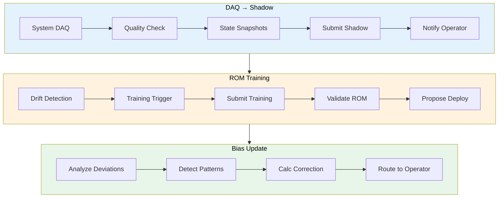

# Axiom Agent Architecture

> **Implementation Status (updated 2026-04-02):** Built-in agents (Signal, Chat,
> TIDY, PRESS, Doctor) are shipped. SECUR-T guardian agent is implemented (content
> verification, 5 anomaly detection rules, trust scoring, alert lifecycle — 30 tests).
> Content sanitizer (14 prompt injection categories — 37 tests) and chaos test
> framework (6 scenarios — 13 tests) are implemented. RIVET (release/CI —
> pipeline monitoring, CI-failure issue lifecycle, release tooling, merge/ship
> lifecycle signals per ADR-046) is implemented. CURIO (auto-research) is spec'd.
> Digital Twin agents (GOAL_DT_001-005) are planned.

---

## Architecture Overview

Axiom agents are modular, autonomous processes that perceive signals from the environment, reason using LLMs, and take bounded actions subject to safety guardrails. **Digital Twin Automation is the flagship capability** — agents that coordinate Shadow runs, ROM training, bias corrections, and model validation.

| Agent Category | Primary Focus | Status |
|---------------|--------------|--------|
| **Digital Twin Agents** | Shadow orchestration, ROM lifecycle, bias monitoring | 🔲 Planned (flagship) |
| **SECUR-T (Guardian)** | Content verification, anomaly detection (5 rules), trust scoring, alert lifecycle, escalation path verification | ✅ Implemented (30 tests) |
| **CURIO Agent** | Autonomous research, knowledge synthesis, corpus self-improvement | 📋 [Spec'd](spec-auto-research.md) |
| **RIVET Agent** | Release/CI — pipeline monitoring, CI-failure issue lifecycle, release tooling, merge/ship lifecycle signals (ADR-046) | ✅ Implemented |
| **Signal Agent** | Program awareness, voice/document ingest | ✅ Shipped |
| **Chat Agent** | Interactive LLM assistant | ✅ Shipped |
| **TIDY Agent** | Resource stewardship, system hygiene, git working-state reclamation (worktrees + merged branches/remote refs, ADR-046) | ✅ Shipped |
| **Doctor Agent** | System diagnostics, security health | ✅ Shipped |

All agents follow the design principles and safety guardrails defined in [prd-agents.md](../requirements/prd-agents.md).

---

## Context: What Already Exists

A consumer layer (a domain extension built on Axiom) has a well-designed
architecture that this agent work must respect and extend, not replace:

```
your-app/
  src/axiom/                   # Python package root
    extensions/builtins/
      signal_agent/                 # Signal ingestion agent (this spec)
      chat_agent/                   # Interactive LLM assistant
      publisher/                    # Document lifecycle
      hygiene/                     # Resource steward
      doctor_agent/                 # AI diagnostics
      ...                           # See CLAUDE.md for full list
    infra/                          # Shared infra (gateway, auth)
  runtime/                          # Instance-specific data (mostly gitignored)
    config/                         # Site config
    inbox/                          # Signal inbox
    drafts/                         # Agent-generated drafts
    sessions/                       # Agent sessions
  docs/
    requirements/                   # PRDs
    specs/                          # Architecture specs
  tools/
    exports/                        # Weekly GitLab JSON dumps
```

Key design decisions already made:
- **`axi` CLI** is the unified interface (Python/argparse, noun-verb pattern)
- **Extensions** handle system-specific logic (external repos, installed to `.axi/extensions/`)
- **Signal pipeline** handles Teams → Transcribe → Extract → GitLab
- **Offline-first** is a hard requirement (operations sites can lose network)
- **Model-agnostic** — no vendor lock-in on LLM provider

---

## Digital Twin Agent Architecture

**This is the flagship capability.** Digital Twin agents automate the lifecycle of any modeled system's digital twin — from data acquisition through ROM deployment. The pattern applies broadly: a wind turbine, a jet/gas turbine engine, a chemical process plant, a power-grid substation, a building HVAC system, a climate/weather model, a manufacturing line, a hydro dam, or (for example) a nuclear reactor. These agents coordinate with the infrastructure defined in [spec-digital-twin-architecture.md](spec-digital-twin-architecture.md).

### Agent Overview



### CLI Design (`axiom twin`)

```bash
# ─── SHADOW: Nightly high-fidelity solver runs ───
axiom twin shadow status                    # Show last Shadow run status
axiom twin shadow trigger --facility=plant-a  # Manually trigger Shadow
axiom twin shadow history --days=30         # Show Shadow run history

# ─── ROM: Reduced-order model lifecycle ───
axiom twin rom list                         # List deployed ROMs
axiom twin rom drift --model=turbine-rom2   # Check ROM drift metrics
axiom twin rom train --model=turbine-rom2   # Trigger retraining
axiom twin rom deploy --version=v2.1        # Deploy new ROM (requires approval)

# ─── BIAS: Systematic correction monitoring ───
axiom twin bias analyze --facility=substation-3  # Analyze systematic deviations
axiom twin bias propose --correction=...    # Submit bias correction proposal
axiom twin bias history                     # View correction history

# ─── PREDICT: Real-time ROM inference ───
axiom twin predict --facility=hvac-tower-b  # Get current ROM prediction
axiom twin compare --run=run-2026-03-17     # Compare prediction vs measured
```

### Agent Code Structure

```
src/axiom/extensions/builtins/twin_agent/
  __init__.py
  daq_shadow_agent.py       # GOAL_DT_001: DAQ → Shadow workflow
  rom_training_agent.py     # GOAL_DT_002: ROM retraining automation
  bias_update_agent.py      # GOAL_DT_003: Bias correction proposals
  operator_learning_agent.py # GOAL_DT_004: Operator feedback integration
  rom_failure_handler.py    # GOAL_DT_005: ROM failure detection & recovery
  cli.py                    # axiom twin commands
```

### RACI Integration

| Agent | Autonomous (Informed) | Requires Approval |
|-------|----------------------|-------------------|
| **DAQ → Shadow** | Routine data quality checks, Shadow submissions | Data quality below threshold, Shadow failures |
| **ROM Training** | Drift monitoring, training job submission | New ROM deployment to production |
| **Bias Update** | Deviation analysis, pattern detection | Application of bias corrections |
| **Failure Handler** | Error detection, fallback activation | ROM disabling, operator alerts |

### Data Quality Prerequisites

Per domain-owner guidance, Digital Twin agents enforce data quality before Shadow runs. The checks are generic sensor-fusion validations; the table uses mixed-domain examples:

| Check | Validation | Action on Failure |
|-------|------------|-------------------|
| Time synchronization | Vibration, temperature, and flow readings time-aligned (e.g. turbine vibration + bearing temp; or reactor rod position + power) | Alert data team, delay Shadow |
| Correlation | Control input → predictable response (e.g. valve open → pressure rise; throttle → RPM; rod movement → power response) | Flag for manual review |
| Noise characterization | Distinguish correlated physical signal from sensor noise | Filter or flag spikes |

---

## Signal Agent Architecture

### What We're Adding: Axiom Signal

A new CLI noun (`axiom signal`) that extends the existing `axi` command structure. Axiom Signal is the
agentic module for continuous program awareness — ingesting signals from multiple
sources, extracting structured information, and maintaining program state.

### CLI Design (follows existing noun-verb pattern)

```bash
# ─── INGEST: Pull signals from sources ───
axiom signal ingest                     # Process all new items in inbox
axiom signal ingest --source voice      # Process only voice memos
axiom signal ingest --source teams      # Process only Teams recordings
axiom signal ingest --source gitlab     # Process latest GitLab export
axiom signal ingest --source text       # Process freetext drops (notes, emails)

# ─── DRAFT: Synthesize signals into human-readable summaries ───
axiom signal draft                      # Generate weekly status draft
axiom signal draft --scope tracker      # Draft tracker update only
axiom signal draft --scope issues       # Draft GitLab/Linear issue updates only
axiom signal draft --scope minutes      # Draft meeting minutes only

# ─── REVIEW: Human-in-the-loop approval ───
axiom signal review                     # Open latest draft in $EDITOR
axiom signal review --approve           # Approve current draft
axiom signal review --reject            # Reject and discard

# ─── PUBLISH: Apply approved changes ───
axiom signal publish                    # Push approved changes to targets
axiom signal publish --target onedrive  # Push tracker to SharePoint/OneDrive
axiom signal publish --target gitlab    # Apply issue updates to GitLab
axiom signal publish --target linear    # Apply issue updates to Linear

# ─── HEARTBEAT: Proactive sensing daemon ───
axiom signal heartbeat                  # Run heartbeat checks now
axiom signal heartbeat --start          # Start daemon (launchd/systemd)
axiom signal heartbeat --stop           # Stop daemon
axiom signal heartbeat --status         # Show daemon status + last run

# ─── STATUS: Current program state ───
axiom signal status                     # Show program overview
axiom signal status --stale             # Show items with no signal in 14+ days
axiom signal status --people            # Show per-person activity summary
```

### Relationship to Existing Modules

```
axiom log    — System operations logging        (facility-facing)
axiom sim    — Simulation orchestration           (facility-facing)
axiom model  — Surrogate model management         (facility-facing)
axiom twin   — Digital twin state                 (facility-facing)
axiom data   — Data platform queries              (facility-facing)
axiom chat   — Agentic assistant (interactive)    (facility-facing)
axiom signal  — Program awareness (proactive)      (team-facing)     ← NEW
axiom ext    — Extension management               (platform-facing)
axiom infra  — Infrastructure management          (platform-facing)
```

Axiom Signal is unique: it's the only noun that runs proactively (heartbeat) and
synthesizes across sources rather than querying a single system. But it follows
the same patterns: offline-first, RACI-governed autonomy (per-user per-agent
trust levels), JSON/table output formats.

---

## Relationship to `meeting-intake`

The original `meeting-intake` concept specified a Teams recording pipeline.
`axiom signal` subsumes and extends that concept:

```
meeting-intake (existing)         axiom signal (new)
─────────────────────────         ──────────────────
Teams → Transcribe → Extract      Teams → meeting-intake → signal inbox
→ Match GitLab → Review →         Voice Memos → Whisper → signal inbox
Apply to GitLab                   GitLab exports → signal inbox
                                  Teams messages → signal inbox
                                  Freetext/notes → signal inbox
                                  Email → signal inbox
                                  ─────────────────────────────
                                  All sources → Extract → Synthesize
                                  → Draft → Review → Publish
                                  (to tracker, GitLab, Linear, OneDrive)
```

`meeting-intake` is a specialized extractor that Axiom Signal orchestrates. The
meeting-intake README already defines the right pipeline; Axiom Signal adds:
1. Voice Memos as an additional audio source (same Whisper pipeline)
2. Non-audio sources (GitLab, Teams messages, freetext, email)
3. Cross-source synthesis (merge signals from all sources into one draft)
4. Multi-target publishing (not just GitLab — also tracker, Linear, OneDrive)
5. Heartbeat-driven proactive sensing

---

## Audio Pipeline: Voice Memos + Teams Recordings

Both audio sources flow through the same pipeline, with different ingestion paths:

### Source 1: iPhone Voice Memos
```
iPhone → iCloud → ~/Library/.../VoiceMemos/Recordings/*.m4a
  → fswatch/launchd detects new file
  → copies to runtime/inbox/raw/voice/
  → axiom signal ingest --source voice
```

**launchd plist** (extends existing `com.utcomputational.gitlab-export.plist` pattern):
```xml
<!-- com.utcomputational.voice-signal.plist -->
<plist version="1.0">
<dict>
  <key>Label</key>
  <string>com.utcomputational.voice-signal</string>
  <key>WatchPaths</key>
  <array>
    <string>~/Library/Group Containers/group.com.apple.VoiceMemos.shared/Recordings</string>
  </array>
  <key>ProgramArguments</key>
  <array>
    <string>/usr/local/bin/axi</string>
    <string>signal</string>
    <string>ingest</string>
    <string>--source</string>
    <string>voice</string>
  </array>
</dict>
</plist>
```

### Source 2: Microsoft Teams Recordings
```
Teams meeting ends → Recording appears in OneDrive/SharePoint
  → Microsoft Graph API webhook or polling (meeting-intake already specifies this)
  → Downloads to runtime/inbox/raw/teams/
  → axiom signal ingest --source teams
```

Teams recordings come with auto-generated transcripts (via Microsoft's own
transcription). The pipeline can use those directly OR re-transcribe with
Whisper for higher quality + local privacy:

```python
def ingest_teams_recording(recording_path):
    """Process a Teams recording."""
    # Option A: Use Microsoft's transcript (faster, no compute)
    transcript = fetch_teams_transcript(recording_path)

    # Option B: Re-transcribe locally (higher quality, private)
    if config.prefer_local_transcription:
        transcript = whisper_transcribe(recording_path)

    # Both paths produce the same structured output
    return extract_signals(transcript)
```

### Shared Audio Processing Pipeline
```
Audio file (.m4a / .mp4 / .webm)
  │
  ├─ Transcribe (Whisper large-v3, local on Mac M-series)
  │  Output: timestamped text segments
  │
  ├─ Diarize (pyannote-audio, local)
  │  Output: speaker-labeled segments
  │
  ├─ Identify Speakers
  │  Input: diarized segments + config/people.md
  │  Method: Ask user to label first time; learn patterns over time
  │  Output: named speaker segments
  │
  ├─ Extract Signals (LLM, via gateway)
  │  Input: named transcript + config/initiatives.md
  │  Output: decisions, action items, status signals, blockers
  │
  ├─ Correlate (match to known entities)
  │  Input: extracted signals + GitLab issues + Linear issues
  │  Output: correlated signals with suggested targets
  │
  └─ Notify + Queue for Review
     Output: notification to the user + draft in runtime/drafts/
```

---

## File Structure (within existing repo)

Code lives in the extension directory; runtime data in `runtime/`:

```
src/axiom/extensions/builtins/signal_agent/
  __init__.py
  cli.py                            # CLI commands for `axiom signal`
  service.py                        # Always-on service entry point
  extractors/
    __init__.py
    base.py                         # Abstract extractor interface
    audio.py                        # Whisper + pyannote (shared by voice + teams)
    gitlab.py                       # GitLab export diff → signals
    freetext.py                     # General text → signals
    linear.py                       # Linear issue state changes → signals
  correlator.py                     # Map signals to people/initiatives/issues
  synthesizer.py                    # Merge signals → weekly draft
  axiom-extension.toml               # Extension manifest (noun = "signal")

src/axiom/infra/
  gateway.py                        # Model-agnostic LLM interface

runtime/
  inbox/
    raw/                            # Drop zone for unprocessed inputs
      voice/                        # Voice memo .m4a files
      teams/                        # Teams recording downloads
      gitlab/                       # GitLab export JSONs
      text/                         # Freetext: Teams msgs, emails, notes
    processed/                      # Extracted signal JSONs
  config/                           # Facility config (gitignored)
    heartbeat.md                    # Proactive task schedule
    models.toml                     # LLM provider config (gateway)
  drafts/                           # Agent-generated summaries for review

tools/
  exports/                          # GitLab weekly dumps
    gitlab_export_YYYY-MM-DD.json
```

---

## Instance vs. Platform Separation

Axiom is designed for any operations site. The `runtime/config/`
directory contains instance-specific configuration. Everything else is generic.

### Instance Config (site-specific, .gitignored)

```toml
# runtime/config/facility.toml

[facility]
name = "Example Site A"
type = "research"          # research | commercial | government
system = "turbine-a"       # any modeled system: turbine | engine | hvac | grid | reactor | ...
plugin = "plugin-turbine"  # links to plugins/ system-specific logic

[signal.sources]
voice_memos = true
teams_recordings = true
gitlab_export = true
email_forwarding = false   # future

[signal.heartbeat]
interval_minutes = 30
active_hours = "08:00-18:00"
active_days = "Mon-Fri"

[signal.publish]
onedrive_path = "Documents/Master_Program_Tracker.xlsx"
teams_channel = ""         # optional webhook for status posts
```

```markdown
# runtime/config/people.md
# Site-specific team roster — .gitignored

| Name | GitLab | Linear | Role | Initiative |
|------|--------|--------|------|-----------|
| <dept-head>    | <handle> | — | Dept. Head           | Strategic direction |
| <sr-scientist> | <handle> | — | Sr. Eng. Scientist   | Twin program, flow loop |
| <dt-lead>      | <handle> | — | Digital Twin lead    | Site DT |
...
```

```markdown
# runtime/config/initiatives.md
# Site-specific project list — .gitignored

| ID | Name | Status | Owners | Repos |
|----|------|--------|--------|-------|
| 1 | Site Digital Twin | Active | <dt-lead>, <sr-scientist> | site_digital_twin, dt_website |
| 2 | Flow Loop DT      | Active | <sr-scientist>            | flow_loop_digital_twin |
...
```

### For Another Site

Another organization installs Axiom and creates their own config:
```toml
[facility]
name = "Partner Site B"
type = "research"
system = "engine-x"
plugin = "plugin-engine"   # different plugin, different config
```

They fill in their own `people.md` and `initiatives.md`. The extractors,
synthesizer, publisher, and CLI are all identical. The config is theirs.

> **Design Note (v0.5.x):** Both `people.md` and `initiatives.md` are
> static bootstrap files that should be replaced by dynamic sources:
>
> **People:** Once Ory Kratos ships (Security PRD FR-ID-005), the
> correlator reads from the Kratos identity store instead of a markdown
> file. People are added/removed through `axiom login`, not file edits.
>
> **Initiatives:** Static lists are unsustainable — new initiatives
> emerge, old ones retire, and nobody maintains the file. Initiatives
> should be derived dynamically from:
> 1. PRD files (`docs/prds/prd-*.md`) — each PRD is an initiative with lifecycle status
> 2. OKR key results (`prd-okrs-2026.md`) — measurable targets with timelines
> 3. GitLab milestones/epics (via connection) — tracked project work
> 4. Active git branches (`feat/*`) — in-progress development initiatives
> 5. Extension manifests (`axiom-extension.toml`) — each extension is an initiative
>
> The correlator would query these sources at ingest time, building a
> live initiative graph with relationships (depends-on, enables, blocks).
> This is a significant design effort — needs ideation before implementation.
> See: [GitHub Discussion TBD] or [ADR TBD]

---

## LLM Gateway (Model + IDE Agnostic)

You use Cursor, VS Code, Claude Code, and may run Qwen on PrivateCloud. The gateway
must not assume any specific provider.

```toml
# runtime/config/models.toml

[gateway]
format = "openai"          # All providers speak OpenAI chat completions

[[gateway.providers]]
name = "anthropic"
endpoint = "https://api.anthropic.com/v1"
model = "claude-sonnet-4-20250514"
api_key_env = "ANTHROPIC_API_KEY"
priority = 1
use_for = ["extraction", "synthesis", "correlation"]

[[gateway.providers]]
name = "qwen-private-server"
endpoint = "http://localhost:8000/v1"
model = "qwen2.5-32b-instruct"
priority = 2
use_for = ["extraction", "synthesis"]

[[gateway.providers]]
name = "openai"
endpoint = "https://api.openai.com/v1"
model = "gpt-4o"
api_key_env = "OPENAI_API_KEY"
priority = 3
use_for = ["multimodal", "fallback"]
```

The gateway tries providers in priority order with fallback. Any IDE that
can call the OpenAI API format (Cursor, Claude Code, Copilot) can also use
the gateway endpoint if exposed locally.

### Per-Agent Routing Profiles (v0.5.0)

Each agent declares a routing profile that defines its provider preferences
and failure behavior. See [Model Routing Spec §10](spec-model-routing.md)
for the full design.

| Agent | Profile | Priority | On Failure |
|-------|---------|----------|------------|
| Neut (chat) | `chat` | Quality (Opus → Sonnet → local) | Queue |
| SCAN (extraction) | `extraction` | Speed (Haiku → local → skip) | Skip |
| TRIAGE (diagnosis) | `diagnosis` | Reliability (Sonnet → Haiku) | Queue |
| PRESS (publishing) | `publishing` | Quality (Sonnet → Opus) | Retry |
| TIDY (steward) | `extraction` | Speed (shared with SCAN) | Skip |

```python
# Agent declares its profile at construction
class EVEAgent:
    ROUTING_PROFILE = "extraction"  # Cheap, fast, skip-on-fail

    def extract(self, text):
        return self._gateway.complete(text, profile=self.ROUTING_PROFILE)
```

### RACI-Based Human-in-the-Loop (v0.5.0)

Every agent action checks the user's RACI preference before executing.
See [Agents PRD — RACI Framework](../requirements/prd-agents.md) for
the full design.

**Three-dimensional trust model:** RACI settings are scoped to the
combination of **user** (identified) + **agent** (specific) + **action**
(category). Trust doesn't transfer between agents — each agent builds
its own track record with each user.

```python
# In any agent before taking action:
from axiom.infra.raci import check_raci, RACILevel, EmergencyMode

# Check RACI for this specific agent + action combination
level = check_raci(agent="scan", action="issue.update")

# Emergency mode check (takes precedence)
if level.emergency_mode == EmergencyMode.FREEZE:
    return  # Do nothing — agent is frozen
if level.emergency_mode == EmergencyMode.LOG_INTENT_ONLY:
    log_intent(action="issue.update", target=issue_url, body=body)
    return  # Log but don't execute or propose

if level == RACILevel.EXECUTE:
    # R or I — just do it (notify if I)
    provider.add_comment(issue_url, body)
    if level.notify:
        notify(f"Updated issue #{iid}")

elif level == RACILevel.APPROVE:
    # A — pause for human (also used in PROPOSE_ONLY emergency mode)
    print(f"  Update issue #{iid}? [Y/n]")
    if confirmed():
        provider.add_comment(issue_url, body)

elif level == RACILevel.CONSULT:
    # C — show context, ask for input
    print(f"  Proposed comment on #{iid}:")
    print(f"  {body[:200]}...")
    feedback = input("  Edit, approve, or skip? ")
    ...
```

**Settings storage (per-agent):**
```bash
axiom settings set raci.scan.issue.update informed     # Trust SCAN to update issues
axiom settings set raci.press.publish.document approve  # PRESS still needs approval
axiom settings set raci.*.issue.create approve        # All agents need approval to create issues
```

**Emergency controls:**
```bash
axiom raci all-propose-only          # All agents pause for approval
axiom raci all-log-intent-only       # All agents log intent, no proposals
axiom raci all-freeze                # All agents stop processing
axiom raci resume                    # Restore pre-emergency settings
```

**Default RACI per ActionCategory:**
- `ActionCategory.READ` → Informed (auto-execute, notify)
- `ActionCategory.WRITE` → Approve (pause for confirmation)
- Safety-adjacent actions → always Approve (NSG-005 override, cannot be loosened)

For RAG: the gateway doesn't own RAG. RAG is a capability of the extractors
and the `axiom chat` module. The extractors use the gateway to call an LLM,
but they also have access to the retrieval layer (GitLab issues, Linear
items, the initiatives.md knowledge base, and eventually the Iceberg
lakehouse via DuckDB). The gateway is just the LLM routing layer; RAG
is assembled by the caller:

```python
def extract_signals(transcript, config):
    """Extraction uses RAG pattern: retrieve context, then generate."""
    # 1. Retrieve relevant context
    people = load_people(config)
    initiatives = load_initiatives(config)
    open_issues = fetch_gitlab_open_issues()
    linear_items = fetch_linear_items()

    # 2. Build prompt with retrieved context
    prompt = build_extraction_prompt(
        transcript=transcript,
        people=people,
        initiatives=initiatives,
        issues=open_issues + linear_items,
    )

    # 3. Call LLM via gateway (model-agnostic)
    response = gateway.complete(prompt)

    # 4. Parse structured output
    return parse_signals(response)
```

---

## Service Layer

Always-on agents (`publisher_agent`, `signal_agent`, `doctor_agent`) each expose a `service.py` module with a `main()` entry point. The service layer handles OS registration, process lifecycle, and graceful shutdown — the agent's domain logic is unchanged whether it runs interactively or as a system service.

### `service.py` Entry Point Pattern

```python
# src/axiom/extensions/builtins/<agent>/service.py
import signal
import sys

_shutdown = False

def _handle_sigterm(signum, frame):
    global _shutdown
    _shutdown = True

def main():
    signal.signal(signal.SIGTERM, _handle_sigterm)
    signal.signal(signal.SIGINT, _handle_sigterm)

    agent = Agent()
    agent.start()

    while not _shutdown:
        agent.tick()

    agent.shutdown()   # flush queues, close DB connections, write state
    sys.exit(0)
```

The `tick()` / `shutdown()` contract is the only interface the service layer requires from each agent. Agents must complete in-flight work before `shutdown()` returns. Maximum shutdown time is 10 seconds; after that the OS kills the process.

### launchd Plist Structure (macOS)

One plist per workspace, stored in `~/Library/LaunchAgents/`. Key fields:

```xml
<plist version="1.0">
<dict>
  <key>Label</key>
  <string>com.axiom.signal-agent.<workspace-hash></string>

  <key>ProgramArguments</key>
  <array>
    <string>/path/to/.venv/bin/python</string>
    <string>-m</string>
    <string>axiom.extensions.builtins.signal_agent.service</string>
  </array>

  <key>WorkingDirectory</key>
  <string>/path/to/workspace</string>

  <key>KeepAlive</key>
  <true/>

  <key>ThrottleInterval</key>
  <integer>10</integer>

  <key>StandardOutPath</key>
  <string>/path/to/workspace/runtime/logs/signal-agent.stdout.log</string>

  <key>StandardErrorPath</key>
  <string>/path/to/workspace/runtime/logs/signal-agent.stderr.log</string>
</dict>
</plist>
```

`ThrottleInterval` (seconds) is the minimum time between restarts. Set to 10 to prevent tight crash loops while still recovering quickly from transient failures.

### systemd User Unit Structure (Linux)

```ini
# ~/.config/systemd/user/axiom-signal-agent-<workspace-hash>.service
[Unit]
Description=Axiom Signal Agent (<workspace-name>)
After=network.target

[Service]
ExecStart=/path/to/.venv/bin/python -m axiom.extensions.builtins.signal_agent.service
WorkingDirectory=/path/to/workspace
Restart=on-failure
RestartSec=10
StandardOutput=append:/path/to/workspace/runtime/logs/signal-agent.stdout.log
StandardError=append:/path/to/workspace/runtime/logs/signal-agent.stderr.log

[Install]
WantedBy=default.target
```

`WantedBy=default.target` ensures the unit starts at user login without requiring root. `Restart=on-failure` restarts only on non-zero exit; `_shutdown` path exits 0 (clean stop), so `axiom agents stop` does not trigger a restart.

---

## Implementation Plan

### Phase 1: Digital Twin Agent Foundation (Priority)

**Goal:** Formalize an existing high-fidelity Shadow workflow into the Axiom agent framework.

> **Building on existing work:** A consumer layer may already run a nightly high-fidelity solver (e.g. a turbine CFD run, a grid power-flow study, or a reactor physics simulation) and email daily predictions. Phase 1 extracts this workflow into the Axiom agent framework, generalizing for multi-system support.

**Build order:**
1. `src/axiom/extensions/builtins/twin_agent/daq_shadow_agent.py` — Generalize the consumer's existing Shadow workflow
2. `src/axiom/extensions/builtins/twin_agent/cli.py` — `axiom twin` commands
3. Data quality validation hooks (time sync, correlation checks per domain-owner guidance)
4. Integration with existing PostgreSQL schema (`shadow_run_data`, `<system>_derived_data`)
5. Operator notification pipeline (email + optional Teams webhook)

**Deliverable:** `axiom twin shadow status` and `axiom twin shadow trigger` operational for a site, with data quality prereqs enforced.

### Phase 2: ROM Lifecycle Agents

**Goal:** Automate ROM retraining and drift monitoring.

**Build order:**
1. `src/axiom/extensions/builtins/twin_agent/rom_training_agent.py` — Training trigger logic
2. Drift detection metrics and thresholds
3. Training job submission to HPC scheduler
4. ROM validation against holdout data
5. Deployment proposal workflow (requires human approval)

**Deliverable:** `axiom twin rom drift` detects degradation; `axiom twin rom train` submits jobs with reproducible configs.

### Phase 3: Bias & Failure Handling

**Goal:** Autonomous bias correction proposals and ROM failure recovery.

**Build order:**
1. `src/axiom/extensions/builtins/twin_agent/bias_update_agent.py` — Systematic deviation analysis
2. `src/axiom/extensions/builtins/twin_agent/rom_failure_handler.py` — Fallback chains
3. Calibration target tracking — domain-specific tunable inputs (e.g. blade aero coefficients and material fatigue limits for a turbine; reaction-rate constants and heat-transfer coefficients for a chemical plant; or, for a nuclear reactor, cross sections, initial isotopes, and geometry)

**Deliverable:** `axiom twin bias analyze` detects systematic patterns; ROM failures trigger automatic fallback to Shadow.

---

### Signal Agent: Week 1 — Audio Pipeline (Voice Memos + Teams)

**Goal:** Record a meeting → get a structured, correlated summary within minutes.

**Build order:**
1. `src/axiom/extensions/builtins/signal_agent/extractors/audio.py` — Whisper transcription + pyannote diarization
2. `src/axiom/infra/gateway.py` — Model-agnostic LLM client (litellm or custom)
3. `src/axiom/extensions/builtins/signal_agent/correlator.py` — Map extracted entities to people.md + initiatives.md
4. Notifier module — macOS notification when processing complete
5. Ingest scripts for both sources:
   - Voice Memos: launchd watcher on iCloud sync directory
   - Teams: extend `meeting-intake` to also deposit in `inbox/raw/teams/`
     OR poll Microsoft Graph API for new recordings

**Speaker identification flow:**
```
First recording with unknown speakers:
  → Agent: "I found 3 speakers. Based on context, I think:
            Speaker A = <dept-head> (mentioned 'as dept head...')
            Speaker B = <sr-scientist> (discussed thermal-hydraulics)
            Speaker C = Unknown
            Please confirm or correct."
  → User confirms/corrects
  → Agent saves speaker profiles in config/speaker_profiles.json

Subsequent recordings:
  → Agent: "Identified <dept-head> and <sr-scientist>. One new speaker — who is this?"
  → User: "That's <new-engineer>"
  → Agent adds to profiles
```

**Deliverable:** `axiom signal ingest --source voice` and `axiom signal ingest --source teams`
both produce structured JSON in `inbox/processed/` with named speakers,
decisions, action items, and initiative correlations.

### Signal Agent: Week 2 — GitLab + Linear Diff Summaries

**Goal:** Weekly human-readable summary of what changed across all repos.

**Build order:**
1. `src/axiom/extensions/builtins/signal_agent/extractors/gitlab.py` — Diff two weekly exports → signals
2. `src/axiom/extensions/builtins/signal_agent/extractors/linear.py` — Fetch Linear changes → signals
3. Summary template for human-readable output

**Deliverable:** `axiom signal ingest --source gitlab` produces a summary like:
```markdown
## GitLab Activity — Week of Feb 17, 2026

### 🔥 Active Repos
- **dt_website** — 12 commits by <dt-lead>. Login improvements, op log updates.
- **site_daq** — 4 commits by <instrumentation-eng>. Streaming sensor data, noise mitigation.

### 📋 Issue Movement
- Opened: 5 new (Site DT: 3, Flow Loop: 2)
- Closed: 2 (Site DT #298, #294)

### ⚠️ Stale
- Test Loop — 41 open issues, 0 commits in 90 days
```

### Signal Agent: Week 3 — Synthesis + Tracker Update

**Goal:** Merge all signals → generate tracker diff → apply on approval.

**Build order:**
1. `src/axiom/extensions/builtins/signal_agent/synthesizer.py` — Merge processed signals into weekly draft
2. Publisher module — Apply approved diff to xlsx + push to OneDrive
3. `axiom signal draft` and `axiom signal publish` commands

### Signal Agent: Week 4 — Heartbeat + Notifications

**Goal:** Agent proactively checks for new inputs and alerts when needed.

**Build order:**
1. `runtime/config/heartbeat.md` — Checklist of proactive checks
2. launchd plist for heartbeat daemon
3. `axiom signal heartbeat` command
4. Stale detection: flag people/initiatives with no signals in 14+ days

---

## CLAUDE.md Update

The existing `CLAUDE.md` in the repo covers repo standards (git, terminology,
mermaid, domain framing). It should NOT be replaced with agent context.

Instead, **append a section** for agent development:

```markdown
## Agent Development (Axiom Signal)

### Architecture
See `docs/prds/prd-axi-cli.md` for CLI design. Axiom Signal extends
the existing command structure for proactive program awareness.

Agent code lives in `src/axiom/extensions/builtins/signal_agent/`. Instance config in `runtime/config/`
is .gitignored.

### Key Files
- `src/axiom/infra/gateway.py` — Model-agnostic LLM routing
- `src/axiom/extensions/builtins/signal_agent/extractors/` — Source-specific signal extraction
- `src/axiom/extensions/builtins/signal_agent/correlator.py` — Entity resolution (people, initiatives, issues)
- `src/axiom/extensions/builtins/signal_agent/synthesizer.py` — Cross-source signal merging

### Design Principles
- **Extend, don't replace:** `meeting-intake` is an extractor that Axiom Signal orchestrates
- **RACI-governed autonomy:** Write actions follow user's per-agent RACI settings; safety-critical actions always require approval (NSG-005)
- **Model-agnostic:** Gateway routes to any OpenAI-compatible endpoint
- **IDE-agnostic:** CLI-first, no IDE plugins, MCP server for tool integration
- **Offline-first:** Follows axiom CLI spec — queue locally, sync on restore
- **Instance separation:** Platform code is generic; config/ is facility-specific

### Running Locally
```bash
# Process voice memos
axiom signal ingest --source voice

# Process Teams recordings
axiom signal ingest --source teams

# Generate weekly status draft
axiom signal draft

# Review and approve
axiom signal review
axiom signal publish --target onedrive
```
```

---

## Open Source Boundary

### Public (axiom repo):
- All code in `src/axiom/extensions/builtins/signal_agent/` (extractors, correlator, synthesizer)
- CLI commands (`axiom signal`)
- Plugin interface for system-specific extractors
- Config file schemas and examples (.example files)
- Documentation

### Private (.gitignored):
- `runtime/config/people.md` — your team roster
- `runtime/config/initiatives.md` — your project list
- `runtime/config/facility.toml` — your facility details
- `runtime/config/models.toml` — your API keys
- `runtime/config/speaker_profiles.json` — voice ID data
- `runtime/inbox/` — all input data
- `runtime/drafts/` — generated summaries

---

## TIDY Corpus Stewardship

TIDY (the resource steward agent) owns the health and lifecycle of the personal RAG
corpus — analogous to how it manages `archive/` and `spikes/`. This is ongoing
housekeeping that runs on a schedule without user involvement.

*Cross-reference: `spec-rag-architecture.md` §7.4 (Corpus Lifecycle)*

### TIDY RAG Responsibilities

| Task | Trigger | Implementation |
|------|---------|---------------|
| Nightly incremental index | Scheduled (off-hours) | `axiom rag index` — checksum-skipping, fast after first run |
| Session pruning | Weekly | `store.delete_corpus_older_than(CORPUS_INTERNAL, days=ttl)` |
| Corpus health check | On `axiom status` | Detect source/index drift; report stale document count |
| Watch daemon supervision | On login / after crash | launchd plist or systemd user unit wrapping `axiom rag watch --quiet` |
| Index size reporting | On `axiom status` | Surface chunk counts without requiring explicit `axiom rag status` |

### Watch Daemon Installation

During `axiom config` (setup wizard), TIDY generates and installs the appropriate
OS-level service to supervise `axiom rag watch --quiet`:

**macOS** — `~/Library/LaunchAgents/io.axiom.rag-watch.plist`:
```xml
<plist version="1.0"><dict>
  <key>Label</key><string>io.axiom.rag-watch</string>
  <key>ProgramArguments</key>
  <array>
    <string>/path/to/.venv/bin/axi</string>
    <string>rag</string><string>watch</string><string>--quiet</string>
  </array>
  <key>KeepAlive</key><true/>
  <key>RunAtLoad</key><true/>
  <key>WorkingDirectory</key><string>/path/to/your-app</string>
  <key>StandardErrorPath</key>
  <string>~/Library/Logs/axiom-rag-watch.log</string>
</dict></plist>
```

**Linux** — `~/.config/systemd/user/axiom-rag-watch.service`:
```ini
[Unit]
Description=Axiom RAG filesystem watcher
After=default.target

[Service]
Type=simple
WorkingDirectory=/path/to/your-app
ExecStart=/path/to/.venv/bin/axiom rag watch --quiet
Restart=on-failure
RestartSec=10

[Install]
WantedBy=default.target
```

### Session TTL Pruning

The session corpus grows indefinitely without pruning. TIDY's weekly sweep respects
the user-configurable TTL:

```bash
axiom settings set rag.session_ttl_days 90    # default: 90
```

The scheduled task calls `store.delete_corpus_older_than(corpus, days)` which removes
chunks and document records older than the TTL window from `rag-internal`. Old sessions
remain as JSON files on disk — only the index entries are pruned.

### What TIDY Does NOT Own

- The `axiom rag watch` process itself — that's just a subprocess it supervises
- Deciding what content is valuable — policy is expressed through `rag.session_ttl_days`
  and other settings; TIDY enforces but does not decide
- The actual ingest logic — stays in `rag/personal.py` and `rag/ingest.py`

---

## Unified Learning

All agents share a common learning framework via `AgentKnowledgeStore` (`src/axiom/agents/learning.py`). Agent knowledge IS RAG knowledge — patterns learned by agents flow through the same pipeline as all other knowledge content.

### Architecture

```
Agent learns something (pattern, rule, template)
  -> Stored in repo: .axi/agents/<agent>/patterns.json
  -> Indexed in RAG: fact in knowledge corpus (maturity 0-5)
  -> Federated: syncs to other nodes via catalog push
  -> Searchable: neut chat can answer "why did CI fail?"
```

### Storage Split

| Location | Purpose | Sharing |
|----------|---------|---------|
| `.axi/agents/<agent>/patterns.json` | Materialized cache for fast pattern matching | Git-tracked, shared with team |
| `~/.axi/agents/<agent>/patterns.json` | Local overrides, personal patterns | Not committed |
| RAG corpus | Source of truth | Federated to other nodes |

The `.axi/agents/` directory is a **materialized cache**. The RAG corpus is the source of truth. When loading, repo patterns form the baseline; local patterns override only when they have a higher `verified_count`.

### Pattern Lifecycle

1. **Learn**: Agent encounters new pattern, creates `LearnedPattern` with `Confidence.RED`
2. **Verify**: Each time the pattern's resolution works, `record_success()` is called
3. **Promote**: At `Confidence.GREEN` (3+ verifications, 2+ nodes), auto-promotes to repo
4. **Federate**: Repo patterns sync to other nodes via the knowledge pipeline
5. **Degrade**: If `failed_count > verified_count`, pattern degrades back to `RED`

### Codex/Multi-Engineer Compatibility

Knowledge lives in the repo (`.axi/agents/`), not in local state. This means:
- Multiple engineers share the same baseline patterns via git
- Codex/CI agents can read and contribute patterns
- Federation pushes patterns to remote nodes without requiring git access
- Local overrides allow individual customization without polluting shared state

### LearnedPattern Fields

| Field | Type | Purpose |
|-------|------|---------|
| `pattern_id` | str | Deterministic hash from `agent:signature` |
| `agent` | str | Owning agent (rivet, secur-t, scan, tidy, etc.) |
| `category` | str | Classification (ci_failure, anomaly, extraction, health) |
| `signature` | str | Regex or keyword for fast matching |
| `confidence` | RED/YELLOW/GREEN | Trust gradient |
| `verified_count` | int | Times resolution worked |
| `failed_count` | int | Times resolution failed |
| `verified_by` | list[str] | Node IDs that verified |
| `maturity` | int | Knowledge maturity level (0-5), mirrors RAG maturity |
| `corpus_fact_id` | str | Link to RAG corpus entry |

---

## Dependencies

| Component | Choice | Why |
|-----------|--------|-----|
| Transcription | whisper (openai/whisper) | Local, M-series native, privacy-safe |
| Diarization | pyannote-audio | Pairs with Whisper, good accuracy |
| LLM Gateway | litellm | OpenAI-compatible, 100+ providers, fallback chains |
| File watching | launchd (Mac) / inotify (Linux) | Native, no deps |
| Teams API | msgraph-sdk-python | Microsoft Graph for recordings + transcripts |
| OneDrive push | msgraph-sdk-python | Same SDK, same auth |
| Excel | openpyxl | Already used in tracker/ |
| GitLab | python-gitlab | Already used in exports/ |
| Notifications | pync (macOS) + ntfy.sh (remote) | Local + mobile push |
| CLI framework | Click/Typer (Python prototype) → Rust (production) | Match axiom CLI spec |

**Note on CLI language:** The axiom CLI spec says Rust. For the Axiom Signal prototype,
Python is fine — it wraps existing Python tools (Whisper, openpyxl, python-gitlab).
If Axiom Signal needs to be compiled into the Rust `axi` binary later, it can be
called as a subprocess or rewritten. Don't let language choice block week 1.

---

## Multi-Client Session Model

Chat sessions are stored in PostgreSQL (see [spec-session-store.md](spec-session-store.md)), enabling multiple clients and agents to interact with the same session concurrently.

### Session Lifecycle

```
Client A (laptop)              PostgreSQL              Client B (mobile) / Agent (SCAN)
────────────────              ──────────              ────────────────────────────────
axi chat                →     CREATE session
user message            →     INSERT message
                              NOTIFY ──────────→     client receives notification
assistant response      →     INSERT message
                              NOTIFY ──────────→     client receives notification
"SCAN, continue this"    →     UPDATE delegates
                                                     SCAN loads session
                                                     SCAN INSERTs messages
                              NOTIFY ←───────────    
client receives update  ←     
axi chat --resume       →     SELECT messages         (from different machine)
```

### Agent Reconstruction

When an agent joins a session, it reconstructs its state from PG:

1. Load `sessions` row → extract `context` JSONB (workspace snapshot, tool mode, budget)
2. Load `session_messages` → reconstruct conversation history
3. Build system prompt from context snapshot (not local files — the agent may be on a different node)
4. Resume the tool-use loop from the last message

This means `ChatAgent` needs a `from_session(session_id, store)` constructor that rebuilds from PG state rather than starting fresh.

### Concurrency Model

- **Messages:** Append-only. Multiple writers produce interleaved messages, ordered by `created_at`. No conflicts.
- **Metadata:** Optimistic locking via `sessions.version`. Concurrent metadata updates are rare (title change, delegate addition).
- **Authorization:** Every `save_message()` checks `can_write(writer_id)`. Unauthorized writes rejected.

See [spec-session-store.md §4-5](spec-session-store.md) for details.
_Copyright (c) 2026 The University of Texas at Austin and B-Tree Labs. Apache-2.0 licensed._
