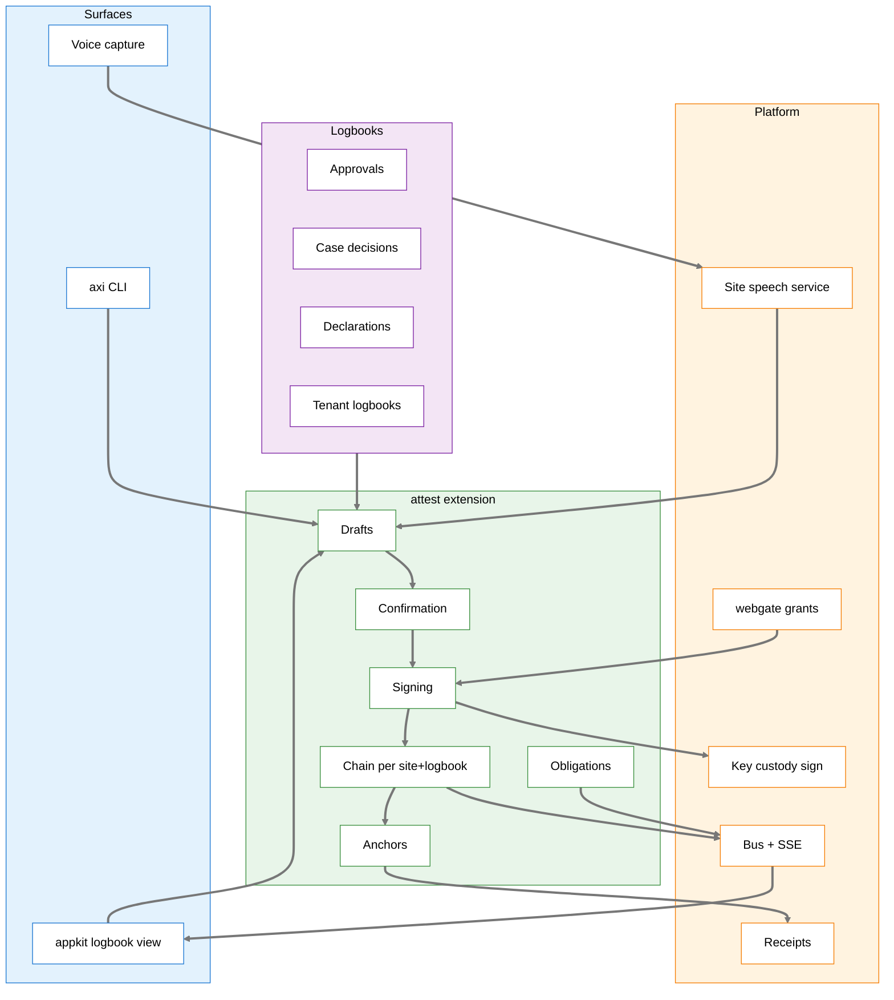

# Spec: Attestation

**Owner:** Axiom platform • **Status:** Phase A built; Phase B in progress (confirmation core built); Phases C–F designed • **Last updated:** 2026-09-30
**PRD:** [prd-attestation.md](../prds/prd-attestation.md) • **Key ADRs:** [142](../adrs/adr-142-attestation-is-the-record-of-accountable-human-acts.md), [143](../adrs/adr-143-attestations-are-signed-into-a-verifiable-chain.md), [144](../adrs/adr-144-a-person-confirms-exactly-what-is-recorded.md), [145](../adrs/adr-145-voice-stays-on-site-and-a-spoken-answer-signs.md), [146](../adrs/adr-146-signing-from-the-browser.md), [147](../adrs/adr-147-surfaces-receive-live-updates-over-sse.md), [150](../adrs/adr-150-an-attestation-record-is-kept-in-a-logbook.md) (logbook, not book); builds on [052](../adrs/adr-052-database-tenancy-schema-per-extension.md) (schema per extension), [114](../adrs/adr-114-mcp-authority-enforcement.md), [123](../adrs/adr-123-receipts-surface-architecture.md), [126](../adrs/adr-126-typed-decision-receipts.md), [135](../adrs/adr-135-graduated-autonomy.md)

## Overview

`attest` is a builtin Axiom extension. It owns the schema for attestations,
drafts, confirmations, obligations and anchors. It exposes:

- the Python SDK `axiom.attest`;
- the HTTP API `/api/v1/attest`;
- the CLI noun `axi attest`;
- read-only and draft-only MCP tools;
- an SSE stream per logbook.

Extensions declare **logbooks**. The platform ships three platform logbooks
(approvals, case decisions, data declarations). Tenant extensions add their
own; a consumer's operations log is the first.



## Contracts

### Attestation record

| Field | Type | Notes |
|---|---|---|
| `site_id` | text | From the credential; chain partition |
| `logbook` | text | Logbook id, e.g. `operations_log`. One bus token, `[a-z0-9_]+`, unique per node; the owning extension is recorded in the logbook registry |
| `seq` | bigint | Gapless per (site, logbook) |
| `attestation_id` | uuid | Stable public id |
| `uri` | text | `axiom://attest/sha256:<digest>` (receipt URI form) |
| `display_id` | text | Logbook-formatted, e.g. `1207-017` |
| `kind` | text | `statement`, `supplement`, `retraction`, `reclassification`, `cosign`, `ack`, `seal`, `import` |
| `meaning` | text | Closed vocabulary (below) |
| `entry_type` | text null | Logbook-declared type (for `statement` / `import`) |
| `logbook_version` | text | Logbook declaration version used to validate |
| `interval` | jsonb null | `{kind: "run", id: "1207"}`, `{kind: "shift", id: …}`, `{kind: "work_order", id: …}` |
| `subjects` | jsonb | `[{kind, ref}]`: `action`, `receipt`, `case`, `declaration`, `sample`, `equipment`, `agent`, … |
| `target` | uuid null | The attestation a supplement, retraction, reclassification, cosign or ack refers to |
| `content` | jsonb | `{title, body, fields}`; fields typed by the logbook; measured quantities in the `axiom.uncertainty` wire form (value as a decimal string, unit, and sources, or an explicit `Unquantified`) |
| `evidence` | jsonb | Presented forms and responses (see Confirmation), pre-fill provenance, attachments by checksum |
| `signer` | jsonb | `{principal, display, kind: "human", authority: {roles, qualifications, grants}}`, snapshotted at signing |
| `assurance` | jsonb | `{posture: "sso" \| "attested", idp, auth_time, amr (includes \"voice\" when speaker verification supplied freshness), voice_score?, fresh_within_met, grant_id, console_id}`: the signer's `PrincipalContext` posture at signing (`axiom.infra.principal`), never `open` or `service` |
| `source` | text | `screen`, `voice`, `cli`, `outbox`, `paper`, `ocr_assisted`, `import`, `notification` |
| `origin` | text | Who proposed it: `human`, `agent:<id>`, `integration:<ext>`, `speech`, `rule` |
| `occurred_at` | timestamptz | Signer-stated; ≤ `recorded_at` |
| `recorded_at` | timestamptz | Node clock at chaining |
| `client_submission_id` | uuid | Idempotency |
| `prev_digest` | text | Previous record's digest in this chain; genesis sentinel for `seq = 1` |
| `digest` | text | `sha256(canonical(record without signatures))` |
| `node_sig` | jsonb | `{key_id, alg: "ed25519", sig}` |
| `personal_sig` | jsonb null | `{key_id, alg, sig}` when the logbook requires `personal_key` (the `attested` posture's key or a passkey) |

**Meanings:** `authored`, `observed`, `performed`, `verified`, `approved`,
`rejected`, `decided`, `corrected`, `retracted`, `reclassified`,
`acknowledged`, `relieved`, `delegated`, `revoked`, `sealed`. A logbook
restricts which meanings each entry type may carry. Adding a meaning to the
vocabulary is a platform change with its own ADR.

### Canonical form

- JSON, UTF-8, keys sorted lexicographically by code point, no insignificant
  whitespace.
- Timestamps: RFC 3339 UTC, exactly six fractional digits, `Z`.
- Quantities: decimal strings as entered (`"950"`, `"31.20"`). No floats
  anywhere in signed content; the canonicaliser refuses a float.
- `null` members are included explicitly. Absent optional members are
  omitted.
- Strings are NFC-normalised before signing.
- The digest covers every field except `digest`, `node_sig` and
  `personal_sig`.

The reference implementation is `axiom.attest.canonical`. The evidence-package
`verify.py` re-implements it independently, and the two are tested against a
shared vector file.

### Node signature

The node does not sign the digest bare. It signs the ASCII prefix
`axiom/attest/v1\n` followed by the 32 raw digest bytes (not the hex text).
The prefix separates attestation signatures from anything else the node
identity key signs, so a signature taken from another protocol can never be
replayed as a record signature. A future change to the canonical form or the
signed message takes a new prefix (`v2`), and verifiers select the rule by it.

`verify.py` (`axiom.attest.tools.verify`) imports only the Python standard
library. It carries its own Ed25519 verifier (the verification half of the
RFC 8032 §6 reference code), so a recipient can check a package with a bare
interpreter and the node's public keys. It is slow and not constant-time,
which is acceptable for verifying public data; it never signs.

```text
python verify.py records.jsonl --keys keys.json [--start-seq N --start-prev HEX]
```

It stops at the first broken record and names the reason: `seq_gap`,
`prev_mismatch`, `digest_mismatch`, `unknown_key`, `bad_signature` or
`malformed`. `--start-seq` and `--start-prev` begin the walk from an anchor,
so a package can cover a range rather than the whole chain.

### Logbook declaration

An extension declares a logbook in its manifest and ships a logbook file:

```toml
# axiom-extension.toml (excerpt)
[[extension.provides]]
kind = "logbook"
id = "operations_log"
file = "logbook/operations_log.toml"
display = "Operations Log"
```

The node loads every logbook declared by an extension in its extension
directories (`axiom.extensions.discovery.get_extension_dirs`): project, user,
installed packages, then Axiom's builtins — the same list every other
extension kind is found in. An extension in an earlier directory overrides one
of the same name in a later one, so an override is not a second declaration;
two different extensions declaring one id refuse at load.

```toml
# logbook/operations_log.toml (excerpt)
[logbook]
id = "operations_log"
version = "1"
display = "Operations Log"
retention = { live_days = 730, archive = "site" }
assurance = { posture = "sso" }            # default for every type

[interval.run]
opens = ["STARTUP"]
closes = ["SHUTDOWN", "UNPLANNED_SHUTDOWN"]
number = { format = "integer", seed_from_site = true }

[[type]]
id = "ROUND_CHECK"
meanings = ["performed"]
requires_interval = "run"
roles = ["operator", "senior_operator"]
fields = [
  { id = "readings", type = "readings", from_site = "instruments", observe = true },
  { id = "walkdown", type = "attest_checkbox", label = "Physical walkdown performed", required = true },
]
confirm = { modalities_any = ["screen", "voice"] }
voice = { phrases = ["round check", "thirty minute check"] }

[[type]]
id = "STARTUP_CHECKLIST"
meanings = ["performed"]
roles = ["operator", "senior_operator"]
cosign = { roles = ["senior_operator"], assurance = { posture = "sso", fresh_within = "5m" } }

[[obligation]]
id = "round_check_cadence"
type = "ROUND_CHECK"
every = { site_key = "checks.interval_minutes", default = 30 }
warn_before = { site_key = "checks.warn_lead_minutes", default = 5 }
while = "interval.run.open"
notify = ["operator", "senior_operator", "site_manager"]
required = true                    # a miss raises an alarm; false raises a notice only

[[crosscheck]]
field = "readings"
source = "predicate:instrument_value"   # registered by the extension
tolerance_from_site = "instruments.tolerance"

[seal]
by_roles = ["senior_operator"]
assurance = { posture = "sso", fresh_within = "5m" }
boundary = "shift"

[[export]]
id = "daily_log"
template = "templates/daily_log.html"
site_overrides = ["header", "filename"]
```

**Chain partition.** `[logbook] partition = "site"` (the default) keeps one
chain per (site, logbook). A logbook may declare another entity kind, e.g.
`partition = "field"`: each partition value then has its own gapless chain
and its own `seq`, and the daily anchor's Merkle root covers every partition
head. The partition value is part of every record's canonical content.

**Intervals (built).** A logbook's `[interval.<kind>]` names the entry types
that open and close it.
- **Signing:**
  - An opener starts the next numbered interval, and a closer ends the open
    one.
  - `requires_interval = "<kind>"` signs only while that interval is open.
    `"none_open"` signs only while none of the logbook's intervals is.
  - Each record signed under these rules carries `interval = {kind, number}`
    in signed content, plus `event = opened|closed` on the opening and
    closing records.
- **Storage.** `attest_intervals` (migration `0006`) is a projection written
  in the signing transaction. A partial unique index allows one open
  interval per (site, logbook, kind).
- **Numbering** continues from the highest number used. The first interval
  starts from a seed the extension owning the site's configuration
  registers (`intervals.register_seed`), otherwise 1.

**Obligations and the missed-entry alarm (built).**
- **Declaration.** `[[obligation]]` names an entry type, `every` and
  `warn_before` (`{site_key?, default}` in minutes), `while =
  "interval.<kind>.open"`, the `notify` roles, and `required`, which makes a
  miss an alarm; otherwise it is a notice. Site values come through
  `attest.site_settings`.
- **Evaluation.** In an open interval, the next entry is due at the last
  signed entry of that type in the interval (or the interval's opening) plus
  `every`. The state is `ok`, `warn` inside the lead window, or `missed` past
  due. `GET /{logbook}/obligations` and `axi attest obligations` report it.
- **Tick.** `attest.obligations_tick` runs every minute from the schedule.
  - It records each change once in the append-only
    `attest_obligation_events` table (migration `0007`).
  - It publishes `attest.<logbook>.obligation_warn|missed|met`, which the live
    stream forwards as `obligation` events. These carry no id, so they never
    move the resume point.
  - It notifies everyone holding a `notify` role at the site, through
    `SendContext.default()`.
  - When the overdue entry is finally signed, it records `met`. A miss is
    never erased.

**Instruments from the site (built).**
- A `readings` field may declare `from_site = "<source>"`. The extension that
  owns the site's configuration registers that source with
  `attest.field_sources.register(name, fn(site_id) -> [Instrument])`;
  attest never reads site configuration itself.
- Each reading is entered as `"950"` or `{"value": "950", "unit": "kW"}` and
  stored as `{value, unit, uncertainty}`:
  - `value` is the decimal string exactly as read, never a float;
  - `unit` is the instrument's unit. A different unit is refused, not
    converted;
  - `uncertainty` is the instrument's declared uncertainty, or
    `{"kind": "unquantified"}`, never zero.
- An unknown instrument, a non-decimal value or an unregistered source is
  refused.
- A required readings field cannot be presented until every instrument has
  been read.
- `GET /logbooks/{logbook}` returns each field's resolved `instruments` for the
  session's site, so a form renders one observed input per instrument.

**Field sources.** A field is either observed by the person (`observe = true`)
or **machine-sourced**: `source = "equipment" | "lab" | "import"`. A
machine-sourced value is attached by checksum with its provenance, may be
cross-checked against what the person entered, and is never presented as the
person's observation. The presenter labels it by source.

**Device policy per meaning.** `[[type]] devices = { sign = ["personal",
"tablet", "kiosk"] }` declares which device classes (ADR-146) may sign that
type; the default is every class except `phone`. The signing check refuses a
grant from a device class the type does not allow.

**Presence per type.** `[[type]] presence = "<location id>"` requires the
signing device to be physically at a declared location. Devices are enrolled
with a `location` and a `mobility` (`fixed` | `portable`). A fixed device
proves presence by its enrolment. A portable device proves it per signature
with one of the location's declared proofs:
- a **rotating location code**, derived by the node from a per-location
  secret and a short window, shown on the location's fixed display, and
  scanned or spoken by the signer;
- a proximity beacon;
- a network segment, where the site has one.

The grant binds device id, location and the proof used. The signing check refuses a grant whose device cannot prove the
location (`presence_required`). A phone never satisfies presence unless a site
declares a proximity proof for phones.

**Field flags.**
- `observe = true` means the person must observe and enter the value
  (ADR-144). The API refuses a draft, presentation or surface payload that
  offers a value for it from any source other than the person. A validation
  test renders every registered presenter with a machine-supplied value and
  asserts that value never appears.
- `required` on an obligation sets severity. `true` means a miss is
  `severity = alarm`; `false` means `severity = notice`. Surfaces render
  `AlarmBand` or a notice from that severity.

**Cross-check hook (post-sign).** For each `[[crosscheck]]`, after a record
is signed, attest calls the extension's registered source for the field's
value at the record's `occurred_at`. It stores a linked system fact:
- `{attestation_id, field, source_value, tolerance, result: agrees | disagrees | not_checked, reason}`.

A source that is stale, faulted or unitless yields `not_checked`, never
`agrees`. A `disagrees` result publishes `attest.<logbook>.crosscheck_disagrees`
and is a brief oversight item. The signed record is never touched.

A logbook file is validated at extension load and by `axi attest logbook validate`.
Validation sorts every key into one of three kinds:

- **Enforced now:** the key is checked and acted on.
- **Declared for a later phase:** for example `cosign`, `requires_interval`,
  `voice`, `[[obligation]]`, `[seal]`, `[[export]]`, a field's `from_site` or
  `source`, and `assurance.personal_key`. These are accepted, so a logbook can be
  written once, and listed in `not_yet_enforced`. `logbook validate`, `logbook list`
  and `GET /logbooks` show that list.
- **Field units and choices** are enforced now. A `quantity` field must name
  its `unit`, and a value without its unit is not a fact. A `choice` field
  lists its `choices`, each once. `unit` on a field that is neither a
  quantity nor a number is refused, and so are `choices` on a field that is
  not a choice.
- **Unknown:** the logbook is refused. A typo such as `rolse` fails; it never
  quietly drops the rule it meant.
Sites override only keys the logbook lists as overridable. Overrides live in the
site's configuration, per the site-configuration convention.

### Platform logbooks

| Logbook | Replaces | Types / meanings |
|---|---|---|
| `approvals` | `Action.decided_by` / `decided_at` as the record of who approved | `ACTION_DECISION`: `approved` / `rejected`; subject `action` |
| `cases` | The human decider inside `CaseVerdict` | `CASE_DECISION`: `decided`; subject `case`; the verdict references the attestation |
| `declarations` | Steward declarations (ADR-042 / ADR-115) | `DECLARATION`: `corrected` / `retracted` / `reclassified`; subject `dataset` / `channel` / `fragment` |
| `autonomy` | Seat promotions and demotions (ADR-135) | `AUTONOMY_CHANGE`: `delegated` / `revoked`; subject `agent` / `seat` |
| `outcomes` | Human observation of outcomes for calibration | `OUTCOME`: `observed`; subject `receipt` / `case` |

### SDK (`axiom.attest`)

```python
from axiom.attest import drafts, confirm, sign, query, verify

d = drafts.create(logbook="operations_log", entry_type="ROUND_CHECK",
                  content={...}, origin="integration:ops_log", for_principal=p)
presentation = confirm.present(d.id, modalities=["screen"])   # digest + rendered forms
record = sign.sign(presentation_id=presentation.id, grant=grant)  # refuses non-human, wrong digest
sign.supplement(target=record.attestation_id, reason="correction", content={...}, grant=g2)
sign.cosign(target=record.attestation_id, grant=g3)
query.records(logbook=..., interval=("run", "1207"), meanings=[...], text="...")
verify.chain(site, logbook, from_seq=None, to_seq=None)    # -> VerifyReport
```

Domain extensions never write the tables directly. The SDK runs in the caller's
process and uses `session_for("attest")`.

### HTTP API (`/api/v1/attest`)

| Method | Path | Purpose |
|---|---|---|
| GET | `/logbooks`, `/logbooks/{logbook}` | Declarations as effective for this site |
| GET/PUT/DELETE | `/drafts[/{id}]` | Draft CRUD; PUT is auto-save |
| POST | `/drafts/{id}/present` | Create a presentation: returns digest, rendered forms, speakable text |
| POST | `/presentations/{id}/respond` | `sign` / `hold` / `ask` (R21 anatomy; `ask` carries a correction or question and yields a new presentation); records the response evidence |
| POST | `/sign` | `{presentation_id, grant}` → signed record |
| POST | `/{logbook}/records/{id}/supplement` \| `/retract` \| `/reclassify` \| `/cosign` \| `/ack` | Each goes through present → respond → sign |
| POST | `/{logbook}/seal` | Seal an interval or boundary |
| GET | `/{logbook}/records`, `/{logbook}/records/{id}` | Query; record with thread and proof |
| GET | `/{logbook}/obligations`, `/{logbook}/misses` | Obligation state and missed facts |
| GET | `/{logbook}/stream` | SSE (ADR-147) |
| POST | `/{logbook}/exports`, GET `/exports/{id}` | Evidence packages |
| POST | `/{logbook}/verify` | Verification report |
| GET | `/{logbook}/crosschecks` | Cross-check results, filterable to disagreements |
| GET | `/{logbook}/reviews/coverage` | Reviewer (e.g. regulator) review coverage per period, last-review date, and records never reviewed |
| POST | `/{logbook}/reviews/prompt` | Notify the standing reviewers that a review is due |

Grants come from webgate (`POST /gate/grants`), per ADR-146.

### Confirmation contracts

**Presenter** (registered per subject kind or per logbook entry type):

```python
class Presenter(Protocol):
    id: str; version: str
    def render(self, content: Canonical, density: Literal["strip","line","card","page"]) -> str: ...
    def speakable(self, content: Canonical) -> SpeechText: ...   # SSML-lite: <digits>, <unit>, <spell>
    def correctable_fields(self, content: Canonical) -> list[FieldRef]: ...
```

**Modality** plugins: `screen`, `voice`, `notification` (wraps the existing
interactive channels), `kiosk`, `cli`. Each implements `offer(presentation)`
and delivers a `Response {answer, via, transcript?, audio_sha256?,
latency_ms, principal, console_id}`.

**Policy** per logbook entry type and meaning:

| Field | Meaning |
|---|---|
| `modalities_any` / `modalities_all` | Which modalities may / must present |
| `voice_confirm_allowed` | Whether a spoken "confirm" may complete it |
| `timeout` | After which the presentation expires (never confirms) |
| `read_back` | `always`, `on_voice_origin`, `never` |

The response grammar is the platform's single decision anatomy (R21):
**Primary** `sign` · **Hold** `hold` (keep as an unsigned draft) · **Ask** `ask`
(correct or question, scoped to this presentation). There is no fourth
answer; discarding a draft happens in the draft tray. Keyboard: `a`, `h`, `?`.
Spoken synonyms are configured per site, e.g. "confirm" or "affirm" → sign,
"hold" → hold, "correct …" → ask with the spoken correction.

**Evidence stored on the attestation:**

```json
{
  "presented": [
    {"modality": "voice", "presenter": "example.round_check@3", "digest": "…",
     "text": "Round check, run 1 2 0 7. Pressure 4 point 2 bar. …",
     "at": "…"},
    {"modality": "screen", "presenter": "example.round_check@3", "digest": "…",
     "text": "…", "at": "…"}
  ],
  "response": {"answer": "sign", "via": "voice", "transcript": "confirm",
               "audio_sha256": "…", "latency_ms": 1840}
}
```

### Voice contracts

- **Console side (appkit `VoiceCapture`):**
  - wake detector (WebAssembly/ONNX) for the agent's name (the wake word) and
    the site's end phrase;
  - push-to-talk;
  - recorder;
  - states: `idle`, `listening-for-wake`, `oriented` (the agent asked "How
    can I help?" or proposed a verb), `recording`, `transcribing`,
    `reading-back`, `awaiting-answer`.
  Only `recording` and `awaiting-answer` capture audio for transmission, and
  only to the node. The Web Speech recognition layer is disabled.
- **Node side (speech service, a node-profile service):** built on one
  `axiom.speech` module that owns local transcription and synthesis. The
  signals extension's voice-memo extractor, which today imports Whisper
  itself, moves onto the same module, so the platform has one speech stack.
  - `POST /api/v1/speech/transcribe` (audio → text + word timings +
    confidence);
  - `POST /api/v1/speech/synthesize` (speech text → audio);
  - `POST /api/v1/speech/verify` (audio + principal → verified, score), used
    by webgate to mint a signing grant from a spoken "confirm";
  - enrolment per person (`/api/v1/speech/enrol`), stored on site, revocable.
  Local models only.
- **Conversation grammar:** `<agent> <noun> [<verb>] [<kind>] [<content>]`.
  The noun and verb vocabulary is the CLI's; spoken aliases per consumer map
  words to nouns ("ops log" → `ops`). At each incomplete level the agent
  speaks the next question, generated from the vocabulary and the logbook: the
  name alone gets "How can I help?"; a logbook noun gets its default verb as a
  question ("New entry?"); `add` gets the logbook's entry kinds.
- **Logbook voice grammar:** phrase → entry type and field slots (e.g. "power
  {number} bar"). Grammar first; an on-site model is the fallback
  parser, with its output marked `origin = speech` and every slot shown for
  confirmation.
- **Configuration:**

```toml
[voice]
enabled = true
wake_word = "axi"          # the agent's name; a consumer sets its own
noun_aliases = { "operations log" = "operations_log" }
end_phrase = "end entry"
push_to_talk = ["F9"]
retain_audio = "inspection_window"
answer_synonyms = { sign = ["confirm", "affirm"], hold = ["hold", "not now"], ask = ["correct", "correction", "question"] }
```

### Events (bus subjects, via outbox)

Subjects follow the bus grammar (`[a-z0-9_]+` tokens; spec-event-bus §5).
Versioning per subject is not a bus feature, so every payload carries
`schema_version`.

`attest.<logbook>.signed`, `attest.<logbook>.supplemented`, `attest.<logbook>.retracted`,
`attest.<logbook>.cosigned`, `attest.<logbook>.sealed`, `attest.<logbook>.draft_created`
(for the signer's tray), `attest.<logbook>.obligation_due` (fired by the schedule
seam), `attest.<logbook>.obligation_missed`, `attest.<logbook>.obligation_met`,
`attest.presentation.offered` (for modality plugins).

## Design

### Signing

1. The presentation stores the canonical content and its digest.
2. `sign` checks:
   - the grant's principal, digest, logbook, meaning, console and expiry;
   - that the principal's posture is `sso` or `attested` (never `open` or
     `service`), and that it holds the logbook's role or qualification for the
     type and meaning (role bundles, OpenFGA site relations, site scope);
   - that the role the principal signs under is not a platform
     administration role. Node admin, developer and vault custodian are
     excluded from every logbook's signing roles, and holding one never
     widens what a person may sign (ADR-142 rule 8);
   - for fields declared `observe`, that the presentation's provenance shows
     the value came from the person (typed or spoken), not from a source;
   - the logbook's assurance for this meaning: posture floor, `fresh_within`,
     `personal_key`;
   - interval rules;
   - that a confirm response exists for this presentation.
3. In one transaction:
   - lock the chain head for (site, logbook);
   - assign `seq`, `recorded_at`, `prev_digest`;
   - compute `digest`;
   - obtain `node_sig` from key custody;
   - insert the record, update projections (interval state, obligations),
     and write outbox events.
4. If key custody is unavailable, signing fails closed. Drafts and
   presentations survive, and the surface says why.

### Obligations

Obligations are a consumer of the **schedule consumer seam**
(`spec-schedule-consumer-seam.md`); attest does not run its own clock.

1. When an obligation's `while` condition becomes true (e.g. an interval
   opens), attest calls `register_slot` for the first due window, with
   `metadata = {logbook, obligation, interval}`. It also calls
   `register_cadence` for a one-shot firing at the slot's end, with
   `on_fire = attest.<logbook>.obligation_due`.
2. A signed record that satisfies the obligation calls `record_actual` on the
   open slot and registers the next slot and firing from the record's
   `occurred_at`.
3. When `obligation_due` fires and `slot_status` shows no actual, attest
   writes a `miss` fact and publishes `attest.<logbook>.obligation_missed`.
   The next satisfying record publishes `obligation_met`, and the miss keeps
   its duration.
4. When the condition becomes false (the interval closes), the open slot is
   cancelled.

Planned-versus-actual therefore lives in PULSE, where scheduling analytics
already look. PULSE's idempotent single-node firing and misfire handling
give restart back-fill; a miss detected late records `detected_late_by`.

The logbook's `notify` list resolves through the notifications extension
(`notifications.alert`). Misses are also an oversight source (see Harness
integration). Conditions available to logbooks:

- `interval.<kind>.open`;
- a logbook-supplied predicate registered by the extension, e.g. "equipment
  running" from telemetry, which must report `unknown` rather than `false` when
  its data is stale.

**Event-triggered obligations.** Beside cadence obligations (`every` + `while`),
a logbook may declare `within = "7d"` + `after = "<event subject or predicate>"`:
an entry of the type is due within the window after the event, e.g. an
application record within seven days of a task being marked completed. attest
subscribes to the event, calls `register_slot` for the window on each
occurrence, and closes the slot with `record_actual` when a satisfying record
names the triggering event. Both kinds use the same seam, miss facts and
severity.

### Continuous review (the inverted audit)

A logbook may declare a **reviewer** role with standing, policy-time-boxed read
access, for example an external inspector. Reviews happen continuously
instead of in a pre-inspection scramble:

- **A review is an attestation.** It is signed in the site's reviews logbook
  with meaning `verified`. Its subjects are the range of records examined
  (logbook, from/to `seq` or time), and it carries findings.
- **Coverage is visible.** `reviews/coverage` computes, per period, which
  ranges have a signed review, when the last review was, and what has never
  been reviewed. The site sees it, so the site can drive the audit ("no
  review in three months") rather than wait for it.
- **Nothing is assembled.** A reviewer exports evidence packages at any time,
  and access and exports are audited.

### Harness integration

- **Approval gate.**
  - `approval.approve` / `reject` present the held action, obtain a
    confirm, and sign in `approvals`.
  - The gate transitions on the signed event (idempotent on attestation id).
  - `decided_by` becomes the attestation id.
  - Automatic approvals record `decider = rule:<id>` and create no
    attestation. The machine default `@gate:auto` is removed.
  - The CLI-only restriction on approve/reject stays. The web path is a
    signing grant, and there is still no agent path.
- **Case verdicts.** A human `CaseVerdict` carries `attestation_id`. Verdicts
  by models or rules are unchanged.
- **Declarations.** The declaring half of the steward thread signs in
  `declarations`. The executor re-derives from signed declarations only.
- **Agent links.** The action ledger gains `authorised_by` (attestation id).
  Attestations with subject `action` link back. Steer shows both.
- **Autonomy.** Seat promotion ("Approved 5/5, no reversals — switch to
  Auto?") signs `delegated`; demotion signs `revoked`. The seat reads its
  ceiling from the latest signed record.
- **Calibration.** `observed` attestations on receipts or cases are a witness
  source for `stamp_outcomes()`, tagged as human-observed.
- **The oversight brief.** attest registers one source per logbook with
  `receipts.sources.register_source(name="attest_<logbook>", covers=…)`. The
  brief sees three kinds of item from it, each rendered in the R21
  anatomy with a proposal:
  - an open miss;
  - a pending co-signature older than the logbook's window;
  - an integrity finding.
  A missed check therefore shows up on Today as a case, and is not a
  separate alert stream.
- **Integrity on the heartbeat.** `check_attestation_chains` is a hygiene
  `node_health` finding in `audit_node()`. It verifies each logbook's chain
  incrementally since the last verified sequence, checks the latest anchor,
  and reports a break as WARNING with the first broken `seq`. Full-chain
  verification runs from a PULSE schedule and on demand.
- **Decide surfaces.** Steer's decide flow and the docket render approvals
  and case decisions through the same confirm card. Signing from them is the
  attestation path, with no parallel confirm dialog.

### Anchors

Daily at 00:00 site time (a manifest-declared `[[extension.schedule]]`
entry), and at every seal, the node computes a Merkle root over every logbook
head at the site. It signs the root with the node identity key, stores it in
`anchors`, and registers it as a receipt. PDF and printed exports carry the
root and the heads of the logbooks they cover.

The tree is fixed so an independent verifier can rebuild it (`axiom.attest.anchor`):

- Each head is `{logbook, seq, digest}`. Heads are sorted by logbook, and a logbook
  appears once.
- A leaf is `sha256(0x00 ‖ canonical(head))`. An inner node is
  `sha256(0x01 ‖ left ‖ right)`, as in RFC 6962. An odd node is promoted
  unchanged, never paired with itself.
- The node signs `axiom/attest/anchor/v1\n` followed by the 32 root bytes. The
  prefix differs from the record prefix, so neither signature can stand in
  for the other.

An anchor catches what the chain cannot. Someone holding the node key can
rewrite a record and re-sign every record after it, and that chain verifies.
It no longer matches an anchor taken before the rewrite, and verification
names the logbook (`head_rewritten:<logbook>`).

### Exports, storage and analytics

- **Evidence packages** are written to `axiom.infra.storage` (local or
  S3-compatible) and registered as receipts.
- **PDFs** render through the publishing extension's PDF providers
  (`pandoc_pdf`, `latex_pdf`) from the logbook's template.
- **Archives** follow the node's backup policy; restore validation
  (`backup_validate`) includes a chain verification of each logbook.
- **Analytics:** records reach bronze through the data platform's CDC path,
  as other extensions' event logs do. Logbooks project to gold for dashboards,
  annotations and history questions; surfaces receive gold and never
  transform it.

### Offline consoles

Surfaces may queue **drafts and confirmed presentations** in an IndexedDB
outbox when the node is unreachable. They never queue signatures, because a
grant needs the node. On reconnect the surface re-presents each item if the
presentation has expired, obtains a grant and signs. The record's `source` is
`outbox`, and both times are shown.

### Adapting a logbook for a consumer

A consumer extends the log by declaration. The extension points, in the order
a logbook designer meets them:

| Extension point | Declared in | Example (an agronomy consumer's field log) |
|---|---|---|
| Agent name / wake word | Consumer config | the consumer's agent name, e.g. "<agent>, field log …" |
| Accent and evidence word | Tenant tokens | its brand accent; evidence word "proof" |
| Chain partition | `[logbook] partition` | one chain per field |
| Intervals | `[interval.*]` | crop year, opened by planting, closed by harvest |
| Observed vs machine-sourced fields | `observe`, `source` | rate and product observed; as-applied map from equipment |
| Obligations | `[[obligation]]` | application record within 7 days of task completion |
| Signers and assurance | `roles`, `assurance`, `cosign`, `devices` | grower, applicator, advisor, lab |
| Outside readers | share scopes, reviews | landlord, lender, certifier |
| Exports | `[[export]]` | a certifier packet |
| Surfaces | consumer app | a tab in a map-first panel |
| Migration | import | a pre-existing chain imported as `import` records |

**Migrating a pre-existing chain.** Each old entry becomes an `import` record
with its original times, `signer.kind = "unverified"` and the old content hash
kept in `source_ref`. The old chain is verified once during import and the
result recorded, so its integrity claim is carried over honestly without
being re-signed.

### Migration

1. Existing approvals, verdicts and declarations are imported as `import`
   records in their platform logbooks, with `signer.kind = "unverified"`, never
   `human`.
2. From cut-over, new acts sign normally.
3. `TamperEvidentChain` keeps serving the audit chains. Its docstring's Ops
   Log consumer and `AXIOM_OPS_LOG_HMAC_KEY` are removed.

### Surfaces (appkit)

| Component | Use |
|---|---|
| `LogbookView` | Stream + facets for any logbook, extracted from Steer's `stream` / `RunRow` / `FacetBar` so Steer and logbooks share one feed |
| `EntryForm` | Schema-driven fields from the logbook file; units; pre-fill chips with provenance and age |
| `ConfirmCard` | The presentation at R20 card density on the existing decision card (Steer / docket); Sign · Hold · Ask; shows the digest short form |
| `VoiceCapture` | Wake detector + push-to-talk + indicators + read-back player, composed on `useDictation` with its Web Speech layer disabled and `transcribe` injected to the site speech service |
| `RecordThread` | Original + supplements / retractions / cosigns / acks in order |
| `ProofBadge` | Chain status in the platform's `StatusPill` states and glyphs (✓ verified, ✕ broken, ? unverified), with the anchor it matched |
| `ObligationCountdown` | Server-offset countdown with warn and due states and audio |
| `AlarmBand` | The missed/warning state of an obligation, readable across a room: full-width band, hazard pattern, word + glyph, oversized counter and action, slow pulse (off under reduced motion), visible per-console mute |
| `LiveIndicator` + `useLiveStream` | ADR-147 |
| `SealSheet` | Interval or shift summary, open items, seal with grant |
| Print styles | Logbook export templates rendered for print |

### As built: Phase A

| Piece | Where | Notes |
|---|---|---|
| Canonical form, chain, anchors | `axiom.attest` (`canonical`, `chain`, `anchor`) | `normalise()` puts a record in its JSON-native form before sealing, so it round-trips through JSONB with its digest unchanged |
| Standalone verifier | `axiom.attest.tools.verify` | Standard library only; checks records. Checking anchors in it is not built yet |
| Node signing | `axiom.vega.identity.node_key.node_signer` | One custody operation over the node identity key. It fails closed and never generates a key. The key is loaded in process for now; callers depend only on `Signer` |
| Store | `attest` extension, migration `0001` | `attest_records`, `attest_presentations` and `attest_anchors` are append-only through row and TRUNCATE triggers. The downgrade refuses, because it would delete signed records |
| Logbooks | `attest/logbooks.py`, `attest/registry.py` | `[logbook]` and `[[type]]` are validated at load: bus-token id, closed meanings, signing roles, no administration roles, posture floor `attested` or `sso`, field types. Intervals, obligations, cross-checks, seals and exports are parsed later |
| Draft → present → sign | `attest/service.py` | Software drafts but cannot supply an `observe` field. Only the person a draft is for may fill or sign it. A presentation freezes the statement's digest, and `sign` refuses if the draft changed since. `hold` and `ask` record nothing. Signing takes a row lock on the chain head, so concurrent signers get a gapless sequence |
| Roles | `attest/roles.py`, `axi attest role grant·revoke·list` | **Interim.** Roles live in `<state_dir>/attest/roles.toml` until the authorization seam carries site relations (ADR-146). Grants and revokes go through the CLI. Every change is appended to `role_changes.jsonl` with who made it and when. A handle must be `@name:context`, a role must be an id, and administration roles are refused (signing would discard them anyway) |
| CLI | `axi attest logbook list·validate`, `new`, `sign`, `show`, `verify`, `anchor`, `export` | `new` and `sign` read the answer at a terminal. With no terminal, nothing is drafted or signed. `verify` also checks the newest anchor that covers the logbook |
| MCP | Skills with `surfaces` including `mcp` | `logbook_list`, `show` and `verify` are read-only. `new`, `sign`, `anchor` and `export` are CLI only |
| Daily anchor | `[[extension.schedule]] attest_daily_anchor` | Runs at UTC midnight until sites declare a time zone. The AEOS manifest schema now admits `[[extension.schedule]]` per spec-axiom-schedule §6.1 |

### As built: Phase B

**B1, the confirmation core (built):**

- **Confirm policy.** Each `[[type]]` may declare `confirm = { modalities_any,
  modalities_all, voice_confirm_allowed, timeout, read_back }`, validated at
  load. The defaults are conservative: screen, CLI and kiosk only;
  `voice_confirm_allowed = false`; a 15-minute timeout; read-back on voice
  origin.
- **Presenters** (`attest/presenters.py`).
  - A default presenter is built from each type's fields. It renders the four
    densities and speakable text with `<digits>` markup, and lists the
    correctable fields.
  - Content is escaped, so a value cannot inject speech markup.
  - An extension may register its own presenter per type.
- **Presentations** store the presenter as `id@version`, every density, the
  speakable text and an expiry (migration `0002`).
- **Responses.** `respond()` records every answer, `sign`, `hold` or `ask`, in
  the append-only `attest_responses`, with via, transcript, audio digest,
  latency and console.
  - An `ask` carrying a correction applies it as the person's entry and
    returns a new presentation. The old presentation can then no longer be
    answered or signed.
  - A spoken `sign` is refused unless the type allows voice confirmation.
  - An expired presentation cannot be answered.
- **Signing** requires the signer's latest answer to that presentation to be
  `sign`. Every `modalities_all` modality must have presented the same
  digest. The record's `evidence` carries `presented[]` (modality, presenter,
  text, time) and the `response`. `attest_records.response_id` is unique, so
  one answer signs once.

**B2a, signing grants (built):**

- **Types declare** `assurance.fresh_within` (inherited from `[logbook]`),
  `devices = { sign = [...] }` (default: personal, kiosk and tablet, never a
  phone) and `presence = "<location>"`.
- **`grants.mint()`** issues a token for one answered presentation. The token
  is canonical JSON plus the node's signature under
  `axiom/attest/grant/v1\n`, base64url.
  - It binds the digest, person, posture, IdP, `auth_time`, `amr`, device,
    console and location, and lives at most 60 s.
  - It refuses a principal the draft is not for, a posture below the type's
    floor, a sign-in older than `fresh_within` or of unknown age
    (`reauth_required`), and a device class the type does not allow.
- **`sign(..., grant=)`** verifies the token and checks it matches the
  presentation, digest, person, logbook and meaning. It records the use in the
  append-only `attest_grant_uses` table (migration `0003`), where the primary
  key makes a second use fail.
  - The record's `assurance` carries the grant's authentication and device
    facts.
  - A type that needs `fresh_within` or presence, or does not accept a
    personal device, cannot be signed without a grant.

**B2b, devices and presence (built):**

- **Enrolment.** `attest_devices` (migration `0004`) enrols a device per site
  with a class, a location and `fixed` or `portable`, via `axi attest device
  enroll|retire|list`.
  - A grant takes the class and location from enrolment, never from the
    caller.
  - An unenrolled device is a personal session with no location.
  - Enrolling is administration and confers no logbook authority.
- **Location code.** A location's secret lives in the vault
  (`attest.location.<site>.<location>`, created by `axi attest location init`,
  never overwritten). Its fixed display shows a six-digit code, the RFC 4226
  truncation of HMAC-SHA256 over `location:window`, with a 30 s window
  (`axi attest location code`). The current and previous windows are
  accepted. A location with no secret cannot be proven by code.
- **Presence at mint.** A type with `presence` needs a device enrolled at that
  location. A fixed device proves it by enrolment; a portable device proves
  it with the current code. The grant and the record carry
  `presence = {location, proof: enrolment | location_code}`.

**B2c, the gate (built):**

- **Sessions** carry `auth_time` and, when the sign-in route knows it, `amr`:
  `pwd` for the password form and JSON login, `email` for a magic link, and
  the IdP's own `amr` (else `oidc`) for OIDC.
  - An OIDC session takes the IdP's `auth_time`, so a silent SSO over an old
    IdP session does not look fresh.
- **Re-authentication.** `/gate/oidc/login?max_age=N` (0 to 3600) sends
  `prompt=login` and `max_age`. The callback refuses an ID token with no
  `auth_time`, or one older than `max_age` plus 60 s of skew.
- **Device claim.** `axi attest device enroll` returns a one-time claim code;
  only its hash is stored, and it lasts 15 minutes (`device reclaim` issues a
  new one).
  - `POST /gate/devices/claim {device_id, code}` spends the code and sets
    `axiom_device`: a node-signed token under `axiom/attest/device/v1\n`,
    HttpOnly, SameSite=Strict, path `/gate`.
  - Enrolment is checked on every grant, so a retired device's cookie stops
    counting.
  - The cookie is a bearer credential. Binding it to a key held by the device
    (WebAuthn) is Phase E.
- **`POST /gate/grants {presentation_id, console_id?, presence_code?}`** mints
  a grant from the gate session and the device cookie.
  - The person is named by `attest/naming.py`, the one rule the attest API
    also uses, so a grant is always for the person the draft is for: the
    session's `site` claim, else the one site the node serves
    (`AXIOM_SERVED_SITES`), else the node's own `AXIOM_SITE` — never one of
    several served sites. Without any, the handle has no context and no role
    can be granted to it.
  - A refusal is 403 with a `code`; `reauth_required` also carries `max_age`
    for the surface to send the person to re-authenticate.
  - No session is 401. An unreadable device cookie is ignored, and the browser
    is treated as a personal session.

**B3, the HTTP API and live stream (built):** `/api/v1/attest`, mounted as the
extension's `api` contribution.

- **Routes:**
  - `GET /logbooks` and `/logbooks/{logbook}`, with everything a surface needs to
    render a type: fields, confirm policy, devices, presence and freshness;
  - `POST /drafts`, `GET` and `PUT /drafts/{id}`, and
    `POST /drafts/{id}/present`;
  - `POST /presentations/{id}/respond`, where an `ask` with a `correction`
    returns `next_presentation`;
  - `POST /sign {presentation_id, grant}`;
  - `GET /{logbook}/records` and `/{logbook}/records/{id}`;
  - `POST /{logbook}/verify`;
  - `GET /{logbook}/stream`.
- **Every route needs a gate session.** The person is named by
  `attest/naming.py` (see the grant endpoint above), from the session that the
  same resolver receipts uses returns.
  - A person sees only their own drafts; anyone else's answer as 404.
  - Signing over HTTP requires a grant (400 `no_grant` without one).
  - The site is the session's site, narrowed by what the node serves. A
    different site is 403 and is never widened.
- **Events.** `service.sign` publishes `attest.<logbook>.signed`
  (`schema_version: 1`) on the process bus after its commit, from every
  signing path.
  - This is best effort: there is no transactional outbox yet, and the record
    is the truth.
- **Stream (ADR-147).** One SSE event per signed record, with `id` = `seq`.
  - With `Last-Event-ID`, the stream first replays every later record from
    the store, so a reconnect loses nothing.
  - A heartbeat comment is sent every 10 s.
  - `?once=1` ends the stream after the replay.
  - Live events come from the in-process bus, so a node running several
    worker processes delivers live only to clients on the signing process;
    the others catch up on reconnect. A cross-process transport is the event
    bus's Postgres transport (spec-event-bus §155).

**Still to build:** the appkit components (B4: confirm card, record thread,
proof badge, live indicator) and the first tenant logbook (B5).

Not yet built from Phase A's list: registering an anchor as a receipt, and
checking anchors in `verify.py`. The HTTP API, grants and browser signing are
Phase B.

### Testing

- Shared canonicalisation vectors, consumed by the SDK and `verify.py`.
- Chain tamper tests against real Postgres as superuser: update, delete, and
  reorder.
- A guard test at each migration head.
- Refusal tests:
  - non-human signer;
  - digest mismatch;
  - expired or reused grant;
  - assurance below the logbook's requirement;
  - no confirm response.
- Presenter speakable-text tests: digits, units, identifiers, and
  homophones such as "fifteen" and "fifty".
- The voice path end to end with recorded room noise. Assert no audio request
  leaves the node's origin.
- The obligation evaluator on an injected clock, including restart back-fill.
- Logbook validation tests on every shipped logbook and on a synthetic logbook using
  every feature.

## Decisions

ADR-142 (the primitive), ADR-143 (signed chain), ADR-144 (confirmation),
ADR-145 (voice), ADR-146 (browser signing), ADR-147 (SSE). This spec follows
ADR-052 (schema per extension), ADR-114 (no agent path to sign), ADR-123
(appkit), ADR-126 (typed decisions reference attestations), ADR-135 (autonomy
changes are signed).

## Open questions

| Question | Owner |
|---|---|
| Key custody out of process: the `sign` interface exists (`node_signer`), but the key still loads into the signing process | Identity / vault |
| IdP support for `max_age` / `prompt=login` at UT and partner sites | Identity |
| Wake-phrase engine choice under ≤ Apache-2.0 with our own trained phrase models; measured rates per room | Platform + first site |
| Speech models for the node: size vs CPU budget at console volumes; licence review of each voice | Platform |
| Whether sites may disable read-back for low-risk entry types, and the floor they may not go below | Logbook designers + site |
| Federation: can a logbook's chain be verified by a peer node, and does a fleet signer attest across sites (Phase F) | Federation |
