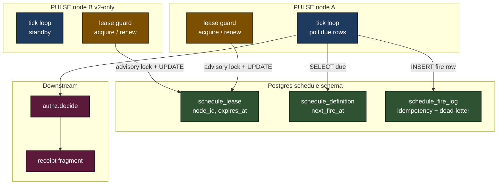
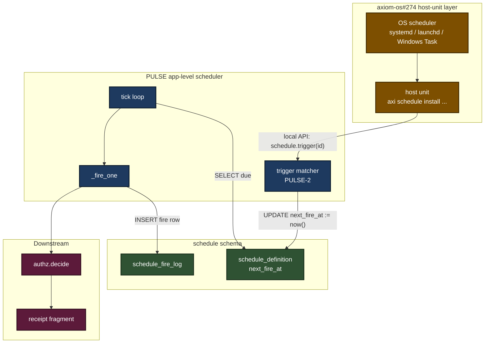

# Tech Spec: `axiom.schedule` (PULSE)

**Status:** Draft (2026-05-31)
**Implements:** [prd-axiom-schedule](../prds/prd-axiom-schedule.md), [ADR-055](../adrs/adr-055-unified-governance-fabric.md)
**Companion umbrella spec:** [`spec-governance-fabric.md`](spec-governance-fabric.md) §5.5 (schedule firing), §6 (idempotency, retries, dead-letter), §8.4 (schedule schema)
**Sibling layer:** axiom-os#274 (`axi schedule install` host-unit lifecycle)
**Audience:** Engineers building PULSE; extension authors declaring cadences; security reviewers tracking idempotency + capability flow.

This spec locks the open design decisions left dangling by the PRD. The umbrella spec already pins the action envelope (§1), capability tokens (§2), receipts (§4), idempotency framework (§6), and the `schedule` Postgres schema sketch (§8.4). This spec specifies *PULSE's internals* — the firing model, the storage layout under §8.4, the unified tick loop across cron + interval + trigger inputs, the capability-minting convention for peer-defined cadences, the idempotency window key, and how PULSE composes with the sibling host-unit layer (axiom-os#274).

PULSE-1 ships single-node firing of cron + interval cadences with idempotency + retry + dead-letter + manifest registration + CLI. Distributed firing, trigger-style schedules, and the federation handoff land in PULSE-2 / PULSE-3.

---

## 1. Firing model

### 1.1 Decision

**PULSE-1 fires from a single node, gated by a Postgres-row leader lease.**

A `schedule.schedule_lease` row holds the active leader's identity (`node_id`, `acquired_at`, `expires_at`). On startup the PULSE engine attempts to acquire the lease via a conditional `UPDATE ... WHERE expires_at < now() OR node_id = :me` inside a `pg_advisory_xact_lock` so the contention window is bounded. A lease is held for `lease_ttl_seconds` (default 30s) and renewed every `lease_ttl_seconds / 3`. The engine ticks only while it holds the lease.

This shape is deliberately the *same shape* as the distributed-mode firing model PULSE-2 will ship — distributed mode is the same lease row with on-failure handoff plus a periodic renewal loop. The v1 → v2 cutover is `firing.mode = "distributed"` in `axiom-extension.toml`, not a re-architecture.

### 1.2 v1 limitation, stated honestly

PULSE-1 is **not** exactly-once across multi-node deployments. With a single node the lease is uncontested and exactly-once reduces to "the tick loop fires each due row exactly once", which the idempotency window key (§5) makes deterministic even under tick replays. With two nodes, the lease prevents both from ticking simultaneously, but a node death within `lease_ttl_seconds` of a fire that hadn't yet written its receipt could lose track of whether the action ran. PULSE-1 documents this risk; PULSE-2 closes it with the lease-handoff + post-fire receipt-claim handshake.

The PRD's "100% exactly-once across multi-node deployments" success metric is **PULSE-2's bar.** PULSE-1 ships single-node firing only.

### 1.3 No consensus library

The lease row is the entire coordination primitive. No Raft. No etcd. No ZooKeeper. The contract is "Postgres is up" — the same contract every other governance-fabric primitive already depends on (ADR-052).

### 1.4 Mode diagram



---

## 2. Storage backend

### 2.1 Decision

**Postgres per ADR-052; schema `schedule`; three tables.** Redis rejected.

### 2.2 Why not Redis

- ADR-052 already picked Postgres as the install-wide OLTP. Adding Redis grows the install's ops surface (an extra process, an extra backup story, an extra failure mode) for no functional gain at PULSE-1's load.
- The lease + the idempotency log + the dead-letter trail all need durable transactional storage. Redis would need RDB / AOF tuning + a separate transactional story for the schedule definitions; Postgres gives transactional all-of-it for free.
- Tick rate at PULSE-1 is bounded by the slowest registered cadence in the system, not by hot-path throughput. The "Redis is faster" argument applies above ~10 fires/sec; self-hosted-node deployments do not approach that.

If a future cohort *does* exceed 10 fires/sec on the hot tick path, revisit with a `firing.backend` provider and a new ADR. PULSE-1 does not pay that complexity tax.

### 2.3 Tables

The three tables under §8.4 of the umbrella spec are expanded as:

```sql
-- A registered schedule. One row per call to register() or per
-- [[extension.schedule]] manifest entry.
CREATE TABLE schedule.schedule_definition (
    id                      TEXT      PRIMARY KEY,             -- uuidv7
    name                    TEXT      NOT NULL,
    description             TEXT      NOT NULL DEFAULT '',
    extension               TEXT,                              -- owning extension if manifest-declared
    action                  TEXT      NOT NULL,                -- dotted CallableRef
    cadence_kind            TEXT      NOT NULL,                -- one_shot | interval | cron | trigger
    cadence_payload         JSONB     NOT NULL,                -- interval_seconds | cron_expr | trigger_spec
    next_fire_at            TIMESTAMPTZ,                       -- NULL only for trigger schedules awaiting match
    not_before              TIMESTAMPTZ,
    not_after               TIMESTAMPTZ,
    randomized_delay_seconds INTEGER  NOT NULL DEFAULT 0,
    classification_ceiling  TEXT,                              -- max classification per envelope §1
    raci_default            TEXT      NOT NULL DEFAULT 'autonomous',
    retry_policy            JSONB     NOT NULL,                -- max_attempts, backoff, dedup_window_seconds
    capability_envelope     JSONB,                             -- minted at registration; presented at fire-time
    state                   TEXT      NOT NULL DEFAULT 'active',  -- active | paused | cancelled
    paused_reason           TEXT,
    created_at              TIMESTAMPTZ NOT NULL DEFAULT now(),
    updated_at              TIMESTAMPTZ NOT NULL DEFAULT now()
);
CREATE INDEX idx_schedule_definition_due
    ON schedule.schedule_definition (next_fire_at)
    WHERE state = 'active' AND next_fire_at IS NOT NULL;

-- One row per fire attempt. Doubles as the idempotency window log AND
-- the dead-letter trail; queryable by both axi schedule logs and TIDY.
CREATE TABLE schedule.schedule_fire_log (
    id                      TEXT      PRIMARY KEY,             -- uuidv7
    schedule_id             TEXT      NOT NULL REFERENCES schedule.schedule_definition(id) ON DELETE CASCADE,
    fire_time_bucket        BIGINT    NOT NULL,                -- floor(intended_fire_time / window_seconds)
    params_hash             TEXT      NOT NULL,                -- sha256 of envelope-shaping inputs
    intended_fire_at        TIMESTAMPTZ NOT NULL,
    started_at              TIMESTAMPTZ,
    finished_at             TIMESTAMPTZ,
    attempt                 INTEGER   NOT NULL DEFAULT 1,
    outcome                 TEXT      NOT NULL DEFAULT 'pending',  -- pending | success | failed | dead_letter
    receipt_fragment_id     TEXT,                              -- back-ref to the composition receipt
    error_summary           TEXT,
    -- (schedule_id, fire_time_bucket, params_hash) is the idempotency key.
    UNIQUE (schedule_id, fire_time_bucket, params_hash)
);
CREATE INDEX idx_schedule_fire_log_dead_letter
    ON schedule.schedule_fire_log (outcome)
    WHERE outcome = 'dead_letter';

-- The leader lease. Exactly one row, primary keyed on a constant so
-- the table can never grow beyond a single row.
CREATE TABLE schedule.schedule_lease (
    singleton               BOOLEAN   PRIMARY KEY DEFAULT TRUE CHECK (singleton),
    node_id                 TEXT      NOT NULL,
    acquired_at             TIMESTAMPTZ NOT NULL,
    expires_at              TIMESTAMPTZ NOT NULL,
    renewed_at              TIMESTAMPTZ NOT NULL
);
```

Sessions go through `axiom.infra.db.session_for("schedule")` per ADR-052; no `schema=` hardcoded on the SQLA models.

---

## 3. One engine for cron + interval + trigger

### 3.1 Decision

**A unified `next_fire_at: TIMESTAMPTZ | NULL` column on every schedule row.** Three cadence kinds collapse to one tick loop.

- `interval` schedules compute `next_fire_at = last_fire + interval_seconds + jitter` after every fire.
- `cron` schedules compute `next_fire_at = croniter(cron_expr, last_fire).get_next() + jitter` after every fire.
- `trigger` schedules carry `next_fire_at = NULL`. A separate **matcher loop** consults the event bus; on match it writes `next_fire_at = now()` and the tick loop picks it up on the next iteration just like any other due row.

### 3.2 The tick loop

```python
def tick(now: datetime, ctx: EngineContext) -> TickReport:
    # 1. Confirm we hold the lease.
    if not ctx.lease.held(now):
        ctx.lease.try_acquire(now)
        if not ctx.lease.held(now):
            return TickReport(skipped="not-leader")

    # 2. Pull every active row with next_fire_at <= now.
    with ctx.session() as s:
        due = s.execute(
            select(ScheduleDefinition).where(
                ScheduleDefinition.state == "active",
                ScheduleDefinition.next_fire_at <= now,
            )
        ).scalars().all()

    # 3. For each, attempt to claim + fire.
    for defn in due:
        _fire_one(defn, now, ctx)

    # 4. Renew the lease if its remaining TTL crossed the renewal threshold.
    ctx.lease.maybe_renew(now)
    return TickReport(fired=len(due))
```

The trigger matcher loop is a peer of `tick` — it consults the event bus (when shipped), writes `next_fire_at = now()` for matched schedules, and lets `tick` do the rest. **PULSE-1 ships `tick` only.** The matcher is PULSE-2.

### 3.3 Why one engine

Three benefits:

1. **Operational visibility uniformity.** `axi schedule list` shows `next_fire_at` for every schedule regardless of kind. Trigger schedules show `next_fire_at: pending` until matched, then a concrete timestamp; the operator never has to learn three mental models.
2. **The retry / dead-letter / idempotency machinery is one code path.** Adding a fourth cadence kind in v3 only adds a new way to compute `next_fire_at`.
3. **Test surface shrinks.** A synthetic clock + a single tick loop covers cron, interval, and trigger semantics with the same harness.

---

## 4. Capability minting for peer-defined cadences

### 4.1 Decision

**A peer registering a schedule on our hardware mints a `CapabilityToken` via *their* KEEP at registration time; PULSE stores the token on the `schedule_definition` row; at fire time PULSE presents the stored token to our local `authz.decide()` as the actor's authority.**

No live cross-cohort call at fire time. The capability is the trust delegation.

### 4.2 Envelope shape

```python
# axiom.extensions.builtins.schedule.capability
@dataclass(frozen=True)
class ScheduleCapabilityEnvelope:
    schedule_id:         str
    issuer:              Principal           # the peer's KEEP
    subject:             Principal           # the actor that will fire
    intent_pattern:      IntentPattern       # e.g. "schedule.fire.<schedule_id>"
    resource_pattern:    ResourcePattern     # what the action may touch
    classification_ceiling: Classification
    max_fires_per_window: int                 # rate ceiling per (window_seconds)
    window_seconds:      int
    not_before:          datetime
    not_after:           datetime
    signature:           bytes                # KEEP signature over the above
```

Stored verbatim in `schedule_definition.capability_envelope` as JSONB. The signature is verified once at registration time (peer's root key per ADR-022) and re-verified at fire time (cheap and catches storage tampering).

### 4.3 Why "mint at registration", not "consult at fire"

- **No fire-time peer dependency.** A peer-defined schedule fires correctly even if the peer is unreachable for hours.
- **Rate limit is enforceable locally.** `max_fires_per_window` is checked by our PULSE against `schedule_fire_log` — peer doesn't get to lie about how many times they're calling.
- **Revocation has a documented latency.** Peer revokes the capability via KEEP rotation; our PULSE notices on next fire (signature still verifies but the token's `not_after` has been retroactively shortened by KEEP's revocation list — checked at fire time). Revocation isn't instantaneous; it's bounded by the lease TTL plus the next fire interval. Acceptable for PULSE-2.

### 4.4 PULSE-1 scope

PULSE-1 does not yet accept peer-defined schedules. The envelope shape is locked here so PULSE-2 can ship it without renegotiation. PULSE-1's `register()` always uses the local cohort's KEEP.

---

## 5. Idempotency window key

### 5.1 Decision

**The idempotency key is `(schedule_id, fire_time_bucket, params_hash)` where `fire_time_bucket = floor(intended_fire_time_unix_seconds / window_seconds)`.**

The DB-level uniqueness constraint sits on these three columns of `schedule_fire_log` (§2.3).

### 5.2 Why include `params_hash`

A schedule's `params_hash` is the SHA-256 of the envelope-shaping inputs at fire time: `(actor, intent, resource, classification_ceiling, action, capability_envelope.id)`. Including it means:

- **Config edits create legitimate new fires.** If an operator pauses a schedule, edits its `action`, and resumes within the same window, the new fire is NOT dedupe-suppressed.
- **Tick replays of the *same* config absorb correctly.** A node restarts, re-reads due rows, attempts to fire the same `(schedule_id, fire_time_bucket, params_hash)` — the unique constraint rejects the second insert; the engine reads the prior receipt and returns it.

Excluding `params_hash` would silently swallow legitimate fires after config edits. Including it costs nothing.

### 5.3 Window default

`window_seconds` defaults to **60**. Configurable per-schedule via `retry_policy.dedup_window_seconds`. The window must be `>= max(interval_seconds, randomized_delay_seconds * 2)` for interval schedules; the lint catches misconfigurations.

### 5.4 Row constraint

```sql
UNIQUE (schedule_id, fire_time_bucket, params_hash)
```

On INSERT conflict the engine reads the existing row and reuses its receipt; no re-execution.

---

## 6. Cron / interval grammar + jitter

### 6.1 Manifest syntax

Per PRD §5.2:

```toml
[[extension.schedule]]
name = "tidy_orphan_unit_audit_hourly"
description = "TIDY scans for orphaned host units"
cadence = { kind = "interval", interval_seconds = 3600, jitter_seconds = 30 }
# OR:
cadence = { kind = "cron", cron = "0 */6 * * *", tz = "UTC", jitter_seconds = 60 }
action = "hygiene.scheduled.audit_orphan_units"
classification_ceiling = "internal"
raci_default = "autonomous"
retry = { max_attempts = 3, backoff = "exponential", dedup_window_seconds = 300 }
```

### 6.2 Cron precision: minutes, not seconds

The PRD's success metric is **5 s drift on hourly cadences**, not sub-second. Seconds-precision cron expressions (`*/5 * * * * *` style) are rejected. The 5-field POSIX form is the only accepted shape; `croniter` handles the parsing.

### 6.3 Jitter semantics

`jitter_seconds` is a non-negative integer; default 0. At each `next_fire_at` computation, the engine adds `uniform(0, jitter_seconds)` (whole seconds) to the computed time. Jitter is per-schedule, not global. The motivation is to avoid thundering herd on top-of-hour-style schedules registered across many extensions.

The chosen `jitter_seconds` value is recorded on the schedule's `retry_policy` JSONB so `axi schedule show` can surface it.

### 6.4 Timezones

`tz` field defaults to UTC. `croniter` evaluates in the schedule's `tz`; `next_fire_at` is stored UTC. `axi schedule show` displays both UTC and the schedule's local tz to catch operator-side confusion (per PRD §6 risk row).

---

## 7. Trigger-style schedules (deferred to PULSE-2)

### 7.1 Decision

**A trigger schedule's `next_fire_at` is `NULL` until matched.** A separate matcher loop consults the event bus and on match writes `next_fire_at = now()`; the tick loop (§3) does the rest.

### 7.2 Trigger spec shape

```python
@dataclass(frozen=True)
class TriggerSpec:
    pattern:        IntentPattern   # the same shape as the umbrella spec's intent ontology
    resource_match: ResourcePattern # which resources the trigger watches
    debounce_seconds: int = 0       # ignore matches within this window of the last fire
```

### 7.3 What PULSE owns vs what it consumes

- **PULSE owns:** the matcher loop, the `next_fire_at := now()` write, dedup against `schedule_fire_log`, the receipt.
- **PULSE consumes (does not own):** the event bus itself, which ships in axiom-os#274 + the broader governance-fabric work. PULSE-2 takes a dependency on whatever bus shape ships first.

This decoupling is deliberate. PULSE doesn't need to know whether the bus is a Postgres `LISTEN/NOTIFY`, a Redis stream, or an in-process pub/sub; it consumes a subscription handle.

---

## 8. RACI graduation

### 8.1 Decision

**PULSE owns NO graduation state of its own.** Every schedule fire constructs an `ActionEnvelope` (umbrella spec §1) and calls `authz.decide(envelope)` exactly like any other primitive's action site.

Graduation state lives in `authz.graduation` (already shipped — see `src/axiom/extensions/builtins/authz/db_models.py::Graduation`). It is keyed by `(actor, intent_class, resource_pattern)`, which is exactly what a scheduled fire presents. The graduation logic — first N firings propose, autonomous after threshold, deny resets counter — is the authz primitive's responsibility, not PULSE's.

### 8.2 What this avoids

- **No graduation state drift.** Two primitives tracking graduation against the same `(actor, intent_class)` would diverge under failure-injection. There's one source of truth.
- **No PULSE-specific graduation CLI.** `axi audit list --intent schedule.fire` queries the same surface the operator uses for any other action.
- **No new tests against the graduation model.** PULSE-1's test suite verifies that `engine._fire_one` calls `authz.decide` correctly; the graduation behavior itself is already tested in the authz suite.

### 8.3 The fire-time envelope

```python
def _fire_one(defn: ScheduleDefinition, now: datetime, ctx: EngineContext) -> None:
    envelope = ActionEnvelope(
        actor=defn.registered_actor,
        capability=_load_capability(defn),
        classification=defn.classification_ceiling,
        context=_context_for(defn),
        provenance_parent=defn.registration_fragment_ref,
        federation_origin=defn.federation_origin,  # may be None for PULSE-1
        intent=f"schedule.fire.{defn.id}",
        resource=ResourceRef(defn.action),
        deadline=defn.not_after,
        dedup_key=_idempotency_key(defn, now),
    )
    verdict = ctx.authz.decide(envelope)
    if verdict.next_action_for_caller is not NextAction.PROCEED:
        ctx.fire_log.record_skipped(defn, now, verdict)
        return
    ctx.executor.run(defn.action, envelope)
```

---

## 9. Migration matrix

| Existing site | Current shape | PULSE-equivalent registration | Migration order |
|---|---|---|---|
| TIDY hygiene heartbeats | In-line `time.sleep()` loop in TIDY's main entrypoint | `[[extension.schedule]]` with `cadence.kind = "interval"`, `action = "hygiene.scheduled.heartbeat"` | PULSE-1 lands → migrate in PR-2 of the PULSE rollout |
| RIVET CI poll cadences | Bespoke `release/pr_check_watcher` poll loop | `[[extension.schedule]]` per watched repo; `cadence.kind = "interval"`, `interval_seconds = 60` | PULSE-1 → migrate when distributed mode is overkill but reliability matters |
| SCAN watchers | Partial manifest declarations in SCAN's AEOS manifest | Reshape to the unified `[[extension.schedule]]` block; remove SCAN's bespoke scheduler module | PULSE-2 (after lease handoff lands, since SCAN watchers run on every node) |
| Governance-fabric maintenance jobs (verdict GC, capability expiry sweep, fire-log compaction) | Not yet shipped | Ship directly as `[[extension.schedule]]` entries on each primitive | PULSE-1 |
| Host-anchored cadences (boot-time auto-update, systemd-timer fires) | axiom-os#274 host-unit lifecycle | Sibling layer — host unit triggers PULSE; see §10 | PULSE-1 (composition only; #274 owns the unit) |

See PRD §5.9 for the rollout sequencing across these.

---

## 10. Sibling-layer composition with axiom-os#274

### 10.1 Where the line is

- **PULSE** = app-level domain events. "Sample SR-007 stuck in `processing` >24h" is a PULSE schedule. The fire produces an `ActionEnvelope`; the receipt is a memory fragment.
- **axiom-os#274** = host-unit lifecycle. "Run `axi update apply` every Monday at 03:00 local" is a systemd timer / launchd plist / Windows scheduled task. The fire is the host OS invoking a binary.

The two layers compose; they do not replace each other.

### 10.2 The composition primitive: `host_anchor`

A manifest cadence with `[[extension.schedule.host_anchor]]` declares that the schedule's *kicking event* comes from a #274-managed host unit, not from PULSE's tick loop. PULSE registers the schedule with `cadence.kind = "trigger"` and `next_fire_at = NULL`; the host unit, when fired by the OS, makes a local API call that flips `next_fire_at := now()`; PULSE's tick picks it up.

```toml
[[extension.schedule]]
name = "update_apply_weekly"
description = "Boot-time and weekly OS-anchored auto-update apply"
cadence = { kind = "trigger" }
action = "update.scheduled.apply"

[[extension.schedule.host_anchor]]
unit_kind = "systemd-timer"     # or launchd-plist | windows-task | cron
calendar = "weekly Monday 03:00"
on_boot = true
```

### 10.3 Why both layers

- **Host-anchored fires survive PULSE being down.** If the PULSE engine has crashed, the host unit still fires on schedule; PULSE picks up the trigger as soon as it's back up (the trigger persists as a pending `next_fire_at` write).
- **App-anchored fires get the platform's full machinery.** RACI graduation, idempotency, capability auth, receipts — none of this is reinvented in systemd unit files.

### 10.4 Diagram



---

## 11. Non-functional targets

Reproduced from PRD §3 for build-time reference; the PRD is canonical.

| Metric | PULSE-1 target | PULSE-2 target |
|---|---|---|
| Cadence precision (hourly) | ≤ 5 s drift | ≤ 5 s drift |
| Cadence precision (daily) | ≤ 30 s drift | ≤ 30 s drift |
| Exactly-once across multi-node | n/a (single-node) | 100 % under partition injection |
| Idempotency absorption within window | 100 % | 100 % |
| Retry → dead-letter correctness | 100 % | 100 % |
| Manifest-declared cadence discovery | 100 % at extension install | 100 % |
| Registration → first fire | < 1 cadence period | < 1 cadence period |
| `axi schedule list` summary across all installed | < 200 ms (≤ 10 k rows) | < 200 ms |

### 11.1 Benchmark plan

The PULSE-1 benchmark suite ships under `src/axiom/extensions/builtins/schedule/tests/bench/` and runs:

1. **Drift bench.** 100 interval schedules at 1 s, 60 s, 3600 s; measure observed-vs-expected fire time over a 1-hour window. Assert p99 within target.
2. **Idempotency bench.** Run the tick loop with a paused clock; advance clock to fire-time; re-fire 100 times; assert unique-constraint violations are absorbed and exactly one receipt exists per `(schedule_id, fire_time_bucket, params_hash)`.
3. **Dead-letter bench.** Failure-inject `action` callable to always raise; assert `max_attempts` is exhausted, the row's `outcome = 'dead_letter'`, and TIDY's hygiene query surfaces it within one heartbeat.
4. **List bench.** Insert 10 000 schedule rows; assert `axi schedule list --json` returns under 200 ms.

PULSE-2 adds: partition-injection exactly-once bench; lease-handoff bench; trigger-match latency bench.

---

## 12. Open questions (deferred)

Pinned here so PULSE-2 / PULSE-3 PRs know where to pick up.

| # | Question | Defer to |
|---|---|---|
| Q-1 | Lease handoff semantics under network partition between PULSE node and Postgres — how long does the surviving node wait before assuming the partitioned node's lease is dead? | PULSE-2 |
| Q-2 | Event-bus interface — `Postgres LISTEN/NOTIFY` vs Redis Streams vs in-process. Decision waits on the broader governance-fabric event bus shipping. | PULSE-2 |
| Q-3 | Trust-score-driven autonomy ceiling for peer-defined schedules — at what trust threshold does a peer's schedule require operator approval per fire vs autonomous? | PULSE-3 |
| Q-4 | Sliding-window cadences (fire when N events accumulate within T) — separate `kind = "sliding_window"` or composable trigger? PRD §8 already pins the answer as separate kind; spec it when PULSE-3 is in flight. | PULSE-3 |
| Q-5 | Cross-tz cron correctness audit. UTC + per-schedule `tz` is in PULSE-1; broader correctness under DST is a separate PR with a focused test matrix. | PULSE-2 |
| Q-6 | `fire_now` semantics — does it bypass `not_before` / `not_after`? Current PULSE-1 stance: it respects them (an operator manually firing a paused schedule still gets the deny). Confirm with operator UX feedback. | PULSE-2 |

---

_Copyright (c) 2026 The University of Texas at Austin and B-Tree Labs. Apache-2.0 licensed._
