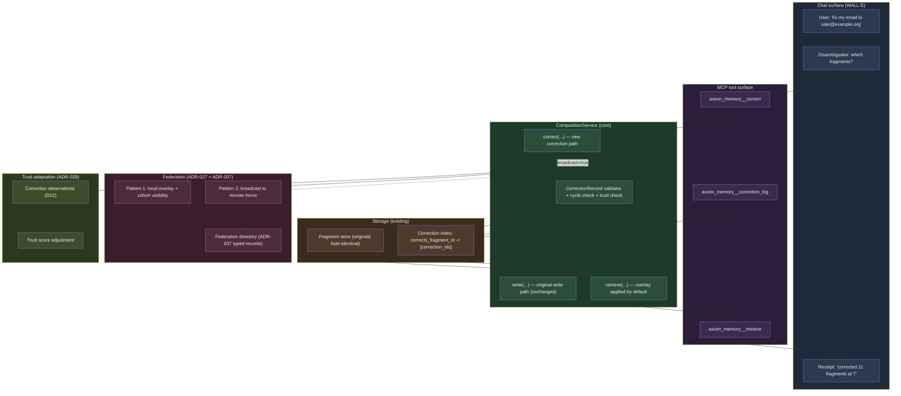
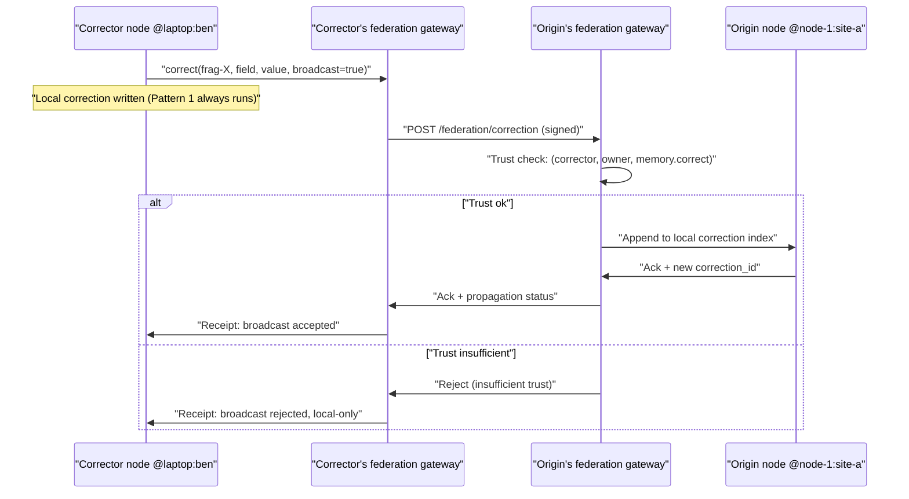
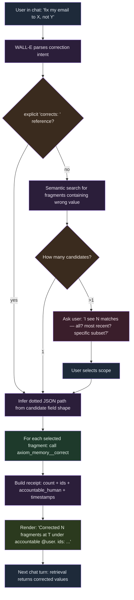

# Spec — Chat-Driven Corrections + Correction-Aware Retrieval

**Status:** Draft (2026-05-01)
**Authors:** Benjamin Booth, Claude
**Implements:** ADR-042
**Related:** ADR-027 (federated memory), ADR-028 (trust graph), ADR-035 (human-principal binding), ADR-037 (federation state propagation), ADR-031 (extension self-containment), `spec-memory.md`, `spec-federation-policy.md`, `spec-aeos-0.1.md`, `prd-chat-driven-corrections.md`

---

## 1. Overview

This spec defines the technical surface for chat-driven memory corrections and correction-aware retrieval in Axiom. ADR-042 records *why* and *what*; this spec records *how*.

**Architecture in one diagram** (per `feedback_mermaid_*` conventions — vertical TD; every node + subgraph styled `fill:` + `color:`; double-quoted labels with special characters):



---

## 2. CorrectionRecord schema

```python
# src/axiom/memory/correction.py

from dataclasses import dataclass
from typing import Any, Optional


@dataclass(frozen=True)
class CorrectionRecord:
    """A first-class correction targeting one field of one fragment.

    Stored as the `content` of a MemoryFragment with
    `cognitive_type=CognitiveType.CORRECTION`. The correction fragment's
    own provenance carries the standard (T, U, A, R) + accountable_human
    binding for the act of correcting; the CorrectionRecord payload
    carries what is being corrected and why.

    Per ADR-042 §D2: per-field granularity, dotted JSON path into the
    original fragment's `to_dict()` shape. Paths into
    `provenance.timestamp` and `provenance.principal_id` are rejected
    by the validator — those are load-bearing audit fields and "I want
    to claim this fragment was written at a different time by a different
    actor" is forgery, not correction.
    """

    corrects_fragment_id: str            # the original
    corrects_field: str                  # dotted JSON path into original.to_dict()
    wrong_value: Any                     # what was there at correction time
    correct_value: Any                   # what should be
    reason: str                          # human-readable why
    corrector_principal: str             # who is making this correction
    corrected_at: str                    # ISO 8601 timestamp
    chat_turn_ref: Optional[str] = None  # link to chat turn that surfaced it
    supersedes_correction: Optional[str] = None  # for chains
```

### 2.1 New CognitiveType value

```python
# src/axiom/memory/fragment.py — additive

class CognitiveType(str, Enum):
    CORE = "core"
    EPISODIC = "episodic"
    SEMANTIC = "semantic"
    PROCEDURAL = "procedural"
    RESOURCE = "resource"
    VAULT = "vault"
    CORRECTION = "correction"  # NEW (ADR-042)
```

### 2.2 Per-type content-shape validator

`_validate_content` in `fragment.py` gains a CORRECTION branch:

```python
elif cognitive_type is CognitiveType.CORRECTION:
    required = {
        "corrects_fragment_id", "corrects_field",
        "wrong_value", "correct_value", "reason",
        "corrector_principal", "corrected_at",
    }
    missing = required - content.keys()
    if missing:
        raise ValueError(
            f"correction fragment must include {sorted(missing)} in content"
        )
    field_path = content["corrects_field"]
    if field_path in _FORBIDDEN_CORRECTION_PATHS:
        raise ValueError(
            f"cannot correct load-bearing audit field: {field_path}"
        )

_FORBIDDEN_CORRECTION_PATHS = frozenset({
    "id",                          # fragment identity is immutable
    "provenance.timestamp",        # when the original was written
    "provenance.principal_id",     # who acted in the original
    "schema_version",              # decoder dispatch
    "signature",                   # the original signature
})
```

Note: `provenance.accountable_human_id` is *not* on the forbidden list — that is exactly the install-time-typo case and the correction primitive's most common use.

### 2.3 Schema-version implications

Adding `CognitiveType.CORRECTION` is a schema change per `working/memory-persistence-plan.md` §4 (open enum extension). The conservative read is to bump to `schema_version=3`:

- v2 decoder (`_decode_v2`) already accepts arbitrary content shapes; it will round-trip a v3 correction fragment if read back, but its `_validate_content` branch is unaware of CORRECTION. Mitigation: v2 decoder treats unknown cognitive_types as a decode error; v3 decoder accepts CORRECTION + invokes the new branch.
- `CURRENT_SCHEMA_VERSION = 3` after this lands.
- Cohort fixtures get a v3 variant with at least one correction record.

Coordinate with ADR-035's v2 stability before bumping.

---

## 3. CompositionService surface

### 3.1 New `correct(...)` entry point

```python
# src/axiom/memory/composition.py — additive

def correct(
    self,
    *,
    fragment_id: str,
    field: str,
    correct_value: Any,
    reason: str,
    corrector_principal: str,
    accountable_human_id: str,
    delegation_chain: tuple[str, ...] = (),
    chat_turn_ref: Optional[str] = None,
    supersedes_correction: Optional[str] = None,
    broadcast: bool = False,
) -> MemoryFragment:
    """Compose a new CORRECTION fragment for `fragment_id.field`.

    Algorithm:
    1. Resolve the original fragment via the artifact registry.
    2. Look up `wrong_value` from original.to_dict() at `field` path.
       If the path doesn't exist or is forbidden, fail with ValueError.
    3. Trust check (ADR-042 §D6):
       - Same-cohort corrector_principal vs. original.ownership.master:
         allow.
       - Cross-cohort: require trust edge
         (corrector, original.ownership.master, "memory.correct") at
         or above context.admission_threshold.
    4. Cycle check (ADR-042 §D5):
       - If supersedes_correction is set, walk the chain; reject if it
         eventually points back to a correction that supersedes the
         current one.
    5. Construct CorrectionRecord; build a CORRECTION MemoryFragment
       with the corrector_principal as actor and the accountable human
       per ADR-035; sign it; persist it.
    6. Update the correction index:
       corrects_fragment_id -> [..., new_correction_id].
    7. If broadcast=True, hand off to federation gateway with
       intent='correction_for_remote_origin'.
    8. Emit a trust-graph observation per ADR-042 §D12.
    9. Return the new correction fragment.

    Raises:
      ValueError: if field path is forbidden or doesn't exist on the
          original.
      TrustError: if cross-cohort correction lacks the required trust
          edge.
      CycleError: if supersedes_correction would create a cycle.
      OwnershipError: if the original cannot be located.
    """
    ...
```

### 3.2 Modified `retrieve(...)` — overlay applied by default

```python
def retrieve(
    self,
    query: ...,
    *,
    include_corrections: bool = True,
) -> RetrieveResponse:
    """Return fragments matching `query`, with corrections layered by
    default.

    Per ADR-042 §D4: corrections-applied-by-default. The response carries
    both corrected `content` and raw `raw_content` per fragment, plus the
    `corrections` array for visibility of the chain that produced the
    overlay.
    """
    ...
```

Response shape:

```python
@dataclass
class RetrievedFragment:
    fragment_id: str
    cognitive_type: str
    content: dict           # corrected (overlay applied)
    raw_content: dict       # original (no overlay)
    corrections: list[CorrectionRecord]  # full chain (incl. superseded)
    provenance: Provenance  # original's provenance
    # ... other existing fields unchanged
```

When `include_corrections=False`, `content == raw_content` and `corrections == []`.

### 3.3 Overlay algorithm

```python
def apply_correction_overlay(
    original: MemoryFragment,
    corrections: list[CorrectionRecord],
) -> dict:
    """Apply the freshest non-superseded correction per field.

    1. Build supersede graph: correction_id -> superseded_by_correction_id.
       Walk forward to find the chain head per correction_id.
    2. Sort corrections by corrected_at ascending.
    3. For each correction, mark it superseded if any later correction
       has supersedes_correction == this.id.
    4. Among non-superseded corrections, group by corrects_field.
    5. Within a group, the freshest by corrected_at wins.
    6. Apply each winning correction to a deep copy of original.to_dict()
       at its dotted JSON path.
    7. Return the corrected dict.
    """
    ...
```

The overlay is **idempotent** and **deterministic** given the same correction set. The same query over the same store always produces the same overlay output.

### 3.4 Correction log

```python
def correction_log(self, fragment_id: str) -> list[CorrectionRecord]:
    """Return all corrections for fragment_id, chronological.

    Includes superseded corrections so the reader sees the full DAG.
    Use with `axi memory correction-log <fragment_id>` for human-readable
    rendering.
    """
    ...
```

---

## 4. MCP tool surface

Three tools, all built on the CompositionService surface above. AEOS-conformant per `spec-aeos-0.1.md` (registered via the memory extension's manifest).

### 4.1 `axiom_memory__correct`

```yaml
name: axiom_memory__correct
description: |
  Write a correction record for one field of one fragment. The original
  fragment is preserved byte-identically; the correction is layered at
  retrieval time. Use this when you learn that a previously-recorded fact
  is wrong.

  Per-field granularity: targets a single dotted JSON path into the
  original fragment's serialized form (e.g., "owner",
  "content.summary", "provenance.accountable_human_id"). Paths into
  load-bearing audit fields ("provenance.timestamp",
  "provenance.principal_id", "id", "signature", "schema_version") are
  rejected.

  Within-cohort corrections succeed without explicit trust setup;
  cross-cohort corrections require an existing trust edge (see
  ADR-042 §D6).

input_schema:
  type: object
  required: [fragment_id, field, correct_value, reason]
  properties:
    fragment_id:
      type: string
      description: ID of the original fragment to correct.
    field:
      type: string
      description: Dotted JSON path into the original fragment's serialized form.
    correct_value:
      description: The right value (any JSON-serializable type).
    reason:
      type: string
      description: Human-readable explanation for why this correction is needed.
    broadcast:
      type: boolean
      default: false
      description: |
        If true, also send this correction to the original's home node
        for visibility to that node's other clients (Pattern 2). Requires
        the receiving node to trust the corrector. Default false uses
        only Pattern 1 (local overlay + cohort visibility).
    supersedes_correction:
      type: string
      description: |
        Optional. The ID of a prior correction that this correction
        replaces. Use when the prior correction was itself wrong.

output_schema:
  type: object
  properties:
    correction_fragment_id: { type: string }
    corrects_fragment_id: { type: string }
    field: { type: string }
    wrong_value: {}
    correct_value: {}
    corrected_at: { type: string }
    propagation: { type: string, enum: [local-overlay, broadcast] }
```

### 4.2 `axiom_memory__retrieve` (modified)

Existing tool; modified response shape:

```yaml
input_schema:
  # ... existing fields unchanged
  properties:
    include_corrections:
      type: boolean
      default: true
      description: |
        If true (default), each returned fragment carries its `content`
        with corrections applied as an overlay, plus a `raw_content`
        field with the original and a `corrections` array with the chain.
        If false, no overlay is applied and the response shape matches
        pre-correction behavior.

output_schema:
  type: object
  properties:
    fragments:
      type: array
      items:
        type: object
        properties:
          fragment_id: { type: string }
          cognitive_type: { type: string }
          content: { type: object, description: "corrected (overlay applied)" }
          raw_content: { type: object, description: "original (no overlay)" }
          corrections:
            type: array
            description: "full correction chain incl. superseded"
            items: { $ref: "#/$defs/CorrectionRecord" }
          # ... other existing fields unchanged
```

### 4.3 `axiom_memory__correction_log`

```yaml
name: axiom_memory__correction_log
description: |
  Return the chronological correction chain for a fragment, including
  superseded corrections. Use this for forensic review or to answer
  "what changes have been made to this fact, by whom, and why?"

input_schema:
  type: object
  required: [fragment_id]
  properties:
    fragment_id: { type: string }

output_schema:
  type: object
  properties:
    fragment_id: { type: string }
    corrections:
      type: array
      items: { $ref: "#/$defs/CorrectionRecord" }
```

---

## 5. Federation propagation protocol

### 5.1 Pattern 1 — Local overlay with cohort visibility

The default. The correction is a normal CORRECTION-typed MemoryFragment in the corrector's local store. It propagates to cohort peers through the existing ADR-027 memory propagation path:

- Cohort registry includes correction fragments alongside other fragments.
- Push / pull / gossip mode auto-selected per cohort size (ADR-027).
- Cohort peers, on receiving the correction, store it in their local correction index, keyed by `corrects_fragment_id`.
- When any cohort peer subsequently retrieves the original (or a fragment that references it), the local overlay applies *the union of all corrections in the local store* — including those received from other cohort members.

This is permissionless (no remote-write trust required) and the correction lives in the corrector's store. The original's home node may or may not know about the correction.

### 5.2 Pattern 2 — Broadcast to remote home node

Opt-in via `broadcast=True`. The correction is sent to the original's home node via the federation gateway with intent `correction_for_remote_origin`:



Style for the diagram (every participant + arrow narrated; use Mermaid sequenceDiagram default with explicit `Note over` to keep it readable):

```mermaid
%%{init: {"theme": "dark"}}%%
```

(Mermaid sequenceDiagram does not take per-node `style` directives the way `flowchart` does; use a dark theme directive for visual contrast and rely on explicit `Note over` for emphasis.)

### 5.3 Federation directory record type (Phase 3)

For high-impact corrections (notably `provenance.accountable_human_id` corrections that affect every audit projection), the correction is also published as a typed record in the ADR-037 federation directory:

```yaml
record_type: CORRECTION_NOTICE
authority: corrector node (signed by node key)
content:
  corrects_fragment_id: string
  corrects_field: string
  correct_value: any
  reason: string
  corrected_at: ISO 8601
ttl: 7 days  # gossip cadence carries it; record is retired after
visibility: cohort-bound by default; cohort root may elevate
```

This piggybacks on the existing federation gossip cadence for fast propagation of identity-class corrections without waiting for memory-layer pull. Phase 3 deferred.

---

## 6. Render-with-corrections specification

The canonical display vocabulary (ADR-042 §D8) is mandatory across every Axiom-shipped surface that renders fragments. AEOS-conformance gate per `spec-aeos-0.1.md`.

### 6.1 CLI long form — `axi memory show <fragment_id>`

Default behavior renders corrected values inline with their originals struck through and the correction byline immediately below:

```
Fragment: frag-abc                                          (corrected)
Type: episodic
Created: 2026-04-15T14:32:11Z by @ben:example-org (acting under @ben:example-org)

Content:
  owner:    ~~old@example.org~~ -> user@example.org
            ^ corrected by @laptop:ben at 2026-05-02T10:14:08Z
              reason: "typo at install time"
              correction_id: corr-xyz

  summary:  "Initial install of Axiom on laptop, identity bound..."
            (no correction)
```

If a correction supersedes a prior one, the chain depth indicator appears:

```
  owner:    ~~old@example.com~~ -> user@example.org  [chain: 2]
            ^ corrected by @laptop:ben at 2026-05-02T10:14:08Z
              supersedes correction corr-mno
              reason: "previous correction had its own typo"
```

### 6.2 CLI compact — `axi memory list` and tabular renderings

Each row carries a correction badge if any correction is applied:

```
ID         TYPE       CREATED              ACCOUNTABLE     CORRECTIONS
frag-abc   episodic   2026-04-15 14:32     @ben:example-org     [c2]
frag-def   semantic   2026-04-16 09:11     @ben:example-org     -
frag-ghi   procedural 2026-04-17 18:42     @ben:example-org     [c1]
```

The badge `[cN]` shows the number of *applied* (non-superseded) corrections. Click / drill-down expands.

### 6.3 CLI raw — `axi memory show --raw`

Original-only view; no overlay applied; explicit banner so the reader knows what they are seeing:

```
Fragment: frag-abc                                              (RAW)
[!] 2 corrections suppressed by --raw flag.
    Use `axi memory correction-log frag-abc` to see them.

Type: episodic
Created: 2026-04-15T14:32:11Z by @ben:example-org

Content:
  owner:    old@example.org
  summary:  "Initial install of Axiom on laptop, identity bound..."
```

### 6.4 CLI correction-log — `axi memory correction-log <fragment_id>`

Full chronological chain incl. superseded:

```
Corrections for frag-abc (chronological, 3 total, 2 active):

  corr-mno  2026-05-01T22:42:00Z  @laptop:ben
            field: owner
            old: old@example.org
            new: user@example.ogr   [SUPERSEDED by corr-xyz]
            reason: "typo at install time"

  corr-xyz  2026-05-02T10:14:08Z  @laptop:ben
            field: owner
            old: old@example.org
            new: user@example.org
            supersedes: corr-mno
            reason: "previous correction had its own typo"

  corr-pqr  2026-05-02T11:05:33Z  @node-1:site-a (cross-cohort)
            field: content.notes
            old: "stale note about install state"
            new: "verified install state per audit 2026-05-02"
            reason: "verification by audit reviewer"
```

### 6.5 MCP retrieve response

Structured per §4.2 — third-party MCP clients receive corrections as a first-class field but render however suits their surface. Tool descriptions include explicit guidance to surface corrections in any citation.

### 6.6 Chat surface (WALL-E and other built-in agents)

When citing a fact backed by a corrected fragment, the agent must surface the correction:

> The owner email is `user@example.org` (source: frag-abc, corrected 2026-05-02 by @laptop:ben — was `old@example.org`).

Silent use of the corrected value without disclosing the correction is forbidden by the chat-skill contract. The contract is enforced by the chat-extension manifest's `correction_disclosure_policy` field (AEOS conformance).

### 6.7 Display vocabulary terms (canonical)

| Term | Meaning |
|---|---|
| **original** | The byte-identical pre-correction fragment as written. |
| **corrected** | The post-overlay value at retrieval time. |
| **correction** | A CORRECTION-typed fragment carrying a CorrectionRecord. |
| **chain** | The supersede DAG of corrections targeting the same field. |
| **superseded** | A correction that has been replaced by a later correction (still in store, not applied by overlay). |
| **active** | A non-superseded correction (applied by overlay). |
| **broadcast** | Pattern 2 propagation that sends the correction to the original's home node. |
| **raw** | A retrieval mode that returns originals without overlay. |

Every Axiom surface uses these terms consistently. Spec-glossary-system entry to be added.

---

## 7. Chat-driven correction agent flow

This is the killer demo path (ADR-042 §D9). End-to-end flow:



### 7.1 Disambiguation rules

The agent's parser extracts:

- **Wrong value** (the value to be corrected, e.g., `old@example.org`).
- **Correct value** (the replacement, e.g., `user@example.org`).
- **Scope hint** (optional: "everywhere", "in the last session", "just the install record", or none).

Disambiguation strategy:

1. If the user provides explicit `corrects: <fragment_id>` (power-user form), use it directly.
2. Otherwise, semantic-search the user's accessible store for fragments where the wrong value appears in any field. Limit to the user's `accountable_human_id` scope by default (do not surface other users' fragments unless the user explicitly broadens scope).
3. If exactly one match: proceed to correct.
4. If multiple matches: surface a confirmation prompt with a compact list, asking for scope (all? most recent? specific ids?). Honor the user's `accountable_human_id` even if they say "all" — never widen scope beyond what the user has accountability for, unless they have explicit cross-account permission per D6.
5. After user confirmation, infer the correct field path per match. Field-path inference rule: among the fragment's content fields, identify the field whose value `==` the wrong value. If multiple fields match the wrong value, ask the user to pick which.

### 7.2 Field-path inference

```python
def infer_field_path(fragment: MemoryFragment, wrong_value: Any) -> str:
    """Walk the fragment's serialized form; return dotted path to the
    field whose value equals wrong_value. Raise AmbiguousFieldError if
    more than one field matches.
    """
    matches = []
    def walk(node, path):
        if isinstance(node, dict):
            for k, v in node.items():
                walk(v, f"{path}.{k}" if path else k)
        elif node == wrong_value:
            matches.append(path)
    walk(fragment.to_dict(), "")
    if len(matches) == 0:
        raise FieldNotFoundError(f"value {wrong_value!r} not found in fragment")
    if len(matches) > 1:
        raise AmbiguousFieldError(f"value {wrong_value!r} appears in {matches}")
    return matches[0]
```

When the user provides scope hints like "the email", path inference is narrowed to fields whose name contains the hint.

### 7.3 Receipt format

The receipt is a single chat message + a structured tool result. Example:

> Corrected 11 fragments at 2026-05-01T22:42:00Z under accountable human @ben:example-org:
>
> - frag-abc: `owner` (was `old@example.org`, now `user@example.org`)
> - frag-def: `provenance.accountable_human_id` (was `old@example.org`, now `user@example.org`)
> - ... (9 more)
>
> Correction ids: corr-001 ... corr-011. Audit log: `axi memory correction-log frag-abc` for any of them.

The structured form (returned to MCP callers) includes the full list of `(original_fragment_id, correction_fragment_id, field, wrong_value, correct_value)` tuples.

### 7.4 Future-turn behavior

On the next chat turn, the agent's RAG context build calls `axiom_memory__retrieve` with `include_corrections=True` (default). Corrected values appear in context. The agent's citations (per §6.6) surface that the value was corrected. The correction is "live" without any further user action.

---

## 8. Trust adaptation observations (D12)

Each correction emits one observation to the trust graph:

```python
TrustObservation(
    observer=corrector_principal,
    subject=corrector_principal,    # self-observation: "I made a correction"
    context=TrustContext(domain="memory", maturity="facts", classification=...),
    kind="correction_made",
    payload={
        "correction_id": ...,
        "corrects_fragment_id": ...,
        "supersedes_correction": ... or None,
    },
    at=corrected_at,
)
```

When a correction is itself superseded, an additional observation is emitted at supersede time:

```python
TrustObservation(
    observer=superseding_correction.corrector_principal,
    subject=superseded_correction.corrector_principal,
    context=...,
    kind="correction_superseded",
    payload={"superseded_correction_id": ..., "reason": ...},
)
```

The trust adaptation hook (existing per ADR-028) can choose to interpret these:

- A history of `correction_made` observations without subsequent `correction_superseded` is positive signal (this principal's corrections stick).
- A history of `correction_superseded` observations against a principal is negative signal (their corrections are themselves often wrong).

Exact weighting is the trust profile's policy; the correction layer only emits the observations.

---

## 9. Storage and indexing

### 9.1 Correction index

A new lightweight index in the artifact registry:

```python
class CorrectionIndex:
    """Maps original fragment id -> list of correction fragment ids."""

    def add(self, correction: MemoryFragment) -> None:
        ...

    def for_fragment(self, fragment_id: str) -> list[str]:
        """Return correction fragment ids targeting this fragment."""
        ...

    def chains_for_fragment(
        self, fragment_id: str
    ) -> list[CorrectionRecord]:
        """Return full chronological list of corrections (loaded)."""
        ...
```

The index is rebuilt from the artifact registry on startup (deterministic; no separate persistence needed beyond the registry itself).

### 9.2 Retrieval-path integration

The retrieval path (`CompositionService.retrieve`) consults the correction index for every returned fragment:

```python
for frag in matched_fragments:
    if include_corrections:
        corrs = self.correction_index.chains_for_fragment(frag.id)
        corrected = apply_correction_overlay(frag, corrs)
    else:
        corrs = []
        corrected = frag.to_dict()
    response.fragments.append(RetrievedFragment(
        fragment_id=frag.id,
        cognitive_type=frag.cognitive_type.value,
        content=corrected,
        raw_content=frag.to_dict(),
        corrections=corrs,
        provenance=frag.provenance,
        # ...
    ))
```

### 9.3 Performance bounds

- Correction count per fragment: in practice ≤ 5 over the fragment's lifetime; design tolerates 100+.
- Overlay cost per fragment: O(corrections × fields_corrected). For ≤ 10 corrections, ≤ 10ms target. For ≤ 100 corrections, ≤ 50ms target.
- Cache: per-fragment overlay result is cached keyed by `(fragment_id, max(correction.corrected_at))`. Invalidated when a new correction lands.

---

## 10. Test plan (correction_compliance gate)

Marker: `pytest -m correction_compliance`. Release-blocking from Phase 1 onward.

### 10.1 Schema and write-path tests

- Constructing a CORRECTION fragment with all required CorrectionRecord fields succeeds.
- Constructing with missing required fields fails with ValueError.
- Constructing with `corrects_field` in `_FORBIDDEN_CORRECTION_PATHS` fails.
- The correction fragment's signature verifies; the original fragment's signature still verifies after the correction lands (byte-identity preserved).

### 10.2 Retrieval overlay tests

- Default `retrieve` returns corrected `content` and original `raw_content`; corrections array is non-empty for corrected fragments.
- `include_corrections=False` returns originals only; corrections array empty.
- Overlay applies the freshest non-superseded correction per field.
- Multiple non-overlapping corrections coexist; each field's value reflects its respective latest correction.
- Cycle in supersedes chain rejected at write.
- Chains ≥ 5 deep traverse correctly; only chain head is applied per field.

### 10.3 Trust + cohort tests

- Within-cohort correction (same cohort registry) succeeds without explicit trust edge.
- Cross-cohort correction without trust edge fails with TrustError.
- Cross-cohort correction with explicit trust edge ≥ admission_threshold succeeds.
- Cohort-root D6 override (restrictive within cohort) is honored.

### 10.4 Federation propagation tests

- Pattern 1: correction lands in cohort peers' stores via existing ADR-027 propagation; their retrievals return the corrected value.
- Pattern 2: correction with `broadcast=True` is sent to origin's gateway with the right intent flag; trust check enforced at receiving gateway.
- Pattern 2 rejection on insufficient trust does not break Pattern 1 (local correction still lands).

### 10.5 Display chrome tests

- `axi memory show` long form renders the canonical vocabulary (original strikethrough, corrected inline, byline below).
- `axi memory show --raw` shows the suppression banner and original-only.
- `axi memory list` shows `[cN]` badge.
- `axi memory correction-log` shows full chronological chain with SUPERSEDED markers.
- MCP retrieve response carries `corrections` array and both `content` + `raw_content` keys.
- WALL-E citation in chat surfaces the correction byline (golden-transcript test).

### 10.6 Chat-driven flow tests

- "fix my email to X" with a single match goes straight to correct.
- "fix my email to X" with multiple matches surfaces the disambiguation prompt; user-confirmed scope is honored.
- "fix my email to X" with no match returns a graceful "I don't see that value in any of your fragments" message.
- Field-path inference: ambiguous field surfaces a pick prompt.
- Receipt format conforms to §7.3.

### 10.7 Trust adaptation tests

- Each correction emits a `correction_made` observation.
- Each supersede emits a `correction_superseded` observation against the prior corrector.
- Observations are visible to the trust adaptation hook.

---

## 11. Migration

### 11.1 Pre-Phase 0 workaround migration

For pilot-window fragments that captured corrections as free-form episodic notes (the documented workaround), `axi memory migrate --convert-correction-notes` walks tagged notes and converts them to first-class CORRECTION fragments. Tagging convention:

```
{
  "cognitive_type": "episodic",
  "content": {
    "event_time": "...",
    "_correction_note": true,
    "_corrects_fragment_id": "frag-abc",
    "_corrects_field": "owner",
    "_correct_value": "user@example.org",
    "_reason": "typo at install time"
  }
}
```

The migration helper:

1. Reads each tagged note.
2. Constructs a CorrectionRecord from the embedded fields.
3. Writes a new CORRECTION fragment via `CompositionService.correct(...)`.
4. Tags the original episodic note as `_migrated_to=corr-id`.
5. Reports a summary (count converted, count skipped due to ambiguity).

### 11.2 Schema-version bump coordination

ADR-042 ships `schema_version=3`. Coordinate with `working/memory-persistence-plan.md`:

- Land ADR-035's v2 first; let it stabilize.
- v3 decoder accepts CORRECTION cognitive_type; v2 decoder treats it as decode error (forces explicit upgrade path).
- Cohort fixtures get a v3 variant including correction examples.
- `axi memory migrate --to-v3` is a no-op for fragments without corrections (v2 → v3 is additive only); only the version stamp changes.

---

## 12. Extension surface (AEOS conformance)

The correction primitive lives in `src/axiom/memory/correction.py` (core, not extension). The MCP tools are exposed by the existing memory extension (which already exposes `axiom_memory__retrieve`); no new extension directory required.

Per `spec-aeos-0.1.md` §5, the memory extension's manifest is amended:

```toml
# axiom-extension.toml (memory extension)
name = "memory"
kinds = ["tool"]

[[tools]]
name = "axiom_memory__correct"
description = "Write a correction record for one field of one fragment."
schema = "schemas/correct.json"

[[tools]]
name = "axiom_memory__retrieve"
description = "Retrieve fragments with corrections applied by default."
schema = "schemas/retrieve.json"

[[tools]]
name = "axiom_memory__correction_log"
description = "Return the chronological correction chain for a fragment."
schema = "schemas/correction_log.json"

[chat_skill_contract]
correction_disclosure_policy = "must_surface_in_citation"
```

The `chat_skill_contract.correction_disclosure_policy` is a new manifest field introduced by this spec; AEOS conformance requires built-in agent extensions (WALL-E, EVE, CURI-O, CHALK-E, etc.) to honor it when citing corrected fragments.

---

## 13. Open spec items

Mirrors ADR-042 §Open items; resolved in spec before Phase 0:

- Retraction interaction with overlay: confirm ADR proposal that retracted originals suppress correction overlay.
- Visibility-horizon arithmetic: confirm ADR proposal `min(original.visibility, correction.visibility)` for overlay; correction record honors its own visibility independently.
- Render chrome on third-party MCP clients: tool description + system prompt + AAIF push (long-term).
- Correction-of-retraction: confirm ADR proposal that retractions are themselves correctable.

---

## 14. References

- ADR-042 — architecture
- ADR-027 — federated memory (immutability + propagation)
- ADR-028 — trust graph (D6 trust check + D12 adaptation)
- ADR-035 — human-principal binding (correction's accountable human)
- ADR-037 — federation state propagation (Phase 3 directory record type)
- ADR-031 — extension self-containment (memory extension manifest)
- spec-aeos-0.1.md — extension manifest contract
- spec-memory.md — provenance contract
- spec-federation-policy.md — visibility horizon arithmetic
- W3C PROV — `wasInvalidatedBy`, `wasRevisionOf` patterns

_Copyright (c) 2026 B-Tree Ventures, LLC. Apache-2.0 licensed._
