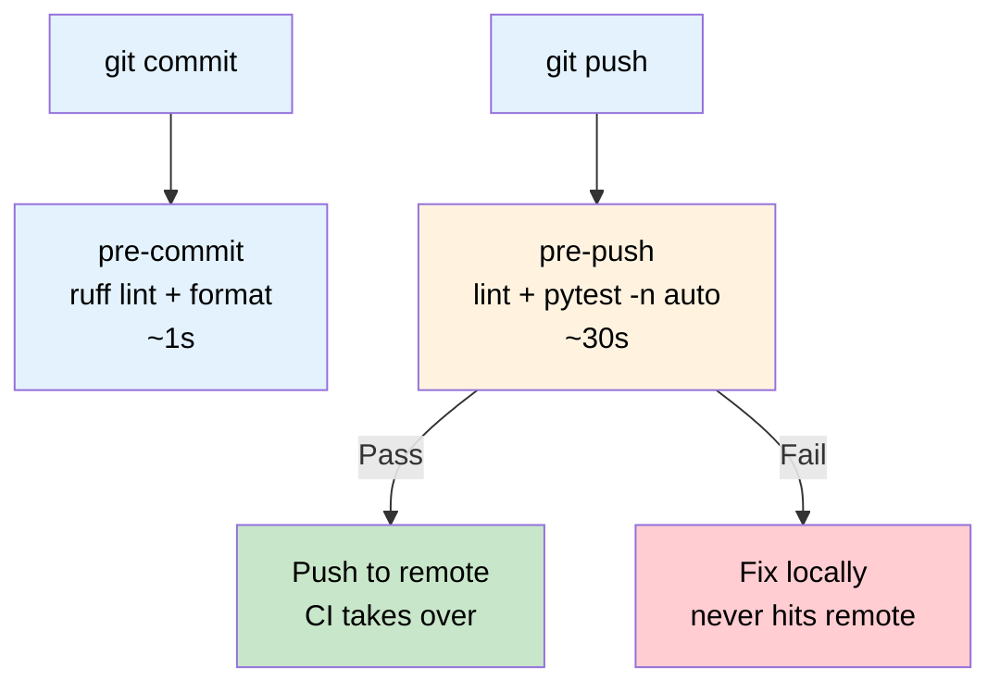
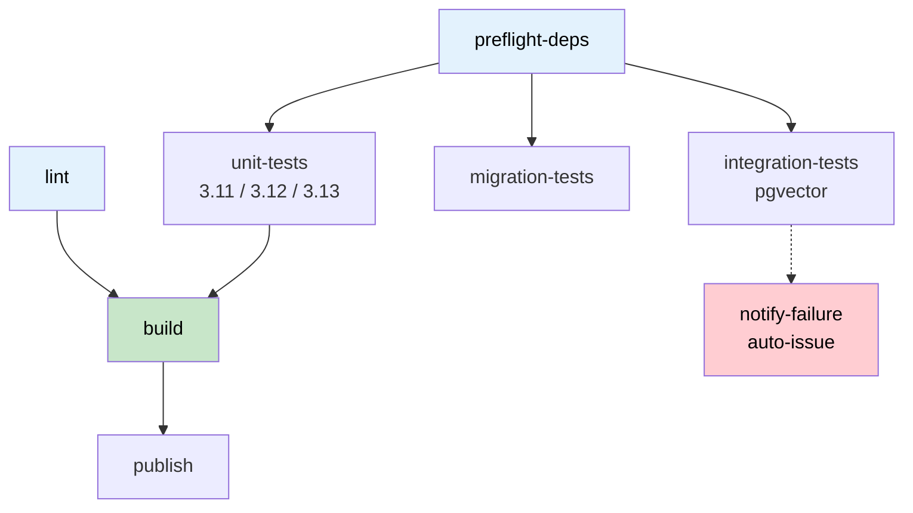
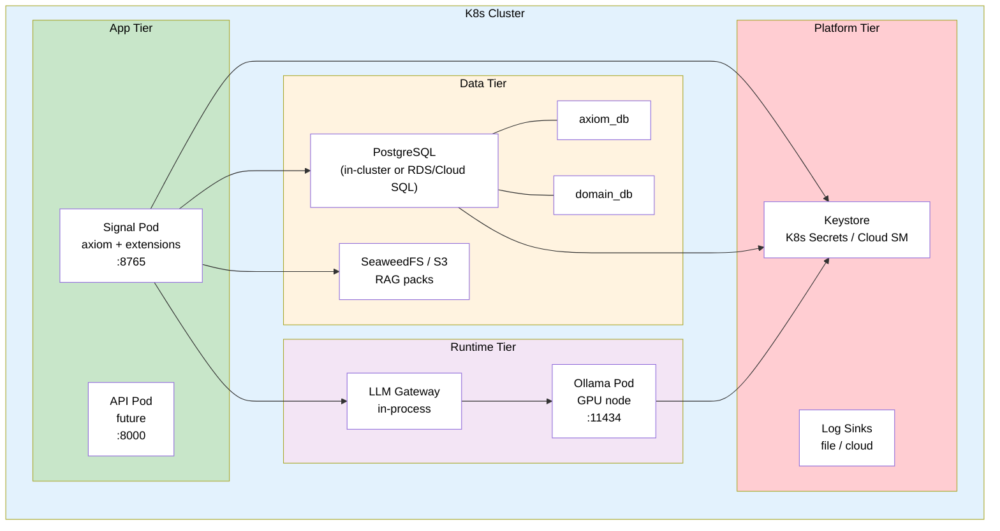
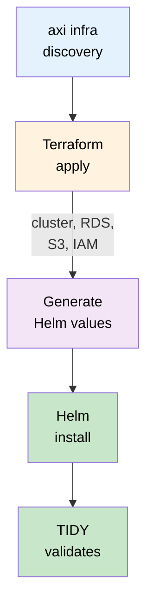
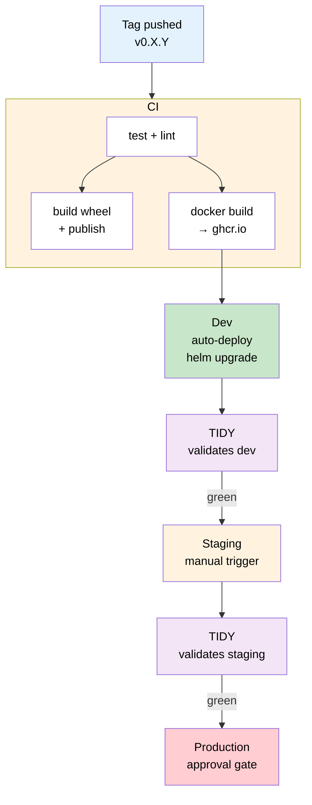

# CI/CD and Deployment Architecture

**Status:** Living document
**Last updated:** 2026-03-31
**PRD:** `prd-managed-infrastructure.md`
**Companion spec:** `spec-managed-infrastructure.md`

## Overview

This spec covers the full build-test-deploy pipeline for axiom and any domain
extension layers built on top of it. It is the CI/CD complement to
`spec-managed-infrastructure.md` (which covers runtime provisioning) and
`prd-managed-infrastructure.md` (which defines the service inventory and
agent-managed installation flow).

## Build Pipeline (Current — Optimized 2026-03-31)

### Local Developer Loop



### CI Pipeline Shape

**axiom (GitHub Actions):**



Domain extension layers (hosted on their own CI) follow the same pattern, with
their own preflight, test, lint, build, and publish stages. See ADR-015 for
how axiom and domain layers share infrastructure without coupling.

### Caching Strategy

| Layer | What's Cached | Key | Invalidation |
|-------|--------------|-----|--------------|
| pip download cache | `.pip-cache/` | `pip-py{version}-{hash(pyproject.toml)}` | pyproject.toml change |
| venv cache | `.venv/` | `venv-{exact_python_version}-{hash(pyproject.toml)}` | pyproject.toml or Python patch change |
| venv artifact | `.venv/` (shared via CI artifact) | Per-pipeline | Always fresh (rebuilt in preflight) |
| ruff cache | `.ruff-cache/` | `ruff` (stable key) | Never (ruff handles internally) |
| Docker layer cache | Base image layers | `FROM` + `COPY pyproject.toml` layer | pyproject.toml change |

### Parallel Test Execution

All test jobs use `pytest-xdist` with `-n auto`:
- GitHub Actions runners: 2 CPU cores → 2 parallel workers
- GitLab runners: depends on runner config
- Local (developer Mac): all available cores

## Container Image Strategy

### Three-Layer Build

```dockerfile
# ─── Layer 1: Base (rebuilt monthly or on system dep change) ───
FROM python:3.12-slim AS base
RUN apt-get update && apt-get install -y --no-install-recommends \
    pandoc libpq-dev curl && rm -rf /var/lib/apt/lists/*

# ─── Layer 2: Dependencies (rebuilt on pyproject.toml change) ──
FROM base AS deps
WORKDIR /app
COPY pyproject.toml ./
RUN pip install --no-cache-dir ".[all]"

# ─── Layer 3: App (rebuilt on every push, ~seconds) ────────────
FROM deps AS app
COPY src/ ./src/
RUN pip install --no-cache-dir -e .
```

### Image Registry

| Image | Registry | Built by | Trigger |
|-------|----------|----------|---------|
| `axiom-base` | ghcr.io/b-tree-labs/axiom-os-base | GitHub Actions | pyproject.toml change or monthly |
| `axiom-signal` | ghcr.io/b-tree-labs/axiom-os-signal | GitHub Actions | Tag push |
| `axiom-api` | ghcr.io/b-tree-labs/axiom-os-api | GitHub Actions | Tag push |
| `pgvector/pgvector:pg16` | Docker Hub | Upstream | External |
| `ollama/ollama` | Docker Hub | Upstream | External |

Domain extension layers build their own app images FROM `axiom-base`, adding
only their domain-specific source code and configuration.

### CI Image Reuse

CI jobs should `FROM axiom-base` instead of `python:3.12-slim` to skip
dependency installation entirely. This requires:
1. Building and pushing `axiom-base` to ghcr.io on pyproject.toml changes
2. Updating CI configs to use the custom image
3. Fallback to `python:3.12-slim` + full install if custom image unavailable

## Deployment Architecture

### K3D Everywhere

All environments — from a single laptop to a multi-node cloud cluster — run
Kubernetes. Locally this is K3D backed by Docker Desktop (macOS/Windows) or
containerd (Linux). In the cloud this is EKS, GKE, or AKS. The same Helm
charts deploy everywhere with zero modification.

See `spec-managed-infrastructure.md` §"Single-Machine Topology (K3D)" for
the full K3D architecture and container runtime prerequisites.

### Deployment Topology



### Terraform + Helm Layering

Infrastructure provisioning is a two-layer pipeline. Terraform provisions the
platform (cluster, managed services, networking, IAM). Helm deploys workloads
into the cluster Terraform created. Terraform outputs feed Helm values
automatically.



See `spec-managed-infrastructure.md` §"Provisioning Abstraction (Terraform + Helm)"
for the full provisioner interface and per-platform Terraform environment details.

In hybrid/private-cloud environments where shared services live on other machines
(not in K3D), Terraform's role is minimal — it creates the local K3D cluster and
Helm values are generated from `runtime/config/infra.toml` (the infrastructure
manifest provided by IT). See `prd-managed-infrastructure.md`
§"Network-Aware Discovery" for the `infra.toml` format and `managed` flag semantics.

### Update Strategies by Service Type

| Service | Update Strategy | Downtime | Rollback |
|---------|----------------|----------|----------|
| Signal Pod | Rolling update (`helm upgrade`) | Zero | `helm rollback` |
| API Pod | Rolling update | Zero | `helm rollback` |
| PostgreSQL | Alembic migrate before pod update | Brief (migration lock) | `alembic downgrade` |
| LLM runtime | Restart pod / swap model | Model reload time | Previous model tag |
| Keystore | Secret rotation + pod restart | Zero (rolling) | Restore from backup |
| SeaweedFS/S3 | Stateful — data persists across updates | Zero | N/A (data layer) |
| Observability | Config reload | Zero | Previous config |
| Auth (TBD) | TBD | TBD | TBD |

## Continuous Deployment Pipeline

### Two-Phase Install

Installation follows the two-phase model defined in `prd-managed-infrastructure.md`:

**Phase 1 (Deterministic, no LLM):** `axi infra` → `axi config`
- Platform detection, container runtime, K3D, keystore, credentials, Terraform, Helm
- Every decision deterministic; hardcoded remediation on failure

**Phase 2 (Agent-Assisted, LLM available):** `axi hygiene validate`
- TIDY validates all services against minimum criteria
- Troubleshoots failures conversationally
- Installs domain extensions and validates their elevated criteria
- Runs end-to-end smoke test

### CD Pipeline (Target)



Each deployment environment gets TIDY validation before promotion to the next
stage. TIDY runs the same minimum criteria checks defined in the PRD plus an
end-to-end smoke test (`axi hygiene verify`).

### Database Migration Safety

Migrations MUST be backward-compatible:
1. Add columns as nullable first, backfill, then add NOT NULL
2. Never rename or drop columns in the same release that changes code
3. Run `alembic upgrade head` BEFORE deploying new app code
4. Test downgrade path in CI (already done for axiom)

### Secret Rotation During Deployment

When credentials change (API key rotation, DB password change):
1. Update secret in keystore (`axi secrets set <key>`)
2. Keystore backend propagates to K8s Secret (or cloud SM triggers sync)
3. Affected pods detect the change and restart (via K8s Secret hash annotation
   in deployment spec, or CSI driver rotation)
4. TIDY validates service health post-rotation

## CLI Commands Summary

### Build & CI

| Command | What it does |
|---------|-------------|
| `make check` | Run all local gates (lint + test) — mirrors CI |
| `make test` | Unit tests with `pytest -n auto` |
| `make lint` | Ruff linter |
| `make build` | Build wheel + sdist |

### Infrastructure & Deployment

| Command | What it does | Phase |
|---------|-------------|-------|
| `axi config` | 7-phase setup wizard | 1 |
| `axi infra` | Platform detection + Terraform + Helm | 1 |
| `axi infra --plan` | Dry run (terraform plan + helm template) | 1 |
| `axi infra --destroy` | Tear down all managed resources | 1 |
| `axi infra --check` | Status only, no changes | 1 |
| `axi infra --json` | Machine-readable status output | 1 |

### Secrets & Services

| Command | What it does | Phase |
|---------|-------------|-------|
| `axi secrets list` | Show stored credentials (names only) | 1 |
| `axi secrets set <key>` | Rotate credential, propagate to pods | 1 |
| `axi llm status` | LLM runtime health, models, VRAM | 2 |
| `axi llm pull <model>` | Download model to managed runtime | 2 |
| `axi llm list` | Available + loaded models | 2 |
| `axi llm default <model>` | Set gateway default model | 2 |
| `axi status` | Unified health view of all services | 2 |

### Diagnostics & Validation

| Command | What it does | Phase |
|---------|-------------|-------|
| `axi doctor` / `axi dr` | LLM-powered diagnostics | 2 |
| `axi hygiene validate` | Full post-install validation | 2 |
| `axi hygiene verify` | End-to-end smoke test | 2 |
| `axi ext install <name>` | Install domain extension + run hooks | 2 |

## TODO List

### P0 — Required Before HPC Cluster Deployment

- [ ] **Implement `axiom.ask` module** — thin wrapper around `Gateway.complete()`;
  currently referenced in `setup/infra.py` but does not exist
- [ ] **Move cloud API key prompt** to beginning of `axi config` Phase 1 — solves
  chicken-and-egg for LLM troubleshooting
- [ ] **Wire domain extension install hooks** — `[extension.install]` manifest
  section with Terraform modules, Helm overlays, post-install validation
- [ ] **Wire domain extension Alembic infrastructure** — domain layers need
  `env.py` and `alembic.ini` if they own database tables
- [ ] **Create `ci-failure` label** on GitLab and GitHub for auto-issue creation
- [ ] **Implement `axi hygiene validate`** — TIDY post-install validation with
  minimum criteria checks from PRD

### P1 — Container Image Optimization

- [ ] **Create `axiom-base` Dockerfile** — system deps + locked Python deps
- [ ] **Add base image build job** to axiom CI — triggered on pyproject.toml change
- [ ] **Push base image to ghcr.io** — `ghcr.io/b-tree-labs/axiom-os-base:py3.12`
- [ ] **Update app Dockerfile** to `FROM axiom-base` instead of `python:3.12-slim`
- [ ] **Update CI templates** to use base image for test/build jobs
- [ ] **Generate `requirements.lock`** with `pip-compile --generate-hashes`
  for deterministic, hash-verified builds
- [ ] **Add `pip-audit`** to CI — fail on critical/high CVEs (ADR-017)
- [ ] **Generate SBOM** (CycloneDX) on release builds, attach to GitHub Release
- [ ] **Separate build/publish credentials** — build jobs read-only, publish
  jobs write-only and tag-gated

### P2 — Continuous Deployment Pipeline

- [ ] **Add `docker build + push` job** to axiom CI on tag push
- [ ] **Add `helm upgrade` job** for auto-deploy to dev environment
- [ ] **Define deployment environments** in Terraform: local, dev, staging, prod
- [ ] **Add TIDY validation** post-deploy (smoke test + criteria check)
- [ ] **Document rollback procedure** — `helm rollback` + `alembic downgrade`
- [ ] **Implement `axi infra --plan`** and `axi infra --destroy`
- [ ] **Cross-repo `repository_dispatch`** — Axiom release triggers dependency
  PR in consumer repos (ADR-017, Stage 2)

### P3 — Shared Service Lifecycle

- [ ] **Keystore implementation** — `axiom.infra.keystore` module; K8s Secrets
  backend for local, CSI driver integration for cloud
- [ ] **Secret rotation flow** — update keystore → propagate to pods → validate
- [ ] **Auth system decision** — Keycloak vs Auth0 vs internal (ADR needed)
- [ ] **Observability stack** — metrics backend (Prometheus? CloudWatch?),
  wire axiom log sinks
- [ ] **LLM runtime Terraform module** — Ollama pod provisioning in Helm chart
- [ ] **RAG pack server** — SeaweedFS Helm subchart or cloud S3
- [ ] **GPU scheduling** — resource limits and priority classes for multi-GPU

### P4 — Documentation

- [ ] **axiom CONTRIBUTING.md** — contribution guidelines for the framework
- [ ] **Extension developer guide** — how to add DB models, migrations,
  LLM calls, log sinks, and install hooks from a new extension
- [ ] **Operator runbook** — PostgreSQL backup/restore, LLM model swap,
  secret rotation, S3 lifecycle, rollback procedures

### P5 — Future Extensibility

- [ ] **Extension DB migration discovery** — pattern for multiple extensions each
  owning their own Alembic migration chain
- [ ] **Multi-tenant database support** — schema-per-tenant or database-per-tenant
- [ ] **Extension health checks** — register health endpoints that roll up into
  pod `/status`
- [ ] **Hot-reload for LLM provider config** — swap providers without pod restart

## Related Documents

- `spec-managed-infrastructure.md` — Technical spec for provisioning, discovery, and validation
- `prd-managed-infrastructure.md` — Product requirements for all managed services
- `spec-model-routing.md` — Gateway routing architecture
- `spec-agent-architecture.md` — Agent patterns, tool execution, approval gates
- `adr-015-shared-service-boundaries.md` — Ownership model, IaC layering, database isolation
- `prd-agents.md` — Agent design principles, RACI framework, safety guardrails
- `prd-connections.md` — Connection management framework
- `adr-017-release-pipeline-supply-chain.md` — Release pipeline, dependency propagation, supply chain integrity
_Copyright (c) 2026 The University of Texas at Austin and B-Tree Labs. Apache-2.0 licensed._
