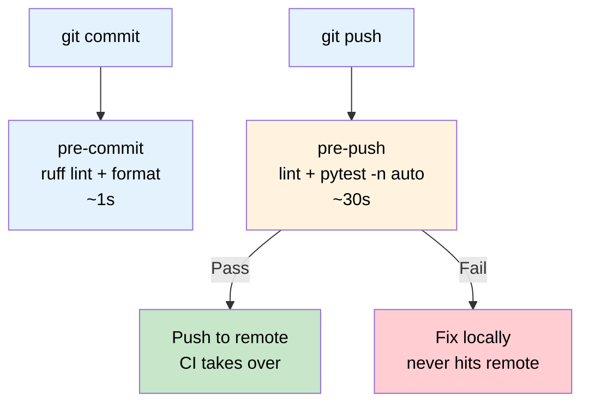
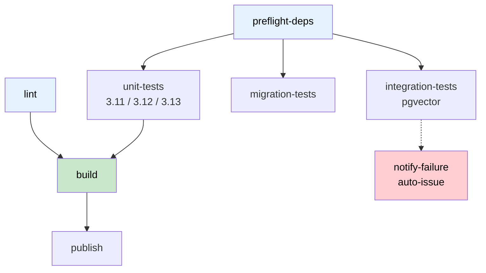
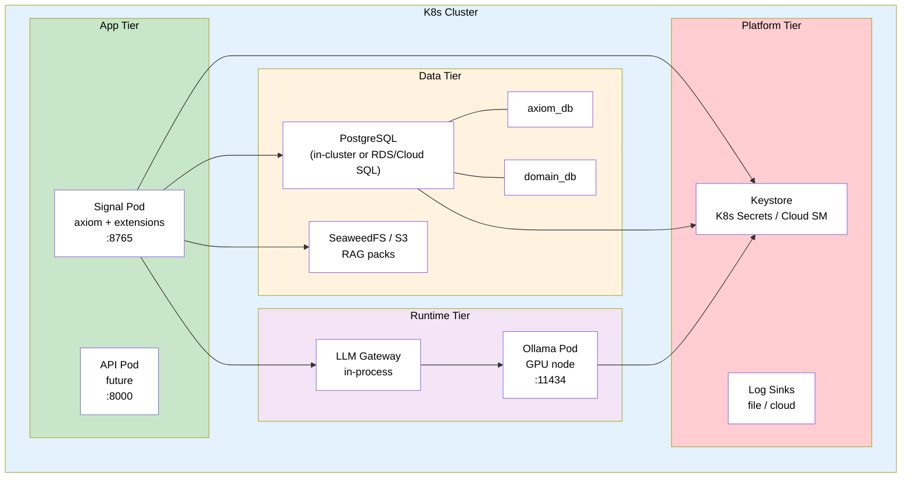
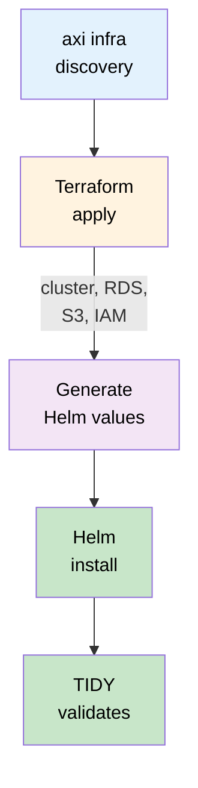
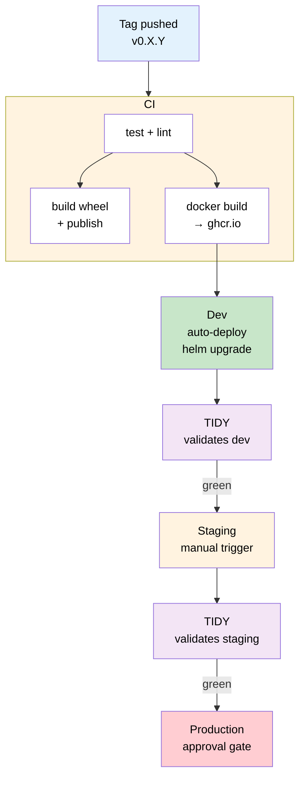

# CI/CD and Deployment Architecture

**Status:** Living document
**Last updated:** 2026-03-31
**PRD:** `prd-managed-infrastructure.md`
**Companion spec:** `spec-managed-infrastructure.md`

## Overview

This spec covers the full build-test-deploy pipeline for axiom and any domain
extension layers built on top of it. It is the CI/CD complement to
`spec-managed-infrastructure.md` (which covers runtime provisioning) and
`prd-managed-infrastructure.md` (which defines the service inventory and
agent-managed installation flow).

## Build Pipeline (Current — Optimized 2026-03-31)

### Local Developer Loop


```mermaid
graph TB
    C["git commit"] --> PC["pre-commit<br/>ruff lint + format<br/>~1s"]
    P["git push"] --> PP["pre-push<br/>lint + pytest -n auto<br/>~30s"]
    PP -->|Pass| R["Push to remote<br/>CI takes over"]
    PP -->|Fail| F["Fix locally<br/>never hits remote"]

    style C fill:#e3f2fd,color:#000000
    style PC fill:#e3f2fd,color:#000000
    style P fill:#e3f2fd,color:#000000
    style PP fill:#fff3e0,color:#000000
    style F fill:#ffcdd2,color:#000000
    style R fill:#c8e6c9,color:#000000
```

### CI Pipeline Shape

**axiom (GitHub Actions):**


```mermaid
graph TB
    PF["preflight-deps"] --> UT["unit-tests<br/>3.11 / 3.12 / 3.13"]
    PF --> IT["integration-tests<br/>pgvector"]
    PF --> MT["migration-tests"]
    L["lint"] --> B["build"]
    UT --> B
    IT -.-> N["notify-failure<br/>auto-issue"]
    B --> PUB["publish"]

    style PF fill:#e3f2fd,color:#000000
    style L fill:#e3f2fd,color:#000000
    style B fill:#c8e6c9,color:#000000
    style N fill:#ffcdd2,color:#000000
```

Domain extension layers (hosted on their own CI) follow the same pattern, with
their own preflight, test, lint, build, and publish stages. See ADR-015 for
how axiom and domain layers share infrastructure without coupling.

### Caching Strategy

| Layer | What's Cached | Key | Invalidation |
|-------|--------------|-----|--------------|
| pip download cache | `.pip-cache/` | `pip-py{version}-{hash(pyproject.toml)}` | pyproject.toml change |
| venv cache | `.venv/` | `venv-{exact_python_version}-{hash(pyproject.toml)}` | pyproject.toml or Python patch change |
| venv artifact | `.venv/` (shared via CI artifact) | Per-pipeline | Always fresh (rebuilt in preflight) |
| ruff cache | `.ruff-cache/` | `ruff` (stable key) | Never (ruff handles internally) |
| Docker layer cache | Base image layers | `FROM` + `COPY pyproject.toml` layer | pyproject.toml change |

### Parallel Test Execution

All test jobs use `pytest-xdist` with `-n auto`:
- GitHub Actions runners: 2 CPU cores → 2 parallel workers
- GitLab runners: depends on runner config
- Local (developer Mac): all available cores

## Container Image Strategy

### Three-Layer Build

```dockerfile
# ─── Layer 1: Base (rebuilt monthly or on system dep change) ───
FROM python:3.12-slim AS base
RUN apt-get update && apt-get install -y --no-install-recommends \
    pandoc libpq-dev curl && rm -rf /var/lib/apt/lists/*

# ─── Layer 2: Dependencies (rebuilt on pyproject.toml change) ──
FROM base AS deps
WORKDIR /app
COPY pyproject.toml ./
RUN pip install --no-cache-dir ".[all]"

# ─── Layer 3: App (rebuilt on every push, ~seconds) ────────────
FROM deps AS app
COPY src/ ./src/
RUN pip install --no-cache-dir -e .
```

### Image Registry

| Image | Registry | Built by | Trigger |
|-------|----------|----------|---------|
| `axiom-base` | ghcr.io/b-tree-labs/axiom-os-base | GitHub Actions | pyproject.toml change or monthly |
| `axiom-signal` | ghcr.io/b-tree-labs/axiom-os-signal | GitHub Actions | Tag push |
| `axiom-api` | ghcr.io/b-tree-labs/axiom-os-api | GitHub Actions | Tag push |
| `pgvector/pgvector:pg16` | Docker Hub | Upstream | External |
| `ollama/ollama` | Docker Hub | Upstream | External |

Domain extension layers build their own app images FROM `axiom-base`, adding
only their domain-specific source code and configuration.

### CI Image Reuse

CI jobs should `FROM axiom-base` instead of `python:3.12-slim` to skip
dependency installation entirely. This requires:
1. Building and pushing `axiom-base` to ghcr.io on pyproject.toml changes
2. Updating CI configs to use the custom image
3. Fallback to `python:3.12-slim` + full install if custom image unavailable

## Deployment Architecture

### K3D Everywhere

All environments — from a single laptop to a multi-node cloud cluster — run
Kubernetes. Locally this is K3D backed by Docker Desktop (macOS/Windows) or
containerd (Linux). In the cloud this is EKS, GKE, or AKS. The same Helm
charts deploy everywhere with zero modification.

See `spec-managed-infrastructure.md` §"Single-Machine Topology (K3D)" for
the full K3D architecture and container runtime prerequisites.

### Deployment Topology


```mermaid
graph TB
    subgraph cluster["K8s Cluster"]
        subgraph app["App Tier"]
            SIG["Signal Pod<br/>axiom + extensions<br/>:8765"]
            API["API Pod<br/>future<br/>:8000"]
        end
        subgraph data["Data Tier"]
            PG["PostgreSQL<br/>(in-cluster or RDS/Cloud SQL)"]
            ADB["axiom_db"]
            DDB["domain_db"]
            PG --- ADB
            PG --- DDB
            S3["SeaweedFS / S3<br/>RAG packs"]
        end
        subgraph runtime["Runtime Tier"]
            LLM["Ollama Pod<br/>GPU node<br/>:11434"]
            GW["LLM Gateway<br/>in-process"]
        end
        subgraph platform["Platform Tier"]
            KS["Keystore<br/>K8s Secrets / Cloud SM"]
            OBS["Log Sinks<br/>file / cloud"]
        end
        SIG --> GW
        GW --> LLM
        SIG --> PG
        SIG --> S3
        SIG --> KS
        PG --> KS
        LLM --> KS
    end

    style cluster fill:#e3f2fd,color:#000000
    style app fill:#c8e6c9,color:#000000
    style data fill:#fff3e0,color:#000000
    style runtime fill:#f3e5f5,color:#000000
    style platform fill:#ffcdd2,color:#000000
    style SIG fill:#ffffff,color:#000000
    style API fill:#ffffff,color:#000000
    style PG fill:#ffffff,color:#000000
    style ADB fill:#ffffff,color:#000000
    style DDB fill:#ffffff,color:#000000
    style S3 fill:#ffffff,color:#000000
    style LLM fill:#ffffff,color:#000000
    style GW fill:#ffffff,color:#000000
    style KS fill:#ffffff,color:#000000
    style OBS fill:#ffffff,color:#000000
```

### Terraform + Helm Layering

Infrastructure provisioning is a two-layer pipeline. Terraform provisions the
platform (cluster, managed services, networking, IAM). Helm deploys workloads
into the cluster Terraform created. Terraform outputs feed Helm values
automatically.


```mermaid
graph TB
    DIS["axi infra<br/>discovery"] --> TF["Terraform<br/>apply"]
    TF -->|cluster, RDS,<br/>S3, IAM| HV["Generate<br/>Helm values"]
    HV --> HELM["Helm<br/>install"]
    HELM --> VAL["TIDY<br/>validates"]

    style DIS fill:#e3f2fd,color:#000000
    style TF fill:#fff3e0,color:#000000
    style HV fill:#f3e5f5,color:#000000
    style HELM fill:#c8e6c9,color:#000000
    style VAL fill:#c8e6c9,color:#000000
```

See `spec-managed-infrastructure.md` §"Provisioning Abstraction (Terraform + Helm)"
for the full provisioner interface and per-platform Terraform environment details.

In hybrid/private-cloud environments where shared services live on other machines
(not in K3D), Terraform's role is minimal — it creates the local K3D cluster and
Helm values are generated from `runtime/config/infra.toml` (the infrastructure
manifest provided by IT). See `prd-managed-infrastructure.md`
§"Network-Aware Discovery" for the `infra.toml` format and `managed` flag semantics.

> **Status check, 2026-10-06.** The Helm and Terraform flow described in this document is largely not
> implemented: the only chart in the repository deploys the secrets store, no workflow validates any chart or
> Terraform, and `axi infra` and `axi update` apply plain manifests and `kubectl rollout`, not `helm upgrade`.
> [ADR-170](../adrs/adr-170-a-release-is-proven-in-an-idle-slot-before-traffic-moves.md) and
> [spec-release-slots.md](spec-release-slots.md) specify the work that makes the serving tier match this
> document, starting with validating the IaC in CI.

### Update Strategies by Service Type

| Service | Update Strategy | Downtime | Rollback |
|---------|----------------|----------|----------|
| Signal Pod | Rolling update (`helm upgrade`) | Zero | `helm rollback` |
| API Pod | Rolling update | Zero | `helm rollback` |
| PostgreSQL | Alembic migrate before pod update | Brief (migration lock) | `alembic downgrade` |
| LLM runtime | Restart pod / swap model | Model reload time | Previous model tag |
| Keystore | Secret rotation + pod restart | Zero (rolling) | Restore from backup |
| SeaweedFS/S3 | Stateful — data persists across updates | Zero | N/A (data layer) |
| Observability | Config reload | Zero | Previous config |
| Auth (TBD) | TBD | TBD | TBD |

## Node Roles: One Definition for Every Target (2026-10-08)

A node is a set of roles switched on in values (ADR-164). All of them are
defined once, in `infra/charts/axiom-node`, and every target is derived from
that chart (ADR-170's "one set of code, several profiles"):

| Target | How it is produced | Use |
|---|---|---|
| Kubernetes (K3D, k3s, a cluster) | `helm install … infra/charts/axiom-node -f values-<profile>.yaml` | Laptops rehearsing production; heavier site nodes; the platform |
| Single host with Docker, no Kubernetes | `python -m axiom.infra.deploy.compose_from_chart --chart infra/charts/axiom-node -f values… -o compose.yaml` (generated, never edited) | Old or low-power hardware; shared hosts where only Docker is allowed |

**Roles** (`roles.<name>.enabled`):
- `edge`: the ingest edge (ADR-177).
- `producer`: a collector. It also serves the in-memory **realtime point**, fed straight from the source and never through a database.
- `twin`: a realtime consumer. Off by default; on bigger hardware, enabling it is the only change.
- `medallion`: the local medallion's database, in archive or primary mode.
- `forwarder`: ships bronze upstream.
- `edgePull`: a downstream pull on a schedule.

**Profiles** size every role: `micro`, `lowpower`, `node`, `cluster`.

**Priority on constrained hardware.** The collector and the twin run at
`realtime` priority:
- on Kubernetes, a higher PriorityClass and guaranteed resources (requests equal limits);
- on Compose, more CPU shares and a negative out-of-memory score.

Storage, forwarding and pulls run at `background` priority and are throttled or
evicted first.

**One runtime image** (`infra/images/axiom-runtime`): a base Python and an
entrypoint. Packages are installed once per version onto the role's volume, at
`/data/venvs/<version>` with a `/data/current` link: the updater's layout
(ADR-179). A release never needs a new image, a restart never reinstalls, and
an update switches the link.

**Secrets are never in manifests.** Kubernetes references existing Secrets by
name. Compose reads an env file the operator writes from the vault
(`$<ROLE>_SECRETS_ENV`). An edge's keys file holds hashes only.

**Proof** (`.github/workflows/node-chart.yml`):
- `helm lint` and `kubeconform` across every profile, with the twin off and on;
- the generator's tests;
- `infra/smoke/node_chain_smoke.py`, run on generated Compose and on K3D: a
  producer pushes through the edge, a stub twin reads the realtime point, and a
  downstream pull gets exactly what landed (a rerun gets nothing). Every role is
  then restarted (on one Compose run, the Docker daemon itself), and the
  downstream pulls nothing new: nothing is lost and nothing lands twice.

**Footprint** (measured 2026-10-08, `lowpower`, the collector plus the local medallion):

| Target | Steady-state memory |
|---|---|
| Compose | about 135 MiB (database 59; collector 74 peak, live EPICS) |
| K3D | about 830 MiB (k3s control plane 455 + the same roles) |

Recommendation: generated Compose on old or small hardware; K3D or k3s on a
heavier node. Moving between them is a redeploy of the same chart.

**Never down from our own causes (ADR-182, extending ADR-170).** Every role
that serves runs in two slots behind one front (`blueGreen` in values; the
edge and `serve` have it on by default). The slots share the role's data
volume and each has its own installed packages (`/pkg`). The front is a
Service on Kubernetes and an nginx front service on a single host.

`python -m axiom.infra.deploy.bluegreen compose|k8s --role <role> --to <slot>`
starts the idle slot, waits for it to be healthy, routes to both, then to the
new slot, and keeps the old one. On Kubernetes, changing `active` changes only
Service selectors; on a single host, nginx reloads gracefully.

Migrations added since the last release may only add; contracting changes need
`# contract: <what> unused since <released version>`
(`axiom.infra.deploy.migration_guard`, in CI).

`infra/smoke/zero_gap_upgrade.py` deploys the edge blue → green → blue under
live load on Compose and on K3D, and passes only with 0 refused requests,
0 missing rows and 0 duplicates. Measured locally:
- Compose: 6,580 rows sent and 0 refused; 6,580 pulled; a rerun pulled 0.
- K3D: 7,140 rows sent and 0 refused; 7,140 pulled; a rerun pulled 0.

**The archive role, proven and measured** (`infra/smoke/archive_proof.py`, in
CI). On Compose at the lowpower profile with axiom-os-lm 0.68.0, 2026-10-08:
200,000 readings pushed, 200,000 in silver, 200,000 distinct, and the reader
role refused a write. Conform ran at 3,187 readings/s at 0.5 CPU. Peak memory
against the 384 MiB lowpower limit: medallion 163 MiB, edge 195 MiB. These
numbers come from Docker Desktop with the profile's limits applied, not from
the old host's kernel. W3 saw the edge peak at 287 MiB during a real day's
backfill burst. Init and companions carry a request but no memory limit.

**The node's declaration reaches its processes.** Every container that runs
Axiom gets the node file (`[node]` role, functions, agent policy, maintenance)
from `node` in values, written by the entrypoint to `$AXIOM_NODE_CONFIG`. A
role may set its own `agents` (the serving tier is `local`). The archive role
declares `agents: none`. Its proof shows that every process and listening port
is the edge, its front, conform and the database, and that a model call from
the edge or conform is refused (`LLMRefusedByPolicy`) (contingency C-48).

**A database volume is watched like the node's own.** `watchVolumes: [{label,
role}]` mounts another role's volume read-only and sets `AXIOM_DISK_WATCH`.
The archive edge watches the medallion's volume as `database`. The alarm floor
is 5 GiB or 10% free unless set (`AXIOM_DISK_ALARM_*`), which is well before
full. It appears in `/healthz` (`disks`, `disk_alarm`), in `status` (Local
archive, amber), and in the forwarder's heartbeat (`disk_used`, `disk_alarm`,
`disks`), where the platform's site health raises `disk_high`. A watch whose
volume is not mounted is an alarm, not a silence.

**The archive frees space before its disk fills.** A `reclaim` companion runs
`axi data archive-reclaim` every 10 minutes. It acts only under pressure: the
disk holding `/data` is below its alarm floor, or the archive's own bytes
(bronze plus silver) exceed `AXIOM_ARCHIVE_BUDGET_BYTES`. Then it rotates out
data older than the declared minimum `AXIOM_ARCHIVE_KEEP_DAYS` (90 in
`values-archive.yaml`; empty means never delete), oldest first and only until
the pressure clears: first bronze batches already delivered upstream, through
the edge's own retention, so the outbox is never rewritten; then whole
`silver.signals` chunks. In contributor mode (`AXIOM_ARCHIVE_CONTRIBUTOR`) a
batch the forwarder has not confirmed is never deleted; with no forwarder
cursor on the node, nothing counts as delivered. Silver is a derived copy: a
reading whose bronze is still kept is rebuilt by the next conform. The last
pass shows in node status under "Local archive"; a pass that cannot clear the
pressure exits non-zero and says what it kept. Proof: `data_platform/
conformance/tests/test_the_archive_frees_space_before_its_disk_fills.py`.

**Folded in so far.**
- **`src/axiom/setup/docker-compose.yml`** (the development database `axi infra` starts) is now generated from `values-dev-db.yaml`, and a test fails if it drifts.
  - It keeps the hand-written file's service name, container name, volume name and data path, so an existing install keeps its data. Proven: a row written under the old file survives the swap to the generated one.
  - The password comes from the caller's environment at `up` time (`axi infra` sets it from the vault) and is never written down. The old fallback password `axiom` is gone.

**Not duplicates, kept separate.** The per-extension charts deploy different services:
- `secrets` is OpenBao;
- `connect` is the presence agent;
- `observability` is Langfuse.

They stay their own charts; a node can depend on them as optional subcharts later. The `data_platform` chart's internal database is the medallion role and should become a dependency on this chart rather than its own StatefulSet, when that chart is next changed.

**The site node's serving tier: the migration path.** The production site node runs about 30 systemd units today. Nothing changes on it until a cutover. The order:
1. **The platform's next host is deployed purely from this chart** (the platform's planned move to a new host). The serving tier becomes roles (`serve` blue/green per ADR-170), and the timers become CronJobs or companions; each unit gets a role or is retired, listed unit by unit in the move's plan.
2. **Both run in parallel.** The new host pulls from the same ingest edge; the old node keeps serving until the new host's journeys pass (ADR-169).
3. **Cutover** moves the front door. The old node's units are stopped, not deleted, for a rollback window, then removed.

**Old kernels.** CI runners have current kernels, so behavior on an old one is not proven in CI. Before installing on an older machine, run this once on that machine and keep the output with the install record:
1. `uname -r`, `cat /etc/os-release`, `docker version`, `docker compose version`.
2. Generate the node's Compose file, `docker compose up -d`, and wait for every service to report healthy.
3. `docker compose restart`, then confirm every service comes back healthy and the collector's status shows no gaps.
4. Reboot the machine and repeat step 3's check.

Kernels older than 3.10, or Docker older than 20.10, are not supported. A failure at step 2 or 3 stops the install. Send the output to the platform team.

## Continuous Deployment Pipeline

### Two-Phase Install

Installation follows the two-phase model defined in `prd-managed-infrastructure.md`:

**Phase 1 (Deterministic, no LLM):** `axi infra` → `axi config`
- Platform detection, container runtime, K3D, keystore, credentials, Terraform, Helm
- Every decision deterministic; hardcoded remediation on failure

**Phase 2 (Agent-Assisted, LLM available):** `axi hygiene validate`
- TIDY validates all services against minimum criteria
- Troubleshoots failures conversationally
- Installs domain extensions and validates their elevated criteria
- Runs end-to-end smoke test

### CD Pipeline (Target)


```mermaid
graph TB
    TAG["Tag pushed<br/>v0.X.Y"] --> CI["CI Pipeline"]
    subgraph CI
        TEST["test + lint"]
        BUILD["build wheel<br/>+ publish"]
        IMG["docker build<br/>→ ghcr.io"]
        TEST --> BUILD
        TEST --> IMG
    end
    IMG --> DEV["Dev<br/>auto-deploy<br/>helm upgrade"]
    DEV --> MO1["TIDY<br/>validates dev"]
    MO1 -->|green| STG["Staging<br/>manual trigger"]
    STG --> MO2["TIDY<br/>validates staging"]
    MO2 -->|green| PROD["Production<br/>approval gate"]

    style TAG fill:#e3f2fd,color:#000000
    style CI fill:#fff3e0,color:#000000
    style TEST fill:#ffffff,color:#000000
    style BUILD fill:#ffffff,color:#000000
    style IMG fill:#ffffff,color:#000000
    style DEV fill:#c8e6c9,color:#000000
    style STG fill:#fff3e0,color:#000000
    style PROD fill:#ffcdd2,color:#000000
    style MO1 fill:#f3e5f5,color:#000000
    style MO2 fill:#f3e5f5,color:#000000
```

Each deployment environment gets TIDY validation before promotion to the next
stage. TIDY runs the same minimum criteria checks defined in the PRD plus an
end-to-end smoke test (`axi hygiene verify`).

### Database Migration Safety

Migrations MUST be backward-compatible:
1. Add columns as nullable first, backfill, then add NOT NULL
2. Never rename or drop columns in the same release that changes code
3. Run `alembic upgrade head` BEFORE deploying new app code
4. Test downgrade path in CI (already done for axiom)

### Secret Rotation During Deployment

When credentials change (API key rotation, DB password change):
1. Update secret in keystore (`axi secrets set <key>`)
2. Keystore backend propagates to K8s Secret (or cloud SM triggers sync)
3. Affected pods detect the change and restart (via K8s Secret hash annotation
   in deployment spec, or CSI driver rotation)
4. TIDY validates service health post-rotation

## CLI Commands Summary

### Build & CI

| Command | What it does |
|---------|-------------|
| `make check` | Run all local gates (lint + test) — mirrors CI |
| `make test` | Unit tests with `pytest -n auto` |
| `make lint` | Ruff linter |
| `make build` | Build wheel + sdist |

### Infrastructure & Deployment

| Command | What it does | Phase |
|---------|-------------|-------|
| `axi config` | 7-phase setup wizard | 1 |
| `axi infra` | Platform detection + Terraform + Helm | 1 |
| `axi infra --plan` | Dry run (terraform plan + helm template) | 1 |
| `axi infra --destroy` | Tear down all managed resources | 1 |
| `axi infra --check` | Status only, no changes | 1 |
| `axi infra --json` | Machine-readable status output | 1 |

### Secrets & Services

| Command | What it does | Phase |
|---------|-------------|-------|
| `axi secrets list` | Show stored credentials (names only) | 1 |
| `axi secrets set <key>` | Rotate credential, propagate to pods | 1 |
| `axi llm status` | LLM runtime health, models, VRAM | 2 |
| `axi llm pull <model>` | Download model to managed runtime | 2 |
| `axi llm list` | Available + loaded models | 2 |
| `axi llm default <model>` | Set gateway default model | 2 |
| `axi status` | Unified health view of all services | 2 |

### Diagnostics & Validation

| Command | What it does | Phase |
|---------|-------------|-------|
| `axi doctor` / `axi dr` | LLM-powered diagnostics | 2 |
| `axi hygiene validate` | Full post-install validation | 2 |
| `axi hygiene verify` | End-to-end smoke test | 2 |
| `axi ext install <name>` | Install domain extension + run hooks | 2 |

## TODO List

### P0 — Required Before HPC Cluster Deployment

- [ ] **Implement `axiom.ask` module** — thin wrapper around `Gateway.complete()`;
  currently referenced in `setup/infra.py` but does not exist
- [ ] **Move cloud API key prompt** to beginning of `axi config` Phase 1 — solves
  chicken-and-egg for LLM troubleshooting
- [ ] **Wire domain extension install hooks** — `[extension.install]` manifest
  section with Terraform modules, Helm overlays, post-install validation
- [ ] **Wire domain extension Alembic infrastructure** — domain layers need
  `env.py` and `alembic.ini` if they own database tables
- [ ] **Create `ci-failure` label** on GitLab and GitHub for auto-issue creation
- [ ] **Implement `axi hygiene validate`** — TIDY post-install validation with
  minimum criteria checks from PRD

### P1 — Container Image Optimization

- [ ] **Create `axiom-base` Dockerfile** — system deps + locked Python deps
- [ ] **Add base image build job** to axiom CI — triggered on pyproject.toml change
- [ ] **Push base image to ghcr.io** — `ghcr.io/b-tree-labs/axiom-os-base:py3.12`
- [ ] **Update app Dockerfile** to `FROM axiom-base` instead of `python:3.12-slim`
- [ ] **Update CI templates** to use base image for test/build jobs
- [ ] **Generate `requirements.lock`** with `pip-compile --generate-hashes`
  for deterministic, hash-verified builds
- [ ] **Add `pip-audit`** to CI — fail on critical/high CVEs (ADR-017)
- [ ] **Generate SBOM** (CycloneDX) on release builds, attach to GitHub Release
- [ ] **Separate build/publish credentials** — build jobs read-only, publish
  jobs write-only and tag-gated

### P2 — Continuous Deployment Pipeline

- [ ] **Add `docker build + push` job** to axiom CI on tag push
- [ ] **Add `helm upgrade` job** for auto-deploy to dev environment
- [ ] **Define deployment environments** in Terraform: local, dev, staging, prod
- [ ] **Add TIDY validation** post-deploy (smoke test + criteria check)
- [ ] **Document rollback procedure** — `helm rollback` + `alembic downgrade`
- [ ] **Implement `axi infra --plan`** and `axi infra --destroy`
- [ ] **Cross-repo `repository_dispatch`** — Axiom release triggers dependency
  PR in consumer repos (ADR-017, Stage 2)

### P3 — Shared Service Lifecycle

- [ ] **Keystore implementation** — `axiom.infra.keystore` module; K8s Secrets
  backend for local, CSI driver integration for cloud
- [ ] **Secret rotation flow** — update keystore → propagate to pods → validate
- [ ] **Auth system decision** — Keycloak vs Auth0 vs internal (ADR needed)
- [ ] **Observability stack** — metrics backend (Prometheus? CloudWatch?),
  wire axiom log sinks
- [ ] **LLM runtime Terraform module** — Ollama pod provisioning in Helm chart
- [ ] **RAG pack server** — SeaweedFS Helm subchart or cloud S3
- [ ] **GPU scheduling** — resource limits and priority classes for multi-GPU

### P4 — Documentation

- [ ] **axiom CONTRIBUTING.md** — contribution guidelines for the framework
- [ ] **Extension developer guide** — how to add DB models, migrations,
  LLM calls, log sinks, and install hooks from a new extension
- [ ] **Operator runbook** — PostgreSQL backup/restore, LLM model swap,
  secret rotation, S3 lifecycle, rollback procedures

### P5 — Future Extensibility

- [ ] **Extension DB migration discovery** — pattern for multiple extensions each
  owning their own Alembic migration chain
- [ ] **Multi-tenant database support** — schema-per-tenant or database-per-tenant
- [ ] **Extension health checks** — register health endpoints that roll up into
  pod `/status`
- [ ] **Hot-reload for LLM provider config** — swap providers without pod restart

## Related Documents

- `spec-managed-infrastructure.md` — Technical spec for provisioning, discovery, and validation
- `prd-managed-infrastructure.md` — Product requirements for all managed services
- `spec-model-routing.md` — Gateway routing architecture
- `spec-agent-architecture.md` — Agent patterns, tool execution, approval gates
- `adr-015-shared-service-boundaries.md` — Ownership model, IaC layering, database isolation
- `prd-agents.md` — Agent design principles, RACI framework, safety guardrails
- `prd-connections.md` — Connection management framework
- `adr-017-release-pipeline-supply-chain.md` — Release pipeline, dependency propagation, supply chain integrity
_Copyright (c) 2026 The University of Texas at Austin and B-Tree Labs. Apache-2.0 licensed._
