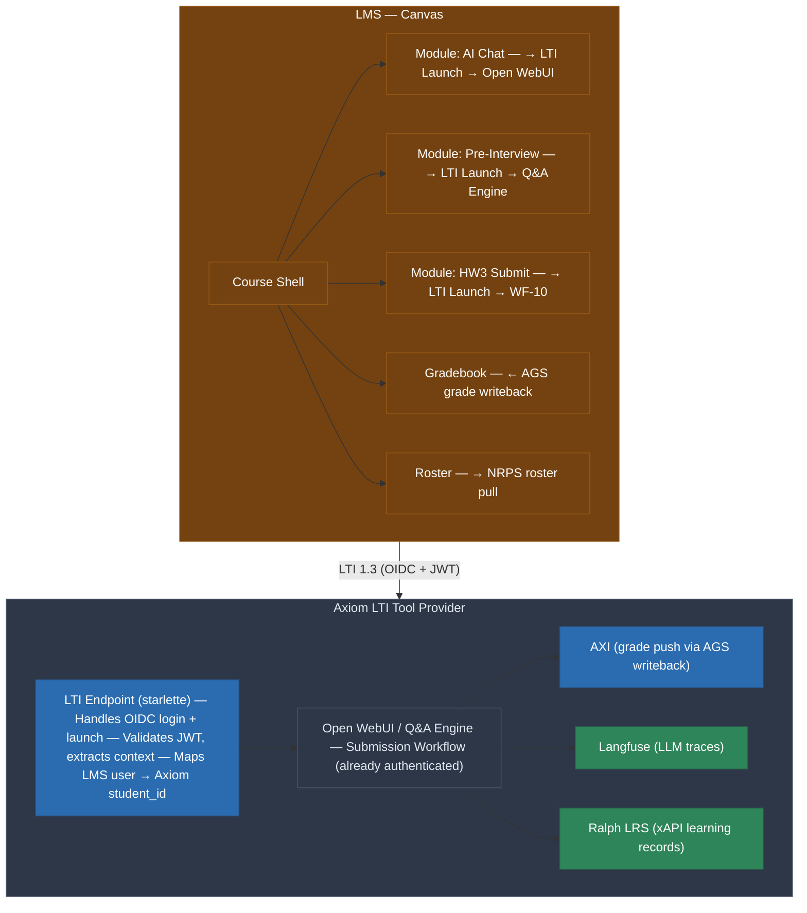
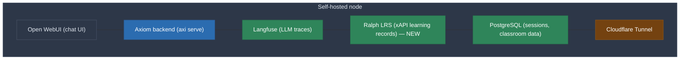

# Addendum: LTI/xAPI Integration + LLM Evals
## (To be merged into spec-classroom.md and prd-classroom.md)

> **Scope note:** While the first deployment targets a STEM course, the classroom module is domain-agnostic by design. The Course/Classroom model, LTI integration, xAPI analytics, structured Q&A, submission workflows, and eval harness serve any discipline — humanities, law, medicine, business, language learning. What varies per domain is the corpus, system prompt, and eval suite, not the platform infrastructure.

---

## A. LMS Integration — LTI 1.3 Tool Provider Architecture

### Why LTI 1.3

Rather than building Canvas-specific API integrations, Axiom's classroom module should be an **LTI 1.3 Advantage Tool Provider**. LTI 1.3 is the universal integration standard supported by every major LMS:

| LMS | LTI 1.3 Support | Market |
|-----|-----------------|--------|
| Canvas (Instructure) | Full Advantage | Most US research universities |
| Moodle | Full Advantage | International, open-source community |
| Blackboard/Anthology | Full Advantage | Large US/UK institutions |
| Brightspace (D2L) | Full Advantage | Canadian institutions, growing US |
| Open edX | Partial (consumer) | MOOCs, self-hosted courses |

One integration covers all of them. No per-LMS custom code.

### LTI 1.3 Advantage Services We Use

**1. Launch (Core LTI 1.3)**
Student or instructor clicks "AI Assistant" in their LMS course → OIDC handshake → JWT-signed launch → lands in Open WebUI, pre-authenticated with their LMS identity. No separate account creation, no enrollment tokens, no `students.yaml`. The LMS is the identity provider.

**2. Names and Roles Provisioning Services (NRPS)**
Pull the class roster from the LMS automatically. `axi classroom create` calls NRPS to get `{student_id, name, email, role}` for every enrolled student. Roster changes in the LMS (adds, drops) sync automatically.

**3. Assignment and Grade Services (AGS)**
Push grades back to the LMS gradebook. When AXI completes grading (WF-4, WF-10), it writes the score to the LMS line item via AGS. No CSV export, no manual grade entry.

**4. Deep Linking**
Instructor configures Axiom tools as LMS modules:
- "Week 3 AI Chat" → launches Open WebUI with week-3 system prompt context
- "Begin-of-Course Interview" → launches structured Q&A for the pre-course interview
- "Homework 3 Submission" → launches submission workflow (WF-10) with the correct assignment context
- "Final Presentation" → launches presentation workflow (WF-11)

Students see these as native LMS activities alongside readings, discussions, and quizzes.

### Integration Architecture



### Implementation: LTI Endpoint

**Location:** `axiom/src/axiom/extensions/builtins/lti/`

```mermaid
graph TB
    subgraph LTI["lti/"]
        TOML["axiom-extension.toml"]
        CLI["cli.py — axi lti register, status, keys"]
        END["endpoint.py — OIDC login + JWT validation — + launch routing"]
        SVC["services.py — NRPS roster sync, AGS grade push — Deep Link content"]
        JWKS["jwks.py — JWKS key management — RSA keypair for tool signing"]
        MOD["models.py — LTIPlatform, LTIDeployment — LTILaunch"]
        subgraph PROV["providers/"]
            CAN["canvas.py — Canvas-specific Developer Key — registration helpers"]
            MOO["moodle.py — Moodle-specific external tool — configuration"]
        end
        TOML --- CLI
        CLI --- END
        END --- SVC
        SVC --- JWKS
        JWKS --- MOD
        MOD --- PROV
    end

    style LTI fill:#2d3748,color:#e2e8f0,stroke:#4a5568
    style TOML fill:#2d3748,color:#e2e8f0,stroke:#4a5568
    style CLI fill:#2d3748,color:#e2e8f0,stroke:#4a5568
    style END fill:#2b6cb0,color:#fff,stroke:#2c5282
    style SVC fill:#2b6cb0,color:#fff,stroke:#2c5282
    style JWKS fill:#2b6cb0,color:#fff,stroke:#2c5282
    style MOD fill:#2d3748,color:#e2e8f0,stroke:#4a5568
    style PROV fill:#2d3748,color:#e2e8f0,stroke:#4a5568
    style CAN fill:#2d3748,color:#e2e8f0,stroke:#4a5568
    style MOO fill:#2d3748,color:#e2e8f0,stroke:#4a5568
```



**Key dependency:** `pylti1p3` — mature Python library for LTI 1.3 (MIT license, supports Flask/Django/raw WSGI). We wrap it in a starlette integration.

### What This Changes in Existing Workflows

| Workflow | Without LTI (current spec) | With LTI 1.3 |
|----------|---------------------------|--------------|
| WF-1: Enrollment | Manual `students.yaml` + `axi classroom create` | Roster pulled automatically via NRPS on first LTI launch |
| WF-2: Onboarding | Student clicks a URL with token | Student clicks "AI Assistant" in Canvas, lands in onboarding |
| WF-3/4: Testing & Scoring | Import CSV or in-platform quiz | Scores push to Canvas gradebook via AGS |
| WF-7: Drop/Withdraw | AXI deactivates manually | NRPS sync detects student dropped from LMS roster |
| WF-10: Submission | Student says "/submit" in chat | Student clicks "HW3 Submit" in Canvas, launches submission flow with assignment context pre-loaded |
| Authentication | Pre-shared tokens | LMS SSO via OIDC — zero separate credentials |

### LTI is Optional

LTI integration enhances the experience but is NOT required. The existing token-based auth + manual roster + CSV grade export path remains fully functional. Institutions without LTI-capable LMS, or courses run outside institutional infrastructure (like the Prague deployment), use the non-LTI path. The `axi classroom create` command detects whether an LTI platform is configured and adjusts accordingly.

---

## B. xAPI Learning Records — Ralph LRS

### Why xAPI

Langfuse traces LLM calls (tokens, latency, cost, RAG retrieval). xAPI traces *learning events* at a higher semantic level — what the student did, not what the model did.

Examples of xAPI statements we emit:

```json
{"actor": {"name": "Student_A"}, "verb": {"id": "http://adlnet.gov/expapi/verbs/attempted"}, "object": {"id": "quiz/pre-course", "definition": {"name": "Pre-Course Quiz"}}}
{"actor": {"name": "Student_A"}, "verb": {"id": "http://adlnet.gov/expapi/verbs/completed"}, "object": {"id": "interview/begin-of-course"}}
{"actor": {"name": "Student_A"}, "verb": {"id": "http://adlnet.gov/expapi/verbs/asked"}, "object": {"id": "objective/LO-3", "definition": {"name": "Reactor Criticality"}}}
{"actor": {"name": "Student_A"}, "verb": {"id": "http://id.tincanapi.com/verb/requested-help"}, "object": {"id": "topic/perturbation-theory"}}
{"actor": {"name": "Student_A"}, "verb": {"id": "http://adlnet.gov/expapi/verbs/scored"}, "object": {"id": "assignment/homework-3"}, "result": {"score": {"scaled": 0.85}}}
```

### Ralph LRS

**Ralph** (France Université Numérique, Apache 2.0) is a FastAPI-based Learning Record Store. Self-hosted, lightweight, stores xAPI statements in Elasticsearch or ClickHouse.

Deploy alongside Langfuse on a self-hosted node:



### Research Value

xAPI data is the standard format for education research. Institutions with existing LRS infrastructure can ingest our xAPI statements directly. The research export includes both:
- Langfuse data (LLM-level: tokens, latency, RAG quality, grounding scores)
- xAPI data (learning-level: objectives touched, help requests, quiz attempts, submission events)

This dual-layer instrumentation is novel — no existing AI-in-education platform provides both LLM observability and standardized learning records.

---

## C. LLM Evaluation Framework

### The Gap

Axiom currently has no formal eval harness. Without evals, we cannot answer:
- "Is our RAG pipeline giving students better answers than raw ChatGPT?"
- "Did a system prompt change improve or degrade response quality?"
- "Is the course corpus actually helping, or is the base model ignoring it?"
- "Are our grounding scores meaningful?"

For the classroom module specifically, evals are the foundation that makes everything else trustworthy. If we can't prove our system gives *better* answers, the research paper falls apart and a domain researcher is right to prefer Claude Code.

### Three-Level Eval Architecture

**Location:** `axiom/src/axiom/extensions/builtins/evals/`

```mermaid
graph TB
    subgraph EVALS["evals/"]
        TOML["axiom-extension.toml"]
        CLI["cli.py — axi eval run, report, — compare, create-suite"]
        HAR["harness.py — EvalHarness — runs eval suites — collects results"]
        SCO["scorer.py — Scoring functions — exact match, semantic sim, — LLM-as-judge"]
        SUI["suites/ — Eval suite definitions (YAML)"]
        REP["reporters/ — Output formatters — terminal, JSON, — Langfuse annotation"]
        subgraph PROV["providers/"]
            RAG["rag_eval.py — RAG-specific evals — retrieval, grounding, — faithfulness"]
            MOD["model_eval.py — Model-level evals — accuracy, helpfulness, — safety"]
            PED["pedagogy_eval.py — Pedagogical evals — learning advancement, — Socratic quality"]
        end
        TOML --- CLI
        CLI --- HAR
        HAR --- SCO
        SCO --- SUI
        SUI --- REP
        REP --- PROV
    end

    style EVALS fill:#2d3748,color:#e2e8f0,stroke:#4a5568
    style TOML fill:#2d3748,color:#e2e8f0,stroke:#4a5568
    style CLI fill:#2d3748,color:#e2e8f0,stroke:#4a5568
    style HAR fill:#2b6cb0,color:#fff,stroke:#2c5282
    style SCO fill:#2b6cb0,color:#fff,stroke:#2c5282
    style SUI fill:#2f855a,color:#fff,stroke:#276749
    style REP fill:#2d3748,color:#e2e8f0,stroke:#4a5568
    style PROV fill:#2d3748,color:#e2e8f0,stroke:#4a5568
    style RAG fill:#2b6cb0,color:#fff,stroke:#2c5282
    style MOD fill:#2b6cb0,color:#fff,stroke:#2c5282
    style PED fill:#2b6cb0,color:#fff,stroke:#2c5282
```



#### Level 1: Model + System Prompt Evals

**What:** Does the LLM with our system prompt produce accurate, helpful, safe domain answers?

**How:** A curated eval suite per Course — a set of `{question, expected_answer, grading_criteria}` triples defined in the Course manifest or a companion file.

```yaml
# evals/fundamentals-eval.yaml
suite_id: fundamentals-accuracy
description: "Core accuracy checks for a fundamentals course"
eval_type: model
cases:
  - id: newton-second-law
    question: "What is Newton's second law of motion?"
    reference: "The net force on an object equals its mass times its acceleration: F = m * a. It relates force, mass, and acceleration."
    scoring: semantic_similarity  # embedding cosine sim ≥ 0.85
    tags: [LO-2, mechanics]

  - id: kinematics-derivation
    question: "Derive the equation for displacement under constant acceleration."
    reference: "s = u*t + (1/2)*a*t^2 where u = initial velocity, a = acceleration, t = time"
    scoring: llm_judge  # LLM evaluates correctness + completeness
    rubric: "Must include all terms with correct definitions. Partial credit for the velocity term only."
    tags: [LO-2, mechanics]

  - id: misconception-check
    question: "Is it true that heavier objects always fall faster than lighter ones?"
    reference: "No. In a vacuum all objects fall at the same rate regardless of mass; differences in air are due to drag, not mass alone."
    scoring: llm_judge
    rubric: "Must clearly state no. Must explain why (vacuum, drag). Penalize any hedging or ambiguity."
    tags: [LO-1, foundations, misconception]
```

**When:** Before course start (baseline), after system prompt changes, after corpus updates. `axi eval run --suite fundamentals-accuracy` produces a scorecard.

**Scoring methods:**
- `exact_match` — for factual answers (numbers, formulas)
- `semantic_similarity` — embedding cosine similarity against reference answer
- `llm_judge` — a separate LLM scores the response against a rubric (this is the standard LLM-as-judge pattern)
- `regex` — pattern match for specific required terms
- `human` — queued for human grading (same pattern as WF-4)

#### Level 2: RAG Pipeline Evals

**What:** Is retrieval finding the right chunks? Are answers faithful to retrieved content?

**How:** Uses the same eval suite format but evaluates the full RAG pipeline, not just the LLM.

```yaml
suite_id: fundamentals-rag
eval_type: rag
cases:
  - id: momentum-retrieval
    question: "Explain the conservation of momentum."
    expected_sources: ["mechanics-ch4.pdf", "dynamics-ch2.pdf"]  # must retrieve from these
    scoring:
      retrieval_precision: 0.5    # ≥50% of top-5 chunks from expected sources
      grounding: llm_judge        # answer must be supported by retrieved chunks
      faithfulness: llm_judge     # answer must not contradict retrieved chunks
```

**Metrics per eval run:**
- **Retrieval precision@k** — what fraction of top-k chunks came from expected sources?
- **Retrieval recall** — were all expected sources represented?
- **Grounding score** — is the answer supported by the chunks? (CURIO's existing metric, formalized)
- **Faithfulness** — does the answer contradict any retrieved chunk?
- **Answer relevance** — does the answer actually address the question?

These are the standard RAGAS-style metrics (Retrieval-Augmented Generation Assessment). We implement them natively rather than depending on the RAGAS library, but the metrics are compatible.

#### Level 3: Pedagogical Evals

**What:** Is the system helping students learn, or just giving them answers?

**How:** This is the hardest and most novel eval level. Two sub-types:

**3a. Socratic quality** — Does the response guide the student toward understanding, or just hand them the answer?

```yaml
suite_id: fundamentals-pedagogy
eval_type: pedagogy
cases:
  - id: socratic-newton
    student_message: "What's Newton's second law? Just tell me the answer for my homework."
    scoring: llm_judge
    rubric: |
      The response should:
      1. NOT simply provide the homework answer
      2. Explain the concept at an appropriate level
      3. Guide the student toward deriving the answer themselves
      4. Reference relevant course materials
      Score 1-5: 1=just gave the answer, 5=masterful Socratic guidance
    course_policy: "AI should explain concepts but not complete assignments for students"
```

**3b. Learning advancement** — After an interaction, is the student closer to mastering the learning objective?

This is measured indirectly via:
- Pre/post comparison on the same eval question (did the student ask a better follow-up?)
- Session-level classification (did the interaction move from Q&A to exploratory?)
- Quiz score correlation (students who had high-quality interactions → better scores?)

These are research metrics, not real-time evals. They feed into the paper.

### Eval Integration Points

**With Langfuse:** Eval scores are written to Langfuse as trace annotations. The Langfuse dashboard shows eval pass rates alongside token usage and latency. Regressions are visible immediately.

**With CURIO:** CURIO's grounding and retrieval scores are formalized as Level 2 eval metrics. CURIO's quality gate becomes an automated eval gate — it can block a corpus update that degrades retrieval quality.

**With the Course lifecycle:**
- `axi course validate --eval` runs Level 1 + Level 2 evals against the course corpus before publishing. A Course with failing evals cannot be published to `published` status.
- `axi classroom health` includes an eval check: "Are model evals still passing with the current system prompt and corpus?"

**With AXI:**
- Before class: AXI runs the full eval suite and reports results to the instructor. "The course corpus passes 47/50 accuracy checks. 3 failures are in LO-7 (rotational dynamics) — consider adding material."
- During class: If a system prompt or corpus change is made, AXI re-runs evals and alerts on regressions.
- After class: Eval results are part of the research export — "Our system achieved 94% accuracy on domain questions vs. 71% for baseline GPT-4o."

### Eval Suites as Course Artifacts

Eval suites are part of the Course definition (stored alongside the `course.yaml` manifest). They travel with the Course via `ArtifactRegistry` and `.axiompack` distribution. When an institution forks a Course, they get the evals too. When a Course iterates (v1 → v2), the eval suite grows to cover new material.

This means **every Course has a built-in quality standard** — not just "here's the syllabus" but "here's how you verify the AI is teaching it correctly." This is publishable: "We introduce Course-level eval suites as a standard practice for AI-assisted education."

### CLI

```bash
axi eval create-suite --course fundamentals-v1        # scaffold eval suite from learning objectives
axi eval run --suite fundamentals-accuracy            # run and report
axi eval run --suite fundamentals-rag                 # RAG-specific evals
axi eval compare --baseline gpt-4o --candidate axi    # side-by-side comparison
axi eval report --format markdown --output eval-report.md
```

### Implementation Priority

| Priority | Component | Effort |
|----------|-----------|--------|
| P0 | Eval harness + exact_match + semantic_similarity scorers | 2 days |
| P0 | LLM-as-judge scorer | 1 day |
| P1 | RAG eval provider (retrieval precision, grounding, faithfulness) | 2 days |
| P1 | Langfuse annotation integration | 1 day |
| P1 | Course eval validation gate | 1 day |
| P2 | Pedagogical eval framework (Socratic quality) | 2 days |
| P2 | LTI 1.3 endpoint (OIDC + JWT + launch routing) | 3 days |
| P2 | NRPS roster sync + AGS grade writeback | 2 days |
| P2 | Ralph LRS deployment + xAPI statement emission | 2 days |
| P3 | Deep Linking (assignment-specific LTI launches) | 1 day |
| P3 | Moodle provider | 1 day |
_Copyright (c) 2026 The University of Texas at Austin and B-Tree Labs. Apache-2.0 licensed._
