# Tech Spec: Classroom & Learning Module

**Feature:** Axiom Classroom Module  
**PRD:** `docs/prds/prd-classroom.md`  
**Author:** Benjamin Booth  •  **Status:** Draft → P0 Built  •  **Last updated:** 2026-04-16

> **Implementation status (2026-04-16): 🟢 P0+P1 Foundation Built.**
> 14 modules with 127 unit tests + 3 e2e journey tests, zero stubs.
> 5 modules promoted to Axiom core (platform capabilities).
>
> | # | Module | Location | Tests | Status |
> |---|---|---|---|---|
> | 1 | Canvas LMS adapter | `classroom/lms/canvas.py` | 12 | ✅ Built |
> | 2 | Chat pipeline | `classroom/pipeline.py` | 11 | ✅ Built |
> | 3 | WF-1 Enrollment | `classroom/enrollment.py` | 10 | ✅ Built |
> | 4 | Q&A engine | `axiom/questionnaire/engine.py` (core) | 16 | ✅ Built + promoted |
> | 5 | Classroom tracing | `classroom/tracing.py` | 8 | ✅ Built |
> | 6 | Course manifest | `classroom/course_manifest.py` | 12 | ✅ Built |
> | 7 | RAG policy routing | `axiom/rag/policy.py` (core) | 15 | ✅ Built + promoted |
> | 8 | Media ingest | `axiom/ingest/media.py` (core) | 12 | ✅ Built + promoted |
> | 9 | Composable SKILLS.md | `axiom/agents/composable_skills.py` (core) | 6 | ✅ Built + promoted |
> | 10 | LMS integration | `axiom/integrations/lms/` (core) | — | ✅ Built + promoted |
> | 11 | Classroom CLI | `classroom/classroom_cli.py` | 4 | ✅ Built |
> | 12 | Personal RAG | in `axiom/rag/policy.py` | 4 | ✅ Built |
> | 13 | Course prep workflow | `classroom/course_prep.py` | 11 | ✅ Built |
> | 14 | Course conclusion | `classroom/course_conclusion.py` | 10 | ✅ Built |
>
> **E2e journey tests (3):** complete student journey (enrollment →
> onboarding → chat with RAG + shadow A/B → media ingest → tracing →
> Canvas grade push → .axiompack round-trip), I↔S interaction
> (enrollment change detection), S↔S cross-pollination (promoted
> finding visible to peer).
>
> **P1-next:** Wire to live infrastructure (LangFuse, Open WebUI, LLM
> gateway, real Canvas API), register `axi classroom` CLI noun, graph-
> first RAG ingest, classroom federation Docker test, remote EU node
> prep.

---

## Table of Contents

- [1. Architecture Overview](#1-architecture-overview)
- [2. Component Design](#2-component-design)
  - [2.1 LLM Tracing — Provider Architecture](#21-llm-tracing--provider-architecture)
  - [2.2 Student Authentication](#22-student-authentication)
  - [2.3 Chat Interface — Open WebUI + Axiom Backend](#23-chat-interface--open-webui--axiom-backend)
  - [2.4 Structured Q&A Engine](#24-structured-qa-engine)
  - [2.5 Artifact Registry — Shared Infrastructure with Model Corral](#25-artifact-registry--shared-infrastructure-with-model-corral)
  - [2.6 Classroom Manager Extension](#26-classroom-manager-extension)
  - [2.7 Course Manifest](#27-course-manifest)
  - [2.8 Interaction Classifier](#28-interaction-classifier)
  - [2.9 SCAN Integration — Instructor Alerts](#29-scan-integration--instructor-alerts)
  - [2.10 Federation Topologies for Education](#210-federation-topologies-for-education)
  - [2.11 Research Data Export](#211-research-data-export)
- [3. Agent Skills — Complete Updated Registry](#3-agent-skills--complete-updated-registry)
  - [3.1 AXI (Loop + Chat — The Protagonist)](#31-axi-loop--chat--the-protagonist)
  - [3.2 SCAN (Signal Agent)](#32-scan-signal-agent)
  - [3.3 TIDY (Infrastructure Steward)](#33-tidy-infrastructure-steward)
  - [3.4 PRESS (Publisher + Content Gate)](#34-press-publisher--content-gate)
  - [3.5 RIVET (Release/CI Agent)](#35-rivet-releaseci-agent)
  - [3.6 CURIO (Eval — Autonomous Research Agent)](#36-curio-eval--autonomous-research-agent)
  - [3.7 TRIAGE (Diagnostics)](#37-triage-diagnostics)
- [4. Deployment Architecture for the Pilot Course](#4-deployment-architecture-for-the-pilot-course)
- [5. Data Flow](#5-data-flow)
- [6. Testing Plan](#6-testing-plan)
- [7. Implementation Priority](#7-implementation-priority)
- [8. What Makes This Better Than ChatGPT/Claude](#8-what-makes-this-better-than-chatgptclaude)
- [9. End-to-End Scenarios & Versioned Roadmap](#9-end-to-end-scenarios--versioned-roadmap)

---

## 0.2 Design Principle — Enter through the end

The classroom spec is constrained by one load-bearing UX rule: a user's
first meaningful interaction is with a *working end product*, not with
configuration.

What this implies for this spec:

- **Demo classroom ships seeded.** `axi classroom demo` produces a
  runnable cohort, real LOs, real quiz, real signals — no user input
  beyond the command itself.
- **Syllabus in, manifest out.** Instructors never hand-author YAML.
  The syllabus-extraction pipeline (`axiom.extensions.builtins.classroom.syllabus_extraction`)
  produces a `SyllabusManifest` that seeds the prep flow.
- **Admin surfaces auto-generate.** MCP config (`axi ext mcp`), CLI
  completers, tmux status-line, and IDE configs come from extension
  manifests — the user sees them working before they touch configuration.
- **Defaults are load-bearing.** Access tier defaults to `public`,
  classification to `unclassified`, retrieval fuses RRF, prompt
  composer uses the chat_base persona. Escalation is on-demand,
  not up-front.
- **Prep runs last.** The prep checklist is the *validation* step for
  what the end product already implies — not the gate that stands
  between the instructor and their first live turn.

See [prd-classroom §2.5 Design Principles](../prds/prd-classroom.md#25-design-principles)
for the product rationale.

---

## 1. Architecture Overview

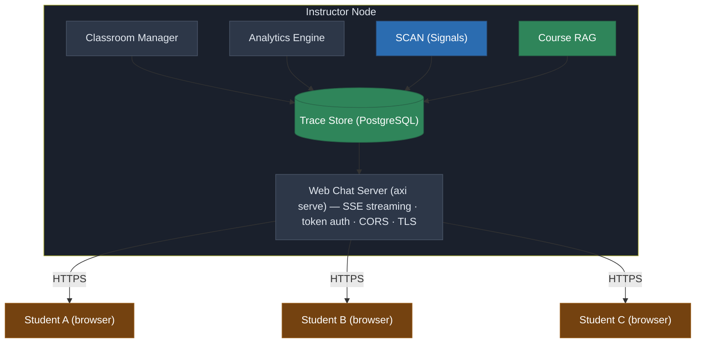

The instructor runs a single Axiom node with the classroom extension. Students connect via web browser (primary) or CLI (`axi chat --token <token>`) for advanced users who prefer a Claude Code-style terminal experience. Each student session is isolated but all traces flow to the instructor's trace store.

---

## 2. Component Design

### 2.1 LLM Tracing — Provider Architecture

**Design:** Factory/Provider pattern. Axiom defines a `TraceProvider` protocol; concrete implementations wrap specific backends. Langfuse is the default (self-hosted, Apache 2.0). LangSmith is supported as an alternative for teams that prefer it.

**Location:** `axiom/src/axiom/infra/tracing/`

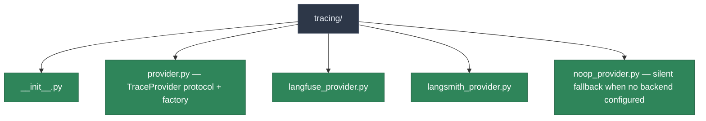

**Protocol:**

```python
from typing import Protocol, Any

class TraceProvider(Protocol):
    """Abstract LLM trace backend."""

    def start_trace(
        self,
        *,
        trace_id: str,
        session_id: str,
        user_id: str | None = None,
        metadata: dict[str, Any] | None = None,
    ) -> None: ...

    def log_generation(
        self,
        *,
        trace_id: str,
        name: str,
        model: str,
        prompt_tokens: int,
        completion_tokens: int,
        latency_ms: int,
        cost_usd: float | None = None,
        metadata: dict[str, Any] | None = None,
    ) -> None: ...

    def log_retrieval(
        self,
        *,
        trace_id: str,
        query: str,
        chunks_used: int,
        top_score: float | None = None,
        corpus: str | None = None,
    ) -> None: ...

    def score(
        self,
        *,
        trace_id: str,
        name: str,
        value: float | str,
        comment: str | None = None,
    ) -> None: ...

    def flush(self) -> None: ...
```

**Factory:**

```python
def create_trace_provider(config: dict) -> TraceProvider:
    """Instantiate the configured trace backend.

    Config read from runtime/config/tracing.toml:
        [tracing]
        provider = "langfuse"  # or "langsmith" or "noop"

        [tracing.langfuse]
        host = "https://langfuse.<private-host>"  # or tunnel URL
        public_key = "pk-..."
        secret_key = "sk-..."    # or env: LANGFUSE_SECRET_KEY

        [tracing.langsmith]
        api_key = "ls-..."       # or env: LANGSMITH_API_KEY
        project = "axiom-classroom"
    """
    provider = config.get("provider", "langfuse")
    match provider:
        case "langfuse":
            from .langfuse_provider import LangfuseTraceProvider
            return LangfuseTraceProvider(**config.get("langfuse", {}))
        case "langsmith":
            from .langsmith_provider import LangSmithTraceProvider
            return LangSmithTraceProvider(**config.get("langsmith", {}))
        case "noop" | _:
            from .noop_provider import NoopTraceProvider
            return NoopTraceProvider()
```

**Langfuse provider (default):**

- Uses the `langfuse` Python SDK (`pip install langfuse`).
- Self-hosted Langfuse instance deployed on a self-hosted node alongside the chat server (Docker Compose: Langfuse + its own Postgres).
- Langfuse natively supports: traces, spans, generations (with token counts + cost), scores, sessions, users — all of which map directly to our classroom needs.
- Built-in dashboard covers most instructor needs out of the box (token usage, cost, latency, per-user breakdown).
- Data export via Langfuse API for research dataset builder.

**LangSmith provider (alternative):**

- Uses `langsmith` Python SDK.
- SaaS-hosted by LangChain. Data leaves our infrastructure — requires explicit opt-in and may complicate IRB.
- More polished UI, better prompt playground, but vendor-locked.
- Must be tested and kept green in CI, even if not the default deployment.

**Noop provider:**

- Silent no-op. Used in development, testing, or when tracing is explicitly disabled.
- Zero dependencies, zero overhead.

**Integration point:** Instrument `ChatAgent.turn()` in `chat/agent.py`. Before the LLM call, call `provider.start_trace()`. After the gateway returns, call `provider.log_generation()`. After RAG retrieval, call `provider.log_retrieval()`. This replaces the custom SQL trace table — we delegate storage entirely to the chosen backend.

The existing `infra/trace.py` already propagates `trace_id` and `session_id` via contextvars. We add `student_id` to that context when the web chat authenticates, and pass it as `user_id` to the provider.

**Classroom-specific enrichment:** The classroom extension registers a callback that adds scores and metadata after batch classification runs (interaction_type, learning_objectives_touched). Both Langfuse and LangSmith support attaching scores to existing traces by ID.

**Config example (`runtime/config/tracing.toml`):**

```toml
[tracing]
provider = "langfuse"

[tracing.langfuse]
host = "https://langfuse.<private-host>"  # or tunnel URL
public_key = "pk-lf-..."
# secret_key read from env: LANGFUSE_SECRET_KEY
```

### 2.2 Student Authentication

**Mechanism:** Pre-shared token per student. Instructor generates tokens during cohort enrollment:

```yaml
# students.yaml
course: "STEM 2026"
students:
  - name: "Student One"
    email: "student1@example.cz"
    id: "s01"
  - name: "Student Two"
    email: "student2@example.cz"
    id: "s02"
```

```bash
axi classroom create --manifest course.yaml --students students.yaml
# Outputs: 12 unique URLs like https://host:8766/chat?token=<base64(student_id:hmac)>
# Each URL is emailed or distributed to the student
# Students who prefer CLI: pip install axiom && axi chat --token <their_token>
```

**Token format:** `base64(student_id + ":" + HMAC-SHA256(student_id, course_secret)[:16])`. Validated server-side on every request. No passwords, no OAuth, no account creation. Tokens are revocable.

**Web chat auth flow:**
1. Student clicks their unique URL
2. Server validates token, sets `student_id` in the request context
3. All subsequent requests in that browser session carry the token (cookie or header)

### 2.3 Chat Interface — Open WebUI + Axiom Backend

Rather than building a chat UI from scratch, we deploy **Open WebUI** (MIT, 124K+ GitHub stars) as the student-facing web interface, connected to our Axiom backend via OpenAI-compatible API.

**Architecture:**

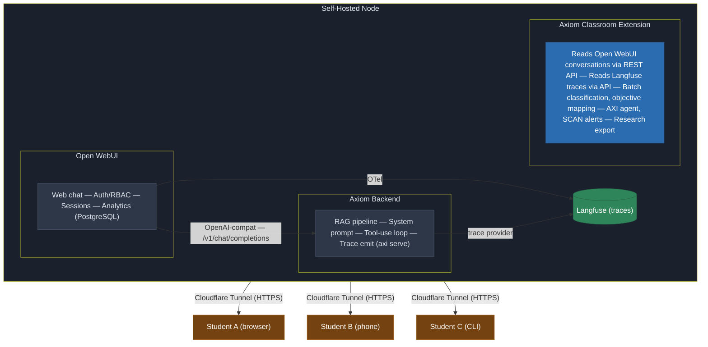

**What Open WebUI provides (we don't build):**
- Full-featured web chat UI: markdown, code highlighting, Mermaid, streaming
- Multi-user auth with RBAC (admin = instructor, user = student)
- Server-side sessions in PostgreSQL — cross-device continuity out of the box
- Multiple named conversations per student, searchable, with folders/tags
- Mobile-responsive, PWA-capable
- Per-user token usage analytics, activity timeseries (admin dashboard)
- OpenTelemetry export → Langfuse
- REST API for programmatic access to all conversation data
- Themeable (custom logo, CSS, system prompts per model)
- Single Docker container deployment

**What we build (Axiom backend + classroom extensions):**
- OpenAI-compatible API endpoint (`axi serve --openai-compat`) that wraps our RAG pipeline, tool-use loop, and trace emission
- Course/Classroom lifecycle management
- Structured Q&A engine (questionnaires)
- Batch classification, learning objective mapping
- AXI + SCAN classroom intelligence
- Research data export
- CLI access (`axi chat --remote <server>`)

**Open WebUI ↔ Axiom integration:**

1. **Model registration:** `axi classroom create` registers our Axiom backend as a model in Open WebUI (via its admin API). Students see it as their primary model (e.g., the consumer brand or the course name).
2. **User provisioning:** `axi classroom create` creates student accounts in Open WebUI with appropriate RBAC roles. Students get a URL + credentials (or magic link).
3. **System prompt injection:** The Course-defined system prompt is set as the model's default system prompt in Open WebUI. Per-student context (current week, objectives) is injected by the Axiom backend dynamically.
4. **Conversation data flow:** Open WebUI stores conversations in its PostgreSQL. Our classroom extension reads them via Open WebUI's REST API for batch classification, objective mapping, and export. We do NOT duplicate the conversation store.
5. **Trace data flow:** OpenTelemetry from Open WebUI + our Langfuse trace provider from the Axiom backend both feed into the same Langfuse instance. Langfuse is the single pane of glass for LLM observability.

**Branding (zero-fork):** Open WebUI's admin API supports full white-labeling without source modification. `axi classroom create` applies branding automatically during provisioning:

- **App name:** "Consumer Chat" (or per-Course branding, e.g., the course title)
- **Logo:** consumer / course logo uploaded via admin API
- **Favicon + PWA manifest:** Custom icon so mobile "Add to Home Screen" shows our branding
- **Custom CSS:** Injected via admin settings — accent colors, custom header bar, font stack. Stored as part of the Course definition so different Courses can have different branding (e.g., a course at one site vs. another).
- **Welcome message:** Course-specific greeting with syllabus link, instructor contact, and quick-start guidance
- **Model name:** Students see the consumer brand (or the Course name) as their model — never "GPT-4" or "Claude"

All branding is applied via Open WebUI's admin REST API — no fork, no custom Docker image, no merge conflicts on upstream updates. Branding config lives in the Course manifest:

```yaml
# course.yaml (branding section)
branding:
  app_name: "Consumer Chat"
  logo: "assets/course-logo.png"
  favicon: "assets/favicon.ico"
  accent_color: "#BF5700"          # course accent color
  custom_css: "assets/theme.css"
  welcome_message: |
    Welcome to the course AI Assistant.
    This tool is grounded in curated domain literature and your course materials.
    Start by asking a question about this week's topic.
```

**CLI access** remains first-class. `axi chat --remote <server>` connects directly to the Axiom backend (bypassing Open WebUI). Sessions created via CLI are traced in Langfuse identically to web sessions. CLI students don't get Open WebUI's conversation store — their sessions live in Axiom's own session store. The classroom extension reads from both sources.

### 2.4 Structured Q&A Engine

**Location:** `axiom/src/axiom/extensions/builtins/questionnaire/`

This is an Axiom-level primitive — not classroom-specific. It provides a conversational interview/survey experience comparable to Claude Cowork's guided workflows, but with structured data capture.

**Architecture:**

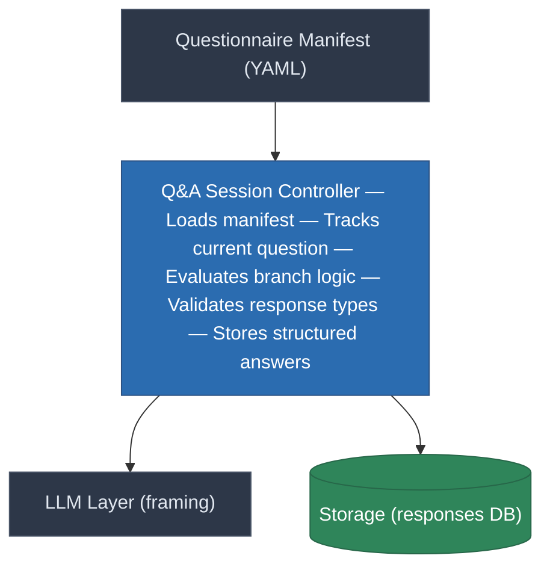

**How it works:**

1. **Manifest loading:** Instructor (or any admin) creates a questionnaire YAML with ordered questions, response types, and optional branching conditions.

2. **Session initiation:** Student navigates to the questionnaire (via web URL or `axi questionnaire start <id>` in CLI). The controller loads the manifest and begins.

3. **Conversational framing:** The LLM wraps each static question in natural, conversational language. It doesn't invent questions — it presents the fixed question warmly, acknowledges the previous answer, and transitions naturally. This is the key differentiator from a Google Form: the experience *feels* like a conversation, but the data is as structured as a spreadsheet.

4. **Response validation:** When the manifest specifies `type: likert_scale(1-5)`, the controller extracts the numeric value from the student's natural language response (e.g., "I'd say about a 4" → `4`). If ambiguous, the LLM asks a gentle clarifying follow-up.

5. **Optional probes:** If `allow_probes: true`, the LLM may ask one follow-up probe per question to elicit richer qualitative data. Probes are tagged separately in the response data so researchers can distinguish core vs. probe responses.

6. **Completion:** On final question, the LLM provides a warm thank-you and summary. The controller marks the questionnaire as complete for that student.

**Data model:**

```sql
CREATE TABLE questionnaire_responses (
    response_id     TEXT PRIMARY KEY,
    questionnaire_id TEXT NOT NULL,
    student_id      TEXT NOT NULL,
    question_id     TEXT NOT NULL,
    response_raw    TEXT,              -- student's verbatim text
    response_typed  JSONB,            -- parsed: {"value": 4} or {"value": "yes"}
    probe_response  TEXT,             -- follow-up probe answer, if any
    timestamp       TIMESTAMPTZ NOT NULL,
    turn_index      INTEGER,          -- position in the conversation
    UNIQUE (questionnaire_id, student_id, question_id)
);
```

**CLI:**

```bash
axi questionnaire create --manifest interview.yaml
axi questionnaire status --id begin-of-course-interview    # completion matrix
axi questionnaire export --id begin-of-course-interview --format csv
```

**Reuse beyond classrooms:** This engine is useful for onboarding interviews, user research, feedback collection, intake forms, post-incident debriefs — anywhere you want structured data gathered through a conversational interface. The classroom module simply registers specific questionnaires (begin/end interviews, NPS survey) and wires them into the cohort lifecycle.

### 2.5 Artifact Registry — Shared Infrastructure with Model Corral

Course definitions and Model Corral entries share the same fundamental platform need: a **versioned artifact with manifest, schema validation, lifecycle, storage, registry, and federated distribution**. Rather than building Course infrastructure from scratch, we extract the common pattern from Model Corral into a generic Axiom-level `ArtifactRegistry` and make both Model Corral and Course consumers of it.

**Location:** `axiom/src/axiom/infra/artifact_registry/`

```mermaid
flowchart TB
    AR["artifact_registry/"]
    INIT["__init__.py"]
    REG["registry.py — ArtifactRegistry[T] — generic typed registry"]
    VER["version.py — ArtifactVersion — semver + checksum + storage_path"]
    LIFE["lifecycle.py — Re-export of StatusMachine"]
    DISC["discovery.py — ThreeTierDiscovery — builtin / user / project shadow resolution"]
    PACK["pack.py — ArtifactPack — .axiompack creation, install, verification"]
    SHARE["sharing.py — ArtifactSharingService — federation share/receive"]
    SRC["source.py — ArtifactSource Protocol — priority-merge pattern"]

    AR --> INIT
    AR --> REG
    AR --> VER
    AR --> LIFE
    AR --> DISC
    AR --> PACK
    AR --> SHARE
    AR --> SRC

    style AR fill:#2d3748,color:#e2e8f0,stroke:#4a5568
    style INIT fill:#2f855a,color:#fff,stroke:#276749
    style REG fill:#2f855a,color:#fff,stroke:#276749
    style VER fill:#2f855a,color:#fff,stroke:#276749
    style LIFE fill:#2f855a,color:#fff,stroke:#276749
    style DISC fill:#2f855a,color:#fff,stroke:#276749
    style PACK fill:#2f855a,color:#fff,stroke:#276749
    style SHARE fill:#2f855a,color:#fff,stroke:#276749
    style SRC fill:#2f855a,color:#fff,stroke:#276749
```

**What already exists in `axiom.infra` (reuse directly):**
- `validate_yaml_schema(data, schema)` — Level 1 JSON Schema validation
- `parse_semver` / `compare_semver` — version comparison
- `StatusMachine` — configurable lifecycle state transitions
- `StorageProvider` ABC — upload/download/list/delete (local, S3, SeaweedFS)
- `.axiompack` format — gzipped tar + SHA256SUMS

**What gets extracted from Model Corral into the generic layer:**
- 3-tier discovery (builtin → user → project, with shadow resolution)
- `MaterialSource` Protocol → generalized to `ArtifactSource` Protocol with priority merge
- `MaterialRegistry` → `ArtifactRegistry[T]` with typed artifact metadata
- `ModelVersion` / `ModelRegistry` DB pattern → `ArtifactVersion` / `ArtifactRegistryEntry` generic DB models
- `ModelSharingService.share_model()` / `receive_model()` → `ArtifactSharingService`
- Access tier enforcement (public / restricted / export_controlled)

**Generic Protocol:**

```python
from typing import Protocol, TypeVar, Generic

T = TypeVar("T")  # Artifact metadata type (ModelManifest, CourseManifest, etc.)

class ArtifactSource(Protocol[T]):
    """Pluggable source for discovering artifacts. Priority-merge pattern."""
    @property
    def priority(self) -> int: ...
    def list(self) -> list[T]: ...
    def get(self, artifact_id: str, version: str | None = None) -> T | None: ...

class ArtifactRegistry(Generic[T]):
    """Multi-source registry with priority-based shadowing."""
    def __init__(self, sources: list[ArtifactSource[T]]): ...
    def register(self, artifact: T, files: list[Path]) -> ArtifactVersion: ...
    def resolve(self, artifact_id: str, version: str | None = None) -> T: ...
    def search(self, **filters) -> list[T]: ...
    def publish_pack(self, artifact_id: str, version: str) -> Path: ...  # → .axiompack
    def install_pack(self, pack_path: Path) -> T: ...
    def share(self, artifact_id: str, peer_node_id: str) -> None: ...
```

**Consumer mapping:**

| Generic | Model Corral (a domain consumer) | Classroom (Axiom) |
|---------|------------------------|-------------------|
| `ArtifactRegistry[T]` | `ArtifactRegistry[ModelManifest]` | `ArtifactRegistry[CourseManifest]` |
| `ArtifactSource[T]` | `BuiltinModelSource`, `FederationModelSource` | `BuiltinCourseSource`, `FederationCourseSource` |
| `ArtifactVersion` | `ModelVersion` (+ `model_lineage`, `model_validations`) | `CourseVersion` (+ `course_lineage`) |
| `.axiompack` | Contains model files + `model.yaml` | Contains `course.yaml` + questionnaire manifests + corpus refs |
| `StatusMachine` states | draft→review→production→deprecated→archived | draft→review→published→deprecated→archived |
| Access tiers | public / site / export_controlled | public / institutional / restricted |
| Lineage | fork, derived, trained_from | forked_from, adapted_from, translated_from |
| CLI | `<consumer> model {add, validate, list, share, ...}` | `axi course {create, validate, list, publish, share, ...}` |

**Impact on Model Corral:** This is a refactor, not a rewrite. `ModelCorralService` becomes a thin domain layer on top of `ArtifactRegistry[ModelManifest]`. The domain-specific logic (domain auto-detection, reduced-order-model tiers, solver bridges, domain-semantic lint rules) stays in the consumer layer. The generic registry, versioning, discovery, packing, and federation moves down to Axiom.

**Impact on timeline:** Extracting the generic layer adds ~2 days to the classroom work but saves time on every future artifact type (materials packs, site packs, data schemas, deployment configs — all follow the same pattern). It also cleans up a consumer → Axiom layering violation (Model Corral currently owns infrastructure patterns that belong in the platform).

### 2.6 Classroom Manager Extension

**Location:** `axiom/src/axiom/extensions/builtins/classroom/`

**Structure:**
```mermaid
flowchart TB
    CL["classroom/"]
    EXT["axiom-extension.toml"]
    CLI["cli.py — axi course create/publish + axi classroom create/status/export"]
    MOD["models.py — Course, Classroom, Cohort, Student, LearningObjective, Assessment"]
    MGR["manager.py — Orchestrates enrollment, Open WebUI provisioning, manifest parsing"]
    OWC["openwebui_client.py — REST API client for Open WebUI"]
    ANA["analytics.py — Query engine over trace store"]
    CLS["classifier.py — Batch LLM classification of sessions"]
    INT["interviews.py — Registers begin/end questionnaires into cohort lifecycle"]
    DASH["dashboard.py — Terminal dashboard (rich tables) for instructor"]
    EXP["export.py — Research dataset export (parquet, CSV, anonymized)"]

    CL --> EXT
    CL --> CLI
    CL --> MOD
    CL --> MGR
    CL --> OWC
    CL --> ANA
    CL --> CLS
    CL --> INT
    CL --> DASH
    CL --> EXP

    style CL fill:#2d3748,color:#e2e8f0,stroke:#4a5568
    style EXT fill:#2f855a,color:#fff,stroke:#276749
    style CLI fill:#2f855a,color:#fff,stroke:#276749
    style MOD fill:#2f855a,color:#fff,stroke:#276749
    style MGR fill:#2f855a,color:#fff,stroke:#276749
    style OWC fill:#2f855a,color:#fff,stroke:#276749
    style ANA fill:#2f855a,color:#fff,stroke:#276749
    style CLS fill:#2f855a,color:#fff,stroke:#276749
    style INT fill:#2f855a,color:#fff,stroke:#276749
    style DASH fill:#2f855a,color:#fff,stroke:#276749
    style EXP fill:#2f855a,color:#fff,stroke:#276749
```

**CLI verbs:**

```bash
axi classroom create --manifest course.yaml --students students.yaml
axi classroom status                    # cohort overview
axi classroom student s01              # per-student detail
axi classroom objectives               # learning objective coverage matrix
axi classroom classify --batch          # run batch classification on unclassified sessions
axi classroom export --format parquet --anonymize --output ./research_data/
axi classroom quiz import --file quiz1_scores.csv --assessment pre
axi classroom survey import --file nps_survey.csv
```

### 2.7 Course Manifest

```yaml
# course.yaml
title: "Introduction to Thermodynamics"       # example — any STEM domain
code: "THERMO-2026"
duration_weeks: 4
instructors:
  - name: "Dr. Smith"
    email: "smith@university.edu"
    role: lead
  - name: "Dr. Jones"
    email: "jones@university.edu"
    role: co-instructor

learning_objectives:
  - id: LO-1
    title: "First law of thermodynamics"
    description: "Apply conservation of energy to closed and open systems"
    keywords: ["first law", "internal energy", "enthalpy", "work", "heat"]
    week: 1
  - id: LO-2
    title: "Second law and entropy"
    description: "Understand entropy, reversibility, and the Carnot cycle"
    keywords: ["entropy", "reversible", "irreversible", "Carnot", "second law"]
    week: 2
  # ... etc

assessments:
  - id: pre-quiz
    type: quiz
    format: pencil_and_paper
    week: 0
    description: "Baseline domain knowledge assessment"
  - id: mid-quiz
    type: quiz
    format: pencil_and_paper
    week: 2
  - id: post-quiz
    type: quiz
    format: pencil_and_paper
    week: 4
  - id: exit-survey
    type: survey
    format: online
    week: 4
    questions:
      - "On a scale of 1-10, how likely are you to recommend this AI learning assistant to a peer? (NPS)"
      - "Did you find the AI assistant useful for learning? (1-5)"
      - "How did it compare to using ChatGPT or Claude directly? (worse / same / better)"
      - "What was the most helpful thing the assistant did?"
      - "What was the most frustrating thing?"

rag_corpus:
  sources:
    - path: "progression_problems/"
      corpus: rag-org
    - path: "course_materials/"
      corpus: rag-org
  packs:
    - "stem-thermo-v1"   # .axiompack distributed to students
```

### 2.8 Interaction Classifier

**Approach:** Batch classification, not real-time. Runs nightly (or on-demand via `axi classroom classify`).

**Implementation:** For each unclassified session, send a summary prompt to a cheap/fast model (Haiku or GPT-4o-mini):

```
Classify this student-AI conversation into one of:
- q_and_a: Student asks factual questions
- generative: Student asks AI to produce an artifact (specify type)
- exploratory: Open-ended conceptual exploration  
- debugging: Troubleshooting errors or unexpected results
- fun: Off-topic or social interaction

Also list which learning objectives (from the provided list) were touched.

Conversation:
{session_summary}

Learning objectives:
{objectives_list}
```

Cost: ~$0.01 per session classification. For 12 students x 4 weeks x ~5 sessions/day = ~1680 classifications = ~$17.

### 2.9 SCAN Integration — Instructor Alerts

SCAN already has extractors and a signal pipeline. We add a new extractor: `classroom_extractor.py`.

**Signals emitted:**
- `student_stuck`: Student has asked >5 turns on the same narrow topic without apparent resolution.
- `misconception_detected`: Student's question or the LLM's response contains a known misconception pattern (maintained in course manifest or learned).
- `low_engagement`: Student hasn't interacted in >48 hours during an active course week.
- `high_engagement`: Student is using the system significantly more than cohort average (may indicate over-reliance).
- `objective_gap`: A learning objective has <20% coverage across the cohort at the expected week.

These surface through the existing `axi signal brief` flow. Instructor gets a daily classroom briefing.

### 2.10 Federation Topologies for Education

The federation architecture supports multiple classroom topologies. The Course/Classroom data model must not assume hub-and-spoke — it must work equally well in peer-to-peer configurations. The `ArtifactRegistry` (2.5) and federation identity system provide the foundation.

---

#### Topology A: Hub-and-Spoke (pilot deployment — MVP)

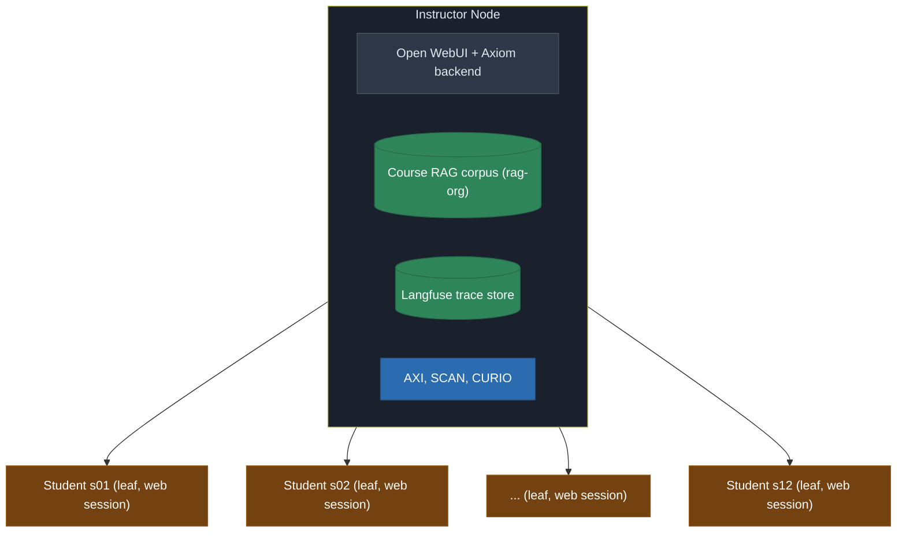

Students are thin leaves — web sessions managed server-side. The instructor owns all infrastructure. Simple to deploy, simple to manage, appropriate for a single classroom at a single site.

**What federation buys us even here:**
1. **Knowledge pack distribution:** Instructor publishes updated `.axiompack` mid-course; students get it on next session start.
2. **Identity:** Each student has a node identity (Ed25519 keypair generated server-side). Cryptographic attribution of interactions.
3. **Peer monitoring:** TIDY tracks student session liveness.
4. **Research narrative:** A 13-node federated deployment is publishable architecture.

---

#### Topology B: Multi-Institution Shared Course

**Scenario:** Two institutions (Institution A and Institution B) co-teach the same course. The instructor teaches from one site, a colleague at the other institution teaches locally. Both use the same Course definition. Students at each site should get local-latency responses grounded in the same corpus, but each institution retains sovereignty over their students' data.

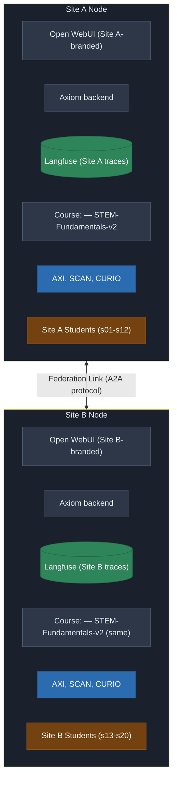

**What federates:**
- **Course definition** — shared via `ArtifactRegistry`. Both nodes run the same `course.yaml` manifest, same learning objectives, same assessment schedule. One institution publishes updates; the other pulls.
- **Knowledge packs** — the course corpus (`.axiompack`) is distributed via federation. Both nodes have identical RAG corpora. CURIO at each node validates coverage independently.
- **Aggregated analytics** — each AXI computes local cohort metrics. On instructor request, federated aggregate statistics are computed across nodes: combined n=20 for stronger statistical power, compared without sharing individual student data. Each node sends only: per-objective mastery rates, score distributions (histogram bins, not individual scores), engagement aggregates, CURIO corpus quality metrics.
- **CURIO quality signals** — if Site B's CURIO detects a corpus gap (students asking about topic X with low retrieval relevance), that signal federates to Site A's node. The Course maintainer can push a corpus update that both nodes receive.

**What does NOT federate:**
- Individual student sessions, traces, or quiz scores — these stay on the institution's node
- Student identities — each institution manages its own roster
- Instructor evaluations — local only

**Research value:** "We conducted a federated multi-institution study of AI-assisted STEM education across two sites (n=20) without centralizing student data." This is a novel contribution to both education research and federated learning architecture.

---

#### Future Vision Topologies

> The following topologies are not required for MVP but inform the data model design.

#### Topology C: Student-as-Peer (Advanced/Graduate)

**Scenario:** A PhD qualifying exam preparation group. Five graduate students each run their own Axiom node on their laptop. They federate to share a common corpus of qualifying exam study materials, but each student also indexes their own notes, papers, and research materials. No central instructor — they're a study group.

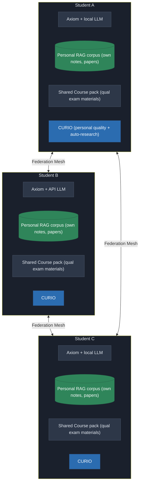

**What federates:**
- **Knowledge packs** — the shared qual exam corpus. Any student can propose an addition (a paper they found relevant). Other nodes receive it, CURIO validates quality, and the pack updates propagate.
- **Auto-research findings** — when Student A runs a CURIO auto-research query on "Monte Carlo variance reduction techniques," the synthesized output (with citations) can be shared to the federation as a knowledge artifact. Other students get it in their corpus, with provenance showing who produced it and when.
- **Study group signals** — SCAN signals can be shared: "Student B found a useful resource on perturbation theory" surfaces to all peers.
- **Learned patterns** — CURIO's learned quality patterns (GREEN-confidence) propagate across the mesh, improving retrieval quality for everyone.

**What does NOT federate:**
- Personal notes and private research materials (each student controls their sharing boundary)
- Individual session history
- Personal CURIO retrieval profiles

**Design implication for Course/Classroom model:** In this topology there is no Classroom — only a Course (the shared qual exam study guide) and a federation of peer nodes consuming it. The Course is the `ArtifactRegistry` artifact; the federation handles distribution. No AXI (no instructor), no enrollment workflow. The Course is a purely knowledge artifact, consumed voluntarily.

---

#### Topology D: Cascaded Instructor Training ("Train the Trainer")

**Scenario:** An authoring institution develops a Course. The instructor trains instructors at three partner universities to teach it. Each trained instructor then runs their own Classroom with their own students. The instructor wants to see aggregate outcomes across all sites without accessing individual student data.

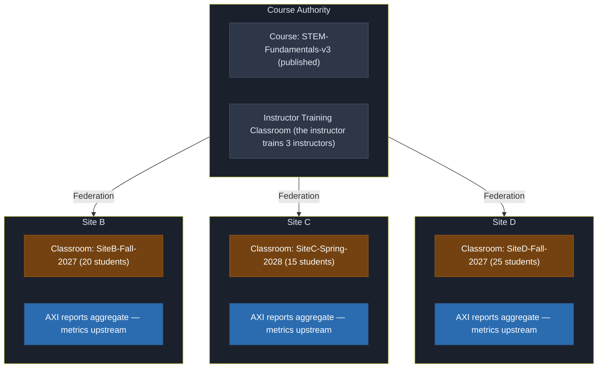

**What federates:**
- **Course artifact** — the authoring institution publishes, downstream institutions pull. Version pinning ensures consistency within a semester; instructors upgrade between semesters.
- **Aggregate outcome data** — each site's AXI sends anonymized aggregate metrics to the Course authority: quiz score distributions, objective mastery rates, CURIO corpus quality, engagement patterns. The authoring institution can compute cross-site meta-analysis (n=60 combined).
- **Course improvements** — when the authoring institution updates the Course based on aggregated feedback (new materials, revised objectives, fixed misconception patterns), downstream institutions receive the update via `ArtifactRegistry` federation.
- **CURIO quality intelligence** — if all three sites report low retrieval relevance on the same learning objective, that's a strong signal the Course corpus needs improvement. CURIO at the Course authority node can aggregate quality signals across sites.

**What does NOT federate:**
- Individual student data (stays at each institution)
- Instructor evaluations (stays local)
- Site-specific customizations (local additions to the corpus, adapted system prompts)

**Research value:** "We conducted a multi-site, multi-semester study of AI-assisted STEM education across 4 institutions (n=60+) using a federated course distribution and aggregate analytics model." This is a genuinely novel contribution — no existing AI-in-education platform supports this.

---

#### Design Constraints from These Topologies

The Course/Classroom data model must satisfy all four:

1. **Course is an `ArtifactRegistry` artifact** — versioned, shareable, forkable. Works in all topologies.
2. **Classroom is always scoped to a single node** — it owns its students, traces, and scores. Never shared directly. Only aggregates federate.
3. **Federation is optional at every layer** — Topology A works with zero federation. Topology C works with zero Classrooms. The components are composable, not coupled.
4. **Aggregate metrics have a standard schema** — so that AXI at any node can produce comparable reports, and a Course authority can combine them. Define the `ClassroomMetricsAggregate` message format in the A2A protocol.
5. **CURIO quality signals federate independently of student data** — corpus quality is about the Course, not the students. It can flow freely across the federation without privacy concerns.
6. **Identity is per-node, not per-Classroom** — a student who participates in Topology C and Topology A has two separate identities at two separate nodes. No global student identity.

### 2.10a External-Workflow Integration Points (Adoption Strategy)

Axiom must be usable from the tools instructors and students already
love without forcing them to switch. PRD §10 formalizes the adoption
strategy; this section lists the architectural commitments.

**MCP server surface (`axiom.extensions.builtins.classroom.mcp`):**

Every classroom capability exposed as a deterministic CLI verb also
ships as a namespaced MCP tool:

- `mcp__axiom_classroom__cohort_status` — active students, signal counts,
  queue depths.
- `mcp__axiom_classroom__student_trace` — per-student trace retrieval
  + metrics view.
- `mcp__axiom_classroom__stuck_students` — SCAN-surfaced stuck-student
  signals.
- `mcp__axiom_classroom__grade_queue` — free-text grading queue entries
  (read + update via LLM-assisted suggestion).
- `mcp__axiom_classroom__signal_brief` — daily instructor briefing
  (auto-compiled; one-shot).
- `mcp__axiom_classroom__compare_answers` — side-by-side student-answer
  comparison for a given question (a capability Claude cannot provide
  even in principle).
- `mcp__axiom_classroom__grade_explain` — one-click provenance trace
  of what informed a student's score.

**Auto-MCP generation (platform-wide commitment):**

Any extension declaring MCP-exposable functions in its
`axiom-extension.toml` gets its MCP server generated + kept in sync
via a compilation step (analogous to TypeScript emit or protobuf
codegen). Extension builders never hand-write MCP boilerplate. The
same compilation emits extension documentation from the same source
of truth so code, MCP tool schemas, and docs never drift.

**IDE / shell / terminal integration:**

- Claude Code: via the MCP surface above.
- VS Code extension: grading queue, trace overlays, jump-to-student-
  context from source comments.
- tmux status line: cohort pulse widget (`axi classroom pulse --tmux`).
- Shell completion for `axi classroom *` in zsh/bash/fish.

**Agent self-managed runtime + health:**

Every agent (AXI, SCAN, CURIO, TIDY, PRESS, TRIAGE) inherits a
uniform health contract:

- `/health` endpoint + vitals (uptime, memory, last-tool-call, error
  rate, queued-work depth).
- Bounded-retry self-restart on crash.
- Federation-aware status: peer nodes see one another's agent health
  over the A2A protocol.
- TIDY is the meta-steward. Other agents delegate watchdog logic to TIDY
  via signal callbacks.

This enables the "zero-babysitting classroom" promise — a structural
differentiator versus tools that require human intervention to recover
from failures.

### 2.11 Research Data Export

**`axi classroom export` produces:**

```mermaid
flowchart TB
    RD["research_data/"]
    F1["interactions.parquet — All turns, anonymized"]
    F2["sessions.parquet — Session-level summaries"]
    F3["students.parquet — Per-student aggregates (pseudonymized)"]
    F4["quiz_scores.csv — Pre/mid/post scores"]
    F5["survey_responses.csv — Exit survey"]
    F6["classifications.parquet — Session classifications"]
    F7["rag_quality.parquet — Per-turn RAG retrieval metrics"]
    F8["objectives_coverage.csv — Student x objective matrix"]
    F9["metadata.json — Course info, dates, model used, corpus version"]
    F10["codebook.md — Column descriptions for reproducibility"]

    RD --> F1
    RD --> F2
    RD --> F3
    RD --> F4
    RD --> F5
    RD --> F6
    RD --> F7
    RD --> F8
    RD --> F9
    RD --> F10

    style RD fill:#2d3748,color:#e2e8f0,stroke:#4a5568
    style F1 fill:#2f855a,color:#fff,stroke:#276749
    style F2 fill:#2f855a,color:#fff,stroke:#276749
    style F3 fill:#2f855a,color:#fff,stroke:#276749
    style F4 fill:#2f855a,color:#fff,stroke:#276749
    style F5 fill:#2f855a,color:#fff,stroke:#276749
    style F6 fill:#2f855a,color:#fff,stroke:#276749
    style F7 fill:#2f855a,color:#fff,stroke:#276749
    style F8 fill:#2f855a,color:#fff,stroke:#276749
    style F9 fill:#2f855a,color:#fff,stroke:#276749
    style F10 fill:#2f855a,color:#fff,stroke:#276749
```

**Anonymization:** `student_id` → deterministic pseudonym (`Student_A`, `Student_B`, ...). Mapping stored separately, never exported. Free-text responses reviewed by instructor before export.

---

## 3. Agent Skills — Complete Updated Registry

This section specifies the full Axiom agent skill set, including new classroom capabilities. Domain-specific extensions (e.g., a domain consumer) may add additional agent skills at their layer.

### 3.1 AXI (Loop + Chat — The Protagonist)

AXI is the Loop agent AND the Chat agent in the REPL framework. He is the protagonist — the agent users talk to. A consumer layer may rebrand AXI under its own name; they are the same agent. In the Axiom layer, the agent is AXI. When a consumer layer presents the chat interface, it brands AXI as its own name.

**Chat skills:**
- Multi-turn conversational chat with RAG
- Tool-use loop (up to 10 rounds) with ApprovalGate
- Mode switching (Ask / Plan / Agent)
- Session persistence and replay
- Domain detection and system prompt injection (consumer layers register domain-specific prompts)
- **Student context injection:** When `student_id` is set, inject student profile (topics covered, current week, relevant objectives) into system prompt. Domain-specific persona traits are provided by consumer layers (e.g., a domain consumer adds its own domain context), not hardcoded here.
- **Trace emission:** Emit `llm_traces` record after every turn.
- **Guardrail: answer provenance:** When in classroom mode, always cite which RAG chunk or source informed the answer. Students must learn to verify, not blindly trust.

**Classroom lifecycle skills (WF-1 through WF-11):**

- **Enrollment orchestration (WF-1):** Provisions student accounts in Open WebUI, generates access credentials, distributes syllabus (delegates to PRESS for document generation), syncs roster with Canvas API if configured.
- **Onboarding tracking (WF-2):** Manages per-student onboarding checklists (syllabus read, interview completed, pre-course work done, consent acknowledged). Reports readiness status to instructor. Enforces completion of required items before marking a student ready.
- **Assessment administration (WF-3):** Activates quiz questionnaires at scheduled times, enforces time limits and deadlines, imports external quiz scores from CSV. Supports "quiz mode" (RAG-disabled, helpfulness-disabled system prompt) for in-platform assessments.
- **Scoring support (WF-4):** Auto-scores objective questions, presents free-response scoring queue to instructor with LLM-suggested scores, computes aggregate statistics, pushes grades to Canvas via API.
- **Check-in facilitation (WF-5):** Sends scheduled weekly check-in questionnaires to students, compiles student briefings on instructor request, surfaces SCAN signal context alongside check-in responses.
- **Help request / remediation (WF-6):** Detects formal help escalations from students, creates structured help tickets, notifies instructor, builds and monitors remediation plans (additional readings, practice problems, follow-up milestones).
- **Drop/withdrawal processing (WF-7):** Conducts exit interview (abbreviated end-of-course Q&A), deactivates Open WebUI account, flags data as `withdrawn` for research, updates roster and Canvas sync.
- **Instructor/TA management (WF-8):** Provisions new instructor/TA accounts with appropriate RBAC, transfers Classroom ownership, generates onboarding briefs for new staff, logs role changes to audit trail.
- **Course review orchestration (WF-9):** Initiates end-of-course instruments (exit interview, post-quiz, course review, instructor evaluation, AI evaluation). Tracks completion, sends reminders, anonymizes instructor-facing results, transitions Classroom through `completing → completed → archived`.
- **Submission management (WF-10):** Accepts student work submissions (from session content, uploaded files, or both). Validates against assignment rubric (deadline, required components, file type). Tracks submission state (`draft → submitted → grading → graded → returned`). Manages version history for resubmissions. Enforces late policies. Presents grading queue to instructor with CURIO integrity analysis and LLM-suggested scores. Returns graded work with feedback. Pushes grades to Canvas.
- **Presentation orchestration (WF-11):** Manages presentation lifecycle: submission → classroom publishing → live/async Q&A → peer feedback → grading → archive. Creates classroom-scoped shared space for presentation materials. Facilitates async Q&A discussion sessions. Sends peer feedback questionnaires (anonymized to presenter). Archives presentation + feedback + Q&A as classroom artifact. Flags high-quality presentations for corpus enrichment (CURIO indexes them).

**Analytics & intelligence skills:**

- **Engagement monitoring:** Continuous (heartbeat-driven) monitoring of student activity patterns.
- **Objective mapping:** After each session, maps interactions to learning objectives.
- **Batch classification:** Runs nightly classification of unclassified sessions.
- **Progress reporting:** Generates per-student and cohort progress summaries on demand or on schedule.
- **Misconception detection:** Maintains and applies misconception patterns (learned from instructor corrections).
- **Adaptive prompting:** Adjusts system prompt based on student's demonstrated knowledge level (e.g., "this student has mastered LO-1 through LO-3, focus explanations on LO-4 concepts").

**Extension manifest:**
```toml
[extension]
name = "wall_e_agent"
kind = "agent"
version = "0.1.0"

[agent]
startup = "lazy"          # activated when classroom is created
heartbeat_interval = 600  # 10 min
cli_noun = "classroom"
```

> **Note:** AXI's workflow coordination requires a task queue and state machine to manage concurrent workflows across multiple students. Detailed internal architecture is deferred to a dedicated AXI design spec.

### 3.2 SCAN (Signal Agent)
Existing skills:
- Extract signals from voice, Teams, GitHub, GitLab, calendar, OneDrive, transcripts, feedback, freetext
- Correlate signals to people and initiatives
- Synthesize briefings
- Signal RAG

**New skills for classroom:**
- **Classroom extractor:** Monitor trace store for student_stuck, misconception, engagement anomalies.
- **Daily classroom briefing:** Summarize cohort activity, flag concerns, show objective coverage delta from previous day.

### 3.3 TIDY (Infrastructure Steward)
Existing skills:
- Vitals monitoring, scratch management, retention, repo hygiene
- Infra provisioning (Terraform + Helm)
- Peer liveness in federation
- Model management

**New skills for classroom:**
- **Student session liveness:** Track which students are currently active.
- **Cost monitor:** Alert instructor when daily LLM spend exceeds threshold.
- **Trace store health:** Ensure trace records are being written (no silent data loss).

### 3.4 PRESS (Publisher + Content Gate)
Existing skills:
- Markdown → DOCX generation
- Push/pull to OneDrive/Box
- @axi comment handling
- Bidirectional reconciliation
- **Content gate (absorbed from retired Mirror agent):** PRESS now owns the content review gate — validating that published artifacts meet quality, formatting, and policy standards before they leave the system. This includes access-tier enforcement, export-control checks, and branding compliance.

**New skills for classroom:**
- **Report generation:** `axi classroom report --week 2` → generates a formatted DOCX report of cohort progress, suitable for sharing with department or including in paper appendix.
- **Paper scaffold:** `axi pub generate --template research-paper` → generates a LaTeX/DOCX scaffold pre-populated with methodology, data tables from the classroom export, and placeholder analysis sections.

### 3.5 RIVET (Release/CI Agent)
No new classroom skills. Existing skills unchanged.

### 3.6 CURIO (Eval — Autonomous Research Agent)

CURIO is Axiom's **autonomous research engine** — it discovers, reads, synthesizes, and validates knowledge. Its core identity is *research*, not quality assurance. The classroom module is the proving ground for making autoresearch a first-class runtime primitive that every Axiom-enabled framework can use.

See `docs/prds/prd-auto-research.md` for the full CURIO PRD. This section describes how CURIO's autoresearch primitives apply in the classroom context.

**Core autoresearch primitives (exist / being built — not classroom-specific):**
1. **Discover** — find relevant sources across corpora, external indices, and endpoints
2. **Read/Extract** — deeply parse documents, extract claims, identify relationships, read images and tables
3. **Synthesize** — merge findings across sources into structured, citation-rich output
4. **Validate** — cross-reference claims, surface disagreements, flag unsupported assertions
5. **Promote** — feed validated findings back into the corpus (compound knowledge loop)

Existing secondary skills (RAG optimization):
- Chunking optimization
- Confidence gating
- Quality gating

#### CURIO in the Classroom: Three Scales of Autoresearch

**a) Individual learner — autoresearch as a learning tool:**

The most important capability students learn during onboarding (Section 5.6). A student says "Research the current state of accident-tolerant fuel cladding" and CURIO runs its full primitive chain: discover → read → synthesize → validate → produce a structured report with citations and source provenance.

- **During a course:** Students use autoresearch for literature review, deep dives beyond lecture material, comparing conflicting sources, and building annotated bibliographies. Every autoresearch invocation is traced (Langfuse) and classified (AXI) — so researchers can measure how autoresearch usage correlates with learning outcomes.
- **For assignments (WF-10):** Students can link their autoresearch outputs to submissions. The instructor sees not just the deliverable but the research process that produced it — which sources CURIO found, how the student evaluated them, what they kept and discarded.

**b) Instructor/Course author — autoresearch as a curriculum tool:**

- **Course corpus construction:** Instructor tells CURIO: "Research what's been published on [topic] since 2023 and recommend additions to the course corpus." CURIO discovers, reads, synthesizes, and produces a corpus update recommendation with quality assessment. The instructor reviews and approves; CURIO promotes accepted findings into the Course knowledge pack.
- **Course iteration between semesters:** CURIO can autonomously research whether the domain has evolved since the last Course version — new standards, new publications, retracted papers, updated methodologies. Produces a "what's changed" briefing for the Course author. This is the compound knowledge loop applied to education.
- **Misconception research:** Instructor says "Research common misconceptions students have about [topic]." CURIO synthesizes from education literature and seeds the course corpus with corrective material.

**c) Scaled multi-org — federated autoresearch:**

In federation Topologies B and D, CURIO agents at each institution research independently. Their findings federate as knowledge artifacts with full provenance:

- **Distributed literature review:** A multi-institution Course can distribute research tasks across nodes. Site A's CURIO researches one subtopic; Site B's CURIO researches another. Findings propagate via federation to all nodes, enriching the shared Course corpus.
- **Research artifact sharing:** When a student at one institution runs an autoresearch query that produces high-quality synthesis, CURIO can (with instructor approval) promote that artifact to the federated Course corpus. Future students at any institution benefit.
- **Cross-institutional validation:** CURIO at Node A discovers a claim. CURIO at Node B independently validates or contradicts it using different source material. The federated validation is stronger than either node alone.

#### What Moves to the Eval Framework

The following capabilities that were previously assigned to CURIO are better served by the **eval framework** (`prd-evals.md`), which uses CURIO's primitives but doesn't define CURIO's identity:

| Capability | Where it belongs | Why |
|-----------|-----------------|-----|
| Grounding verification | Eval framework (RAG eval, Level 2) | This is a quality metric, not research. `axi eval run --suite rag` checks grounding. |
| Retrieval precision/recall | Eval framework (RAG eval, Level 2) | Standard RAGAS-style eval metric. |
| AI attribution analysis | Eval framework (submission eval) | Transparency metric for grading, not a research activity. |
| Corpus coverage heatmap | AXI (calls CURIO's *discover* primitive) | AXI asks "does the corpus cover LO-7?" CURIO's discover primitive runs the retrieval. AXI interprets the result. |
| Retrieval failure detection | Eval framework + Langfuse | Detected via trace analysis (embedding similarity between consecutive turns), not a CURIO skill. |

#### CURIO ↔ Other Agents

- **CURIO ↔ AXI:** AXI is the classroom orchestrator. When AXI needs knowledge about the corpus ("is there a gap in LO-7?"), it invokes CURIO's discover primitive. When a student's submission needs source verification, AXI invokes CURIO's validate primitive. CURIO does the research; AXI decides what to do with the results.
- **CURIO ↔ SCAN:** SCAN detects signals ("students keep asking about topic X with low satisfaction"). CURIO responds by autonomously researching topic X and proposing corpus additions.
- **CURIO ↔ Eval framework:** The eval harness uses CURIO's validate primitive for grounding and faithfulness checks. Eval suites can trigger CURIO research to find reference answers for new eval cases.
- **CURIO ↔ Federation:** CURIO's research outputs are first-class federation artifacts — discoverable, shareable, promotable across nodes with provenance tracking.

### 3.7 TRIAGE (Diagnostics)
Existing skills:
- LLM-powered diagnosis
- Security scan
- Connection health
- Configuration audit

**New skills for classroom:**
- **Classroom health check:** `axi doctor --classroom` verifies: web endpoint reachable, TLS valid, all student tokens valid, trace store writable, RAG corpus indexed, LLM gateway responsive.

### ~~3.8 Mirror Agent~~ — RETIRED

Mirror's content gate function has been absorbed by PRESS (Section 3.4). Mirror is no longer a separate agent.

> **Also retired: SECUR-T.** Security scanning responsibilities are handled by TRIAGE's existing security scan skill.

---

## 4. Deployment Architecture for the Pilot Course

### Option A: Self-hosted node (org tower) with public tunnel (Recommended)

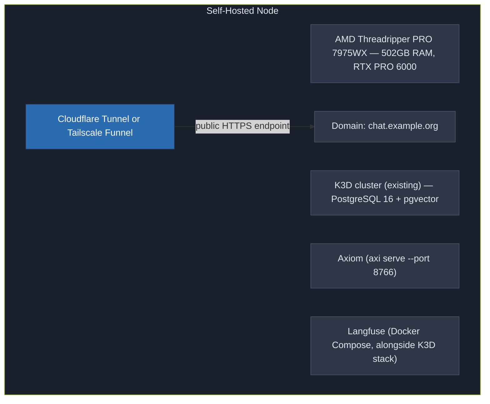

The node is a standalone tower on the org network — NOT on a shared HPC cluster. Currently requires a private-network VPN for access. For remote students to reach it, we need a tunnel to expose the web chat endpoint publicly over HTTPS.

**Pros:** Zero incremental hardware cost, massive headroom (502GB RAM, 64 threads), data stays on org infrastructure, existing Axiom deployment already running, Langfuse runs alongside. Can serve local LLM via the RTX 6000 if we want to avoid API costs entirely for some use cases.
**Cons:** Depends on org network uptime and tunnel reliability. Need to coordinate with the org IT/security contact on any firewall/policy changes.

**Tunnel options:**
- **Cloudflare Tunnel (`cloudflared`):** Free tier, no inbound ports needed, auto-TLS. The node runs a daemon that maintains an outbound connection to Cloudflare's edge. Students hit a `*.cfargotunnel.com` or custom domain.
- **Tailscale Funnel:** If we're already using Tailscale for VPN. Simpler setup but less battle-tested at scale.
- **Reverse SSH tunnel to a small cloud VM:** $5/tidy VPS acts as the public endpoint, tunnels traffic back to the node. More control, more moving parts.

### Option B: Cloud VM (fallback)

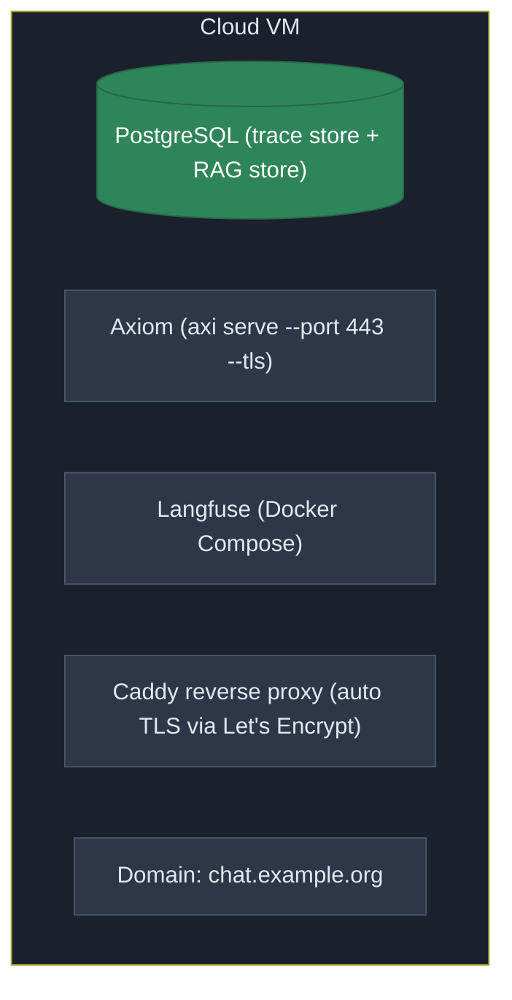

**Pros:** Reliable, accessible from anywhere, proper TLS, no tunnel dependency.
**Cons:** Monthly cost, data leaves org infrastructure, no GPU for local LLM, need to set up from scratch.

### Option C: Instructor laptop on classroom WiFi
**Pros:** Zero cost, lowest latency in classroom.
**Cons:** Fragile, no access outside class, no phone access for students. Not viable for cross-device continuity.

**Recommendation:** Option A (self-hosted node + tunnel). We already have a running Axiom deployment there. Budget a $5/tidy VPS as tunnel fallback. If the node proves unreliable during pre-class testing, promote Option B. LLM API costs are separate (~$200-500).

---

## 5. Data Flow

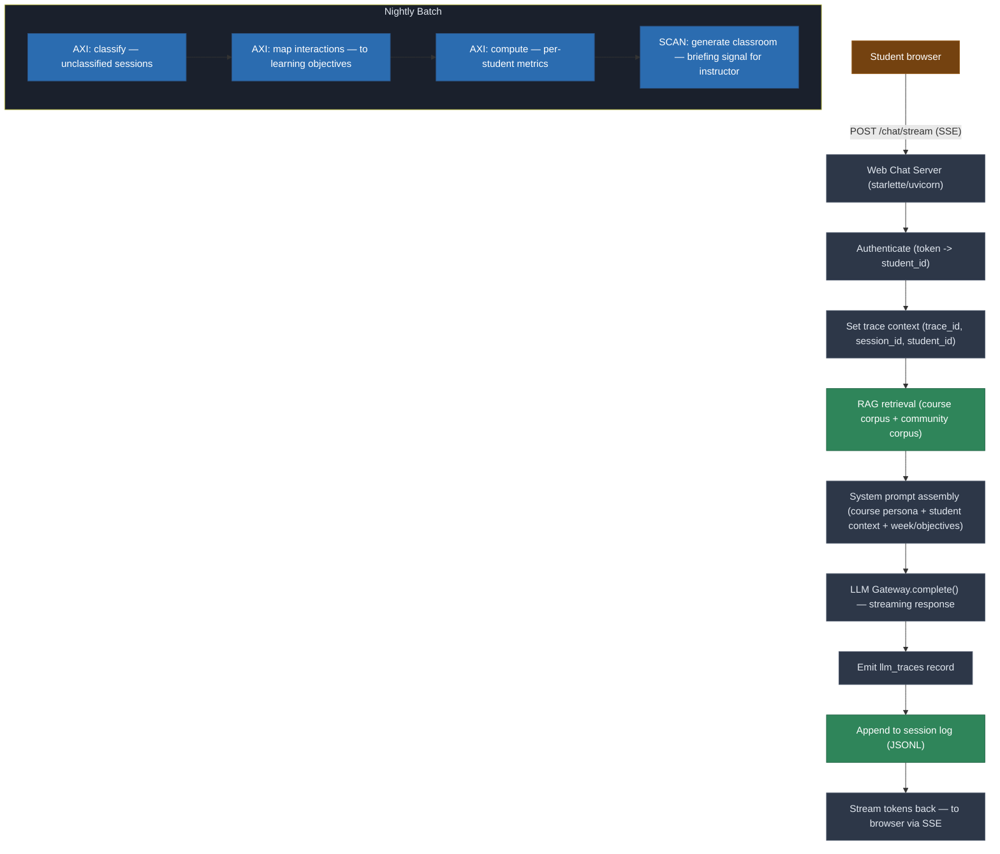

---

## 6. Testing Plan

### Before class:
1. **Load test:** Simulate 12 concurrent chat sessions using `locust` or simple async script. Verify <5s p95 latency.
2. **RAG quality test:** For each learning objective, submit 5 representative student questions. Verify relevant chunks are retrieved.
3. **Trace completeness test:** Run 100 chat turns, verify 100 trace records in DB.
4. **Auth test:** Verify token validation, rejection of invalid tokens, session isolation.
5. **Mobile test:** Access web chat from iPhone and Android. Verify usability.
6. **Instructor dashboard test:** Verify per-student and cohort views render correctly with sample data.
7. **Acceptance test:** A domain researcher uses the web chat for a day. Their feedback determines ship/no-ship.

### During class:
8. **Daily data check:** Verify traces are being written, no gaps, no orphaned sessions.
9. **Cost monitoring:** Daily LLM spend check.

### After class:
10. **Export validation:** Export dataset, load in pandas, verify schema and anonymization.

---

## 7. Implementation Priority

| Priority | Component | Effort | Dependency |
|----------|-----------|--------|------------|
| P0 | Trace provider protocol + factory + Langfuse impl | 2 days | None |
| P0 | LangSmith provider impl + integration test | 1 day | Provider protocol |
| P0 | Langfuse deployment on the self-hosted node (Docker Compose) | 1 day | None |
| P0 | Instrument ChatAgent.turn() with trace provider | 1 day | Provider protocol |
| P0 | Deploy Open WebUI on the self-hosted node (Docker) | 1 day | None |
| P0 | OpenAI-compatible endpoint in axi serve | 2 days | None |
| P0 | Open WebUI ↔ Axiom integration (model reg, user provisioning) | 1 day | Open WebUI + endpoint |
| P0 | Structured Q&A engine (questionnaire extension) | 3 days | Server upgrade |
| P1 | Extract ArtifactRegistry from Model Corral → axiom.infra | 2 days | None |
| P1 | Course manifest schema + ArtifactRegistry[CourseManifest] | 1 day | ArtifactRegistry |
| P1 | Course + Classroom extension scaffolding | 1 day | Course registry |
| P1 | Classroom instantiation (Course + cohort → Open WebUI provisioning) | 2 days | Extension + Open WebUI integration |
| P1 | Begin/end interview questionnaire manifests | 1 day | Q&A engine + Classroom |
| P1 | Per-student trace queries + dashboard | 2 days | Trace store |
| P2 | Batch classifier | 1 day | Trace store |
| P2 | Learning objective mapper | 2 days | Classifier |
| P2 | SCAN classroom extractor | 1 day | Trace store |
| P1 | AXI agent scaffold + enrollment/onboarding workflows (WF-1, WF-2) | 3 days | Classroom extension + Open WebUI |
| P2 | AXI assessment/scoring/check-in workflows (WF-3, WF-4, WF-5) | 3 days | AXI + Q&A engine |
| P2 | AXI help/drop/staff/review workflows (WF-6, WF-7, WF-8, WF-9) | 3 days | AXI |
| P2 | Federation leaf-node abstraction | 2 days | Federation |
| P3 | Research export | 1 day | All above |
| P3 | PRESS report generation | 1 day | Export |
| P3 | Knowledge pack for course materials | 1 day | RAG packs |
| P3 | Classroom archive lifecycle (completing → completed → archived) with grace period | 2 days | Classroom extension |
| P3 | Student harvest bundle generator (.axiompack) | 2 days | Archive lifecycle + ArtifactRegistry |
| P3 | Instructor harvest bundle (cohort anonymized dataset) | 1 day | Research export + archive |
| P3 | CURIO promotion candidate detection (findings, contradictions, patterns) | 3 days | Research loop engine + classroom |
| P3 | Promotion approval UI (CURIO proposes, instructor approves per-item) | 2 days | Candidate detection |
| P3 | Attribution chain persistence in RAG artifacts | 1 day | ArtifactRegistry |
| P4 (v3) | Alumnus record schema + creation on classroom completion | 2 days | Archive lifecycle + ArtifactRegistry + consent mgmt |
| P4 (v3) | Consent management infrastructure (granular, revocable, portable) | 3 days | ArtifactRegistry |
| P4 (v3) | Longitudinal survey scheduler (1yr/3yr/5yr triggers) | 2 days | Alumnus records + questionnaire engine |
| P4 (v3) | Alumnus CURIO agent hosting (scope limits, rate limits, silencing) | 4 days | Federation + @agent addressing + RACI |
| P4 (v3) | Alumni network federation at Course template level | 3 days | Federation protocol + alumnus records |
| P4 (v3) | Instructor alumni broadcast (agent-mediated, consent-gated) | 2 days | Alumni network + NL policy broadcasting |
| P4 (v3) | Attribution permanence + consent withdrawal model | 2 days | Attribution chain + consent mgmt |

**Total estimated effort:** ~27 engineering days. Open WebUI saves ~3 days of custom chat UI work and gives us a dramatically better student UX than we'd build ourselves in that time.

---

## 8. What Makes This Better Than ChatGPT/Claude

| Dimension | ChatGPT/Claude | Axiom Classroom (Open WebUI + Axiom backend) |
|-----------|---------------|----------------------------------------------|
| Domain knowledge | General training data only | Curated domain RAG corpus + course materials |
| Answer provenance | No citations | Every answer cites source chunks |
| Chat UX | Polished but closed | Open WebUI: equally polished, open-source, self-hosted, themeable |
| Cross-device | Account-based (ChatGPT); no sync (Claude) | Server-side sessions, seamless device switching, multiple named conversations |
| Instructor visibility | None — black box | Langfuse traces + Open WebUI analytics + classroom dashboards + daily SCAN briefings |
| Learning measurement | None | Objective coverage tracking, auto-classification, structured interviews |
| Misconception detection | None | SCAN signals + AXI pattern matching |
| Research data | Manual copy-paste | Structured, anonymized, exportable dataset (Parquet/CSV) |
| Cost control | Per-user subscription | Centralized, budgeted, monitored via Langfuse |
| Privacy | Data goes to OpenAI/Anthropic | LLM provider is our choice; all conversation + trace data stays on our infra (self-hosted node) |
| CLI access | None (ChatGPT); Claude Code is separate product | `axi chat` — same backend, same traces, first-class terminal experience |

---

## 9. End-to-End Scenarios & Versioned Roadmap

Each scenario describes a complete user journey. Scenarios are grouped by release version. Each scenario translates to one or more automated tests — the scenario IS the acceptance criterion.

---

### v1 — Pilot MVP (Summer 2026)

The minimum experience for 12 students, 2 instructors, 4 weeks. Individual AI-assisted learning with instructor observability.

#### Scenario 1.1: Student First Contact

**Actor:** Student (no prior Axiom experience)

1. Student receives email with a unique URL from instructor.
2. Student clicks URL on laptop browser. Open WebUI loads with course branding.
3. Student sees onboarding checklist (WF-2): syllabus acknowledgment, begin-of-course interview, first chat exercise, first research loop exercise.
4. Student completes begin-of-course interview via structured Q&A (fixed questions, typed responses, conversational tone).
5. Student asks their first domain question: "What is k-effective?"
6. System responds with a citation-backed answer. Student sees which source documents were used.
7. Student switches to phone mid-conversation. Session continues seamlessly.
8. Student completes onboarding checklist. Instructor dashboard shows green status.

**Tests:**
- `test_student_token_auth_valid` — valid token → authenticated, sets student_id in context
- `test_student_token_auth_invalid` — invalid token → rejected, no access
- `test_student_token_auth_revoked` — revoked token → rejected
- `test_onboarding_checklist_tracks_completion` — each item transitions independently
- `test_structured_qa_fixed_question_order` — questions are deterministic, not LLM-generated
- `test_structured_qa_response_typing` — likert response validated, free text accepted, re-prompt on mismatch
- `test_structured_qa_branching` — conditional question appears/skips based on prior answer
- `test_chat_response_includes_citations` — response includes source document references
- `test_session_continuity_cross_device` — same session_id accessible from different auth'd clients
- `test_trace_emitted_per_turn` — every LLM call produces a Langfuse trace with student_id, session_id, token counts, latency

#### Scenario 1.2: Student Research Loop

**Actor:** Student (post-onboarding)

1. Student types `/research "accident-tolerant fuel cladding materials"` in chat.
2. CURIO acknowledges and begins iteration 1: formulates hypothesis, generates search queries.
3. Student sees iteration 1 results: thesis statement, evidence found, sub-questions identified.
4. CURIO runs iteration 2 automatically. Finds a contradiction between two sources.
5. Student sees the contradiction surfaced explicitly: "Source A says X, Source B says Y."
6. Student provides a directive: `@curio focus on the performance penalty, deprioritize manufacturing`.
7. CURIO incorporates the directive in iteration 3. Refines hypothesis.
8. Loop converges after iteration 4. Student sees: final synthesis with citations, hypothesis evolution across iterations, list of resolved and unresolved sub-questions.
9. Student resumes the loop the next day: `/research status` shows the loop state. `/research resume <id>` continues.
10. Instructor sees the loop in the classroom dashboard: iteration count, convergence trajectory, topics covered.

**Tests:**
- `test_research_loop_start` — `/research <topic>` creates a ResearchLoopState with objective, iteration=0
- `test_research_loop_formulate` — iteration 1 produces hypothesis with sub-questions and search queries
- `test_research_loop_search` — search phase retrieves evidence from RAG corpus with provenance
- `test_research_loop_evaluate` — evaluation produces support score, contradiction inventory, gap inventory, novelty score
- `test_research_loop_refine` — refinement updates hypothesis, narrows/pivots/decomposes sub-questions
- `test_research_loop_convergence` — loop stops when novelty < threshold and no unresolved contradictions
- `test_research_loop_convergence_budget` — loop stops when max_iterations or cost_budget exceeded
- `test_research_loop_human_directive` — `@curio <directive>` modifies next FORMULATE phase
- `test_research_loop_resume` — serialized state is loadable, iteration continues from saved state
- `test_research_loop_state_serialization` — ResearchLoopState round-trips through JSON/YAML
- `test_research_loop_traces` — each iteration emits a Langfuse trace with loop_id, iteration, novelty_score

#### Scenario 1.3: Instructor Monitors Cohort

**Actor:** Instructor

1. Instructor runs `axi classroom status stem-2026`.
2. Sees: classroom state (active), enrollment (12/12), current period status, aggregate metrics (total sessions, total turns, avg latency, cost-to-date).
3. Instructor asks via chat: "How is Student 07 doing?"
4. AXI compiles a student briefing: sessions this week, topics covered, quiz scores, any SCAN signals, research loops active.
5. Instructor runs `axi classroom objectives stem-2026`. Sees per-student coverage heatmap of learning objectives.
6. SCAN generates a `student_stuck` signal: Student 03 has asked 8 questions about the same topic without resolution.
7. Instructor reviews Student 03's recent session via session replay.
8. Instructor imports mid-course quiz scores: `axi classroom quiz import --file mid_scores.csv --assessment mid`.
9. AXI computes cohort statistics and flags Student 03's score drop as a signal.
10. At end of course, instructor runs `axi classroom export stem-2026 --format parquet --anonymize`. Gets a clean research dataset.

**Tests:**
- `test_classroom_status_shows_aggregate_metrics` — enrollment, session counts, cost, period state
- `test_classroom_student_briefing` — per-student summary includes sessions, topics, scores, signals
- `test_classroom_objectives_heatmap` — each student × each objective → coverage score
- `test_eve_student_stuck_signal` — N turns on same topic without resolution → signal generated
- `test_quiz_score_import_csv` — valid CSV → scores associated with students and assessment phase
- `test_quiz_score_import_validation` — missing student_id, invalid scores → clear error
- `test_score_drop_signal` — significant pre→mid score decrease → SCAN signal
- `test_classroom_export_parquet` — exports valid Parquet with expected schema
- `test_classroom_export_anonymization` — student names/emails replaced with pseudonyms, student_id hashed

#### Scenario 1.4: Eval Gate on Course Quality

**Actor:** Instructor / CI

1. Instructor has written a 50-case eval suite for the course domain (`domain-accuracy.yaml`).
2. Before class starts, instructor runs: `axi eval run --suite domain-accuracy --target "axi serve"`.
3. Eval harness executes all 50 cases against the Axiom backend (RAG + LLM). Reports: 47/50 passing. 3 failures in learning objective LO-7.
4. Instructor reviews failures: `axi eval report --run <run_id>`. Sees which questions failed, expected vs. actual, scores.
5. Instructor improves the corpus for LO-7 (adds a document, re-indexes).
6. Re-runs evals: 50/50 passing.
7. Instructor runs comparative eval: `axi eval compare --suite domain-accuracy --baseline "gpt-4o" --candidate "axi serve"`. Gets a side-by-side accuracy table.
8. Comparison shows 94% accuracy (Axiom) vs. 65% (GPT-4o baseline). This is the research paper evidence.

**Tests:**
- `test_eval_suite_load_yaml` — valid YAML with cases, scoring methods, thresholds
- `test_eval_runner_executes_all_cases` — N cases → N results, no silent failures
- `test_eval_scorer_exact_match` — string equality with normalization
- `test_eval_scorer_semantic_similarity` — embedding cosine ≥ threshold → pass
- `test_eval_scorer_llm_judge` — LLM scores response against rubric, returns numeric score
- `test_eval_scorer_numeric_tolerance` — within ±N% of expected → pass
- `test_eval_compare_two_targets` — same suite, two endpoints, produces comparison table
- `test_eval_gate_pass` — aggregate score ≥ threshold → exit 0
- `test_eval_gate_fail` — aggregate score < threshold → exit 1
- `test_eval_history_stores_runs` — successive runs queryable by suite_id, timestamped

---

### v2 — Classroom Intelligence (Fall 2026)

Cross-student awareness, agent workflows, federation cross-pollination. Requires v1 stable.

#### Scenario 2.1: Research Loop Cross-Pollination

**Actor:** Two students researching related topics

1. Student A runs `/research "coolant options for the system"`.
2. Student B runs `/research "structural materials for high-temperature environments"`.
3. Student A's CURIO validates a finding: "outlet temperature typically 550°C."
4. Student B's CURIO receives this finding via classroom federation (digest exchange on heartbeat).
5. Student B's CURIO, in its next FORMULATE phase, adds a sub-question: "What materials maintain creep resistance above 550°C?"
6. Student B sees: *"CURIO at Student A found that outlet temperature is typically 550°C. This may affect your materials analysis — added sub-question about creep resistance."*
7. Instructor sees the cross-pollination in the dashboard: a directed graph showing which findings flowed between which students.
8. Neither student coordinated this. The loops composed via federation.

**Tests:**
- `test_research_digest_published_on_heartbeat` — after each iteration, CURIO publishes digest to federation peers
- `test_research_digest_schema` — digest includes active_loops, validated_findings, corpus_coverage
- `test_finding_received_from_peer` — peer finding appears in local loop's peer_findings list
- `test_finding_injected_into_formulate` — peer finding generates new sub-question in next iteration
- `test_cross_pollination_graph` — classroom dashboard shows directed edges: finding source → recipient loop
- `test_access_tier_enforcement_on_digest` — restricted findings show topic only, not content

#### Scenario 2.2: Instructor Broadcasts Policy to Agent Swarm

**Actor:** Instructor during a live class period

1. Instructor starts a class period: `axi classroom period start stem-2026`.
2. Instructor types in chat: `@all-curios you may freely share public findings and proactively suggest connections between student research loops for this period.`
3. AXI interprets and presents structured RACI change. Instructor confirms.
4. Policy propagates to all 12 student CURIO instances.
5. Student CURIO instances begin proactively scanning peer digests and suggesting connections.
6. Instructor ends the period: `axi classroom period end stem-2026`.
7. RACI grants from the period expire automatically. CURIO instances return to default permissions.

**Tests:**
- `test_period_start_creates_scope` — period creates a scope boundary for RACI grants
- `test_period_end_expires_grants` — all period-scoped RACI changes revert on period end
- `test_all_curios_addressing_resolves` — `@all-curios` resolves to every CURIO in classroom federation
- `test_all_curios_requires_instructor_role` — student addressing `@all-curios` → permission denied
- `test_nl_policy_interpreted_as_raci` — AXI parses natural language into structured RACI topics
- `test_raci_propagates_via_federation` — policy change reaches all peer agents within one heartbeat cycle

#### Scenario 2.3: Multi-Participant Research Session

**Actor:** Student A, Student B, CURIO

1. Student A is running a research loop on a material property. Loop is on iteration 2, stuck on a contradiction about purity effects.
2. Student A types `/invite @student_b` in their chat.
3. Student B receives an invitation notification. Accepts. Joins the chat and sees the full loop state: hypothesis, evidence, contradiction.
4. Student B types `@curio the purity threshold you're looking for is >99.5%, search for Nightingale 1962`.
5. CURIO incorporates this as a human-injected search directive. Runs iteration 3 with the new lead.
6. The contradiction resolves. Both students see the resolution. The loop converges.
7. Both students' turns are attributed in the trace. Instructor sees who contributed what.

**Tests:**
- `test_invite_adds_participant_to_session` — invited user can read and write to the session
- `test_invited_user_sees_loop_state` — full ResearchLoopState visible to invited participant
- `test_human_directive_from_non_owner` — invited user's `@curio` directive is processed by the loop
- `test_turn_attribution_multi_participant` — each turn tagged with author's student_id
- `test_invite_requires_acceptance` — invitation is pending until accepted; no auto-join

#### Scenario 2.4a: Classroom Archive & Harvest

**Actor:** Instructor, Students (post-course)

1. The pilot classroom reaches its end date. State transitions `active → completing` automatically.
2. All students complete end-of-course instruments (post-quiz, end interview, course review, AI evaluation). State transitions `completing → completed`.
3. 90-day grace period begins. Classroom is live but read-only for new interactions. Instructor can still export, query, and annotate.
4. During grace period, instructor runs `axi classroom export stem-2026 --format parquet --anonymize` for the research dataset.
5. At day 90, AXI notifies instructor: "STEM 2026 is eligible for archive. Archive now, extend grace period, or archive manually?"
6. Instructor approves archive. State transitions `completed → archived`.
7. Each student receives a harvest bundle notification: "Your STEM Fundamentals 2026 harvest is ready."
8. Student downloads their harvest bundle (`.axiompack`). Loads it into their Axiom node. Their research loops, sessions, submissions, and contributions are now portable.
9. Instructor receives their instructor harvest bundle (course materials + anonymized cohort dataset + grading history).
10. Classroom remains queryable read-only for 2 years. After that, instructor is prompted (never auto) whether to purge.

**Tests:**
- `test_classroom_auto_transition_to_completing` — end date reached → state transitions
- `test_classroom_transition_to_completed_requires_all_instruments` — remaining incomplete instrument → stays in completing
- `test_classroom_grace_period_default_90_days` — archive eligibility only after 90 days in completed state
- `test_classroom_grace_period_extend` — instructor can extend grace period
- `test_classroom_archive_manual_override` — instructor can archive before grace period ends
- `test_classroom_archived_is_read_only` — no new writes accepted after archive
- `test_harvest_bundle_generated_per_student` — 12 students → 12 .axiompack files
- `test_harvest_bundle_contents_complete` — includes research loops, sessions, submissions, interviews, citations, presentations, cohort aggregate
- `test_harvest_bundle_manifest_valid` — MANIFEST.yaml has provenance, consent receipts, contents list
- `test_harvest_bundle_loadable_in_new_node` — student's next Axiom instance can load the bundle
- `test_purge_prompt_not_automatic` — 2 years post-archive → prompt, never auto-delete

#### Scenario 2.4b: Knowledge Promotion to RAG

**Actor:** Instructor, CURIO

1. Throughout the course, CURIO watches student research loops and interactions.
2. Student 07 resolves a contradiction about a material creep property (loop converges with confidence 0.92, 4 sources cited).
3. CURIO marks this as a **promotion candidate** for the course RAG.
4. At week end, CURIO presents candidates to instructor: 3 findings, 1 excellent presentation, 1 cohort pattern (7/12 stuck on a core concept).
5. Instructor approves 2 findings for course RAG, 1 presentation with attribution to Student 03, and flags the core-concept gap for the Course template update.
6. Approved findings are indexed into `course_rag/stem-2026` with full attribution chain.
7. After course ends, instructor reviews Course template promotion candidates. Approves the creep finding for promotion to `course_template/stem-fundamentals-v2` — all future instances of the course will have it.
8. Attribution permanently records: original_contributor=student_07, verified_by=[student_04, student_09], eval_passed=domain-accuracy-suite.

**Tests:**
- `test_promotion_candidate_detection_high_confidence_finding` — loop finding with confidence ≥ threshold → candidate
- `test_promotion_candidate_detection_resolved_contradiction` — contradiction investigated and resolved → candidate
- `test_promotion_candidate_detection_cohort_pattern` — N students struggle on same topic → candidate
- `test_promotion_proposal_requires_instructor_approval` — by default, no auto-promotion without approval
- `test_promoted_finding_indexed_in_course_rag` — approved finding appears in RAG search for course
- `test_attribution_chain_preserved` — promoted artifact includes contributor, verifiers, evals
- `test_raci_delegation_enables_auto_promotion` — instructor grants `@curio` autonomy for confidence≥0.9 → auto-promotion happens
- `test_course_template_promotion_requires_higher_bar` — additional eval gate + review for template-level promotion

#### Scenario 2.5: Submission and Grading Workflow

**Actor:** Student, Instructor

1. Student completes assignment work across multiple chat sessions.
2. Student types `/submit homework-3` in chat. AXI prompts: which session contains the work?
3. Student selects session "HW3 calculations." AXI extracts the deliverable content.
4. AXI validates: before deadline, minimum requirements met, all components present.
5. CURIO runs integrity check: AI attribution ratio, source grounding, completeness against rubric.
6. AXI confirms receipt with timestamp and submission ID.
7. Instructor sees submission in grading queue: `axi classroom show stem-2026 --grading`.
8. AXI presents the submission with CURIO's analysis and the rubric. Offers LLM-suggested scores.
9. Instructor confirms/adjusts scores and adds feedback.
10. Student receives graded submission with score and feedback in their chat.

**Tests:**
- `test_submission_validates_deadline` — past-deadline submission → rejected (or late penalty applied per policy)
- `test_submission_validates_requirements` — missing required components → clear error listing what's missing
- `test_curio_integrity_check_ai_attribution` — compares submission against session history, reports ratio
- `test_curio_integrity_check_grounding` — claims checked against RAG corpus, reports grounding score
- `test_submission_immutable_after_receipt` — confirmed submission cannot be modified (new version required)
- `test_grading_queue_lists_pending` — ungraded submissions queryable by instructor
- `test_grade_returned_to_student` — scored submission visible in student's chat with feedback

---

### v3 — Federated Research Intelligence (2027)

Proactive cross-node intelligence, named CURIO instances, multi-institutional federation. Requires v2 stable.

#### Scenario 3.1: Named CURIO Cross-Node Conversation

**Actor:** Ben (an institution), a domain researcher (at a partner institution)

1. Ben is in a chat session. Types: `@researcher-curio what do you have on creep in alloy X?`
2. The researcher's CURIO (at the partner node) receives the query via federation. Checks invitation rules — Ben's node is a trusted federation peer with permission to query.
3. `@researcher-curio` searches its local corpus (partner-site experimental data). Responds with findings and citations.
4. Ben's CURIO sees the response and notices a tension with its own finding. `@ben-curio` says: *"The researcher's creep data was measured at 600°C. My corpus has data at 550°C. The discrepancy may be temperature-dependent — should I add a sub-question?"*
5. Ben: "Yes." The research loop gains a new sub-question originated from cross-node agent conversation.
6. Both CURIO instances' contributions are traced with node provenance.

**Tests:**
- `test_named_curio_addressing_resolves_to_remote` — `@researcher-curio` routes to the correct federation peer
- `test_remote_agent_query_requires_invitation_or_trust` — untrusted node → query rejected
- `test_remote_curio_searches_local_corpus` — query executed against remote node's corpus, not forwarded
- `test_cross_node_tension_detection` — conflicting findings from different nodes → tension flagged
- `test_cross_node_provenance_in_trace` — trace records include source_node for each contribution

#### Scenario 3.2: Proactive Cross-Node Synthesis

**Actor:** CURIO instances (autonomous)

1. Node A's CURIO has validated: "Material X introduces a 15-25% performance penalty." Node B's CURIO has validated: "Advanced manufacturing reduces material Y costs by 40%." Neither node is researching economic viability.
2. Node A's CURIO, during its periodic cross-node synthesis scan, detects that combining these two findings creates a novel research question about comparative economics.
3. Node A's CURIO broadcasts a `research_proposal` to the federation.
4. Ben sees: *"CURIO noticed that combining your performance penalty finding with Node B's manufacturing cost finding creates a new question: Does the 40% material Y cost reduction change the economic calculus vs. material X? Propose starting a coordinated research loop?"*
5. Ben approves. A new federated research loop starts with Node A and Node B as participants.

**Tests:**
- `test_synthesis_scan_detects_novel_combinations` — two validated findings from different nodes → proposal generated when combined
- `test_research_proposal_broadcast` — proposal reaches federation peers via digest
- `test_research_proposal_requires_human_approval` — no loop auto-starts without human confirmation (RACI: User=Accountable)
- `test_synthesis_scan_respects_rate_limit` — scan frequency and LLM cost bounded by budget

#### Scenario 3.3: Gossip-Based Research Awareness

**Actor:** Three federated nodes (Node A, Node B, Node C)

1. Node A federates with Node B. Node B federates with Node C. Node A and Node C have no direct federation.
2. Node C's CURIO starts a research loop on subtopic X.
3. Node B's CURIO receives Node C's digest (direct peer). Node B's next digest to Node A includes a transitive summary: `peer_summaries: [{node: node-c, topics: ["subtopic X"]}]`.
4. Node A's CURIO sees that a 2-hop peer is researching subtopic X. Node A has relevant complementary data.
5. Node A's CURIO proposes to Ben: *"Node C (via Node B) is researching subtopic X. Your data may be relevant. Propose federating directly with Node C?"*
6. Ben approves. Node A and Node C establish direct federation. Research digests now flow directly.

**Tests:**
- `test_digest_includes_transitive_peer_summary` — direct peer's digest includes summaries of its peers
- `test_transitive_awareness_limited_to_two_hops` — no unbounded gossip propagation
- `test_transitive_summary_minimal` — only topic/node, no findings or details from non-direct peers
- `test_federation_proposal_from_transitive_awareness` — relevant transitive topic → suggest direct federation

---

#### Scenario 3.4: Alumni Identity & Longitudinal Research

**Actor:** Alumnus (STEM 2026 graduate), current student (STEM 2028), researcher

1. STEM 2026 archives. Student 07 opts in to alumnus identity with consent for: attribution, agent presence (scoped to course topics), longitudinal surveys, alumni network messaging.
2. Alumnus record `alum-stem-2026-student07` is created at the Course template level (`course_template/stem-fundamentals-v2/alumni/`).
3. Two years later, STEM 2028 is running. Current student asks: "Has anyone researched this topic as a career?"
4. Current student's CURIO detects relevant alumni contributions in the course RAG (attributed to alum-student07). Surfaces them.
5. Current student says `@alum-stem-2026-student07-curio what was the most challenging aspect for you?`
6. Alumnus CURIO (running on former student's node, with rate limits and scope checks) responds based on what the alum opted in to discuss.
7. Current student finds it valuable. They ask AXI to introduce them directly. AXI routes the request; alumnus receives it, chooses whether to accept.
8. One year post-course, alum-student07 receives a 1-year longitudinal survey via structured Q&A: "Did what you learned end up being useful? How?" They respond; data is aggregated for the follow-up paper.
9. Alum-student07 publishes a paper in 2029 citing their own contribution: "As originally identified in our resolution of the creep temperature discrepancy (Booth et al., 2026)" — with the attribution chain preserved all the way back.

**Tests:**
- `test_alumnus_record_created_on_completion_opt_in` — completed student opts in → alumnus record created at course_template level
- `test_alumnus_record_survives_classroom_archive` — classroom archives → alumnus record remains accessible
- `test_alumnus_data_owned_by_alum_not_institution` — institution cannot delete alum's harvest bundle
- `test_alumnus_curio_responds_to_authorized_queries` — scoped query from current student → response; out-of-scope → polite refusal
- `test_alumnus_curio_respects_rate_limits` — burst queries → rate-limited
- `test_alumnus_curio_can_be_silenced_by_alum` — alum disables → queries return "unavailable"
- `test_longitudinal_survey_scheduled_at_1_3_5_years` — survey triggers automatically at intervals
- `test_longitudinal_survey_respects_consent_state` — consent withdrawn → no survey sent
- `test_attribution_chain_traverses_federation` — promoted finding with attribution visible to federated peers
- `test_attribution_survives_consent_withdrawal` — alum withdraws → citations retained, marked "contributor withdrew further participation"
- `test_alumni_network_broadcast_requires_instructor_role` — only instructor (or delegated) can broadcast
- `test_alumni_network_broadcast_is_opt_in_to_receive` — alumni without messaging consent don't receive broadcasts

---

### Version Boundary Summary

| Version | Core Experience | Key Primitives |
|---------|----------------|----------------|
| **v1** | Individual AI-assisted learning with instructor observability | Token auth, Open WebUI, trace provider, structured Q&A, research loops (solo), eval harness, classroom CRUD, export |
| **v2** | Cross-student awareness, agent workflows, collaborative sessions, archive + harvest + promotion | Federation digest exchange, @agent addressing, /invite, period-scoped RACI, @all-curios policy broadcasting, submission/grading workflows, classroom archive lifecycle, harvest bundles, RAG promotion with attribution |
| **v3** | Proactive cross-node intelligence, multi-institutional federation, persistent alumni identity | Named CURIO instances, cross-node synthesis scanning, gossip-based awareness, research proposals, federated coordinated loops, alumni records, longitudinal surveys, alumni agent presence, course template accumulation across cohorts |

Each version is independently shippable. v1 is the pilot class. v2 is the fall 2026 follow-up (larger cohort, more automation, full course lifecycle). v3 is the multi-institutional research platform with persistent alumni networks.

---
_Copyright (c) 2026 The University of Texas at Austin and B-Tree Labs. Apache-2.0 licensed._
