# Spec — Compute Decomposition

**Status:** Draft (design)
**Owner:** Ben Booth (B-Tree Labs)
**Created:** 2026-05-01
**Last updated:** 2026-05-01
**PRD:** `docs/prds/prd-compute-decomposition.md`
**ADR:** `docs/adrs/adr-040-compute-decomposition.md`

**Related specs:** `spec-aeos-0.1.md`, `spec-llm-tier-policy.md`, `spec-event-bus.md`, `spec-extension-layout.md`, `spec-classification-boundary.md`, `spec-federation.md`, `spec-scientific-displays.md`.

---

## 1. Goals (recap)

The primitive composes existing federation, sandbox, task-streaming, and LLM-tier infrastructure into a single orchestrator that takes a `Problem`, decomposes it into `Chunk`s, distributes them to cohort federation peers via the federation directory, executes each chunk in a sandboxed subprocess on its claiming leaf, aggregates the `ChunkResult` set deterministically into a single signed MemoryFragment, renders figures via Scientific Displays, and drafts a candidate paper from the run trace.

Three architectural anchors govern the spec:

1. **Domain-agnostic vocabulary.** Patterns, decomposers, recomposers, traits, adapters, and templates are core; specific solvers / domains live in extensions.
2. **LLM proposes, deterministic kernel verifies.** Same closed-loop pattern as ADR-039 for math, applied to decomposition planning, adapter generation, and paper drafting.
3. **Reuse, don't reinvent.** Federation directory, sandbox model, task streaming, LLM-tier router, CompositionService, Scientific Displays figures — all consumed; nothing duplicated.

## 2. Module Layout

The primitive lives at the platform tier (not as an extension), parallel to other Axiom-core capabilities:

```
src/axiom/compute_decomposition/
├── __init__.py                        # __all__ enumerates the public surface
├── README.md                          # operator + extension-author quickstart
├── types.py                           # Problem, DecompositionPlan, Chunk, ChunkResult, ...
├── registry.py                        # PatternRegistry: register/lookup decomposers + recomposers
├── patterns/
│   ├── __init__.py
│   ├── embarrassingly_parallel.py     # built-in pattern (Phase B)
│   ├── spatial_domain.py              # built-in pattern (Phase C)
│   ├── temporal_stepping.py           # built-in pattern (Phase C)
│   ├── matrix_block.py                # built-in pattern (Phase C)
│   ├── map_reduce.py                  # built-in pattern (Phase C)
│   └── composite.py                   # composite-of-built-ins (Phase C)
├── planner.py                         # estimator + LLM-propose-then-verify decomposition
├── verifier.py                        # deterministic invariant checks per pattern
├── routing.py                         # COMPUTE_OFFER scan, COMPUTE_CLAIM lifecycle, classification gate
├── runner.py                          # per-leaf chunk execution (subprocess + sandbox + heartbeat)
├── aggregator.py                      # recomposer driver + CompositionService write
├── paper.py                           # PaperTemplate + drafter + deterministic appendix
├── adapters/
│   ├── __init__.py
│   ├── adapter_attestation.py         # verifies adapter code per Sci Displays attestation pipeline
│   └── language_runners/              # python, bash, slurm shim, ...
├── directory_records.py               # COMPUTE_OFFER, COMPUTE_CLAIM, COMPUTE_RESULT schemas
├── cli/
│   ├── __init__.py
│   └── compute.py                     # axi compute {plan, run, trace, offer, ...}
└── tests/
    ├── unit_tests/
    │   ├── test_registry.py
    │   ├── test_embarrassingly_parallel.py
    │   ├── test_trait_routing.py
    │   ├── test_aggregator_invariants.py
    │   └── test_paper_drafting_grounding.py
    ├── integration_tests/
    │   ├── test_e2e_stub_extension.py
    │   ├── test_chaos_leaf_failure.py
    │   ├── test_cache_replay.py
    │   └── test_classification_gate.py
    └── fixtures/
        ├── stub_extension/            # the placeholder domain extension for Phase A
        ├── manifests/                 # sample Problem manifests
        └── traces/                    # canonical run traces for paper-drafting tests
```

The placement decision (`src/axiom/compute_decomposition/`, not `src/axiom/extensions/builtins/...`) is deliberate: this is a platform primitive consumed by extensions, not an extension itself. It sits parallel to `src/axiom/identity/`, `src/axiom/federation/`, `src/axiom/memory/`, `src/axiom/policy/`. Extensions register decomposers / recomposers / adapters / paper templates against the registry exposed here.

## 3. Public API Surface

The primitive's `__init__.py` declares `__all__` enumerating every symbol other extensions may import. Everything else is private.

```python
# axiom/compute_decomposition/__init__.py
from axiom.compute_decomposition.types import (
    Problem, DecompositionPlan, Chunk, ChunkResult, Trait,
    Decomposer, Recomposer, LeafAdapter, PaperTemplate,
)
from axiom.compute_decomposition.registry import PatternRegistry, register_pattern_parameterization
from axiom.compute_decomposition.planner import plan_decomposition
from axiom.compute_decomposition.runner import execute_chunk
from axiom.compute_decomposition.aggregator import aggregate_results
from axiom.compute_decomposition.paper import draft_candidate_paper

__all__ = [
    "Problem", "DecompositionPlan", "Chunk", "ChunkResult", "Trait",
    "Decomposer", "Recomposer", "LeafAdapter", "PaperTemplate",
    "PatternRegistry", "register_pattern_parameterization",
    "plan_decomposition", "execute_chunk", "aggregate_results", "draft_candidate_paper",
]
```

### 3.1 Type sketches

Full pydantic / dataclass models live in code; this spec is the contract.

```python
@dataclass(frozen=True)
class Problem:
    problem_id: str                                 # auto-generated uuid + slug
    description: str                                # natural-language statement (becomes paper §1)
    pattern_hint: Optional[str]                     # e.g. "embarrassingly_parallel"
    classification: ClassificationStamp             # per spec-classification-boundary.md
    inputs: dict[str, ContentRef]                   # named input artifacts (content-addressed)
    parameters: dict[str, Any]                      # pattern-specific parameters
    estimated_total_work: WorkEstimate              # filled by the estimator
    cohort: CohortId                                # routing scope (default: current chat session's cohort)
    visibility: Literal["cohort", "public"]         # "public" requires explicit user confirmation
    submitter: PrincipalId                          # the originating user
    submitted_at: datetime
    provenance: ProvenanceReceipt                   # (T, U, A, R) of the Problem itself

@dataclass(frozen=True)
class DecompositionPlan:
    plan_id: str
    problem_id: str
    pattern_name: str                               # registered pattern, e.g. "embarrassingly_parallel"
    parameterization_name: str                      # registered parameterization, e.g. from a domain ext
    chunks: list[ChunkSpec]                         # the planned chunks (specs, not instances)
    seed_seed: Optional[bytes]                      # root seed for stochastic patterns; None for deterministic
    invariants: list[InvariantStatement]            # round-trip + pattern-specific invariants
    proposer: Literal["user", "llm"]
    proposer_model_tier: Optional[str]              # ADR-035 tier name if LLM-proposed
    verifier_passed: bool                           # deterministic verifier result
    verifier_report: VerifierReport
    created_at: datetime

@dataclass(frozen=True)
class Chunk:
    chunk_id: str
    plan_id: str
    sequence_index: int                             # ordinal in the plan
    trait: Trait                                    # deterministic | stochastic | hybrid
    inputs: dict[str, ContentRef]                   # subset / projection of Problem.inputs
    seed: Optional[bytes]                           # for stochastic / hybrid: f(plan.seed_seed, sequence_index)
    classification: ClassificationStamp             # inherited from Problem (may not be relaxed)
    adapter_ref: AdapterRef                         # which leaf adapter runs this chunk
    expected_runtime_s: float                       # estimator's per-chunk estimate
    cache_key: Optional[str]                        # content hash for deterministic chunks; None for stochastic

class Trait(Enum):
    DETERMINISTIC = "deterministic"
    STOCHASTIC = "stochastic"
    HYBRID = "hybrid"

@dataclass(frozen=True)
class ChunkResult:
    chunk_id: str
    plan_id: str
    leaf_node_id: NodeId
    output: ContentRef                              # the output artifact (content-addressed)
    elapsed_ms: int
    kernel_attestation: KernelAttestation           # per-language attestation per Sci Displays D3
    seed_used: Optional[bytes]                      # echoed from Chunk.seed for stochastic
    started_at: datetime
    finished_at: datetime
    signature: Signature                            # signed by leaf_node_id

class Decomposer(Protocol):
    """Pattern + parameterization specific. Pure function. Deterministic given inputs."""
    def __call__(self, problem: Problem, registry: PatternRegistry) -> list[ChunkSpec]: ...

class Recomposer(Protocol):
    """Pattern + parameterization specific. Pure function. Deterministic given the same ChunkResult set.
       Produces a content artifact that is then composed into a MemoryFragment by the aggregator."""
    def __call__(self, plan: DecompositionPlan, results: list[ChunkResult]) -> ContentRef: ...

class LeafAdapter(Protocol):
    """Wraps the chunk's adapter invocation. Per-language. Per-extension."""
    language: Literal["bash", "python", "slurm-shim", ...]
    attested_signature: Signature                   # signed adapter-code attestation
    def execute(self, chunk: Chunk, sandbox: Sandbox, stream: TaskStream) -> ChunkResult: ...

@dataclass(frozen=True)
class PaperTemplate:
    template_id: str
    domain_label: str                               # opaque; e.g. "stochastic-particle-method"
    slots: list[SlotSpec]                           # Title, Abstract, Methods/*, Results, Figures, ...
    grounding_index_template: str                   # how the trace maps into the prompt
    tone_negative_examples: list[str]               # explicit "do not write like this" examples
    appendix_serializer_ref: SerializerRef          # deterministic appendix generator (not LLM)
```

### 3.2 Registry semantics

The `PatternRegistry` holds:

- A closed set of **pattern names** (built-in via ADR-040 D2).
- An open set of **pattern parameterizations** registered by extensions, each scoped to one pattern name.
- A **canonical invariant set** per pattern — the verifier's checklist.
- A **decomposer + recomposer pair** per parameterization, plus the parameterization's specific invariants (which extend the pattern's canonical set).
- An **adapter language registry** per parameterization — which LeafAdapters can run this parameterization's chunks.
- A **paper-template registry** per parameterization — at least one template per registered parameterization.

Registry operations:

```python
register_pattern_parameterization(
    pattern_name: str,
    parameterization_name: str,
    decomposer: Decomposer,
    recomposer: Recomposer,
    leaf_adapters: list[LeafAdapter],
    paper_templates: list[PaperTemplate],
    additional_invariants: list[InvariantStatement] = [],
) -> RegistrationReceipt
```

The receipt records who registered what, when, with what code-hash. Registrations are durable across restarts (persisted alongside extension manifests). Conflicts (same `(pattern_name, parameterization_name)` re-registered with different code) require explicit `--replace`.

## 4. The Decomposition Pipeline

### 4.1 End-to-end flow (vertical, brand palette)

```mermaid
flowchart TD
    style USER fill:#f4f1ec,color:#2e2e2e,stroke:#2e2e2e
    style PROBLEM fill:#f4f1ec,color:#2e2e2e,stroke:#2e2e2e
    style EST fill:#f4f1ec,color:#2e2e2e,stroke:#2e2e2e
    style LLM_PROPOSE fill:#BF5700,color:#f4f1ec,stroke:#2e2e2e
    style VERIFY fill:#2e2e2e,color:#f4f1ec,stroke:#BF5700
    style PLAN fill:#f4f1ec,color:#2e2e2e,stroke:#2e2e2e
    style ROUTE fill:#2e2e2e,color:#f4f1ec,stroke:#BF5700
    style LEAF fill:#f4f1ec,color:#2e2e2e,stroke:#2e2e2e
    style RESULT fill:#f4f1ec,color:#2e2e2e,stroke:#2e2e2e
    style AGG fill:#2e2e2e,color:#f4f1ec,stroke:#BF5700
    style FRAG fill:#BF5700,color:#f4f1ec,stroke:#2e2e2e
    style FIG fill:#f4f1ec,color:#2e2e2e,stroke:#2e2e2e
    style PAPER fill:#BF5700,color:#f4f1ec,stroke:#2e2e2e

    USER["scientist: 'run this study'"]
    PROBLEM["Problem manifest<br/>(pattern_hint, classification, inputs)"]
    EST["pre-flight estimator<br/>local | local-with-tasks | federation"]
    LLM_PROPOSE["LLM proposes DecompositionPlan<br/>(smart tier per ADR-035)"]
    VERIFY["deterministic verifier<br/>per-pattern invariants"]
    PLAN["DecompositionPlan<br/>(verified, signed)"]
    ROUTE["routing layer<br/>federation directory: COMPUTE_OFFER scan"]
    LEAF["leaves: claim chunk, sandbox-execute<br/>stream via axi tasks"]
    RESULT["ChunkResult set<br/>signed COMPUTE_RESULT records"]
    AGG["recomposer (originating node)<br/>deterministic aggregation"]
    FRAG["aggregated MemoryFragment<br/>(T, U, A, R) via CompositionService"]
    FIG["Sci Displays figures<br/>auto-selected, themed, signed"]
    PAPER["candidate paper draft<br/>template + trace-grounded LLM"]

    USER --> PROBLEM
    PROBLEM --> EST
    EST -->|federation| LLM_PROPOSE
    EST -->|local| LEAF
    LLM_PROPOSE --> VERIFY
    VERIFY -->|reject + feedback| LLM_PROPOSE
    VERIFY -->|accept| PLAN
    PLAN --> ROUTE
    ROUTE --> LEAF
    LEAF --> RESULT
    RESULT --> AGG
    AGG --> FRAG
    FRAG --> FIG
    FRAG --> PAPER
    FIG --> PAPER
```



### 4.2 Steps in detail

**Step 1 — Problem manifest.** The user submits a `Problem` (via `axi compute run --problem <manifest.yaml>` or via the chat surface, which constructs it from conversation context). The manifest declares the pattern hint, classification stamp, inputs (content-addressed), and pattern-specific parameters.

**Step 2 — Pre-flight estimator.** Cheap deterministic heuristic per `ADR-040 D8`:

- Total estimated work = pattern-specific function of parameters (e.g. for `embarrassingly_parallel`: `n_units × per_unit_estimate_s`).
- Local capacity = node-local CPU / RAM / GPU profile.
- Output classification: `local` (< 5 min on local), `local-with-tasks` (5 min – 1 h), `federation` (> 1 h or > local capacity).
- The estimator's classification + reasoning is shown to the user; the user confirms before any federation routing.

**Step 3 — LLM proposes DecompositionPlan.** When `federation` is chosen, the planner asks the `smart`-tier LLM (default per `spec-llm-tier-policy.md`) to propose a `DecompositionPlan`. The prompt includes:

- The Problem manifest.
- The list of registered patterns + their canonical invariants.
- The list of registered parameterizations matching the pattern hint.
- The federation directory's current `COMPUTE_OFFER` set (so the LLM proposes a chunk count compatible with available leaves).

The LLM returns a structured plan: pattern name, parameterization name, chunk count, per-chunk parameter assignments, root seed (for stochastic), expected adapter language. The plan never includes runnable code from the LLM at this step.

**Step 4 — Deterministic verifier.** The verifier runs per-pattern invariant checks against the proposed plan. For `embarrassingly_parallel`: chunks must be independent (no shared mutable state declared); accumulator must be one of the registered accumulators (mean, sum, weighted-mean, tally-pool, ...); seed function must be `f(seed_seed, sequence_index)` deterministically. For `spatial_domain`: subdomain partitions must tile; halo widths must be ≥ stencil radius; recomposer's halo-merge must be associative and commutative on the declared accumulator.

Failures return structured feedback to the LLM (re-proposal up to N=3 times); the user is shown the failure trail. After N failures, the user is asked to choose a pattern + parameterization manually.

**Step 5 — Verified DecompositionPlan.** The plan is signed by the originating node and persisted as a `MemoryFragment` (typed `compute.plan`) via CompositionService. The plan is the citeable artifact for any subsequent re-run.

**Step 6 — Routing.** The router consumes the plan, scans `COMPUTE_OFFER` records in the federation directory (filtered by cohort + classification ceiling + advertised pattern support), and emits `COMPUTE_CLAIM`-eligible chunks into a queue. Leaves claim chunks by writing their own `COMPUTE_CLAIM` records. The router enforces:

- One claim per chunk active at a time (claim staleness via heartbeat → release).
- Classification floor: a chunk's classification ≤ the claiming leaf's `COMPUTE_OFFER.classification_ceiling`. Strictly enforced; no overrides.
- Adapter language: the claiming leaf must advertise support for the chunk's adapter language.
- Trust budget: the originating node's per-leaf retry budget (from the trust graph) is honored; thrashing is prevented.

**Step 7 — Per-leaf execution.** The claiming leaf:

1. Validates the `COMPUTE_CLAIM` it just wrote (round-trip read).
2. Fetches the chunk's inputs (content-addressed; cache hit if previously seen).
3. Verifies the adapter code's attestation per Sci Displays D3.
4. Spawns a subprocess with the chunk's adapter, in a sandbox profile matching the chunk's declared resource needs.
5. Streams stdout / stderr / structured progress events back via `axi tasks` (every event signed by the leaf node key).
6. Heartbeats to the federation directory every 5s (renews the `COMPUTE_CLAIM` TTL).
7. On clean completion: writes a `COMPUTE_RESULT` record signed by the leaf, with `kernel_attestation` and the output's content-addressed reference.

**Step 8 — ChunkResult collection.** The originating node's aggregator subscribes to `COMPUTE_RESULT` records for the plan_id. As results arrive:

- Deterministic chunks: cache-stash the result by `cache_key`. A re-run reuses the cache.
- Stochastic chunks: append to the result pool keyed by `(chunk_id, seed_used)`.
- Hybrid chunks: cache the deterministic prefix; append the stochastic suffix to the pool.

**Step 9 — Failure handling.** A heartbeat-miss > 30s on a `COMPUTE_CLAIM` triggers reassignment per `ADR-040 D6`:

- Deterministic chunk: reassign with same `cache_key`; the next leaf's success closes the chunk.
- Stochastic chunk: reassign with a *new seed* (`f(plan.seed_seed, sequence_index, retry_count)`); the original chunk's contribution is voided from the aggregation pool. The aggregation rule must be invariant to chunk count *plus seed* — i.e., the accumulator pools by `(chunk_id, accepted_seed)` and only the latest accepted seed contributes.
- Hybrid chunk: recompute the deterministic prefix from cache (or re-run); re-seed and re-run the stochastic suffix.

A leaf that misses three consecutive claims is marked transiently unavailable for N minutes (default 10) before being re-offered work. The trust graph per-edge retry budget is decremented; persistent failures degrade the leaf's trust score per ADR-028.

**Step 10 — Aggregation.** When all chunks have a `COMPUTE_RESULT` record (or the user accepts a partial-result early-stop), the recomposer runs on the originating node:

- Reads `ChunkResult` artifacts (cache-local for deterministic; fetched on-demand for stochastic).
- Applies the registered recomposer function for the plan's parameterization.
- Produces a content-addressed output artifact.
- Hands the artifact + provenance to CompositionService, which writes a single MemoryFragment with `(T, U, A, R)`:
  - **T** = original Problem's submitter (the topic principal).
  - **U** = the orchestrator-agent identity (e.g. `@compute-decomp-orchestrator:<node>`).
  - **A** = the `(decomposition_llm_tier, drafting_llm_tier)` pair plus the pattern + parameterization names.
  - **R** = the list of every contributing `COMPUTE_RESULT` record ID, plus the DecompositionPlan ID, plus the Problem ID.

The resulting fragment is the single citeable artifact. Its hash is reproducible: same inputs → same plan → same chunks → same results (cache-hit or seed-replay) → same aggregate → same fragment hash.

**Step 11 — Figures.** Aggregated outputs that match registered Sci Displays auto-chart rules are rendered (per ADR-039 D5). Each figure is signed by the originating node; provenance receipt names the aggregated MemoryFragment.

**Step 12 — Candidate paper drafting.** The drafter (per `paper.py`) loads the registered `PaperTemplate` for the plan's parameterization (or the universal template if the parameterization registers no template). Constructs the drafting prompt:

```
SYSTEM: You are drafting a candidate scientific paper from a completed Axiom
        ComputeDecomposition run trace. You may write *only* by filling the
        named slots in the supplied template. You may *not* introduce sections
        not in the template. Every numeric value and every named method MUST
        cite a trace_id from the supplied trace_index. If a slot would require
        a fact not present in the trace, write the slot value as
        "[insufficient trace evidence: <what was missing>]" and continue.
        Tone: academic, declarative, no superlatives, no marketing language.
        Negative examples follow.

USER: <serialized Problem>
      <serialized DecompositionPlan>
      <trace_index: every ChunkResult ID + summary statistic + leaf attribution>
      <Sci Displays figure references with captions>
      <PaperTemplate slot specs>
      <tone_negative_examples>
```

The model returns a slot-by-slot fill. The drafter:

- Validates every slot against the template (no extra slots, no missing slots).
- Validates every numeric claim against the trace_index (CI gate per M5).
- Appends the **deterministically-generated reproducibility appendix** (NOT LLM-touched): the DecompositionPlan, seed table, per-leaf kernel attestations, federation directory snapshot at run-time, content hashes of every input deck.
- Composes the final candidate paper as a MemoryFragment with `(T, U, A, R)`:
  - **T** = the Problem's submitter.
  - **U** = the drafting-agent identity.
  - **A** = the drafting LLM tier + template ID.
  - **R** = the aggregated MemoryFragment + every figure + the DecompositionPlan + the Problem.

The candidate paper is a federation artifact; the user can `/share` it through the existing Sci Displays D6 federation share mechanism.

## 5. Federation Directory Records

Three new typed records extend the directory per ADR-040 D5 and ADR-037 D3.

### 5.1 `COMPUTE_OFFER`

Authority: self (signed by node's key). TTL: minutes (renewed on heartbeat).

```yaml
record_type: COMPUTE_OFFER
authority: <node_id>
signed_at: ISO-8601
ttl_seconds: 180
payload:
  resources:
    cpu_cores_available: int
    cpu_load_avg_5m: float
    ram_gb_available: float
    gpu:
      kind: "none" | "nvidia-cuda" | "apple-mps" | "amd-rocm"
      vram_gb: float | null
      compute_capability: str | null
    disk_gb_available: float
    network_class: "lan-fast" | "wan-broadband" | "wan-cellular" | "constrained"
  classification_ceiling: ClassificationStamp        # max content this leaf may handle
  pattern_support:
    - pattern_name: "embarrassingly_parallel"
      adapter_languages: ["python", "bash"]
    - pattern_name: "spatial_domain"
      adapter_languages: ["python"]
  participation_policy:
    accept_strangers_in_cohort: bool                  # default true
    accept_cross_cohort: bool                         # default false; --public required
    daily_compute_budget_minutes: int | null          # operator-set cap
signature: <ed25519>
```

### 5.2 `COMPUTE_CLAIM`

Authority: self. TTL: short (heartbeat-renewed).

```yaml
record_type: COMPUTE_CLAIM
authority: <claimant_node_id>
signed_at: ISO-8601
ttl_seconds: 60
payload:
  plan_id: <plan_id>
  chunk_id: <chunk_id>
  claimed_at: ISO-8601
  expected_completion_at: ISO-8601
  retry_count: int                                    # 0 on first claim
  adapter_language: "python" | "bash" | ...
  sandbox_profile_id: str
signature: <ed25519>
```

A claim is *active* iff its `signed_at + ttl_seconds > now`. Heartbeat renews `signed_at`. The router rejects a chunk's *second* active claim from a different node (first-write-wins by `signed_at`). Stale claims (TTL expired) release the chunk for reassignment.

### 5.3 `COMPUTE_RESULT`

Authority: self. TTL: days.

```yaml
record_type: COMPUTE_RESULT
authority: <leaf_node_id>
signed_at: ISO-8601
ttl_seconds: 604800                                   # 7 days default
payload:
  plan_id: <plan_id>
  chunk_id: <chunk_id>
  output_artifact:
    content_hash: <sha256>
    uri: "axiom://artifact/<hash>"                    # resolvable via federation share
    bytes: int
    media_type: str
  kernel_attestation:
    adapter_code_hash: <sha256>
    adapter_signature: <ed25519>
    runtime: "python-3.13.1" | "bash-5.2" | ...
    solver_version: str | null                        # extension-supplied; e.g. "openmc-0.15.0"
    sandbox_profile_id: str
  trait: "deterministic" | "stochastic" | "hybrid"
  seed_used: <hex bytes> | null                       # null for deterministic
  elapsed_ms: int
  started_at: ISO-8601
  finished_at: ISO-8601
  leaf_resource_snapshot:
    cpu_cores_used: int
    peak_ram_mb: int
    gpu_used: bool
signature: <ed25519>
```

### 5.4 Cohort-scoped visibility

By default (`Problem.visibility = "cohort"`):

- `COMPUTE_OFFER` records visible only to peers in the same cohort.
- `COMPUTE_CLAIM` and `COMPUTE_RESULT` records visible to the originating node + the claimant + the cohort root.
- Aggregated MemoryFragment carries cohort scope per ADR-027.

When `Problem.visibility = "public"`:

- `COMPUTE_OFFER` records are opt-in advertised cross-cohort (per `participation_policy.accept_cross_cohort`).
- `COMPUTE_CLAIM` / `COMPUTE_RESULT` records are visible to all parties in the federation directory.
- The user is prompted with an explicit confirmation before the Problem is gossipped cross-cohort.

## 6. Per-Leaf Runner Contract

### 6.1 Sandbox profile

The sandbox is the same primitive as ADR-039 D3. Profile selection is per chunk:

```yaml
sandbox_profile:
  id: <stable hash>
  rlimits:
    address_space_bytes: <int>                        # RLIMIT_AS
    cpu_seconds: <int>                                # RLIMIT_CPU (chunk's expected_runtime + 50% slack)
    nofile: <int>
    fsize_bytes: <int>
  filesystem:
    workdir: <ephemeral, per-chunk, removed on exit>
    read_only_mounts: list[Path]                      # solver binaries, etc.
    read_write_mounts: list[Path]                     # output artifact dir only
  network:
    enabled: bool                                     # default false
    allowed_hosts: list[str]                          # only if enabled
  environment:
    allow_list: list[str]                             # explicit env-var passthrough
  os_specific:
    macos: { sandbox_exec_profile: <path> }
    linux: { seccomp_profile: <path>, unshare_flags: list[str] }
```

A chunk's adapter declares its sandbox needs in the registered LeafAdapter. The leaf cross-checks the declared needs against the leaf's local sandbox-profile policy; mismatch → chunk refused (`COMPUTE_RESULT` with `error: sandbox_policy_mismatch`).

### 6.2 Adapter attestation

Per Sci Displays D3 attestation pipeline:

- Adapter code is registered with the LeafAdapter at extension install time.
- Code hash + signature pinned in the registry.
- LLM-generated adapter code (D4 #2) goes through the same attestation pipeline before any leaf will execute it.
- Leaves verify the attestation before spawning the subprocess; failure → `error: attestation_failed`.

### 6.3 Streaming + heartbeat

Stream events:

```python
# Every event signed by leaf_node_id and sequence-numbered per chunk.
StreamEvent(
    plan_id, chunk_id, leaf_node_id, sequence_n,
    kind=Literal["stdout", "stderr", "progress", "heartbeat", "complete", "error"],
    timestamp,
    payload,                                         # bytes for stdout/stderr; structured for progress/heartbeat
    signature,
)
```

Streamed via the existing `axi tasks` primitive. The originating node's chat surface renders progress events inline. Disconnected reconnects rebuild from the persistent task store per `axi tasks`'s existing semantics.

Heartbeat = a `COMPUTE_CLAIM` record re-signed every 5s. Heartbeat miss > 30s → router considers the claim stale → reassignment dispatched. The 5s/30s defaults are tunable per cohort policy.

## 7. Aggregation Invariants

The verifier (§4.2 Step 4) enforces these per pattern:

### 7.1 `embarrassingly_parallel` invariants

- **Independence:** No chunk reads or writes shared mutable state.
- **Accumulator:** One of `{sum, weighted_sum, mean, weighted_mean, tally_pool, concat_ordered, concat_unordered}`. Weighted variants require per-chunk weight in `ChunkResult.output`.
- **Stochastic seed discipline:** `Chunk.seed = f(plan.seed_seed, sequence_index)` for first attempt; `f(plan.seed_seed, sequence_index, retry_count)` for retries. The seed function is a registered named function from a closed set.
- **Round-trip:** For deterministic variants, `recomposer(decomposer(P)) == ground_truth(P)` bit-identical on a registered fixture set. For stochastic variants, the aggregate's expected value matches ground truth within registered statistical tolerance on the fixture set, repeated K times.

### 7.2 `spatial_domain` invariants (Phase C)

- **Tiling:** Subdomains tile the full domain; no gaps; no overlaps except declared halos.
- **Halo width:** Halo width ≥ stencil radius for the declared solver order.
- **Halo merge:** Recomposer's halo-merge operator is associative + commutative on the declared accumulator.
- **Convergence (iterative):** If the solver iterates, the outer-loop convergence criterion is declared; recomposer converges within the criterion in K iterations on the fixture set.

### 7.3 `temporal_stepping` invariants (Phase C)

- **Time-step ordering:** Chunks ordered by start_time; no temporal overlap.
- **Coupling boundary:** At each coupling time, the registered coupling-residual check passes.
- **Recomposition:** Concatenation produces a single trajectory whose state at any t matches the per-chunk endpoints to declared tolerance.

### 7.4 `composite` invariants (Phase C)

- The outer pattern's invariants apply.
- The inner pattern's invariants apply at each outer-chunk.
- The composite recomposer is the outer recomposer applied to per-outer-chunk inner-recomposed results.

## 8. Failure Modes (canonical)

| Mode | Symptom | Handling |
|---|---|---|
| Leaf process crash | Subprocess exit code ≠ 0; partial stdout/stderr; no `COMPUTE_RESULT` | Stream `error: process_exit` event; release claim; reassign per trait routing. |
| Leaf network partition | Heartbeat miss > 30s | Router marks claim stale; reassign per trait routing. |
| Leaf timeout (RLIMIT_CPU exceeded) | `error: rlimit_cpu` | Reassign with 1.5× CPU budget; if second timeout, escalate to user (chunk may be mis-estimated). |
| Adapter attestation failure | `error: attestation_failed` at leaf before spawn | Chunk refused by this leaf; router blacklists this leaf for this adapter; reassign. |
| Sandbox policy mismatch | `error: sandbox_policy_mismatch` | Chunk refused by this leaf; reassign to a leaf whose policy matches. |
| Output artifact corruption | Recomposer detects content-hash mismatch on fetch | Reject the result; re-claim the chunk; mark the producing leaf's trust score lower per ADR-028. |
| Verifier rejects LLM plan (3 attempts) | Verifier returns three structured rejections in a row | Surface to user; user picks pattern + parameterization manually; LLM is removed from this plan. |
| Recomposer invariant failure (e.g. round-trip mismatch in test) | CI gate fails | Block release; pattern parameterization is broken; extension owner notified. |
| Classification mismatch (chunk's stamp > available leaf ceilings) | Router cannot dispatch | Surface to user with three options: reduce scope, run locally, abort. |
| Trust-budget exhaustion (peer keeps failing) | Router refuses to re-route to peer | Quarantine peer per ADR-028 quarantine-and-recovery path; surface to user. |
| Cohort-root unavailable | Cannot publish `COMPUTE_OFFER` | Leaf publishes locally only; queries fall back to last-known-cohort-state per ADR-037 D9. |

## 9. Determinism + Reproducibility

The reproducibility property is the most important invariant in the spec, so it gets its own section.

**Statement:** Given the same `(Problem manifest, DecompositionPlan, ChunkResult set including seeds and kernel attestations)` quadruple, the recomposer produces a bit-identical aggregated MemoryFragment hash, and the deterministic appendix in the candidate paper produces a bit-identical hash.

**Mechanism:**

- `Problem` is content-addressed (its hash is part of its ID).
- `DecompositionPlan` is content-addressed and signed; its `chunks` list is canonically ordered.
- `ChunkResult` records are signed; their content-addressed `output_artifact` is reproducible bytewise (deterministic chunks) or seed-reproducible (stochastic chunks given the same `seed_used`).
- Recomposer is a pure function of `(plan, results)`; CI tests the round-trip property per pattern parameterization.
- Aggregator's MemoryFragment hash is `H(canonical_serialization(content, T, U, A, R, references))`.
- Reproducibility appendix is generated by a registered `appendix_serializer` per template; its output is canonical and content-hashed.

**The result:** A peer reviewer can take the candidate paper's reproducibility appendix, replay every chunk (cache-hit for deterministic; seed-reseed for stochastic), re-run the recomposer, and produce a bit-identical aggregated fragment hash to the one cited in the paper. Reproducibility is a property of the artifact, not a promise.

## 10. Trait-Routing Decision Table

Authoritative per-trait decisions are summarized here for the runner + router implementation:

| Decision | `deterministic` | `stochastic` | `hybrid` |
|---|---|---|---|
| Cache lookup before dispatch | yes (by `cache_key`) | no | yes for deterministic prefix only |
| Cache write on success | yes | no | yes for deterministic prefix only |
| Retry on heartbeat miss | reassign + same `cache_key` | reassign + new seed; void original | recompute deterministic prefix from cache; re-seed stochastic suffix |
| Retry on attestation failure | blacklist leaf-for-adapter; reassign | blacklist leaf-for-adapter; reassign + new seed | as above per layer |
| Retry on output corruption | reassign + same `cache_key`; trust penalty on original leaf | reassign + new seed; void original | reject hybrid result entirely; reassign |
| Aggregator combine rule | declared deterministic reducer | declared statistical accumulator (latest accepted seed only) | composite per layer |
| Reproducibility receipt | input hash + kernel attestation | input hash + seed + kernel attestation | both per layer |

## 11. Extension Authoring Guide (canonical)

A domain extension that wants to use the primitive registers parameterizations at install time. The minimal extension shape:

```python
# in <ext>/register.py
from axiom.compute_decomposition import (
    register_pattern_parameterization,
    Decomposer, Recomposer, LeafAdapter, PaperTemplate,
)

class MyDecomposer:
    def __call__(self, problem, registry):
        # produce list[ChunkSpec] honoring the embarrassingly_parallel invariants
        ...

class MyRecomposer:
    def __call__(self, plan, results):
        # produce ContentRef honoring the declared accumulator
        ...

my_adapter = LeafAdapter(
    language="bash",
    attested_signature=<sig>,
    execute=...,
)

my_template = PaperTemplate(
    template_id="my-domain-template",
    domain_label="my-domain",
    slots=[...],
    grounding_index_template=...,
    tone_negative_examples=[...],
    appendix_serializer_ref=...,
)

register_pattern_parameterization(
    pattern_name="embarrassingly_parallel",
    parameterization_name="my-domain-batches",
    decomposer=MyDecomposer(),
    recomposer=MyRecomposer(),
    leaf_adapters=[my_adapter],
    paper_templates=[my_template],
    additional_invariants=[...],
)
```

The extension's `axiom-extension.toml` declares the registration entry-point; the AEOS extension lifecycle calls it on install. Round-trip tests for the registered parameterization live alongside the extension code (per ADR-031 self-containment).

## 12. CLI Surface (`axi compute *`)

```
axi compute plan <problem.yaml>        # produce DecompositionPlan; verify; show summary; do NOT route
axi compute run <problem.yaml>         # plan + verify + route + aggregate + render + draft (one command)
axi compute trace <plan_id>            # show live + historical run trace (chunk-by-chunk, leaf attribution)
axi compute paper <plan_id>            # re-draft the candidate paper from the trace (deterministic appendix is invariant)
axi compute offer status               # show this node's COMPUTE_OFFER and current claims
axi compute offer enable | disable     # turn this node's compute-donor status on/off
axi compute offer policy <profile>     # apply a participation_policy profile (operator-set caps)
axi compute peers                      # list cohort peers currently advertising COMPUTE_OFFER
axi compute cancel <plan_id>           # cancel a running plan; release all claims
```

All commands respect the `--cohort` flag (override default scope) and the `--json` flag (machine-readable output). The chat surface mirrors `axi compute run` as a slash command (`/compute run <problem>`).

## 13. Integration Points (existing primitives)

| Existing primitive | How this spec consumes it |
|---|---|
| **Federation directory (ADR-037)** | Three new typed records (`COMPUTE_OFFER`, `COMPUTE_CLAIM`, `COMPUTE_RESULT`); same gossip transport; same signing; same revocation channel. |
| **Background tasks (`infra/tasks/`)** | Streaming of stdout / stderr / progress events from leaves to originating node; persistent reconnect; chat-surface display. |
| **Trust graph (ADR-028)** | Per-leaf retry budgets; trust-score adjustments on attestation failures, output corruption, persistent timeouts; quarantine on persistent failure. |
| **Classification boundary (`spec-classification-boundary.md`)** | Per-chunk classification stamp; per-leaf classification ceiling; deterministic gate at the router. |
| **CompositionService (Axiom-core)** | Aggregated MemoryFragment write; candidate paper MemoryFragment write; `(T, U, A, R)` provenance enforcement. |
| **LLM-tier policy (ADR-035, `spec-llm-tier-policy.md`)** | `smart` for decomposition proposal; `smartest` for adapter generation; `smartest` for paper drafting; per-cohort overrides via existing tier policy file. |
| **Sandbox model (ADR-039 D3)** | Per-leaf subprocess sandbox; same Seatbelt / seccomp profiles; same RLIMITs. |
| **Adapter attestation (Sci Displays D3 attestation pipeline)** | Attestation of LLM-generated adapter code; per-language signature scheme. |
| **Scientific Displays auto-charts (ADR-039)** | Aggregated outputs that match registered chart rules render automatically; figures signed; participate in `/share`. |
| **Federation share (ADR-039 D6)** | Candidate paper draft and aggregated MemoryFragment shareable through the existing federation share backend. |
| **AEOS extension lifecycle (`spec-aeos-0.1.md`)** | Domain extensions register their parameterizations at install via the AEOS lifecycle hook. |

## 14. Test Strategy

| Test class | Coverage | Gate |
|---|---|---|
| **Unit: registry** | Register / lookup / conflict / replace semantics | Release |
| **Unit: per-pattern invariants** | Round-trip property tests per built-in pattern | Release |
| **Unit: trait routing** | Decision table §10 covered exhaustively | Release |
| **Unit: aggregator** | Recomposer determinism on fixture inputs | Release |
| **Unit: paper drafting grounding** | Every numeric claim resolves to a trace_id | Release |
| **Integration: e2e stub extension** | Phase A stub extension runs end-to-end with 3 simulated leaves | Release |
| **Integration: chaos leaf failure** | Random heartbeat-miss, process-crash, network-partition; reassignment within 60s | Release |
| **Integration: cache replay** | Re-run produces bit-identical aggregated fragment hash | Release |
| **Integration: classification gate** | Chunk above ceiling never dispatched; gap surfaced to user | Release |
| **Integration: trust-budget exhaustion** | Peer that keeps failing is quarantined; user notified | Release |
| **Promptfoo: paper drafting tone + grounding** | Drafts on canonical fixture traces pass grounding + tone evals | Release |

## 15. Open Engineering Questions (for Phase B start)

| Q | Notes |
|---|---|
| **Q1.** Streaming vs batch aggregation? | For very large stochastic problems, the originating node may not have RAM to hold all `ChunkResult` artifacts simultaneously. Streaming aggregator that updates incrementally is the obvious answer; needs care to preserve determinism (commutative + associative accumulators only). |
| **Q2.** Cache invalidation on solver-version bump? | A cached deterministic chunk's `cache_key` includes the solver version (per `kernel_attestation`). A bump produces a cache miss → re-run. Correct but potentially expensive; consider warning the user before a known-version-bump invalidates a large cache. |
| **Q3.** Handling of leaves with intermittent connectivity (mobile / conference Wi-Fi)? | Heartbeat-based reassignment treats these as failures; for a known-flaky leaf, push the chunk count down or exclude the leaf from time-sensitive plans. Per-cohort policy. |
| **Q4.** Cross-cohort `--public` claim contention? | If two cohorts independently route plans into the public pool, leaves may be over-claimed. Solution: the leaf's `COMPUTE_OFFER` declares per-claim concurrency limits; the router respects them. Spec'd, not yet implemented. |
| **Q5.** Paper template versioning across re-runs? | A re-run with an updated PaperTemplate produces a different paper draft. Versioning the template ID + recording it in the candidate paper's provenance is the answer; the deterministic appendix is template-invariant by construction. |

---

_Copyright (c) 2026 B-Tree Ventures, LLC. Apache-2.0 licensed._
