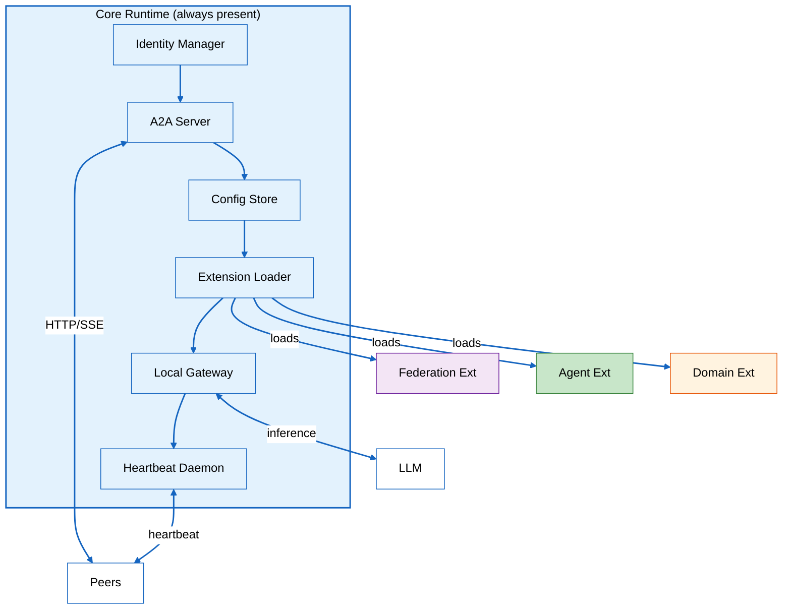
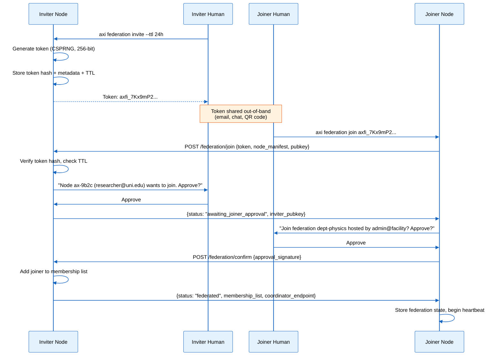
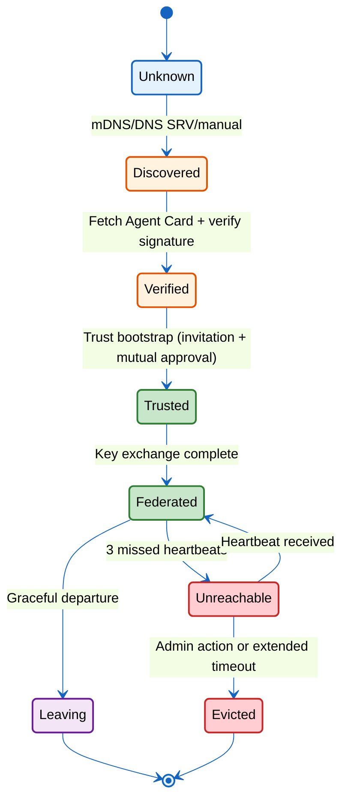
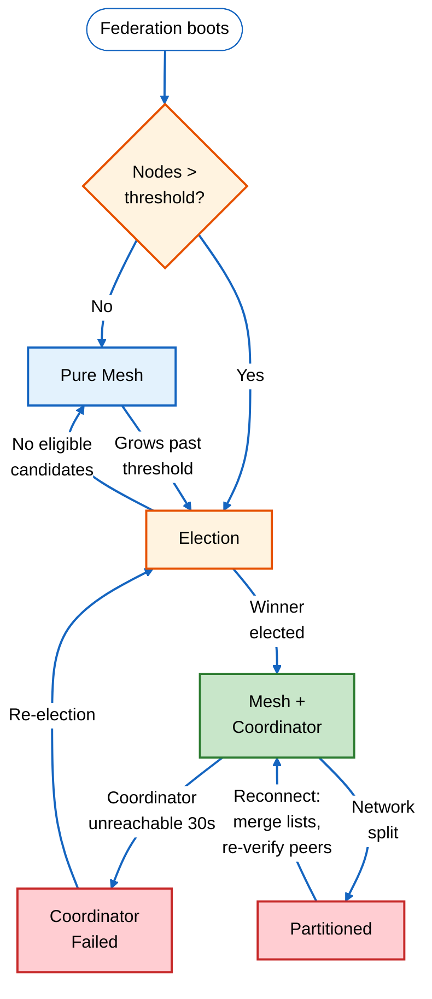
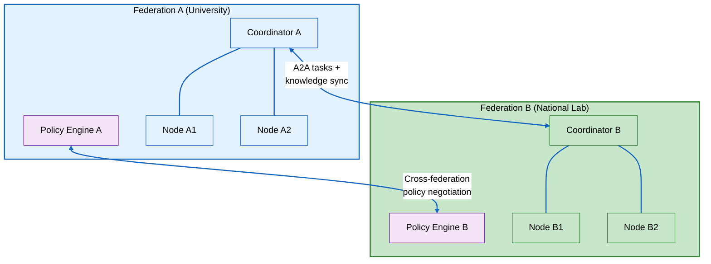

# Axiom Federation Protocol

> **Implementation Status: 🟡 Partial (as of 2026-04-02)** — Core identity,
> discovery, trust bootstrap, and security infrastructure are implemented
> (254 total federation tests). See per-section status markers below.
> Push-based propagation, coordinator election, gossip, and cross-node
> SECUR-T collaboration remain spec-only.

**Status:** Draft
**Owner:** Ben Booth
**Created:** 2026-03-31
**Last Updated:** 2026-04-02 (rev 2)
**Layer:** Axiom core (federation extension)
**Related PRD:** `prd-federation.md`

---

## Terms Used

| Term | Definition |
|------|-----------|
| **Node** | Any device running the axiom core runtime |
| **Core runtime** | The six components every node must have (§2.1) |
| **Extension** | An optional capability loaded by the extension loader |
| **Federation** | A group of axiom nodes that have established mutual trust |
| **Coordinator** | An elected node that handles resource routing and membership |
| **Node manifest** | A JSON document describing a node's identity, capabilities, and resources |
| **Agent Card** | An A2A JSON document describing an agent's identity and capabilities |
| **Invitation token** | A one-time credential for joining a federation |
| **Profile** | A named classification of a node's federation role (leaf, standard, provider, coordinator) |
| **Proposition** | A fact or conclusion that can cross federation boundaries (never raw data) |
| **RACI** | Responsible, Accountable, Consulted, Informed — the approval model for agent actions |
| **Protocol adapter** | An abstraction layer between axiom and a wire protocol (A2A, MCP, AG-UI) |

---

## 1. Purpose and Scope

This spec covers the **wire protocols, data structures, and state machines**
for axiom federation. It answers "how" — the "what" and "why" are in
`prd-federation.md`.

**In scope:**
- Node architecture and core runtime component interfaces
- Identity and cryptographic protocols
- Discovery mechanisms and state machines
- Topology management and coordinator election
- Resource sharing protocol
- Agent-to-agent communication via A2A
- Ecosystem integration layer (MCP server, A2A Agent Card)
- Offline operation and reconnection sync

**Out of scope:**
- Federated knowledge aggregation details → `spec-rag-community.md`
- Domain pack lifecycle → `spec-rag-pack-server.md`
- Hyperledger Fabric audit → `adr-002-hyperledger-fabric-multi-facility.md`
- Single-node infrastructure provisioning → `spec-managed-infrastructure.md`
- Connection management → `spec-connections.md`

---

## 2. Node Architecture (The Atomic Unit)

### 2.1 Core Runtime Components

Every axiom node runs these six components. They are always present regardless
of installed extensions.



| Component | Interface | Responsibility |
|-----------|----------|---------------|
| **Identity Manager** | `IdentityManager.get_node_id()`, `get_agent_identity(agent_type)`, `sign(payload)`, `verify(payload, pubkey)` | Ed25519 key generation, agent identity format, cryptographic signing |
| **A2A Server** | HTTP server on configurable port (default: 8443) | Serves `/.well-known/agent-card.json`, `/.well-known/axiom-manifest.json`, A2A task endpoints |
| **Config Store** | `ConfigStore.get(key)`, `set(key, value)`, `watch(key, callback)` | Persistent local config, extension manifests, federation state |
| **Extension Loader** | `ExtensionLoader.discover()`, `load(manifest_path)`, `unload(extension_id)` | Scans extension directories, validates manifests, manages lifecycle |
| **Local Gateway** | `Gateway.route(request)`, `register_backend(backend)`, `get_fallback_chain()` | LLM request routing with priority chain: user override > federation shared > local |
| **Heartbeat Daemon** | `Heartbeat.broadcast()`, `on_peer_timeout(callback)` | 10-second interval broadcast, peer failure detection after 3 missed beats |

### 2.2 Node Manifest Schema

Every node publishes a manifest at `/.well-known/axiom-manifest.json`:

```json
{
  "$schema": "https://axiom.dev/schemas/node-manifest/v1.json",
  "node_id": "ax-7f3a2b9e4d1c",
  "owner": "researcher@university.edu",
  "profile": "standard",
  "axiom_version": "0.5.0",
  "protocol_version": "1.0",
  "capabilities": [
    "llm:local:llama-3.3-8b",
    "rag:local:general",
    "agents:tidy,scan,chat,doctor"
  ],
  "resources": {
    "llm": {
      "model": "llama-3.3-8b",
      "shared": false,
      "vram_gb": 8
    },
    "rag": {
      "corpus_size": 12400,
      "shared": false
    }
  },
  "network": {
    "endpoints": ["https://ax-7f3a.local:8443"],
    "mdns": true,
    "dns_srv": null
  },
  "federation": {
    "member_of": "dept-physics",
    "joined": "2026-04-01T14:30:00Z",
    "coordinator": false,
    "trust_level": "federated"
  },
  "extensions": [
    {"id": "federation", "version": "0.5.0"},
    {"id": "tidy-agent", "version": "0.5.0"},
    {"id": "scan-agent", "version": "0.5.0"}
  ]
}
```

### 2.3 Node Profiles

Profiles are metadata — they describe intent, not enforce constraints:

| Profile | Required Components | Typical Resources | Can Be Coordinator? |
|---------|-------------------|-------------------|-------------------|
| **Leaf** | Core runtime only | < 8 GB RAM, no GPU, minimal disk | No |
| **Standard** | Core + local LLM + local RAG | 16+ GB RAM, optional GPU, 50+ GB disk | No |
| **Provider** | Core + local LLM + local RAG + shared services | 32+ GB RAM, GPU, 200+ GB disk | Yes |
| **Coordinator** | Core + local LLM + local RAG + shared services + coordinator | 32+ GB RAM, GPU, 200+ GB disk, high availability | Yes (elected) |

A node's profile is set via `axi node profile <profile>` and published in the
node manifest. Profile changes take effect on the next heartbeat broadcast.

### 2.4 Extension Interface

Extensions register with the core runtime via a manifest file:

```toml
# extensions/federation/manifest.toml
[extension]
id = "federation"
name = "Federation Protocol"
version = "0.5.0"
layer = "core"                    # core | agent | domain
requires = ["identity", "a2a"]    # core components this depends on

[hooks]
on_load = "federation.init:on_load"
on_unload = "federation.init:on_unload"
on_heartbeat = "federation.sync:on_heartbeat"
on_peer_discovered = "federation.discovery:on_peer_discovered"

[capabilities]
provides = ["federation.discovery", "federation.trust", "federation.sync"]
consumes = ["identity.sign", "a2a.publish_card", "config.watch"]
```

The extension loader:
1. Scans `src/axiom/extensions/builtins/` and `.axi/extensions/`
2. Reads each `manifest.toml`
3. Resolves dependency order
4. Calls `on_load` hooks in order
5. Registers provided capabilities in the local capability registry

---

## 3. Identity and Cryptography

> ✅ **IMPLEMENTED** — Ed25519 keypair generation, node_id derivation,
> NodeManifest dataclass, A2A Agent Card (build_agent_card), agent identity
> format — 28 tests passing.

### 3.1 Node Identity

At first boot, the identity manager generates an **Ed25519 keypair**:

```python
from cryptography.hazmat.primitives.asymmetric.ed25519 import Ed25519PrivateKey
import hashlib

private_key = Ed25519PrivateKey.generate()
public_key = private_key.public_key()

# Node ID is first 12 hex chars of SHA-256 of public key
node_id = "ax-" + hashlib.sha256(
    public_key.public_bytes_raw()
).hexdigest()[:12]
```

The private key is stored in the config store (encrypted at rest via the
platform keystore). The public key is published in the node manifest.

### 3.2 Agent Identity

Agent identity format: `{human_id}:{agent_type}:{version}`

| Component | Source | Example |
|-----------|--------|---------|
| `human_id` | Owner's email from OIDC or local config | `researcher@university.edu` |
| `agent_type` | Extension manifest ID | `tidy` |
| `version` | Extension manifest version | `v0.5.0` |

Full example: `researcher@university.edu:tidy:v0.5.0`

System agents (no human owner) use a facility-scoped identity:
`system@facility.edu:tidy:v0.5.0`

### 3.3 A2A Agent Card

Each agent publishes a card at `/.well-known/agent-card.json`:

```json
{
  "name": "tidy",
  "display_name": "Researcher's TIDY",
  "description": "Resource steward and system hygiene agent",
  "url": "https://ax-7f3a.local:8443",
  "provider": {
    "organization": "University Physics Department",
    "url": "https://physics.university.edu"
  },
  "version": "0.5.0",
  "capabilities": {
    "streaming": true,
    "pushNotifications": false
  },
  "skills": [
    {
      "id": "resource-check",
      "name": "Resource Health Check",
      "description": "Check health of managed infrastructure resources"
    },
    {
      "id": "model-pull",
      "name": "Model Management",
      "description": "Pull, update, and manage LLM models"
    }
  ],
  "authentication": {
    "schemes": ["bearer"],
    "credentials": "See federation trust protocol"
  },
  "axiom": {
    "agent_identity": "researcher@university.edu:tidy:v0.5.0",
    "node_id": "ax-7f3a2b9e4d1c",
    "protocol_versions": ["1.0"],
    "signature": "<Ed25519 signature of this card>"
  }
}
```

The `axiom` extension field carries axiom-specific metadata while keeping the
card A2A-compliant.

### 3.4 Trust Bootstrap Protocol

> ✅ **IMPLEMENTED** — InvitationToken with 24h TTL, create/validate flow — tested.



**Token format:**
```
axfi_{base64url(random_256_bits)}
```

Tokens are single-use. The inviter stores only the SHA-256 hash of the token,
not the token itself. On presentation, the joiner sends the token; the inviter
hashes it and checks against stored hashes.

**Token metadata** (stored by inviter):
```json
{
  "token_hash": "sha256:abc123...",
  "created_by": "admin@facility.gov:tidy:v0.5.0",
  "created_at": "2026-04-01T10:00:00Z",
  "expires_at": "2026-04-02T10:00:00Z",
  "max_uses": 1,
  "uses": 0,
  "metadata": {
    "note": "For new researcher laptop"
  }
}
```

### 3.5 ShareableResource Protocol

Extensions that want their resources to be discoverable and shareable across
federation peers implement the `ShareableResource` protocol:

```python
from typing import Callable, Protocol
from pathlib import Path


class ShareableResource(Protocol):
    """Protocol for extension resources that participate in federation sharing.

    Any extension implementing this protocol is automatically discoverable
    by federation peers. The set of shareable resources is dynamic — install
    a new extension, its resources become available at the next heartbeat.
    """

    @property
    def resource_type(self) -> str:
        """Unique resource type identifier (e.g., 'models', 'corpora', 'configs')."""
        ...

    def catalog(self) -> list[dict]:
        """Return a list of available items with metadata for discovery.

        Each dict must include at minimum: 'id', 'name', 'version', 'scope'.
        """
        ...

    def export(self, item_id: str) -> Path:
        """Export a single item to a temporary path for transfer.

        Raises PermissionError if the item's scope forbids export to the
        requesting peer.
        """
        ...

    def import_item(self, path: Path) -> dict:
        """Import an item received from a federation peer.

        Returns metadata dict for the imported item.
        """
        ...

    def on_change(self, callback: Callable) -> None:
        """Register a callback invoked when any item in this resource changes.

        The federation extension uses this to trigger push-based catalog
        updates to connected peers (see §6.5).
        """
        ...
```

The extension loader detects `ShareableResource` implementations at load time
and registers them with the federation extension's resource registry. When a
new extension is installed, its shareable resources become available to peers
on the next heartbeat cycle — no restart required.

#### Built-in ShareableResource Implementations

| `resource_type` | Module | Description |
|-----------------|--------|-------------|
| `materials` | Domain extension | Material property databases |
| `models` | Domain extension | Trained model artifacts |
| `rag-chunks` | `axiom.vega.federation` | RAG corpus chunks and facts |
| `facility-packs` | Domain extension | Facility-specific configuration bundles |
| `agent_patterns` | `axiom.agents.sharing` | Learned agent patterns (CI failures, anomalies, security findings). Priority 60 — above seed patterns, below user overrides. Merge rule: higher `verified_count` wins; `verified_by` lists are unioned. |

#### Community Knowledge Pack

On first `axi setup`, the wizard offers to download a **community knowledge
pack** — a `.axiompack` archive containing public-tier agent patterns and
reference facts. This gives standalone installs a useful baseline without
requiring federation membership. The pack is downloaded from a GitHub Release
asset and installed via `AgentPatternResource.import_patterns()`.

---

## 4. Discovery Protocol

> 🟡 **PARTIALLY IMPLEMENTED** — NodeRegistry and NodeState 8-state machine
> with SSH + A2A transport are implemented and tested. mDNS auto-discovery,
> DNS-SD registration, and peer introduction protocol remain 🔲 SPEC'D.

### 4.1 DNS SRV Records

For managed networks, axiom nodes register DNS SRV records:

```
_axiom._tcp.physics.university.edu. 86400 IN SRV 10 0 8443 ax-7f3a.physics.university.edu.
_axiom._tcp.physics.university.edu. 86400 IN SRV 20 0 8443 ax-9b2c.physics.university.edu.
```

Priority values indicate coordinator preference (lower = higher priority).
Registration is manual (IT creates records) or automatic (if DDNS is available).

### 4.2 mDNS / Bonjour (LAN Discovery)

For unmanaged networks, axiom uses mDNS (opt-in, enabled by default):

```
Service type: _axiom._tcp.local.
TXT records:
  node_id=ax-7f3a2b9e4d1c
  profile=standard
  version=0.5.0
  federation=dept-physics
```

mDNS discovery runs on a 30-second announcement interval. New nodes are
detected within one interval.

### 4.3 Manual Registration

For air-gapped or private networks:

```bash
axi federation add https://ax-9b2c.internal:8443
```

This bypasses automated discovery and directly initiates the trust bootstrap
protocol with the target endpoint.

### 4.4 Discovery State Machine



State transitions are persisted in the config store and survive restarts.

### 4.5 Scoped Discovery Mechanism

Discovery mechanisms differ by scope level. Each scope defines who can discover
resources and how authentication is performed:

| Scope | Discovery Mechanism | Auth Required | Trust Establishment |
|-------|-------------------|---------------|---------------------|
| **public** | mDNS + DNS-SD + `did:web` | None | Standard invitation flow |
| **organization** | Authenticated registry API | InCommon/OIDC (proves institutional membership) | Org-verified invitation |
| **consortium** | Peer introduction (see §7.5) | Bilateral trust via broker | Signed introduction from mutual trusted node |
| **private** | Direct configuration only | Explicit keypair exchange | Manual bilateral config |

**Scope enforcement in discovery responses:**

```python
class ScopedDiscovery:
    """Filters discovery responses based on the requesting peer's scope."""

    def filter_resources(
        self, peer_node_id: str, all_resources: list[dict]
    ) -> list[dict]:
        peer_scope = self.trust_store.get_peer_scope(peer_node_id)
        return [
            r for r in all_resources
            if self.scope_allows(r["scope"], peer_scope)
        ]

    def scope_allows(self, resource_scope: str, peer_scope: str) -> bool:
        """Check if a peer at the given scope level can see this resource."""
        hierarchy = ["public", "organization", "consortium", "private"]
        return hierarchy.index(peer_scope) >= hierarchy.index(resource_scope)
```

A node's default scope is set via `axi config set federation.default_scope <scope>`.
Per-resource overrides are set via the extension's `ShareableResource` catalog
metadata (`scope` field).

---

## 5. Federation Topology

> 🔲 **SPEC'D** — Coordinator election (Raft-inspired), gossip protocol
> (hierarchical SWIM), and partition handling are designed but not yet built.

### 5.1 Mesh with Elected Coordinators

**Default state:** All nodes are peers. Each node maintains a local copy of
the membership list and resource catalog, updated via gossip.

**Threshold trigger:** When the membership list exceeds a configurable
threshold (default: 10 nodes), any node with a `provider` or `coordinator`
profile can initiate a coordinator election.

### 5.2 Coordinator Responsibilities

The coordinator maintains:

| Resource | Description | Fallback Without Coordinator |
|----------|-------------|------------------------------|
| **Routing table** | Maps resource types to provider nodes | Each node gossips resource advertisements |
| **Membership list** | Authoritative list of federated nodes | Each node maintains a local copy |
| **Health dashboard** | Aggregated heartbeat metrics | Each node tracks its direct peers |
| **Conflict arbitration** | Tier 2 conflict resolution | Escalate directly to humans (tier 3) |
| **Election state** | Current term, votes, candidates | Mesh continues without governance |

The coordinator does **not** store any data that doesn't exist elsewhere.
Every item above has a degraded-but-functional fallback.

### 5.3 Election Protocol

Simplified Raft-inspired protocol:

```python
# Pseudocode — see spec for full state machine

class ElectionState:
    FOLLOWER = "follower"       # Default state
    CANDIDATE = "candidate"     # Seeking votes
    COORDINATOR = "coordinator" # Won election

class CoordinatorElection:
    def __init__(self, node_id, peers):
        self.state = ElectionState.FOLLOWER
        self.term = 0
        self.voted_for = None
        self.votes_received = set()

    def start_election(self):
        """Called when: threshold exceeded, or coordinator unreachable."""
        self.term += 1
        self.state = ElectionState.CANDIDATE
        self.voted_for = self.node_id
        self.votes_received = {self.node_id}
        # Broadcast RequestVote to all peers
        for peer in self.peers:
            peer.request_vote(self.term, self.node_id)

    def on_vote_received(self, voter_id):
        self.votes_received.add(voter_id)
        if len(self.votes_received) > len(self.peers) / 2:
            self.state = ElectionState.COORDINATOR
            self.broadcast_coordinator_announcement()

    def on_higher_term_seen(self, new_term):
        """Step down if a higher term is observed."""
        self.term = new_term
        self.state = ElectionState.FOLLOWER
        self.voted_for = None
```

**Election timeout:** Random between 150ms and 300ms (prevents split votes).
**Term length:** Indefinite — coordinator serves until failure, departure, or
re-election vote (requires 2/3 majority to initiate).

### 5.4 Partition Handling

| Scenario | Resolution |
|----------|-----------|
| Coordinator in majority partition | Continues as coordinator |
| Coordinator in minority partition | Majority elects new coordinator; minority operates as pure mesh |
| Partitions reconnect | Minority partition adopts majority's coordinator and merges membership lists |
| Equal split | Partition with the coordinator keeps it; other becomes pure mesh |

Membership list merge on reconnect: union of both lists, with `unreachable`
nodes re-verified via heartbeat.



---

## 6. Resource Sharing Protocol

> 🔲 **SPEC'D** — Resource advertisement, ranking, selection modes, and
> stability/switching logic are designed but not yet implemented.

### 6.1 Resource Advertisement

Provider nodes publish their shared resources in their node manifest
(`resources` field with `"shared": true`). The coordinator maintains an
aggregated routing table:

```json
{
  "routing_table_version": 42,
  "updated_at": "2026-04-01T15:00:00Z",
  "resources": [
    {
      "type": "llm",
      "provider_node": "ax-9b2c3d4e5f6a",
      "endpoint": "https://gpu-server.local:8443/v1",
      "model": "llama-3.3-70b",
      "priority": 10,
      "health": "healthy",
      "capacity": {"max_concurrent": 8, "current_load": 3},
      "last_heartbeat": "2026-04-01T14:59:50Z"
    },
    {
      "type": "llm",
      "provider_node": "ax-4d5e6f7a8b9c",
      "endpoint": "https://lab-gpu.local:8443/v1",
      "model": "llama-3.3-70b",
      "priority": 20,
      "health": "healthy",
      "capacity": {"max_concurrent": 4, "current_load": 4},
      "last_heartbeat": "2026-04-01T14:59:45Z"
    },
    {
      "type": "rag",
      "provider_node": "ax-1a2b3c4d5e6f",
      "endpoint": "https://rag-hub.local:8443/v1",
      "corpus": "community-general",
      "domain_tags": ["general", "safety"],
      "facts_count": 48200,
      "priority": 10,
      "health": "healthy",
      "last_heartbeat": "2026-04-01T14:59:48Z"
    },
    {
      "type": "rag",
      "provider_node": "ax-8b9c0d1e2f3a",
      "endpoint": "https://research-rag.local:8443/v1",
      "corpus": "research-methods",
      "domain_tags": ["research", "modeling"],
      "facts_count": 22100,
      "priority": 10,
      "health": "healthy",
      "last_heartbeat": "2026-04-01T14:59:47Z"
    }
  ]
}
```

Without a coordinator, nodes exchange resource advertisements via gossip
on heartbeat piggyback.

### 6.2 Resource Ranking and Selection

When multiple shared resources of the same type exist, a node must decide
which to adopt — and whether adoption is exclusive or concurrent. This is
handled by the **resource selector**.

#### Scoring

Each candidate resource is scored across five dimensions:

```python
@dataclass
class ResourceScore:
    """Weighted score for ranking competing shared resources."""

    capability: float   # 0.0–1.0: model size, corpus coverage, feature set
    proximity: float    # 0.0–1.0: network latency, same-site bonus
    availability: float # 0.0–1.0: uptime history, current health, headroom
    affinity: float     # 0.0–1.0: admin preference, org policy, explicit pin
    cost: float         # 0.0–1.0: inverse of compute/bandwidth cost

    # Default weights — configurable per node
    WEIGHTS = {
        "capability": 0.35,
        "proximity": 0.25,
        "availability": 0.25,
        "affinity": 0.10,
        "cost": 0.05,
    }

    @property
    def total(self) -> float:
        return sum(
            getattr(self, dim) * self.WEIGHTS[dim]
            for dim in self.WEIGHTS
        )
```

**Capability scoring by resource type:**

| Resource | Capability Factors |
|----------|-------------------|
| LLM | Model parameter count, context window, quantization quality |
| RAG | Corpus size, domain coverage tags, freshness (last update) |
| Keystore | Encryption strength, backup frequency, HSM backing |
| Auth | Protocol support (OIDC, SAML), MFA availability |

**Proximity scoring:**
- Same node: 1.0 (local)
- Same LAN segment: 0.8
- Same site, different segment: 0.6
- Same organization, different site (WAN): 0.3
- External federation: 0.1

The coordinator publishes latency estimates between nodes so proximity
scores don't require per-request probing.

#### Selection Modes

The selection mode determines how a node uses ranked resources:

```python
class SelectionMode(Enum):
    BEST_OF = "best-of"          # Adopt highest-ranked; failover to next
    FAN_OUT = "fan-out"          # Adopt all qualifying; query all, merge
    ROUND_ROBIN = "round-robin"  # Distribute across equivalent providers
    PINNED = "pinned"            # User-selected; no automatic switching


# Default selection mode per resource type
DEFAULT_SELECTION_MODES = {
    "llm": SelectionMode.BEST_OF,
    "rag": SelectionMode.FAN_OUT,      # Complementary corpora are all valuable
    "keystore": SelectionMode.BEST_OF,  # Only one authoritative keystore
    "auth": SelectionMode.BEST_OF,      # Only one auth provider
}
```

**Best-of** — Adopt the highest-scored resource. Maintain an ordered fallback
chain: if the primary fails, failover to the next-best. The gateway routes all
requests to the primary until a health failure triggers failover.

**Fan-out** — Adopt all resources that meet minimum criteria. Requests are sent
to all adopted resources in parallel; results are merged. This is the default
for RAG, where two corpora covering different domains both contribute valuable
knowledge. Deduplication and relevance ranking happen at the merge stage.

**Round-robin** — Distribute requests across all resources with equivalent
scores (within a configurable tolerance, default: 10% score difference). This
is useful for LLM load balancing when two providers offer the same model. The
gateway tracks per-provider request counts and routes to the least-loaded.

**Pinned** — The user explicitly selects a provider via
`axi config set federation.llm.pinned_provider ax-9b2c3d4e5f6a`. No automatic
switching occurs regardless of score changes. The pinned provider is used until
it fails (fallback to next-best) or the user unpins it.

#### Stability and Switching

To prevent thrashing between providers:

```python
class ResourceSelector:
    SWITCH_THRESHOLD = 0.20  # 20% score improvement required to switch
    COOLDOWN_SECONDS = 300   # 5 minutes between switches

    async def evaluate(self, current: Resource, candidates: list[Resource]):
        if self.mode == SelectionMode.PINNED:
            return current  # Never switch

        if self.mode == SelectionMode.FAN_OUT:
            # Adopt all qualifying candidates, don't switch
            return [c for c in candidates if c.score.total >= self.min_score]

        best = max(candidates, key=lambda c: c.score.total)

        # Don't switch for marginal improvement
        if current and current.health == "healthy":
            improvement = (best.score.total - current.score.total) / current.score.total
            if improvement < self.SWITCH_THRESHOLD:
                return current

        # Don't switch during cooldown
        if self.last_switch and (now() - self.last_switch).seconds < self.COOLDOWN_SECONDS:
            return current

        self.last_switch = now()
        return best
```

#### Failover and Thundering Herd Prevention

When a provider fails, not all consumers should simultaneously failover to the
same backup — this creates a thundering herd that overloads the backup.

```python
class FailoverStrategy:
    async def on_provider_failure(self, failed: Resource, alternatives: list[Resource]):
        # 1. Add jitter to prevent synchronized failover
        jitter = random.uniform(0, 2.0)  # 0–2 seconds
        await asyncio.sleep(jitter)

        # 2. Prefer least-loaded alternative (coordinator publishes load metrics)
        alternatives.sort(key=lambda r: r.capacity.current_load / r.capacity.max_concurrent)

        # 3. Adopt first alternative with available capacity
        for alt in alternatives:
            if alt.capacity.current_load < alt.capacity.max_concurrent * 0.8:
                await self.adopt(alt)
                return

        # 4. If all alternatives are near capacity, fall back to local
        log.warning("All shared alternatives near capacity; using local fallback")
        self.gateway.use_local_fallback()
```

### 6.3 Adoption Protocol

When a node discovers shared resources (after ranking and selection):

```python
class ResourceAdoption:
    """Adopt-first protocol extended for federation."""

    PRIORITY_LOCAL = 0       # Fallback (always present)
    PRIORITY_FEDERATION = 50 # Shared resource (auto-selected)
    PRIORITY_PINNED = 75     # User-pinned shared resource
    PRIORITY_OVERRIDE = 100  # Explicit user override (local or remote)

    async def adopt(self, resource_ad, priority=None):
        priority = priority or self.PRIORITY_FEDERATION

        # 1. Verify — does the shared resource meet our minimum criteria?
        if not await self.verify_resource(resource_ad):
            log.info(f"Shared {resource_ad.type} does not meet criteria; skipping")
            return

        # 2. Register — add to gateway's backend list at appropriate priority
        self.gateway.register_backend(
            type=resource_ad.type,
            endpoint=resource_ad.endpoint,
            priority=priority,
            metadata=resource_ad.metadata,  # model, corpus, domain_tags, etc.
        )

        # 3. Local always stays as lowest-priority fallback
        log.info(
            f"Adopted shared {resource_ad.type} from {resource_ad.provider_node} "
            f"(priority={priority}, mode={self.selection_mode})"
        )

    async def on_health_failure(self, resource_ad):
        # Gateway automatically falls back to next-priority backend
        # Failover strategy handles jitter and load-aware selection
        await self.failover_strategy.on_provider_failure(
            resource_ad, self.get_alternatives(resource_ad.type)
        )
```

### 6.4 Health Monitoring

| Parameter | Default | Configurable? |
|-----------|---------|--------------|
| Heartbeat interval | 10 seconds | Yes (`federation.heartbeat_interval_s`) |
| Failure detection | 3 missed heartbeats (30s) | Yes (`federation.failure_threshold`) |
| Failover time | < 5 seconds (next request uses fallback) | N/A — automatic |
| Health check payload | Node ID, timestamp, resource status summary | N/A — fixed format |

Heartbeat messages are lightweight (< 1 KB) and piggyback on UDP for LAN
or HTTP POST for WAN.

### 6.5 Push-Based Propagation

Connected peers maintain persistent channels for real-time catalog updates.
WebSocket is preferred; SSE is the fallback for environments where WebSocket
is blocked.

**Content change event format:**

```json
{
  "type": "catalog_update",
  "resource": "models",
  "action": "added",
  "id": "cole-triga-v3",
  "node_id": "abc123",
  "timestamp": "2026-04-02T15:00:00Z",
  "version_vector": {"abc123": 52, "def456": 47}
}
```

Events are lightweight metadata — they describe what changed, not the content
itself. A peer that wants the actual content issues a standard resource pull.

**Reconnection sync protocol:**

1. Reconnecting node sends its version vector to each peer
2. Peer compares vectors, identifies missed events
3. Peer replays missed events from its bounded event log
4. Bounded log defaults: 10,000 events, 7-day retention
5. If the gap exceeds the log boundary, a full catalog diff is performed

**Latency targets:**

| Network | Event Delivery | Full Sync After Reconnect |
|---------|---------------|--------------------------|
| LAN | < 2 seconds | < 30 seconds |
| WAN | < 10 seconds | < 30 seconds |

### 6.6 Install-Time Onboarding UX

> 🔲 **SPEC'D** — The first-run integration that lets a brand-new
> install pick up federated LLM and RAG resources without leaving
> the install flow. Bridges §4 (Discovery) + §6.1–6.5 (Resource
> Sharing Protocol) + the user-facing prompt.

#### 6.6.1 Why

A fresh `axi install` / `neut install` on a workstation at the
deploying site should "just find" the self-hosted Qwen+RAG endpoint without the user
having to read this spec, learn what "federation" means, or even
know the endpoint URL. The discovery mechanisms in §4 do the
finding; this section defines the *user-facing surface* that
turns discovery into adoption.

#### 6.6.2 Trigger points

The probe runs at three moments:

| Trigger | When | Cost |
|---|---|---|
| **Install** | First-time `axi install` / `neut install` after a fresh pip install | One discovery sweep |
| **On demand** | `axi federation discover` (manual re-probe) | One sweep |
| **Periodic** | Hourly background re-probe while no LLM provider is configured | Cheap retries; halts once a provider is adopted |

Once at least one local or federated LLM provider is configured
and reachable, the periodic re-probe pauses; manual `discover`
still works.

#### 6.6.3 The probe

For each discovery mechanism enabled on this node (mDNS, DNS-SRV,
manual list per §4.1–4.3):

1. Enumerate candidate endpoints.
2. Fetch the Agent Card (§3.3) and verify its signature.
3. Filter the resource catalog (§6.1) to entries with
   `"type": "llm"` or `"type": "rag"` whose `scope` admits this
   node (per §4.5 Scoped Discovery).
4. For each surviving resource, do a 1-second TCP + HTTP health
   check; record reachability + measured latency.

The probe is bounded by an overall 10-second wall clock and
proceeds concurrently across endpoints; it never blocks the
install.

#### 6.6.4 The decision-context prompt

When at least one usable resource is discovered AND `stdin` is a
TTY, the install presents the user with the full picture so they
can decide without leaving the terminal:

```
📡 Detected federated LLM service:

   Endpoint:    http://<private-host>:8766
   Latency:     12ms (LAN)
   Cost:        free (deploying-site infrastructure)
   EC posture:  NOT EC-safe (gateway cloud-routes;
                avoid sensitive content)
   RAG corpus:  domain community (technical, regulatory)
   Access:      requires private-network VPN
   Federated:   yes — peer node ax-7f3a, verified

Use this as your default LLM? [Y/n]
```

Field rules:

| Field | Source | When omitted |
|---|---|---|
| Endpoint | Resource catalog `endpoint` | Never |
| Latency | Probe measurement | Show `unknown` if probe timed out |
| Cost | Resource catalog `cost_per_token_usd` (0 → "free") | Show `unknown` if absent |
| EC posture | Resource catalog `routing_tier` ("export_controlled" → EC-safe; "public" → NOT) | Required field; absent → omit prompt entirely (safety) |
| RAG corpus | Companion `rag` resource if same provider also serves one | Omit row |
| Access | Resource catalog `requires_vpn` | Omit row if false |
| Federated | Discovery method + Agent Card verification result | Required field |

Non-TTY contexts (CI, scripted installs) get a notice with the
discovered endpoints and the exact command to adopt them
non-interactively (`axi federation adopt <node-id>`); they never
auto-adopt.

#### 6.6.5 Accept path: writeback

On accept, the install writes three artifacts atomically:

1. **`runtime/config/llm-providers.toml`** — a new
   `[[gateway.providers]]` entry with `routing_tier`, `priority`,
   `endpoint`, `api_key_env` (if applicable), `requires_vpn`, and
   a comment marking it as `# auto-added by federation probe
   <date>`. Marked `default = true` if no other provider is yet
   marked default.
2. **`runtime/config/federation_peers.toml`** — the peer node's
   ID + endpoint + scope + Agent Card hash (so subsequent probes
   skip re-verification until the hash changes per §3.7).
3. **`runtime/config/user_policy.toml`** — adds the newly-adopted
   provider to the head of `user_policy.prefer` (see
   spec-model-routing §13.2 `UserModelPolicy`), so the ModelStrategy
   resolution naturally favors it.

The user receives a one-line confirmation + the chat smoke command:

```
   ✓ adopted private-llm-rag as default LLM.
     Try it: neut chat "hello"
```

#### 6.6.6 Decline path

On decline, the probe records the (endpoint, decision, timestamp)
in `runtime/state/federation_declined.json` so future re-probes
don't re-prompt for the same endpoint until the user runs
`axi federation discover --reconsider`. The install continues
normally; the user falls through to the standard provider-setup
prompt (Anthropic key, OpenAI key, llamafile, …).

#### 6.6.7 Identity + trust gating

The prompt is shown *only* after the Agent Card signature
verifies and the peer's scope is acceptable for this node (per
§4.5). An unverified or mis-scoped endpoint is logged but
never surfaced to the user — preventing a hostile mDNS responder
on the LAN from steering the user to a malicious endpoint.

#### 6.6.8 Re-onboarding

`axi federation discover` re-runs the probe at any time. Already-
adopted endpoints surface as "✓ already adopted (default)" with
no prompt. Newly-discovered endpoints get the §6.6.4 prompt.
Endpoints that have moved from declined → reconsidered get the
prompt again.

---

## 7. Agent-to-Agent Protocol

> 🔲 **SPEC'D** — A2A adapter layer, task lifecycle, and RACI cross-node
> approval are designed but not yet implemented.

### 7.1 A2A Adapter Layer

Axiom wraps the A2A protocol behind an adapter to insulate from version changes:

```python
class A2AAdapter:
    """Abstracts A2A wire protocol. Currently targets A2A v0.3."""

    SUPPORTED_VERSIONS = ["0.3"]

    async def create_task(self, target_agent_card, task_spec):
        """Create an A2A task on a remote agent."""
        # Version negotiation
        common = set(self.SUPPORTED_VERSIONS) & set(
            target_agent_card["axiom"]["protocol_versions"]
        )
        if not common:
            raise IncompatibleProtocolError(
                f"No common protocol version. "
                f"Ours: {self.SUPPORTED_VERSIONS}, "
                f"Theirs: {target_agent_card['axiom']['protocol_versions']}"
            )

        # Create task via A2A HTTP endpoint
        response = await self.http_client.post(
            f"{target_agent_card['url']}/a2a/tasks",
            json={
                "jsonrpc": "2.0",
                "method": "tasks/send",
                "params": {
                    "id": generate_task_id(),
                    "message": task_spec.to_a2a_message(),
                },
            },
            headers=self.auth_headers(target_agent_card),
        )
        return A2ATask.from_response(response)
```

When A2A v1.0 ships, a new adapter version is added. Nodes declare supported
versions in their Agent Card; the adapter negotiates the highest common version.

### 7.2 Cross-Node Task Flow

```
1. Agent A decides to delegate work to Agent B
2. Agent A checks local RACI config → human A approval needed?
   → If yes: prompt human A. On deny: abort.
3. Agent A creates A2A task on Agent B's endpoint
4. Agent B receives task, checks local RACI config → human B approval needed?
   → If yes: prompt human B. On deny: reject task.
5. Agent B executes task
6. Agent B streams results via SSE (or returns final JSON)
7. Agent A receives results, validates (no raw data, no credentials)
8. Agent A reports result to human A
```

Every step is logged in both nodes' audit trails with full agent identity
attribution.

### 7.3 Context Exchange

What crosses the wire in A2A context:

| Allowed | Not Allowed |
|---------|-------------|
| Propositions (facts, conclusions) | Raw documents |
| Aggregated statistics | Individual user data |
| Model outputs (summaries, classifications) | Training data |
| Configuration values | Credentials or secrets |
| Public metadata (timestamps, counts) | Session contents |

This mirrors the invariant from `spec-rag-community.md` §2.2.

### 7.4 Conflict Resolution Protocol

```python
class ConflictResolver:
    async def resolve(self, action_a, action_b):
        # Tier 1: Non-contradictory — apply both
        if not self.contradicts(action_a, action_b):
            return MergeResolution(actions=[action_a, action_b])

        # Tier 2: Coordinator arbitration
        if self.coordinator and not self.is_safety_critical(action_a, action_b):
            winner = await self.coordinator.arbitrate(action_a, action_b)
            return ArbitrationResolution(winner=winner, reason=winner.rationale)

        # Tier 3: Human escalation
        return HumanEscalation(
            actions=[action_a, action_b],
            notify=[action_a.owner, action_b.owner],
            reason="Safety-critical or irresolvable conflict"
        )
```

### 7.5 Peer Introduction Protocol

Any trusted node can broker introductions between its peers. This enables
organic federation growth without centralized infrastructure.

**Introduction message flow:**

```
1. Node B (broker) creates introduction message:
   {
     "type": "introduction",
     "broker": "ax-node-b-id",
     "introducing": "ax-node-a-id",
     "target": "ax-node-c-id",
     "scope": "organization",
     "timestamp": "2026-04-02T15:00:00Z",
     "signature": "<Ed25519 signature by Node B's key>"
   }

2. Node B sends to Node A: "I'd like to introduce you to Node C"

3. Node A accepts/rejects (human prompt or auto-policy)

4. If accepted: Node A contacts Node C directly with the signed introduction

5. Node C verifies: "Node B (whom I trust) vouched for Node A"

6. Node C accepts/rejects (require_mutual: true)

7. If both accept: bilateral trust established, keys exchanged
```

**Scope enforcement:** The broker checks scope compatibility before creating
the introduction. A broker will not introduce nodes across incompatible scope
boundaries — e.g., a private-scoped node cannot be introduced to a node
outside its explicit trust list.

**Implementation:**

```python
class IntroductionBroker:
    """Brokers introductions between trusted peers."""

    async def introduce(self, node_a_id: str, node_c_id: str) -> bool:
        """Offer to introduce node_a to node_c."""
        # Verify both are trusted peers
        if not (self.trust_store.is_trusted(node_a_id)
                and self.trust_store.is_trusted(node_c_id)):
            raise UntrustedPeerError("Can only introduce mutually trusted peers")

        # Check scope compatibility
        a_scope = self.trust_store.get_peer_scope(node_a_id)
        c_scope = self.trust_store.get_peer_scope(node_c_id)
        if not self.scopes_compatible(a_scope, c_scope):
            raise ScopeViolationError(
                f"Cannot introduce {a_scope}-scoped node to {c_scope}-scoped node"
            )

        # Create signed introduction
        intro = {
            "type": "introduction",
            "broker": self.node_id,
            "introducing": node_a_id,
            "target": node_c_id,
            "scope": min(a_scope, c_scope, key=self.scope_rank),
            "timestamp": utc_now().isoformat(),
        }
        intro["signature"] = self.identity.sign(json.dumps(intro))

        # Send to node A
        accepted_a = await self.send_introduction_offer(node_a_id, intro)
        if not accepted_a:
            return False

        # Node A contacts Node C directly with the signed introduction
        # Node C verifies broker signature and accepts/rejects
        return True
```

---

## 8. Ecosystem Integration Layer

### 8.1 MCP Server Exposure

Axiom exposes its capabilities as an MCP server via Streamable HTTP transport:

```python
# Capabilities exposed via MCP
MCP_TOOLS = [
    {
        "name": "axiom_rag_query",
        "description": "Query the axiom knowledge base",
        "inputSchema": {
            "type": "object",
            "properties": {
                "query": {"type": "string"},
                "corpus": {"type": "string", "enum": ["local", "community"]},
                "max_results": {"type": "integer", "default": 10}
            },
            "required": ["query"]
        }
    },
    {
        "name": "axiom_agent_delegate",
        "description": "Delegate a task to an axiom agent",
        "inputSchema": {
            "type": "object",
            "properties": {
                "agent_type": {"type": "string"},
                "task": {"type": "string"},
                "priority": {"type": "string", "enum": ["low", "normal", "high"]}
            },
            "required": ["agent_type", "task"]
        }
    },
    {
        "name": "axiom_resource_status",
        "description": "Check status of axiom managed resources",
        "inputSchema": {
            "type": "object",
            "properties": {
                "resource_type": {"type": "string", "enum": ["llm", "rag", "keystore", "auth"]}
            }
        }
    }
]
```

The MCP server runs on the same port as the A2A server (default: 8443) at
the path `/mcp/v1`. Any MCP-compatible framework (Claude Code, OpenAI Agents
SDK, CrewAI, LangGraph, Dify, Haystack, etc.) connects by pointing at this
endpoint.

### 8.2 A2A Agent Card for External Discovery

The Agent Card published at `/.well-known/agent-card.json` (§3.3) serves
double duty:
- **Internal:** Federation peers discover each other's agents
- **External:** A2A-compatible frameworks (CrewAI, LangGraph, MS Agent Framework,
  Google ADK, Bedrock) discover axiom agents autonomously

No additional configuration is needed for external A2A discovery — the same
card works for both audiences.

### 8.3 Adapter Architecture

```python
class ProtocolAdapter:
    """Base class for protocol adapters."""

    async def handle_request(self, request):
        """Route incoming request through RACI and authorization."""
        # 1. Identify caller
        caller = await self.identify_caller(request)

        # 2. Check authorization (OpenFGA)
        if not await self.authorize(caller, request.capability):
            raise Unauthorized(f"{caller} not allowed to access {request.capability}")

        # 3. Check RACI (may require human approval)
        if await self.requires_raci_approval(caller, request):
            approval = await self.request_raci_approval(caller, request)
            if not approval.granted:
                raise RACIDenied(f"Human denied {caller}'s request")

        # 4. Execute
        result = await self.execute(request)

        # 5. Audit
        await self.audit_log.record(caller, request, result)

        return result


class MCPAdapter(ProtocolAdapter):
    """MCP protocol adapter — tool invocations."""
    ...

class A2AAdapter(ProtocolAdapter):
    """A2A protocol adapter — agent tasks."""
    ...

# Future:
# class AGUIAdapter(ProtocolAdapter):
#     """AG-UI protocol adapter — frontend streaming."""
```

All protocol adapters share the same authorization, RACI, and audit pipeline.
Adding a new protocol is an extension that implements `ProtocolAdapter`.

### 8.4 Security Boundaries for External Agents

External agents are configured via connection entries (`spec-connections.md`):

```toml
[[connections]]
name = "research-langraph"
display_name = "Research Team LangGraph"
kind = "mcp_inbound"
credential_type = "bearer_token"
category = "ecosystem"
required = false

[connections.capabilities]
# Explicit allowlist — only these MCP tools are accessible
allowed_tools = ["axiom_rag_query", "axiom_resource_status"]
# Denied by default
denied_tools = ["axiom_agent_delegate"]

[connections.limits]
rate_limit_rpm = 60
max_concurrent = 5
```

| Rule | Enforcement |
|------|------------|
| Capability allowlist | Connection config; denied capabilities return 403 |
| No federation membership | External agents interact with one node, not the mesh |
| No raw data | MCP tools return propositions, not documents |
| Rate limiting | Per-connection RPM and concurrency limits |
| Audit | Every call logged with external agent identity |
| RACI | External agent actions require human approval unless explicitly overridden in connection config |

### 8.5 Framework-Specific Integration Notes

| Framework | Recommended Integration | Notes |
|-----------|----------------------|-------|
| **Claude Code / Cowork** | MCP server (stdio or Streamable HTTP) | Add axiom as MCP server in Claude Code config; tools auto-discovered |
| **OpenAI Agents SDK** | MCP server (Streamable HTTP) | Use `MCPServerTool` with axiom's endpoint |
| **CrewAI** | MCP + A2A | Crews can both call axiom tools and delegate tasks to axiom agents |
| **LangGraph** | MCP + A2A (via Agent Server) | LangGraph nodes invoke axiom MCP tools; Agent Server routes A2A tasks |
| **MS Agent Framework** | MCP + A2A + AG-UI (future) | Most protocol-complete integration path |
| **Google ADK** | A2A primarily | ADK natively discovers axiom via Agent Card |
| **Bedrock AgentCore** | MCP (Gateway) + A2A (Runtime) | Register axiom as tool server in Gateway; deploy as A2A agent in Runtime |
| **Dify** | MCP (bidirectional) | Dify workflows consume axiom tools; axiom can consume Dify workflow tools |
| **Haystack** | MCP (bidirectional) | Haystack `MCPTool` connects to axiom; axiom can consume Haystack pipelines |

---

## 9. Offline and Reconnection

### 9.1 Offline Operation

When a node loses network connectivity:

1. **Local resources remain available** — local LLM, local RAG, local agents
2. **Federation state is frozen** — last-known membership list, routing table, config
3. **Outbound queue** — A2A tasks, knowledge contributions, config updates are queued locally
4. **No degradation** — the node operates exactly as it would before joining a federation

### 9.2 Reconnection Sync

On reconnect:

```python
class ReconnectionSync:
    async def sync(self):
        # 1. Config — version-vector merge
        remote_config = await self.coordinator.get_config_version_vector()
        local_config = self.config_store.get_version_vector()
        deltas = self.compute_deltas(local_config, remote_config)
        await self.apply_config_deltas(deltas)

        # 2. Knowledge — defer to spec-rag-community merge protocol
        await self.rag_sync.merge_community_facts()

        # 3. A2A queue — replay pending tasks
        for task in self.outbound_queue.drain():
            try:
                await self.a2a_adapter.create_task(task.target, task.spec)
            except PeerUnreachable:
                self.outbound_queue.requeue(task)

        # 4. Membership — re-verify peers
        await self.heartbeat.broadcast()  # Announce we're back
```

**Conflict resolution during sync:**
- Config: last-writer-wins (version vector determines ordering)
- Knowledge: merge (spec-rag-community protocol — additive, no conflicts)
- A2A tasks: replay (idempotent task IDs prevent duplicates)

### 9.3 SLA Targets

| Metric | LAN Target | WAN Target |
|--------|-----------|-----------|
| Node discovery (mDNS) | < 30 seconds | N/A (DNS SRV) |
| Node discovery (DNS SRV) | N/A | < 60 seconds |
| A2A task creation | < 2 seconds | < 5 seconds |
| Heartbeat interval | 10 seconds | 10 seconds |
| Failure detection | 30 seconds (3 beats) | 30 seconds |
| Knowledge sync | < 5 minutes | < 15 minutes |
| Config propagation | < 2 minutes | < 5 minutes |
| Secret rotation propagation | < 30 seconds | < 60 seconds |
| Reconnection sync | < 30 seconds | < 2 minutes |

---

## 10. CLI

> ✅ **IMPLEMENTED** — `axi federation` (7 commands, all --json), `axi nodes`
> (5 commands, all --json), `axi knowledge` (6 commands), `axi research`
> (7 commands with shorthands), `axi security` (8 commands), `axi chaos`
> (3 commands) — 31 CLI tests. --confirm on destructive ops (federation
> leave, federation join, nodes remove).

### Federation Commands

```bash
# Federation status and membership
axi federation status              # Show federation membership, coordinator, health
axi federation nodes               # List all known nodes with status
axi federation resources           # Show shared resource routing table

# Join and leave
axi federation invite [--ttl 24h]  # Generate one-time invitation token
axi federation join <token>        # Join a federation using invitation token
axi federation leave               # Graceful departure from federation

# Administration
axi federation add <endpoint>      # Manually add a peer (bypasses mDNS/DNS)
axi federation evict <node_id>     # Remove a node from federation (admin only)
axi federation elect               # Trigger coordinator election

# Node profile
axi node profile                   # Show current node profile
axi node profile <profile>         # Set profile (leaf|standard|provider|coordinator)
axi node manifest                  # Show this node's manifest
```

### Example Output

```
$ axi federation status
Federation: dept-physics
Node ID:    ax-7f3a2b9e4d1c
Profile:    standard
Member since: 2026-04-01
Coordinator: ax-9b2c3d4e5f6a (gpu-server.physics.local)

Nodes: 12 active, 1 unreachable
Shared resources: 2 LLM, 1 RAG corpus, 1 keystore

$ axi federation nodes
NODE ID          PROFILE     STATUS     OWNER                    LAST SEEN
ax-7f3a2b9e4d1c  standard    active     researcher@uni.edu       now (this node)
ax-9b2c3d4e5f6a  coordinator active     admin@facility.gov       2s ago
ax-1a2b3c4d5e6f  provider    active     sysadmin@uni.edu         5s ago
ax-4d5e6f7a8b9c  leaf        active     student@uni.edu          3s ago
ax-8b9c0d1e2f3a  standard    unreachable field-op@uni.edu        5m ago
...
```

---

## 11. Implementation Phases

### Phase 1: Identity + Discovery + Trust — ✅ CORE IMPLEMENTED

**Goal:** Two axiom nodes on the same LAN can discover each other, establish
trust, and share a basic resource (LLM).

**Components:**
- ✅ Identity Manager (Ed25519 keypair, node ID, agent identity) — 28 tests
- ✅ A2A Server (Agent Card + node manifest endpoints) — tested
- ✅ Trust bootstrap (invitation token, mutual approval) — tested
- ✅ Node discovery (NodeRegistry, NodeState 8-state machine, SSH + A2A transport) — tested
- ✅ `axi federation` CLI commands (7 commands) — tested
- ✅ `axi nodes` CLI commands (5 commands) — tested
- 🔲 mDNS auto-discovery with human approval prompt — spec'd
- 🔲 Heartbeat Daemon (LAN broadcast) — spec'd

**Exit criteria:** Two nodes on the same LAN discover each other in < 30s,
complete trust bootstrap with mutual approval, and the leaf node adopts the
provider's shared LLM.

### Phase 2: Resource Sharing + A2A Communication

**Goal:** Federated nodes share multiple resource types and agents collaborate
on cross-node tasks.

**Components:**
- Full resource adoption (LLM, RAG, keystore, auth)
- A2A adapter layer (v0.3)
- Cross-node task lifecycle
- RACI approval for cross-node actions
- Context exchange (propositions only)
- DNS SRV discovery
- MCP server exposure (ecosystem P1)

**Exit criteria:** Agent on node A delegates a task to agent on node B via A2A;
RACI approval is required on both sides; result is returned and audited.

### Phase 3: Topology Governance + Coordinator

**Goal:** Federations of 10+ nodes elect a coordinator and manage membership
formally.

**Components:**
- Coordinator election protocol
- Resource routing table
- Membership lifecycle (join, leave, evict)
- Configuration propagation
- A2A Agent Card publication (ecosystem P2)
- Federated audit trail correlation

**Exit criteria:** A 15-node federation elects a coordinator; coordinator
failure triggers re-election within 60s; the mesh continues operating during
election.

### Phase 4: Cross-Site + Full Ecosystem

**Goal:** Multi-site federations with WAN connectivity and full ecosystem
integration.

**Components:**
- WAN discovery and communication
- Cross-site knowledge federation (spec-rag-community.md Phase 2+)
- Federated HMAC chain audit (ADR-002)
- Bandwidth management for metered connections
- AG-UI support (ecosystem P3, if needed)
- Federation dashboard and monitoring

**Exit criteria:** Two federations on different networks (connected via VPN)
can share knowledge and delegate tasks across sites.

### Phase 5: Continuous Optimization (Autoresearch)

**Goal:** Axiom learns from its own production behavior and proposes
evidence-based improvements to its own configuration.

**Components:**
- Optimizer service (new always-on daemon)
- Generic autoresearch loop framework (observe → hypothesize → experiment → promote)
- Shadow scoring infrastructure
- A/B split and canary experiment strategies
- Resource scoring loop (weight learning via Ridge regression)
- Model routing loop (topic → model affinity matrix)
- RAG corpus quality loop (stale detection, re-embedding, retirement)
- Prompt template A/B testing loop
- Topology tuning loop (heartbeat, thresholds)
- Promotion threshold calibration loop
- `axi optimizer` CLI
- `optimizer.toml` configuration

**Exit criteria:** After 1000+ observations, learned resource weights
outperform static defaults on a holdout set. Model routing auto-tuning shows
≥5% confidence improvement on at least one topic category. All experiments
are fully audited with evidence chains.

---

## 12. Continuous Optimization Engine (Autoresearch Loops)

### 12.1 Architecture

The Optimizer is a new always-on service that runs autoresearch loops. It
follows the same extension model as other agents — registered as a system
daemon, reads from interaction logs and metrics, proposes changes through
RACI approval gates.

```python
class OptimizerService:
    """Always-on service that runs autoresearch loops."""

    def __init__(self, config_store, metrics, gateway, raci):
        self.loops: list[AutoresearchLoop] = [
            ResourceScoringLoop(config_store, metrics),
            ModelRoutingLoop(config_store, metrics, gateway),
            CorpusQualityLoop(config_store, metrics),
            PromptOptimizationLoop(config_store, metrics),
            TopologyTuningLoop(config_store, metrics),
            PromotionThresholdLoop(config_store, metrics),
        ]
        self.raci = raci
        self.paused = False

    async def run(self):
        """Main loop — runs each autoresearch loop on its configured schedule."""
        while not self.paused:
            for loop in self.loops:
                if loop.is_due():
                    try:
                        await loop.tick()
                    except Exception as e:
                        log.error(f"Loop {loop.name} failed: {e}")
                        # Individual loop failure doesn't stop others
            await asyncio.sleep(60)  # Check schedules every minute
```

### 12.2 Generic Loop Interface

Every autoresearch loop implements this interface:

```python
class TrustPosition(Enum):
    """RACI trust level for autoresearch loops — mirrors agent trust model."""
    AUTONOMOUS = "autonomous"   # Auto-promote; human notified after
    SUPERVISED = "supervised"   # Auto-experiment; human approves promotion
    GATED = "gated"             # Human approves both experiment and promotion
    DISABLED = "disabled"       # Observe and report only; no changes


# Default trust position per loop
DEFAULT_TRUST = {
    "resource_scoring": TrustPosition.SUPERVISED,
    "model_routing": TrustPosition.SUPERVISED,
    "corpus_quality": TrustPosition.AUTONOMOUS,
    "prompt_optimization": TrustPosition.GATED,
    "topology_tuning": TrustPosition.GATED,
    "promotion_thresholds": TrustPosition.GATED,
}

# Minimum successful supervised promotions before AUTONOMOUS is allowed
AUTONOMOUS_THRESHOLD = 3


class AutoresearchLoop(ABC):
    """Base class for all autoresearch loops."""

    name: str
    schedule: str           # cron expression (e.g., "0 */6 * * *" for every 6h)
    min_observations: int   # Minimum data points before hypothesizing
    experiment_scope: float # Max fraction of traffic (default: 0.10)
    rollback_threshold: float  # Regression threshold for auto-rollback (default: -0.05)
    cooldown_days: int      # Days after promotion before re-experimenting
    trust: TrustPosition    # User-configurable trust level

    @abstractmethod
    async def observe(self) -> Observations:
        """Collect metrics from production behavior. Pure read, no side effects."""

    @abstractmethod
    async def hypothesize(self, observations: Observations) -> Hypothesis | None:
        """Analyze observations, propose a parameter change. Returns None if
        current config is optimal within tolerance."""

    @abstractmethod
    async def experiment(self, hypothesis: Hypothesis) -> ExperimentResult:
        """Run the experiment (shadow, canary, or A/B). Returns metrics."""

    @abstractmethod
    async def should_promote(self, result: ExperimentResult) -> bool:
        """Statistical test: is the improvement significant and reliable?"""

    async def tick(self):
        """One iteration of the loop."""
        if self.trust == TrustPosition.DISABLED:
            observations = await self.observe()
            await self.audit_log.record_observation(self.name, observations)
            return  # Observe and report only

        observations = await self.observe()

        if observations.count < self.min_observations:
            log.info(f"{self.name}: {observations.count}/{self.min_observations} observations, waiting")
            return

        hypothesis = await self.hypothesize(observations)
        if hypothesis is None:
            log.info(f"{self.name}: current config is optimal within tolerance")
            return

        # Log hypothesis for audit (all trust levels)
        await self.audit_log.record_hypothesis(self.name, hypothesis)

        # --- Experiment gate (GATED requires approval to experiment) ---
        if self.trust == TrustPosition.GATED:
            approval = await self.raci.request_approval(
                action=f"Run {self.name} experiment (scope: {hypothesis.scope:.0%})",
                evidence=hypothesis.evidence,
            )
            if not approval.granted:
                return
        elif hypothesis.scope > self.experiment_scope:
            # AUTONOMOUS and SUPERVISED: auto-experiment within scope limit;
            # escalate to approval if scope exceeded
            approval = await self.raci.request_approval(
                action=f"Experiment scope {hypothesis.scope:.0%} exceeds limit {self.experiment_scope:.0%}",
                evidence=hypothesis.evidence,
            )
            if not approval.granted:
                return

        result = await self.experiment(hypothesis)
        await self.audit_log.record_experiment(self.name, hypothesis, result)

        # Auto-rollback on regression (all trust levels — non-negotiable)
        if result.improvement < self.rollback_threshold:
            await self.rollback(hypothesis)
            log.warning(f"{self.name}: auto-rollback, regression of {result.improvement:.1%}")
            return

        if await self.should_promote(result):
            # --- Promotion gate (varies by trust level) ---
            if self.trust == TrustPosition.AUTONOMOUS:
                # Auto-promote; notify human after
                await self.promote(hypothesis, result)
                self.last_promoted = now()
                await self.raci.notify(
                    action=f"Auto-promoted {self.name}: {result.summary()}",
                    level="informed",
                )
                log.info(f"{self.name}: auto-promoted (autonomous trust)")

            elif self.trust in (TrustPosition.SUPERVISED, TrustPosition.GATED):
                # Human approves promotion
                approval = await self.raci.request_approval(
                    action=f"Promote {self.name} result to production default",
                    evidence=result.summary(),
                )
                if approval.granted:
                    await self.promote(hypothesis, result)
                    self.last_promoted = now()
                    self.successful_promotions += 1
                    log.info(f"{self.name}: promoted (supervised). "
                             f"Track record: {self.successful_promotions} successful")
```

### 12.3 Experiment Strategies

| Strategy | How It Works | Best For |
|----------|-------------|----------|
| **Shadow scoring** | Log what the new config *would* choose without affecting real traffic. Compare counterfactual vs actual outcomes. | Resource weights, model routing — low risk, needs retrospective analysis |
| **Canary** | Apply new config to a single node or small subset. Monitor for regressions. | Topology parameters, heartbeat intervals — needs real traffic to evaluate |
| **A/B split** | Route N% of requests through new config, (100-N)% through old. Compare metrics head-to-head. | Prompt templates, RAG corpus changes — needs concurrent comparison |

```python
class ExperimentStrategy(Enum):
    SHADOW = "shadow"       # Counterfactual logging only
    CANARY = "canary"       # Apply to subset of nodes
    AB_SPLIT = "ab-split"   # Split traffic on same node

# Default strategy per loop
LOOP_STRATEGIES = {
    "resource_scoring": ExperimentStrategy.SHADOW,
    "model_routing": ExperimentStrategy.AB_SPLIT,
    "corpus_quality": ExperimentStrategy.CANARY,
    "prompt_optimization": ExperimentStrategy.AB_SPLIT,
    "topology_tuning": ExperimentStrategy.CANARY,
    "promotion_thresholds": ExperimentStrategy.SHADOW,
}
```

### 12.4 Resource Scoring Loop — Implementation Detail

This loop learns optimal resource selection weights from observed outcomes.

```python
class ResourceScoringLoop(AutoresearchLoop):
    name = "resource_scoring"
    schedule = "0 */6 * * *"    # Every 6 hours
    min_observations = 1000
    experiment_scope = 0.10     # Shadow only — no real traffic affected
    cooldown_days = 30

    async def observe(self) -> Observations:
        """Pull resource selection events from the last observation window."""
        return await self.metrics.query(
            metric="resource_selection",
            fields=["resource_type", "provider_node", "score_weights_used",
                     "selected_provider", "outcome_latency", "outcome_confidence",
                     "outcome_feedback", "fallback_triggered"],
            window=timedelta(days=7),
        )

    async def hypothesize(self, obs: Observations) -> Hypothesis | None:
        """Regression: which weight vector best predicts positive outcomes?"""
        # Positive outcome = low latency + high confidence + no fallback
        X = obs.as_weight_matrix()   # Each row: the 5 weights used at decision time
        y = obs.outcome_scores()     # Composite outcome metric per selection

        # Ridge regression to find optimal weights (regularized to prevent overfitting)
        from sklearn.linear_model import Ridge
        model = Ridge(alpha=1.0).fit(X, y)
        proposed_weights = dict(zip(WEIGHT_NAMES, model.coef_))

        # Normalize to sum to 1.0
        total = sum(proposed_weights.values())
        proposed_weights = {k: v / total for k, v in proposed_weights.items()}

        # Compare to current weights
        current_weights = self.config_store.get("federation.resource_weights")
        improvement = self._estimate_improvement(proposed_weights, current_weights, obs)

        if improvement < 0.05:  # Less than 5% predicted improvement
            return None

        return Hypothesis(
            parameter="federation.resource_weights",
            current_value=current_weights,
            proposed_value=proposed_weights,
            predicted_improvement=improvement,
            evidence=f"{obs.count} observations over 7 days, Ridge regression R²={model.score(X, y):.3f}",
            scope=0.0,  # Shadow scoring — zero real traffic affected
        )

    async def experiment(self, hypothesis: Hypothesis) -> ExperimentResult:
        """Shadow scoring: replay last N selections with proposed weights."""
        shadow_selections = []
        for event in self.recent_events:
            shadow_choice = self.score_with_weights(
                event.candidates, hypothesis.proposed_value
            )
            shadow_selections.append({
                "actual": event.selected_provider,
                "shadow": shadow_choice,
                "actual_outcome": event.outcome_score,
            })

        # For events where shadow would have chosen differently,
        # estimate the counterfactual outcome from historical performance
        counterfactual_improvement = self._estimate_counterfactual(shadow_selections)

        return ExperimentResult(
            improvement=counterfactual_improvement,
            sample_size=len(shadow_selections),
            confidence_interval=self._bootstrap_ci(shadow_selections),
            strategy=ExperimentStrategy.SHADOW,
        )
```

### 12.5 Federation-Wide vs Node-Local Loops

| Scope | Loops | Coordinator Role | Approval Authority |
|-------|-------|-----------------|-------------------|
| **Federation-wide** | Resource scoring, topology tuning | Coordinator aggregates observations from all nodes, runs centralized analysis | Federation admin |
| **Node-local** | Model routing, prompt optimization, corpus quality | None — each node runs its own loop | Node admin |
| **Knowledge-wide** | Promotion thresholds | Knowledge steward aggregates SCAN outcomes across nodes | Knowledge steward |

Federation-wide loops run on the coordinator. If no coordinator exists (pure
mesh), they run on each node independently with local data only.

### 12.6 CLI

```bash
# Optimizer service management
axi optimizer status              # Show all loops: last run, state, pending proposals
axi optimizer pause               # Pause all experiments immediately
axi optimizer resume              # Resume experiments
axi optimizer stop                # Disable optimizer service

# Per-loop management
axi optimizer loop <name> status  # Detail for one loop
axi optimizer loop <name> history # Past experiments and outcomes
axi optimizer loop <name> skip    # Skip next iteration
axi optimizer loop <name> run     # Trigger an immediate iteration

# Experiment inspection
axi optimizer experiments         # List active experiments
axi optimizer experiments <id>    # Detail for one experiment (evidence, metrics)
axi optimizer promote <id>        # Manually approve a pending promotion
axi optimizer rollback <id>       # Manually rollback an active experiment

# Trust management (follows RACI model)
axi optimizer trust                           # Show trust positions for all loops
axi optimizer trust <loop> <position>         # Set trust: autonomous|supervised|gated|disabled
axi optimizer trust <loop> --track-record     # Show promotion history (required for autonomous)
```

### 12.7 Configuration

```toml
# runtime/config/optimizer.toml

[optimizer]
enabled = true
log_level = "info"

[optimizer.resource_scoring]
enabled = true
trust = "supervised"              # autonomous | supervised | gated | disabled
schedule = "0 */6 * * *"          # Every 6 hours
min_observations = 1000
switch_threshold_improvement = 0.05  # 5% improvement required to propose
cooldown_days = 30

[optimizer.model_routing]
enabled = true
trust = "supervised"
schedule = "0 3 * * *"            # Daily at 3 AM
min_observations = 500
experiment_scope = 0.10           # 10% of traffic
significance_level = 0.05         # p < 0.05
cooldown_days = 14

[optimizer.corpus_quality]
enabled = true
trust = "autonomous"              # Low-risk: re-embedding, chunk management
schedule = "0 2 * * 0"            # Weekly, Sunday 2 AM
min_observations = 200
cooldown_days = 30

[optimizer.prompt_optimization]
enabled = false                   # Opt-in — requires prompt registry v2
trust = "gated"                   # Template changes can cause subtle regressions
schedule = "0 4 * * *"
min_observations = 300
experiment_scope = 0.10
cooldown_days = 14

[optimizer.topology_tuning]
enabled = true
trust = "gated"                   # High-impact: affects entire federation
schedule = "0 0 1 * *"            # Monthly
min_observations = 5000           # Need lots of heartbeat data
cooldown_days = 90                # Topology changes are high-impact

[optimizer.promotion_thresholds]
enabled = true
trust = "gated"                   # Affects what content gets auto-promoted
schedule = "0 2 1 * *"            # Monthly
min_observations = 100            # Human-reviewed facts
cooldown_days = 60
```

---

## 13. Invariants

These are **hard rules** that must never be violated, regardless of
configuration or operational pressure:

1. **A node with no network is fully functional** — federation is additive
2. **Trust requires mutual human approval** — no auto-join, no implicit trust
3. **Cross-node agent actions require RACI approval** — no silent delegation
4. **Classified content never crosses federation boundaries** — propositions only
5. **Coordinator failure does not break the mesh** — graceful degradation to peer-to-peer
6. **External agents get sandboxed capabilities** — never direct resource access
7. **Every action is audited with full identity attribution** — no anonymous operations
8. **Invitation tokens are single-use and time-limited** — no persistent join credentials
9. **Ed25519 signatures verify all Agent Cards and node manifests** — no unsigned trust
10. **Autoresearch experiments never exceed scope without human approval** — default 10% max
11. **Autoresearch regressions are auto-rolled back** — within 1 minute of detection
12. **Autoresearch promotions follow RACI trust** — autonomous loops still log and notify; all promotions are audited regardless of trust level
13. **Autoresearch never touches classified content or security parameters** — hard boundary

---

## 14. Gossip Protocol — Hierarchical SWIM

> 🔲 **SPEC'D** — Not yet implemented.

### 14.1 Why SWIM

The gossip protocol must scale autonomously from 50 to 100,000+ nodes with
zero manual tuning. SWIM (Scalable Weakly-consistent Infection-style
Membership) is the foundation — it's the protocol behind HashiCorp
Serf/Consul, proven at enterprise scale, and has O(log n) convergence with
constant per-node network overhead.

But flat SWIM breaks down past ~5,000 nodes (gossip volume, failure detection
latency). Axiom uses **hierarchical SWIM**: gossip within zones, coordinators
gossip across zones.

### 14.2 Tiered Architecture

| Scale | Topology | Gossip | Failure Detection |
|-------|---------|--------|-------------------|
| **Small** (< 50 nodes) | Pure mesh | Flat SWIM — every node gossips with k random peers per interval | Direct probe + indirect probe via k peers |
| **Medium** (50–5,000) | Mesh + coordinator | SWIM within site zones; coordinator aggregates cross-zone | Zone-local SWIM + coordinator health aggregation |
| **Large** (5,000–100,000+) | Hierarchical coordinators | SWIM within zones; zone coordinators gossip with each other; super-coordinator aggregates | Three-tier: node → zone coordinator → super-coordinator |

### 14.3 Protocol Detail

```python
class HierarchicalSWIM:
    """Autonomous gossip — self-tunes to federation size."""

    # SWIM parameters — auto-adjusted, never manually tuned
    K_PEERS = 3                    # Peers probed per interval (constant regardless of scale)
    PROBE_INTERVAL_MS = 1000       # 1 second between probe rounds
    INDIRECT_PROBE_PEERS = 3       # Peers asked to probe on behalf
    SUSPICION_MULTIPLIER = 5       # Intervals before suspect → dead

    # Zone thresholds — trigger automatic hierarchy formation
    ZONE_THRESHOLD = 50            # Nodes per zone before splitting
    COORDINATOR_THRESHOLD = 10     # Zones before super-coordinator

    async def probe_round(self):
        """One SWIM probe round — constant overhead regardless of federation size."""
        # 1. Pick k random peers from local zone
        targets = random.sample(self.zone_peers, min(self.K_PEERS, len(self.zone_peers)))

        for target in targets:
            ack = await self.direct_probe(target, timeout_ms=500)
            if ack:
                continue

            # 2. Indirect probe — ask k peers to probe on our behalf
            indirect_acks = await asyncio.gather(*[
                self.indirect_probe(peer, target, timeout_ms=1000)
                for peer in random.sample(self.zone_peers, self.INDIRECT_PROBE_PEERS)
            ])

            if not any(indirect_acks):
                self.mark_suspect(target)

    async def piggyback_gossip(self, probe_message):
        """Piggyback state changes on probe messages — zero extra bandwidth."""
        # Attach recent membership changes, resource advertisements,
        # and config updates to every probe message
        probe_message.updates = self.pending_updates.drain(max_items=10)
        return probe_message

    def auto_zone(self):
        """Automatically partition into zones when threshold exceeded."""
        if len(self.all_peers) > self.ZONE_THRESHOLD and not self.zone_id:
            # Use network proximity (same /24 subnet) or mDNS domain as zone key
            self.zone_id = self.compute_zone_from_network()
            self.zone_peers = [p for p in self.all_peers if p.zone_id == self.zone_id]
            log.info(f"Auto-zoned into {self.zone_id} ({len(self.zone_peers)} local peers)")
```

### 14.4 Bandwidth Budget

| Scale | Per-Node Bandwidth | Total Federation | Notes |
|-------|-------------------|-----------------|-------|
| 50 nodes | ~3 KB/s | ~150 KB/s | Flat SWIM, 3 probes/sec, ~1 KB per probe |
| 1,000 nodes | ~3 KB/s | ~3 MB/s | Zone-local SWIM; coordinators add ~10 KB/s each |
| 100,000 nodes | ~3 KB/s | ~300 MB/s | Hierarchical; per-node cost is constant |

The key insight: per-node bandwidth is **constant** (O(1)) regardless of
federation size. Only coordinator bandwidth scales with the number of zones,
and that's O(zones), not O(nodes).

### 14.5 Self-Tuning

The protocol autonomously adjusts to federation conditions:

| Condition | Adaptation |
|-----------|-----------|
| Federation grows past zone threshold | Auto-partition into zones |
| Zone grows too large | Auto-split into smaller zones |
| High packet loss detected | Increase indirect probe peers |
| Metered connection detected | Reduce probe frequency (min: 1 per 5s) |
| Node marked suspect → actually alive | Increase suspicion multiplier (reduce false positives) |

No human configuration needed. The protocol converges to stable behavior
at any scale.

---

## 15. Coordinator State Persistence — Raft Log Replication

> 🔲 **SPEC'D** — Not yet implemented.

### 15.1 Design Choice

Coordinator state is **replicated via Raft log to N followers** (not
reconstructed from gossip). This provides no-touch reliability under extreme
circumstances — coordinator death, simultaneous multi-node failure, network
partitions, power loss.

**Why not reconstruct from gossip?** Reconstruction requires all peers to be
reachable and respond in time. During the exact scenarios where you most need
a new coordinator (network instability, cascading failures), gossip-based
reconstruction is least reliable. Raft replication means the new coordinator
has authoritative state before the election even completes.

### 15.2 What Gets Replicated

| State | Size | Update Frequency |
|-------|------|-----------------|
| Membership list | O(nodes) — ~100 bytes per node | On join/leave/evict |
| Resource routing table | O(resources) — ~200 bytes per resource | On resource advertisement change |
| Zone assignments | O(zones) — ~50 bytes per zone | On auto-zone events |
| Active experiments (optimizer) | O(experiments) — ~500 bytes each | On experiment start/stop |
| Federation config (propagated values) | O(config keys) — typically < 10 KB | On config change |

Total replicated state for a 1,000-node federation: ~200 KB. For 100,000
nodes: ~20 MB. Small enough for in-memory Raft with disk-backed log.

### 15.3 Replication Topology

```python
class CoordinatorReplication:
    """Raft log replication for coordinator state."""

    REPLICATION_FACTOR = 3  # Coordinator + 2 followers (survives 1 failure)
    # At 1000+ nodes: REPLICATION_FACTOR = 5 (survives 2 failures)

    def __init__(self, coordinator_id, followers):
        self.log = RaftLog()  # Append-only, disk-backed
        self.followers = followers  # Elected during coordinator election

    async def replicate(self, entry):
        """Replicate state change to followers. Committed when majority ack."""
        self.log.append(entry)
        acks = await asyncio.gather(*[
            follower.append_entries(entry) for follower in self.followers
        ])
        if sum(acks) >= len(self.followers) // 2:
            self.log.commit(entry)
            return True
        return False

    async def on_coordinator_death(self):
        """Follower with most complete log becomes new coordinator.
        State is immediately available — no reconstruction needed."""
        # This happens automatically as part of the Raft election protocol
        # The new coordinator's log IS the authoritative state
        pass
```

### 15.4 Failure Scenarios

| Scenario | Recovery | Data Loss |
|----------|---------|-----------|
| Coordinator crashes, 1 follower alive | Follower becomes coordinator with full log | None |
| Coordinator + 1 follower crash simultaneously | Remaining follower becomes coordinator | None (if replication_factor ≥ 3) |
| All replicas crash | Re-elect from surviving nodes; state reconstructed from peer gossip (degraded mode) | Possible lag — last few uncommitted entries may be lost |
| Network partition splits coordinator from followers | Majority partition elects new coordinator; minority uses stale state until reconnect | Minority partition's state may be stale; merge on reconnect |
| Power loss at entire site | On restart, coordinator recovers from disk-backed log | None (log is durable) |

The design prioritizes **never losing committed state** and **never requiring
human intervention to recover**.

---

## 16. Cross-Federation Trust and Policy Engine

### 16.1 Federation of Federations

Two separate axiom federations can establish trust with each other, creating
a **super-federation**. This enables multi-organization collaboration (e.g.,
a university federation and a national lab federation sharing knowledge and
agent capabilities) while preserving each federation's autonomy.

### 16.2 Architecture

Cross-federation trust introduces a new layer: the **policy engine**. Each
federation can optionally run a policy engine that governs what crosses
federation boundaries — which resources are shareable, which agents can
communicate cross-federation, and what knowledge is exportable.



### 16.3 Policy Engine

The policy engine is an optional extension that sits above the coordinator.
It defines **what is allowed to cross federation boundaries** via declarative
policy rules.

```toml
# runtime/config/federation-policy.toml

[policy]
engine = "enabled"                 # enabled | disabled | audit-only
default_stance = "deny"            # deny | allow (default: deny all cross-federation)

# Which federations we trust
[[policy.trusted_federations]]
federation_id = "fed-inl-nrad"
display_name = "INL NRAD Federation"
policy_endpoint = "https://axiom-policy.inl.gov/v1"
trust_level = "bilateral"          # bilateral | subordinate | superior

# Resource sharing policy
[policy.resources]
share_llm = false                  # Don't share our LLM cross-federation
share_rag = true                   # Share community RAG (propositions only)
share_keystore = false             # Never share credentials cross-federation
share_auth = false                 # Each federation has its own auth

# Knowledge export policy
[policy.knowledge]
exportable_tiers = ["public"]      # Only public-tier facts cross federation boundary
exportable_domains = ["general"]   # Only general domain; no restricted domains
require_review = true              # Human reviews before cross-federation export
max_facts_per_sync = 100           # Rate limit on cross-federation knowledge sync

# Agent communication policy
[policy.agents]
allow_cross_federation_tasks = true
allowed_task_types = ["query", "analysis"]  # Read-only tasks only
denied_task_types = ["write", "configure", "execute"]
require_raci = "gated"             # All cross-federation tasks require gated RACI
```

### 16.4 Cross-Federation Trust Bootstrap

Cross-federation trust follows a stricter version of the node invitation
protocol:

1. **Federation admins** (not node admins) initiate the trust relationship
2. Policy engines exchange **policy documents** describing what each federation
   is willing to share
3. Both federation admins review and approve the other's policy
4. mTLS certificates are exchanged for the policy engine endpoints
5. Coordinators establish A2A communication channels
6. Knowledge sync begins according to the negotiated policy

```bash
# Federation A admin
axi federation trust propose fed-inl-nrad \
    --policy-endpoint https://axiom-policy.inl.gov/v1 \
    --our-policy ./federation-policy.toml

# Federation B admin (after receiving proposal)
axi federation trust review fed-university-physics
# Displays: proposed policy, what they want to share, what they want from us
axi federation trust accept fed-university-physics
```

### 16.5 Policy Negotiation

When two policy engines connect, they negotiate the **intersection** of their
policies — the most restrictive rule from either side wins:

| Federation A Policy | Federation B Policy | Effective Policy |
|--------------------|--------------------|-----------------|
| Share RAG: yes | Share RAG: yes | Share RAG: yes |
| Share LLM: yes | Share LLM: no | Share LLM: no |
| Export tiers: public, restricted | Export tiers: public | Export tiers: public only |
| Task types: query, analysis, write | Task types: query | Task types: query only |
| RACI: supervised | RACI: gated | RACI: gated |

The negotiated policy is signed by both policy engines and stored in the
Raft-replicated coordinator state. Either federation can update their policy
at any time — the intersection is recomputed and both admins notified of
changes.

### 16.6 Centralized Policy Authority (Optional)

For organizations with multiple federations under unified governance (e.g., a
national lab system with site-specific federations), a **central policy
authority** can push baseline policies to all member federations:

```toml
# Central policy authority configuration
[policy.authority]
mode = "centralized"                # centralized | peer (default: peer)
authority_endpoint = "https://policy.agency.gov/axiom/v1"
pull_interval = "1h"                # How often to check for policy updates
allow_local_override = true         # Federations can be MORE restrictive, never less
```

When `mode = "centralized"`:
- The central authority publishes a baseline policy
- Each federation's policy engine pulls the baseline on schedule
- Local policy can be **more restrictive** than baseline, never less
- The authority can push emergency policy updates (e.g., "immediately revoke
  cross-federation access for federation X")
- All policy changes are audited at both the authority and federation level

This is analogous to organizational security policy — headquarters sets the
floor, sites can raise the bar, no one can lower it.

### 16.7 Scale Considerations

| Scale | Topology | Policy Engine Role |
|-------|---------|-------------------|
| 2 federations | Bilateral | Peer-to-peer policy negotiation |
| 5–20 federations | Hub-and-spoke or mesh | Each pair negotiates independently, or central authority sets baseline |
| 20+ federations | Centralized authority | Authority manages baseline; bilateral overrides for specific pairs |

---

## 17. Agent Card Liveness — 90-Second Re-Sign

### 17.1 Liveness Concept

An Agent Card's Ed25519 signature proves the agent existed when the card was
signed — but not that it exists *now*. A stale card from a crashed agent is
indistinguishable from a live one. Agent Cards must be **re-signed
periodically** to prove liveness.

**Interval: 90 seconds.** This is the longest an average human can hold their
breath — a useful heuristic for "how long should you trust that something is
still alive without fresh evidence?" If an Agent Card's signature is older
than 90 seconds, the agent is considered **stale** and must be re-verified
before trusting.

### 17.2 Implementation

```python
class AgentCardLiveness:
    LIVENESS_INTERVAL_S = 90  # Re-sign every 90 seconds
    STALE_THRESHOLD_S = 180   # 2× interval — agent considered stale
    DEAD_THRESHOLD_S = 270    # 3× interval — agent considered dead

    async def liveness_loop(self):
        """Background loop — re-signs Agent Card every 90 seconds."""
        while True:
            self.agent_card["axiom"]["signed_at"] = now_iso()
            self.agent_card["axiom"]["signature"] = self.identity.sign(
                canonical_json(self.agent_card)
            )
            await self.publish_card()  # Update /.well-known/agent-card.json
            await asyncio.sleep(self.LIVENESS_INTERVAL_S)

    def is_live(self, card) -> bool:
        """Check if a remote Agent Card is fresh enough to trust."""
        signed_at = parse_iso(card["axiom"]["signed_at"])
        age = (now() - signed_at).total_seconds()
        return age < self.STALE_THRESHOLD_S

    def liveness_state(self, card) -> str:
        age = (now() - parse_iso(card["axiom"]["signed_at"])).total_seconds()
        if age < self.LIVENESS_INTERVAL_S:
            return "live"       # Signed within last 90s
        elif age < self.STALE_THRESHOLD_S:
            return "stale"      # 90–180s — probably alive, re-verify
        elif age < self.DEAD_THRESHOLD_S:
            return "suspect"    # 180–270s — likely dead
        else:
            return "dead"       # >270s — treat as gone
```

### 17.3 Interaction with Heartbeat

Agent Card liveness is **independent of** node heartbeat (10s interval).
Heartbeat proves the node is alive; card re-signing proves the specific
agent is alive. A node could be healthy while one of its agents has crashed.

| Signal | Interval | Proves |
|--------|---------|--------|
| Node heartbeat | 10s | The node process is running |
| Agent Card re-sign | 90s | The specific agent is running and has access to its signing key |
| Resource health check | 10s (piggyback on heartbeat) | A shared resource is accepting requests |

---

## 18. Red Team Resilience

> ✅ **IMPLEMENTED** — Chaos test framework (6 scenarios: network-partition,
> content-injection, mass-publish, identity-replay, ec-leak, split-brain,
> ChaosRunner — 13 tests), content sanitizer (14 prompt injection pattern
> categories, YAML injection defense — 37 tests), supply chain verification
> (verify_pack_integrity, SHA256 — 11 tests).

This section documents the federation's response to five adversarial and failure
scenarios. Each scenario includes detection mechanisms, automated response,
human response, and invariants.

### 18.1 Content Integrity Chain

Every shared item carries a verification payload:

```json
{
  "source_node_id": "ax-7f3a2b9e4d1c",
  "signature": "<Ed25519 signature of content_hash>",
  "timestamp": "2026-04-02T15:00:00Z",
  "content_hash": "sha256:abc123..."
}
```

**Verification is mandatory on receive.** Unsigned or mis-signed content is
rejected without exception — there is no "trust but don't verify" mode.

### 18.2 Scenario A: Network Outage

| Phase | Mechanism |
|-------|-----------|
| **Detection** | 3 missed heartbeats (30s default) |
| **Automated response** | Node continues with local resources. LAN peers remain reachable. WAN peers marked `unreachable`. Outbound actions queued. |
| **Recovery** | Version vector comparison on reconnect. Event log replay for missed events. Full catalog diff if gap exceeds log boundary. |
| **Target** | < 30s full sync after reconnect |

### 18.3 Scenario B: Compromised Node

| Phase | Mechanism |
|-------|-----------|
| **Detection** | Content signature verification failure. Behavioral anomaly detection by Tidy (unusual request patterns, scope violations, volume spikes). |
| **Automated response** | Quarantine — reject all requests from the suspect node. Broadcast trust downgrade to all peers. |
| **Human response** | Admin initiates eviction via `axi federation evict <node_id>`. |
| **Key revocation** | Eviction removes the node's public key from the trust bundle. All peers reject content signed with the evicted key. Re-admission requires new identity generation (new Ed25519 keypair) and fresh bilateral trust establishment with each peer. |

### 18.4 Scenario C: Man-in-the-Middle

Three independent defense layers:

| Layer | Mechanism |
|-------|-----------|
| **mTLS** | All peer communication uses mutually authenticated TLS. Both sides present certificates. |
| **Content signatures** | Every shared item is signed by the originating node's Ed25519 key — independent of the transport layer. |
| **Certificate pinning** | Peers pin each other's TLS certificates at trust establishment time. Certificate changes require re-authentication. |

All three layers must be defeated simultaneously for a MITM attack to succeed.

### 18.5 Scenario D: Insider Threat (Export-Controlled Data Leak)

| Phase | Mechanism |
|-------|-----------|
| **Prevention** | EC safety guard enforced in code — export-controlled content is tagged at ingestion with an immutable `access_tier: export_controlled` label. The sharing protocol checks this label before any cross-node transfer. |
| **Detection** | Tidy monitors for scope+tier cross-check violations. Every access (including denied attempts) is recorded in the audit trail. |
| **Response** | Attempted EC transfer to a non-EC-authorized node is blocked at the protocol level, logged, and escalated to the security officer. |

### 18.6 Scenario E: Split-Brain

| Phase | Mechanism |
|-------|-----------|
| **Detection** | Coordinator unreachable from a subset of nodes. Partition detected via gossip protocol inconsistency. |
| **Automated response** | Both partitions operate independently. Each side elects its own coordinator (if needed). No data is lost — both sides continue accepting writes. |
| **Recovery** | On network heal, version vectors are compared. Non-conflicting changes merge automatically. Conflicting changes (same key modified on both sides) are flagged for human review. |
| **Invariant** | Split-brain never causes data loss. |

### 18.7 Invariants (Red Team)

These invariants are enforced in code and verified by automated tests:

1. **No node loses functionality due to another node's outage**
2. **A single compromised node cannot corrupt the federation** — content
   signatures prevent poisoned data propagation
3. **EC content can only flow to explicitly authorized export-controlled nodes**
4. **Split-brain never causes data loss**
5. **Unsigned or mis-signed content is rejected without exception**

---

## 19. Call to Research Protocol

> ✅ **IMPLEMENTED** — 5 levels, CallToResearch/ResearchPart/ResearchResponse
> dataclasses, ResearchService, composable DAG chains with input_from/output_to
> — 34 tests. Knowledge observatory (velocity/accumulation/impact metrics,
> KnowledgeMetricsService, JSONL event logging) — tested. WASM sandbox
> (SandboxConfig, ExecutionResult, validate_wasm_module, execute_wasm via
> Wasmtime) — tested.

### 19.1 Data Model

```python
@dataclass
class CallToResearch:
    call_id: str                          # UUID
    caller_node_id: str                   # Node that initiated the Call
    title: str                            # Human-readable title
    description: str                      # Detailed description of the challenge
    level: int                            # 1–5 complexity level
    scope: Literal["public", "org", "consortium"]
    access_tier: Literal["public", "restricted", "export_controlled"]
    status: Literal["draft", "open", "in_progress", "assembling", "complete", "cancelled"]
    license: str                          # e.g. "CC-BY-4.0"
    parts: list[ResearchPart]             # Decomposed sub-tasks (may be empty)
    created_at: datetime
    opened_at: datetime | None            # When human approved
    completed_at: datetime | None
    approved_by: str | None               # Human POC who approved the Call
    synthesis_artifact_id: str | None     # Final assembled output

@dataclass
class ResearchPart:
    part_id: str                          # UUID
    call_id: str                          # Parent Call
    title: str
    description: str
    status: Literal["open", "claimed", "in_progress", "submitted", "accepted", "revision_requested", "rejected"]
    claimed_by: str | None                # Node ID
    claimed_at: datetime | None
    submitted_at: datetime | None
    reviewed_at: datetime | None

@dataclass
class ResearchResponse:
    response_id: str                      # UUID
    part_id: str                          # Which part this responds to
    responder_node_id: str
    content: dict                         # Flexible payload — data, text, references
    submitted_at: datetime
    review_status: Literal["pending", "accepted", "rejected", "revision_requested"]
    reviewer_notes: str | None
```

### 19.2 Protocol Flow

```
1.  Caller creates Call                     → status: draft
2.  Caller decomposes into parts (optional)
3.  Human approves                          → status: open, published to federation
4.  Federation event: {type: "call_to_research", call_id: "...", level: 3}
5.  Interested nodes respond:  {type: "claim_part", part_id: "..."}
6.  Caller acknowledges claim               → part status: in_progress
7.  Participant submits: {type: "submit_response", part_id: "...", content: {...}}
8.  Caller reviews: accept, reject, or request_revision
9.  When all parts complete: caller assembles synthesis
10. Synthesis published: enters community corpus, all participants credited
```

### 19.3 Auto-Research Agent Integration

- The auto-research loop includes a **gap detection** phase.
- When a knowledge gap is detected (`coverage_gaps` in knowledge metrics), the agent drafts a Call.
- The draft goes to the human POC for approval — the agent **never** auto-opens a Call.
- The auto-research agent can also **respond** to Calls from other nodes (Level 1 and 2 only; higher levels require human involvement).

### 19.4 Level 3 Safety

- Level 3 Calls transmit **model specifications** (`model.yaml`, parameter sets) or **WASM modules** (see §19.6) — never native executables.
- Model specifications: the receiving node uses its own installed tools to run the computation.
- WASM modules: executed in a sandboxed runtime with no default access to filesystem or network.
- Results are **data** (numbers, plots, analysis), not executables.
- Node operator must explicitly opt-in to Level 3 participation.
- WASM execution requires separate explicit operator approval per module (see §19.6).

### 19.5 Contribution Tracking

- **Per-Call metrics:** `contributions_by_node`, `time_to_respond`, `acceptance_rate`.
- **Federation-wide metrics:** `calls_initiated`, `calls_participated`, `calls_completed`.
- **Node contribution ratio:** `(calls_participated / calls_received)` — visible to peers.

### 19.6 WASM Execution Protocol

Level 3 Calls can include WASM modules for sandboxed execution.

#### Module Validation

Before any WASM module is accepted:

1. **Magic bytes check:** First 4 bytes must be `\0asm` (WASM binary format)
2. **Size limit:** Module must be under 10 MB (configurable per-node)
3. **Import check:** Module must not import any WASI functions unless the sandbox
   config explicitly allows them (default: no imports)
4. **Hash verification:** SHA-256 hash must match the hash declared in the Call

#### Execution Flow

```
1. Caller attaches WASM module to Level 3 Call
2. Receiving node validates module (magic bytes, size, imports, hash)
3. Node presents module details to operator for approval
4. Operator approves → approval logged (operator_id, module_hash, timestamp)
5. Node configures sandbox from SandboxConfig
6. Node executes module in Wasmtime runtime with fuel metering
7. Module reads input from stdin (JSON), writes output to stdout (JSON)
8. Node collects ExecutionResult → attaches to ResearchResponse
```

#### SandboxConfig Schema

```python
@dataclass
class SandboxConfig:
    max_memory_mb: int = 256           # Maximum memory allocation
    max_cpu_seconds: float = 60.0      # Maximum wall-clock execution time
    max_fuel: int = 1_000_000_000      # Wasmtime fuel units (CPU bound)
    allow_filesystem: bool = False     # Grant filesystem access (default: no)
    allow_network: bool = False        # Grant network access (default: no)
    filesystem_paths: list[str] = field(default_factory=list)  # Allowed paths if filesystem enabled
```

#### ExecutionResult Schema

```python
@dataclass
class ExecutionResult:
    module_hash: str                   # SHA-256 of the executed module
    sandbox_config: SandboxConfig      # Config used for execution
    approved_by: str                   # Operator who approved
    approved_at: datetime
    started_at: datetime
    completed_at: datetime
    fuel_consumed: int                 # Actual fuel used
    memory_peak_mb: float              # Peak memory usage
    exit_code: int                     # 0 = success
    stdout: bytes                      # Captured output (the result)
    stderr: bytes                      # Captured error output
    deterministic_hash: str            # SHA-256 of stdout for reproducibility
```

#### Reference Runtime

**Wasmtime** (Bytecode Alliance, Apache 2.0 license) is the reference runtime.
It provides fuel metering, memory limits, and WASI capability-based security
out of the box.

### 19.7 Research Chain Protocol

Research chains link Calls into directed acyclic graphs (DAGs) where the output
of upstream Calls feeds the input of downstream Calls.

#### Data Model Extensions

Add to `CallToResearch`:

```python
@dataclass
class CallToResearch:
    # ... existing fields ...
    input_from: list[str] = field(default_factory=list)   # Call IDs this Call depends on
    output_to: list[str] = field(default_factory=list)    # Call IDs that depend on this Call (back-reference, maintained automatically)
    chain_root_id: str | None = None                      # Root Call of the chain (None if this is the root)
```

When a Call is created with `input_from`, the referenced Calls' `output_to`
lists are updated automatically (back-reference maintenance).

#### Chain Traversal Algorithm

```python
def get_chain_ancestors(call_id: str, store: CallStore) -> list[str]:
    """Walk input_from links to find all ancestors (BFS to root)."""
    visited = set()
    queue = [call_id]
    while queue:
        current = queue.pop(0)
        if current in visited:
            continue
        visited.add(current)
        call = store.get(current)
        queue.extend(call.input_from)
    return list(visited - {call_id})

def get_chain_descendants(call_id: str, store: CallStore) -> list[str]:
    """Walk output_to links to find all descendants (BFS to leaves)."""
    visited = set()
    queue = [call_id]
    while queue:
        current = queue.pop(0)
        if current in visited:
            continue
        visited.add(current)
        call = store.get(current)
        queue.extend(call.output_to)
    return list(visited - {call_id})

def get_full_chain(call_id: str, store: CallStore) -> dict:
    """Return the full DAG as an adjacency list."""
    root = find_root(call_id, store)
    descendants = get_chain_descendants(root, store)
    all_ids = [root] + descendants
    return {cid: store.get(cid).output_to for cid in all_ids}
```

#### Chain Visualization

`axi research chain <call_id>` renders the DAG:

```
Call A (complete) ──┬── Call B (complete) ── Call D (in_progress)
                    └── Call C (assembling)
```

For complex chains, the CLI outputs a Mermaid diagram for rendering.

### 19.8 Agent Pipeline Protocol

The agent pipeline connects signal detection, auto-research, publishing, and
stewardship into an event-driven workflow.

#### Event Types

| Event | Emitted By | Payload |
|-------|-----------|---------|
| `fact_extracted` | Signal agent | `{fact_id, source, confidence, corpus_id}` |
| `gap_detected` | Auto-research agent | `{gap_id, topic, severity, suggested_level}` |
| `call_proposed` | Auto-research agent | `{call_id, draft: CallToResearch}` |
| `call_opened` | Human (via CLI/UI) | `{call_id, approved_by}` |
| `call_completed` | Auto-research agent | `{call_id, synthesis_artifact_id}` |
| `synthesis_ready` | Auto-research agent | `{call_id, artifact_id, chain_id}` |
| `publication_draft` | Publisher agent | `{pub_id, call_id, format, audience}` |
| `publication_published` | Publisher agent | `{pub_id, channel, timestamp}` |
| `pipeline_health` | Steward agent | `{metrics: KnowledgeMetrics, alerts: list}` |

#### Subscription Model

```python
# Signal agent emits facts
signal_agent.emit("fact_extracted", {fact_id: "...", source: "...", ...})

# Auto-research agent subscribes to facts and runs gap detection
@subscribe("fact_extracted")
def on_fact_extracted(event):
    gaps = gap_detector.analyze(event.corpus_id)
    for gap in gaps:
        emit("gap_detected", gap)
        if gap.severity >= threshold:
            draft = compose_call(gap)
            emit("call_proposed", draft)

# Human approves → call_opened
# ... call lifecycle proceeds ...

# On completion, auto-research assembles and signals publisher
@subscribe("call_completed")
def on_call_completed(event):
    synthesis = assemble(event.call_id)
    emit("synthesis_ready", {call_id: event.call_id, artifact_id: synthesis.id})

# Publisher agent formats and publishes
@subscribe("synthesis_ready")
def on_synthesis_ready(event):
    pub = format_publication(event.artifact_id)
    publish(pub, channels=["federation_peers", "email", "archive"])
    emit("publication_published", {pub_id: pub.id, ...})

# Steward agent monitors all events
@subscribe("*")
def on_any_event(event):
    update_metrics(event)
    check_escalation_paths(event)
```

#### Pipeline Invariants

- The auto-research agent **never** opens a Call without human approval.
- The publisher agent **never** publishes without review (draft → review → published).
- The steward agent monitors pipeline health and escalates stalls or failures.
- All events are logged in the audit trail with full provenance.

---

## 19.5. Federation Hook Surface

Federation is a hook *producer*. The platform-hooks spec (`spec-hooks.md`) defines a `HookBus` (interceptors) + `EventBus` (observers); this section enumerates the federation-scope events that ride that bus, and what cross-federation hook delivery unlocks.

**Ownership boundary.** Two of these events — `federation.pre_accept` and `federation.post_accept` — fire from runtime code in `axiom.vega.federation.receive` and are listed in `spec-hooks.md` §4 as part of the platform's closed taxonomy. The remainder are **federation/Vega extension-emitted events** under the `federation.*` namespace, owned by Vega the same way `chat/` owns `chat.session.*`. Subscribers don't care about the boundary; the distinction matters only for evolution — extension-namespaced events can change shape independently of the platform's stable taxonomy.

This is captured here so federation work doesn't lose sight of the hook integration even when hook implementation is on a separate track. Hook implementation owns the dispatch machinery; this spec owns ensuring federation FIRES the right events at the right boundaries with the right payloads.

### 19.5.1 Federation interceptor events

| Event | Payload | Hook return | Fires from |
|---|---|---|---|
| `federation.pre_accept` | `{message, peer_principal, classification, signature_chain}` | `allow()` / `allow_modified(message)` / `deny(reason)` | Receiving peer's `axiom.vega.federation.receive` before trust-graph commit |
| `federation.pre_publish` | `{resource, target_peers, classification, principal}` | `allow()` / `deny(reason)` | Local `axiom.vega.federation.publish` before envelope is signed |
| `federation.pre_subscribe` | `{remote_uri, peer_principal, capability}` | `allow()` / `deny(reason)` / `request_approval(why)` | `axi federation subscribe` before commit to local trust graph |
| `federation.classification.crossing` | `{message, declared_classification, local_ceiling, direction}` | `allow()` / `deny(reason)` / `allow_modified(quarantine=True)` | Both inbound and outbound; fired when a message's classification stamp crosses a declared boundary |

### 19.5.2 Federation observer events

| Event | Payload | Fires from |
|---|---|---|
| `federation.post_accept` | `{message, peer_principal, accepted_at}` | Receiving peer after trust-graph commit |
| `federation.post_publish` | `{resource_uri, target_peers, signed_envelope_hash, published_at}` | Local node after publish completes |
| `federation.peer_joined` | `{peer_principal, cohort, joined_at, trust_score}` | Local node when a new peer enters a cohort |
| `federation.peer_left` | `{peer_principal, cohort, left_at, reason}` | Local node when a peer leaves (graceful or detected absence) |
| `federation.trust_changed` | `{peer_principal, old_score, new_score, reason}` | Local node when EigenTrust recomputes a peer's score |
| `federation.heartbeat.missed` | `{peer_principal, cohort, last_seen_at, miss_count}` | Local node's liveness monitor |
| `federation.consortium.member_added` | `{member_principal, consortium_id, added_at}` | Coordinator when consortium membership changes |
| `federation.consortium.member_removed` | `{member_principal, consortium_id, removed_at}` | Coordinator when a member is removed |
| `federation.policy_updated` | `{peer_principal, policy_diff, effective_at}` | Local node when a peer publishes a policy update we're subscribed to |

### 19.5.3 Cross-federation hook delivery

When the platform-hooks "follow-up #2: cross-process delivery" lands, federation hooks unlock several patterns currently impossible:

- **Federated audit ledger.** A consortium subscribes one observer cross-federation to all peers' `tool.post_invoke` events; the ledger receives signed envelopes from each peer in the consortium without each peer running the audit logic locally.
- **Cross-institution rate limiting.** UT subscribes a `tool.pre_invoke` interceptor cross-federation for principals it owns. When a UT student logs in via OSU's chat agent, OSU fires `tool.pre_invoke`; UT's interceptor sees it (signed by OSU, payload references UT-owned principal), checks UT's rate-limit ledger, and can deny — the deny propagates back to OSU's gateway and aborts the call.
- **Cohort-wide signal extraction.** A classroom coordinator subscribes to all student `tool.post_invoke` events cross-federation (with student consent in the trust profile) and runs cohort patterns ("5 students stuck on the same topic in 10 minutes") on the coordinator's runtime. No need for each student's laptop to run the matcher.
- **Federated classification gate.** An interceptor on `federation.classification.crossing` enforces the local node's classification ceiling against incoming and outgoing messages. Cross-federation, this means peer A can declare a policy that messages from peer B must be downgraded or quarantined when they cross into peer C's environment — and the policy fires on every relevant peer's runtime via cross-process hook delivery.

The transport for cross-federation hook delivery is the same one EventBus v2 introduces (see `spec-event-bus.md` §6 — the `BusTransport` Protocol). When the federation transport (NATS JetStream + signed envelopes per ADR-027) replaces the in-process transport for cross-node events, federation hooks ride it natively.

### 19.5.4 Trust model for federation hooks

Per AEOS §3.4 and the Axiomatic Way principle #4, federation hooks shape behavior; they never grant capability:

- A hook on `federation.pre_accept` can DENY the message but cannot inject a new principal into the trust graph.
- A hook on `federation.pre_publish` can MODIFY (e.g., redact) the outgoing payload but cannot publish to peers the principal isn't authorized to reach.
- Cross-federation hook delivery uses signed envelopes — the receiving peer verifies the sending peer's signature before invoking any cross-process hook. A spoofed cross-process hook delivery is rejected at the receiver's signature check, upstream of HookBus dispatch.

### 19.5.5 Implementation sequencing

This subsection ships as part of the federation work, NOT as part of platform-hooks v1. Sequencing:

1. Platform-hooks v1 lands (`spec-hooks.md`'s implementation plan §13). `federation.pre_accept` and `federation.post_accept` are wired with stub implementations.
2. The remaining federation events (§19.5.1 + §19.5.2) wire into their producing code paths as those paths land — `federation.peer_joined` when membership-handling code lands, `federation.classification.crossing` when classification boundaries are wired, etc.
3. Cross-federation hook delivery (§19.5.3) ships when EventBus v2's `BusTransport` Protocol is in place AND a federation transport (NATS JetStream or PG LISTEN/NOTIFY) implementation exists. This is platform-hooks follow-up #2.

---

## 20. Open Questions

| # | Question | Notes |
|---|----------|-------|
| 1 | **NAT traversal** | For WAN federation without VPN: STUN/TURN, relay nodes, or require VPN? |
| 2 | **Counterfactual estimation** | Shadow scoring estimates what *would have* happened. How accurate is this vs A/B? Need calibration study. |
| 3 | **Federated learning for optimizer** | Could optimizer loops across federation nodes share learned parameters via Flower AI (same as spec-rag-community Phase 6)? |
| 4 | **Policy engine implementation** | Central policy authority needs its own spec — authentication, push protocol, emergency revocation, audit. Stub exists in §16.6. |

---

## 21. Related Documents

- `prd-federation.md` — Requirements (companion PRD)
- `adr-016-multi-node-federation.md` — Architecture decision record
- `spec-rag-community.md` — Federated knowledge aggregation
- `spec-rag-pack-server.md` — Domain pack lifecycle
- `spec-managed-infrastructure.md` — Single-node infrastructure provisioning
- `spec-connections.md` — External connection patterns
- `spec-agent-architecture.md` — Agent design and A2A integration point
- `spec-security.md` — OpenFGA authorization and audit
- `adr-002-hyperledger-fabric-multi-facility.md` — Multi-facility audit
- `adr-006-mcp-agentic-access.md` — MCP for tool/context interface
- `adr-015-shared-service-boundaries.md` — Service ownership boundaries
_Copyright (c) 2026 The University of Texas at Austin and B-Tree Labs. Apache-2.0 licensed._
