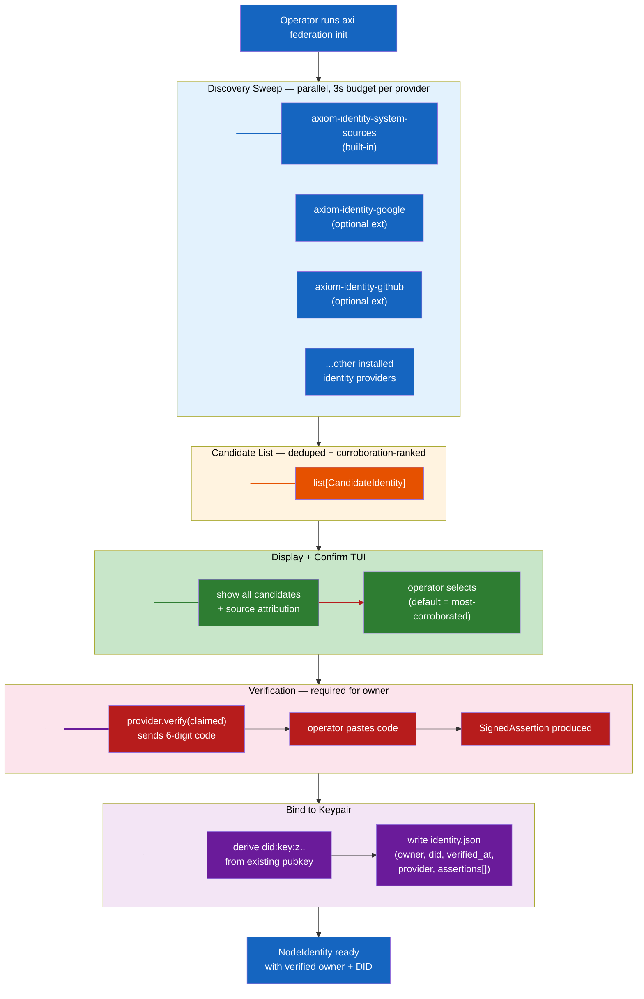
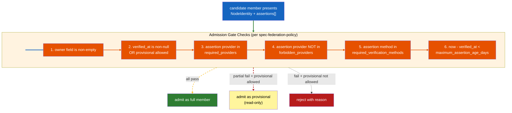

# Spec: Identity Acquisition and Verification at Install Time

**Status:** Draft (design only — implementation queued post-pilot)
**Owner:** Ben Booth
**Created:** 2026-05-02
**Layer:** Axiom core (`axiom.identity.acquisition`) + Axiom Vega (`axiom.vega.federation.identity`) + AEOS extension contract
**Related ADR:** `adr-041-identity-acquisition-and-verification.md`
**Related PRD:** `prd-identity-acquisition.md`
**Sister design:** `adr-042-chat-driven-corrections.md` (correction over time)

---

## Terms Used

| Term | Definition |
|---|---|
| **CandidateIdentity** | A `(claimed_principal, source, source_provider, corroboration_count)` record produced by an `IdentityProvider.discover()` call |
| **SignedAssertion** | A cryptographically-signed `(principal, did, provider, verified_at, method)` record returned by `IdentityProvider.verify()` |
| **IdentityProvider** | An AEOS extension implementing the `axiom.identity.providers.contract.IdentityProvider` Protocol |
| **DID** | W3C Decentralized Identifier per the `did:key` method in Phase A; broader methods Phase B |
| **VC** | W3C Verifiable Credential — Phase B substrate for `SignedAssertion` |
| **Owner field** | The string stored on `NodeIdentity.owner` and stamped as `accountable_human_id` per ADR-035 |
| **Aliases** | Additional addresses claimed-but-not-mandatory-verified, stored under `NodeIdentity.aliases[]` |
| **TOFU** | Trust-On-First-Use — the existing federation-peer pattern this spec mirrors for first-party identity |
| **Provisional membership** | Cohort membership state for members who do not satisfy `identity_policy`; read-only on cohort fragments until upgraded |

---

## 1. Purpose and Scope

This spec covers **the data shapes, Protocol contracts, state machines, and CLI flows** for the identity-acquisition pipeline declared in ADR-041. It answers "how" — the "what" and "why" are in the ADR.

In scope:
- The `IdentityProvider` Protocol and its conformance suite.
- The `CandidateIdentity` and `SignedAssertion` data shapes.
- The discover → display → verify → bind state machine at install time.
- The `axi nodes set-owner --verify` repair flow.
- The DID derivation and `NodeIdentity` schema bump.
- Cohort `identity_policy` schema and admission-gate evaluation order.
- TUI screen specifications for install + repair flows.

Out of scope:
- Session authentication after install (covered by `project_auth_tier_staging.md`).
- Authorization decisions on what a verified identity may do (covered by ADR-028 trust graph + `spec-federation-policy.md`).
- Correction of already-emitted bad fragments (covered by ADR-042).

---

## 2. Architecture Overview



---

## 3. The IdentityProvider Protocol

`axiom-identity-system-sources` is built-in; all other providers ship as standalone AEOS extensions. Every provider implements the same Protocol.

### 3.1 Protocol definition

```python
# axiom/identity/providers/contract.py
from typing import Protocol, Literal
from dataclasses import dataclass
from datetime import datetime

@dataclass(frozen=True)
class CandidateIdentity:
    claimed_principal: str          # "@user@example.org" — Matrix-style handle
    display_name: str               # "Benjamin Booth"
    source: str                     # "git config user.email"
    source_provider: str            # "axiom-identity-system-sources"
    corroboration_count: int = 1    # bumped when same principal seen from multiple sources
    metadata: dict = None           # provider-specific context (institution, employee_id, etc.)


@dataclass(frozen=True)
class SignedAssertion:
    principal: str                  # verified handle
    did: str                        # node DID this assertion is bound to
    provider: str                   # "axiom-identity-google"
    verified_at: datetime
    expires_at: datetime | None     # None = does not expire (e.g., email-code one-shot)
    method: Literal["email_code", "oidc", "saml", "vc"]
    publisher_identity: str         # AEOS publisher_identity of the provider extension
    signature: bytes                # provider's signature over the (principal, did, method, ts) tuple
    metadata: dict = None


class IdentityProvider(Protocol):
    """Contract for an AEOS identity_provider extension.

    Conformant providers implement all three methods. discover() is
    side-effect-free and idempotent. verify() may have side effects
    (mailer, browser, IdP redirect). refresh() returns a new assertion
    or raises if the prior assertion's binding has been revoked.
    """

    name: str                                       # canonical extension name
    discovery_method: Literal["passive", "interactive"]
    verification_methods: list[str]
    publisher_identity: str

    def discover(self) -> list[CandidateIdentity]:
        """Identities this provider passively observes about the operator.

        Passive providers (discovery_method == "passive") MUST NOT prompt,
        open browsers, send network requests beyond local-environment
        introspection, or block longer than the per-provider timeout
        (default 3s).

        Interactive providers MAY open a browser tab during discover()
        ONLY if the operator has explicitly opted in to that provider's
        discovery via prior `axi identity providers enable <name>`.
        """
        ...

    def verify(self, claimed: CandidateIdentity, did: str) -> SignedAssertion:
        """Verify the operator controls the claimed identity.

        Returns a SignedAssertion bound to the given DID. Raises:
          - VerificationFailed (wrong code, denied OIDC, revoked credential)
          - VerificationTimeout (operator did not respond in time)
          - VerificationUnavailable (no network, IdP unreachable)
        """
        ...

    def refresh(self, assertion: SignedAssertion) -> SignedAssertion:
        """Re-verify an existing assertion.

        For email_code: no-op (raises NotRefreshable).
        For oidc: refresh-token round-trip, returns updated assertion.
        For saml: re-assert against IdP.
        For vc: verify revocation status, return same assertion if still valid.
        """
        ...
```

### 3.2 AEOS manifest amendment

Identity-provider extensions declare in `axiom-extension.toml`:

```toml
[[extension.provides]]
kind = "identity_provider"
name = "google-workspace"
entry = "axiom_identity_google.provider:GoogleWorkspaceProvider"
discovery_method = "passive"
verification_methods = ["oidc"]
description = "Google Workspace OIDC identity provider"

[extension.signing]
required = true
methods = ["sigstore"]
publisher_identity = "b-tree-labs"
```

Per ADR-041 D9, identity-provider extensions MUST achieve AEOS Gold conformance per `spec-aeos-0.1.md` §12.3.

### 3.3 Built-in `axiom-identity-system-sources` provider sources

The built-in provider consults each source in parallel with a 500ms per-source timeout. Returns an empty list if no source produces a candidate (does not raise).

| Source | Yield | Platforms |
|---|---|---|
| `git config user.email` + `user.name` | one candidate | all |
| `gh auth status --hostname github.com` (if `gh` on PATH) | one candidate per active login | all |
| `~/.aws/credentials` `[default]` profile | one candidate (region's account email if discoverable) | all |
| macOS `dscl . -read /Users/$USER RealName` | display-name only; pairs with email candidates | darwin |
| macOS Address Book "Me" record (via `Contacts.framework`) | one candidate | darwin |
| `getent passwd $USER` GECOS | display-name only | linux |
| Microsoft Graph `/me` (if a signed-in `az` or `m365` CLI is present) | one candidate | all |
| `~/.gitconfig` `[user]` aliases section | one candidate per alias | all |
| `$EMAIL`, `$GIT_AUTHOR_EMAIL`, `$GIT_COMMITTER_EMAIL` env vars | one candidate each | all |

Candidates are deduplicated by `(claimed_principal, display_name)` with `corroboration_count` summed.

---

## 4. Candidate Discovery Flow

### 4.1 Discovery driver

```python
# axiom/identity/acquisition/discovery.py
from concurrent.futures import ThreadPoolExecutor, TimeoutError
from axiom.identity.providers.registry import installed_identity_providers

PROVIDER_TIMEOUT_S = 3.0

def discover_candidates() -> list[CandidateIdentity]:
    providers = installed_identity_providers()
    results: list[CandidateIdentity] = []

    with ThreadPoolExecutor(max_workers=len(providers) or 1) as pool:
        futures = {pool.submit(p.discover): p for p in providers}
        for future, provider in futures.items():
            try:
                results.extend(future.result(timeout=PROVIDER_TIMEOUT_S))
            except TimeoutError:
                _log.warning("provider %s exceeded discovery budget; skipped", provider.name)
            except Exception as e:
                _log.warning("provider %s failed discovery: %s", provider.name, e)

    return _deduplicate_and_rank(results)
```

`_deduplicate_and_rank` merges duplicates by `(claimed_principal, display_name)`, sums `corroboration_count`, and sorts by descending corroboration. Ties broken by source-provider ordering (system-sources first, alphabetical thereafter).

### 4.2 No candidates? Fall through to free-form

When `discover_candidates()` returns an empty list, the TUI shows a single prompt: "We could not detect your identity from any installed source. Enter your email:" — with the same downstream verification flow.

---

## 5. Verification Protocol

### 5.1 State machine

```mermaid
flowchart TB
    START["operator picks candidate"]
    INIT["verify() invoked<br/>SignedAssertion not yet produced"]

    subgraph EMAIL_CODE["Method: email_code (default for system-sources picks)"]
        EC_SPACER["·"]
        SEND["mailer sends 6-digit code<br/>10-minute TTL"]
        PROMPT["operator pastes code"]
        CHECK["compare to expected"]
        EC_SPACER ~~~ SEND
        SEND --> PROMPT --> CHECK
    end

    subgraph OIDC_FLOW["Method: oidc (Google, Microsoft, Okta, GitHub)"]
        O_SPACER["·"]
        OPEN["open browser to IdP"]
        AUTH["operator completes IdP auth"]
        CALLBACK["local callback receives token"]
        TOKEN["validate id_token + claims"]
        O_SPACER ~~~ OPEN
        OPEN --> AUTH --> CALLBACK --> TOKEN
    end

    subgraph SAML_FLOW["Method: saml (InCommon, UT-EID via Shibboleth)"]
        S_SPACER["·"]
        REDIRECT["browser redirect to IdP"]
        SHIB["operator completes Shibboleth"]
        ASSERT_IN["SAML assertion received"]
        VALIDATE["validate signature + audience"]
        S_SPACER ~~~ REDIRECT
        REDIRECT --> SHIB --> ASSERT_IN --> VALIDATE
    end

    OK["produce SignedAssertion<br/>sign with provider key"]
    FAIL["raise VerificationFailed<br/>(retry up to 3x)"]

    START --> INIT
    INIT --> EMAIL_CODE
    INIT --> OIDC_FLOW
    INIT --> SAML_FLOW
    EMAIL_CODE --> OK
    OIDC_FLOW --> OK
    SAML_FLOW --> OK
    EMAIL_CODE -.wrong code.-> FAIL
    OIDC_FLOW -.denied.-> FAIL
    SAML_FLOW -.denied.-> FAIL
    FAIL --> INIT

    style START fill:#1565c0,color:#ffffff
    style INIT fill:#1565c0,color:#ffffff
    style EMAIL_CODE fill:#fff3e0,color:#000000
    style EC_SPACER fill:none,stroke:none,color:#999,font-size:2px
    style SEND fill:#e65100,color:#ffffff
    style PROMPT fill:#e65100,color:#ffffff
    style CHECK fill:#e65100,color:#ffffff
    style OIDC_FLOW fill:#e3f2fd,color:#000000
    style O_SPACER fill:none,stroke:none,color:#999,font-size:2px
    style OPEN fill:#1565c0,color:#ffffff
    style AUTH fill:#1565c0,color:#ffffff
    style CALLBACK fill:#1565c0,color:#ffffff
    style TOKEN fill:#1565c0,color:#ffffff
    style SAML_FLOW fill:#f3e5f5,color:#000000
    style S_SPACER fill:none,stroke:none,color:#999,font-size:2px
    style REDIRECT fill:#6a1b9a,color:#ffffff
    style SHIB fill:#6a1b9a,color:#ffffff
    style ASSERT_IN fill:#6a1b9a,color:#ffffff
    style VALIDATE fill:#6a1b9a,color:#ffffff
    style OK fill:#2e7d32,color:#ffffff
    style FAIL fill:#b71c1c,color:#ffffff

    linkStyle 0 stroke:#1565c0,stroke-width:2.5px
    linkStyle 1 stroke:#e65100,stroke-width:2.5px
    linkStyle 2 stroke:#1565c0,stroke-width:2.5px
    linkStyle 3 stroke:#6a1b9a,stroke-width:2.5px
    linkStyle 4 stroke:#2e7d32,stroke-width:2.5px
    linkStyle 5 stroke:#2e7d32,stroke-width:2.5px
    linkStyle 6 stroke:#2e7d32,stroke-width:2.5px
    linkStyle 7 stroke:#b71c1c,stroke-width:2px,stroke-dasharray:5 5
    linkStyle 8 stroke:#b71c1c,stroke-width:2px,stroke-dasharray:5 5
    linkStyle 9 stroke:#b71c1c,stroke-width:2px,stroke-dasharray:5 5
    linkStyle 10 stroke:#b71c1c,stroke-width:2px
```



### 5.2 Email-code mechanics

- Code: 6-digit decimal, generated via `secrets.token_hex` then truncated/formatted.
- TTL: 10 minutes from issue.
- Retries: 3 wrong-code attempts before the assertion attempt is abandoned (operator must restart from candidate selection).
- Mailer: prefer local `sendmail` if present; fall back to operated `mail.axiom.dev` relay; fall back to `--unverified-owner` mode with banner.
- Body: short, no marketing, contains the code, the requesting hostname, and the requesting `did:key:` for operator side-channel sanity check.

```
Subject: Axiom verification code: 384921

This code verifies you control user@example.org for an Axiom node:

  Code:     384921
  Hostname: node-1.axiom.local
  DID:      did:key:z6MkpTHR8VNs...

If you did not initiate this, ignore this email. The code expires
in 10 minutes.
```

### 5.3 Verification result

A successful `verify()` returns a `SignedAssertion`. The assertion's signature covers `(principal || did || method || verified_at)` serialized as canonical JSON. The provider's `publisher_identity` and signing key are advertised in its AEOS manifest; verifiers consult that.

For Phase A, `email_code` assertions are signed by the local Axiom node (using its own keypair) — they assert "this Axiom runtime received this code at this time," not "Google says you are who you say." Institutional providers (Phase A's Google, Phase B's Microsoft/Okta/InCommon) sign with the provider extension's published key, asserting institutional verification.

---

## 6. TUI Screens

### 6.1 Install flow — discovery + display + pick

```
$ axi federation init

Detecting identity from system sources...

Found 3 candidates:

  [1] personal@example.com           (Benjamin Booth)
      seen in: git config, gh auth, $EMAIL                     [most corroborated]

  [2] user@example.org                  (Ben Booth)
      seen in: ~/.gitconfig aliases

  [3] ben.booth@b-tree-labs.dev          (Ben Booth)
      seen in: gh auth (b-tree-labs org)

  [n] None of these — enter a different address

Pick the address that should own this Axiom node [1]: 2

You picked: user@example.org

We need to verify you control this address. We'll email a 6-digit
code; paste it back here. (~30 seconds.)

Sending code to user@example.org... sent.

Code: 384921

Verified. Identity bound:

  Owner:        user@example.org
  Display Name: Ben Booth
  DID:          did:key:z6MkpTHR8VNsGrSLjfgZN4XZmXEGxJSe...
  Verified by:  axiom-identity-system-sources (email_code, 2026-07-15T14:22:01Z)

Aliases (claimed but not verified):
  personal@example.com
  ben.booth@b-tree-labs.dev

Run `axi nodes verify-alias <email>` to verify additional addresses.
```

### 6.2 Install flow — institutional provider available

```
$ axi federation init

Detecting identity from system sources...

Found 2 candidates:

  [1] user@example.org                  (Ben Booth)            [most corroborated]
      seen in: git config, gh auth, $EMAIL

      An installed identity provider can verify this address:
        - axiom-identity-incommon  (an institution, via Shibboleth)

  [2] personal@example.com           (Benjamin Booth)
      seen in: ~/.gitconfig aliases

  [n] None of these — enter a different address

Pick the address that should own this Axiom node [1]: 1

Verify via:
  [1] axiom-identity-incommon  (institutional Shibboleth — opens browser)
  [2] email code               (works without IdP)

Choice [1]: 1

Opening browser to https://shibboleth.example.org/idp/...
Waiting for you to complete sign-in...

Verified. Identity bound:

  Owner:        user@example.org
  Display Name: Ben Booth (an institution)
  DID:          did:key:z6MkpTHR8VNsGrSLjfgZN4XZmXEGxJSe...
  Verified by:  axiom-identity-incommon (saml, 2026-07-15T14:22:01Z)
                signed by InCommon Federation
```

### 6.3 Repair flow — `axi nodes set-owner --verify`

```
$ axi nodes set-owner --verify

Current identity:
  Owner:        old@example.org                            [unverified]
  Display Name: Ben Booth
  DID:          did:key:z6MkpTHR8VNsGrSLjfgZN4XZmXEGxJSe...
  Created:      2026-04-22

  Note: The current owner field has never been verified. This is
  a one-time repair; your DID and federation peer relationships
  will be preserved.

Re-detecting identity from system sources...

Found 3 candidates:
  [1] personal@example.com                                  [most corroborated]
  [2] user@example.org
  [3] ben.booth@b-tree-labs.dev
  [n] None of these
  [k] Keep current value (old@example.org)

Pick the address that should own this Axiom node: 2

You picked: user@example.org

This will:
  - Replace the current owner field (old@example.org → user@example.org)
  - Emit a 'correction' memory fragment per ADR-042 so the
    correction itself is auditable
  - Preserve your keypair, DID, and all federation peer relationships
  - NOT rewrite past fragments — those keep their original
    accountable-human stamp; ADR-042's correction-aware retrieval
    makes them queryable under the new identity

Proceed? [Y/n]: Y

Sending verification code to user@example.org... sent.
Code: 192847

Verified. Identity updated:

  Owner:        user@example.org
  Verified by:  axiom-identity-system-sources (email_code, 2026-07-16T10:15:33Z)

  Correction fragment emitted: cor-7f2a4b89
  Identity history entry:      old@example.org (superseded 2026-07-16T10:15:33Z)
```

### 6.4 Doctor surfacing

```
$ axi doctor
...
[ok]   Federation identity present
[warn] Federation identity owner is unverified
       Current: old@example.org (created 2026-04-22, never verified)
       Fix:     axi nodes set-owner --verify
       Why:     Unverified owner is stamped on every memory fragment
                and federation peer record. ADR-035 makes this binding
                load-bearing; ADR-041 establishes the verification flow.
[ok]   Federation peers reachable: 3
...
```

---

## 7. NodeIdentity Schema

### 7.1 Schema bump (Phase A)

`NodeIdentity` adds five fields. All optional on read for backward compatibility; mandatory on new writes.

```python
# axiom/vega/federation/identity.py
from datetime import datetime

@dataclass(frozen=True)
class NodeIdentity:
    # ---- existing fields ----
    node_id: str
    public_key: str
    private_key_path: Path
    owner: str                        # the verified owner handle
    display_name: str
    profile: str = "standard"

    # ---- new in v2 (ADR-041) ----
    did: str = ""                     # did:key:z..  derived from public_key; populated on first write
    verified_at: datetime | None = None
    verification_provider: str | None = None    # e.g., "axiom-identity-system-sources"
    verification_method: str | None = None      # "email_code" | "oidc" | "saml" | "vc"
    aliases: tuple[Alias, ...] = ()
    assertions: tuple[SignedAssertion, ...] = ()  # all assertions ever bound to this DID


@dataclass(frozen=True)
class Alias:
    address: str
    verified: bool
    verified_at: datetime | None = None
    verification_provider: str | None = None
```

### 7.2 Migration

Pre-bump `identity.json` files (no `did`, no `verified_at`) decode under the v1 decoder. On first read post-upgrade:

- `did` is computed from `public_key` and written back.
- `verified_at` stays `null`; the doctor warning surfaces; banner appears on `axi federation status`.
- `aliases = ()`, `assertions = ()`.

A one-time migration helper `axi nodes attest-owner` (Phase B) prompts the operator to re-verify on first invocation post-upgrade. Until then, the node operates with `verified_at: null` and is visible as such everywhere.

### 7.3 DID derivation

```python
# axiom/identity/did.py
import base58
from cryptography.hazmat.primitives.asymmetric.ed25519 import Ed25519PublicKey

ED25519_MULTICODEC_PREFIX = bytes([0xed, 0x01])  # ed25519-pub multicodec

def derive_did_key(public_key_b64: str) -> str:
    """Derive a did:key identifier from an Ed25519 public key.

    Per the W3C did:key method specification, the identifier is:
      did:key:z<base58btc-multibase(multicodec || raw-pubkey-bytes)>
    """
    raw = base64.b64decode(public_key_b64)
    multibase_input = ED25519_MULTICODEC_PREFIX + raw
    encoded = base58.b58encode(multibase_input).decode("ascii")
    return f"did:key:z{encoded}"
```

The DID is a pure projection of the existing public key. There is no new secret to manage.

---

## 8. Cohort Identity Policy

### 8.1 Manifest schema

The cohort manifest gains an optional `identity_policy` block:

```toml
# cohort manifest fragment
[cohort.identity_policy]
required_providers = ["incommon", "okta"]                 # any-of: at least one assertion from set
forbidden_providers = []                                  # never-of: explicit deny
required_verification_methods = ["oidc", "saml"]          # excludes "email_code"
maximum_assertion_age_days = 365
provisional_membership_allowed = true                     # downgrade vs. reject
```

Defaults if block omitted: no requirements; any verified identity admitted; unverified identities admitted as provisional.

### 8.2 Admission gate evaluation order



Provisional members can read cohort fragments (their own + cohort-public) but cannot write cohort-attributable fragments. They appear in the cohort roster with a `provisional` flag. Upgrade is via re-verification with a satisfying assertion.

### 8.3 Policy lives in two places, intentionally

The cohort manifest **declares** the policy. The policy engine (`axiom.policy.identity_policy`) **enforces** it. Both are required:

- Manifest-only: declarations are not enforceable; coordinators forget.
- Engine-only: enforcement is opaque; cohort members cannot inspect what they are about to opt into.

Manifest is the contract; engine is the runtime. Members read the manifest before joining; the engine evaluates at admission.

---

## 9. Repair Path

### 9.1 `axi nodes set-owner` flag matrix

| Flag | Behavior |
|---|---|
| `--verify` | Re-runs full discover → display → verify → bind pipeline. **The default and recommended path.** |
| `--no-verify` | Sets owner without verification. Requires confirmation prompt; identity is flagged unverified. Used for air-gapped / break-glass scenarios. |
| `--from-assertion <file>` | Sets owner from a pre-existing SignedAssertion file (e.g., re-importing a verification done elsewhere). |
| `--keep-aliases` | Preserves existing aliases through the change. Default. |
| `--clear-aliases` | Drops all aliases. Used when changing owner due to identity-takeover suspicion. |

### 9.2 Correction fragment emission

On successful repair, the runtime emits a `correction` memory fragment per ADR-042's schema:

```python
# pseudocode — actual schema lives in ADR-042
correction_fragment = {
    "kind": "correction",
    "subject_kind": "node_identity_owner",
    "subject_id": node_identity.node_id,
    "old_value": "old@example.org",
    "new_value": "user@example.org",
    "reason": "user-initiated repair via axi nodes set-owner --verify",
    "verification_assertion_id": signed_assertion.id,
    "ts": ts,
    "principal_id": new_owner,            # the corrected owner
    "accountable_human_id": new_owner,    # self-attesting correction
    "delegation_chain": (new_owner,),
}
```

The fragment is signed by the node and written through `CompositionService` like any other fragment. ADR-042 owns the `correction` schema, the chat surface that produces them, and the read-time retrieval awareness.

### 9.3 What the repair does NOT do

- Does NOT rewrite past fragments. ADR-042's correction-aware retrieval is the read-time mechanism.
- Does NOT re-issue past federation peer records under the new owner.
- Does NOT re-sign past compute receipts.
- Does NOT regenerate the keypair or change the DID.

The repair is a forward-going binding update. The historical record stays honest about what was true when.

---

## 10. Conformance Test Suite

`axiom_tests.identity_providers.IdentityProviderTests` exercises any extension declaring `kind = "identity_provider"`:

```python
class IdentityProviderTests:
    """Inherit + override fixtures to test a concrete provider."""

    @pytest.fixture
    def provider(self) -> IdentityProvider:
        raise NotImplementedError

    @pytest.fixture
    def known_principal(self) -> str:
        """A principal the test environment can verify successfully."""
        raise NotImplementedError

    def test_discover_is_idempotent(self, provider):
        a = provider.discover()
        b = provider.discover()
        assert _shape_eq(a, b)

    def test_discover_returns_well_formed_candidates(self, provider):
        for c in provider.discover():
            assert c.claimed_principal.startswith("@")
            assert c.source_provider == provider.name

    def test_verify_with_wrong_input_raises(self, provider, known_principal):
        wrong = CandidateIdentity(claimed_principal="@nobody:nowhere", ...)
        with pytest.raises(VerificationFailed):
            provider.verify(wrong, did="did:key:zNOPE")

    def test_signed_assertion_signature_verifies(self, provider, known_principal):
        candidate = CandidateIdentity(claimed_principal=known_principal, ...)
        assertion = provider.verify(candidate, did="did:key:zABC")
        assert _verify_signature(assertion)

    def test_no_network_failure_mode(self, provider, no_network):
        with pytest.raises(VerificationUnavailable):
            provider.verify(...)

    def test_refresh_of_expired_assertion(self, provider, expired_assertion):
        # behavior is method-dependent; concrete providers parameterize
        ...
```

`axi ext lint` runs this suite against any installed identity-provider extension and fails the lint if conformance is incomplete.

---

## 11. CLI Surface

### 11.1 Existing commands (modified)

| Command | Change |
|---|---|
| `axi federation init` | Replaces `_prompt_owner()` with the discover → display → verify → bind pipeline. No backward-compat flag. |
| `axi federation status` | Adds verification state to owner line: `Owner: user@example.org (verified, InCommon, 2026-07-15)`. |
| `axi me` | Same surfacing. |
| `axi doctor` | Adds `identity_verified` and `identity_provider_loaded` checks. |

### 11.2 New commands

| Command | Purpose |
|---|---|
| `axi nodes set-owner [--verify]` | Repair flow per §9. |
| `axi nodes verify-alias <address>` | Verify an additional alias post-install. |
| `axi nodes attest-owner` | Phase B one-time post-upgrade migration trigger. |
| `axi identity providers list` | List installed identity providers, their methods, and verification capabilities. |
| `axi identity providers enable <name>` | Opt in to interactive providers' discovery. |
| `axi identity discover` | Run candidate discovery without binding (debugging / inspection). |
| `axi identity verify <address>` | Verify an address against a chosen provider, returning a SignedAssertion file (for air-gapped imports). |

---

## 12. Security Considerations

- **Email-code TTL:** 10 minutes. Codes single-use; expired codes rejected with same error message as wrong codes (no oracle).
- **Brute-force resistance:** 3 retries per code, then the verification attempt is abandoned. New code requires a fresh `verify()` call (which sends a new code, not a re-display of the old one).
- **Provider compromise:** AEOS Gold conformance requires Sigstore signing + behavioral attestation + quarantine/recovery per `spec-aeos-0.1.md` §9.5. A compromised identity-provider extension is detectable by behavioral drift and quarantineable without disabling other extensions.
- **Provider pretending to be another provider:** the `publisher_identity` field is checked against the Sigstore certificate at install time; runtime does not trust providers whose claimed publisher does not match.
- **DID forgery:** `did:key:` is a deterministic projection of the public key. A forged DID requires a forged keypair, which is the same threat as forging the federation identity itself. No new attack surface.
- **TOFU on first verification:** the operator's first verified assertion is, by definition, accepted on faith. The verification round-trip raises the bar (control of the email inbox / IdP session) but is not authentication. Subsequent assertions can be cross-checked against the first; deviations surface in audit projections.
- **Side-channel sanity check:** the verification email body contains the requesting hostname + DID. Operators following secure-setup hygiene compare the DID in the email to the DID shown in the install TUI — confirming the verification request originated from the same install.

---

## 13. Open Questions

These mirror ADR-041's open items; the spec amends as resolutions land.

1. **Email-code mailer ownership** — Operate vs. BYO vs. both. Affects §5.2 fallback chain.
2. **`did:key` vs. `did:web` Phase A default** — Affects §7.3 derivation and Phase B VC interop.
3. **Discovery sweep budget** — 3s per provider; total budget cap when many providers are installed. May lower per-provider to 1.5s with 5+ installed.
4. **Provider precedence for duplicate-principal cross-provider assertions** — Default to "collect both"; manifest may need a precedence hint for cohort-policy evaluation.
5. **Cohort policy enforcement when coordinator offline** — Defer to `spec-federation-policy.md`'s deferred-enforcement pattern.

---

## 14. Cross-References

- ADR-041 — design source
- ADR-042 — sister design (chat-driven corrections + correction-aware retrieval)
- ADR-035 — `accountable_human_id` mandatory propagation
- ADR-027 — federated memory propagation
- ADR-028 — trust-graph adaptation loop (model for over-time identity confidence updates)
- ADR-031 — extension self-containment (identity providers ship as their own packages)
- `spec-aeos-0.1.md` §4 — AEOS capability kinds (this spec proposes §4.8 = `identity_provider`)
- `spec-federation-policy.md` — cohort admission gate (this spec adds `identity_policy` block)
- `project_auth_tier_staging.md` — staged auth-tier rollout (tokens → OIDC → InCommon → PIV); this spec is the *acquisition* side of the *authentication* story

_Copyright (c) 2026 B-Tree Ventures, LLC. Apache-2.0 licensed._
