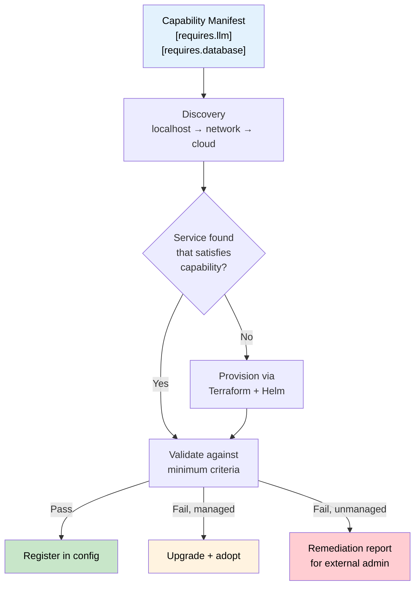
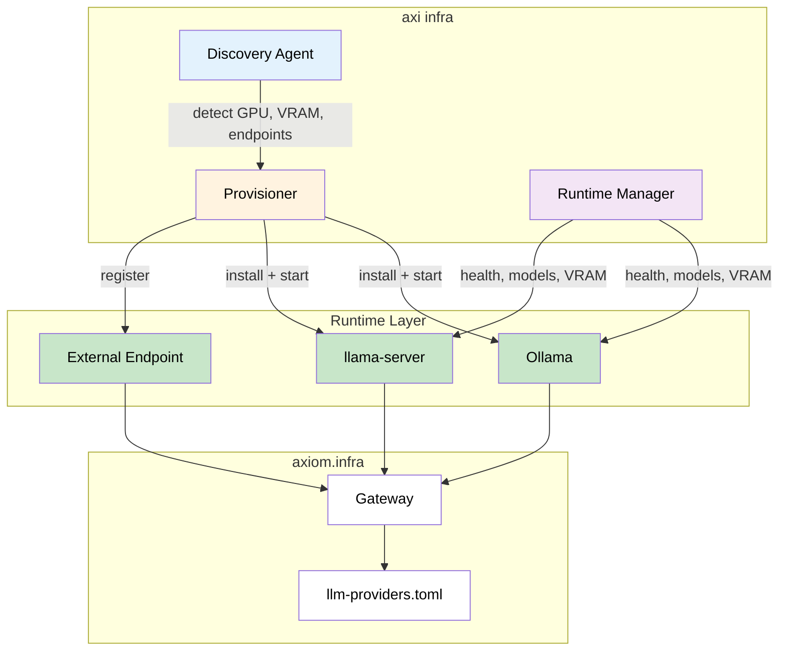
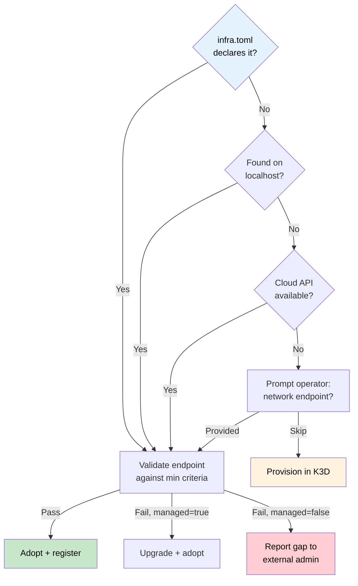
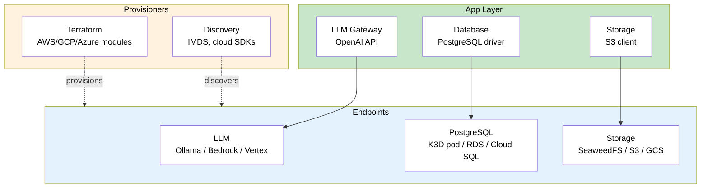
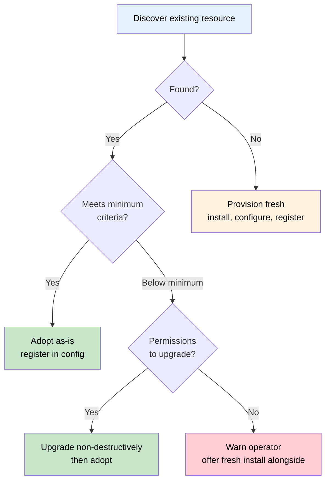
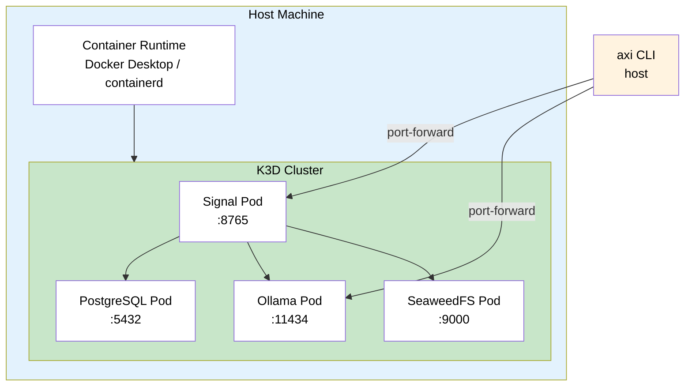
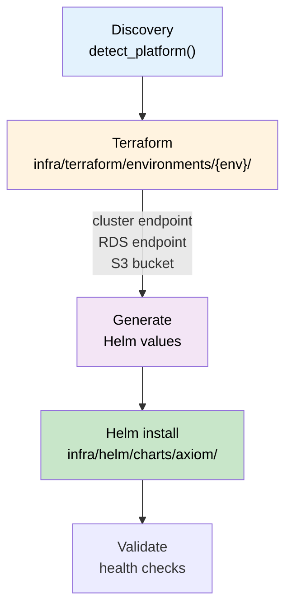
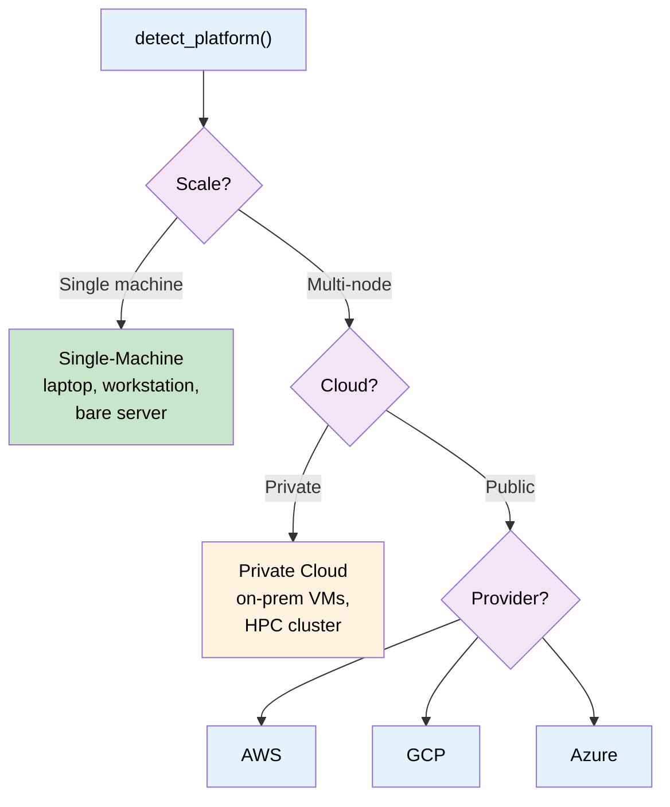
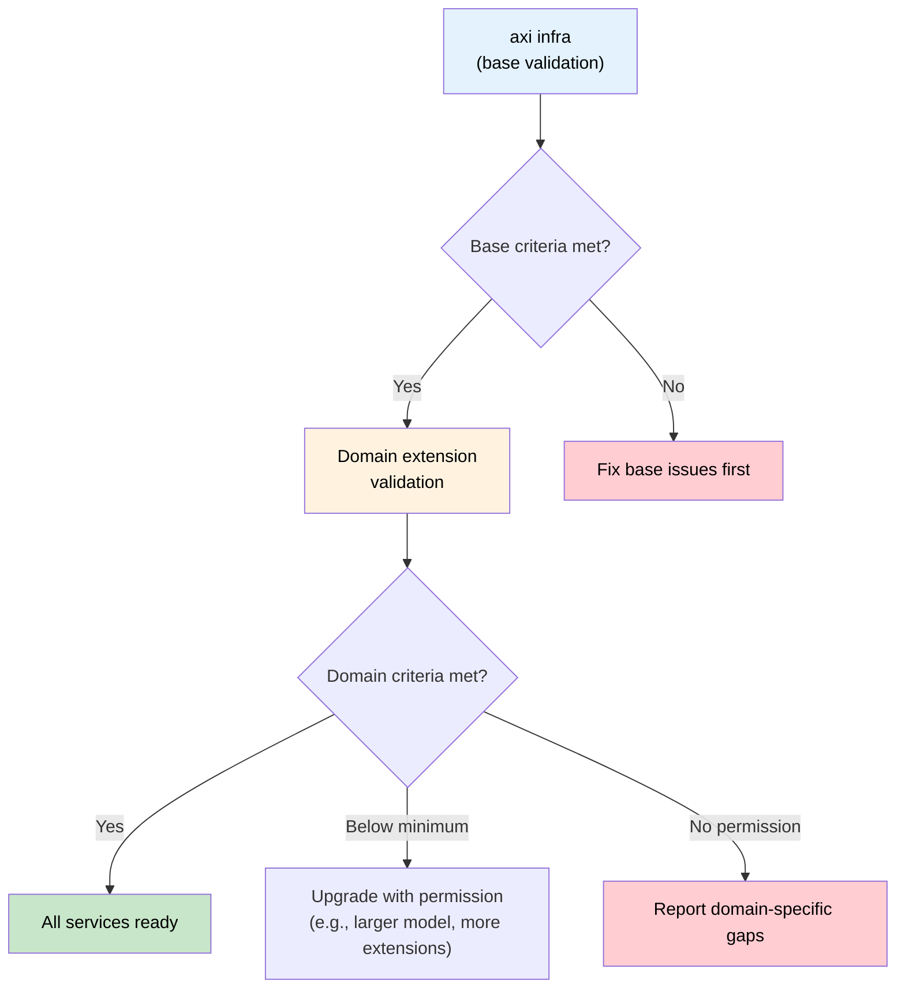

# Tech Spec: Managed Infrastructure

**Status:** Draft
**Date:** 2026-03-31
**Author:** Benjamin Booth
**PRD:** `prd-managed-infrastructure.md`

## Overview

Axiom introduces **capability-driven, agent-validated infrastructure** — a
layer above Terraform (declarative IaC) and Helm (app packaging) where the
operator declares what capabilities they need, and the framework discovers,
validates, provisions, and monitors the services that fulfill them.

This spec covers the technical design for the provisioning abstraction,
discovery protocol, validation framework, and per-service lifecycle
management (LLM runtime, PostgreSQL, object storage, keystore, observability).

See `prd-managed-infrastructure.md` §"What This Is" for the design philosophy,
proposed conventions (Capability Manifest, Service Readiness Endpoint,
Remediation Protocol, Infrastructure Discovery Protocol), and the three-era
framing (IaC → App Packaging → Agentic Infra).

The operator's default path is zero-configuration; bring-your-own-infrastructure
is supported as an override for each service independently via `infra.toml`
or interactive prompts.

## Architecture

## Capability Resolution Pipeline

Extensions declare capabilities they require. The framework resolves those
capabilities to concrete services, validates them, and provisions what's missing.



The Capability Manifest is assembled from all installed extensions at `axi infra`
time. Each extension's `[extension.requires]` or `[extension.min_criteria]`
section is merged — the highest requirement wins for each field:

```python
@dataclass
class CapabilityRequirement:
    """A single capability requirement, merged from all extensions."""
    service: str                        # "llm", "database", "storage"
    protocol: str                       # "openai_compatible", "postgresql", "s3"
    constraints: dict[str, Any]         # {"context_window": 8192, "version": ">=15"}
    required_by: list[str]              # ["axiom.core", "facility-ops.rag"]

def merge_capabilities(extensions: list[Extension]) -> list[CapabilityRequirement]:
    """Merge all extension requirements. Highest constraint wins."""
    ...
```

## Architecture



## Discovery Phase

### Platform Detection

Before resource-specific probes, the installer identifies the operating
environment. All subsequent discovery and provisioning adapts to the detected
platform — the same `axi infra` command works everywhere.

```python
@dataclass
class PlatformInfo:
    """Detected operating environment."""
    kind: Literal["bare_metal", "vm", "container", "cloud_instance"]
    os: Literal["linux", "darwin", "windows"]
    arch: Literal["x86_64", "arm64"]
    cloud: CloudInfo | None              # None for bare metal / private cloud
    gpu: GpuInfo | None                  # None if no GPU detected
    container_runtime: str | None        # "docker", "containerd", "podman", None
    k8s_context: str | None              # Current kubeconfig context, if any
    infra_manifest: InfraManifest | None # Parsed infra.toml, if present
```

| Probe | What it detects | How |
|-------|----------------|-----|
| `detect_platform()` | OS, arch, bare-metal vs VM vs cloud | `uname`, `/sys/class/dmi/id/`, instance metadata endpoints |
| `detect_cloud()` | AWS / GCP / Azure / none | IMDS at `169.254.169.254`, `metadata.google.internal`, Azure IMDS |
| `detect_gpu()` | GPU vendor, driver, VRAM, CUDA/ROCm | `nvidia-smi`, `rocm-smi`, macOS `system_profiler`, cloud instance type metadata |
| `detect_k8s()` | Kubernetes cluster available | `kubectl cluster-info`, kubeconfig |
| `load_infra_manifest()` | Pre-configured external endpoints | Parse `runtime/config/infra.toml` if present |

### Infrastructure Manifest (`infra.toml`)

When shared services are pre-provisioned by IT on other machines — running as
bare-metal systemd services, VM-hosted processes, or institutional managed
databases — the operator provides `runtime/config/infra.toml` that tells axiom
where these services live.

```python
@dataclass
class InfraManifest:
    """Parsed infrastructure manifest from infra.toml."""
    postgresql: ExternalService | None
    llm: ExternalService | None
    storage: ExternalService | None
    keystore: ExternalService | None

@dataclass
class ExternalService:
    """A service endpoint declared in infra.toml."""
    host: str
    port: int
    managed: bool          # False = axiom must not modify; True = axiom owns lifecycle
    requires_vpn: bool
    extra: dict[str, Any]  # Service-specific config (database name, model, bucket, etc.)
```

**When `infra.toml` is present**, discovery skips localhost probes and
interactive prompts for any service declared in the manifest. It goes directly
to validation against minimum criteria.

**When `infra.toml` is absent**, discovery falls back to localhost probes,
then prompts the operator interactively:

```
$ axi infra

  Detecting platform...
    OS: Linux x86_64, containerd running, no cloud metadata

  Probing localhost for shared services...
    PostgreSQL  :5432  ✗ not found
    Ollama      :11434 ✗ not found
    SeaweedFS       :9000  ✗ not found

  No local services found. Options:
    [1] Provision all in K3D (default — everything runs here)
    [2] Connect to existing network services (I'll ask for endpoints)
    [3] Provide an infra.toml manifest file

  Choice:
```

### Three-Tier Discovery Order

For each service, discovery proceeds:



### Managed vs Unmanaged Services

| | `managed = true` | `managed = false` |
|---|---|---|
| **Who** | Axiom provisioned it, or operator granted axiom control | IT team, shared institutional resource |
| **Axiom may** | Provision, upgrade, restart, configure, pull models, create extensions | Connect, read, write (application-level), validate |
| **Axiom must not** | — | Restart, upgrade, install extensions, modify config, create databases |
| **On validation failure** | Axiom fixes it (with RACI approval) | Axiom reports the gap with actionable instructions for the external admin |
| **Example** | Ollama pod in K3D | PostgreSQL on a dedicated DB server managed by IT |

### Cloud-Agnostic Service Interface

Axiom never calls cloud SDKs directly for service consumption. All shared
services — whether running in K3D, on bare metal, or as cloud managed
services — are accessed through **open-standard wire protocols**:

| Service | Wire Protocol | Why It's Portable |
|---------|--------------|-------------------|
| LLM | OpenAI-compatible `/v1/chat/completions` (HTTP/JSON) | Ollama, llama-server, vLLM, Bedrock (via proxy), Vertex AI, Azure OpenAI all expose this |
| PostgreSQL | PostgreSQL wire protocol (libpq) | RDS, Cloud SQL, Azure PG, bare-metal PG — all the same driver |
| Object Storage | S3 API (ListBuckets, PutObject, GetObject) | AWS S3, GCS (S3-compat mode), Azure Blob (S3 gateway), SeaweedFS — all speak S3 |
| Keystore | Kubernetes Secrets API (or CSI driver) | Works on K3D, EKS, GKE, AKS identically |

**Cloud SDKs are used only for discovery and provisioning** (Terraform modules,
IMDS queries, IAM checks) — never for runtime data access. This means the
application code is cloud-agnostic; only the provisioner layer knows about
AWS/GCP/Azure specifics.



The only cloud-specific dependency at runtime is the CSI Secrets Store driver
for keystore integration on managed K8s (EKS/GKE/AKS). On K3D and bare metal,
standard K8s Secrets are used instead.

### Minimum Criteria for Unmanaged Services

When axiom connects to a service it didn't install (`managed = false`), it
must determine whether that service is fit for purpose. Minimum criteria are
defined at two levels:

**Level 1: Axiom base criteria** — hardcoded in axiom, non-negotiable. These
are the protocol-level checks that axiom needs to function at all.

**Level 2: Domain extension criteria** — declared in extension manifests,
additive. These raise the floor for domain-specific needs.

#### Validation Protocol (Unmanaged Services)

For each unmanaged service, axiom runs a **read-only validation probe** — it
never modifies the service, only observes:

**PostgreSQL (unmanaged):**
```python
def validate_external_postgres(dsn: str) -> list[CriteriaResult]:
    """Read-only validation — no writes, no DDL."""
    return [
        # Level 1: Axiom base
        check("pg_version", "SELECT version()", lambda v: parse_pg_version(v) >= 15,
              remediation="PostgreSQL >= 15 required. Current: {value}. "
                          "Ask your DBA to upgrade or provision a separate instance."),
        check("pgvector_installed",
              "SELECT extversion FROM pg_extension WHERE extname='vector'",
              lambda v: v is not None and parse_version(v) >= (0, 5, 0),
              remediation="pgvector >= 0.5.0 not installed. "
                          "Ask your DBA to run: CREATE EXTENSION vector;"),
        check("pg_trgm_installed",
              "SELECT 1 FROM pg_extension WHERE extname='pg_trgm'",
              lambda v: v is not None,
              remediation="pg_trgm extension recommended. "
                          "Ask your DBA to run: CREATE EXTENSION pg_trgm;"),
        check("can_create_table",
              "CREATE TEMP TABLE _axiom_probe (id int); DROP TABLE _axiom_probe;",
              lambda v: v is True,
              remediation="Axiom user lacks CREATE TABLE permission in database '{db}'. "
                          "Ask your DBA to run: GRANT CREATE ON SCHEMA public TO {user};"),
        # Level 2: Domain extensions inject additional checks here
        *get_domain_criteria("postgresql"),
    ]
```

**LLM (unmanaged):**
```python
def validate_external_llm(endpoint: str) -> list[CriteriaResult]:
    """Read-only validation — sends a trivial test prompt."""
    return [
        check("endpoint_reachable", f"GET {endpoint}/v1/models", lambda r: r.status == 200,
              remediation=f"LLM endpoint {endpoint} not reachable. "
                          "Check network connectivity and firewall rules."),
        check("model_available", f"GET {endpoint}/v1/models",
              lambda r: len(r.json().get('data', [])) > 0,
              remediation="No models loaded at endpoint. "
                          "Ask the LLM admin to pull a model: ollama pull qwen2.5:14b"),
        check("inference_works",
              f"POST {endpoint}/v1/chat/completions (test prompt)",
              lambda r: r.status == 200 and len(r.json()['choices']) > 0,
              remediation="Endpoint responds but inference failed. Check model health."),
        check("latency", "timed test prompt", lambda ms: ms < 30000,
              remediation=f"Response latency {{value}}ms exceeds 30s threshold. "
                          "Model may be loading or GPU may be oversubscribed."),
        *get_domain_criteria("llm"),
    ]
```

**Storage (unmanaged):**
```python
def validate_external_storage(endpoint: str, bucket: str) -> list[CriteriaResult]:
    return [
        check("endpoint_reachable", f"HEAD {endpoint}", lambda r: r.status < 500,
              remediation=f"S3 endpoint {endpoint} not reachable."),
        check("bucket_accessible", f"HEAD {endpoint}/{bucket}", lambda r: r.status == 200,
              remediation=f"Bucket '{bucket}' not found or not accessible. "
                          "Ask storage admin to create it or grant access."),
        check("write_permission", f"PUT {endpoint}/{bucket}/_axiom_probe",
              lambda r: r.status in (200, 204),
              remediation=f"Cannot write to bucket '{bucket}'. "
                          "Ask storage admin to grant PutObject permission."),
    ]
```

#### Domain Extensions Add Criteria

Domain extensions register additional checks via `get_domain_criteria()`:

```toml
# example-extension.toml (domain extension)
[extension.min_criteria.postgresql]
extensions = ["vector", "pg_trgm", "pgcrypto"]

[extension.min_criteria.llm]
context_window = 8192
min_model_params = "7b"
```

These are loaded at validation time and appended to the base criteria list.
If an unmanaged service fails a domain criterion, the remediation message
names the specific extension that requires it.

#### Validation Output

```
$ axi doctor --install

  Validating shared services...

  PostgreSQL (db-prod.internal.example.edu:5432)  managed=false
    ✓ pg_version          15.4
    ✓ pgvector_installed  0.7.4
    ✓ pg_trgm_installed   present
    ✓ can_create_table    granted
    ✗ pgcrypto_installed  MISSING
      → Required by: facility-ops extension (audit HMAC)
      → Ask your DBA to run: CREATE EXTENSION pgcrypto;

  LLM (gpu-server.internal.example.edu:41883)  managed=false
    ✓ endpoint_reachable  200 OK
    ✓ model_available     qwen2.5-72b
    ✓ inference_works     response in 2.1s
    ✓ latency             2100ms < 30000ms
    ✓ context_window      32768 >= 8192 (facility-ops)

  Storage (s3.internal.example.edu:9000)  managed=false
    ✓ endpoint_reachable  200 OK
    ✓ bucket_accessible   axiom-rag exists
    ✓ write_permission    granted

  Result: 1 issue requires external administrator action.
```

### Cloud-Specific Discovery

When running on a cloud instance, the installer discovers managed services
that can satisfy axiom's dependencies without local provisioning:

| Cloud | LLM Options | PostgreSQL Options | Storage Options |
|-------|------------|-------------------|-----------------|
| **AWS** | Bedrock (Claude, Titan), SageMaker endpoints, self-hosted on GPU instance | RDS PostgreSQL + pgvector, Aurora | S3 |
| **GCP** | Vertex AI (Gemini), self-hosted on GPU instance | Cloud SQL + pgvector, AlloyDB | GCS (S3-compatible) |
| **Azure** | Azure OpenAI, self-hosted on GPU VM | Azure Database for PostgreSQL + pgvector | Blob Storage (S3-compatible) |
| **Bare metal / Private cloud** | Ollama, llama-server (local GPU) | Self-hosted PostgreSQL + pgvector | SeaweedFS |

The installer probes for these in order:
1. Existing endpoints (already running, any platform)
2. Cloud managed services (if on cloud — check IAM permissions)
3. Local provisioning (if bare metal or cloud GPU instance)

### Resource-Specific Probes

| Probe | What it detects | How |
|-------|----------------|-----|
| `check_gpu()` | GPU vendor, driver, VRAM, CUDA/ROCm version | `nvidia-smi`, `rocm-smi`, macOS `system_profiler`, cloud instance type → GPU spec lookup |
| `check_ollama()` | Ollama installed, running, available models | `ollama --version`, `GET http://localhost:11434/api/tags` |
| `check_llama_server()` | llama-server or llama.cpp running | `GET http://localhost:8080/health` |
| `check_cloud_llm()` | Cloud LLM API reachable with valid credentials | Bedrock `list-foundation-models`, Vertex AI `list`, Azure OpenAI `deployments` |
| `check_cloud_keys()` | API keys in env/config for OpenAI, Anthropic | `OPENAI_API_KEY`, `ANTHROPIC_API_KEY` in env or `.env` |
| `check_endpoints()` | Any OpenAI-compatible endpoint already configured | Scan `llm-providers.toml` for existing entries |
| `check_cloud_postgres()` | Cloud-managed PostgreSQL reachable | RDS/Cloud SQL/Azure endpoint + `pg_isready` |
| `check_cloud_storage()` | Cloud object storage accessible | `ListBuckets` or equivalent |

### Adopt-or-Provision Decision

**Core principle: prefer adopting existing resources over fresh installs.**

The installer always tries to discover and reuse what already exists. A fresh
install is the last resort, not the default. When an existing resource is found,
the installer verifies it meets minimum operating criteria and — with sufficient
permissions — upgrades it if needed.



### Minimum Operating Criteria

Each shared resource defines its minimum criteria. These are the axiom-defined
floors; domain extension layers may raise them but never lower them.

**LLM Runtime:**

| Criterion | Minimum | How Verified |
|-----------|---------|-------------|
| OpenAI-compatible `/v1/chat/completions` endpoint | Required | `POST` with trivial prompt, expect 200 |
| At least one model loaded or pullable | Required | `GET /v1/models` returns non-empty list |
| Response latency | < 30s for a short completion | Timed test prompt |
| Context window | >= 4096 tokens | Model metadata or test |

**PostgreSQL:**

| Criterion | Minimum | How Verified |
|-----------|---------|-------------|
| PostgreSQL version | >= 15 | `SELECT version()` |
| pgvector extension | >= 0.5.0 installed or installable | `SELECT extversion FROM pg_extension WHERE extname='vector'` |
| `CREATE EXTENSION` permission | Required (for pgvector, pg_trgm) | Test `CREATE EXTENSION IF NOT EXISTS vector` |
| `CREATE TABLE` permission in target database | Required | Test `CREATE TABLE _axiom_probe (id int); DROP TABLE _axiom_probe;` |

**Object Storage (S3-compatible):**

| Criterion | Minimum | How Verified |
|-----------|---------|-------------|
| S3-compatible API (ListBuckets, PutObject, GetObject) | Required | Test operations on probe bucket |
| Write permission to target bucket | Required | `PUT` a probe object, then `DELETE` it |

### Upgrade Behavior

When an existing resource is found but doesn't meet minimum criteria:

1. **Check permissions first.** Before attempting any modification, verify the
   installer has sufficient privileges. Report what's missing if not.

2. **Non-destructive upgrades only.** The installer may add extensions
   (`CREATE EXTENSION IF NOT EXISTS vector`), create databases, or pull
   additional models. It MUST NOT drop, alter, or delete existing data.

3. **Human-in-the-loop for destructive changes.** If a resource requires
   changes that could affect other consumers (e.g., PostgreSQL major version
   upgrade), the installer reports the gap and provides remediation steps
   instead of acting.

4. **Permission escalation is explicit.** If the installer needs elevated
   privileges (e.g., `SUPERUSER` to create extensions), it tells the operator
   exactly what's needed and why, then waits for confirmation.

### Decision Matrix

After probes and criteria checks complete, the provisioner selects a strategy:

| GPU Available | Existing Endpoint | Meets Criteria | Strategy |
|:---:|:---:|:---:|---|
| — | Yes | Yes | **Adopt** existing, register in gateway |
| — | Yes | No (upgradable) | **Upgrade** existing (pull model, etc.), adopt |
| — | Yes | No (no permission) | **Warn**, offer fresh install alongside |
| Yes | No | — | **Provision** Ollama, pull model sized to VRAM |
| No | No | Cloud key present | **Register** cloud provider, skip local |
| No | No | No key | **Provision** Ollama CPU-only, warn about performance |

### VRAM-Based Model Selection

When provisioning a local runtime with GPU, select the largest model that fits:

| Available VRAM | Default Model | Approx Size |
|---------------|---------------|-------------|
| >= 80 GB | qwen2.5:72b-q4_K_M | ~48 GB |
| >= 24 GB | qwen2.5:32b-q4_K_M | ~20 GB |
| >= 12 GB | qwen2.5:14b-q4_K_M | ~9 GB |
| >= 6 GB | qwen2.5:7b-q4_K_M | ~5 GB |
| < 6 GB (or CPU) | phi3:mini | ~2.3 GB |

The operator can override with `axi llm pull <model>` and `axi llm default <model>`.

## Provisioning Phase

### Ollama Install Flow

```python
def provision_ollama(gpu_info: GpuInfo) -> LLMProviderConfig:
    """Install Ollama, pull default model, verify endpoint."""

    # 1. Install Ollama if not present
    if not check_ollama().status == InfraStatus.READY:
        install_ollama()  # brew install ollama / curl install script

    # 2. Start Ollama service if not running
    ensure_ollama_running()  # ollama serve (background) or launchd/systemd

    # 3. Select and pull model based on VRAM
    model = select_model_for_vram(gpu_info.vram_gb)
    pull_model(model)  # ollama pull <model>

    # 4. Verify endpoint
    verify_endpoint("http://localhost:11434/v1")

    # 5. Return config for gateway registration
    return LLMProviderConfig(
        name=f"ollama-local",
        kind="openai_compatible",
        base_url="http://localhost:11434/v1",
        model=model,
        requires_vpn=False,
    )
```

### llama-server Install Flow

For environments where Ollama is not suitable (e.g., bare-metal GPU servers
without container support), use llama.cpp's built-in server:

```python
def provision_llama_server(gpu_info: GpuInfo) -> LLMProviderConfig:
    """Install llama.cpp, download model, start server."""

    # 1. Install llama.cpp (brew or build from source)
    # 2. Download GGUF model to ~/.axiom/models/
    # 3. Start llama-server with GPU layers auto-detected
    # 4. Verify endpoint at http://localhost:8080/v1
```

### Gateway Auto-Registration

After provisioning, the runtime manager writes to `llm-providers.toml`:

```toml
[[providers]]
name = "ollama-local"
kind = "openai_compatible"
base_url = "http://localhost:11434/v1"
model = "qwen2.5:14b-q4_K_M"
requires_vpn = false
managed = true  # axiom provisioned this; safe to auto-update

[providers.identity]
uid = "a1b2c3d4-..."  # stable across restarts
```

The `managed = true` flag distinguishes axiom-provisioned runtimes from
BYOI endpoints. Axiom can auto-upgrade managed runtimes but will never
touch BYOI entries.

## Runtime Management (CLI)

### Commands

```
axi llm status          Show runtime health, loaded models, VRAM usage
axi llm list            List available models (local + registry)
axi llm pull <model>    Download a model to the managed runtime
axi llm default <model> Set the gateway's default model
axi llm add --endpoint <url> [--name <name>]  Register external endpoint (BYOI)
axi llm remove <name>   Unregister a provider
axi llm restart         Restart the managed runtime
```

### Health Monitoring

The runtime manager exposes health via the existing `axi status` command
and Kubernetes readiness probes:

```
$ axi status
  Platform     ready    Axiom 0.1.7
  PostgreSQL   ready    pgvector 0.7.4 — axiom_db (12 tables)
  LLM Runtime  ready    Ollama 0.6.2 — qwen2.5:14b loaded (9.1/12.0 GB VRAM)
  Extensions   ready    5 builtin, 0 external
```

Health check logic:

```python
def check_llm_runtime() -> InfraCheck:
    """Check managed LLM runtime health."""
    # 1. Is the process/service running?
    # 2. Does the endpoint respond to GET /health or GET /v1/models?
    # 3. Is at least one model loaded?
    # 4. VRAM headroom > 10%? (warn if tight)
    # 5. Latency < 5s for a trivial completion? (warn if slow)
```

## Integration Points

### Existing Code to Extend

| Component | File | Change |
|-----------|------|--------|
| Infra setup | `axiom/setup/infra.py` | Add `check_gpu()`, `check_ollama()`, `check_llama_server()` probes |
| Infra setup | `axiom/setup/infra.py` | Add `provision_ollama()`, `provision_llama_server()` actions |
| Gateway | `axiom/infra/gateway.py` | Read `managed` flag; auto-reconnect on runtime restart |
| Provider config | `axiom/infra/gateway.py` | Write `llm-providers.toml` entries from provisioner |
| CLI | New `axiom/extensions/builtins/llm/` | `axi llm` subcommands (extension, kind=tool) |
| Status | `axiom/extensions/builtins/status/` | Add LLM runtime to health rollup |
| Helm chart | `values.yaml` | Ollama subchart or sidecar container option |
| Kubernetes | Readiness probe | Add LLM health to pod readiness |

### Existing Patterns to Reuse

- **`InfraCheck` / `InfraStatus`** — existing discovery framework; LLM probes
  follow the same `check_*()` → `InfraCheck` pattern
- **`ProviderIdentityMixin`** — existing 3-layer identity (uid, config_hash,
  instance_id); LLM runtime gets the same treatment
- **`LLMProvider` dataclass** — existing gateway provider model; extend with
  `managed: bool` field
- **`connections.py` pattern** — existing interactive setup for PostgreSQL;
  LLM setup follows the same guided flow

## Deployment Modes

### Platform × LLM Strategy Matrix

| Platform | Kubernetes | LLM Strategy | PostgreSQL Strategy | Provisioner |
|----------|-----------|-------------|--------------------|----|
| **macOS laptop** | K3D (Docker Desktop) | Ollama pod (Metal GPU) | In-cluster pod | `K3DProvisioner` |
| **Linux workstation** | K3D (containerd) | Ollama pod (CUDA/ROCm) | In-cluster pod | `K3DProvisioner` |
| **Bare-metal GPU server** | K3D (containerd) | Ollama pod (GPU passthrough) | In-cluster pod | `K3DProvisioner` |
| **Private cloud VM (no GPU)** | K3D (containerd) | Cloud API or CPU Ollama pod | In-cluster pod | `K3DProvisioner` |
| **Private cloud VM (GPU)** | K3D (containerd) | Ollama pod (GPU passthrough) | In-cluster pod | `K3DProvisioner` |
| **AWS EC2 (GPU)** | K3D (containerd) | Ollama pod, or Bedrock | In-cluster pod, or RDS | `AWSProvisioner` |
| **AWS EC2 (no GPU)** | K3D (containerd) | Bedrock | RDS + pgvector | `AWSProvisioner` |
| **AWS EKS** | EKS (managed) | Bedrock, or Ollama on GPU node | RDS + pgvector | `AWSProvisioner` |
| **GCP Compute (GPU)** | K3D (containerd) | Ollama pod, or Vertex AI | In-cluster pod, or Cloud SQL | `GCPProvisioner` |
| **GCP GKE** | GKE (managed) | Vertex AI, or Ollama on GPU pool | Cloud SQL + pgvector | `GCPProvisioner` |
| **Azure VM (GPU)** | K3D (containerd) | Ollama pod, or Azure OpenAI | In-cluster pod, or Azure PG | `AzureProvisioner` |
| **Azure AKS** | AKS (managed) | Azure OpenAI, or Ollama | Azure PG + pgvector | `AzureProvisioner` |
| **Air-gapped** | K3D (containerd) | Pre-loaded Ollama image + models | In-cluster pod | `K3DProvisioner` |
| **BYOI** | Any K8s | Any OpenAI-compatible API | Any PostgreSQL | `axi llm add` / `axi db add` |

### Single-Machine Topology (K3D)

**Kubernetes is the universal runtime — even on a single laptop.** All services
run inside a K3D cluster, which provides a lightweight, single-node Kubernetes
environment backed by a container runtime. This means the exact same Helm charts
deploy to a developer laptop, a bare-metal GPU server, and a cloud-managed
Kubernetes cluster with zero modification.

#### Container Runtime Prerequisites

| Platform | Container Runtime | K3D Runs On | Install |
|----------|------------------|-------------|---------|
| macOS | Docker Desktop | Docker VM | `brew install --cask docker` |
| Linux (systemd) | containerd | Native | `apt install containerd` or distro equivalent |
| Linux (non-systemd) | containerd or Docker CE | Native | Manual install |
| Windows | Docker Desktop (WSL2) | WSL2 VM | Docker Desktop installer |

The installer (`axi infra`) detects which container runtime is available and
starts it if needed. If none is found, it installs containerd (Linux) or
prompts for Docker Desktop (macOS/Windows).

#### Why K3D Everywhere

1. **One artifact format.** Helm charts + container images are the only
   deployment artifacts. No systemd units, launchd plists, or shell wrappers
   to maintain in parallel.

2. **Portable by default.** A K3D cluster on a laptop is topologically
   identical to an EKS/GKE/AKS cluster. Developers run the same manifests
   they'll ship to production.

3. **Resource isolation.** Containers get cgroups-enforced memory/CPU limits.
   A runaway LLM inference can't starve PostgreSQL or the signal server.

4. **GPU passthrough.** K3D supports `--gpus` flag for NVIDIA GPU access
   inside containers, using the NVIDIA Container Toolkit (containerd runtime
   class). Same mechanism used by EKS/GKE GPU node pools.

#### Single-Machine K3D Topology



Port mappings are configured at cluster creation:
```
k3d cluster create axiom \
  --port "8765:8765@loadbalancer" \
  --port "11434:11434@loadbalancer" \
  --port "5432:5432@loadbalancer"
```

The `axi` CLI on the host connects to services via these forwarded ports,
identical to how it would connect to a remote cluster via ingress.

### Provisioning Abstraction (Terraform + Helm)

Provisioning is a two-phase pipeline: **Terraform provisions infrastructure**
(cluster, managed services, networking), then **Helm deploys workloads** into
the resulting cluster. `axi infra` orchestrates both.



All platform-specific logic lives behind a `Provisioner` interface:

```python
class Provisioner(Protocol):
    """Platform-specific resource provisioning."""

    def terraform_vars(self) -> dict[str, Any]:
        """Generate terraform.tfvars for this platform."""
        ...

    def terraform_env(self) -> str:
        """Return the Terraform environment directory name (local, aws, gcp, azure)."""
        ...

    def helm_values(self, tf_outputs: dict) -> dict[str, Any]:
        """Generate Helm values from Terraform outputs."""
        ...

    def check_prerequisites(self) -> list[InfraCheck]:
        """Verify prerequisites (container runtime, terraform, helm, cloud CLI)."""
        ...

    def check_permissions(self) -> list[PermissionGap]:
        """Verify IAM / RBAC permissions for provisioning."""
        ...
```

| Platform | Provisioner | Terraform Environment | Terraform Creates | Helm Installs |
|----------|------------|----------------------|-------------------|--------------|
| Laptop / bare metal | `K3DProvisioner` | `environments/local/` | K3D cluster, port mappings | All pods (PG, Ollama, Signal, SeaweedFS) |
| AWS EC2 / EKS | `AWSProvisioner` | `environments/aws/` | VPC, EKS, RDS, S3, IAM | Signal pod, Ollama pod (GPU node) |
| GCP Compute / GKE | `GCPProvisioner` | `environments/gcp/` | VPC, GKE, Cloud SQL, GCS, IAM | Signal pod, Ollama pod |
| Azure VM / AKS | `AzureProvisioner` | `environments/azure/` | VNet, AKS, Azure PG, Blob, RBAC | Signal pod, Ollama pod |

**Terraform outputs feed Helm values.** For example, on AWS the `rds-pgvector`
module outputs a `connection_string`; the provisioner maps this to
`externalDatabase.host` in the Helm values, disabling the in-cluster
PostgreSQL pod. On a laptop, Terraform creates K3D and all databases run
as in-cluster pods.

```python
# Example: AWSProvisioner.helm_values()
def helm_values(self, tf_outputs: dict) -> dict:
    return {
        "postgresql": {"enabled": False},          # RDS, not in-cluster
        "externalDatabase": {
            "host": tf_outputs["rds_endpoint"],
            "existingSecret": tf_outputs["rds_secret_name"],
        },
        "ollama": {
            "enabled": True,
            "gpu": {"enabled": tf_outputs.get("gpu_available", False)},
        },
    }
```

**Terraform state** is stored locally by default (`terraform.tfstate` in the
environment directory). For team/production use, configure a remote backend
(S3 + DynamoDB, GCS, or Azure Blob) in the environment's `backend.tf`.

**Domain extension layers** provide their own `infra/terraform/environments/`
that import axiom's reusable modules and add domain-specific resources:

```hcl
# Domain extension: environments/prod/main.tf
module "axiom_base" {
  source = "github.com/b-tree-labs/axiom-os//infra/terraform/modules/eks-cluster"
  # ...
}

module "axiom_database" {
  source = "github.com/b-tree-labs/axiom-os//infra/terraform/modules/rds-pgvector"
  vpc_id = module.axiom_base.vpc_id
  # ...
}

# Domain-specific: audit log S3 bucket with compliance retention
resource "aws_s3_bucket" "audit_logs" {
  bucket = "facility-ops-audit-${var.environment}"
  # ...
}
```

The `K3DProvisioner` is the default and works on any machine with a supported
container runtime. Cloud provisioners extend it by substituting managed services
for in-cluster pods. If a cloud provisioner fails or lacks permissions, it falls
back to the K3D provisioner's in-cluster equivalents.

## Discovery and Validation by Environment

What "discover", "validate", and "provision" mean varies dramatically by
environment scale and cloud model. This section defines the concrete steps
for each.

### Environment Classification



### Single Machine (Laptop / Workstation / Server)

**Prerequisites to discover:**
| Check | How | Fail action |
|-------|-----|-------------|
| Container runtime | `docker info` or `ctr version` | Install Docker Desktop (macOS/Win) or containerd (Linux) |
| K3D | `k3d version` | `curl -s https://raw.githubusercontent.com/k3d-io/k3d/main/install.sh \| bash` |
| GPU (optional) | `nvidia-smi` / `system_profiler SPDisplaysDataType` | Skip GPU, use CPU-only model or cloud API |
| Disk space | `df -h` on data directory | Warn if < 20GB free |
| Memory | `/proc/meminfo` or `sysctl hw.memsize` | Warn if < 4GB; adjust pod resource limits |
| Network | Outbound HTTPS to model registries | If offline: use pre-loaded images/models only |

**Validation after provisioning:**
| Service | Health check | Pass criteria |
|---------|-------------|---------------|
| K3D cluster | `kubectl cluster-info` | API server responds |
| PostgreSQL pod | `pg_isready -h localhost -p 5432` | Accepting connections |
| pgvector extension | `SELECT extversion FROM pg_extension WHERE extname='vector'` | >= 0.5.0 |
| Ollama pod | `GET http://localhost:11434/api/tags` | At least one model listed |
| LLM inference | `POST /v1/chat/completions` with test prompt | Response in < 30s |
| Signal pod | `GET http://localhost:8765/status` | 200 OK |
| SeaweedFS pod (if enabled) | `mc admin info local` or S3 ListBuckets | Reachable, writable |

### Private Cloud / On-Prem (VMs, HPC cluster)

Same as single machine per node, with additional considerations:

**Prerequisites to discover:**
| Check | How | Fail action |
|-------|-----|-------------|
| All single-machine checks | See above | See above |
| Network between nodes | Ping / TCP probe on K3D API port | Warn; fall back to single-node K3D |
| Shared storage (NFS, Lustre) | Mount point exists, writable | Use local PV; warn about data locality |
| GPU allocation policy | SLURM `sinfo` / PBS `pbsnodes` | If HPC scheduler detected, advise job submission vs long-running pod |
| Firewall / port access | TCP probe on 5432, 8765, 11434 | Report blocked ports, provide `iptables`/`firewall-cmd` remediation |
| Existing services | Scan for PostgreSQL, Ollama, SeaweedFS on common ports | Adopt if meets criteria |
| Private DNS / no public internet | DNS resolution test, HTTPS egress test | If air-gapped: require pre-loaded images, skip cloud API config |

**Validation:** Same as single machine, plus:
- Verify shared storage write latency (< 10ms for JSONL append, warn otherwise)
- Verify inter-node pod communication if multi-node K3D

### Public Cloud — AWS

**Prerequisites to discover:**
| Check | How | Fail action |
|-------|-----|-------------|
| Platform detection | IMDS `http://169.254.169.254/latest/meta-data/` | Not on AWS; fall back to K3DProvisioner |
| Instance type → GPU | Instance metadata → EC2 type → known GPU map (p4d=A100, g5=A10G, etc.) | No GPU: use Bedrock |
| IAM permissions | `sts:GetCallerIdentity`, then probe per-service | Report missing permissions with IAM policy JSON |
| Existing RDS | `rds:DescribeDBInstances` filtered by tags | Adopt if meets criteria |
| Existing Bedrock access | `bedrock:ListFoundationModels` | If permitted, register as cloud LLM provider |
| Existing S3 buckets | `s3:ListBuckets` filtered by naming convention | Adopt if writable |
| VPC / Security Groups | Verify pods can reach RDS, S3, Bedrock endpoints | Report SG gaps with exact rule needed |
| EKS cluster (if present) | `eks:DescribeCluster` | Use EKS instead of K3D; adopt existing |

**Validation:** Same as single machine, plus:
- `aws rds describe-db-instances` health status = "available"
- Bedrock model access: test invocation with small prompt
- S3: verify SSE configuration matches expectations

### Public Cloud — GCP

**Prerequisites to discover:**
| Check | How | Fail action |
|-------|-----|-------------|
| Platform detection | IMDS `http://metadata.google.internal/` | Not on GCP; fall back |
| GPU | Instance metadata → machine type → GPU map (a2=A100, g2=L4, etc.) | No GPU: use Vertex AI |
| IAM | Application Default Credentials + `iam.serviceAccounts.getAccessToken` | Report missing roles |
| Cloud SQL | `sqladmin.instances.list` | Adopt if pgvector enabled |
| Vertex AI | `aiplatform.endpoints.list` | Register as cloud LLM |
| GCS | `storage.buckets.list` | Adopt if writable |
| GKE (if present) | `container.clusters.get` | Use GKE instead of K3D |

### Public Cloud — Azure

**Prerequisites to discover:**
| Check | How | Fail action |
|-------|-----|-------------|
| Platform detection | IMDS `http://169.254.169.254/metadata/instance?api-version=2021-02-01` with `Metadata: true` header | Not on Azure; fall back |
| GPU | VM size → GPU map (NC=T4, ND=A100, etc.) | No GPU: use Azure OpenAI |
| Azure AD / Managed Identity | `DefaultAzureCredential` token acquisition | Report missing role assignments |
| Azure Database for PostgreSQL | `postgresql-flexibleServers` list | Adopt if pgvector enabled |
| Azure OpenAI | `openai.deployments.list` | Register as cloud LLM |
| Blob Storage | `blobServices.list` | Adopt if writable |
| AKS (if present) | `managedClusters.get` | Use AKS instead of K3D |

### Combined System — Domain Extension Overlay

When a domain extension layer (e.g., a facility operations platform) installs
on top of axiom, it may raise minimum criteria. The installer runs domain
validation AFTER axiom's base validation passes:



Domain extensions register their elevated criteria via a `min_criteria` section
in their extension manifest:

```toml
# example-extension.toml (domain extension) (domain extension example)
[extension]
name = "facility-ops"
kind = "agent"

[extension.min_criteria.llm]
context_window = 8192        # Needs longer context for document synthesis
min_model_params = "7b"      # Minimum model size for domain accuracy

[extension.min_criteria.postgresql]
extensions = ["vector", "pg_trgm", "pgcrypto"]  # pgcrypto for audit HMAC

[extension.min_criteria.storage]
min_bucket_size_gb = 100     # Media library needs more space
```

## Migration Path

### Phase 1 (MVP)
- GPU detection probes (`check_gpu()`)
- Ollama install + model pull during `axi infra`
- Auto-register in `llm-providers.toml`
- `axi llm status` command

### Phase 2
- `axi llm pull/list/default` commands
- VRAM-based model auto-selection
- Health monitoring in `axi status`
- Kubernetes readiness integration

### Phase 3
- llama-server support (for non-Ollama environments)
- Multi-model routing (different models for different extension needs)
- Hot-swap model without restart
- Air-gapped installer with bundled models

## Open Questions

1. **Embedding models** — Currently embeddings use cloud APIs (OpenAI
   text-embedding-3-small). Should axiom manage a local embedding model too?
   Probably yes for air-gapped scenarios, but defer to Phase 3.

2. **Model registry** — Should axiom maintain a curated list of recommended
   models per VRAM tier, or defer entirely to Ollama's registry? Recommend:
   curated defaults with Ollama registry as fallback.

3. **Multi-GPU** — For servers with multiple GPUs, should axiom handle
   tensor parallelism or leave that to the runtime? Recommend: leave to
   runtime (Ollama and llama-server handle this natively).

## Related Documents

- `prd-managed-infrastructure.md` — Product requirements for all managed services
- `spec-model-routing.md` — Gateway routing logic
- `adr-015-shared-service-boundaries.md` — Shared service ownership model
- `spec-connections.md` — Connection management framework
_Copyright (c) 2026 The University of Texas at Austin and B-Tree Labs. Apache-2.0 licensed._
