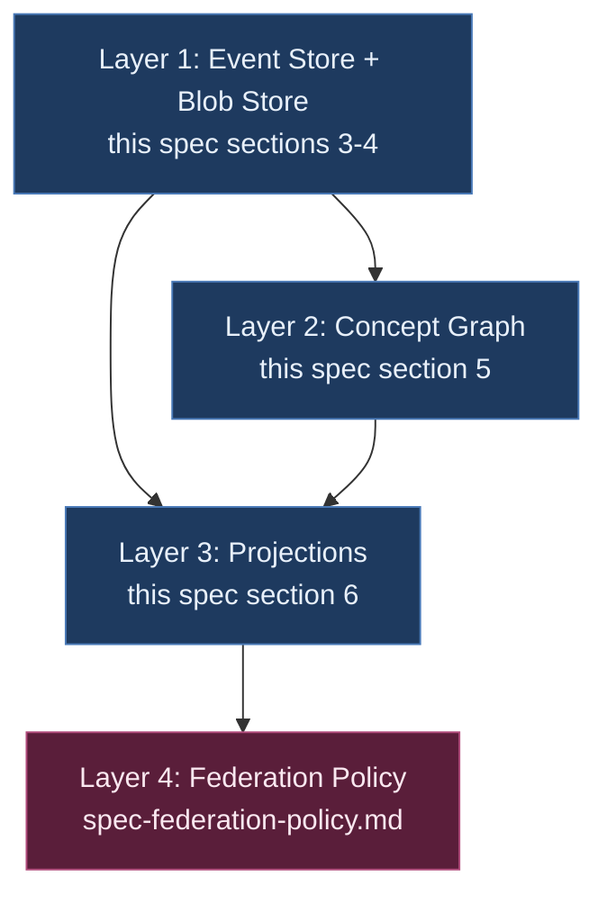

# Axiom Memory — Technical Specification

**Status:** Draft (normative for Axiom 0.11+; supersedes overlapping sections of `spec-knowledge-graph.md`, `spec-session-store.md`, `spec-agent-state-management.md` per §11)
**Owner:** Ben Booth
**Created:** 2026-04-26
**Authority:** Single normative contract for every Axiom memory operation. Extensions write against this spec.
**PRD:** `docs/prds/prd-memory.md`
**Related:**
- ADR-033 (layered memory architecture — the architecture commitment)
- `spec-federation-policy.md` (per-primitive federation contract)
- `spec-classification-boundary.md` (regulatory regimes consumed here)
- ADR-026/027/028 (ownership, federated memory mechanics, trust graph)
- ADR-031 (extension self-containment)
- `working/memory-benchmarks.md` (compliance tests for this spec)

---

## Quick Start — what 95% of extension authors need

If you are writing a new Axiom extension and "just want memory to work," you need three things. They take ~10 lines of code.

**1. Scaffold the manifest** (one command, picks sensible defaults):

```bash
axi ext init my-extension --memory=collaborative-learning   # or chat-agent, research-loop, readonly
```

**2. Build the stack and write events** (one import, one bootstrap call):

```python
from axiom.memory import build_memory_stack

stack = build_memory_stack("my-extension-scope")

# Every memorable event goes through one call.
stack.write_with_extraction(
    content={
        "event_time": "2026-04-26T12:00:00Z",
        "what_happened": "user clicked X",
        "scope": "my-extension-scope",
    },
    cognitive_type="episodic",        # one of MIRIX 6-types; episodic = "thing happened at T"
    principal_id="alice@org.com",     # who caused it
    agents=set(),                     # which agents took part
    resources=set(),                  # which resources were touched
)
```

That single call writes the fragment with cryptographic provenance, signed audit, default-deny visibility, unclassified classification, and runs the deterministic concept extractor over the content. Federation, classification, retraction, and projection all work against it for free.

**3. Read events back as projections** (one factory call per query):

```python
from axiom.memory.projections import TaskSpec

projection = stack.recent_activity(window_n=5)
result = projection.project(
    TaskSpec(task_type="recent_activity", scope="my-extension-scope"),
    principal_id="alice@org.com",
)
prompt_context = format_recent_for_prompt(result)   # ready to prepend to an LLM system prompt
```

That's the full critical path. **You get every spec-memory invariant — provenance, immutability, tombstone-aware reads, classification-aware extractor selection, replay determinism, federation-readiness — without touching any of them directly.**

If you want more (custom extractors, custom projections, different visibility/classification defaults, federation gateway integration, hybrid extractors with LLM providers, classified-content handling), use the navigator below to find the right section. Otherwise, Quick Start is the spec — stop reading now and ship.

---

## Choose Your Path — which sections do I need to read

The spec is normative for everyone but the deep sections only matter for specific situations. Pick your path:

| You are building... | Read |
|---|---|
| **A typical extension** (write some events, read recent activity, ship) | Quick Start above. You're done. |
| **An extension with custom event types beyond episodic** (procedural, semantic, etc.) | + §3.2 (MIRIX taxonomy semantics) |
| **An extension with concept extraction beyond the default text extractor** | + §5.3 (ConceptExtractor protocol) + §10 (extractor capability gate) |
| **A new projection beyond `recent_activity`** | + §6 (Projection contract — purity, replay, composition) |
| **An extension that touches regulated content** (CUI, EAR, ITAR, Part 810) | + §10 (visibility + classification fields) + `spec-classification-boundary.md` + §14.1 (lint/enforcement gradient) |
| **An extension consumed across cohorts / orgs** (federation) | + `spec-federation-policy.md` (visibility horizon, trust profile, gateway) + §7 |
| **An extension with bespoke storage you can't easily migrate** | + §9 (storage discipline + manifest declaration + recipes) |
| **A platform operator deploying third-party extensions** | + §9.1 (manifest schema) + §9.2 (lint) + §9.3 (audit) + §12 (compliance checklist) |
| **An AI safety / compliance reviewer** | + §3.3 (provenance) + §6 (projection citations) + §12 (compliance) + `working/memory-benchmarks.md` |
| **A backend implementer** (alternative `EventStore` / `ConceptGraph` / `BlobStore`) | All of §3 / §4 / §5; the protocol invariants (I1–I16) are the contract |

**The Tooling section (§9.6) makes the rules invisible.** `axi ext lint --memory` flags every violation with the file, line, and exact remediation. `axi ext init --memory=<profile>` scaffolds a lint-clean starting point. If you don't read the spec at all and still want to be compliant, run those tools.

---

## 1. Scope and authority

This spec governs **every memorable write and read** in Axiom. A write is *memorable* if any of the following are true:

- It carries provenance (who/what/when produced it).
- It may be projected into a derived view (a brief, a context, a summary).
- It may flow across a scope boundary (cohort, federation peer, organization).
- It is subject to retraction obligations (a user may demand it be forgotten).
- It is subject to retention obligations (regulatory or contractual).
- It is subject to classification (CUI, EAR, ITAR, Part 810, proprietary).

If any of those is true, the write goes through Axiom Memory. If none is true, the write may use `EphemeralStore` (§9) — explicitly, by declaration.

**Authority over adjacent specs:** §11 enumerates the three reconciliations.

## 2. Architecture summary

Four layers per ADR-033. Diagram is not duplicated here; ADR-033 is authoritative on layer separation.



This spec normatively defines L1, L2, L3 contracts and L4 consumption. Federation primitives live in `spec-federation-policy.md`.

## 3. Layer 1 — Event Store

### 3.1 MemoryFragment shape

The atomic unit. Frozen dataclass. All fields immutable post-construction; mutations are **new fragments referencing the prior** (per ADR-026 ownership semantics).

```python
@dataclass(frozen=True)
class MemoryFragment:
    id: str                                    # UUID4 from axiom.infra.identifiers
    cognitive_type: CognitiveType              # MIRIX 6-type — see §3.2
    content: dict[str, Any]                    # extension payload; type-validated
    provenance: Provenance                     # immutable (T, U, A, R)

    retention_tier: RetentionTier = ACTIVE     # ACTIVE | COMPRESSED | ARCHIVED
    ttl: Optional[str] = None                  # ISO 8601 expiry; None = no TTL

    visibility: VisibilityHorizon = SCOPE_INTERNAL                       # §10 + spec-federation-policy
    classification: ClassificationStamp = ClassificationStamp.unclassified()  # §10

    # Reserved fields filled by downstream subsystems:
    effectiveness_score: Optional[float] = None
    valid_time_start: Optional[str] = None
    valid_time_end: Optional[str] = None
    policy_coord: Optional[dict] = None
    signature: Optional[str] = None
    ownership: Optional[Ownership] = None
    blob_refs: list[BlobHash] = field(default_factory=list)   # Stage 4
```

`to_dict()` and `fragment_from_dict()` are stable round-trip serialization. Backward-compat decode rule: missing optional fields decode with their default values; never raise on absence.

### 3.2 MIRIX 6-type taxonomy (normative)

| Type | Semantics | Examples (extension-domain-agnostic) |
|---|---|---|
| `core` | Identity-level facts about a scope's purpose / governance | A cohort's curriculum statement; a research project's hypothesis |
| `episodic` | Things that happened at a specific time | A user's question, a tool call, a simulation run |
| `semantic` | Concept-level facts derived from interactions or material | "Concept X is related to concept Y"; extracted from L2 |
| `procedural` | How-to knowledge, with measurable effectiveness | A workflow; a refactoring recipe; a mode prompt |
| `resource` | Pointers to large content via blob refs | An uploaded document; a model artifact; a dataset |
| `vault` | Retracted content, preserved for audit but never projected | A tombstoned interaction; a deleted draft |

Each fragment-type validator MAY require specific `content` keys (e.g., `episodic` requires `event_time`). Extensions extend type validation in `axiom.memory.fragment._validate_content`.

### 3.3 Provenance — `(T, U, A, R, S)` tuple

Per ADR-026 + Collaborative Memory paper §3.2, extended with `S` per
§3.7 below. Immutable at construction:

```python
@dataclass(frozen=True)
class Provenance:
    timestamp: str          # T(m): ISO 8601 with TZ
    principal_id: str       # U(m): contributing principal
    agents: frozenset[str]  # A(m): agents involved
    resources: frozenset[str]  # R(m): resources accessed
    session_id: str = ""    # S(m): originating session (see §3.7)
```

The `session_id` slot is mandatory at write time for any new fragment
written through `CompositionService.write` (enforced when the active
session manager is present). It MAY be empty (`""`) for legacy
fragments written before session_id was introduced; reads MUST decode
those as "no session" (interpreted as cross-session per §3.7's recall
rules) for backwards compatibility — no migration is required for
existing on-disk fragments.

### 3.4 EventStore protocol

```python
class EventStore(Protocol):
    def append(self, fragment: MemoryFragment) -> str: ...
    def tombstone(self, target_id: str, *, actor: str, reason: str) -> str: ...
    def get(self, fragment_id: str) -> MemoryFragment | None: ...
    def list(self, *, scope: str, since: str | None = None,
             until: str | None = None) -> Iterable[MemoryFragment]: ...
    def is_tombstoned(self, fragment_id: str) -> bool: ...
```

**Invariants (must hold across all backend implementations):**

- **I1. Per-scope isolation.** `list()` only returns fragments within the named scope. Cross-scope reads happen only through the federation gateway (Layer 4).
- **I2. Append-only.** `append()` never mutates an existing fragment. Tombstones are themselves new fragments; the original line stays on disk.
- **I3. Deterministic IDs for tombstones.** Tombstone records are content-addressed (hash of target_id + actor + timestamp) so duplicate tombstones are idempotent at the event level.
- **I4. Tombstone propagation.** `is_tombstoned(id)` returns true iff there exists a tombstone targeting `id`. Layers 2 and 3 honor this on every read; tombstoned fragments never appear in projections.

### 3.5 Default backend

`ArtifactRegistry` with `SQLiteBackend` (zero-config, file-based). `ArtifactRegistry` is content-addressed and version-chained per its existing contract. Higher tiers (Server, Platform) substitute Postgres / SeaweedFS via the same protocol.

The SQLite backend uses **thread-local connections** (added 2026-04-26) so it can be safely shared across FastAPI/uvicorn worker threads without `sqlite3.ProgrammingError`.

### 3.6 Retraction semantics — what subjects can and cannot retract

A common misunderstanding: "retraction" sounds like the subject can erase a thing they shared. The spec is more precise: **retraction is the subject's control over how the system *uses* their fragment in *future* derivations** — not a way to rewrite already-shared history.

What a memory subject (the principal whose `provenance.principal_id` matches a fragment's) CAN retract:

- The fragment's contribution to **every projection computed after the retraction**. Briefs, summaries, ask-context, study plans, peer signals — the next derivation never includes the tombstoned fragment.
- The fragment's contribution to **every concept-graph snapshot computed after the retraction**. Concept-extracted_from rows pointing at the tombstoned fragment are filtered out at projection time per I15.
- The fragment's content from **every federated outbound projection after the retraction** (when Stage 5 lands). Outflow rules re-evaluate per request.

What a memory subject CANNOT retract:

- **Anything another principal already perceived.** Cached projections that have already been rendered; instructor briefs already read; agent outputs already shown to a third party. Retraction is forward-looking; it does not unsay.
- **Fragments authored by a different principal.** A scope operator's brief is *their* fragment, not the subject's, even if it cites the subject. Cross-principal forget is rejected at the store and 404s at the HTTP layer.
- **The audit trail of the retraction itself.** The original fragment line + the tombstone both stay on disk for compliance review — what was retracted, when, by whom, against what content, with the audit signed.

**This boundary is intentional.** It satisfies three otherwise-conflicting concerns:

| Concern | How retraction handles it |
|---|---|
| Subject's "right things in memory" — they don't want fragments they regret feeding into future system behavior | ✓ Tombstones propagate to every future derivation |
| Operator's pedagogical / managerial interest in what's been said | ✓ Already-rendered views aren't retroactively edited |
| Compliance / audit obligation to know what changed | ✓ Both original and tombstone preserved on disk; "K retractions this period" is queryable without revealing content |

**Cross-principal scope.** The store enforces principal-scoped retraction at every layer:

- `EventStore.tombstone(target_id, actor=...)`: actor MUST equal target fragment's `provenance.principal_id`. Mismatches return `forgotten=False` with a "no matching interaction for that student + id" reason. (Implementation: `axiom.extensions.builtins.classroom.classroom_interaction.ClassroomInteractionStore.forget`.)
- HTTP surface: `DELETE /classroom/memory/{student_id}/{interaction_id}` returns 404 when `student_id` doesn't own the interaction. No cross-student leakage of "does this id exist."

**For instructor-uploaded materials, peer-curated content, and similar `provenance.principal_id != subject` fragments** — the subject can complain to the operator, but they cannot retract. This is correct: those fragments belong to the operator's principal; the operator handles their retention per their own retraction discipline.

**Documentation surface for end users.** Each consuming extension is responsible for explaining this scope to its end users in plain language (see `prd-memory.md §4` archetype-vs-extension table). Extensions MUST NOT promise retraction semantics broader than what this section allows.

### 3.7 Session — scoping fragments to where they happened

Every fragment is written *from* a session — the CLI / chat / process invocation that called `CompositionService.write`. The session is the unit of "things you did together" and exists to balance two otherwise-conflicting needs:

| Need | Failure when ignored |
|---|---|
| Per-session scoping for ephemeral context | Cross-pollution: a user working in repo A and repo B in parallel sees A's recent commits when asking about B |
| Cross-session continuity for stable knowledge | Forgetting: the user has to re-teach the assistant the same procedural shortcut every CLI restart |

The reconciliation is **type-aware default scope** (§3.7.3 below) rather than a global flag.

#### 3.7.1 Session identity

A session has two identifiers — the immutable machine ID and the mutable human name:

| Field | Shape | Lifecycle |
|---|---|---|
| `session_id` | Stable URI, e.g. `session://01H9X3...` (ULID or UUIDv7) | Generated at session start; never changes |
| `session_name` | Human-readable string | Auto-generated at session start as `<cwd-basename>-<YYYY-MM-DD-HHMM>` (e.g. `axiom-2026-05-18-1042`); user-renameable any time via `axi session rename` |

The `session_id` is what flows through `Provenance.session_id` and across MCP. The `session_name` is a *display alias* maintained in a separate session registry (§3.7.4); fragments themselves never carry the name.

#### 3.7.2 Session lifecycle

A new session is created when:

- An `axi` / `axi chat` / `axi memory <verb>` process starts AND no existing session is bound to the current `(principal_id, cwd)` — auto-create with the default name.
- The user runs `axi session new [<name>]` — creates a fresh session, optionally with a chosen name.

A session is *resumed* (its `session_id` reused for new writes) when:

- The user runs `axi session use <name|id>` — binds the current process to an existing session.
- Process auto-bind detects an existing recent session for the same `(principal_id, cwd)` and the previous process ended cleanly within a configurable window (default `axi.session.auto_resume_window = "4h"`).

A session is *not* automatically ended. Sessions are append-only metadata; the registry retains them indefinitely so that fragments written under their id remain interpretable.

#### 3.7.3 Read-scope rules (MIRIX-aligned, normative)

The default scope for any `CompositionService.read` / `read_filtered` / MCP `axiom_memory__retrieve` call follows the cognitive type of each candidate fragment:

| Cognitive type | Default scope | Rationale |
|---|---|---|
| `episodic` | **Current session only** | Events happen *in a session*. The user's prior questions, tool calls, and turn-by-turn context belong to where they happened. |
| `core` | **Cross-session always** | Identity-level facts about a principal or scope's purpose do not change between sessions. |
| `procedural` | **Cross-session always** | How-to knowledge is global by definition — a workflow learned in session A should be available in session B. |
| `resource` | **Cross-session always** | Pointers to external content (blob refs, dataset handles) are session-agnostic. |
| `semantic` | **Cross-session by relevance** | Derived facts ("concept X relates to concept Y") are usually globally true but can be domain-specific. Phase-1 implementation uses keyword-overlap + recency as the relevance signal; vector-similarity tuning is `prd-memory.md §9` open question. |
| `vault` | **Never returned** | Tombstoned content per §3.6 invariants. |

**Read scopes (callable):**

| Scope literal | Behavior |
|---|---|
| `"default"` (the default) | Apply the type-aware rule above per fragment. |
| `"strict"` | Current session only, regardless of type. |
| `"current"` | Alias for `"strict"`. |
| `"all"` | All sessions for the principal, all types (except `vault`). |
| `"session:<id_or_name>"` | Filter to exactly the named session. |

**Backwards compatibility.** A fragment with `session_id == ""` is treated as cross-session for *every* cognitive type — it predates the session concept and the conservative assumption is that the original author intended it as broadly available knowledge.

**Provenance preservation.** Cross-session reads MUST still return the originating `session_id` in the fragment's provenance. Callers can see "this useful procedural fact came from your `axiom-cleanup-2026-05-18-1042` session" without the read scope being narrowed.

#### 3.7.4 Session registry

A small append-only store keyed by `session_id`:

```python
@dataclass(frozen=True)
class SessionMetadata:
    session_id: str            # session://01H9X3...
    name: str                  # human-readable; renameable
    principal_id: str          # owning principal
    created_at: str            # ISO 8601
    last_active_at: str        # ISO 8601, updated each write
    cwd_hint: str              # original cwd basename for auto-resume
    note: str = ""             # free-form user annotation
```

The registry lives at `~/.axi/sessions/` (one JSON file per session for greppability) by default; Server / Platform tiers MAY back it with the same SQLite the `ArtifactRegistry` uses, keyed on `(principal_id, session_id)`.

The registry is **operational metadata**, not a memorable fragment — it does not flow through `CompositionService` and is not federated. Sessions themselves are private to the principal; the *fragments written under them* carry their own visibility / classification per the existing federation rules.

#### 3.7.5 CLI affordances (extension-author surface)

Per `prd-memory.md §5` item 8 (one user-facing command per affordance):

| Verb | Behavior |
|---|---|
| `axi session current` | Print the current session's name + id |
| `axi session list` | List recent sessions for the active principal |
| `axi session new [<name>]` | Start a fresh session |
| `axi session use <name\|id>` | Bind the current process to an existing session |
| `axi session rename <new-name>` | Rename the current session (id unchanged) |

Extension-specific session UIs (e.g., chat-surface session picker) MAY layer on top of this primitive but MUST NOT bypass the registry.

## 4. Layer 1 — Blob Store

### 4.1 BlobStore protocol

```python
BlobHash = str  # sha256 hex

class BlobStore(Protocol):
    def put(self, content: bytes) -> BlobHash: ...
    def get(self, hash: BlobHash) -> bytes: ...
    def exists(self, hash: BlobHash) -> bool: ...
    def gc(self, *, live_set: set[BlobHash]) -> int: ...   # ref-counted GC
```

**Invariants:**

- **I5. Content-addressed.** Hashes are sha256; `put(x)` is idempotent (same content → same hash, no duplicate storage).
- **I6. Reference-counted GC.** Blobs are deleted only when no live (non-tombstoned) fragment references their hash, AND retention policy permits.
- **I7. Federation strips refs.** When the gateway projects fragments outward, blob refs are stripped by default unless the trust profile + per-fragment policy explicitly authorize raw content transfer (per `spec-federation-policy.md §6`).

### 4.2 Default backends per profile

| Profile (ADR-019) | Backend | Notes |
|---|---|---|
| Edge | `FilesystemBlobStore` | One file per blob, hash as filename |
| Workstation | `FilesystemBlobStore` | Same; larger disk |
| Server | `SeaweedFSBlobStore` (post-Prague) | Apache 2.0 per `feedback_no_minio` |
| Platform | `SeaweedFSBlobStore` + `EncryptedBlobStore` wrapper for classified scopes | Per-scope encryption keys |

## 5. Layer 2 — Concept Graph

### 5.1 Concept and edge types

```python
@dataclass(frozen=True)
class Concept:
    concept_id: str           # deterministic hash of canonical_name (lowercase, normalized)
    canonical_name: str
    extracted_from: list[str] # fragment_ids — provenance back to L1
    confidence: float         # extractor's confidence 0.0-1.0

@dataclass(frozen=True)
class ConceptEdge:
    from_concept: str
    to_concept: str
    edge_type: str            # extension-defined: "related_to" | "depends_on" | "contradicts" | "supports"
    weight: float
    evidence: list[str]       # fragment_ids supporting this edge
```

### 5.2 ConceptGraph protocol

```python
class ConceptGraph(Protocol):
    def upsert_concept(self, c: Concept) -> None: ...
    def upsert_edge(self, e: ConceptEdge) -> None: ...
    def neighbors(self, concept_id: str, *, hops: int = 1,
                  edge_types: set[str] | None = None) -> list[Concept]: ...
    def query(self, q: GraphQuery) -> list[Concept]: ...
    def snapshot_at(self, timestamp: str) -> "ConceptGraph": ...   # replay
    def rebuild_from_log(self, *, scope: str, since: str | None = None) -> int: ...
```

**Invariants:**

- **I8. Fully derivable from L1.** `rebuild_from_log()` replays event log → concept graph; the result is byte-equivalent to the live graph at the given log head.
- **I9. Versioned.** `snapshot_at(t)` returns the graph as it would have been computed from events ≤ t.
- **I10. Provenance-back to L1.** Every concept and edge carries `extracted_from` / `evidence` lists pointing at the fragment_ids that produced them. No orphan concepts.

### 5.3 ConceptExtractor protocol

Extensions register one or more extractors per fragment type:

```python
@dataclass(frozen=True)
class ExtractorCapability:
    runs_on: str                 # "local" | "in_enclave" | "external_provider"
    provider_id: str | None      # "bonsai" | "openai" | None for deterministic
    logs_to: list[str]           # ["local_audit"] | ["openai_metrics", ...]
    max_classification: str      # highest classification this extractor may see

class ConceptExtractor(Protocol):
    capability: ExtractorCapability
    handles: set[CognitiveType]  # which types this extractor processes
    def extract(self, fragment: MemoryFragment) -> list[Concept]: ...
    def link(self, fragment: MemoryFragment,
             existing: ConceptGraph) -> list[ConceptEdge]: ...
```

**Invariants:**

- **I11. Classification-gated extractor selection.** The registration layer matches `extractor.capability.max_classification` against `fragment.classification.level` before invocation. CUI fragments only receive extractors capable of handling CUI; unclassified extractors never see CUI. This is the implementation of `spec-classification-boundary.md` Invariant "LLM operations are domain-scoped and must never cross."
- **I12. Multi-extractor conflict resolution.** When multiple extractors fire for the same fragment, schema-driven extractors (deterministic) take precedence over LLM extractors (probabilistic) for the same `(concept_id, edge_type)` tuple.
- **I13. Async-capable.** Extractors MAY return immediately and queue work. Projections must tolerate "graph slightly behind log" (snapshot at projection time).

### 5.4 Default backend

SQLite-backed `ConceptGraph` for v0 (Edge / Workstation profiles, zero-deps). Server / Platform profiles MAY substitute Apache AGE on Postgres (the `spec-knowledge-graph.md` backend, scoped per §11). Cognee adoption is per-component per `working/cognee-vs-build-study.md`; protocol stays Axiom-owned.

## 6. Layer 3 — Projections

### 6.1 TaskSpec and Projection protocol

```python
@dataclass(frozen=True)
class TaskSpec:
    task_type: str
    scope: str
    parameters: dict[str, Any] = field(default_factory=dict)
    as_of: Optional[str] = None     # time-travel; None = "now"

class Projection(Protocol[T]):
    def project(self, task: TaskSpec, *, store: EventStore,
                graph: ConceptGraph) -> T: ...
```

**Invariants:**

- **I14. Pure function.** Same `(events, graph, task)` always yields byte-equivalent output. Required for replay determinism. Implementations MAY cache; cache key is `hash((scope, task, as_of, log_head))`.
- **I15. Tombstone-aware.** Projections never include tombstoned fragments. The tombstone check is part of the read path, not bolted on.
- **I16. Provenance-citing.** Every projection result carries the fragment_ids it composed (in a `provenance:` field on the result dataclass; see §6.3).

### 6.2 Shared primitives

Provided in `axiom.memory.projections`:

| Primitive | Purpose |
|---|---|
| `RecentActivityProjection` | N most-recent episodic fragments for a `(scope, principal)`. (Shipped 2026-04-26.) |
| `ConceptCoverageProjection` | Set of concept_ids touched by a principal in a scope. (Stage 2 follow-up.) |
| `ActorHistoryProjection` | All fragments authored by a principal, paginated. |
| `TimeWindowProjection` | All fragments in a scope between `[t0, t1]`. |

Extensions compose these into domain-specific projections (`BriefProjection`, `StudyPlanProjection`, `WorkingMemoryProjection`, `ResearchStatusProjection`).

### 6.3 Result-type contract

Every projection returns a frozen dataclass. The dataclass MAY carry a `provenance: list[str]` field of fragment_ids that the projection composed, satisfying I16. For backward compat, projections that haven't yet adopted explicit provenance citations satisfy I16 by carrying composing fragments by reference (e.g., `RecentActivity.fragments` itself fulfills the citation requirement).

### 6.4 Brief-as-projection

This spec normatively states that **derived views are projections, not stored artifacts**. Existing extension-bespoke brief-as-stored-state is migration-compatible per ADR-033 Stage 3, but new derived views MUST be projections.

## 7. Layer 4 — Federation Policy (consumption)

The four federation primitives — `VisibilityHorizon`, `ClassificationStamp`, `TrustProfile`, `FederationGateway` — are normatively defined in `spec-federation-policy.md`. This spec consumes them:

- Every `MemoryFragment` carries `visibility: VisibilityHorizon` (default `SCOPE_INTERNAL`) + `classification: ClassificationStamp` (default unclassified).
- The federation gateway is the only runtime that reads both together. Outbound rule: `min(visibility.outflow_level, classification.allowed_outflow_level())`.
- Gateway is hop-bounded by default (`max_hops=1`); deeper traversal requires explicit policy.

## 8. CompositionService — the single entry point

Per ADR-026. Every memorable write goes through `CompositionService.write`; every read goes through `CompositionService.read`. Skipping the service is the architectural violation that lint catches (§9).

```python
class CompositionService:
    def write(self, *, content: dict, cognitive_type: str,
              principal_id: str, agents: set[str], resources: set[str],
              session_id: str | None = None,  # §3.7; None → resolve from active session manager
              ownership: Ownership | None = None,
              visibility: VisibilityHorizon = SCOPE_INTERNAL,
              classification: ClassificationStamp = ClassificationStamp.unclassified(),
              at: str | None = None) -> MemoryFragment: ...
    def read(self, fragment_ids: list[str], *, user: str, agent: str,
             at: str | None = None) -> list[MemoryFragment]: ...
    def read_filtered(self, *, principal_id: str,
                      scope: str = "default",       # §3.7.3 scope literals
                      cognitive_types: list[str] | None = None,
                      limit: int | None = None,
                      at: str | None = None) -> list[MemoryFragment]: ...
    def llm_response(self, *, response_text: str, ...) -> BreachCheckResult: ...
```

The service composes policy → access → gating → attestation → persistence → audit. No call site bypasses it. `read_filtered` enforces the §3.7.3 scope rules; callers MUST NOT replicate scope logic at the call site.

## 9. Storage discipline

Per ADR-033 *Avoiding shadow memory*. This spec normatively defines the two sanctioned primitives:

```python
class MemoryStore(Protocol):
    """L1 entry point — every memorable write goes through CompositionService.
    Carries provenance, classification, visibility, retention. Federable.
    Retractable. Auditable."""
    def write(self, fragment: MemoryFragment) -> str: ...

class EphemeralStore(Protocol):
    """For genuine UI / session / cache state. Auto-cleared on retention
    expiration. Never federated. Never classified above 'unclassified'.
    Never participates in projections.

    Survival contract: a key is guaranteed to disappear at or before its
    declared TTL. No survival across major version upgrades."""
    def put(self, key: str, value: bytes, *, ttl_s: int) -> None: ...
    def get(self, key: str) -> bytes | None: ...
    def delete(self, key: str) -> None: ...
```

### 9.1 AEOS manifest declaration

#### 9.1.1 Why every extension declares storage surfaces

Memory hygiene scales only when every extension's storage footprint is *declared in the manifest*, *cross-checked against the source*, and *audited at runtime*. Three failure modes the declaration prevents:

- **Silent shadow accumulation.** Without the manifest, an extension's "save draft" tables, "session presence" caches, and "notification queue" rows can quietly grow into untracked memory — federable-by-mistake, retraction-immune, classification-blind. The manifest forces a one-line answer: "is this memory or ephemeral?"
- **Policy gap discovery happens at audit time, not design time.** Without explicit declarations, an operator deploying to a regulated context discovers an extension's external-LLM extractor only after it's already shipped. The manifest surfaces every storage + extraction surface at install time.
- **Migration becomes tractable.** When the layered architecture promotes a primitive (Stage 4 blob extraction, Stage 5 federation gateway), every extension that declared its surfaces gets automatic migration. Undeclared surfaces require per-extension archaeology.

Three concrete benefits the declaration enables:

- **Lint runs against your code with precision** (§9.2). It compares your declarations to your imports + writes; warnings name the exact file and line.
- **`axi ext shadow-audit` is a one-line check** for the operator (§9.3). They diff the manifest against runtime state and see deltas immediately.
- **Federation, classification, retraction, retention work uniformly** because every memorable surface is in `MemoryStore`, and `MemoryStore` carries every primitive.

The manifest entry is short. The reasoning behind every field is below; copy-paste recipes for common shapes follow.

#### 9.1.2 Full schema

```toml
# Required for every extension that touches memory.
# Authors stub this with `axi ext init --memory` (see §9.1.5);
# subsequent additions are warned by lint until added.
[extension.storage]

# REQUIRED. List of MIRIX cognitive types this extension WRITES
# through CompositionService.write. May be empty if the extension
# only reads memory written by others — but you still declare the
# section to assert "I read but never write."
#
# Each entry is one of: "core" | "episodic" | "semantic" |
#                       "procedural" | "resource" | "vault"
# (per spec-memory §3.2 MIRIX taxonomy). Lint warns when:
#   - a write through CompositionService uses a type not listed here,
#   - a type listed here is never written in source.
memory_fragment_types = []

# REQUIRED (may be empty). List of EphemeralStore namespaces this
# extension writes to. Each namespace name is a flat string; pick
# names that read like operational state (cursor_position, autosave,
# session_presence, view_state, in_flight_rate_limit). If you find
# yourself naming something that sounds memorable
# (history, decisions, drafts, results), it's probably memory — promote
# it to memory_fragment_types instead.
ephemeral_namespaces = []

# OPTIONAL but recommended. Per-fragment-type write-time defaults.
# When set, the dual-write adapter / composition-service uses these
# instead of the spec-wide defaults (SCOPE_INTERNAL + unclassified).
# Lint warns when a write supplies a value lower than these defaults
# for the same type (you wanted stricter; you accidentally went looser).
[extension.storage.defaults]

# Per type → default visibility horizon (overrides SCOPE_INTERNAL).
# Use the abstract horizon names from spec-federation-policy §3.
# Reasonable patterns:
#   - episodic interactions:        SCOPE_INTERNAL  (the default)
#   - shared curriculum / corpus:   PEERS_DECLARED
#   - published artifacts:          PUBLIC
visibility = { episodic = "scope_internal", resource = "peers_declared" }

# Per type → default classification level (overrides "unclassified").
# Use the regulatory level names from spec-classification-boundary §2.
# Reasonable patterns:
#   - student-submitted:    "unclassified"
#   - export-controlled:    "unclassified"  + ear flag in stamp
#   - government-handled:   "cui" or "secret" per regime
classification = { episodic = "unclassified" }

# OPTIONAL. List of ConceptExtractors this extension registers.
# Each entry's name MUST match the extractor instance's
# capability.name. Lint cross-checks the registration call sites.
# Operators reading the manifest can inspect every extractor's
# capability without running the extension.
extractors_registered = []

# OPTIONAL. List of Projection class names this extension defines
# (subclasses of axiom.memory.projections.Projection). Helps operators
# understand the derivation surface; no lint enforcement today.
projections_provided = []

# OPTIONAL. Justifications for raw storage that bypasses MemoryStore /
# EphemeralStore (e.g. wrapping a third-party library that brings its
# own DB). Each entry is a short string + path glob. Lint warns when
# raw storage in the codebase isn't covered by an entry here.
external_storage_justifications = [
  # { reason = "bundles native sqlite-vec index for cold-start retrieval",
  #   paths = ["src/myext/vendored_index/*.py"] },
]
```

Every field above either silences a specific lint warning or adds an operator-facing affordance. None of them are decorative.

#### 9.1.3 Worked examples per profile

Copy-paste-ready manifests for common extension shapes. Each is annotated with which lint warning it silences.

**Profile A — "I write episodic events and let an aggregator project them" (collaborative-learning shape):**

```toml
[extension.storage]
memory_fragment_types = ["episodic"]      # we write user interactions
ephemeral_namespaces  = ["draft_autosave"] # autosave the draft form

[extension.storage.defaults]
visibility = { episodic = "scope_internal" }  # interactions stay scoped
classification = { episodic = "unclassified" }

extractors_registered = ["deterministic_text"]  # the default + nothing custom
```

**Profile B — "I curate semantic facts from conversations + emit shared knowledge" (chat-agent shape):**

```toml
[extension.storage]
memory_fragment_types = ["episodic", "semantic"]
ephemeral_namespaces  = ["working_window", "in_flight_tool_calls"]

[extension.storage.defaults]
visibility = {
  episodic = "scope_internal",     # conversation-only by default
  semantic = "peers_declared",     # extracted facts shareable with declared agents
}

extractors_registered = ["llm_topic_extractor", "tool_use_extractor"]

projections_provided = ["WorkingMemoryProjection", "AgentDecisionProjection"]
```

**Profile C — "I write large structured payloads and large blobs; restrict outflow until peer-reviewed" (research-loop shape):**

```toml
[extension.storage]
memory_fragment_types = ["episodic", "resource", "semantic"]
ephemeral_namespaces  = ["job_status"]

[extension.storage.defaults]
visibility = {
  episodic = "scope_internal",     # hypothesis, experiment_run events stay private
  resource = "request_gated",       # blobs (datasets, drafts) stay request-only
  semantic = "scope_internal",     # findings stay private until promoted
}
classification = { episodic = "unclassified", resource = "unclassified" }

extractors_registered = ["schema_extractor", "citation_extractor"]
```

**Profile D — "I read others' memory and don't write" (read-only analytics shape):**

```toml
[extension.storage]
# Empty arrays are explicit assertions: "I write nothing, I cache nothing".
memory_fragment_types = []
ephemeral_namespaces  = []
```

**Profile E — "I bundle a vendored library with its own storage and need to declare it":**

```toml
[extension.storage]
memory_fragment_types = ["episodic"]
ephemeral_namespaces  = []

# The vendored library writes its own SQLite index for fast cold-start
# retrieval. Lint warns about the raw sqlite usage; this entry justifies
# it so the warning is suppressed AND the operator-facing audit knows
# where to look.
external_storage_justifications = [
  { reason = "vendored sqlite-vec index for cold-start; rebuilt from L1 on demand",
    paths = ["src/<ext>/vendored_index/*.py"] },
]
```

#### 9.1.4 Recipes — pick the closest, edit the values

| Scenario | What you write |
|---|---|
| Single fragment-type, default everything | `memory_fragment_types = ["episodic"]` (one line) |
| Read-only extension | Both arrays empty + a comment naming the scope you read |
| Federated knowledge that should reach declared peers | Add `visibility = { semantic = "peers_declared" }` |
| Classified content (CUI / Part 810) | Add `classification = { episodic = "cui" }` + ensure all extractors declare matching `max_classification` |
| Vendored library you can't rewrite | Add an `external_storage_justifications` entry; lint suppresses the raw-DB warning for the matched paths |
| Custom LLM extractor with provider declaration | List its name in `extractors_registered`; in code, the extractor's `capability` dataclass carries provider_id + logs_to + max_classification |

#### 9.1.5 Scaffolding — `axi ext init` produces this for free

The `axi ext init <name>` scaffold writes a minimal, lint-clean manifest based on a template choice:

```bash
$ axi ext init my-tutor --memory=collaborative-learning
# Writes axiom-extension.toml with the Profile A shape (tweak the values)

$ axi ext init my-agent --memory=chat-agent
# Profile B shape

$ axi ext init my-loop --memory=research-loop
# Profile C shape

$ axi ext init my-readonly --memory=readonly
# Profile D shape (empty arrays + commented annotation)

$ axi ext init my-ext --memory=none
# Skips the [extension.storage] section entirely; lint nags until added
```

The scaffolding is the answer to "ease of implementation." Authors who don't think about memory get the right defaults; authors who do think about it edit the right values in one TOML file.

#### 9.1.6 What lint actually does with this section

The lint pass (`axi ext lint`) cross-references every line of the manifest against the source tree. Per §9.2 the rules; here the *outcomes* an author sees:

- **Author writes through CompositionService with a type not in `memory_fragment_types`.**
  Warning: *"`<file>:<line>` writes `cognitive_type='procedural'` but `procedural` is not in `[extension.storage].memory_fragment_types`. Add it to the manifest, or change the write."*
- **Author imports `sqlite3` directly anywhere except a path covered by `external_storage_justifications`.**
  Warning: *"`<file>:<line>` imports `sqlite3` directly. Use `axiom.memory.MemoryStore` (memorable) or `axiom.memory.EphemeralStore` (transient). If this is unavoidable (vendored library, native dependency), add an entry to `[extension.storage].external_storage_justifications`."*
- **Author registers an extractor whose name isn't in `extractors_registered`.**
  Info: *"`<file>:<line>` registers extractor `<name>`; consider listing it in `[extension.storage].extractors_registered` so operators see it when reading the manifest."*
- **Author declares a fragment type but never writes it.**
  Info: *"`memory_fragment_types` lists `vault` but no write of `cognitive_type='vault'` was found in source. Possibly a stale declaration; safe to remove."*

Every warning names file + line + the exact remediation. Lint is the substitute for memorizing this spec.

#### 9.1.7 Migration path for extensions that don't yet declare

Extensions that predate this spec section land in three buckets:

1. **Already-aligned (most existing classroom code).** No memory writes outside `CompositionService`; no `EphemeralStore` use yet. Add a stub `[extension.storage]` with empty arrays; lint guides you from there.
2. **Has bespoke stores (e.g., classroom's eight stores per ADR-033 Stage 1).** The dual-write adapter is the path. Manifest lists the new `memory_fragment_types`; bespoke stores stay during migration; lint silences the JSONL writes via `external_storage_justifications` until ADR-033 Stage 4 retires them.
3. **Imports raw `sqlite3` / `sqlalchemy` for operational state.** Migrate to `EphemeralStore` (recommended) or document the raw use via `external_storage_justifications`. The migration helper `MigrateToMemory` (per ADR-033 Avoiding Shadow Memory) bridges existing rows.

Until Stage 4 lands the migration helper end-to-end, lint is advisory (T0 per §14.1) — extensions can declare progressively without breaking builds.

#### 9.1.8 Common gotchas

- **"I just need a temporary cache for one request"** — that's `EphemeralStore` with `ttl_s` shorter than your request lifecycle. Don't reach for raw dict-in-memory; the lint catches that and suggests `EphemeralStore`.
- **"I don't want to declare; my extension is internal"** — declarations cost one TOML stanza and unlock every operator-facing affordance. There's no internal-vs-public exemption; the marketplace gate (T2 per §14.1) eventually requires it anyway.
- **"My extractor needs OpenAI; I can't restrict to local"** — declare `runs_on = "external_provider"` + `provider_id = "openai"` + `max_classification = "unclassified"` in the extractor's capability. Classified deployments will refuse to invoke it; unclassified deployments will, and the operator sees both facts in the manifest.
- **"My extension stores both memorable and ephemeral data"** — that's normal. List both surfaces. The author's job is to put each write in the right primitive; the lint catches inconsistency.

### 9.2 Lint contract — `axi ext lint`

The lint pass cross-references source code against the manifest:

| Pattern detected | Outcome |
|---|---|
| Direct import of `sqlite3`, `sqlalchemy`, `psycopg2` | **Warn** — use `MemoryStore` or `EphemeralStore` |
| Writes to disk paths outside sanctioned roots | **Warn** — surface the path |
| Memory fragment types written but not declared | **Warn** — undeclared memory surface |
| Ephemeral namespaces used but not declared | **Warn** — undeclared ephemeral surface |
| Fragment types declared but never written | **Info** — possibly stale declaration |

Lint is **advisory**. Enforcement (CI gate or load-time refusal) is a future-context decision per ADR-033 open questions.

### 9.3 Audit tooling

`axi ext shadow-audit <extension>` walks the extension's data directories at runtime and reports any storage not covered by the manifest. Applies to Axiom core too.

## 10. VisibilityHorizon and ClassificationStamp on MemoryFragment

Both fields are immutable, set at write, defaults conservative.

| Field | Default | Source spec |
|---|---|---|
| `visibility: VisibilityHorizon` | `SCOPE_INTERNAL` | `spec-federation-policy.md §3` |
| `classification: ClassificationStamp` | `ClassificationStamp.unclassified()` | `spec-classification-boundary.md §2.1` |

Promotion (e.g., `SCOPE_INTERNAL → PEERS_DECLARED`) is performed by writing a new `VisibilityPromoted` event referencing the original; the original fragment is not mutated. Re-classification follows the same pattern (`ReclassificationApplied` event per the validated-classification pattern).

## 11. Reconciliation with adjacent specs

This spec is authoritative on the disputed regions. Each contending spec gets an amend-PR to align; until then, on conflict, this spec wins.

### 11.1 spec-knowledge-graph.md (Apache AGE on PG, RAG-chunk-flavored)

**Authority:** `spec-memory.md` §5 governs the L2 contract (`Concept`, `ConceptEdge`, `ConceptGraph`, `ConceptExtractor`).

**Reconciliation:** The Apache-AGE-on-Postgres backend in spec-knowledge-graph remains the **recommended Server-tier `ConceptGraph` backend** behind the Axiom-owned protocol. Existing extraction pipelines targeting RAG chunks become **one input source** to the unified L2 graph alongside `MemoryFragment`-flavored extraction. RAG-chunk entities and fragment-derived concepts share the canonical `concept_id` namespace.

**Amend-PR scope:** spec-knowledge-graph reorients §3 (Extraction Pipeline) to declare its capability and register as a `ConceptExtractor`; §4 (Query Interface) becomes one realization of `ConceptGraph.query()`; §1 explicitly defers to spec-memory for graph semantics.

### 11.2 spec-session-store.md (PG-backed sessions as primary table)

**Authority:** `spec-memory.md` §3 governs the L1 event log; §6 governs derived views.

**Reconciliation:** Session messages are `episodic` `MemoryFragment` with `cognitive_type = episodic`, `content = {role, text, model, ...}`, `scope = conversation_id`. The existing `session_messages` PG table becomes a **read cache** projection of L1, rebuildable at any time via `EventStore.list(scope=conversation_id)`. The "interaction log is a view over session data" framing inverts: the **interaction log is L1**; sessions are projections.

**Amend-PR scope:** spec-session-store renames its primary table to `session_messages_cache` (rebuilt-from-L1 indicator), adds an upsert-from-L1 path, keeps its existing query API for read efficiency. Live-sync stays as-is. CompositionService dual-write replaces direct table writes.

### 11.3 spec-agent-state-management.md (flat-file/PG state, locks, retention)

**Authority:** `spec-memory.md` §1 (scope) + §9 (storage discipline).

**Reconciliation:** Operational state — cursor positions, modal state, autosave drafts, session presence, lock files, in-flight rate-limit counters — stays in `axiom.infra.state` per spec-agent-state-management. **Cognitive state** (anything memorable per §1) routes through `MemoryStore`. The `EphemeralStore` protocol introduced in §9 is the new sanctioned home for genuinely-transient state, replacing direct flat-file writes for new extension code; existing flat-file users are grandfathered until Stage 4 of ADR-033.

**Amend-PR scope:** spec-agent-state-management adds a "Scope" section explicitly bounding itself to operational state, points at spec-memory for cognitive concerns, deprecates direct flat-file usage outside the `axiom.infra.state` API in favor of `EphemeralStore`.

## 12. Compliance checklist

Every extension that consumes memory MUST satisfy:

- [ ] **Declares storage surfaces in `axiom-extension.toml`** (`memory_fragment_types`, `ephemeral_namespaces`).
- [ ] **Routes every memorable write through `CompositionService.write`** (or via a documented adapter like `axiom.memory.adapters.interaction_writer`).
- [ ] **Writes set `cognitive_type` per §3.2 semantics** (no episodic-typed fact assertions; no resource-typed events without `ref` in content).
- [ ] **Sets `visibility` explicitly when not `SCOPE_INTERNAL`** (default-deny is the design posture; promotion is a deliberate act).
- [ ] **Sets `classification` explicitly when not `unclassified()`** (regulated content is a deliberate act).
- [ ] **Tombstones via `EventStore.tombstone()`** (no direct file delete; no row-level UPDATE).
- [ ] **Implements derived views as `Projection`s, not stored artifacts** (new code only; existing materialized views grandfather per Stage 3 migration).
- [ ] **Registers `ConceptExtractor`s with declared `ExtractorCapability`** (specifies provider, where it runs, max classification).
- [ ] **Passes the memory-benchmarks.md compliance suite** (replay determinism, federation isolation, tombstone propagation, provenance integrity).
- [ ] **Survives `axi ext shadow-audit`** with zero unaccounted storage surfaces.

## 13. Migration path

Per ADR-033. Stage references:

- **Stage 0** — bespoke stores live alongside `axiom.memory` (state at the time of this spec's draft).
- **Stage 1** — adapter dual-write through `CompositionService` (shipped 2026-04-26; canary extension is the first consumer).
- **Stage 2** — L2 graph package + first `ConceptExtractor` (next).
- **Stage 3** — `axiom.memory.projections` shared primitives + extension projection refactor (RecentActivityProjection shipped; brief / study-plan refactor pending).
- **Stage 4** — blob store extracted; manifests become projections.
- **Stage 5** — `FederationGateway` + per-fragment outflow enforcement on the wire.
- **Stage 6** — second-extension proof (research-loop or chat-agent on the same primitives).

This spec is normative as of Stage 1; it tightens at each stage as the corresponding layer matures.

## 14. Open items + decided items

### Decided (this spec is normative on these)

- **Concept identity across extensions: consolidate by canonical name.** Two extensions extracting the same canonical name produce the same `concept_id` deterministically. ``canonical_concept_id(name) = sha256(lowercase(whitespace_collapsed(name)))[:16]``. This makes federated concept-level joins free — peers naturally agree on identity by hashing the same canonical string with no global registry. Goal: do whatever makes federation work better. Decided 2026-04-26.

- **Time-travel cost: defer production-grade snapshots to the scaled-data-infra extension.** The L1/L2/L3 layers already support time-travel structurally (`ConceptGraph.snapshot_at(t)`, `TaskSpec.as_of`). For Edge / Workstation profiles this is "replay from log" and acceptable. Production-grade time-travel — medallion architecture (raw → cleaned → curated tiers) + snapshot-at-time queries with sub-linear cost — is an explicit future Axiom extension (planned consumer: a domain consumer layer, scoped as an independent extension per ADR-031). Memory cooperates with that extension via the `snapshot_at()` invariant; it does not duplicate the work. Decided 2026-04-26.

- **Lint vs enforcement gradient: staged trigger schedule.** Decided 2026-04-26 (see §14.1 below for the schedule).

### Still open

- Blob ref lifecycle under federation (strip vs unresolved-target).
- Inline vs background extractor execution defaults.
- Reflection / consolidation contract (Park et al. style) — `spec-memory-reflection.md` follow-up.
- Memory hierarchy operationalization (working → recall → archival) — `spec-memory-hierarchy.md` follow-up.
- External-system interop (MCP / OASF / Letta blocks / Mem0) — `working/memory-interop.md` follow-up.

### 14.1 Lint vs enforcement gradient — staged trigger schedule

The shadow-memory lint produces warnings today (advisory). It tightens to enforcement at four named triggers:

| Trigger | Behavior | When it fires |
|---|---|---|
| **T0 — today (Stage 1+)** | `axi ext lint` warns at extension build time; never blocks merge. CI runs it; output appears in PR comments. | Now. Authors see warnings; can ignore. |
| **T1 — regulated-deployment context** | When the deployment node's classification floor is `cui` or higher (per `spec-classification-boundary.md`), lint warnings about classification leakage become hard build errors. Unclassified deployments stay advisory. | When a regulated deployment first lands (e.g. a consumer's Part-810 deployment, or earlier). |
| **T2 — third-party extension marketplace** | When the extension marketplace ships, lint-clean is a precondition for marketplace publication. Internal extensions still warning-only. | When marketplace ships (per `prd-vega.md` / `project_portfolio_six_products_axiom_labs`). |
| **T3 — runtime extension-load gate** | At extension load time, the `axi ext load` runtime re-runs the manifest+source cross-check and refuses to load extensions whose declarations don't match their actual storage surfaces. Failure logged + extension load aborted. | Decided per security review when first cross-org federation goes live. |

Each trigger is gated by a named context, not by calendar date. Memory team commits only to T0 today; T1–T3 land when their forcing context lands.

### 14.1.1 Concrete examples — what each trigger catches

**What T0 (today) lint catches in an extension's source tree:**

- Direct `import sqlite3` / `import sqlalchemy` / `import psycopg2` — the extension is bypassing `MemoryStore` / `EphemeralStore`. Warn + suggest the sanctioned API.
- `Path.write_bytes(...)` to a path outside `axi_runtime/extensions/<scope>/...` — undeclared on-disk surface. Warn + ask "is this memory or ephemeral?"
- Extension calls `CompositionService.write(...)` with a `cognitive_type` not declared in `axiom-extension.toml`'s `memory_fragment_types` list. Warn — declaration drift.
- Extension declares `memory_fragment_types = ["x"]` in manifest but never writes "x" anywhere in source. Info — possibly stale declaration.
- `EphemeralStore.put(...)` in a namespace not declared in `ephemeral_namespaces`. Warn — undeclared transient surface.

Example T0 PR comment: *"Detected `import sqlite3` in `src/myext/store.py`. New code should write through `axiom.memory.MemoryStore` (memorable) or `axiom.memory.EphemeralStore` (transient). See `spec-memory.md §9`. This is advisory; merge proceeds."*

**What T1 (regulated deployment) elevates to build error:**

- Any `ConceptExtractor` registered without an explicit `ExtractorCapability.max_classification` declaration. (At T0 a missing declaration defaults to `unclassified`, which is a leak risk in classified contexts.) Build fails: "extractor `<name>` lacks max_classification declaration; required when deploying to a classification floor ≥ cui."
- Direct call to an external LLM provider (openai, anthropic, cohere SDKs) anywhere in the extension's runtime path that may receive memory content. Build fails: "External provider call in `<file>:<line>` cannot run in classified context. Wrap in `Gateway` with classification-aware routing."
- Extension declares a `memory_fragment_type` whose write-time `classification` default would be `unclassified` for a fragment-type that may carry CUI. Build fails: "Default classification too low for type `<x>` in classified context."

Example T1 build failure: *"Extension `myext` cannot deploy to a node with classification_floor=cui. 2 build errors: (1) extractor `text_embedder` lacks max_classification declaration; (2) `src/myext/llm.py:42` calls openai SDK directly."*

**What T2 (extension marketplace) elevates to publication gate:**

- Any T0 warning in the marketplace-submitted extension's tree. Marketplace upload refused with the warning list as the rejection reason.
- Missing `ExtractorCapability.logs_to` declaration — operators auditing third-party extensions need to know what each extractor logs externally.
- `axiom-extension.toml` lacks `[extension.storage]` declaration entirely. Marketplace requires explicit declaration even if the extension stores nothing (declare empty arrays).
- Extension fails `axi ext shadow-audit <ext>` runtime check — has on-disk state outside its declared surfaces.

Example T2 marketplace rejection: *"Cannot publish extension `weather-bot` to marketplace: 3 lint warnings + 1 audit finding. See https://axiom-os.ai/marketplace/lint-policy. Resolve and re-submit."*

**What T3 (runtime load gate) refuses outright:**

- Extension's source SHA changed from manifest-declared SHA — declaration drift between build and load. Refuse load: "Extension's manifest declares storage surfaces matching SHA `abc...`; loaded source has SHA `def...`. Re-build + re-sign before loading."
- Extension imports `MemoryStore` but never declares a `memory_fragment_type` it writes — declaration / behavior mismatch. Refuse load.
- Operator declares the node as "untrusted-extension-mode" and the extension's manifest carries no signature. Refuse load: "Untrusted-extension-mode requires signed manifests; extension `<x>` is unsigned."

Example T3 load refusal: *"axi ext load `weather-bot` failed: declared memory_fragment_types=[`forecast`] but extension never writes `forecast` fragments. This is a declaration / behavior mismatch. Re-build + re-declare."*

### 14.1.2 Cost / benefit per trigger

| Trigger | Author cost | Operator value |
|---|---|---|
| T0 | One-line PR comment per warning | Visibility into drift before it accumulates |
| T1 | Build fails on regulated deployments only; one fix per warning | No silent classification leaks at deploy time |
| T2 | Publication blocked until lint-clean | Marketplace operator can claim "every published extension passes lint" — third-party trust |
| T3 | Extension can't load if drifted | Runtime guarantee that loaded extensions match declared surfaces — defense in depth |

The trigger that's most worth weighing: **T1 is the one with the clearest ROI.** A classified-context deployment cannot tolerate silent extractor leaks; the build-time fail catches them before the deployment node ever runs. Memory team's recommendation is to commit to T1 the first time a domain consumer or similar regulated context lands a Part-810 deployment.

T2 and T3 should wait for the marketplace and federation contexts respectively — both are adding-cost-without-current-benefit if landed early.

## 15. Decision log

This spec is the normative contract Axiom 0.11+ extensions write against. Conflicts with adjacent specs resolve in this spec's favor until amend-PRs land per §11. Compliance is verified via the test surface in §12 and the benchmarks in `working/memory-benchmarks.md`.

---

_Copyright (c) 2026 The University of Texas at Austin and B-Tree Labs. Apache-2.0 licensed._
